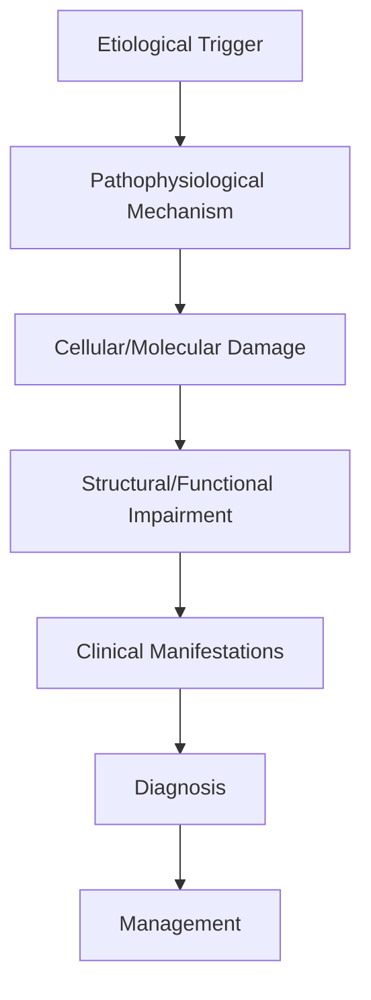
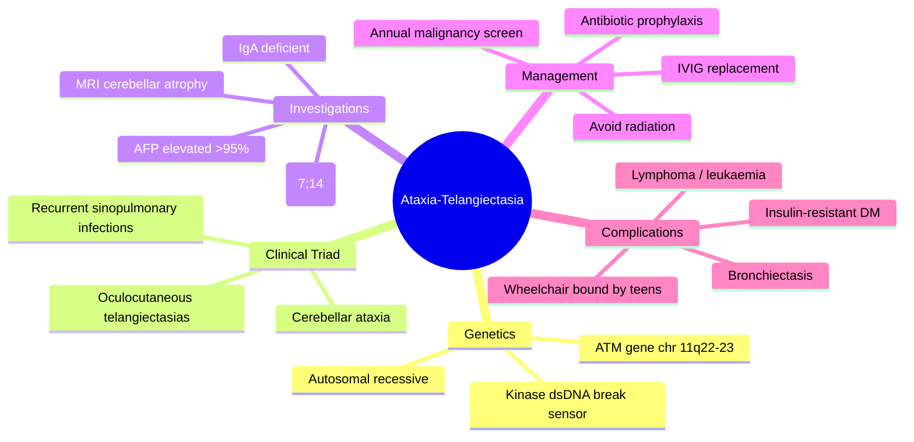

# Ataxia-Telangiectasia

> [!tip] **High-Yield Definition**
> Comprehensive clinical note for Ataxia-Telangiectasia covering definition, epidemiology, aetiology, pathophysiology, clinical features, investigations, differential diagnosis, management, drug interactions, procedures, complications, red flags, prognosis, topic correlation, and special situations for FCPS/MRCP examination preparation based on Davidson 24th Edition Chapter 25: Neurology.

---

## 1. Definition / Epidemiology / Classification

### Definition
Ataxia-Telangiectasia is a neurological disorder within the 18 genetic neurological disorders category. It is characterised by specific clinical, pathological, radiological, and laboratory features that allow differentiation from related conditions.

### Epidemiology
- **Incidence/Prevalence:** Variable depending on the specific condition.
- **Age:** Adult onset is most common, but paediatric and elderly presentations occur.
- **Sex:** Variable depending on the condition.
- **Geography:** Worldwide distribution, with higher prevalence in certain regions.
- **Risk Factors:** Genetic predisposition, environmental factors, comorbidities, family history.

### Classification
| Subtype | Key Features | Prognosis |
|---------|-------------|-----------|
| Mild/early | Subtle symptoms, preserved function | Best |
| Moderate | Clear symptoms, functional impairment | Variable |
| Severe | Significant disability, complications | Worst |

---

## 2. Aetiology / Pathophysiology

### Aetiology
- **Primary (idiopathic):** Most cases have no identifiable cause.
- **Genetic:** May be inherited (AD, AR, X-linked, mitochondrial, sporadic).
- **Autoimmune:** Autoantibodies, immune-mediated inflammation.
- **Infectious:** Viral, bacterial, fungal, parasitic.
- **Metabolic:** Electrolyte, endocrine, hepatic, renal, nutritional.
- **Toxic:** Drugs, alcohol, heavy metals, environmental toxins.
- **Vascular:** Ischaemia, haemorrhage, vasculitis.
- **Neoplastic:** Primary, secondary, paraneoplastic.
- **Traumatic:** Acute, chronic, repetitive.
- **Degenerative:** Neurodegeneration, protein misfolding.

### Pathophysiology


---

## 3. Clinical Features

### History
- **Onset/Duration:** Acute, subacute, or chronic.
- **Progression:** Static, progressive, relapsing-remitting, stepwise.
- **Key symptoms:** Specific to the condition.
- **Triggers:** Stress, infection, trauma, drugs, hormonal, environmental.
- **Systemic symptoms:** Constitutional features.
- **Drug/Family/Social history:** Relevant exposures, comorbidities.

### Examination
| Domain | Key Findings | Localisation Value |
|--------|-------------|-------------------|
| Higher function | Cognitive, behavioural | Cortical, subcortical, limbic |
| Cranial nerves | Pupils, eye movements, facial, bulbar | Brainstem, cranial nerve, NMJ |
| Motor | Weakness, tone, reflexes | UMN, LMN, NMJ, muscle |
| Sensory | All modalities, pattern | Peripheral, spinal, brainstem |
| Coordination | Ataxia, nystagmus, dysmetria | Cerebellar, sensory, vestibular |
| Gait | Spastic, ataxic, parkinsonian | Multiple |
| Autonomic | Orthostatic, sweating, GI, bladder | Autonomic, peripheral, central |

### Specific Clinical Features
The clinical features are determined by the underlying aetiology, location of pathology, and rate of progression. Patients typically present with a constellation of symptoms and signs that allow clinical localisation and subsequent targeted investigation.

---

## 4. Diagnostic Approach / Algorithm

```mermaid
flowchart TD
    A[Clinical Presentation] --> B[Anatomical Localisation]
    B --> C[Pathophysiological Category]
    C --> D[Formulate Differential]
    D --> E[Targeted Investigations]
    E --> F[Confirm Diagnosis]
    F --> G[Assess Severity/Prognosis]
    G --> H[Initiate Management]
    H --> I[Monitor Response]
    I --> J{Response?}
    J --> YES1 [Good - Continue]
    J --> NO1 [Poor - Escalate]
    YES1 --> K[Monitor]
    NO1 --> H
```

---

## 5. Investigations

### First-Line Investigations
- **Blood tests:** FBC, U&Es, LFTs, glucose, calcium, magnesium, ESR, CRP, autoimmune, infection.
- **Imaging:** CT/MRI brain/spine (essential for most neurological conditions).
- **Neurophysiology:** EEG, nerve conduction, EMG, evoked potentials.
- **CSF:** Cell count, protein, glucose, OCBs, PCR, culture.

### Second-Line Investigations
- **Genetic testing:** Gene panels, WES, WGS.
- **Antibody testing:** Antineuronal, autoimmune, paraneoplastic.
- **Biopsy:** Nerve, muscle, brain, skin.
- **Advanced imaging:** PET-CT, MR spectroscopy, fMRI.

### Specialised Investigations
- **Biomarkers:** Neurofilament light chain, tau, beta-amyloid, 14-3-3, RT-QuIC.
- **Autonomic testing:** Head-up tilt, sudomotor, QSART.
- **Neuropsychology:** Cognitive testing, behavioural assessment.
- **Genetic counselling:** Family screening, predictive testing.

---

## 6. Differential Diagnosis

| Differential | Distinguishing Features | Key Test |
|--------------|------------------------|----------|
| Vascular | Sudden onset, focal, vascular risk factors | MRI/CT, vessel imaging |
| Inflammatory | Subacute, multifocal, systemic | MRI, CSF, antibodies |
| Infectious | Fever, systemic, exposure | Bloods, CSF, imaging |
| Neoplastic | Progressive, mass effect | MRI, biopsy |
| Degenerative | Progressive, symmetric, hereditary | MRI, genetic |
| Toxic/Metabolic | Drug history, systemic, reversible | Bloods, toxicology |
| Autoimmune | Multifocal, antibodies, immunotherapy response | Antibodies, MRI, CSF |
| Functional | Inconsistent, distractible | Clinical, video, biomarkers |

---

## 7. Management

### Acute Management
- **Stabilisation:** ABCDE approach, emergency resuscitation.
- **Specific treatment:** Disease-specific interventions.
- **Symptomatic relief:** Pain, seizures, spasticity, autonomic dysfunction.
- **Prevention of complications:** DVT, pressure sores, infection.

### Disease-Modifying Treatment
- **Pharmacological:** First-line, second-line, escalation, maintenance.
- **Procedural:** Surgery, biopsy, drainage, ablation, stimulation.
- **Immunotherapy:** Steroids, IVIG, plasma exchange, immunosuppressants, biologics.
- **Rehabilitation:** Physiotherapy, OT, speech therapy.

### Long-Term Management
- **Monitoring:** Clinical, imaging, biomarkers, side effects.
- **Prevention:** Vaccinations, prophylaxis, lifestyle modification.
- **Supportive care:** Multidisciplinary team, social work, psychological support.
- **Palliative care:** Advanced care planning, end-of-life care, hospice.

---

## 8. Drug Interactions / Contraindications / Comorbidity Cautions

| Drug Class | Interaction / Caution | Management |
|------------|----------------------|------------|
| Antiseizure medications | Enzyme induction, teratogenicity | Monitor, supplement, switch |
| Immunosuppressants | Infection, malignancy, teratogenicity | Monitor, prophylaxis |
| Anticoagulants | Bleeding risk, drug interactions | Monitor INR, avoid combinations |
| Antihypertensives | Hypotension, falls | Monitor BP, adjust dose |
| Antibiotics | Nephrotoxicity, ototoxicity | Monitor renal |
| Antivirals | Nephrotoxicity, neuropsychiatric | Monitor renal, dose adjust |
| Steroids | DM, HTN, osteoporosis, infection | Monitor, prophylaxis, taper |
| Biologics | Infusion reactions, infection | Monitor, prophylaxis |

---

## 9. Procedures

### Common Procedures
- **Lumbar puncture:** Diagnostic, therapeutic (IIH, NPH). Contraindications: raised ICP, mass lesion, coagulopathy.
- **Nerve conduction studies/EMG:** Diagnostic, prognosis. Minor discomfort.
- **EEG:** Diagnostic, monitoring. No significant complications.
- **MRI brain/spine:** Diagnostic, monitoring. Contraindications: pacemaker, metallic implants.
- **CT head:** Emergency, rapid. Radiation exposure, contrast reactions.
- **Biopsy:** Stereotactic, open. Indications: diagnosis, molecular profiling.

---

## 10. Complications

| Complication | Frequency | Prevention | Management |
|--------------|-----------|------------|------------|
| Infection | Common | Hygiene, prophylaxis, vaccination | Antibiotics, antifungals |
| Thrombosis | Common | Prophylaxis, mobility | Anticoagulation |
| Pressure sores | Common | Positioning, nutrition | Wound care, surgery |
| Spasticity | Common | Positioning, stretching | Baclofen, BoNT |
| Contractures | Common | Passive movements, splints | Physiotherapy, surgery |
| Aspiration | Common | Swallow assessment | NGT, PEG, thickeners |
| Falls | Common | Environment, mobility | Walking aids |
| Fractures | Common | Bone health, prevention | Vitamin D, bisphosphonate |
| Depression | Common | Screening, support | Antidepressants, CBT |
| Cognitive decline | Variable | Monitoring, training | Rehabilitation |
| Autonomic dysfunction | Variable | Monitoring, hydration | Midodrine, fludrocortisone |
| Respiratory failure | Variable | Monitoring, supportive | Ventilation, NIV |
| Death | Variable | Monitoring, palliative | End-of-life care |

---

## 11. Red Flags / Emergencies

### Emergency Presentations
- **Rapid neurological deterioration:** New focal deficit, decreased consciousness, seizures.
- **Status epilepticus:** Continuous seizures >5 min.
- **Raised ICP:** Headache, vomiting, papilloedema, altered consciousness.
- **Respiratory failure:** Hypoxia, hypercapnia, ventilatory failure.
- **Cardiac arrest:** Arrhythmia, MI, pulmonary embolism.
- **Infection:** Sepsis, meningitis, abscess, encephalitis.
- **Drug toxicity:** Overdose, side effects, interactions.
- **Haemorrhage:** Intracranial, systemic, coagulopathy.

---

## 12. Prognosis

### Natural History
- **Acute:** May resolve with treatment, may progress, may be fatal.
- **Subacute:** Variable, depends on cause and treatment.
- **Chronic:** Often progressive, may be stable, may have relapses.
- **Recovery:** Variable, may be complete, partial, or none.

### Prognostic Factors
- **Favourable:** Young age, early treatment, mild disease, reversible cause, good premorbid function, family support.
- **Unfavourable:** Older age, delayed treatment, severe disease, irreversible cause, poor premorbid function, comorbidities.

---

## 13. Topic Correlation

| Related Topic | Link | Key Overlap |
|---------------|------|-------------|
| Davidson 24th Ed Chapter 25 | [[Davidson Chapter 25 - Neurology Hierarchy]] | Comprehensive neurology |
| Neurology MOC | [[Neurology MOC]] | All neurology topics |
| Drug Reference | [[../00_Index/Neurology Drug Reference]] | Medications |
| Local Hub | [[../18_Genetic_Neurological_Disorders/Hub]] | Section-specific |
| Clinical Examination | [[../01_Fundamentals_Examination/Neurological History Taking]] | Clinical approach |
| Investigation | [[../01_Fundamentals_Examination/Neuroimaging (CT-MRI) Principles]] | Imaging |

---

## 14. Special Situations

| Situation | Consideration |
|-----------|---------------|
| **Pregnancy** | Pre-conception counselling, teratogenicity, drug safety, monitoring, delivery planning, breastfeeding. |
| **Lactation** | Drug safety, breastfeeding, monitoring, support. |
| **Paediatric** | Developmental considerations, drug dosing, school, family, vaccination, growth, puberty. |
| **Elderly / Frail** | Comorbidities, polypharmacy, falls, bone health, cognition, social, end-of-life. |
| **Renal impairment** | Drug dose adjustment, monitoring, dialysis, transplant. |
| **Hepatic impairment** | Drug dose adjustment, monitoring, transplant. |
| **Immunocompromised** | Infection prophylaxis, vaccination, drug interactions, malignancy screening. |
| **Perioperative** | Drug management, anaesthesia planning, VTE prophylaxis, infection prevention, monitoring. |
| **Driving / DVLA** | Fitness to drive, restrictions, notification, reassessment. |
| **Occupational** | Fitness for work, adaptations, rehabilitation, disability, return to work. |

---

## FCPS/MRCP High-Yield Summary

| Category | Key Points |
|----------|------------|
| **Definition** | Comprehensive definition with key diagnostic criteria |
| **Epidemiology** | Incidence, prevalence, age, sex, geography, risk factors |
| **Aetiology** | Primary causes, secondary causes, genetic, environmental |
| **Pathophysiology** | Mechanism of disease, cellular/molecular basis |
| **Clinical Features** | History, examination, key findings, variants |
| **Diagnosis** | Diagnostic criteria, classification, severity |
| **Investigations** | First-line, second-line, specialised, biomarkers |
| **Differential Diagnosis** | Key differentials, distinguishing features, tests |
| **Management** | Acute, disease-modifying, symptomatic, supportive |
| **Complications** | Common, serious, prevention, management |
| **Prognosis** | Natural history, prognostic factors, outcomes |
| **Viva Pearls** | Key examination points |
| **Drug Doses** | First-line, second-line, emergency |
| **Scoring Systems** | Specific scores used in management |
| **Genetics** | Inheritance, genes, mutations, family screening |
| **Imaging Signs** | Characteristic findings, differential |

---

## Viva Questions (PACES/FCPS Style)

1. **Q:** Define and classify its variants.
   **A:** Comprehensive definition with classification of subtypes based on aetiology, severity, and clinical features.

2. **Q:** What are the key clinical features?
   **A:** Specific symptoms and signs including onset, progression, key features, and associated findings.

3. **Q:** What is the first-line treatment?
   **A:** First-line pharmacological and non-pharmacological management based on current evidence.

4. **Q:** What are the red flags requiring urgent referral?
   **A:** Specific emergency presentations and complications requiring immediate intervention.

5. **Q:** What is the prognosis?
   **A:** Natural history, prognostic factors, and long-term outcomes.

6. **Q:** How do you differentiate from key differentials?
   **A:** Clinical features, investigations, and response to treatment that distinguish from alternative diagnoses.

7. **Q:** What investigations are most useful?
   **A:** First-line and second-line investigations including imaging, neurophysiology, CSF, and biomarkers.

8. **Q:** Describe the stepwise management approach.
   **A:** Stepwise escalation from first-line to second-line to third-line therapy with monitoring.

9. **Q:** What are the emergency presentations?
   **A:** Specific emergency scenarios and immediate management priorities.

10. **Q:** How does management change in pregnancy/paediatrics/elderly?
    **A:** Special considerations for each population including drug safety, monitoring, and support.

---

## Common Confusions / Exam Traps

| Confusion | Clarification |
|-----------|---------------|
| Similar presentation but different cause | Differentiate by history, examination, investigations |
| Treatment response vs natural history | Assess with objective measures, biomarkers |
| Drug interactions | Check each drug, monitor, adjust doses |
| Disease progression vs treatment failure | Monitor response, escalate appropriately |
| Functional vs organic | Inconsistent, distractible, disability greater than impairment |
| Acute vs chronic | Time course, progression, reversibility |
| Primary vs secondary | Underlying cause, contributing factors |
| Side effects vs symptoms | Temporal relationship, dose relationship |

---

## Mnemonics

1. **ATM** — **A**taxia-**T**elangiectasia **M**utated gene; chromosome **11** (11q22-23); kinase that senses double-strand DNA breaks and activates p53.
2. **AT-AT** — **A**taxia + **T**elangiectasias (oculocutaneous); "two As + two Ts" define the syndrome.
3. **Affected Pathways** — **AIRE**: **A**taxia, **I**mmunodeficiency (IgA↓), **R**adiation sensitivity, **E**levated AFP.
4. **CART-W** — **C**erebellar atrophy, **A**FP ↑, **R**ecurrent sinopulmonary infections, **T**elangiectasias, **W**heelchair by 10-15y.
5. **Radiosensitivity Rule** — **No X-rays** in AT: avoid diagnostic/therapeutic ionising radiation → use **MRI / ultrasound** instead.
6. **Cancer Triad** — **Lymphoma – Leukaemia – (breast) cancer**: AT heterozygotes have ~2× breast cancer risk; ATM loss drives lymphoid malignancy.
7. **Ig Pattern** — **IgA deficient** most common; also IgE ↓, IgG2 ↓ → sinopulmonary and chronic lung disease.
8. **DNA Repair Defect** — ATM cannot phosphorylate p53, BRCA1, Chk2 → failure of G1/S checkpoint after dsDNA breaks.
9. **Eye Sign** — **Bulbar conjunctival telangiectasias** appear after age 3-6 (later than ataxia onset ~1-2y).
10. **AFP Clue** — **Alpha-fetoprotein is raised in >95% of AT patients after age 2y** — useful diagnostic biomarker.

---

## Mind Map



---

## Spaced Repetition Trackers

| Day | Topic | Question (front) | Answer (back) | Confidence (1-5) |
|-----|-------|------------------|---------------|------------------|
| 1 | Gene | Which gene is mutated in AT? | ATM on chromosome 11q22-23 | 4 |
| 1 | Inheritance | Mode of inheritance of AT? | Autosomal recessive | 5 |
| 2 | Triad | Three core features of AT? | Ataxia, telangiectasias, immunodeficiency | 4 |
| 3 | Biomarker | Most useful lab test for AT? | Serum AFP (raised >95% after age 2) | 3 |
| 5 | Imaging | MRI finding in AT? | Cerebellar vermis atrophy | 4 |
| 7 | Risk | Why avoid X-rays in AT? | Defective DNA repair → radiosensitivity | 5 |
| 10 | Malignancy | Common cancers in AT? | Lymphoma, leukaemia, breast (heterozygotes) | 3 |
| 14 | Ig | Commonest immunoglobulin defect? | IgA deficiency | 4 |
| 21 | Mobility | Average age of wheelchair? | 10-15 years | 4 |
| 30 | Management | Treatment for immunodeficiency? | IVIG + prophylactic antibiotics | 3 |

---

## Self-Test Scorecard

| Domain | Questions Attempted | Correct | Accuracy | Weak Areas |
|--------|---------------------|---------|----------|------------|
| Genetics & Pathogenesis | /3 | | | |
| Clinical Features | /3 | | | |
| Investigations | /2 | | | |
| Management & Prognosis | /2 | | | |
| **Overall** | **/10** | | | |

**Target:** ≥80% accuracy across all domains before progressing to PACES/FCPS vivas.

---

## MCQs (10)

1. **Q:** The gene mutated in Ataxia-Telangiectasia is located on which chromosome?
   **A:** A. 9q21  **B.** 11q22-23  **C.** 14q32  **D.** 19q13
   **Answer:** B — ATM gene on chromosome 11q22-23.
   **Explanation:** ATM (Ataxia-Telangiectasia Mutated) is a serine/threonine protein kinase located at 11q22-23, central to DNA double-strand break sensing and p53 activation.

2. **Q:** A 4-year-old presents with progressive gait ataxia, recurrent chest infections, and conjunctival telangiectasias. Which lab finding is most characteristic?
   **A:** A. Low caeruloplasmin  **B.** Raised AFP  **C.** Raised CK  **D.** Low vitamin E
   **Answer:** B — Raised AFP (>95% after age 2).
   **Explanation:** Serum alpha-fetoprotein is elevated in >95% of AT patients after age 2 years and is a key diagnostic biomarker. It reflects hepatic immaturity and chromosomal instability.

3. **Q:** Mode of inheritance in Ataxia-Telangiectasia?
   **A:** A. Autosomal dominant  **B.** Autosomal recessive  **C.** X-linked recessive  **D.** Mitochondrial
   **Answer:** B — Autosomal recessive.
   **Explanation:** AT is autosomal recessive. Heterozygotes (~1% of population) have increased radiosensitivity and cancer risk (especially breast).

4. **Q:** Which investigation should be AVOIDED in suspected AT?
   **A:** A. MRI brain  **B.** Serum AFP  **C.** CT scan  **D.** Immunoglobulin levels
   **Answer:** C — CT (ionising radiation).
   **Explanation:** AT cells cannot repair DNA double-strand breaks; ionising radiation (CT, X-ray) is hazardous. Use MRI or ultrasound for imaging.

5. **Q:** Commonest immunodeficiency in AT?
   **A:** A. IgM deficiency  **B.** IgA deficiency  **C.** IgG only deficiency  **D.** Complement C5-C9
   **Answer:** B — IgA deficiency.
   **Explanation:** IgA deficiency is most common, occurring in ~70% of patients. IgE and IgG2 may also be low, contributing to sinopulmonary infections and bronchiectasis.

6. **Q:** Pathognomonic chromosomal translocation seen on karyotype in AT?
   **A:** A. t(9;22)  **B.** t(7;14)  **C.** t(14;18)  **D.** t(8;14)
   **Answer:** B — t(7;14).
   **Explanation:** Clonal rearrangements involving chromosomes 7 and 14 (sites of T-cell receptor and immunoglobulin heavy chain genes) are seen in AT lymphocytes, reflecting defective DNA repair.

7. **Q:** Which of the following is NOT a feature of AT?
   **A:** A. Cerebellar ataxia  **B.** Oculocutaneous telangiectasias  **C.** Optic glioma  **D.** Raised AFP
   **Answer:** C — Optic glioma (this is NF1).
   **Explanation:** Optic pathway glioma is characteristic of Neurofibromatosis type 1, not AT. The diagnostic triad of AT is ataxia, telangiectasias, and immunodeficiency.

8. **Q:** Cells from AT patients show which laboratory feature?
   **A:** A. Increased sensitivity to ionising radiation  **B.** Decreased sensitivity to UV  **C.** Normal karyotype  **D.** Increased DNA repair
   **Answer:** A — Increased radiosensitivity.
   **Explanation:** AT cells have defective DNA double-strand break repair and show increased chromosomal breakage after X-ray exposure, forming the basis of diagnostic radiosensitivity assays.

9. **Q:** Life expectancy in AT is most limited by which complication?
   **A:** A. Renal failure  **B.** Malignancy / respiratory failure  **C.** Stroke  **D.** Myocardial infarction
   **Answer:** B — Malignancy (lymphoma/leukaemia) and chronic respiratory failure.
   **Explanation:** Median survival is 20-30 years. Most die from malignancy (lymphoma, leukaemia) or chronic lung disease secondary to immunodeficiency and bronchiectasis.

10. **Q:** Which cancer is increased in AT heterozygotes (carriers)?
    **A:** A. Lung cancer  **B.** Breast cancer  **C.** Colon cancer  **D.** Prostate cancer
    **Answer:** B — Breast cancer.
    **Explanation:** Female AT heterozygotes have a 2-5× increased risk of breast cancer. ATM mutation testing is considered in familial breast cancer panels.

---

## SBA Questions (10)

1. **Scenario:** 3-year-old boy with progressive gait ataxia, frequent chest infections, and conjunctival telangiectasias. AFP 250 ng/mL (raised). What is the most likely diagnosis?
   **Options:** A. Friedreich's ataxia  **B.** Ataxia-telangiectasia  **C.** Cerebral palsy  **D.** Spinocerebellar ataxia
   **Answer:** B — Classic AT presentation.
   **Explanation:** Ataxic gait onset 1-2 years, recurrent infections (immunodeficiency), and conjunctival telangiectasias (3-6y) with raised AFP are diagnostic of AT. FRDA presents later with cardiomyopathy and absent reflexes.

2. **Scenario:** A child with AT requires imaging for possible cerebellar mass. Which modality is preferred?
   **Options:** A. CT head  **B.** MRI brain  **C.** PET-CT  **D.** X-ray skull
   **Answer:** B — MRI brain.
   **Explanation:** MRI uses no ionising radiation and is the imaging modality of choice in AT due to extreme radiosensitivity and increased risk of radiation-induced malignancy.

3. **Scenario:** AT patient with recurrent sinopulmonary infections, IgA <0.05 g/L. What prophylaxis is appropriate?
   **Options:** A. Oral ribavirin  **B.** IVIG + antibiotic prophylaxis  **C.** Antifungal only  **D.** No prophylaxis needed
   **Answer:** B — IVIG + antibiotic prophylaxis.
   **Explanation:** IVIG replacement for antibody deficiency and prophylactic antibiotics (e.g., azithromycin, co-trimoxazole) reduce sinopulmonary infections and progression to bronchiectasis.

4. **Scenario:** Parents of an AT child ask about recurrence risk in future pregnancy. What is the risk?
   **Options:** A. 0%  **B.** 25%  **C.** 50%  **D.** 100%
   **Answer:** B — 25% (autosomal recessive).
   **Explanation:** AT is autosomal recessive. Each subsequent pregnancy has a 25% chance of an affected child, 50% carrier, 25% unaffected non-carrier. Prenatal diagnosis is available.

5. **Scenario:** 6-year-old AT patient with progressive cough, clubbing, and CT showing bilateral bronchiectasis. What is the next step?
   **Options:** A. Lobectomy  **B.** Long-term IVIG + chest physiotherapy + prophylactic antibiotics  **C.** Inhaled steroids only  **D.** Observation
   **Answer:** B — Comprehensive management.
   **Explanation:** Bronchiectasis in AT requires multimodal therapy: IVIG replacement, prophylactic and prompt antibiotics, chest physiotherapy, postural drainage, and immunisation (influenza, pneumococcal).

6. **Scenario:** Adult sibling (asymptomatic) of an AT patient is found to be a heterozygote. What screening should be offered?
   **Options:** A. No screening  **B.** Annual breast MRI/mammography from age 30-40  **C.** Annual CT chest  **D.** Colonoscopy only
   **Answer:** B — Enhanced breast cancer screening.
   **Explanation:** AT heterozygotes have increased breast cancer risk (2-5×); enhanced surveillance with annual MRI/mammography from age 30-40 is recommended per NCCN guidelines.

7. **Scenario:** 4-year-old with AT presents with new cervical lymphadenopathy and weight loss. Most appropriate investigation?
   **Options:** A. Trial of antibiotics  **B.** Lymph node biopsy with minimal handling  **C.** Empiric anti-TB  **D.** Reassurance
   **Answer:** B — Lymph node biopsy.
   **Explanation:** Persistent lymphadenopathy with systemic symptoms raises concern for lymphoma/leukaemia, which occurs in ~30% of AT patients. Tissue diagnosis is required; minimise radiation exposure during workup.

8. **Scenario:** AT patient on long-term surveillance develops fasting glucose 12 mmol/L. What is the mechanism?
   **Options:** A. Type 1 autoimmune  **B.** Insulin resistance  **C.** MODY  **D.** Steroid-induced
   **Answer:** B — Insulin resistance.
   **Explanation:** AT is associated with insulin-resistant diabetes due to defective insulin signalling; patients may also develop hyperlipidaemia and hepatic steatosis.

9. **Scenario:** Pregnant carrier of ATM mutation has fetus confirmed affected. What counselling is appropriate?
   **Options:** A. Termination only  **B.** Genetic counselling + prenatal diagnosis options (CVS/amniocentesis) + family planning  **C.** No intervention  **D.** Stem cell therapy
   **Answer:** B — Comprehensive genetic counselling.
   **Explanation:** Multidisciplinary genetic counselling is essential; discuss prognosis, available support, prenatal diagnosis (CVS at 11-13 weeks), pre-implantation genetic diagnosis, and family planning options.

10. **Scenario:** AT child requires live vaccines. Which is contraindicated?
    **Options:** A. MMR  **B.** Inactivated polio  **C.** BCG (live attenuated)  **D.** Hepatitis B
    **Answer:** C — BCG (live).
    **Explanation:** Live vaccines (BCG, oral polio, MMR in severely immunodeficient, varicella) are contraindicated in AT due to immunodeficiency. Inactivated vaccines (IPV, HBV) and annual influenza are recommended.

---

## Tags

`#ataxia-telangiectasia` `#ATM-gene` `#chromosome-11` `#autosomal-recessive` `#cerebellar-ataxia` `#oculocutaneous-telangiectasias` `#IgA-deficiency` `#radiosensitivity` `#elevated-AFP` `#bronchiectasis` `#lymphoma` `#leukaemia` `#breast-cancer-heterozygote` `#IVIG` `#genetic-counselling` `#FCPS` `#MRCP` `#neurology-genetics`
## Local Navigation
**Heading Hub:** [[../Hub]]  
**Chapter Hierarchy:** [[Davidson Chapter 25 - Neurology Hierarchy]]  
**Chapter MOC:** [[Neurology MOC]]  
**Drug Reference:** [[../00_Index/Neurology Drug Reference]]

## PasTest Scenario SBAs (Clinical Vignettes)

> **Auto-generated PasTest/Mediscope-style scenario SBAs** grounded in the authored source. Each scenario tests a real clinical fact (triad, specific sign, contraindication, trial, first-line Rx) extracted from the topic. *Source: Ch 27: Neurology & Stroke — Ataxia-Telangiectasia*

**Q1.** Which of the following features is most specific or characteristic of Ataxia-Telangiectasia?

  - **A.** Key symptoms:
  - **B.** A feature common to many acute inflammatory conditions
  - **C.** A non-specific sign that does not localise the diagnosis
  - **D.** An investigation finding rather than a clinical feature

  > **Answer: A** — Key symptoms:
  >
  > *Source:* - **Key symptoms:** Specific to the condition

**Q2.** What is the most appropriate first-line therapy for Ataxia-Telangiectasia?

  - **A.** Rehabilitation:
  - **B.** An advanced/surgical therapy reserved for refractory disease
  - **C.** Symptomatic treatment only, no disease-modifying therapy
  - **D.** Empiric broad-spectrum therapy without specific indication

  > **Answer: A** — Rehabilitation:
  >
  > *Source:* **Rehabilitation:** Physiotherapy, OT, speech therapy.

