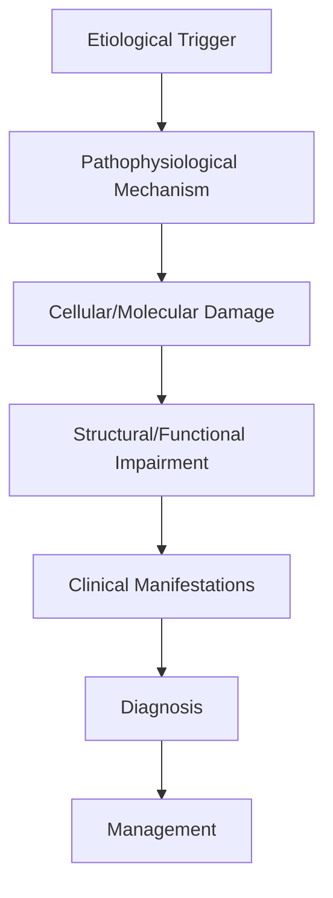
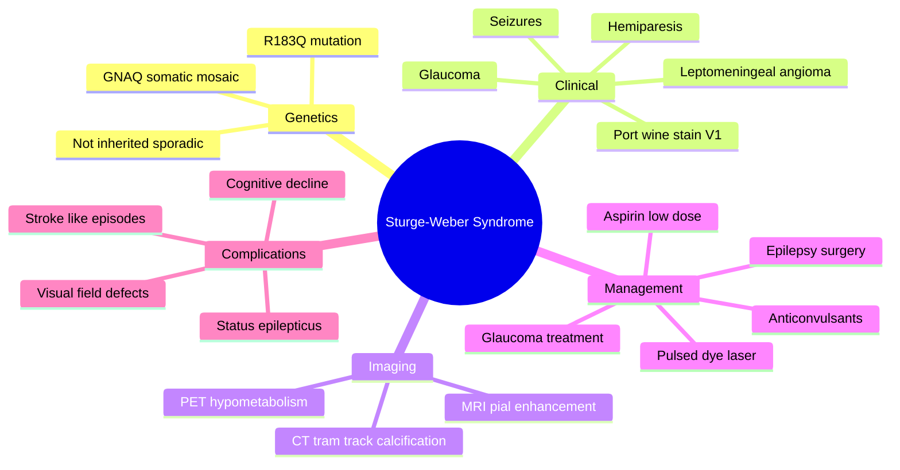

# Sturge-Weber Syndrome

> [!tip] **High-Yield Definition**
> Comprehensive clinical note for Sturge-Weber Syndrome covering definition, epidemiology, aetiology, pathophysiology, clinical features, investigations, differential diagnosis, management, drug interactions, procedures, complications, red flags, prognosis, topic correlation, and special situations for FCPS/MRCP examination preparation based on Davidson 24th Edition Chapter 25: Neurology.

---

## 1. Definition / Epidemiology / Classification

### Definition
Sturge-Weber Syndrome is a neurological disorder within the 18 genetic neurological disorders category. It is characterised by specific clinical, pathological, radiological, and laboratory features that allow differentiation from related conditions.

### Epidemiology
- **Incidence/Prevalence:** Variable depending on the specific condition.
- **Age:** Adult onset is most common, but paediatric and elderly presentations occur.
- **Sex:** Variable depending on the condition.
- **Geography:** Worldwide distribution, with higher prevalence in certain regions.
- **Risk Factors:** Genetic predisposition, environmental factors, comorbidities, family history.

### Classification
| Subtype | Key Features | Prognosis |
|---------|-------------|-----------|
| Mild/early | Subtle symptoms, preserved function | Best |
| Moderate | Clear symptoms, functional impairment | Variable |
| Severe | Significant disability, complications | Worst |

---

## 2. Aetiology / Pathophysiology

### Aetiology
- **Primary (idiopathic):** Most cases have no identifiable cause.
- **Genetic:** May be inherited (AD, AR, X-linked, mitochondrial, sporadic).
- **Autoimmune:** Autoantibodies, immune-mediated inflammation.
- **Infectious:** Viral, bacterial, fungal, parasitic.
- **Metabolic:** Electrolyte, endocrine, hepatic, renal, nutritional.
- **Toxic:** Drugs, alcohol, heavy metals, environmental toxins.
- **Vascular:** Ischaemia, haemorrhage, vasculitis.
- **Neoplastic:** Primary, secondary, paraneoplastic.
- **Traumatic:** Acute, chronic, repetitive.
- **Degenerative:** Neurodegeneration, protein misfolding.

### Pathophysiology


---

## 3. Clinical Features

### History
- **Onset/Duration:** Acute, subacute, or chronic.
- **Progression:** Static, progressive, relapsing-remitting, stepwise.
- **Key symptoms:** Specific to the condition.
- **Triggers:** Stress, infection, trauma, drugs, hormonal, environmental.
- **Systemic symptoms:** Constitutional features.
- **Drug/Family/Social history:** Relevant exposures, comorbidities.

### Examination
| Domain | Key Findings | Localisation Value |
|--------|-------------|-------------------|
| Higher function | Cognitive, behavioural | Cortical, subcortical, limbic |
| Cranial nerves | Pupils, eye movements, facial, bulbar | Brainstem, cranial nerve, NMJ |
| Motor | Weakness, tone, reflexes | UMN, LMN, NMJ, muscle |
| Sensory | All modalities, pattern | Peripheral, spinal, brainstem |
| Coordination | Ataxia, nystagmus, dysmetria | Cerebellar, sensory, vestibular |
| Gait | Spastic, ataxic, parkinsonian | Multiple |
| Autonomic | Orthostatic, sweating, GI, bladder | Autonomic, peripheral, central |

### Specific Clinical Features
The clinical features are determined by the underlying aetiology, location of pathology, and rate of progression. Patients typically present with a constellation of symptoms and signs that allow clinical localisation and subsequent targeted investigation.

---

## 4. Diagnostic Approach / Algorithm

```mermaid
flowchart TD
    A[Clinical Presentation] --> B[Anatomical Localisation]
    B --> C[Pathophysiological Category]
    C --> D[Formulate Differential]
    D --> E[Targeted Investigations]
    E --> F[Confirm Diagnosis]
    F --> G[Assess Severity/Prognosis]
    G --> H[Initiate Management]
    H --> I[Monitor Response]
    I --> J{Response?}
    J --> YES1 [Good - Continue]
    J --> NO1 [Poor - Escalate]
    YES1 --> K[Monitor]
    NO1 --> H
```

---

## 5. Investigations

### First-Line Investigations
- **Blood tests:** FBC, U&Es, LFTs, glucose, calcium, magnesium, ESR, CRP, autoimmune, infection.
- **Imaging:** CT/MRI brain/spine (essential for most neurological conditions).
- **Neurophysiology:** EEG, nerve conduction, EMG, evoked potentials.
- **CSF:** Cell count, protein, glucose, OCBs, PCR, culture.

### Second-Line Investigations
- **Genetic testing:** Gene panels, WES, WGS.
- **Antibody testing:** Antineuronal, autoimmune, paraneoplastic.
- **Biopsy:** Nerve, muscle, brain, skin.
- **Advanced imaging:** PET-CT, MR spectroscopy, fMRI.

### Specialised Investigations
- **Biomarkers:** Neurofilament light chain, tau, beta-amyloid, 14-3-3, RT-QuIC.
- **Autonomic testing:** Head-up tilt, sudomotor, QSART.
- **Neuropsychology:** Cognitive testing, behavioural assessment.
- **Genetic counselling:** Family screening, predictive testing.

---

## 6. Differential Diagnosis

| Differential | Distinguishing Features | Key Test |
|--------------|------------------------|----------|
| Vascular | Sudden onset, focal, vascular risk factors | MRI/CT, vessel imaging |
| Inflammatory | Subacute, multifocal, systemic | MRI, CSF, antibodies |
| Infectious | Fever, systemic, exposure | Bloods, CSF, imaging |
| Neoplastic | Progressive, mass effect | MRI, biopsy |
| Degenerative | Progressive, symmetric, hereditary | MRI, genetic |
| Toxic/Metabolic | Drug history, systemic, reversible | Bloods, toxicology |
| Autoimmune | Multifocal, antibodies, immunotherapy response | Antibodies, MRI, CSF |
| Functional | Inconsistent, distractible | Clinical, video, biomarkers |

---

## 7. Management

### Acute Management
- **Stabilisation:** ABCDE approach, emergency resuscitation.
- **Specific treatment:** Disease-specific interventions.
- **Symptomatic relief:** Pain, seizures, spasticity, autonomic dysfunction.
- **Prevention of complications:** DVT, pressure sores, infection.

### Disease-Modifying Treatment
- **Pharmacological:** First-line, second-line, escalation, maintenance.
- **Procedural:** Surgery, biopsy, drainage, ablation, stimulation.
- **Immunotherapy:** Steroids, IVIG, plasma exchange, immunosuppressants, biologics.
- **Rehabilitation:** Physiotherapy, OT, speech therapy.

### Long-Term Management
- **Monitoring:** Clinical, imaging, biomarkers, side effects.
- **Prevention:** Vaccinations, prophylaxis, lifestyle modification.
- **Supportive care:** Multidisciplinary team, social work, psychological support.
- **Palliative care:** Advanced care planning, end-of-life care, hospice.

---

## 8. Drug Interactions / Contraindications / Comorbidity Cautions

| Drug Class | Interaction / Caution | Management |
|------------|----------------------|------------|
| Antiseizure medications | Enzyme induction, teratogenicity | Monitor, supplement, switch |
| Immunosuppressants | Infection, malignancy, teratogenicity | Monitor, prophylaxis |
| Anticoagulants | Bleeding risk, drug interactions | Monitor INR, avoid combinations |
| Antihypertensives | Hypotension, falls | Monitor BP, adjust dose |
| Antibiotics | Nephrotoxicity, ototoxicity | Monitor renal |
| Antivirals | Nephrotoxicity, neuropsychiatric | Monitor renal, dose adjust |
| Steroids | DM, HTN, osteoporosis, infection | Monitor, prophylaxis, taper |
| Biologics | Infusion reactions, infection | Monitor, prophylaxis |

---

## 9. Procedures

### Common Procedures
- **Lumbar puncture:** Diagnostic, therapeutic (IIH, NPH). Contraindications: raised ICP, mass lesion, coagulopathy.
- **Nerve conduction studies/EMG:** Diagnostic, prognosis. Minor discomfort.
- **EEG:** Diagnostic, monitoring. No significant complications.
- **MRI brain/spine:** Diagnostic, monitoring. Contraindications: pacemaker, metallic implants.
- **CT head:** Emergency, rapid. Radiation exposure, contrast reactions.
- **Biopsy:** Stereotactic, open. Indications: diagnosis, molecular profiling.

---

## 10. Complications

| Complication | Frequency | Prevention | Management |
|--------------|-----------|------------|------------|
| Infection | Common | Hygiene, prophylaxis, vaccination | Antibiotics, antifungals |
| Thrombosis | Common | Prophylaxis, mobility | Anticoagulation |
| Pressure sores | Common | Positioning, nutrition | Wound care, surgery |
| Spasticity | Common | Positioning, stretching | Baclofen, BoNT |
| Contractures | Common | Passive movements, splints | Physiotherapy, surgery |
| Aspiration | Common | Swallow assessment | NGT, PEG, thickeners |
| Falls | Common | Environment, mobility | Walking aids |
| Fractures | Common | Bone health, prevention | Vitamin D, bisphosphonate |
| Depression | Common | Screening, support | Antidepressants, CBT |
| Cognitive decline | Variable | Monitoring, training | Rehabilitation |
| Autonomic dysfunction | Variable | Monitoring, hydration | Midodrine, fludrocortisone |
| Respiratory failure | Variable | Monitoring, supportive | Ventilation, NIV |
| Death | Variable | Monitoring, palliative | End-of-life care |

---

## 11. Red Flags / Emergencies

### Emergency Presentations
- **Rapid neurological deterioration:** New focal deficit, decreased consciousness, seizures.
- **Status epilepticus:** Continuous seizures >5 min.
- **Raised ICP:** Headache, vomiting, papilloedema, altered consciousness.
- **Respiratory failure:** Hypoxia, hypercapnia, ventilatory failure.
- **Cardiac arrest:** Arrhythmia, MI, pulmonary embolism.
- **Infection:** Sepsis, meningitis, abscess, encephalitis.
- **Drug toxicity:** Overdose, side effects, interactions.
- **Haemorrhage:** Intracranial, systemic, coagulopathy.

---

## 12. Prognosis

### Natural History
- **Acute:** May resolve with treatment, may progress, may be fatal.
- **Subacute:** Variable, depends on cause and treatment.
- **Chronic:** Often progressive, may be stable, may have relapses.
- **Recovery:** Variable, may be complete, partial, or none.

### Prognostic Factors
- **Favourable:** Young age, early treatment, mild disease, reversible cause, good premorbid function, family support.
- **Unfavourable:** Older age, delayed treatment, severe disease, irreversible cause, poor premorbid function, comorbidities.

---

## 13. Topic Correlation

| Related Topic | Link | Key Overlap |
|---------------|------|-------------|
| Davidson 24th Ed Chapter 25 | [[Davidson Chapter 25 - Neurology Hierarchy]] | Comprehensive neurology |
| Neurology MOC | [[Neurology MOC]] | All neurology topics |
| Drug Reference | [[../00_Index/Neurology Drug Reference]] | Medications |
| Local Hub | [[../18_Genetic_Neurological_Disorders/Hub]] | Section-specific |
| Clinical Examination | [[../01_Fundamentals_Examination/Neurological History Taking]] | Clinical approach |
| Investigation | [[../01_Fundamentals_Examination/Neuroimaging (CT-MRI) Principles]] | Imaging |

---

## 14. Special Situations

| Situation | Consideration |
|-----------|---------------|
| **Pregnancy** | Pre-conception counselling, teratogenicity, drug safety, monitoring, delivery planning, breastfeeding. |
| **Lactation** | Drug safety, breastfeeding, monitoring, support. |
| **Paediatric** | Developmental considerations, drug dosing, school, family, vaccination, growth, puberty. |
| **Elderly / Frail** | Comorbidities, polypharmacy, falls, bone health, cognition, social, end-of-life. |
| **Renal impairment** | Drug dose adjustment, monitoring, dialysis, transplant. |
| **Hepatic impairment** | Drug dose adjustment, monitoring, transplant. |
| **Immunocompromised** | Infection prophylaxis, vaccination, drug interactions, malignancy screening. |
| **Perioperative** | Drug management, anaesthesia planning, VTE prophylaxis, infection prevention, monitoring. |
| **Driving / DVLA** | Fitness to drive, restrictions, notification, reassessment. |
| **Occupational** | Fitness for work, adaptations, rehabilitation, disability, return to work. |

---

## FCPS/MRCP High-Yield Summary

| Category | Key Points |
|----------|------------|
| **Definition** | Comprehensive definition with key diagnostic criteria |
| **Epidemiology** | Incidence, prevalence, age, sex, geography, risk factors |
| **Aetiology** | Primary causes, secondary causes, genetic, environmental |
| **Pathophysiology** | Mechanism of disease, cellular/molecular basis |
| **Clinical Features** | History, examination, key findings, variants |
| **Diagnosis** | Diagnostic criteria, classification, severity |
| **Investigations** | First-line, second-line, specialised, biomarkers |
| **Differential Diagnosis** | Key differentials, distinguishing features, tests |
| **Management** | Acute, disease-modifying, symptomatic, supportive |
| **Complications** | Common, serious, prevention, management |
| **Prognosis** | Natural history, prognostic factors, outcomes |
| **Viva Pearls** | Key examination points |
| **Drug Doses** | First-line, second-line, emergency |
| **Scoring Systems** | Specific scores used in management |
| **Genetics** | Inheritance, genes, mutations, family screening |
| **Imaging Signs** | Characteristic findings, differential |

---

## Viva Questions (PACES/FCPS Style)

1. **Q:** Define and classify its variants.
   **A:** Comprehensive definition with classification of subtypes based on aetiology, severity, and clinical features.

2. **Q:** What are the key clinical features?
   **A:** Specific symptoms and signs including onset, progression, key features, and associated findings.

3. **Q:** What is the first-line treatment?
   **A:** First-line pharmacological and non-pharmacological management based on current evidence.

4. **Q:** What are the red flags requiring urgent referral?
   **A:** Specific emergency presentations and complications requiring immediate intervention.

5. **Q:** What is the prognosis?
   **A:** Natural history, prognostic factors, and long-term outcomes.

6. **Q:** How do you differentiate from key differentials?
   **A:** Clinical features, investigations, and response to treatment that distinguish from alternative diagnoses.

7. **Q:** What investigations are most useful?
   **A:** First-line and second-line investigations including imaging, neurophysiology, CSF, and biomarkers.

8. **Q:** Describe the stepwise management approach.
   **A:** Stepwise escalation from first-line to second-line to third-line therapy with monitoring.

9. **Q:** What are the emergency presentations?
   **A:** Specific emergency scenarios and immediate management priorities.

10. **Q:** How does management change in pregnancy/paediatrics/elderly?
    **A:** Special considerations for each population including drug safety, monitoring, and support.

---

## Common Confusions / Exam Traps

| Confusion | Clarification |
|-----------|---------------|
| Similar presentation but different cause | Differentiate by history, examination, investigations |
| Treatment response vs natural history | Assess with objective measures, biomarkers |
| Drug interactions | Check each drug, monitor, adjust doses |
| Disease progression vs treatment failure | Monitor response, escalate appropriately |
| Functional vs organic | Inconsistent, distractible, disability greater than impairment |
| Acute vs chronic | Time course, progression, reversibility |
| Primary vs secondary | Underlying cause, contributing factors |
| Side effects vs symptoms | Temporal relationship, dose relationship |

---

## Mnemonics

1. **GNAQ** — Somatic mosaic mutation in **GNAQ** (guanine nucleotide-binding protein alpha-q) on chromosome 9q21, often **R183Q**.
2. **PWS Rule** — **Port-wine stain** (nevus flammeus) in **V1 distribution** of trigeminal nerve carries the highest CNS risk.
3. **Bilateral Stain = Bilateral Disease** — Bilateral facial PWS = high risk of **bilateral leptomeningeal angioma**.
4. **Tram-Track Sign** — **Parieto-occipital cortical calcification** on CT/MRI ("tram-line" or "gyriform" calcification) is pathognomonic.
5. **Triad** — **Port-wine stain + Leptomeningeal angioma + Glaucoma** (seizures, hemiparesis, cognitive impairment follow).
6. **Leptomeningeal Angioma** — Abnormal pial vessels over one hemisphere → cortical ischaemia → atrophy, calcification, seizures.
7. **Aspirin** — **Low-dose aspirin** (3-5 mg/kg/day) used to reduce stroke-like episodes from venous stasis.
8. **Glaucoma** — Present in 30-70%; ipsilateral to PWS; onset in infancy or childhood; needs lifelong monitoring.
9. **Seizure Onset** — Usually in first 1-2 years; often focal motor with secondary generalisation; consider early surgery if refractory.
10. **Pulsed-Dye Laser** — **First-line for PWS** to lighten the stain (pulsed-dye laser 595 nm), ideally started in infancy.

---

## Mind Map



---

## Spaced Repetition Trackers

| Day | Topic | Question (front) | Answer (back) | Confidence (1-5) |
|-----|-------|------------------|---------------|------------------|
| 1 | Gene | Gene mutated in SWS? | GNAQ (somatic mosaic) | 4 |
| 1 | Stain | Trigeminal branch of PWS with CNS risk? | V1 (ophthalmic) | 5 |
| 2 | Imaging | Pathognomonic CT sign? | "Tram-track" gyriform calcification | 5 |
| 3 | Glaucoma | Risk of glaucoma in SWS? | 30-70%, ipsilateral to PWS | 4 |
| 5 | Aspirin | Aspirin use in SWS? | Low-dose to prevent stroke-like episodes | 4 |
| 7 | Laser | First-line treatment for PWS? | Pulsed-dye laser | 4 |
| 10 | Seizures | First-line anticonvulsant in SWS? | Carbamazepine / oxcarbazepine (avoid vigabatrin) | 3 |
| 14 | Surgery | Indication for hemispherectomy? | Drug-resistant epilepsy with hemiparesis | 3 |
| 21 | Stroke | Mechanism of stroke-like episodes? | Venous stasis from leptomeningeal angioma | 4 |
| 30 | Inheritance | Inherited or sporadic? | Sporadic, somatic mosaic | 5 |

---

## Self-Test Scorecard

| Domain | Questions Attempted | Correct | Accuracy | Weak Areas |
|--------|---------------------|---------|----------|------------|
| Genetics & Pathogenesis | /3 | | | |
| Clinical Features | /3 | | | |
| Investigations & Imaging | /2 | | | |
| Management | /2 | | | |
| **Overall** | **/10** | | | |

---

## MCQs (10)

1. **Q:** The somatic mosaic mutation in Sturge-Weber syndrome most commonly affects:
   **A:** A. NF1  **B.** GNAQ  **C.** TSC1  **D.** VHL
   **Answer:** B — GNAQ.
   **Explanation:** SWS is caused by a somatic mosaic activating mutation in GNAQ (typically p.R183Q) on 9q21, leading to abnormal vascular development in skin, leptomeninges, and eye.

2. **Q:** Trigeminal distribution of port-wine stain with highest CNS risk:
   **A:** A. V1  **B.** V2  **C.** V3  **D.** V2+V3
   **Answer:** A — V1.
   **Explanation:** V1 (ophthalmic) distribution of PWS is associated with leptomeningeal angioma in 10-30% of cases. V2 and V3 alone have very low risk of brain involvement.

3. **Q:** Characteristic CT finding in Sturge-Weber syndrome:
   **A:** A. "Popcorn" calcification  **B.** "Tram-track" / gyriform cortical calcification  **C.** "Sunray" appearance  **D.** "Molar tooth" sign
   **Answer:** B — Tram-track.
   **Explanation:** "Tram-track" or gyriform cortical calcification (typically parieto-occipital) develops in early childhood, due to chronic venous stasis-induced mineralisation in the cortex underlying leptomeningeal angioma.

4. **Q:** Most common ophthalmic complication of Sturge-Weber syndrome:
   **A:** A. Cataract  **B.** Glaucoma  **C.** Retinal detachment  **D.** Optic neuritis
   **Answer:** B — Glaucoma.
   **Explanation:** Glaucoma occurs in 30-70% of SWS patients, ipsilateral to PWS. It can present at birth (early onset) or in childhood (late onset). Lifelong monitoring (IOP, disc, refraction) is essential.

5. **Q:** Mechanism by which low-dose aspirin helps in Sturge-Weber syndrome:
   **A:** A. Anti-epileptic  **B.** Reduces stroke-like episodes by improving microcirculation  **C.** Treats glaucoma  **D.** Lightens PWS
   **Answer:** B — Reduces stroke-like episodes.
   **Explanation:** Low-dose aspirin (3-5 mg/kg/day) reduces platelet aggregation and improves cerebral microcirculation, decreasing the frequency of transient ischaemic / stroke-like episodes.

6. **Q:** First-line treatment for port-wine stain in SWS:
   **A:** A. Topical steroids  **B.** Pulsed-dye laser  **C.** Cryotherapy  **D.** Surgical excision
   **Answer:** B — Pulsed-dye laser.
   **Explanation:** Pulsed-dye laser (PDL, 595 nm) is the first-line treatment for PWS, selective for oxyhaemoglobin; ideally started in infancy for best cosmetic outcome and psychological benefit.

7. **Q:** Inheritance pattern of Sturge-Weber syndrome:
   **A:** A. Autosomal dominant  **B.** Autosomal recessive  **C.** Sporadic (somatic mosaic)  **D.** X-linked
   **Answer:** C — Sporadic.
   **Explanation:** SWS is sporadic, due to a post-zygotic somatic mosaic mutation in GNAQ. It is not inherited, and recurrence in siblings is rare (somatic mosaic only).

8. **Q:** Most common and earliest neurological symptom in Sturge-Weber syndrome:
   **A:** A. Hemiparesis  **B.** Seizures  **C.** Stroke  **D.** Cognitive decline
   **Answer:** B — Seizures.
   **Explanation:** Seizures occur in 75-90% of SWS patients, typically in the first 1-2 years, often focal motor with secondary generalisation. Refractory epilepsy is a key cause of morbidity and may require epilepsy surgery.

9. **Q:** Drug-resistant epilepsy in SWS with hemiparesis: best surgical option?
   **A:** A. Vagus nerve stimulation  **B.** Hemispherectomy / hemispherotomy  **C.** Corpus callosotomy  **D.** Lesionectomy
   **Answer:** B — Hemispherectomy.
   **Explanation:** Hemispherectomy / hemispherotomy is highly effective (>80% seizure freedom) in SWS with unilateral disease and pre-existing hemiparesis; functional deficits are often already accepted.

10. **Q:** Which ophthalmology follow-up schedule is recommended in SWS?
    **A:** A. None  **B.** Annual / biannual IOP and disc assessment  **C.** Only if symptomatic  **D.** At age 5 only
    **Answer:** B — Annual / biannual.
    **Explanation:** Lifelong ophthalmic surveillance (IOP, optic disc, refraction, corneal diameter) is required in SWS as glaucoma can develop at any age, even in adulthood.

---

## SBA Questions (10)

1. **Scenario:** Newborn with extensive bilateral V1 port-wine stain, no other features. Next investigation?
   **Options:** A. MRI brain with gadolinium at 3-6 months  **B.** CT at 1 year  **C.** No imaging  **D.** Skin biopsy
   **Answer:** A — MRI brain at 3-6 months.
   **Explanation:** Bilateral V1 PWS carries a high risk of leptomeningeal angioma. MRI brain with contrast (gadolinium) at 3-6 months can detect pial angioma before calcification appears on CT.

2. **Scenario:** 18-month-old with V1 PWS, new-onset focal seizures, and right hemiparesis. CT shows left parieto-occipital tram-track calcification. First-line antiepileptic?
   **Options:** A. Vigabatrin  **B.** Carbamazepine / oxcarbazepine  **C.** Sodium valproate + lamotrigine only  **D.** Levetiracetam only
   **Answer:** B — Carbamazepine / oxcarbazepine.
   **Explanation:** Carbamazepine or oxcarbazepine is preferred in SWS for focal seizures. Vigabatrin is generally avoided due to risk of visual field constriction. Levetiracetam also acceptable.

3. **Scenario:** SWS child with recurrent stroke-like episodes and progressive hemiparesis. Add to antiepileptic regimen?
   **Options:** A. Aspirin 3-5 mg/kg/day  **B.** Warfarin  **C.** Heparin  **D.** Thrombolysis
   **Answer:** A — Low-dose aspirin.
   **Explanation:** Low-dose aspirin (3-5 mg/kg/day) reduces stroke-like episodes and may slow neurological decline. Warfarin/heparin are not standard; thrombolysis is rarely used in children.

4. **Scenario:** SWS infant with PWS, ipsilateral glaucoma noted on screening. Initial treatment?
   **Options:** A. Topical beta-blocker / prostaglandin analogue  **B.** Oral acetazolamide  **C.** Laser iridotomy  **D.** Observation
    **Answer:** A — Topical IOP-lowering drops.
   **Explanation:** Medical management (topical beta-blockers, prostaglandin analogues, alpha-agonists) is first-line; surgery (goniotomy, trabeculectomy, drainage devices) for refractory cases. Early detection crucial.

5. **Scenario:** 4-year-old with SWS, daily seizures despite 2 appropriate AEDs, MRI shows unilateral leptomeningeal angioma and hemiatrophy. Best treatment?
   **Options:** A. Add 3rd AED  **B.** VNS  **C.** Hemispherectomy  **D.** Ketogenic diet only
   **Answer:** C — Hemispherectomy.
   **Explanation:** Drug-resistant unilateral SWS epilepsy with hemiparesis responds excellently to anatomical or functional hemispherectomy (80-90% seizure freedom). Earlier surgery improves developmental outcome.

6. **Scenario:** Parents of newborn with V1 PWS ask about risk of brain involvement. Most accurate answer?
   **Options:** A. 90%  **B.** 10-30% if V1 only; higher if bilateral/multilateral  **C.** 0%  **D.** 100%
   **Answer:** B — 10-30% with V1; higher with bilateral.
   **Explanation:** Risk of leptomeningeal angioma in V1 PWS alone is ~10-30%, but rises to ~50% with bilateral V1 PWS, particularly when PWS involves forehead (V1) bilaterally.

7. **Scenario:** SWS child with developmental regression and refractory epilepsy. Best diagnostic step?
   **Options:** A. EEG + MRI  **B.** Genetic panel  **C.** Muscle biopsy  **D.** CSF
   **Answer:** A — EEG + MRI.
   **Explanation:** EEG identifies seizure focus and encephalopathy; MRI with contrast shows leptomeningeal angioma, atrophy, and calcification. Combined imaging and EEG guide surgical decision.

8. **Scenario:** SWS patient considering pregnancy. Recurrence risk in offspring?
   **Options:** A. 50%  **B.** 25%  **C.** Negligible (somatic mosaic)  **D.** 100%
   **Answer:** C — Negligible.
   **Explanation:** SWS is caused by post-zygotic somatic mosaic mutation; risk to offspring is not increased (unless extremely rare gonadal mosaicism). Reassure parents.

9. **Scenario:** SWS adult with sudden severe headache, vomiting, focal deficit. Most likely diagnosis?
   **Options:** A. Migraine  **B.** Intracerebral haemorrhage from leptomeningeal angioma / venous thrombosis  **C.** Aneurysm  **D.** Tumour
   **Answer:** B — Haemorrhage / venous thrombosis.
   **Explanation:** Patients with SWS are at risk of venous sinus thrombosis, haemorrhage, and stroke from leptomeningeal angioma. Acute severe headache with focal signs requires urgent MRI/MRV ± CT.

10. **Scenario:** SWS child with progressive visual loss. Most likely cause?
    **Options:** A. Cataract  **B.** Glaucoma / choroidal haemangioma  **C.** Optic neuritis  **D.** Retinal detachment from trauma
    **Answer:** B — Glaucoma / choroidal haemangioma.
    **Explanation:** Progressive visual loss in SWS is most often due to uncontrolled glaucoma or choroidal haemangioma; both require ophthalmology review. Early detection and IOP control prevent optic nerve damage.

---

## Tags

`#Sturge-Weber` `#SWS` `#GNAQ` `#port-wine-stain` `#nevus-flammeus` `#V1-distribution` `#leptomeningeal-angioma` `#tram-track-calcification` `#gyriform-calcification` `#glaucoma` `#seizures` `#hemispherectomy` `#aspirin` `#pulsed-dye-laser` `#somatic-mosaic` `#stroke-like-episodes` `#FCPS` `#MRCP`
## Local Navigation
**Heading Hub:** [[../Hub]]  
**Chapter Hierarchy:** [[Davidson Chapter 25 - Neurology Hierarchy]]  
**Chapter MOC:** [[Neurology MOC]]  
**Drug Reference:** [[../00_Index/Neurology Drug Reference]]

## PasTest Scenario SBAs (Clinical Vignettes)

> **Auto-generated PasTest/Mediscope-style scenario SBAs** grounded in the authored source. Each scenario tests a real clinical fact (triad, specific sign, contraindication, trial, first-line Rx) extracted from the topic. *Source: Ch 27: Neurology & Stroke — Sturge-Weber Syndrome*

**Q1.** Which of the following features is most specific or characteristic of Sturge-Weber Syndrome?

  - **A.** Key symptoms:
  - **B.** A feature common to many acute inflammatory conditions
  - **C.** A non-specific sign that does not localise the diagnosis
  - **D.** An investigation finding rather than a clinical feature

  > **Answer: A** — Key symptoms:
  >
  > *Source:* - **Key symptoms:** Specific to the condition

**Q2.** What is the most appropriate first-line therapy for Sturge-Weber Syndrome?

  - **A.** Rehabilitation:
  - **B.** An advanced/surgical therapy reserved for refractory disease
  - **C.** Symptomatic treatment only, no disease-modifying therapy
  - **D.** Empiric broad-spectrum therapy without specific indication

  > **Answer: A** — Rehabilitation:
  >
  > *Source:* **Rehabilitation:** Physiotherapy, OT, speech therapy.

