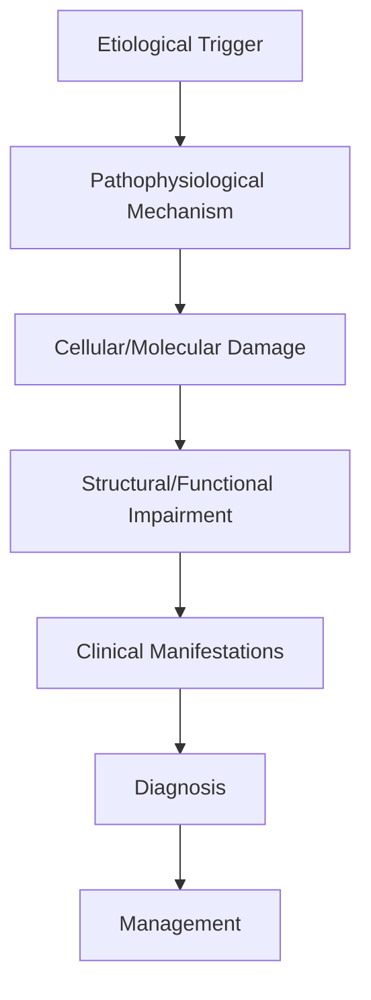
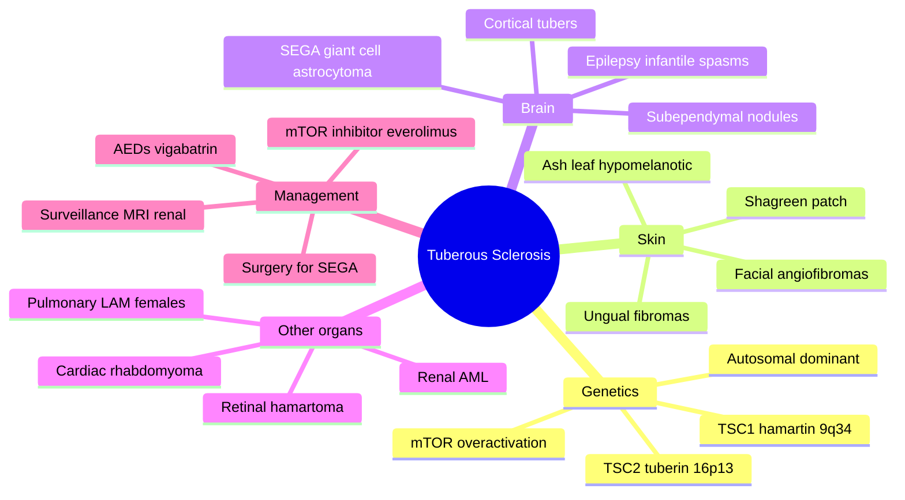

# Tuberous Sclerosis Complex

> [!tip] **High-Yield Definition**
> Comprehensive clinical note for Tuberous Sclerosis Complex covering definition, epidemiology, aetiology, pathophysiology, clinical features, investigations, differential diagnosis, management, drug interactions, procedures, complications, red flags, prognosis, topic correlation, and special situations for FCPS/MRCP examination preparation based on Davidson 24th Edition Chapter 25: Neurology.

---

## 1. Definition / Epidemiology / Classification

### Definition
Tuberous Sclerosis Complex is a neurological disorder within the 18 genetic neurological disorders category. It is characterised by specific clinical, pathological, radiological, and laboratory features that allow differentiation from related conditions.

### Epidemiology
- **Incidence/Prevalence:** Variable depending on the specific condition.
- **Age:** Adult onset is most common, but paediatric and elderly presentations occur.
- **Sex:** Variable depending on the condition.
- **Geography:** Worldwide distribution, with higher prevalence in certain regions.
- **Risk Factors:** Genetic predisposition, environmental factors, comorbidities, family history.

### Classification
| Subtype | Key Features | Prognosis |
|---------|-------------|-----------|
| Mild/early | Subtle symptoms, preserved function | Best |
| Moderate | Clear symptoms, functional impairment | Variable |
| Severe | Significant disability, complications | Worst |

---

## 2. Aetiology / Pathophysiology

### Aetiology
- **Primary (idiopathic):** Most cases have no identifiable cause.
- **Genetic:** May be inherited (AD, AR, X-linked, mitochondrial, sporadic).
- **Autoimmune:** Autoantibodies, immune-mediated inflammation.
- **Infectious:** Viral, bacterial, fungal, parasitic.
- **Metabolic:** Electrolyte, endocrine, hepatic, renal, nutritional.
- **Toxic:** Drugs, alcohol, heavy metals, environmental toxins.
- **Vascular:** Ischaemia, haemorrhage, vasculitis.
- **Neoplastic:** Primary, secondary, paraneoplastic.
- **Traumatic:** Acute, chronic, repetitive.
- **Degenerative:** Neurodegeneration, protein misfolding.

### Pathophysiology


---

## 3. Clinical Features

### History
- **Onset/Duration:** Acute, subacute, or chronic.
- **Progression:** Static, progressive, relapsing-remitting, stepwise.
- **Key symptoms:** Specific to the condition.
- **Triggers:** Stress, infection, trauma, drugs, hormonal, environmental.
- **Systemic symptoms:** Constitutional features.
- **Drug/Family/Social history:** Relevant exposures, comorbidities.

### Examination
| Domain | Key Findings | Localisation Value |
|--------|-------------|-------------------|
| Higher function | Cognitive, behavioural | Cortical, subcortical, limbic |
| Cranial nerves | Pupils, eye movements, facial, bulbar | Brainstem, cranial nerve, NMJ |
| Motor | Weakness, tone, reflexes | UMN, LMN, NMJ, muscle |
| Sensory | All modalities, pattern | Peripheral, spinal, brainstem |
| Coordination | Ataxia, nystagmus, dysmetria | Cerebellar, sensory, vestibular |
| Gait | Spastic, ataxic, parkinsonian | Multiple |
| Autonomic | Orthostatic, sweating, GI, bladder | Autonomic, peripheral, central |

### Specific Clinical Features
The clinical features are determined by the underlying aetiology, location of pathology, and rate of progression. Patients typically present with a constellation of symptoms and signs that allow clinical localisation and subsequent targeted investigation.

---

## 4. Diagnostic Approach / Algorithm

```mermaid
flowchart TD
    A[Clinical Presentation] --> B[Anatomical Localisation]
    B --> C[Pathophysiological Category]
    C --> D[Formulate Differential]
    D --> E[Targeted Investigations]
    E --> F[Confirm Diagnosis]
    F --> G[Assess Severity/Prognosis]
    G --> H[Initiate Management]
    H --> I[Monitor Response]
    I --> J{Response?}
    J --> YES1 [Good - Continue]
    J --> NO1 [Poor - Escalate]
    YES1 --> K[Monitor]
    NO1 --> H
```

---

## 5. Investigations

### First-Line Investigations
- **Blood tests:** FBC, U&Es, LFTs, glucose, calcium, magnesium, ESR, CRP, autoimmune, infection.
- **Imaging:** CT/MRI brain/spine (essential for most neurological conditions).
- **Neurophysiology:** EEG, nerve conduction, EMG, evoked potentials.
- **CSF:** Cell count, protein, glucose, OCBs, PCR, culture.

### Second-Line Investigations
- **Genetic testing:** Gene panels, WES, WGS.
- **Antibody testing:** Antineuronal, autoimmune, paraneoplastic.
- **Biopsy:** Nerve, muscle, brain, skin.
- **Advanced imaging:** PET-CT, MR spectroscopy, fMRI.

### Specialised Investigations
- **Biomarkers:** Neurofilament light chain, tau, beta-amyloid, 14-3-3, RT-QuIC.
- **Autonomic testing:** Head-up tilt, sudomotor, QSART.
- **Neuropsychology:** Cognitive testing, behavioural assessment.
- **Genetic counselling:** Family screening, predictive testing.

---

## 6. Differential Diagnosis

| Differential | Distinguishing Features | Key Test |
|--------------|------------------------|----------|
| Vascular | Sudden onset, focal, vascular risk factors | MRI/CT, vessel imaging |
| Inflammatory | Subacute, multifocal, systemic | MRI, CSF, antibodies |
| Infectious | Fever, systemic, exposure | Bloods, CSF, imaging |
| Neoplastic | Progressive, mass effect | MRI, biopsy |
| Degenerative | Progressive, symmetric, hereditary | MRI, genetic |
| Toxic/Metabolic | Drug history, systemic, reversible | Bloods, toxicology |
| Autoimmune | Multifocal, antibodies, immunotherapy response | Antibodies, MRI, CSF |
| Functional | Inconsistent, distractible | Clinical, video, biomarkers |

---

## 7. Management

### Acute Management
- **Stabilisation:** ABCDE approach, emergency resuscitation.
- **Specific treatment:** Disease-specific interventions.
- **Symptomatic relief:** Pain, seizures, spasticity, autonomic dysfunction.
- **Prevention of complications:** DVT, pressure sores, infection.

### Disease-Modifying Treatment
- **Pharmacological:** First-line, second-line, escalation, maintenance.
- **Procedural:** Surgery, biopsy, drainage, ablation, stimulation.
- **Immunotherapy:** Steroids, IVIG, plasma exchange, immunosuppressants, biologics.
- **Rehabilitation:** Physiotherapy, OT, speech therapy.

### Long-Term Management
- **Monitoring:** Clinical, imaging, biomarkers, side effects.
- **Prevention:** Vaccinations, prophylaxis, lifestyle modification.
- **Supportive care:** Multidisciplinary team, social work, psychological support.
- **Palliative care:** Advanced care planning, end-of-life care, hospice.

---

## 8. Drug Interactions / Contraindications / Comorbidity Cautions

| Drug Class | Interaction / Caution | Management |
|------------|----------------------|------------|
| Antiseizure medications | Enzyme induction, teratogenicity | Monitor, supplement, switch |
| Immunosuppressants | Infection, malignancy, teratogenicity | Monitor, prophylaxis |
| Anticoagulants | Bleeding risk, drug interactions | Monitor INR, avoid combinations |
| Antihypertensives | Hypotension, falls | Monitor BP, adjust dose |
| Antibiotics | Nephrotoxicity, ototoxicity | Monitor renal |
| Antivirals | Nephrotoxicity, neuropsychiatric | Monitor renal, dose adjust |
| Steroids | DM, HTN, osteoporosis, infection | Monitor, prophylaxis, taper |
| Biologics | Infusion reactions, infection | Monitor, prophylaxis |

---

## 9. Procedures

### Common Procedures
- **Lumbar puncture:** Diagnostic, therapeutic (IIH, NPH). Contraindications: raised ICP, mass lesion, coagulopathy.
- **Nerve conduction studies/EMG:** Diagnostic, prognosis. Minor discomfort.
- **EEG:** Diagnostic, monitoring. No significant complications.
- **MRI brain/spine:** Diagnostic, monitoring. Contraindications: pacemaker, metallic implants.
- **CT head:** Emergency, rapid. Radiation exposure, contrast reactions.
- **Biopsy:** Stereotactic, open. Indications: diagnosis, molecular profiling.

---

## 10. Complications

| Complication | Frequency | Prevention | Management |
|--------------|-----------|------------|------------|
| Infection | Common | Hygiene, prophylaxis, vaccination | Antibiotics, antifungals |
| Thrombosis | Common | Prophylaxis, mobility | Anticoagulation |
| Pressure sores | Common | Positioning, nutrition | Wound care, surgery |
| Spasticity | Common | Positioning, stretching | Baclofen, BoNT |
| Contractures | Common | Passive movements, splints | Physiotherapy, surgery |
| Aspiration | Common | Swallow assessment | NGT, PEG, thickeners |
| Falls | Common | Environment, mobility | Walking aids |
| Fractures | Common | Bone health, prevention | Vitamin D, bisphosphonate |
| Depression | Common | Screening, support | Antidepressants, CBT |
| Cognitive decline | Variable | Monitoring, training | Rehabilitation |
| Autonomic dysfunction | Variable | Monitoring, hydration | Midodrine, fludrocortisone |
| Respiratory failure | Variable | Monitoring, supportive | Ventilation, NIV |
| Death | Variable | Monitoring, palliative | End-of-life care |

---

## 11. Red Flags / Emergencies

### Emergency Presentations
- **Rapid neurological deterioration:** New focal deficit, decreased consciousness, seizures.
- **Status epilepticus:** Continuous seizures >5 min.
- **Raised ICP:** Headache, vomiting, papilloedema, altered consciousness.
- **Respiratory failure:** Hypoxia, hypercapnia, ventilatory failure.
- **Cardiac arrest:** Arrhythmia, MI, pulmonary embolism.
- **Infection:** Sepsis, meningitis, abscess, encephalitis.
- **Drug toxicity:** Overdose, side effects, interactions.
- **Haemorrhage:** Intracranial, systemic, coagulopathy.

---

## 12. Prognosis

### Natural History
- **Acute:** May resolve with treatment, may progress, may be fatal.
- **Subacute:** Variable, depends on cause and treatment.
- **Chronic:** Often progressive, may be stable, may have relapses.
- **Recovery:** Variable, may be complete, partial, or none.

### Prognostic Factors
- **Favourable:** Young age, early treatment, mild disease, reversible cause, good premorbid function, family support.
- **Unfavourable:** Older age, delayed treatment, severe disease, irreversible cause, poor premorbid function, comorbidities.

---

## 13. Topic Correlation

| Related Topic | Link | Key Overlap |
|---------------|------|-------------|
| Davidson 24th Ed Chapter 25 | [[Davidson Chapter 25 - Neurology Hierarchy]] | Comprehensive neurology |
| Neurology MOC | [[Neurology MOC]] | All neurology topics |
| Drug Reference | [[../00_Index/Neurology Drug Reference]] | Medications |
| Local Hub | [[../18_Genetic_Neurological_Disorders/Hub]] | Section-specific |
| Clinical Examination | [[../01_Fundamentals_Examination/Neurological History Taking]] | Clinical approach |
| Investigation | [[../01_Fundamentals_Examination/Neuroimaging (CT-MRI) Principles]] | Imaging |

---

## 14. Special Situations

| Situation | Consideration |
|-----------|---------------|
| **Pregnancy** | Pre-conception counselling, teratogenicity, drug safety, monitoring, delivery planning, breastfeeding. |
| **Lactation** | Drug safety, breastfeeding, monitoring, support. |
| **Paediatric** | Developmental considerations, drug dosing, school, family, vaccination, growth, puberty. |
| **Elderly / Frail** | Comorbidities, polypharmacy, falls, bone health, cognition, social, end-of-life. |
| **Renal impairment** | Drug dose adjustment, monitoring, dialysis, transplant. |
| **Hepatic impairment** | Drug dose adjustment, monitoring, transplant. |
| **Immunocompromised** | Infection prophylaxis, vaccination, drug interactions, malignancy screening. |
| **Perioperative** | Drug management, anaesthesia planning, VTE prophylaxis, infection prevention, monitoring. |
| **Driving / DVLA** | Fitness to drive, restrictions, notification, reassessment. |
| **Occupational** | Fitness for work, adaptations, rehabilitation, disability, return to work. |

---

## FCPS/MRCP High-Yield Summary

| Category | Key Points |
|----------|------------|
| **Definition** | Comprehensive definition with key diagnostic criteria |
| **Epidemiology** | Incidence, prevalence, age, sex, geography, risk factors |
| **Aetiology** | Primary causes, secondary causes, genetic, environmental |
| **Pathophysiology** | Mechanism of disease, cellular/molecular basis |
| **Clinical Features** | History, examination, key findings, variants |
| **Diagnosis** | Diagnostic criteria, classification, severity |
| **Investigations** | First-line, second-line, specialised, biomarkers |
| **Differential Diagnosis** | Key differentials, distinguishing features, tests |
| **Management** | Acute, disease-modifying, symptomatic, supportive |
| **Complications** | Common, serious, prevention, management |
| **Prognosis** | Natural history, prognostic factors, outcomes |
| **Viva Pearls** | Key examination points |
| **Drug Doses** | First-line, second-line, emergency |
| **Scoring Systems** | Specific scores used in management |
| **Genetics** | Inheritance, genes, mutations, family screening |
| **Imaging Signs** | Characteristic findings, differential |

---

## Viva Questions (PACES/FCPS Style)

1. **Q:** Define and classify its variants.
   **A:** Comprehensive definition with classification of subtypes based on aetiology, severity, and clinical features.

2. **Q:** What are the key clinical features?
   **A:** Specific symptoms and signs including onset, progression, key features, and associated findings.

3. **Q:** What is the first-line treatment?
   **A:** First-line pharmacological and non-pharmacological management based on current evidence.

4. **Q:** What are the red flags requiring urgent referral?
   **A:** Specific emergency presentations and complications requiring immediate intervention.

5. **Q:** What is the prognosis?
   **A:** Natural history, prognostic factors, and long-term outcomes.

6. **Q:** How do you differentiate from key differentials?
   **A:** Clinical features, investigations, and response to treatment that distinguish from alternative diagnoses.

7. **Q:** What investigations are most useful?
   **A:** First-line and second-line investigations including imaging, neurophysiology, CSF, and biomarkers.

8. **Q:** Describe the stepwise management approach.
   **A:** Stepwise escalation from first-line to second-line to third-line therapy with monitoring.

9. **Q:** What are the emergency presentations?
   **A:** Specific emergency scenarios and immediate management priorities.

10. **Q:** How does management change in pregnancy/paediatrics/elderly?
    **A:** Special considerations for each population including drug safety, monitoring, and support.

---

## Common Confusions / Exam Traps

| Confusion | Clarification |
|-----------|---------------|
| Similar presentation but different cause | Differentiate by history, examination, investigations |
| Treatment response vs natural history | Assess with objective measures, biomarkers |
| Drug interactions | Check each drug, monitor, adjust doses |
| Disease progression vs treatment failure | Monitor response, escalate appropriately |
| Functional vs organic | Inconsistent, distractible, disability greater than impairment |
| Acute vs chronic | Time course, progression, reversibility |
| Primary vs secondary | Underlying cause, contributing factors |
| Side effects vs symptoms | Temporal relationship, dose relationship |

---

## Mnemonics

1. **TSC = mTOR up** — Loss of **hamartin (TSC1)** or **tuberin (TSC2)** → loss of inhibition of **mTORC1** → hamartomas in multiple organs.
2. **TSC1 vs TSC2** — **TSC1 (hamartin)**: 9q34, ~25%, often milder; **TSC2 (tuberin)**: 16p13, ~70%, often more severe, often sporadic.
3. **"Ash-leaf and Friends"** — Major skin signs: **ash-leaf spots (hypomelanotic)**, **facial angiofibromas**, **shagreen patch**, **fibrous cephalic plaque**, **ungual fibromas**.
4. **Wood's Lamp** — Ash-leaf spots best seen under **Wood's lamp UV** (365 nm) in fair-skinned patients.
5. **SEGAs** — **S**ub**e**pendymal **G**iant cell **A**strocytomas at the foramen of Monro → hydrocephalus.
6. **Cardiac Rhabdomyoma** — Most common cardiac tumour in infants; **regresses spontaneously**; leads to TSC diagnosis.
7. **Renal AML** — **Angiomyolipoma** in 70-80%; risk of haemorrhage if >4 cm; embolisation / mTOR inhibitor.
8. **LAM** — **L**ymphangio**l**eiomyomatosis in female TSC patients (lung cysts, pneumothorax).
9. **Seizure** — 80-90% of TSC patients have epilepsy; **infantile spasms** common; consider **vigabatrin**, then mTOR.
10. **Everolimus** — mTOR inhibitor approved for **SEGA, renal AML, and refractory seizures** in TSC.

---

## Mind Map



---

## Spaced Repetition Trackers

| Day | Topic | Question (front) | Answer (back) | Confidence (1-5) |
|-----|-------|------------------|---------------|------------------|
| 1 | Genes | TSC1 / TSC2 genes? | TSC1 (hamartin, 9q34); TSC2 (tuberin, 16p13) | 4 |
| 1 | Pathway | Pathway dysregulated in TSC? | mTORC1 (loss of hamartin/tuberin inhibition) | 4 |
| 2 | Skin | Major skin signs? | Ash-leaf, angiofibroma, shagreen, ungual fibroma | 4 |
| 3 | Brain | SEGA stands for? | Subependymal Giant Cell Astrocytoma | 5 |
| 5 | Cardiac | Commonest cardiac tumour? | Rhabdomyoma | 5 |
| 7 | Renal | Most common renal lesion? | Angiomyolipoma (AML) | 4 |
| 10 | Drug | mTOR inhibitor for TSC? | Everolimus (sirolimus also) | 5 |
| 14 | LAM | LAM occurs in which sex? | Female TSC patients | 4 |
| 21 | Spasms | First-line AED for infantile spasms in TSC? | Vigabatrin | 4 |
| 30 | Surveillance | Imaging surveillance? | MRI brain, renal US / MRI, EEG | 3 |

---

## Self-Test Scorecard

| Domain | Questions Attempted | Correct | Accuracy | Weak Areas |
|--------|---------------------|---------|----------|------------|
| Genetics & Pathogenesis | /3 | | | |
| Skin & Systemic Features | /3 | | | |
| Brain & Epilepsy | /2 | | | |
| Management & Surveillance | /2 | | | |
| **Overall** | **/10** | | | |

---

## MCQs (10)

1. **Q:** Tuberous Sclerosis Complex is caused by mutations in:
   **A:** A. NF1 / NF2  **B.** TSC1 (hamartin) / TSC2 (tuberin)  **C.** VHL  **D.** FBN1
   **Answer:** B — TSC1/TSC2.
   **Explanation:** TSC is caused by loss-of-function mutations in TSC1 (hamartin, 9q34) or TSC2 (tuberin, 16p13.3), which normally inhibit mTORC1. Loss of function → mTORC1 hyperactivation → hamartomas.

2. **Q:** Pathway dysregulated in Tuberous Sclerosis:
   **A:** A. Ras-MAPK  **B.** PI3K-AKT-mTOR  **C.** Wnt  **D.** Hedgehog
   **Answer:** B — PI3K-AKT-mTOR.
   **Explanation:** Hamartin/tuberin complex inhibits Rheb-GTP, which activates mTORC1. Loss of TSC1/2 → mTORC1 hyperactivity → cell growth and hamartoma formation in brain, skin, kidneys, heart, lungs.

3. **Q:** Hypomelanotic macule "ash-leaf" spot in TSC is best seen with:
   **A:** A. Slit lamp  **B.** Wood's lamp (UV 365 nm)  **C.** Dermatoscopy only  **D.** MRI
   **Answer:** B — Wood's lamp.
   **Explanation:** Wood's lamp (UV 365 nm) accentuates hypopigmented ash-leaf spots, especially in fair-skinned infants; ≥3 hypomelanotic macules is a major diagnostic criterion.

4. **Q:** Subependymal giant cell astrocytoma (SEGA) in TSC is characteristically located:
   **A:** A. Cerebellar vermis  **B.** Foramen of Monro  **C.** Brainstem  **D.** Optic chiasm
   **Answer:** B — Foramen of Monro.
   **Explanation:** SEGAs typically arise near the foramen of Monro from subependymal nodules; growing SEGAs obstruct CSF flow causing hydrocephalus. TSC patients need regular MRI brain surveillance.

5. **Q:** Commonest cardiac tumour in TSC and a frequent presenting feature in infants:
   **A:** A. Fibroma  **B.** Rhabdomyoma  **C.** Myxoma  **D.** Lipoma
   **Answer:** B — Rhabdomyoma.
   **Explanation:** Cardiac rhabdomyoma is the commonest cardiac tumour in infants, often multiple, frequently regressing in childhood. Echocardiography in any infant with new seizures or TSC suspicion.

6. **Q:** Most common renal lesion in TSC:
   **A:** A. Renal cell carcinoma  **B.** Angiomyolipoma  **C.** Polycystic kidney disease  **D.** Oncocytoma
   **Answer:** B — Angiomyolipoma.
   **Explanation:** Renal angiomyolipomas (AML) occur in 70-80% of TSC patients, with risk of spontaneous haemorrhage when >4 cm. Surveillance with MRI/US and intervention (embolisation, mTOR inhibitor) when large.

7. **Q:** Lymphangioleiomyomatosis (LAM) in TSC occurs predominantly in:
   **A:** A. Males  **B.** Females of reproductive age  **C.** Children  **D.** Elderly males
   **Answer:** B — Females of reproductive age.
   **Explanation:** LAM (lung cysts, pneumothorax, chylous effusions) occurs almost exclusively in women of reproductive age; oestrogen implicated. CT chest surveillance is recommended in female TSC patients.

8. **Q:** First-line treatment for infantile spasms in TSC:
   **A:** A. ACTH  **B.** Vigabatrin  **C.** Carbamazepine  **D.** Levetiracetam
   **Answer:** B — Vigabatrin.
   **Explanation:** Vigabatrin is first-line for TSC-associated infantile spasms, often more effective than in non-TSC spasms. Monitor for visual field constriction (peripheral vision loss).

9. **Q:** mTOR inhibitor approved for SEGA, renal AML, and refractory epilepsy in TSC:
   **A:** A. Sirolimus  **B.** Everolimus  **C.** Temsirolimus  **D.** None
   **Answer:** B — Everolimus.
   **Explanation:** Everolimus (mTOR inhibitor) is approved for TSC-associated SEGA (2010), renal AML (2012), and refractory focal seizures (2018, adjunctive). Sirolimus is also used off-label.

10. **Q:** Major diagnostic criteria for TSC include all EXCEPT:
    **A:** A. Cortical tubers  **B.** Facial angiofibromas (≥3)  **C.** Lisch nodules  **D.** Cardiac rhabdomyoma
    **Answer:** C — Lisch nodules.
    **Explanation:** Lisch nodules are diagnostic for NF1, not TSC. TSC criteria include cortical tubers, subependymal nodules, SEGA, ash-leaf spots (≥3), facial angiofibromas (≥3), shagreen patch, ungual fibromas, cardiac rhabdomyoma, AML (≥2), LAM, and TSC1/2 pathogenic variant.

---

## SBA Questions (10)

1. **Scenario:** 6-month-old with new-onset infantile spasms, hypopigmented macules on trunk, and echogenic cardiac mass on echo. Most likely diagnosis?
   **Options:** A. TSC  **B.** NF1  **C.** Sturge-Weber  **D.** FRDA
   **Answer:** A — TSC.
   **Explanation:** Triad of infantile spasms, ash-leaf spots, and cardiac rhabdomyoma is classic TSC. Genetic testing for TSC1/TSC2 confirms diagnosis; MRI brain follows.

2. **Scenario:** 12-year-old TSC with enlarging SEGA near foramen of Monro and rising ventricular size. Best management?
   **Options:** A. Observation  **B.** Everolimus (mTOR inhibitor)  **C.** Radiotherapy  **D.** Chemotherapy
   **Answer:** B — Everolimus.
   **Explanation:** Everolimus reduces SEGA volume and prevents progression, particularly in growing SEGAs. Surgical resection reserved for acute hydrocephalus or everolimus failure; radiotherapy is avoided (risk of malignant transformation).

3. **Scenario:** TSC adult with right renal angiomyolipoma 6 cm. Risk and management?
   **Options:** A. No risk  **B.** Haemorrhage risk; selective embolisation or everolimus  **C.** Nephrectomy routinely  **D.** Radiotherapy
   **Answer:** B — Embolisation / everolimus.
   **Explanation:** AMLs >4 cm carry significant risk of Wunderlich haemorrhage. Management options: selective arterial embolisation, everolimus, or nephron-sparing surgery. Avoid percutaneous biopsy (risk of haemorrhage, no diagnostic value).

4. **Scenario:** 28-year-old woman with TSC, progressive dyspnoea, recurrent pneumothoraces. CT chest shows diffuse thin-walled cysts. Diagnosis?
   **Options:** A. Asthma  **B.** LAM (lymphangioleio-myomatosis)  **C.** Emphysema  **D.** Bronchiectasis
   **Answer:** B — LAM.
   **Explanation:** Pulmonary LAM in female TSC patients presents with cystic lung disease, pneumothorax, chylous effusions, and progressive airflow obstruction. CT chest and VEGF-D levels help diagnosis; mTOR inhibitors (sirolimus) slow progression.

5. **Scenario:** TSC child on vigabatrin for spasms. What monitoring is required?
   **Options:** A. No monitoring  **B.** Visual fields / perimetry (every 6 months) and eye exam  **C.** LFTs only  **D.** EEG only
   **Answer:** B — Visual field monitoring.
   **Explanation:** Vigabatrin causes irreversible peripheral visual field constriction in ~30%; perimetry every 6 months from age 6+ (ERG in infants) is recommended. Use lowest effective dose, shortest course.

6. **Scenario:** TSC adult with new right flank pain and hypotension. CT shows retroperitoneal haematoma from right renal AML. Most appropriate emergency management?
   **Options:** A. Nephrectomy  **B.** Selective arterial embolisation  **C.** Radiotherapy  **D.** Chemotherapy
   **Answer:** B — Selective arterial embolisation.
   **Explanation:** Wunderlich syndrome (spontaneous retroperitoneal haemorrhage from AML) is treated by selective arterial embolisation as first-line, with nephron-sparing surgery as backup; nephrectomy reserved for life-threatening uncontrolled bleeding.

7. **Scenario:** TSC patient planning pregnancy. Recurrence risk?
   **Options:** A. 0%  **B.** 50% (autosomal dominant)  **C.** 25%  **D.** 100%
   **Answer:** B — 50%.
   **Explanation:** TSC is autosomal dominant with 50% transmission risk. Up to two-thirds of cases are de novo. Pre-implantation genetic diagnosis and prenatal testing available. Consider TSC1/2 testing in partner if family history on both sides.

8. **Scenario:** 6-year-old with TSC, well-controlled seizures on carbamazepine, new facial angiofibromas. Best treatment?
   **Options:** A. Topical sirolimus  **B.** Oral isotretinoin  **C.** Pulsed-dye laser  **D.** Surgery
   **Answer:** A — Topical sirolimus.
   **Explanation:** Topical sirolimus (mTOR inhibitor) is now first-line for facial angiofibromas in TSC, reducing lesion size and redness. Pulsed-dye laser is an option for residual vascular component.

9. **Scenario:** Adult TSC patient with TSC2 mutation and severe epilepsy, well-controlled on carbamazepine. Most appropriate follow-up?
   **Options:** A. No further follow-up  **B.** Lifelong MRI brain, renal imaging, EEG, ophthalmology, dermatology  **C.** One-off MRI only  **D.** CT brain annually
   **Answer:** B — Lifelong multi-organ surveillance.
   **Explanation:** TSC is multi-system: lifelong surveillance for SEGA, AML, LAM, epilepsy, skin, cardiac, dental, and psychiatric features. TSC2 patients often have more severe phenotype.

10. **Scenario:** TSC adolescent on everolimus for SEGA. Develops mouth ulcers, hyperlipidaemia, and mild neutropenia. Most appropriate action?
    **Options:** A. Stop everolimus permanently  **B.** Dose reduction and supportive management  **C.** Switch to sirolimus only  **D.** No action needed
    **Answer:** B — Dose reduction.
    **Explanation:** Everolimus causes stomatitis, hyperlipidaemia, and cytopenias; dose reduction, topical mouth care, and lipid monitoring usually manage these. Complete withdrawal reserved for serious adverse effects (e.g., pneumonitis).

---

## Tags

`#tuberous-sclerosis` `#TSC` `#TSC1` `#TSC2` `#hamartin` `#tuberin` `#mTOR` `#everolimus` `#sirolimus` `#ash-leaf` `#facial-angiofibroma` `#shagreen` `#SEGA` `#cardiac-rhabdomyoma` `#renal-AML` `#LAM` `#infantile-spasms` `#vigabatrin` `#cortical-tuber` `#FCPS` `#MRCP`
## Local Navigation
**Heading Hub:** [[../Hub]]  
**Chapter Hierarchy:** [[Davidson Chapter 25 - Neurology Hierarchy]]  
**Chapter MOC:** [[Neurology MOC]]  
**Drug Reference:** [[../00_Index/Neurology Drug Reference]]  
