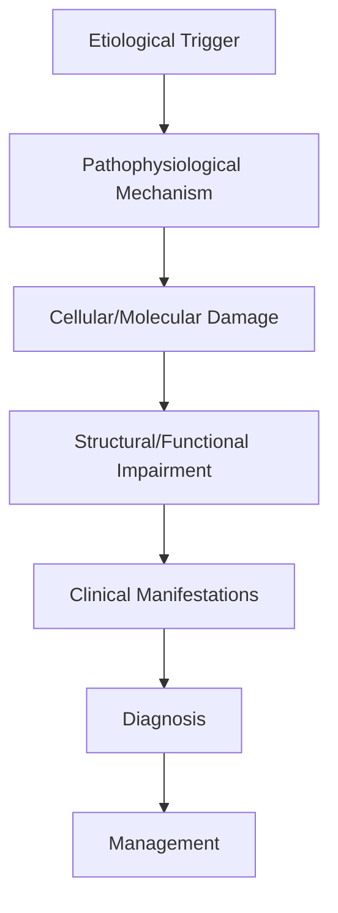
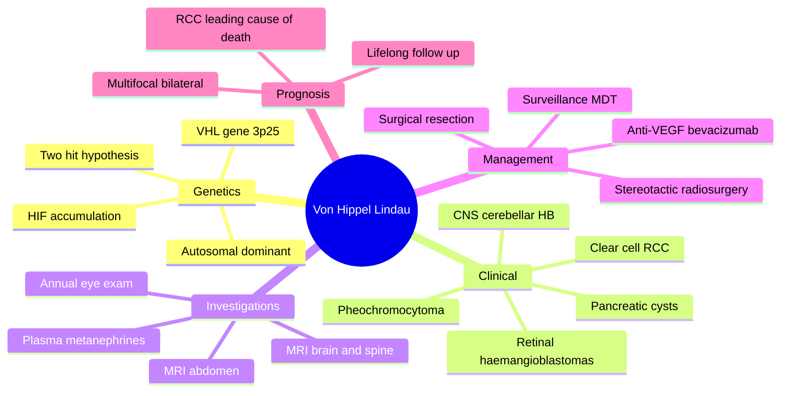

# Von Hippel-Lindau

> [!tip] **High-Yield Definition**
> Comprehensive clinical note for Von Hippel-Lindau covering definition, epidemiology, aetiology, pathophysiology, clinical features, investigations, differential diagnosis, management, drug interactions, procedures, complications, red flags, prognosis, topic correlation, and special situations for FCPS/MRCP examination preparation based on Davidson 24th Edition Chapter 25: Neurology.

---

## 1. Definition / Epidemiology / Classification

### Definition
Von Hippel-Lindau is a neurological disorder within the 18 genetic neurological disorders category. It is characterised by specific clinical, pathological, radiological, and laboratory features that allow differentiation from related conditions.

### Epidemiology
- **Incidence/Prevalence:** Variable depending on the specific condition.
- **Age:** Adult onset is most common, but paediatric and elderly presentations occur.
- **Sex:** Variable depending on the condition.
- **Geography:** Worldwide distribution, with higher prevalence in certain regions.
- **Risk Factors:** Genetic predisposition, environmental factors, comorbidities, family history.

### Classification
| Subtype | Key Features | Prognosis |
|---------|-------------|-----------|
| Mild/early | Subtle symptoms, preserved function | Best |
| Moderate | Clear symptoms, functional impairment | Variable |
| Severe | Significant disability, complications | Worst |

---

## 2. Aetiology / Pathophysiology

### Aetiology
- **Primary (idiopathic):** Most cases have no identifiable cause.
- **Genetic:** May be inherited (AD, AR, X-linked, mitochondrial, sporadic).
- **Autoimmune:** Autoantibodies, immune-mediated inflammation.
- **Infectious:** Viral, bacterial, fungal, parasitic.
- **Metabolic:** Electrolyte, endocrine, hepatic, renal, nutritional.
- **Toxic:** Drugs, alcohol, heavy metals, environmental toxins.
- **Vascular:** Ischaemia, haemorrhage, vasculitis.
- **Neoplastic:** Primary, secondary, paraneoplastic.
- **Traumatic:** Acute, chronic, repetitive.
- **Degenerative:** Neurodegeneration, protein misfolding.

### Pathophysiology


---

## 3. Clinical Features

### History
- **Onset/Duration:** Acute, subacute, or chronic.
- **Progression:** Static, progressive, relapsing-remitting, stepwise.
- **Key symptoms:** Specific to the condition.
- **Triggers:** Stress, infection, trauma, drugs, hormonal, environmental.
- **Systemic symptoms:** Constitutional features.
- **Drug/Family/Social history:** Relevant exposures, comorbidities.

### Examination
| Domain | Key Findings | Localisation Value |
|--------|-------------|-------------------|
| Higher function | Cognitive, behavioural | Cortical, subcortical, limbic |
| Cranial nerves | Pupils, eye movements, facial, bulbar | Brainstem, cranial nerve, NMJ |
| Motor | Weakness, tone, reflexes | UMN, LMN, NMJ, muscle |
| Sensory | All modalities, pattern | Peripheral, spinal, brainstem |
| Coordination | Ataxia, nystagmus, dysmetria | Cerebellar, sensory, vestibular |
| Gait | Spastic, ataxic, parkinsonian | Multiple |
| Autonomic | Orthostatic, sweating, GI, bladder | Autonomic, peripheral, central |

### Specific Clinical Features
The clinical features are determined by the underlying aetiology, location of pathology, and rate of progression. Patients typically present with a constellation of symptoms and signs that allow clinical localisation and subsequent targeted investigation.

---

## 4. Diagnostic Approach / Algorithm

```mermaid
flowchart TD
    A[Clinical Presentation] --> B[Anatomical Localisation]
    B --> C[Pathophysiological Category]
    C --> D[Formulate Differential]
    D --> E[Targeted Investigations]
    E --> F[Confirm Diagnosis]
    F --> G[Assess Severity/Prognosis]
    G --> H[Initiate Management]
    H --> I[Monitor Response]
    I --> J{Response?}
    J --> YES1 [Good - Continue]
    J --> NO1 [Poor - Escalate]
    YES1 --> K[Monitor]
    NO1 --> H
```

---

## 5. Investigations

### First-Line Investigations
- **Blood tests:** FBC, U&Es, LFTs, glucose, calcium, magnesium, ESR, CRP, autoimmune, infection.
- **Imaging:** CT/MRI brain/spine (essential for most neurological conditions).
- **Neurophysiology:** EEG, nerve conduction, EMG, evoked potentials.
- **CSF:** Cell count, protein, glucose, OCBs, PCR, culture.

### Second-Line Investigations
- **Genetic testing:** Gene panels, WES, WGS.
- **Antibody testing:** Antineuronal, autoimmune, paraneoplastic.
- **Biopsy:** Nerve, muscle, brain, skin.
- **Advanced imaging:** PET-CT, MR spectroscopy, fMRI.

### Specialised Investigations
- **Biomarkers:** Neurofilament light chain, tau, beta-amyloid, 14-3-3, RT-QuIC.
- **Autonomic testing:** Head-up tilt, sudomotor, QSART.
- **Neuropsychology:** Cognitive testing, behavioural assessment.
- **Genetic counselling:** Family screening, predictive testing.

---

## 6. Differential Diagnosis

| Differential | Distinguishing Features | Key Test |
|--------------|------------------------|----------|
| Vascular | Sudden onset, focal, vascular risk factors | MRI/CT, vessel imaging |
| Inflammatory | Subacute, multifocal, systemic | MRI, CSF, antibodies |
| Infectious | Fever, systemic, exposure | Bloods, CSF, imaging |
| Neoplastic | Progressive, mass effect | MRI, biopsy |
| Degenerative | Progressive, symmetric, hereditary | MRI, genetic |
| Toxic/Metabolic | Drug history, systemic, reversible | Bloods, toxicology |
| Autoimmune | Multifocal, antibodies, immunotherapy response | Antibodies, MRI, CSF |
| Functional | Inconsistent, distractible | Clinical, video, biomarkers |

---

## 7. Management

### Acute Management
- **Stabilisation:** ABCDE approach, emergency resuscitation.
- **Specific treatment:** Disease-specific interventions.
- **Symptomatic relief:** Pain, seizures, spasticity, autonomic dysfunction.
- **Prevention of complications:** DVT, pressure sores, infection.

### Disease-Modifying Treatment
- **Pharmacological:** First-line, second-line, escalation, maintenance.
- **Procedural:** Surgery, biopsy, drainage, ablation, stimulation.
- **Immunotherapy:** Steroids, IVIG, plasma exchange, immunosuppressants, biologics.
- **Rehabilitation:** Physiotherapy, OT, speech therapy.

### Long-Term Management
- **Monitoring:** Clinical, imaging, biomarkers, side effects.
- **Prevention:** Vaccinations, prophylaxis, lifestyle modification.
- **Supportive care:** Multidisciplinary team, social work, psychological support.
- **Palliative care:** Advanced care planning, end-of-life care, hospice.

---

## 8. Drug Interactions / Contraindications / Comorbidity Cautions

| Drug Class | Interaction / Caution | Management |
|------------|----------------------|------------|
| Antiseizure medications | Enzyme induction, teratogenicity | Monitor, supplement, switch |
| Immunosuppressants | Infection, malignancy, teratogenicity | Monitor, prophylaxis |
| Anticoagulants | Bleeding risk, drug interactions | Monitor INR, avoid combinations |
| Antihypertensives | Hypotension, falls | Monitor BP, adjust dose |
| Antibiotics | Nephrotoxicity, ototoxicity | Monitor renal |
| Antivirals | Nephrotoxicity, neuropsychiatric | Monitor renal, dose adjust |
| Steroids | DM, HTN, osteoporosis, infection | Monitor, prophylaxis, taper |
| Biologics | Infusion reactions, infection | Monitor, prophylaxis |

---

## 9. Procedures

### Common Procedures
- **Lumbar puncture:** Diagnostic, therapeutic (IIH, NPH). Contraindications: raised ICP, mass lesion, coagulopathy.
- **Nerve conduction studies/EMG:** Diagnostic, prognosis. Minor discomfort.
- **EEG:** Diagnostic, monitoring. No significant complications.
- **MRI brain/spine:** Diagnostic, monitoring. Contraindications: pacemaker, metallic implants.
- **CT head:** Emergency, rapid. Radiation exposure, contrast reactions.
- **Biopsy:** Stereotactic, open. Indications: diagnosis, molecular profiling.

---

## 10. Complications

| Complication | Frequency | Prevention | Management |
|--------------|-----------|------------|------------|
| Infection | Common | Hygiene, prophylaxis, vaccination | Antibiotics, antifungals |
| Thrombosis | Common | Prophylaxis, mobility | Anticoagulation |
| Pressure sores | Common | Positioning, nutrition | Wound care, surgery |
| Spasticity | Common | Positioning, stretching | Baclofen, BoNT |
| Contractures | Common | Passive movements, splints | Physiotherapy, surgery |
| Aspiration | Common | Swallow assessment | NGT, PEG, thickeners |
| Falls | Common | Environment, mobility | Walking aids |
| Fractures | Common | Bone health, prevention | Vitamin D, bisphosphonate |
| Depression | Common | Screening, support | Antidepressants, CBT |
| Cognitive decline | Variable | Monitoring, training | Rehabilitation |
| Autonomic dysfunction | Variable | Monitoring, hydration | Midodrine, fludrocortisone |
| Respiratory failure | Variable | Monitoring, supportive | Ventilation, NIV |
| Death | Variable | Monitoring, palliative | End-of-life care |

---

## 11. Red Flags / Emergencies

### Emergency Presentations
- **Rapid neurological deterioration:** New focal deficit, decreased consciousness, seizures.
- **Status epilepticus:** Continuous seizures >5 min.
- **Raised ICP:** Headache, vomiting, papilloedema, altered consciousness.
- **Respiratory failure:** Hypoxia, hypercapnia, ventilatory failure.
- **Cardiac arrest:** Arrhythmia, MI, pulmonary embolism.
- **Infection:** Sepsis, meningitis, abscess, encephalitis.
- **Drug toxicity:** Overdose, side effects, interactions.
- **Haemorrhage:** Intracranial, systemic, coagulopathy.

---

## 12. Prognosis

### Natural History
- **Acute:** May resolve with treatment, may progress, may be fatal.
- **Subacute:** Variable, depends on cause and treatment.
- **Chronic:** Often progressive, may be stable, may have relapses.
- **Recovery:** Variable, may be complete, partial, or none.

### Prognostic Factors
- **Favourable:** Young age, early treatment, mild disease, reversible cause, good premorbid function, family support.
- **Unfavourable:** Older age, delayed treatment, severe disease, irreversible cause, poor premorbid function, comorbidities.

---

## 13. Topic Correlation

| Related Topic | Link | Key Overlap |
|---------------|------|-------------|
| Davidson 24th Ed Chapter 25 | [[Davidson Chapter 25 - Neurology Hierarchy]] | Comprehensive neurology |
| Neurology MOC | [[Neurology MOC]] | All neurology topics |
| Drug Reference | [[../00_Index/Neurology Drug Reference]] | Medications |
| Local Hub | [[../18_Genetic_Neurological_Disorders/Hub]] | Section-specific |
| Clinical Examination | [[../01_Fundamentals_Examination/Neurological History Taking]] | Clinical approach |
| Investigation | [[../01_Fundamentals_Examination/Neuroimaging (CT-MRI) Principles]] | Imaging |

---

## 14. Special Situations

| Situation | Consideration |
|-----------|---------------|
| **Pregnancy** | Pre-conception counselling, teratogenicity, drug safety, monitoring, delivery planning, breastfeeding. |
| **Lactation** | Drug safety, breastfeeding, monitoring, support. |
| **Paediatric** | Developmental considerations, drug dosing, school, family, vaccination, growth, puberty. |
| **Elderly / Frail** | Comorbidities, polypharmacy, falls, bone health, cognition, social, end-of-life. |
| **Renal impairment** | Drug dose adjustment, monitoring, dialysis, transplant. |
| **Hepatic impairment** | Drug dose adjustment, monitoring, transplant. |
| **Immunocompromised** | Infection prophylaxis, vaccination, drug interactions, malignancy screening. |
| **Perioperative** | Drug management, anaesthesia planning, VTE prophylaxis, infection prevention, monitoring. |
| **Driving / DVLA** | Fitness to drive, restrictions, notification, reassessment. |
| **Occupational** | Fitness for work, adaptations, rehabilitation, disability, return to work. |

---

## FCPS/MRCP High-Yield Summary

| Category | Key Points |
|----------|------------|
| **Definition** | Comprehensive definition with key diagnostic criteria |
| **Epidemiology** | Incidence, prevalence, age, sex, geography, risk factors |
| **Aetiology** | Primary causes, secondary causes, genetic, environmental |
| **Pathophysiology** | Mechanism of disease, cellular/molecular basis |
| **Clinical Features** | History, examination, key findings, variants |
| **Diagnosis** | Diagnostic criteria, classification, severity |
| **Investigations** | First-line, second-line, specialised, biomarkers |
| **Differential Diagnosis** | Key differentials, distinguishing features, tests |
| **Management** | Acute, disease-modifying, symptomatic, supportive |
| **Complications** | Common, serious, prevention, management |
| **Prognosis** | Natural history, prognostic factors, outcomes |
| **Viva Pearls** | Key examination points |
| **Drug Doses** | First-line, second-line, emergency |
| **Scoring Systems** | Specific scores used in management |
| **Genetics** | Inheritance, genes, mutations, family screening |
| **Imaging Signs** | Characteristic findings, differential |

---

## Viva Questions (PACES/FCPS Style)

1. **Q:** Define and classify its variants.
   **A:** Comprehensive definition with classification of subtypes based on aetiology, severity, and clinical features.

2. **Q:** What are the key clinical features?
   **A:** Specific symptoms and signs including onset, progression, key features, and associated findings.

3. **Q:** What is the first-line treatment?
   **A:** First-line pharmacological and non-pharmacological management based on current evidence.

4. **Q:** What are the red flags requiring urgent referral?
   **A:** Specific emergency presentations and complications requiring immediate intervention.

5. **Q:** What is the prognosis?
   **A:** Natural history, prognostic factors, and long-term outcomes.

6. **Q:** How do you differentiate from key differentials?
   **A:** Clinical features, investigations, and response to treatment that distinguish from alternative diagnoses.

7. **Q:** What investigations are most useful?
   **A:** First-line and second-line investigations including imaging, neurophysiology, CSF, and biomarkers.

8. **Q:** Describe the stepwise management approach.
   **A:** Stepwise escalation from first-line to second-line to third-line therapy with monitoring.

9. **Q:** What are the emergency presentations?
   **A:** Specific emergency scenarios and immediate management priorities.

10. **Q:** How does management change in pregnancy/paediatrics/elderly?
    **A:** Special considerations for each population including drug safety, monitoring, and support.

---

## Common Confusions / Exam Traps

| Confusion | Clarification |
|-----------|---------------|
| Similar presentation but different cause | Differentiate by history, examination, investigations |
| Treatment response vs natural history | Assess with objective measures, biomarkers |
| Drug interactions | Check each drug, monitor, adjust doses |
| Disease progression vs treatment failure | Monitor response, escalate appropriately |
| Functional vs organic | Inconsistent, distractible, disability greater than impairment |
| Acute vs chronic | Time course, progression, reversibility |
| Primary vs secondary | Underlying cause, contributing factors |
| Side effects vs symptoms | Temporal relationship, dose relationship |

---

## Mnemonics

1. **VHL = 3p25** — VHL tumour suppressor on **chromosome 3p25**; inherited in **autosomal dominant** fashion.
2. **HIP-FA** — **H**aemangioblastomas (retinal, CNS, spine), **I**nsulinoma/pancreatic cysts, **P**heochromocytoma, **A**ngiomyolipoma? (No — that's TSC). For VHL: **HIPP** = Haemangioblastoma, **I**nsulinoma, **P**heo, **P**ancreatic cysts.
3. **Mnemonic PHEO-RCC-HB** — **P**heochromocytoma, **R**enal cell carcinoma (clear cell), **H**aemangioblastomas (CNS/retina), **P**ancreatic cysts/tumours, **E**ndolymphatic sac tumour, **E**pididymal cystadenoma.
4. **CNS HB Sites** — **Cerebellum (most common)**, spinal cord, brainstem, retina.
5. **Retinal HB** — Earliest manifestation in many; presents with vision loss; can lead to retinal detachment.
6. **Clear Cell RCC** — Leading cause of death in VHL; multifocal, bilateral; surveillance from age 8-10.
7. **Erythropoietin** — CNS haemangioblastomas secrete **EPO** → secondary polycythaemia.
8. **Type 2 = Pheo** — VHL type 2 (subtypes 2A, 2B, 2C) includes **pheochromocytoma**; type 1 has no pheo.
9. **Surveillance** — **Annual** ophthalmology, MRI brain/spine, US/MRI abdomen, plasma metanephrines, urinary catecholamines.
10. **No PHD / proline hydroxylase regulation** — VHL is part of the E3 ubiquitin ligase targeting **HIF-1α** for degradation; loss → HIF accumulation → VEGF, EPO, PDGF overexpression.

---

## Mind Map



---

## Spaced Repetition Trackers

| Day | Topic | Question (front) | Answer (back) | Confidence (1-5) |
|-----|-------|------------------|---------------|------------------|
| 1 | Gene | VHL gene and chromosome? | VHL on 3p25 (tumour suppressor) | 4 |
| 1 | Pathway | Pathway dysregulated? | HIF (hypoxia-inducible factor) accumulation → VEGF/EPO | 4 |
| 2 | Eye | Earliest feature? | Retinal haemangioblastoma | 4 |
| 3 | CNS | Most common CNS site? | Cerebellum | 5 |
| 5 | Kidney | Renal cancer type? | Clear cell renal cell carcinoma | 5 |
| 7 | Pheo | Type 2 VHL includes? | Pheochromocytoma | 4 |
| 10 | EPO | EPO from tumour causes? | Secondary polycythaemia | 4 |
| 14 | Pancreas | Pancreatic lesions? | Cysts / neuroendocrine tumours | 4 |
| 21 | Surveillance | Key annual tests? | Eye, MRI brain/spine, MRI/US abdomen, metanephrines | 4 |
| 30 | Genetics | Inheritance? | Autosomal dominant | 5 |

---

## Self-Test Scorecard

| Domain | Questions Attempted | Correct | Accuracy | Weak Areas |
|--------|---------------------|---------|----------|------------|
| Genetics & Pathogenesis | /3 | | | |
| Clinical Features | /3 | | | |
| Investigations & Surveillance | /2 | | | |
| Management | /2 | | | |
| **Overall** | **/10** | | | |

---

## MCQs (10)

1. **Q:** The gene mutated in Von Hippel-Lindau disease is located on which chromosome?
   **A:** A. 3p25  **B.** 9q34  **C.** 11q13  **D.** 17q11
   **Answer:** A — 3p25.
   **Explanation:** VHL gene is at 3p25-26, encoding the VHL protein, part of an E3 ubiquitin ligase that targets HIF-α for proteasomal degradation under normoxia.

2. **Q:** Function of VHL protein:
   **A:** A. Activates mTOR  **B.** Targets HIF-α for degradation  **C.** Activates Ras  **D.** Repairs DNA
   **Answer:** B — Targets HIF-α for degradation.
   **Explanation:** VHL is the substrate-recognition component of an E3 ubiquitin ligase that polyubiquitinates HIF-α (prolyl hydroxylated) for proteasomal degradation. VHL loss → HIF-α accumulation → VEGF, EPO, PDGF overexpression.

3. **Q:** Most common CNS site of haemangioblastoma in VHL:
   **A:** A. Cerebral hemisphere  **B.** Cerebellum  **C.** Spinal cord  **D.** Brainstem
   **Answer:** B — Cerebellum.
   **Explanation:** Cerebellar haemangioblastomas are the most common CNS lesions in VHL, presenting with ataxia, headache, and signs of raised ICP. Cyst with enhancing mural nodule is the classic imaging appearance.

4. **Q:** Leading cause of death in VHL is:
   **A:** A. CNS haemangioblastoma  **B.** Clear cell renal cell carcinoma  **C.** Pheochromocytoma  **D.** Pancreatic cancer
   **Answer:** B — Clear cell RCC.
   **Explanation:** Metastatic clear cell RCC is the leading cause of VHL-related mortality, often presenting as multifocal, bilateral renal tumours. Surveillance from age 8-10 with MRI abdomen.

5. **Q:** Erythropoietin (EPO) production by CNS haemangioblastomas may lead to:
   **A:** A. Anaemia  **B.** Polycythaemia (secondary)  **C.** Thrombocytopenia  **D.** Neutropenia
   **Answer:** B — Secondary polycythaemia.
   **Explanation:** Haemangioblastoma stromal cells secrete EPO, causing paraneoplastic secondary polycythaemia (typically erythrocytosis without leucocytosis or thrombocytosis). Resolves with tumour removal.

6. **Q:** VHL type 2 is distinguished from type 1 by the presence of:
   **A:** A. Retinal HB  **B.** Pheochromocytoma  **C.** Pancreatic cysts  **D.** ELST
   **Answer:** B — Pheochromocytoma.
   **Explanation:** VHL type 1 = no pheochromocytoma (often truncating mutations). VHL type 2 = pheochromocytoma + HB ± RCC; subtypes 2A (no RCC), 2B (RCC), 2C (pheo only).

7. **Q:** Pancreatic lesions in VHL include all EXCEPT:
   **A:** A. Simple cysts  **B.** Serous cystadenomas  **C.** Neuroendocrine tumours  **D.** Ductal adenocarcinoma
   **Answer:** D — Ductal adenocarcinoma.
   **Explanation:** Pancreatic involvement in VHL is usually benign cysts, serous cystadenomas, and neuroendocrine tumours (which can metastasise). Ductal adenocarcinoma is not a VHL feature.

8. **Q:** Endolymphatic sac tumour (ELST) in VHL causes:
   **A:** A. Visual loss  **B.** Hearing loss / vertigo  **C.** Tinnitus only  **D.** Ataxia
   **Answer:** B — Hearing loss / vertigo.
   **Explanation:** ELST arises from the endolymphatic sac/duct in the inner ear and presents with sensorineural hearing loss, tinnitus, and vertigo (mimics Meniere's). MRI internal auditory canal and petrous temporal bone is diagnostic.

9. **Q:** Recommended VHL surveillance includes:
   **A:** A. Annual eye exam only  **B.** Annual ophthalmology, MRI brain/spine, MRI/US abdomen, plasma metanephrines  **C.** No surveillance  **D.** CT annually
   **Answer:** B — Annual multi-system.
   **Explanation:** Comprehensive annual surveillance from early childhood is essential: ophthalmology (retinal HB), MRI brain and spine, MRI/US abdomen (RCC, pancreas, adrenal), plasma/urinary metanephrines, audiology if ELST suspicion.

10. **Q:** Treatment of choice for cerebellar haemangioblastoma causing mass effect in VHL:
    **A:** A. Whole brain radiotherapy  **B.** Surgical resection  **C.** Chemotherapy  **D.** Aspirin
    **Answer:** B — Surgical resection.
    **Explanation:** Symptomatic cerebellar haemangioblastomas are resected (cyst decompression + mural nodule removal). Stereotactic radiosurgery (SRS) is an option for surgically inaccessible small lesions or multiple tumours.

---

## SBA Questions (10)

1. **Scenario:** 22-year-old with progressive headache, ataxia, and MRI cerebellum showing cyst with enhancing mural nodule. Family history of retinal detachment. Most likely diagnosis?
   **Options:** A. Pilocytic astrocytoma  **B.** VHL  **C.** Tuberous sclerosis  **D.** NF2
   **Answer:** B — VHL.
   **Explanation:** Cyst with mural nodule in cerebellum + family history of retinal detachment (likely retinal HB) is classic VHL. Screen eyes, abdomen, plasma metanephrines; genetic testing for VHL mutation.

2. **Scenario:** VHL patient with new-onset palpitations, episodic hypertension, and headache. Plasma metanephrines raised. Next step?
   **Options:** A. CT chest  **B.** MRI / MIBG abdomen, alpha-blockade before surgery  **C.** Aspirin  **D.** Antidepressant
   **Answer:** B — MRI abdomen + alpha-blockade.
   **Explanation:** Pheochromocytoma confirmed; MRI/MIBG for localisation, then alpha-blockade (phenoxybenzamine/doxazosin) for 7-14 days before beta-blockade and surgical resection. Avoid beta-blockers first (unopposed α).

3. **Scenario:** VHL patient with bilateral clear cell renal cell carcinomas, 3 cm and 4 cm. Best approach?
   **Options:** A. Bilateral nephrectomy  **B.** Nephron-sparing partial nephrectomy ± RFA  **C.** Radiotherapy  **D.** Chemotherapy
   **Answer:** B — Nephron-sparing surgery.
   **Explanation:** VHL RCC is managed with nephron-sparing approaches (partial nephrectomy, RFA, cryoablation) to preserve renal function; threshold for intervention typically ~3 cm. mTOR/anti-VEGF therapy (sunitinib, pazopanib) for metastatic disease.

4. **Scenario:** VHL patient with sudden visual loss. Fundus shows retinal detachment with peripheral vascular tumour. Diagnosis and treatment?
   **Options:** A. Retinal HB — laser photocoagulation / cryotherapy  **B.** Retinoblastoma  **C.** Diabetic retinopathy  **D.** Macular degeneration
   **Answer:** A — Retinal HB — laser/cryotherapy.
   **Explanation:** Retinal haemangioblastomas cause exudation and tractional/rhegmatogenous retinal detachment. Early lesions are treated with laser photocoagulation, cryotherapy, or anti-VEGF (intravitreal bevacizumab) to prevent vision loss.

5. **Scenario:** 30-year-old VHL patient has normal MRI brain/spine and abdominal MRI. What surveillance schedule?
   **Options:** A. No further screening  **B.** Annual MRI brain/spine, MRI/US abdomen, eye exam, plasma metanephrines  **C.** 5-yearly MRI  **D.** CT abdomen
   **Answer:** B — Annual multi-system.
   **Explanation:** VHL requires lifelong annual surveillance as lesions appear throughout life: MRI brain + total spine (3T with contrast), MRI abdomen (RCC, pancreas, adrenal), ophthalmology, plasma metanephrines, audiology if indicated.

6. **Scenario:** Pregnant VHL patient. Which imaging modality is preferred?
   **Options:** A. CT abdomen  **B.** MRI without gadolinium / ultrasound  **C.** PET-CT  **D.** X-ray
   **Answer:** B — MRI (no gadolinium) / ultrasound.
   **Explanation:** In pregnancy, avoid ionising radiation and gadolinium; ultrasound and MRI without contrast are preferred. Continue clinical surveillance and ophthalmology.

7. **Scenario:** VHL patient with multiple small cerebellar haemangioblastomas, not yet symptomatic. Best approach?
   **Options:** A. Wait and resect when symptomatic  **B.** Stereotactic radiosurgery (SRS) for select lesions  **C.** Chemotherapy  **D.** Cranial radiation
   **Answer:** B — SRS for selected lesions.
   **Explanation:** Asymptomatic small HBs are often observed. SRS (Gamma Knife / CyberKnife) is useful for surgically inaccessible lesions or multiple tumours; surgery reserved for symptomatic or rapidly growing lesions.

8. **Scenario:** VHL patient with pancreatic neuroendocrine tumour (pNET) 3 cm, non-functioning. Best management?
   **Options:** A. Observe  **B.** Surgical resection (especially if ≥2 cm or growing)  **C.** Chemo only  **D.** Radiotherapy
   **Answer:** B — Surgical resection.
   **Explanation:** Pancreatic NETs in VHL ≥2 cm, rapidly growing, or with suspicious features are resected. Smaller lesions can be observed with close imaging. mTOR inhibitors (everolimus) for advanced disease.

9. **Scenario:** VHL patient considering pregnancy. Recurrence risk to child?
   **Options:** A. 0%  **B.** 25%  **C.** 50% (autosomal dominant)  **D.** 100%
   **Answer:** C — 50%.
   **Explanation:** VHL is autosomal dominant with 50% transmission; prenatal testing and PGD available. Pre-conception genetic counselling essential.

10. **Scenario:** VHL patient with sensorineural hearing loss. Most likely cause?
    **Options:** A. Acoustic neuroma (NF2)  **B.** Endolymphatic sac tumour  **C.** Otitis media  **D.** Meniere's disease
    **Answer:** B — Endolymphatic sac tumour (ELST).
    **Explanation:** ELST arises in VHL within the endolymphatic sac/duct, causing SNHL, tinnitus, and vertigo. MRI petrous bone shows characteristic lesion; surgical resection can preserve hearing if caught early.

---

## Tags

`#Von-Hippel-Lindau` `#VHL` `#3p25` `#autosomal-dominant` `#haemangioblastoma` `#cerebellum` `#retinal-angioma` `#clear-cell-RCC` `#pheochromocytoma` `#pancreatic-cysts` `#endolymphatic-sac-tumour` `#ELST` `#polycythaemia` `#HIF` `#VEGF` `#bevacizumab` `#stereotactic-radiosurgery` `#genetic-counselling` `#surveillance` `#FCPS` `#MRCP`
## Local Navigation
**Heading Hub:** [[../Hub]]  
**Chapter Hierarchy:** [[Davidson Chapter 25 - Neurology Hierarchy]]  
**Chapter MOC:** [[Neurology MOC]]  
**Drug Reference:** [[../00_Index/Neurology Drug Reference]]

## PasTest Scenario SBAs (Clinical Vignettes)

> **Auto-generated PasTest/Mediscope-style scenario SBAs** grounded in the authored source. Each scenario tests a real clinical fact (triad, specific sign, contraindication, trial, first-line Rx) extracted from the topic. *Source: Ch 27: Neurology & Stroke — Von Hippel-Lindau*

**Q1.** Which of the following features is most specific or characteristic of Von Hippel-Lindau?

  - **A.** Key symptoms:
  - **B.** A feature common to many acute inflammatory conditions
  - **C.** A non-specific sign that does not localise the diagnosis
  - **D.** An investigation finding rather than a clinical feature

  > **Answer: A** — Key symptoms:
  >
  > *Source:* - **Key symptoms:** Specific to the condition

**Q2.** What is the most appropriate first-line therapy for Von Hippel-Lindau?

  - **A.** Rehabilitation:
  - **B.** An advanced/surgical therapy reserved for refractory disease
  - **C.** Symptomatic treatment only, no disease-modifying therapy
  - **D.** Empiric broad-spectrum therapy without specific indication

  > **Answer: A** — Rehabilitation:
  >
  > *Source:* **Rehabilitation:** Physiotherapy, OT, speech therapy.

