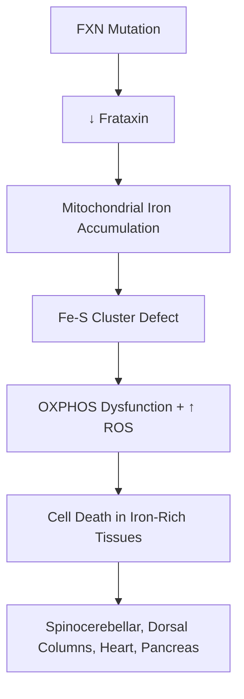
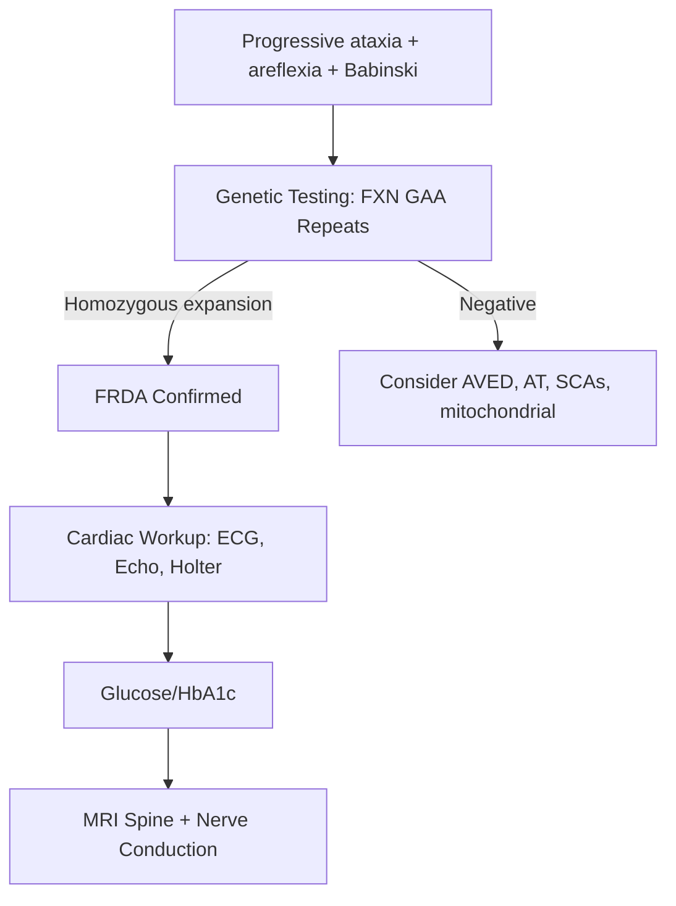

# Friedreich's Ataxia

> [!tip] **Definition**
> The most common **autosomal recessive hereditary ataxia**, caused by **GAA trinucleotide repeat expansion** in the **FXN gene** on chromosome 9q21 (frataxin). Hallmark: progressive gait and limb ataxia, **areflexia** (peripheral neuropathy), **Babinski signs** (corticospinal tract), **hypertrophic cardiomyopathy**, and **diabetes mellitus**.

> [!tip] **Pearl:** FRDA is the **classic cause of combined spinocerebellar + pyramidal + peripheral neuropathy + cardiomyopathy**. Differentiate from ataxia-telangiectasia (no cardiomyopathy), SCA (dominant), and AVED (vitamin E deficiency, treatable).

## Learning Objectives
- [ ] Define FRDA and GAA repeat expansion
- [ ] Explain autosomal recessive inheritance, anticipation, and frataxin function
- [ ] Recognise classic features: ataxia, areflexia, Babinski, cardiomyopathy, scoliosis, diabetes
- [ ] Localise lesion: dorsal columns, spinocerebellar tracts, corticospinal tracts, peripheral nerves
- [ ] Order investigations: genetic testing, ECG, Echo, MRI spine, nerve conduction
- [ ] Apply management: supportive, idebenone trial, multidisciplinary
- [ ] Counsel on genetic testing and family screening

---

## 1. Definition / Epidemiology / Classification

### Definition
A progressive autosomal recessive disorder characterised by neurodegeneration of spinocerebellar tracts, dorsal columns, corticospinal tracts, and dorsal root ganglia. Associated with hypertrophic cardiomyopathy and diabetes mellitus.

### Epidemiology
- **Prevalence:** 1 in 30,000-50,000 (most common hereditary ataxia)
- **Age at onset:** Usually 5-15 years (juvenile); up to 25% adult onset (>25 years)
- **Sex:** Equal
- **Ethnicity:** Caucasian > Asian/African

### Classification
| Type | GAA Repeats | Inheritance |
|------|-------------|-------------|
| **Typical FRDA** | 66-1000 (homozygous) | AR |
| **FRDA with retained reflexes** | Variable | AR |
| **Late-onset FRDA (LOFA)** | 120-500 | AR |
| **Very-late-onset (VLOFA)** | Smaller | AR |
| **Compound heterozygote** | Expansion + point mutation | AR |

---

## 2. Aetiology / Pathophysiology

### Genetics
- **FXN gene** on chromosome 9q21
- **GAA trinucleotide repeat expansion** in intron 1 (96% of cases; 4% point mutation + GAA)
- **Autosomal recessive** — both alleles affected
- **Anticipation** — earlier onset, more severe in subsequent generations (maternal transmission more)
- **Homozygosity for larger repeats** = earlier onset, more severe
- Frataxin is a **mitochondrial protein** involved in **iron-sulphur cluster biogenesis**

### Pathophysiology

- Iron accumulates in mitochondria → oxidative damage
- Tissues with high iron/energy demand most affected: dorsal root ganglia, heart, pancreas

---

## 3. Clinical Features

### History
- Progressive gait disturbance (sensory + cerebellar ataxia)
- Loss of ambulation (median 11-15 years after onset)
- Dysarthria, dysphagia
- Diabetes symptoms (polyuria, polydipsia)
- Cardiac symptoms (palpitations, dyspnoea)
- Family history (consanguinity, affected sibling)

### Examination
| Domain | Finding |
|--------|---------|
| **Higher cortical** | Usually preserved (cognition normal) |
| **Cranial nerves** | Nystagmus (gaze-evoked), optic atrophy (rare), dysarthria (scanning) |
| **Motor** | Weakness (distal), **areflexia** (LMN) + **Babinski signs** (UMN) — combined |
| **Sensory** | Vibration/proprioception loss (dorsal columns); peripheral neuropathy |
| **Coordination** | Gait + limb ataxia (sensory + cerebellar) |
| **Skeletal** | **Scoliosis**, pes cavus, hammer toes |
| **Cardiac** | Hypertrophic cardiomyopathy (60%), arrhythmias |
| **Endocrine** | **Diabetes mellitus (10-30%)** |

### Specific Features
| Feature | Frequency |
|---------|-----------|
| **Gait ataxia** | 100% |
| **Areflexia (lower limbs)** | 90% |
| **Babinski signs** | 70-80% |
| **Dysarthria** | 90% |
| **Scoliosis** | 60-80% |
| **Pes cavus** | 50-75% |
| **Cardiomyopathy** | 60-75% |
| **Diabetes** | 10-30% |
| **Loss of ambulation** | Median 11-15y after onset |
| **Death** | Median age 35-40y (cardiac arrhythmia) |

---

## 4. Diagnostic Approach

### Diagnostic Criteria
- **Gaze-evoked nystagmus, head titubation**
- **Ataxia + areflexia in lower limbs + extensor plantar**
- **Dysarthria**
- **Family history (AR)**
- **Genetic confirmation: GAA expansion in both FXN alleles**

---

## 5. Investigations

### First-Line
| Test | Finding |
|------|---------|
| **Genetic testing (FXN)** | **GAA repeat expansion** (normal <30; FRDA >66; full mutation 66-1000) |
| **ECG** | Non-specific ST/T changes, LVH |
| **Echocardiogram** | Hypertrophic cardiomyopathy (concentric LVH) |
| **24h Holter** | Atrial/ventricular arrhythmias |
| **Fasting glucose, HbA1c** | Diabetes |
| **Nerve conduction studies** | **Sensory axonal neuropathy** (SNAP absent) |

### Neuroimaging
- **MRI brain:** Cerebellar atrophy (especially vermis); **cervical cord atrophy**
- **MRI spine:** Atrophy of cervical cord (key imaging finding)
- **MRS:** NAA reduction in cerebellum

### Laboratory
- **Glucose tolerance test** — may reveal early diabetes
- **Vitamin E levels** — exclude AVED (treatable cause!)
- **CK** — mildly elevated

### Cardiac
- **Annual ECG + Echo** — required for monitoring
- **Cardiac MRI** — gold standard for fibrosis
- **BNP** — heart failure marker

---

## 6. Differential Diagnosis
| Differential | Distinguishing Feature |
|--------------|----------------------|
| **Ataxia-telangiectasia** | Telangiectasias, immunodeficiency, AFP elevated, **no cardiomyopathy** |
| **AVED (vit E deficiency)** | Low vitamin E, **treatable**; similar phenotype |
| **Spinocerebellar ataxias (SCAs)** | AD inheritance, anticipation, often pure cerebellar |
| **Charcot-Marie-Tooth** | Peripheral neuropathy predominant, foot deformities, no cerebellar |
| **Multiple sclerosis** | OCB+, dissemination, optic neuritis |
| **Brain tumour** | Progressive, focal signs, MRI |
| **Vitamin B12 deficiency** | Macrocytosis, low B12, posterior column signs |

---

## 7. Management

### Disease-Modifying (Limited)
| Agent | Mechanism |
|-------|-----------|
| **Idebenone** (CoQ10 analogue) | Reduced cardiac hypertrophy in trials; **not licensed in many countries** |
| **Coenzyme Q10** | Antioxidant; modest benefit |
| **Omaveloxolone** (Reata) | **FDA approved 2023** for FRDA — first disease-modifying therapy; Nrf2 activator |
| **Interferon-γ** | Trials ongoing |
| **Gene therapy** | Investigational |

### Symptomatic
| Symptom | Management |
|---------|------------|
| **Ataxia** | Physiotherapy, gait aids (canes, walkers, wheelchairs); adaptive equipment |
| **Dysarthria/dysphagia** | SLT; PEG if severe dysphagia |
| **Spasticity** | Baclofen, tizanidine; intrathecal baclofen |
| **Cardiomyopathy** | Beta-blockers (e.g., atenolol), ACE inhibitors; avoid strenuous exercise |
| **Arrhythmias** | Anti-arrhythmics; pacemaker if indicated |
| **Diabetes** | Standard therapy; early insulin often required |
| **Scoliosis** | Physiotherapy; bracing; surgical correction if severe |
| **Pes cavus** | Orthotics; surgical correction if symptomatic |

### Multidisciplinary Care
- Neurology, cardiology (CRUCIAL), endocrinology, orthopaedics, physiotherapy, OT, SLT, psychology, social work

### Genetic Counselling
- **AR inheritance** — 25% recurrence for affected sibling
- **Siblings** should be offered testing
- **Prenatal diagnosis** (CVS) available if family mutation known
- **Preimplantation genetic diagnosis** (PGD)

---

## 8. Drug Interactions / Cautions
| Drug | Concern |
|------|---------|
| **Strenuous exercise** | Cardiac risk; cardiomyopathy |
| **Aminoglycosides** | Ototoxicity; monitor levels |
| **Cardiotoxic drugs** | Avoid in cardiomyopathy |
| **Statins** | Use with caution |

---

## 9. Procedures
### Cardiac MRI
- **Indication:** Annual cardiac monitoring in FRDA
- **Finding:** Hypertrophy, fibrosis

### Orthopaedic Procedures
- **Indication:** Severe scoliosis (>50°), pes cavus, hip dysplasia
- **Procedure:** Spinal fusion, tendon release

---

## 10. Complications
| Complication | Frequency | Management |
|--------------|-----------|------------|
| **Cardiac arrhythmia** | 60% | Pacemaker/ICD if indicated |
| **Heart failure** | 25-30% | Standard HF therapy |
| **Diabetes** | 10-30% | Insulin |
| **Aspiration pneumonia** | Late | PEG, suction |
| **Pressure ulcers** | Late | 2-hourly turning |
| **Recurrent falls** | Common | Physiotherapy, home modifications |

---

## 11. Red Flags
- Progressive ataxia + areflexia + Babinski + cardiomyopathy = FRDA
- Diabetes in young ataxic patient = screen for FRDA
- Sudden cardiac death — annual cardiac monitoring essential
- Loss of ambulation before age 20 = severe FRDA
- Vitamin E deficiency (treatable!) — always exclude

---

## 12. Prognosis
| Factor | Good | Poor |
|--------|------|------|
| **Age at onset** | >15 years | <10 years |
| **GAA repeats** | Smaller (66-300) | Larger (>700) |
| **Cardiomyopathy** | None/mild | Severe with arrhythmia |
| **Diabetes** | Absent | Present |
| **Cardiac symptoms** | Absent | Heart failure |

- **Wheelchair-bound:** Median 11-15 years after onset
- **Survival:** Median 35-40 years; cardiac arrhythmia most common cause of death
- **Slowly progressive** — most survive into adulthood

---

## 13. Topic Correlation
| Topic | Overlap |
|-------|---------|
| Ataxia-Telangiectasia | AR ataxia with telangiectasias, no cardiomyopathy |
| SCAs | AD ataxias, cerebellar predominant |
| AVED | Vitamin E deficiency (treatable) |
| CMT | Pes cavus, peripheral neuropathy |

---

## 14. Special Situations
| Situation | Consideration |
|-----------|---------------|
| **Pregnancy** | Increased cardiac burden; obstetric cardiology input; vaginal delivery usually OK |
| **Anaesthesia** | Cardiomyopathy risk; avoid suxamethonium if hyperkalaemia risk |
| **Driving** | Progressive disability — DVLA assessment |
| **School/Work** | Adaptations; many complete education with support |
| **Palliative care** | Early integration |

---

## FCPS/MRCP High-Yield Summary
| Category | Key Points |
|----------|------------|
| **Definition** | AR hereditary ataxia; GAA repeat in FXN gene; frataxin deficiency |
| **Genetics** | GAA expansion in intron 1; AR; anticipation |
| **Clinical** | Ataxia + areflexia + Babinski + cardiomyopathy + diabetes |
| **Localisation** | Dorsal columns, spinocerebellar tracts, corticospinal tracts, dorsal root ganglia, heart, pancreas |
| **Diagnosis** | Genetic (FXN GAA); exclude AVED (vit E); ECG/Echo |
| **Management** | Omaveloxolone (new), idebenone (cardiac), supportive; cardiac monitoring CRUCIAL |
| **Prognosis** | Median survival 35-40y; cardiac death common |

---

## Viva Questions
1. **Q:** Gene and mutation in FRDA?
   **A:** FXN gene on 9q21; GAA trinucleotide repeat expansion in intron 1.
2. **Q:** Why is FRDA different from other hereditary ataxias?
   **A:** Combined UMN + LMN signs (Babinski + areflexia) + cardiomyopathy + diabetes (multi-system).
3. **Q:** Function of frataxin?
   **A:** Mitochondrial protein involved in iron-sulphur cluster biogenesis and iron homeostasis.
4. **Q:** FRDA vs AVED?
   **A:** AVED = vitamin E deficiency; **treatable** with supplementation; same phenotype.
5. **Q:** Most common cause of death in FRDA?
   **A:** Cardiac arrhythmia (60-75% have hypertrophic cardiomyopathy).
6. **Q:** What is the new disease-modifying therapy?
   **A:** Omaveloxolone (Reata, 2023) — Nrf2 activator.
7. **Q:** Why is anticipatory testing important?
   **A:** Allows cardiac monitoring (annually), genetic counselling, prenatal diagnosis.

---

## Common Confusions / Exam Traps
| Confusion | Clarification |
|-----------|---------------|
| FRDA vs CMT | FRDA has cerebellar ataxia + cardiomyopathy; CMT is peripheral |
| FRDA vs AT | AT has telangiectasias, AFP↑, no cardiomyopathy |
| Areflexia (LMN) + Babinski (UMN) | Combined pattern = FRDA; classic board question |
| Loss of position sense | Dorsal columns; common in FRDA |
| Always check Vitamin E | Treatable cause of similar phenotype (AVED) |

---

## Mnemonics
1. **FRDA** — **F**rataxin, **R**ecessive, **D**orsal columns, **A**taxia (autosomal recessive)
2. **Cardinal features** — **A**taxia, **A**reflexia, **B**abinski, **C**ardiomyopathy, **D**iabetes (**A-A-B-C-D**)
3. **Spinocerebellar + Dorsal columns + Corticospinal** — **SDC** tracts affected
4. **GAA Repeat** — **G**uanine-**A**denine-**A**denine; intronic expansion; chromosome 9

---

## MCQs (10)

1. **Q:** Genetic mutation in Friedreich's ataxia?
   **A:** CAG repeat in Huntingtin  **B:** GAA repeat in FXN  **C:** CTG repeat in DMPK  **D:** CGG repeat in FMR1
   **Answer:** B — GAA trinucleotide repeat expansion in intron 1 of FXN gene.

2. **Q:** Inheritance of FRDA?
   **A:** Autosomal dominant  **B:** Autosomal recessive  **C:** X-linked  **D:** Mitochondrial
   **Answer:** B — Autosomal recessive.

3. **Q:** Function of frataxin?
   **A:** Calcium channel  **B:** Mitochondrial iron homeostasis  **C:** DNA repair  **D:** Myelin protein
   **Answer:** B — Iron-sulphur cluster biogenesis; mitochondrial iron homeostasis.

4. **Q:** Classic neurological triad in FRDA?
   **A:** Ataxia + areflexia + Babinski  **B:** Ataxia + spasticity + tremor  **C:** Ataxia + rigidity + dementia  **D:** Ataxia + seizures + myoclonus
   **Answer:** A — Combined UMN + LMN signs are characteristic.

5. **Q:** Most common cardiac finding in FRDA?
   **A:** Dilated cardiomyopathy  **B:** Hypertrophic cardiomyopathy  **C:** Constrictive pericarditis  **D:** ASD
   **Answer:** B — Hypertrophic cardiomyopathy in 60-75% (concentric LVH).

6. **Q:** What treatable cause of similar phenotype should be excluded?
   **A:** Vitamin B12 deficiency  **B:** AVED (vitamin E)  **C:** Wilson's disease  **D:** Hypothyroidism
   **Answer:** B — AVED = ataxia with vitamin E deficiency; treatable with supplementation.

7. **Q:** Most common cause of death in FRDA?
   **A:** Aspiration  **B:** Cardiac arrhythmia  **C:** Sepsis  **D:** Status epilepticus
   **Answer:** B — Cardiac arrhythmia (annual monitoring essential).

8. **Q:** What is the FDA-approved disease-modifying therapy (2023)?
   **A:** Idebenone  **B:** Omaveloxolone  **C:** CoQ10  **D:** Gene therapy
   **Answer:** B — Omaveloxolone (Nrf2 activator) approved 2023.

9. **Q:** MRI finding in FRDA?
   **A:** Cerebellar atrophy + cervical cord atrophy  **B:** Basal ganglia lesions  **C:** Periventricular white matter  **D:** Pontine atrophy
   **Answer:** A — Cerebellar atrophy (vermis) + cervical cord atrophy is characteristic.

10. **Q:** Nerve conduction study finding in FRDA?
    **A:** Demyelinating neuropathy  **B:** Sensory axonal neuropathy (SNAP absent)  **C:** Normal  **D:** Motor neuropathy
    **Answer:** B — Sensory axonal neuropathy (dorsal root ganglia + peripheral nerve).

---

## SBA Questions (10)

1. **Scenario:** 14-year-old with progressive gait disturbance, absent ankle reflexes, bilateral Babinski signs, and recent diabetes diagnosis. Father died suddenly at age 38.
   **Options:** A. Friedreich's ataxia B. Ataxia-telangiectasia C. SCA1 D. AVED
   **Answer:** A — Ataxia + areflexia + Babinski + diabetes + sudden cardiac death (father) = FRDA. Genetic testing for FXN.

2. **Scenario:** 16-year-old with progressive ataxia, scoliosis, pes cavus. ECG shows LVH. Echo confirms HCM. What is the diagnosis?
   **Options:** A. FRDA B. AT C. Mitochondrial disease D. CMT
   **Answer:** A — Full FRDA phenotype: ataxia + skeletal + cardiac.

3. **Scenario:** FRDA patient presents with palpitations. Holter shows non-sustained VT. Most appropriate management?
   **Options:** A. Reassurance B. Beta-blocker, consider ICD C. Anticoagulation D. Pacemaker
   **Answer:** B — Beta-blocker first; consider ICD if high risk for sudden cardiac death.

4. **Scenario:** 18-year-old ataxic with vitamin E level of 1.2 mg/L (normal >5). Genetic testing for FXN negative. What is the diagnosis?
   **Options:** A. FRDA B. AVED C. AT D. SCA
   **Answer:** B — AVED (Ataxia with Vitamin E Deficiency) — TTPA gene. Treatable with vitamin E supplementation.

5. **Scenario:** FRDA patient develops progressive dysphagia and recurrent aspiration. Most appropriate intervention?
   **Options:** A. NG tube only B. PEG placement C. SLT only D. GORD therapy
   **Answer:** B — PEG if recurrent aspiration despite swallow therapy.

6. **Scenario:** Family of FRDA patient asks about prenatal testing for future pregnancy. What is the recurrence risk?
   **Options:** A. 0% B. 25% C. 50% D. 100%
   **Answer:** B — AR inheritance; 25% recurrence for siblings. CVS/PGD available.

7. **Scenario:** FRDA patient on follow-up, asymptomatic cardiac findings. What monitoring is required?
   **Options:** A. None B. Annual ECG + Echo C. Daily ECG D. Stress test only
   **Answer:** B — Annual ECG + Echo (some centres add cardiac MRI). Cardiomyopathy can be silent.

8. **Scenario:** 8-year-old with ataxia and telangiectasias in conjunctiva. AFP elevated. FXN test negative. Most likely diagnosis?
   **Options:** A. FRDA B. AT C. SCA D. Mito disease
   **Answer:** B — Ataxia-Telangiectasia: telangiectasias, immunodeficiency, AFP elevated, AR (ATM gene).

9. **Scenario:** FRDA patient asks about omaveloxolone. What is its mechanism?
   **Options:** A.** NF-κB inhibitor B. Nrf2 activator C. Iron chelator D. Frataxin replacement
   **Answer:** B — Nrf2 activator; upregulates antioxidant response; approved 2023 for FRDA.

10. **Scenario:** 25-year-old FRDA patient with longstanding diabetes. Annual review should include which besides cardiac?
    **Options:** A. LFTs only B. Renal + Retinal + Foot screening C. Colonoscopy D. EEG
    **Answer:** B — Standard diabetic monitoring (renal, retinal, foot); FRDA doesn't add additional screening.

---

## Flashcards
- **Q:** FRDA gene? **A:** FXN on 9q21 (frataxin)
- **Q:** FRDA mutation? **A:** GAA trinucleotide repeat expansion in intron 1
- **Q:** FRDA inheritance? **A:** Autosomal recessive
- **Q:** Cardinal features? **A:** Ataxia + Areflexia + Babinski + Cardiomyopathy + Diabetes (AABCD)
- **Q:** Frataxin function? **A:** Mitochondrial iron-sulphur cluster biogenesis
- **Q:** Most common cause of death? **A:** Cardiac arrhythmia (HCM)
- **Q:** Disease-modifying therapy 2023? **A:** Omaveloxolone (Nrf2 activator)
- **Q:** Treatable mimic? **A:** AVED (vitamin E deficiency)
- **Q:** MRI finding? **A:** Cerebellar atrophy + cervical cord atrophy
- **Q:** ECG finding? **A:** LVH (hypertrophic cardiomyopathy)
- **Q:** Recurrence risk? **A:** 25% (AR)
- **Q:** Annual monitoring? **A:** ECG + Echo; HbA1c; neurological exam

---

## Answer Key

### MCQs
1. **B** — GAA repeat in FXN
2. **B** — Autosomal recessive
3. **B** — Mitochondrial iron homeostasis
4. **A** — Ataxia + areflexia + Babinski
5. **B** — Hypertrophic cardiomyopathy
6. **B** — AVED (vitamin E)
7. **B** — Cardiac arrhythmia
8. **B** — Omaveloxolone
9. **A** — Cerebellar + cervical cord atrophy
10. **B** — Sensory axonal neuropathy

### SBAs
1. **A** — Full FRDA phenotype
2. **A** — FRDA with cardiac involvement
3. **B** — Beta-blocker ± ICD for VT
4. **B** — AVED with low vitamin E
5. **B** — PEG for recurrent aspiration
6. **B** — 25% recurrence (AR)
7. **B** — Annual ECG + Echo
8. **B** — AT with telangiectasias
9. **B** — Nrf2 activator
10. **B** — Standard diabetic monitoring

---

## One-Page Revision Card
| Topic | Friedreich's Ataxia |
|-------|---------------------|
| **Definition** | AR hereditary ataxia; GAA repeat in FXN; frataxin deficiency |
| **Genetics** | GAA expansion in intron 1; AR; anticipation |
| **Clinical** | Ataxia + Areflexia + Babinski + Cardiomyopathy + Diabetes |
| **Localisation** | Dorsal columns, spinocerebellar tracts, corticospinal tracts, dorsal root ganglia |
| **Diagnosis** | Genetic (FXN GAA); exclude AVED (vit E); ECG/Echo |
| **Management** | Omaveloxolone, idebenone, supportive; cardiac monitoring CRUCIAL |
| **Prognosis** | Median survival 35-40y; cardiac death common |

## PasTest Scenario SBAs (Clinical Vignettes)

> **Auto-generated PasTest/Mediscope-style scenario SBAs** grounded in the authored source. Each scenario tests a real clinical fact (triad, specific sign, contraindication, trial, first-line Rx) extracted from the topic. *Source: Ch 27: Neurology & Stroke — Friedreichs Ataxia*

**Q1.** Which of the following features is most specific or characteristic of Friedreichs Ataxia?

  - **A.** Nerve conduction
  - **B.** A feature common to many acute inflammatory conditions
  - **C.** A non-specific sign that does not localise the diagnosis
  - **D.** An investigation finding rather than a clinical feature

  > **Answer: A** — Nerve conduction
  >
  > *Source:* ardiomyopathy; conduction defects |
| **HbA1c / OGTT** | Baseline + annual | Diabetes screening |
| **Nerve conduction** | Atypical features | Axonal sensory neuropathy |
| **SSEP** | Optional | Abnor

**Q2.** What is the most appropriate first-line therapy for Friedreichs Ataxia?

  - **A.** Gene therapy
  - **B.** An advanced/surgical therapy reserved for refractory disease
  - **C.** Symptomatic treatment only, no disease-modifying therapy
  - **D.** Empiric broad-spectrum therapy without specific indication

  > **Answer: A** — Gene therapy
  >
  > *Source:* **Gene therapy** — preclinical

