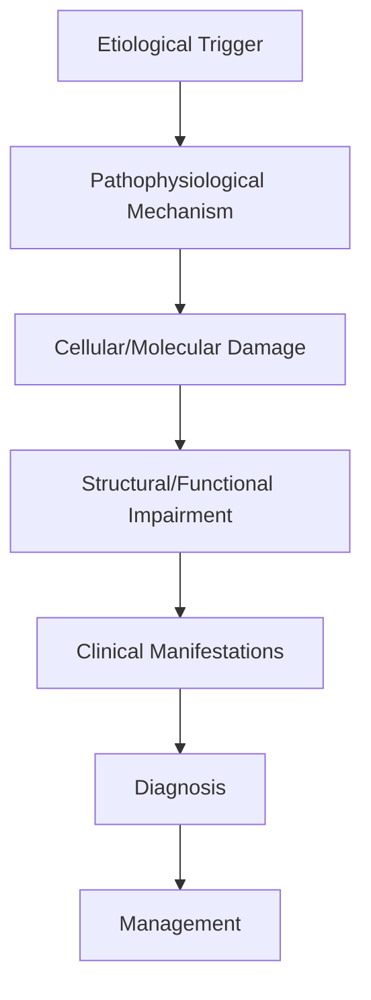
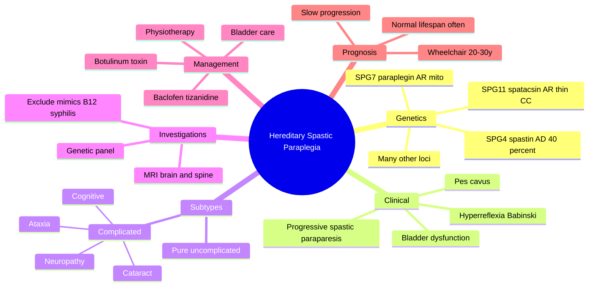

# Hereditary Spastic Paraplegia

> [!tip] **High-Yield Definition**
> Comprehensive clinical note for Hereditary Spastic Paraplegia covering definition, epidemiology, aetiology, pathophysiology, clinical features, investigations, differential diagnosis, management, drug interactions, procedures, complications, red flags, prognosis, topic correlation, and special situations for FCPS/MRCP examination preparation based on Davidson 24th Edition Chapter 25: Neurology.

---

## 1. Definition / Epidemiology / Classification

### Definition
Hereditary Spastic Paraplegia is a neurological disorder within the 18 genetic neurological disorders category. It is characterised by specific clinical, pathological, radiological, and laboratory features that allow differentiation from related conditions.

### Epidemiology
- **Incidence/Prevalence:** Variable depending on the specific condition.
- **Age:** Adult onset is most common, but paediatric and elderly presentations occur.
- **Sex:** Variable depending on the condition.
- **Geography:** Worldwide distribution, with higher prevalence in certain regions.
- **Risk Factors:** Genetic predisposition, environmental factors, comorbidities, family history.

### Classification
| Subtype | Key Features | Prognosis |
|---------|-------------|-----------|
| Mild/early | Subtle symptoms, preserved function | Best |
| Moderate | Clear symptoms, functional impairment | Variable |
| Severe | Significant disability, complications | Worst |

---

## 2. Aetiology / Pathophysiology

### Aetiology
- **Primary (idiopathic):** Most cases have no identifiable cause.
- **Genetic:** May be inherited (AD, AR, X-linked, mitochondrial, sporadic).
- **Autoimmune:** Autoantibodies, immune-mediated inflammation.
- **Infectious:** Viral, bacterial, fungal, parasitic.
- **Metabolic:** Electrolyte, endocrine, hepatic, renal, nutritional.
- **Toxic:** Drugs, alcohol, heavy metals, environmental toxins.
- **Vascular:** Ischaemia, haemorrhage, vasculitis.
- **Neoplastic:** Primary, secondary, paraneoplastic.
- **Traumatic:** Acute, chronic, repetitive.
- **Degenerative:** Neurodegeneration, protein misfolding.

### Pathophysiology


---

## 3. Clinical Features

### History
- **Onset/Duration:** Acute, subacute, or chronic.
- **Progression:** Static, progressive, relapsing-remitting, stepwise.
- **Key symptoms:** Specific to the condition.
- **Triggers:** Stress, infection, trauma, drugs, hormonal, environmental.
- **Systemic symptoms:** Constitutional features.
- **Drug/Family/Social history:** Relevant exposures, comorbidities.

### Examination
| Domain | Key Findings | Localisation Value |
|--------|-------------|-------------------|
| Higher function | Cognitive, behavioural | Cortical, subcortical, limbic |
| Cranial nerves | Pupils, eye movements, facial, bulbar | Brainstem, cranial nerve, NMJ |
| Motor | Weakness, tone, reflexes | UMN, LMN, NMJ, muscle |
| Sensory | All modalities, pattern | Peripheral, spinal, brainstem |
| Coordination | Ataxia, nystagmus, dysmetria | Cerebellar, sensory, vestibular |
| Gait | Spastic, ataxic, parkinsonian | Multiple |
| Autonomic | Orthostatic, sweating, GI, bladder | Autonomic, peripheral, central |

### Specific Clinical Features
The clinical features are determined by the underlying aetiology, location of pathology, and rate of progression. Patients typically present with a constellation of symptoms and signs that allow clinical localisation and subsequent targeted investigation.

---

## 4. Diagnostic Approach / Algorithm

```mermaid
flowchart TD
    A[Clinical Presentation] --> B[Anatomical Localisation]
    B --> C[Pathophysiological Category]
    C --> D[Formulate Differential]
    D --> E[Targeted Investigations]
    E --> F[Confirm Diagnosis]
    F --> G[Assess Severity/Prognosis]
    G --> H[Initiate Management]
    H --> I[Monitor Response]
    I --> J{Response?}
    J --> YES1 [Good - Continue]
    J --> NO1 [Poor - Escalate]
    YES1 --> K[Monitor]
    NO1 --> H
```

---

## 5. Investigations

### First-Line Investigations
- **Blood tests:** FBC, U&Es, LFTs, glucose, calcium, magnesium, ESR, CRP, autoimmune, infection.
- **Imaging:** CT/MRI brain/spine (essential for most neurological conditions).
- **Neurophysiology:** EEG, nerve conduction, EMG, evoked potentials.
- **CSF:** Cell count, protein, glucose, OCBs, PCR, culture.

### Second-Line Investigations
- **Genetic testing:** Gene panels, WES, WGS.
- **Antibody testing:** Antineuronal, autoimmune, paraneoplastic.
- **Biopsy:** Nerve, muscle, brain, skin.
- **Advanced imaging:** PET-CT, MR spectroscopy, fMRI.

### Specialised Investigations
- **Biomarkers:** Neurofilament light chain, tau, beta-amyloid, 14-3-3, RT-QuIC.
- **Autonomic testing:** Head-up tilt, sudomotor, QSART.
- **Neuropsychology:** Cognitive testing, behavioural assessment.
- **Genetic counselling:** Family screening, predictive testing.

---

## 6. Differential Diagnosis

| Differential | Distinguishing Features | Key Test |
|--------------|------------------------|----------|
| Vascular | Sudden onset, focal, vascular risk factors | MRI/CT, vessel imaging |
| Inflammatory | Subacute, multifocal, systemic | MRI, CSF, antibodies |
| Infectious | Fever, systemic, exposure | Bloods, CSF, imaging |
| Neoplastic | Progressive, mass effect | MRI, biopsy |
| Degenerative | Progressive, symmetric, hereditary | MRI, genetic |
| Toxic/Metabolic | Drug history, systemic, reversible | Bloods, toxicology |
| Autoimmune | Multifocal, antibodies, immunotherapy response | Antibodies, MRI, CSF |
| Functional | Inconsistent, distractible | Clinical, video, biomarkers |

---

## 7. Management

### Acute Management
- **Stabilisation:** ABCDE approach, emergency resuscitation.
- **Specific treatment:** Disease-specific interventions.
- **Symptomatic relief:** Pain, seizures, spasticity, autonomic dysfunction.
- **Prevention of complications:** DVT, pressure sores, infection.

### Disease-Modifying Treatment
- **Pharmacological:** First-line, second-line, escalation, maintenance.
- **Procedural:** Surgery, biopsy, drainage, ablation, stimulation.
- **Immunotherapy:** Steroids, IVIG, plasma exchange, immunosuppressants, biologics.
- **Rehabilitation:** Physiotherapy, OT, speech therapy.

### Long-Term Management
- **Monitoring:** Clinical, imaging, biomarkers, side effects.
- **Prevention:** Vaccinations, prophylaxis, lifestyle modification.
- **Supportive care:** Multidisciplinary team, social work, psychological support.
- **Palliative care:** Advanced care planning, end-of-life care, hospice.

---

## 8. Drug Interactions / Contraindications / Comorbidity Cautions

| Drug Class | Interaction / Caution | Management |
|------------|----------------------|------------|
| Antiseizure medications | Enzyme induction, teratogenicity | Monitor, supplement, switch |
| Immunosuppressants | Infection, malignancy, teratogenicity | Monitor, prophylaxis |
| Anticoagulants | Bleeding risk, drug interactions | Monitor INR, avoid combinations |
| Antihypertensives | Hypotension, falls | Monitor BP, adjust dose |
| Antibiotics | Nephrotoxicity, ototoxicity | Monitor renal |
| Antivirals | Nephrotoxicity, neuropsychiatric | Monitor renal, dose adjust |
| Steroids | DM, HTN, osteoporosis, infection | Monitor, prophylaxis, taper |
| Biologics | Infusion reactions, infection | Monitor, prophylaxis |

---

## 9. Procedures

### Common Procedures
- **Lumbar puncture:** Diagnostic, therapeutic (IIH, NPH). Contraindications: raised ICP, mass lesion, coagulopathy.
- **Nerve conduction studies/EMG:** Diagnostic, prognosis. Minor discomfort.
- **EEG:** Diagnostic, monitoring. No significant complications.
- **MRI brain/spine:** Diagnostic, monitoring. Contraindications: pacemaker, metallic implants.
- **CT head:** Emergency, rapid. Radiation exposure, contrast reactions.
- **Biopsy:** Stereotactic, open. Indications: diagnosis, molecular profiling.

---

## 10. Complications

| Complication | Frequency | Prevention | Management |
|--------------|-----------|------------|------------|
| Infection | Common | Hygiene, prophylaxis, vaccination | Antibiotics, antifungals |
| Thrombosis | Common | Prophylaxis, mobility | Anticoagulation |
| Pressure sores | Common | Positioning, nutrition | Wound care, surgery |
| Spasticity | Common | Positioning, stretching | Baclofen, BoNT |
| Contractures | Common | Passive movements, splints | Physiotherapy, surgery |
| Aspiration | Common | Swallow assessment | NGT, PEG, thickeners |
| Falls | Common | Environment, mobility | Walking aids |
| Fractures | Common | Bone health, prevention | Vitamin D, bisphosphonate |
| Depression | Common | Screening, support | Antidepressants, CBT |
| Cognitive decline | Variable | Monitoring, training | Rehabilitation |
| Autonomic dysfunction | Variable | Monitoring, hydration | Midodrine, fludrocortisone |
| Respiratory failure | Variable | Monitoring, supportive | Ventilation, NIV |
| Death | Variable | Monitoring, palliative | End-of-life care |

---

## 11. Red Flags / Emergencies

### Emergency Presentations
- **Rapid neurological deterioration:** New focal deficit, decreased consciousness, seizures.
- **Status epilepticus:** Continuous seizures >5 min.
- **Raised ICP:** Headache, vomiting, papilloedema, altered consciousness.
- **Respiratory failure:** Hypoxia, hypercapnia, ventilatory failure.
- **Cardiac arrest:** Arrhythmia, MI, pulmonary embolism.
- **Infection:** Sepsis, meningitis, abscess, encephalitis.
- **Drug toxicity:** Overdose, side effects, interactions.
- **Haemorrhage:** Intracranial, systemic, coagulopathy.

---

## 12. Prognosis

### Natural History
- **Acute:** May resolve with treatment, may progress, may be fatal.
- **Subacute:** Variable, depends on cause and treatment.
- **Chronic:** Often progressive, may be stable, may have relapses.
- **Recovery:** Variable, may be complete, partial, or none.

### Prognostic Factors
- **Favourable:** Young age, early treatment, mild disease, reversible cause, good premorbid function, family support.
- **Unfavourable:** Older age, delayed treatment, severe disease, irreversible cause, poor premorbid function, comorbidities.

---

## 13. Topic Correlation

| Related Topic | Link | Key Overlap |
|---------------|------|-------------|
| Davidson 24th Ed Chapter 25 | [[Davidson Chapter 25 - Neurology Hierarchy]] | Comprehensive neurology |
| Neurology MOC | [[Neurology MOC]] | All neurology topics |
| Drug Reference | [[../00_Index/Neurology Drug Reference]] | Medications |
| Local Hub | [[../18_Genetic_Neurological_Disorders/Hub]] | Section-specific |
| Clinical Examination | [[../01_Fundamentals_Examination/Neurological History Taking]] | Clinical approach |
| Investigation | [[../01_Fundamentals_Examination/Neuroimaging (CT-MRI) Principles]] | Imaging |

---

## 14. Special Situations

| Situation | Consideration |
|-----------|---------------|
| **Pregnancy** | Pre-conception counselling, teratogenicity, drug safety, monitoring, delivery planning, breastfeeding. |
| **Lactation** | Drug safety, breastfeeding, monitoring, support. |
| **Paediatric** | Developmental considerations, drug dosing, school, family, vaccination, growth, puberty. |
| **Elderly / Frail** | Comorbidities, polypharmacy, falls, bone health, cognition, social, end-of-life. |
| **Renal impairment** | Drug dose adjustment, monitoring, dialysis, transplant. |
| **Hepatic impairment** | Drug dose adjustment, monitoring, transplant. |
| **Immunocompromised** | Infection prophylaxis, vaccination, drug interactions, malignancy screening. |
| **Perioperative** | Drug management, anaesthesia planning, VTE prophylaxis, infection prevention, monitoring. |
| **Driving / DVLA** | Fitness to drive, restrictions, notification, reassessment. |
| **Occupational** | Fitness for work, adaptations, rehabilitation, disability, return to work. |

---

## FCPS/MRCP High-Yield Summary

| Category | Key Points |
|----------|------------|
| **Definition** | Comprehensive definition with key diagnostic criteria |
| **Epidemiology** | Incidence, prevalence, age, sex, geography, risk factors |
| **Aetiology** | Primary causes, secondary causes, genetic, environmental |
| **Pathophysiology** | Mechanism of disease, cellular/molecular basis |
| **Clinical Features** | History, examination, key findings, variants |
| **Diagnosis** | Diagnostic criteria, classification, severity |
| **Investigations** | First-line, second-line, specialised, biomarkers |
| **Differential Diagnosis** | Key differentials, distinguishing features, tests |
| **Management** | Acute, disease-modifying, symptomatic, supportive |
| **Complications** | Common, serious, prevention, management |
| **Prognosis** | Natural history, prognostic factors, outcomes |
| **Viva Pearls** | Key examination points |
| **Drug Doses** | First-line, second-line, emergency |
| **Scoring Systems** | Specific scores used in management |
| **Genetics** | Inheritance, genes, mutations, family screening |
| **Imaging Signs** | Characteristic findings, differential |

---

## Viva Questions (PACES/FCPS Style)

1. **Q:** Define and classify its variants.
   **A:** Comprehensive definition with classification of subtypes based on aetiology, severity, and clinical features.

2. **Q:** What are the key clinical features?
   **A:** Specific symptoms and signs including onset, progression, key features, and associated findings.

3. **Q:** What is the first-line treatment?
   **A:** First-line pharmacological and non-pharmacological management based on current evidence.

4. **Q:** What are the red flags requiring urgent referral?
   **A:** Specific emergency presentations and complications requiring immediate intervention.

5. **Q:** What is the prognosis?
   **A:** Natural history, prognostic factors, and long-term outcomes.

6. **Q:** How do you differentiate from key differentials?
   **A:** Clinical features, investigations, and response to treatment that distinguish from alternative diagnoses.

7. **Q:** What investigations are most useful?
   **A:** First-line and second-line investigations including imaging, neurophysiology, CSF, and biomarkers.

8. **Q:** Describe the stepwise management approach.
   **A:** Stepwise escalation from first-line to second-line to third-line therapy with monitoring.

9. **Q:** What are the emergency presentations?
   **A:** Specific emergency scenarios and immediate management priorities.

10. **Q:** How does management change in pregnancy/paediatrics/elderly?
    **A:** Special considerations for each population including drug safety, monitoring, and support.

---

## Common Confusions / Exam Traps

| Confusion | Clarification |
|-----------|---------------|
| Similar presentation but different cause | Differentiate by history, examination, investigations |
| Treatment response vs natural history | Assess with objective measures, biomarkers |
| Drug interactions | Check each drug, monitor, adjust doses |
| Disease progression vs treatment failure | Monitor response, escalate appropriately |
| Functional vs organic | Inconsistent, distractible, disability greater than impairment |
| Acute vs chronic | Time course, progression, reversibility |
| Primary vs secondary | Underlying cause, contributing factors |
| Side effects vs symptoms | Temporal relationship, dose relationship |

---

## Mnemonics

1. **HSP 4-7-11** — Most common types: **SPG4** (spastin, AD, ~40%), **SPG7** (paraplegin, AR, mitochondrial), **SPG11** (spatacsin, AR, complicated, thin corpus callosum).
2. **PURE vs COMPLICATED** — **Pure** = spastic paraparesis + bladder ± mild sensory loss; **Complicated** = + ataxia, neuropathy, dementia, thin CC, cataract, skin changes.
3. **Length-Dependent Axonopathy** — Longest corticospinal + dorsal column axons degenerate first → "dying-back" pattern from toes upward.
4. **"Spastic but Strong"** — Markedly spastic gait with relatively preserved strength (paradox of HSP).
5. **Mitochondrial SPG7** — Paraplegin is a mitochondrial AAA metalloprotease; mutations cause **optic atrophy + cerebellar signs** (complicated).
6. **SPG11 Clue** — "Childhood onset spastic paraparesis + thin corpus callosum on MRI + learning difficulties" = SPG11 (most common AR HSP).
7. **Bladder Always** — Urinary urgency/incontinence is a near-universal feature; erectile dysfunction in males.
8. **Stiff-Leg Sign** — Slow, scissoring gait with equinus; exaggerated knee/ankle reflexes; upgoing plantars.
9. **Dopa-Responsive Mimic** — Consider **Dopa-responsive dystonia (GTP cyclohydrolase, Sepiapterin reductase)** in childhood HSP mimics.
10. **Counsel** — **No disease-modifying therapy**; symptomatic spasticity management + genetic counselling for AD/AR patterns.

---

## Mind Map



---

## Spaced Repetition Trackers

| Day | Topic | Question (front) | Answer (back) | Confidence (1-5) |
|-----|-------|------------------|---------------|------------------|
| 1 | Commonest type | Most common AD HSP? | SPG4 (spastin) | 4 |
| 1 | Commonest AR | Most common AR HSP? | SPG11 (spatacsin) | 3 |
| 2 | Pathology | Pathophysiology of HSP? | Length-dependent axonopathy of corticospinal + dorsal columns | 4 |
| 3 | MRI clue | MRI finding in SPG11? | Thin corpus callosum (best seen on sagittal T1) | 3 |
| 5 | Mitochondrial | Gene in SPG7? | Paraplegin (mitochondrial AAA metalloprotease) | 4 |
| 7 | Bladder | Bladder symptom? | Urinary urgency/frequency/incontinence | 5 |
| 10 | Foot | Common foot deformity? | Pes cavus | 4 |
| 14 | Mimic | Childhood HSP mimic to exclude? | Dopa-responsive dystonia (DYT5a, GCH1) | 3 |
| 21 | Spasticity Rx | First-line drug for spasticity? | Oral baclofen | 4 |
| 30 | Inheritance | Inheritance of SPG4? | Autosomal dominant (most) | 5 |

---

## Self-Test Scorecard

| Domain | Questions Attempted | Correct | Accuracy | Weak Areas |
|--------|---------------------|---------|----------|------------|
| Genetics & Subtypes | /3 | | | |
| Clinical Features | /3 | | | |
| Investigations & Differential | /2 | | | |
| Management | /2 | | | |
| **Overall** | **/10** | | | |

---

## MCQs (10)

1. **Q:** The most common genetic type of Hereditary Spastic Paraplegia is:
   **A:** A. SPG4 (spastin)  **B.** SPG7 (paraplegin)  **C.** SPG11 (spatacsin)  **D.** SPG3A (atlastin)
   **Answer:** A — SPG4.
   **Explanation:** SPG4 (mutations in SPAST gene encoding spastin, a microtubule-severing ATPase) accounts for ~40% of all HSP and is the most common AD form.

2. **Q:** Pathological hallmark of HSP is:
   **A:** A. Demyelination of cortical neurons  **B.** Axonal degeneration of longest corticospinal tracts  **C.** Cerebellar Purkinje cell loss  **D.** Anterior horn cell death
   **Answer:** B — Axonal degeneration of longest corticospinal tracts.
   **Explanation:** "Dying-back" axonopathy affects the longest descending corticospinal fibres and, to a lesser extent, dorsal columns and spinocerebellar tracts.

3. **Q:** Which HSP subtype is associated with a thin corpus callosum on MRI?
   **A:** A. SPG4  **B.** SPG7  **C.** SPG11  **D.** SPG3A
   **Answer:** C — SPG11.
   **Explanation:** SPG11 (spatacsin mutations) classically shows a thin/hypoplastic corpus callosum on sagittal MRI, often with cognitive impairment and early-onset spastic paraparesis.

4. **Q:** SPG7 is caused by mutations in:
   **A:** A. SPAST  **B.** SPG7 (paraplegin)  **C.** SPG11  **D.** ATL1
   **Answer:** B — SPG7 (paraplegin).
   **Explanation:** SPG7 encodes paraplegin, a mitochondrial AAA metalloprotease involved in mitochondrial ribosome assembly and iron-sulphur cluster biogenesis.

5. **Q:** Which of the following is NOT a feature of "pure" HSP?
   **A:** A. Spastic paraplegia  **B.** Bladder dysfunction  **C.** Cerebellar ataxia  **D.** Hyperreflexia
   **Answer:** C — Cerebellar ataxia.
   **Explanation:** Cerebellar ataxia indicates "complicated" HSP. Pure HSP features spastic paraplegia, hyperreflexia, Babinski sign, and bladder dysfunction without major additional neurological features.

6. **Q:** The foot deformity most commonly associated with HSP is:
   **A:** A. Pes planus  **B.** Pes cavus  **C.** Talipes equinovarus only  **D.** No deformity
   **Answer:** B — Pes cavus.
   **Explanation:** Pes cavus (high-arched foot) is common in HSP due to chronic imbalance of intrinsic foot muscles and tibialis anterior hyperactivity.

7. **Q:** Inheritance pattern of the most common AR HSP (SPG11) is:
   **A:** A. Autosomal dominant  **B.** Autosomal recessive  **C.** X-linked  **D.** Mitochondrial
   **Answer:** B — Autosomal recessive.
   **Explanation:** SPG11 is autosomal recessive and the most common complicated AR HSP, with thin corpus callosum and often peripheral neuropathy/cognitive impairment.

8. **Q:** First-line oral medication for spasticity in HSP is:
   **A:** A. Diazepam  **B.** Baclofen  **C.** Tizanidine  **D.** Dantrolene
   **Answer:** B — Baclofen.
   **Explanation:** Oral baclofen (GABA-B agonist) is generally first-line; tizanidine (alpha-2 agonist) and benzodiazepines are alternatives. Intrathecal baclofen may be used in severe cases.

9. **Q:** A dopa-responsive HSP mimic to exclude in a child with gait disturbance is:
   **A:** A. FRDA  **B.** DYT5a (Segawa disease, GCH1)  **C.** AT  **D.** Mitochondrial disease
   **Answer:** B — DYT5a (Segawa disease).
   **Explanation:** GTP cyclohydrolase 1 deficiency (Segawa disease / DYT5a) presents with childhood-onset gait disorder, diurnal fluctuation, and dramatic response to low-dose levodopa — a critical treatable mimic.

10. **Q:** Which investigation is most important to exclude structural / treatable causes before diagnosing HSP?
    **A:** A. Genetic panel only  **B.** MRI whole neuraxis + B12/syphilis/HIV serology  **C.** EEG  **D.** Muscle biopsy
    **Answer:** B — MRI + serology.
    **Explanation:** Treatable and structural mimics (cord compression, demyelination, B12 deficiency, neurosyphilis, HIV, MS) must be excluded by MRI brain/spine and serology before a hereditary diagnosis is accepted.

---

## SBA Questions (10)

1. **Scenario:** 35-year-old man with 5-year progressive stiffness of legs, scissoring gait, brisk knee reflexes, upgoing plantars, and urinary urgency. Father similar history. Most likely diagnosis?
   **Options:** A. SPG4 HSP  **B.** ALS  **C.** MS  **D.** Cord compression
   **Answer:** A — SPG4 hereditary spastic paraplegia.
   **Explanation:** Slowly progressive spastic paraparesis over years with AD family history and bladder involvement is classic SPG4. ALS has LMN signs and rapid progression; MS has sensory/optic involvement; cord compression has sensory level.

2. **Scenario:** 8-year-old with progressive spastic paraparesis, learning difficulties, and MRI showing a thin corpus callosum. Genetic test most likely to confirm?
   **Options:** A. SPAST  **B.** SPG11  **C.** SPG7  **D.** FXN
   **Answer:** B — SPG11.
   **Explanation:** Thin corpus callosum + childhood spastic paraplegia + cognitive impairment = SPG11 (spatacsin). SPAST causes adult pure AD HSP; FXN is Friedreich ataxia (AR, ataxia+areflexia, not spastic).

3. **Scenario:** 45-year-old with spastic paraparesis, cerebellar ataxia, and optic atrophy. What is the likely genotype?
   **Options:** A. SPG4  **B.** SPG7  **C.** SPG11  **D.** SPG3A
   **Answer:** B — SPG7.
   **Explanation:** Spastic paraparesis with cerebellar ataxia and optic atrophy suggests mitochondrial SPG7 (paraplegin). This is a "complicated" AR HSP.

4. **Scenario:** HSP patient with severe adductor spasticity unresponsive to oral baclofen and tizanidine. Next intervention?
   **Options:** A. Increase oral baclofen  **B.** Intrathecal baclofen pump  **C.** Spinal cord stimulator  **D.** Laminectomy
   **Answer:** B — Intrathecal baclofen pump.
   **Explanation:** Intrathecal baclofen delivers drug directly to spinal cord with much lower systemic doses, highly effective for severe spinal spasticity refractory to oral agents.

5. **Scenario:** HSP patient with severe adductor/hamstring spasticity and scissoring gait. Focal treatment option?
   **Options:** A. Oral baclofen  **B.** Botulinum toxin injection  **C.** Cordotomy  **D.** Rhizotomy
   **Answer:** B — Botulinum toxin to spastic muscles.
   **Explanation:** Botulinum toxin injection into adductors, hamstrings, or gastrocnemius provides focal spasticity relief and improves gait, hygiene, and pain; effect lasts 3-4 months.

6. **Scenario:** Female SPG4 carrier planning pregnancy. Recurrence risk for child?
   **Options:** A. 0%  **B.** 25%  **C.** 50%  **D.** 100%
   **Answer:** C — 50% (autosomal dominant).
   **Explanation:** SPG4 is AD with reduced (age-dependent) penetrance; each child has 50% chance of inheriting the mutation. Variable expressivity means severity may differ. Genetic counselling recommended.

7. **Scenario:** A 25-year-old with pure HSP (SPG4) asks about prognosis. Most accurate answer?
   **Options:** A. Wheelchair-bound by 30  **B.** Slow progression, may remain ambulant for decades, normal lifespan  **C.** Death within 5 years  **D.** Complete recovery expected
   **Answer:** B — Slow progression, often normal lifespan.
   **Explanation:** SPG4 HSP is slowly progressive; most patients remain ambulant with aids for decades and have a normal lifespan. Anticipation does not occur (unlike CAG repeat disorders).

8. **Scenario:** 60-year-old with very slowly progressive gait stiffness over 20 years, no upper-limb involvement, no cognitive decline. Which feature supports HSP over ALS?
   **Options:** A. Asymmetric weakness  **B.** Preserved power with spasticity and hyperreflexia only  **C.** Fasciculations  **D.** Bulbar involvement
   **Answer:** B — Spasticity with preserved power, no LMN signs.
   **Explanation:** ALS has combined UMN + LMN signs (fasciculations, wasting, weakness), bulbar involvement, and rapid progression. HSP shows "spastic but strong" with pure UMN pattern and slow progression.

9. **Scenario:** Patient with HSP on baclofen complains of new weakness and lethargy. Likely cause?
   **Options:** A. Disease progression  **B.** Baclofen side-effect  **C.** Stroke  **D.** Depression
   **Answer:** B — Baclofen side-effect (sedation/effect on tone causing apparent weakness).
   **Explanation:** Baclofen causes sedation, dizziness, and weakness especially with up-titration; reducing the dose and slower titration usually resolves symptoms.

10. **Scenario:** Adult with HSP requires urological review for urinary urgency. First-line management?
    **Options:** A. Indwelling catheter  **B.** Anticholinergics (e.g., oxybutynin) + bladder training  **C.** Cystectomy  **D.** No treatment
    **Answer:** B — Anticholinergics + bladder training.
    **Explanation:** Detrusor overactivity is common; bladder training, pelvic floor physiotherapy, and anticholinergics (oxybutynin, tolterodine) or mirabegron (β3 agonist) are first-line. Catheters reserved for retention.

---

## Tags

`#HSP` `#hereditary-spastic-paraplegia` `#SPG4` `#spastin` `#SPG7` `#paraplegin` `#SPG11` `#spatacsin` `#autosomal-dominant` `#autosomal-recessive` `#spastic-paraparesis` `#pes-cavus` `#thin-corpus-callosum` `#baclofen` `#botulinum-toxin` `#intrathecal-baclofen` `#genetic-counselling` `#FCPS` `#MRCP`
## Local Navigation
**Heading Hub:** [[../Hub]]  
**Chapter Hierarchy:** [[Davidson Chapter 25 - Neurology Hierarchy]]  
**Chapter MOC:** [[Neurology MOC]]  
**Drug Reference:** [[../00_Index/Neurology Drug Reference]]  
