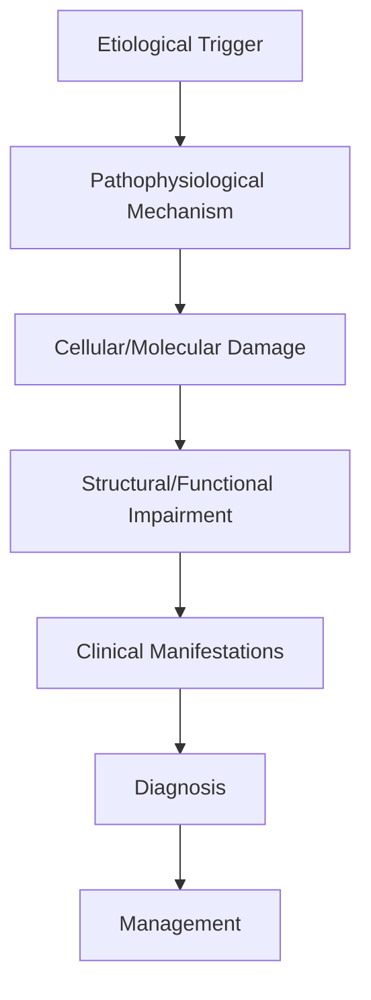
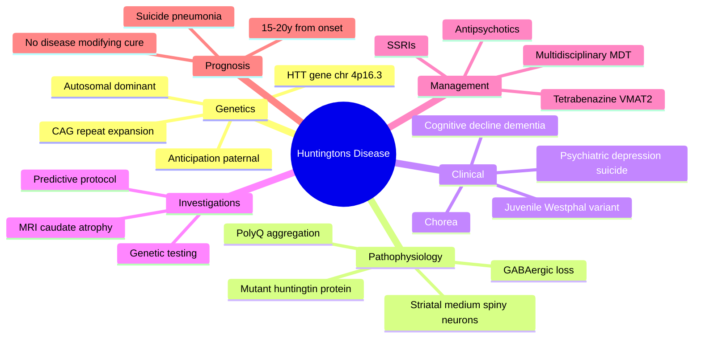

# Huntingtons Disease

> [!tip] **High-Yield Definition**
> Comprehensive clinical note for Huntingtons Disease covering definition, epidemiology, aetiology, pathophysiology, clinical features, investigations, differential diagnosis, management, drug interactions, procedures, complications, red flags, prognosis, topic correlation, and special situations for FCPS/MRCP examination preparation based on Davidson 24th Edition Chapter 25: Neurology.

---

## 1. Definition / Epidemiology / Classification

### Definition
Huntingtons Disease is a neurological disorder within the 18 genetic neurological disorders category. It is characterised by specific clinical, pathological, radiological, and laboratory features that allow differentiation from related conditions.

### Epidemiology
- **Incidence/Prevalence:** Variable depending on the specific condition.
- **Age:** Adult onset is most common, but paediatric and elderly presentations occur.
- **Sex:** Variable depending on the condition.
- **Geography:** Worldwide distribution, with higher prevalence in certain regions.
- **Risk Factors:** Genetic predisposition, environmental factors, comorbidities, family history.

### Classification
| Subtype | Key Features | Prognosis |
|---------|-------------|-----------|
| Mild/early | Subtle symptoms, preserved function | Best |
| Moderate | Clear symptoms, functional impairment | Variable |
| Severe | Significant disability, complications | Worst |

---

## 2. Aetiology / Pathophysiology

### Aetiology
- **Primary (idiopathic):** Most cases have no identifiable cause.
- **Genetic:** May be inherited (AD, AR, X-linked, mitochondrial, sporadic).
- **Autoimmune:** Autoantibodies, immune-mediated inflammation.
- **Infectious:** Viral, bacterial, fungal, parasitic.
- **Metabolic:** Electrolyte, endocrine, hepatic, renal, nutritional.
- **Toxic:** Drugs, alcohol, heavy metals, environmental toxins.
- **Vascular:** Ischaemia, haemorrhage, vasculitis.
- **Neoplastic:** Primary, secondary, paraneoplastic.
- **Traumatic:** Acute, chronic, repetitive.
- **Degenerative:** Neurodegeneration, protein misfolding.

### Pathophysiology


---

## 3. Clinical Features

### History
- **Onset/Duration:** Acute, subacute, or chronic.
- **Progression:** Static, progressive, relapsing-remitting, stepwise.
- **Key symptoms:** Specific to the condition.
- **Triggers:** Stress, infection, trauma, drugs, hormonal, environmental.
- **Systemic symptoms:** Constitutional features.
- **Drug/Family/Social history:** Relevant exposures, comorbidities.

### Examination
| Domain | Key Findings | Localisation Value |
|--------|-------------|-------------------|
| Higher function | Cognitive, behavioural | Cortical, subcortical, limbic |
| Cranial nerves | Pupils, eye movements, facial, bulbar | Brainstem, cranial nerve, NMJ |
| Motor | Weakness, tone, reflexes | UMN, LMN, NMJ, muscle |
| Sensory | All modalities, pattern | Peripheral, spinal, brainstem |
| Coordination | Ataxia, nystagmus, dysmetria | Cerebellar, sensory, vestibular |
| Gait | Spastic, ataxic, parkinsonian | Multiple |
| Autonomic | Orthostatic, sweating, GI, bladder | Autonomic, peripheral, central |

### Specific Clinical Features
The clinical features are determined by the underlying aetiology, location of pathology, and rate of progression. Patients typically present with a constellation of symptoms and signs that allow clinical localisation and subsequent targeted investigation.

---

## 4. Diagnostic Approach / Algorithm

```mermaid
flowchart TD
    A[Clinical Presentation] --> B[Anatomical Localisation]
    B --> C[Pathophysiological Category]
    C --> D[Formulate Differential]
    D --> E[Targeted Investigations]
    E --> F[Confirm Diagnosis]
    F --> G[Assess Severity/Prognosis]
    G --> H[Initiate Management]
    H --> I[Monitor Response]
    I --> J{Response?}
    J --> YES1 [Good - Continue]
    J --> NO1 [Poor - Escalate]
    YES1 --> K[Monitor]
    NO1 --> H
```

---

## 5. Investigations

### First-Line Investigations
- **Blood tests:** FBC, U&Es, LFTs, glucose, calcium, magnesium, ESR, CRP, autoimmune, infection.
- **Imaging:** CT/MRI brain/spine (essential for most neurological conditions).
- **Neurophysiology:** EEG, nerve conduction, EMG, evoked potentials.
- **CSF:** Cell count, protein, glucose, OCBs, PCR, culture.

### Second-Line Investigations
- **Genetic testing:** Gene panels, WES, WGS.
- **Antibody testing:** Antineuronal, autoimmune, paraneoplastic.
- **Biopsy:** Nerve, muscle, brain, skin.
- **Advanced imaging:** PET-CT, MR spectroscopy, fMRI.

### Specialised Investigations
- **Biomarkers:** Neurofilament light chain, tau, beta-amyloid, 14-3-3, RT-QuIC.
- **Autonomic testing:** Head-up tilt, sudomotor, QSART.
- **Neuropsychology:** Cognitive testing, behavioural assessment.
- **Genetic counselling:** Family screening, predictive testing.

---

## 6. Differential Diagnosis

| Differential | Distinguishing Features | Key Test |
|--------------|------------------------|----------|
| Vascular | Sudden onset, focal, vascular risk factors | MRI/CT, vessel imaging |
| Inflammatory | Subacute, multifocal, systemic | MRI, CSF, antibodies |
| Infectious | Fever, systemic, exposure | Bloods, CSF, imaging |
| Neoplastic | Progressive, mass effect | MRI, biopsy |
| Degenerative | Progressive, symmetric, hereditary | MRI, genetic |
| Toxic/Metabolic | Drug history, systemic, reversible | Bloods, toxicology |
| Autoimmune | Multifocal, antibodies, immunotherapy response | Antibodies, MRI, CSF |
| Functional | Inconsistent, distractible | Clinical, video, biomarkers |

---

## 7. Management

### Acute Management
- **Stabilisation:** ABCDE approach, emergency resuscitation.
- **Specific treatment:** Disease-specific interventions.
- **Symptomatic relief:** Pain, seizures, spasticity, autonomic dysfunction.
- **Prevention of complications:** DVT, pressure sores, infection.

### Disease-Modifying Treatment
- **Pharmacological:** First-line, second-line, escalation, maintenance.
- **Procedural:** Surgery, biopsy, drainage, ablation, stimulation.
- **Immunotherapy:** Steroids, IVIG, plasma exchange, immunosuppressants, biologics.
- **Rehabilitation:** Physiotherapy, OT, speech therapy.

### Long-Term Management
- **Monitoring:** Clinical, imaging, biomarkers, side effects.
- **Prevention:** Vaccinations, prophylaxis, lifestyle modification.
- **Supportive care:** Multidisciplinary team, social work, psychological support.
- **Palliative care:** Advanced care planning, end-of-life care, hospice.

---

## 8. Drug Interactions / Contraindications / Comorbidity Cautions

| Drug Class | Interaction / Caution | Management |
|------------|----------------------|------------|
| Antiseizure medications | Enzyme induction, teratogenicity | Monitor, supplement, switch |
| Immunosuppressants | Infection, malignancy, teratogenicity | Monitor, prophylaxis |
| Anticoagulants | Bleeding risk, drug interactions | Monitor INR, avoid combinations |
| Antihypertensives | Hypotension, falls | Monitor BP, adjust dose |
| Antibiotics | Nephrotoxicity, ototoxicity | Monitor renal |
| Antivirals | Nephrotoxicity, neuropsychiatric | Monitor renal, dose adjust |
| Steroids | DM, HTN, osteoporosis, infection | Monitor, prophylaxis, taper |
| Biologics | Infusion reactions, infection | Monitor, prophylaxis |

---

## 9. Procedures

### Common Procedures
- **Lumbar puncture:** Diagnostic, therapeutic (IIH, NPH). Contraindications: raised ICP, mass lesion, coagulopathy.
- **Nerve conduction studies/EMG:** Diagnostic, prognosis. Minor discomfort.
- **EEG:** Diagnostic, monitoring. No significant complications.
- **MRI brain/spine:** Diagnostic, monitoring. Contraindications: pacemaker, metallic implants.
- **CT head:** Emergency, rapid. Radiation exposure, contrast reactions.
- **Biopsy:** Stereotactic, open. Indications: diagnosis, molecular profiling.

---

## 10. Complications

| Complication | Frequency | Prevention | Management |
|--------------|-----------|------------|------------|
| Infection | Common | Hygiene, prophylaxis, vaccination | Antibiotics, antifungals |
| Thrombosis | Common | Prophylaxis, mobility | Anticoagulation |
| Pressure sores | Common | Positioning, nutrition | Wound care, surgery |
| Spasticity | Common | Positioning, stretching | Baclofen, BoNT |
| Contractures | Common | Passive movements, splints | Physiotherapy, surgery |
| Aspiration | Common | Swallow assessment | NGT, PEG, thickeners |
| Falls | Common | Environment, mobility | Walking aids |
| Fractures | Common | Bone health, prevention | Vitamin D, bisphosphonate |
| Depression | Common | Screening, support | Antidepressants, CBT |
| Cognitive decline | Variable | Monitoring, training | Rehabilitation |
| Autonomic dysfunction | Variable | Monitoring, hydration | Midodrine, fludrocortisone |
| Respiratory failure | Variable | Monitoring, supportive | Ventilation, NIV |
| Death | Variable | Monitoring, palliative | End-of-life care |

---

## 11. Red Flags / Emergencies

### Emergency Presentations
- **Rapid neurological deterioration:** New focal deficit, decreased consciousness, seizures.
- **Status epilepticus:** Continuous seizures >5 min.
- **Raised ICP:** Headache, vomiting, papilloedema, altered consciousness.
- **Respiratory failure:** Hypoxia, hypercapnia, ventilatory failure.
- **Cardiac arrest:** Arrhythmia, MI, pulmonary embolism.
- **Infection:** Sepsis, meningitis, abscess, encephalitis.
- **Drug toxicity:** Overdose, side effects, interactions.
- **Haemorrhage:** Intracranial, systemic, coagulopathy.

---

## 12. Prognosis

### Natural History
- **Acute:** May resolve with treatment, may progress, may be fatal.
- **Subacute:** Variable, depends on cause and treatment.
- **Chronic:** Often progressive, may be stable, may have relapses.
- **Recovery:** Variable, may be complete, partial, or none.

### Prognostic Factors
- **Favourable:** Young age, early treatment, mild disease, reversible cause, good premorbid function, family support.
- **Unfavourable:** Older age, delayed treatment, severe disease, irreversible cause, poor premorbid function, comorbidities.

---

## 13. Topic Correlation

| Related Topic | Link | Key Overlap |
|---------------|------|-------------|
| Davidson 24th Ed Chapter 25 | [[Davidson Chapter 25 - Neurology Hierarchy]] | Comprehensive neurology |
| Neurology MOC | [[Neurology MOC]] | All neurology topics |
| Drug Reference | [[../00_Index/Neurology Drug Reference]] | Medications |
| Local Hub | [[../18_Genetic_Neurological_Disorders/Hub]] | Section-specific |
| Clinical Examination | [[../01_Fundamentals_Examination/Neurological History Taking]] | Clinical approach |
| Investigation | [[../01_Fundamentals_Examination/Neuroimaging (CT-MRI) Principles]] | Imaging |

---

## 14. Special Situations

| Situation | Consideration |
|-----------|---------------|
| **Pregnancy** | Pre-conception counselling, teratogenicity, drug safety, monitoring, delivery planning, breastfeeding. |
| **Lactation** | Drug safety, breastfeeding, monitoring, support. |
| **Paediatric** | Developmental considerations, drug dosing, school, family, vaccination, growth, puberty. |
| **Elderly / Frail** | Comorbidities, polypharmacy, falls, bone health, cognition, social, end-of-life. |
| **Renal impairment** | Drug dose adjustment, monitoring, dialysis, transplant. |
| **Hepatic impairment** | Drug dose adjustment, monitoring, transplant. |
| **Immunocompromised** | Infection prophylaxis, vaccination, drug interactions, malignancy screening. |
| **Perioperative** | Drug management, anaesthesia planning, VTE prophylaxis, infection prevention, monitoring. |
| **Driving / DVLA** | Fitness to drive, restrictions, notification, reassessment. |
| **Occupational** | Fitness for work, adaptations, rehabilitation, disability, return to work. |

---

## FCPS/MRCP High-Yield Summary

| Category | Key Points |
|----------|------------|
| **Definition** | Comprehensive definition with key diagnostic criteria |
| **Epidemiology** | Incidence, prevalence, age, sex, geography, risk factors |
| **Aetiology** | Primary causes, secondary causes, genetic, environmental |
| **Pathophysiology** | Mechanism of disease, cellular/molecular basis |
| **Clinical Features** | History, examination, key findings, variants |
| **Diagnosis** | Diagnostic criteria, classification, severity |
| **Investigations** | First-line, second-line, specialised, biomarkers |
| **Differential Diagnosis** | Key differentials, distinguishing features, tests |
| **Management** | Acute, disease-modifying, symptomatic, supportive |
| **Complications** | Common, serious, prevention, management |
| **Prognosis** | Natural history, prognostic factors, outcomes |
| **Viva Pearls** | Key examination points |
| **Drug Doses** | First-line, second-line, emergency |
| **Scoring Systems** | Specific scores used in management |
| **Genetics** | Inheritance, genes, mutations, family screening |
| **Imaging Signs** | Characteristic findings, differential |

---

## Viva Questions (PACES/FCPS Style)

1. **Q:** Define and classify its variants.
   **A:** Comprehensive definition with classification of subtypes based on aetiology, severity, and clinical features.

2. **Q:** What are the key clinical features?
   **A:** Specific symptoms and signs including onset, progression, key features, and associated findings.

3. **Q:** What is the first-line treatment?
   **A:** First-line pharmacological and non-pharmacological management based on current evidence.

4. **Q:** What are the red flags requiring urgent referral?
   **A:** Specific emergency presentations and complications requiring immediate intervention.

5. **Q:** What is the prognosis?
   **A:** Natural history, prognostic factors, and long-term outcomes.

6. **Q:** How do you differentiate from key differentials?
   **A:** Clinical features, investigations, and response to treatment that distinguish from alternative diagnoses.

7. **Q:** What investigations are most useful?
   **A:** First-line and second-line investigations including imaging, neurophysiology, CSF, and biomarkers.

8. **Q:** Describe the stepwise management approach.
   **A:** Stepwise escalation from first-line to second-line to third-line therapy with monitoring.

9. **Q:** What are the emergency presentations?
   **A:** Specific emergency scenarios and immediate management priorities.

10. **Q:** How does management change in pregnancy/paediatrics/elderly?
    **A:** Special considerations for each population including drug safety, monitoring, and support.

---

## Common Confusions / Exam Traps

| Confusion | Clarification |
|-----------|---------------|
| Similar presentation but different cause | Differentiate by history, examination, investigations |
| Treatment response vs natural history | Assess with objective measures, biomarkers |
| Drug interactions | Check each drug, monitor, adjust doses |
| Disease progression vs treatment failure | Monitor response, escalate appropriately |
| Functional vs organic | Inconsistent, distractible, disability greater than impairment |
| Acute vs chronic | Time course, progression, reversibility |
| Primary vs secondary | Underlying cause, contributing factors |
| Side effects vs symptoms | Temporal relationship, dose relationship |

---

## Mnemonics

1. **HTT-4-CAG** — **H**un**T**ing**T**in gene on chromosome **4** (4p16.3); **CAG** trinucleotide repeat (polyglutamine).
2. **40-36-27 Rule** — **≥40** repeats = fully penetrant HD; **36-39** = reduced penetrance; **<27** = normal.
3. **Trinity of HD** — **Chorea + Cognitive decline + Psychiatric disturbance** (depression, suicide, psychosis, irritability).
4. **ANTICIPATION** — Earlier onset and more severe disease in successive generations (paternal transmission more often, due to repeat instability in spermatogenesis).
5. **Juvenile HD (Westphal)** — Onset <20y; **>60 CAG** repeats; **rigid-akinetic / parkinsonian** rather than choreic; more severe.
6. **Boxcar Ventricles** — MRI shows **caudate head atrophy** → lateral ventricles (frontal horns) become "box-like".
7. **Tetrabenazine / Deutetrabenazine** — **VMAT2 inhibitors** (reduce dopamine release) for chorea; risk of depression/suicide.
8. **Predictive Testing Triad** — **Counselling → Neurological exam → Genetic test** with multidisciplinary support (Huntington protocol, 3-4 visits).
9. **Suicide Risk** — Highest around **time of testing** and **disease onset**; screen formally (PHQ-9, C-SSRS).
10. **No Neuroleptic Without Indication** — Avoid typical antipsychotics unless psychosis/aggression; tetrabenazine first for chorea, atypicals (olanzapine, risperidone) for chorea + psychiatric.

---

## Mind Map



---

## Spaced Repetition Trackers

| Day | Topic | Question (front) | Answer (back) | Confidence (1-5) |
|-----|-------|------------------|---------------|------------------|
| 1 | Gene | Gene and chromosome in HD? | HTT on 4p16.3 | 5 |
| 1 | Repeat | Pathological CAG threshold? | ≥40 (full penetrance) | 4 |
| 2 | Pathology | Site of earliest neurodegeneration? | Caudate and putamen (medium spiny GABAergic neurons) | 4 |
| 3 | Imaging | MRI finding? | Caudate atrophy → "boxcar" ventricles | 5 |
| 5 | Chorea Rx | First-line drug for chorea? | Tetrabenazine / deutetrabenazine (VMAT2) | 4 |
| 7 | Psychiatric | Most common psychiatric feature? | Depression (and high suicide risk) | 4 |
| 10 | Juvenile | Hallmark of juvenile HD? | Rigid-akinetic Westphal; >60 CAG | 3 |
| 14 | Counselling | Predictive test prerequisite? | Genetic counselling + neurological exam + consent | 4 |
| 21 | Inheritance | Inheritance? | Autosomal dominant with anticipation | 5 |
| 30 | Death | Commonest cause of death? | Pneumonia / suicide / complications | 4 |

---

## Self-Test Scorecard

| Domain | Questions Attempted | Correct | Accuracy | Weak Areas |
|--------|---------------------|---------|----------|------------|
| Genetics & Pathogenesis | /3 | | | |
| Clinical Features | /3 | | | |
| Investigations & Imaging | /2 | | | |
| Management & Prognosis | /2 | | | |
| **Overall** | **/10** | | | |

---

## MCQs (10)

1. **Q:** Huntington's disease is caused by a CAG repeat expansion in which gene?
   **A:** A. HTT (huntingtin)  **B.** FXN  **C.** ATXN1  **D.** DMPK
   **Answer:** A — HTT.
   **Explanation:** HD is caused by CAG trinucleotide repeat expansion in exon 1 of the HTT gene on chromosome 4p16.3, encoding polyglutamine-expanded huntingtin protein.

2. **Q:** CAG repeat length associated with FULL penetrance of HD:
   **A:** A. ≥40  **B.** 27-35  **C.** 36-39  **D.** 10-26
   **Answer:** A — ≥40.
   **Explanation:** ≥40 CAG repeats = full penetrance. 36-39 = reduced penetrance. Normal alleles <27. Intermediate 27-35 may expand in next generation.

3. **Q:** Earliest and most characteristic MRI finding in HD:
   **A:** A. Cerebellar atrophy  **B.** Caudate nucleus atrophy  **C.** Cortical ribbon hyperintensity  **D.** Pontine atrophy
   **Answer:** B — Caudate nucleus atrophy.
   **Explanation:** Atrophy of the caudate head (with putamen) gives the lateral ventricles a "boxcar" appearance. Caudate volume loss is detectable years before clinical onset via volumetric MRI.

4. **Q:** Pathophysiology of HD primarily involves:
   **A:** A. Cerebellar Purkinje cell loss  **B.** Striatal medium spiny GABAergic neurons  **C.** Anterior horn cells  **D.** Oligodendrocytes
   **Answer:** B — Striatal medium spiny GABAergic neurons.
   **Explanation:** Mutant huntingtin causes selective loss of striatal GABAergic medium spiny neurons (indirect pathway first), producing chorea, then progressing to rigidity/bradykinesia in advanced disease.

5. **Q:** Drug of choice for chorea in HD:
   **A:** A. L-DOPA  **B.** Tetrabenazine  **C.** Trihexyphenidyl  **D.** Fluoxetine
   **Answer:** B — Tetrabenazine (or deutetrabenazine).
   **Explanation:** VMAT2 inhibitors (tetrabenazine, deutetrabenazine) reduce presynaptic dopamine release and are approved for HD chorea. Monitor for depression/suicidality; deutetrabenazine is better tolerated.

6. **Q:** A 16-year-old presents with rigidity, bradykinesia, and seizures; father has HD. Most likely diagnosis:
   **A:** A. Juvenile HD (Westphal variant)  **B.** Wilson's disease  **C.** PANDAS  **D.** Drug-induced parkinsonism
   **Answer:** A — Juvenile HD (Westphal variant).
   **Explanation:** Onset <20 years, paternal transmission, and >60 CAG repeats characterise juvenile HD. Presentation is rigid-akinetic parkinsonian, with seizures and rapid cognitive decline rather than chorea.

7. **Q:** Genetic phenomenon explaining earlier onset in successive generations of HD:
   **A:** A. Penetrance shift  **B.** Anticipation  **C.** Linkage disequilibrium  **D.** Heteroplasmy
   **Answer:** B — Anticipation.
   **Explanation:** CAG repeats are unstable during meiosis (especially spermatogenesis), expanding in successive generations → earlier onset and greater severity. Paternal transmission is more often associated with anticipation.

8. **Q:** Most common cause of death in HD:
   **A:** A. Suicide  **B.** Pneumonia / aspiration  **C.** Status epilepticus  **D.** MI
   **Answer:** B — Pneumonia / aspiration.
   **Explanation:** Aspiration pneumonia is the leading cause of death in advanced HD; suicide is also over-represented. Median survival 15-20 years from motor onset.

9. **Q:** Component NOT part of the predictive testing protocol for at-risk individuals:
   **A:** A. Pre-test genetic counselling  **B.** Neurological examination  **C.** Mandatory psychiatric medication  **D.** Multidisciplinary support
   **Answer:** C — Mandatory psychiatric medication.
   **Explanation:** Predictive testing involves genetic counselling, neurological exam, and consent over multiple sessions with multidisciplinary support (clinical genetics, neurology, psychology). Medication is not mandatory.

10. **Q:** Caudate atrophy in HD produces which radiological appearance?
    **A:** A. "Hot cross bun" sign  **B.** "Boxcar" lateral ventricles  **C.** "Molar tooth" sign  **D.** "Eye of the tiger" sign
    **Answer:** B — "Boxcar" ventricles.
    **Explanation:** Loss of caudate head bulges into lateral ventricles → frontal horns become flat-walled and box-shaped. Other named signs: "hot cross bun" (MSA-C), "molar tooth" (Joubert), "eye of the tiger" (PKAN).

---

## SBA Questions (10)

1. **Scenario:** 42-year-old man with progressive chorea, irritability, and forgetfulness. Father died in psychiatric institution age 50. MRI shows caudate atrophy. Confirmatory test?
   **Options:** A. Serum caeruloplasmin  **B.** HTT gene CAG repeat analysis  **C.** CSF 14-3-3  **D.** Anti-NMDA receptor antibodies
   **Answer:** B — HTT CAG repeat analysis.
   **Explanation:** Genetic testing of HTT gene for CAG repeat expansion is the gold-standard confirmatory test. ≥40 repeats = full penetrance HD. Other tests are for differential diagnoses (Wilson, CJD, autoimmune encephalitis).

2. **Scenario:** HD patient with disabling chorea but severe depression. Best drug choice?
   **Options:** A. Tetrabenazine  **B.** Deutetrabenazine  **C.** Haloperidol  **D.** Reserpine
   **Answer:** B — Deutetrabenazine.
   **Explanation:** Deutetrabenazine is a VMAT2 inhibitor like tetrabenazine but with longer half-life, better tolerability, and less depression/suicidality — preferred in patients with mood disorders. Avoid tetrabenazine in active suicidality.

3. **Scenario:** 30-year-old at-risk for HD (affected father) requests predictive testing. First step?
   **Options:** A. Direct blood test  **B.** Multidisciplinary genetic counselling (≥2 sessions)  **C.** MRI brain  **D.** EEG
   **Answer:** B — Genetic counselling.
   **Explanation:** Predictive testing for HD follows the international Huntington protocol: 2-4 counselling sessions covering implications, family planning, insurance, mental health support, with informed consent before testing.

4. **Scenario:** HD patient develops paranoid delusions. Best initial treatment?
   **Options:** A. Tetrabenazine  **B.** Olanzapine / risperidone (atypical antipsychotic)  **C.** L-DOPA  **D.** Lithium
   **Answer:** B — Atypical antipsychotic.
   **Explanation:** Atypical antipsychotics (olanzapine, risperidone, quetiapine) treat both psychosis/aggression and chorea in HD, and are preferred over typical antipsychotics due to lower EPS risk.

5. **Scenario:** 25-year-old woman, HD confirmed (45 CAG). Planning pregnancy. What to discuss?
   **Options:** A. No reproductive options  **B.** 50% risk to child, prenatal diagnosis (CVS/amniocentesis), PGD  **C.** 25% risk  **D.** Sperm donation only
   **Answer:** B — 50% risk, prenatal/PGD options.
   **Explanation:** HD is AD with 50% transmission risk. Options: prenatal diagnosis (CVS/amniocentesis) or pre-implantation genetic diagnosis (PGD) to select unaffected embryos. Sensitive non-invasive prenatal testing (NIPT) is emerging.

6. **Scenario:** HD patient with severe weight loss, dysphagia, and recurrent aspiration. Best intervention?
   **Options:** A. NG tube only  **B.** PEG placement  **C.** Tracheostomy  **D.** No intervention
   **Answer:** B — PEG placement.
   **Explanation:** Dysphagia and weight loss in advanced HD respond to PEG feeding, which improves nutrition, reduces aspiration, and may extend survival. Discuss in advanced care planning.

7. **Scenario:** HD gene carrier with 38 CAG repeats asks if they will develop HD. Best answer?
   **Options:** A. Yes, will definitely develop  **B.** No, will never develop  **C.** Reduced penetrance — may or may not develop  **D.** Will develop only if mother transmitted
   **Answer:** C — Reduced penetrance.
   **Explanation:** 36-39 CAG = reduced penetrance; some individuals (especially 36-37) live into old age without symptoms, while others (especially 38-39) develop late-onset HD. Counselling must address this uncertainty.

8. **Scenario:** HD patient on tetrabenazine develops worsening depression with suicidal ideation. Next step?
   **Options:** A. Continue drug  **B.** Stop tetrabenazine, switch to deutetrabenazine or atypical antipsychotic  **C.** Increase dose  **D.** Add L-DOPA
   **Answer:** B — Stop tetrabenazine.
   **Explanation:** Tetrabenazine carries a black-box warning for depression/suicidality. Withdraw and switch to deutetrabenazine (better tolerated) or an atypical antipsychotic. Start/optimise SSRI for depression.

9. **Scenario:** End-stage HD with severe cognitive decline, bed-bound, recurrent pneumonia. Best approach to advance care?
   **Options:** A. Full aggressive ICU care  **B.** Advance care planning, comfort-focused, PEG/dysphagia management  **C.** Chemotherapy  **D.** Experimental gene therapy
   **Answer:** B — Comfort-focused, advance care planning.
   **Explanation:** End-stage HD requires advance care planning, dysphagia/aspiration prevention, treatment of intercurrent infections, and consideration of ceilings of care. ACP discussions should begin at diagnosis and be revisited regularly.

10. **Scenario:** 8-year-old child of HD patient (40 CAG) is asymptomatic. Should she be tested?
    **Options:** A. Yes, at parent's request  **B.** No — defer until age of consent (≥18) unless symptomatic  **C.** Yes, school entry  **D.** Yes, before parents develop symptoms
    **Answer:** B — Defer until age of consent unless symptomatic.
    **Explanation:** Predictive testing of minors is generally not recommended unless symptomatic, due to absence of disease-modifying therapy and the psychological impact of testing children who cannot give informed consent.

---

## Tags

`#Huntingtons-disease` `#HD` `#HTT` `#CAG-repeat` `#chromosome-4` `#autosomal-dominant` `#anticipation` `#chorea` `#caudate-atrophy` `#Westphal-variant` `#juvenile-HD` `#tetrabenazine` `#deutetrabenazine` `#VMAT2-inhibitor` `#predictive-testing` `#genetic-counselling` `#suicide-risk` `#aspiration-pneumonia` `#FCPS` `#MRCP`
## Local Navigation
**Heading Hub:** [[../Hub]]  
**Chapter Hierarchy:** [[Davidson Chapter 25 - Neurology Hierarchy]]  
**Chapter MOC:** [[Neurology MOC]]  
**Drug Reference:** [[../00_Index/Neurology Drug Reference]]  
