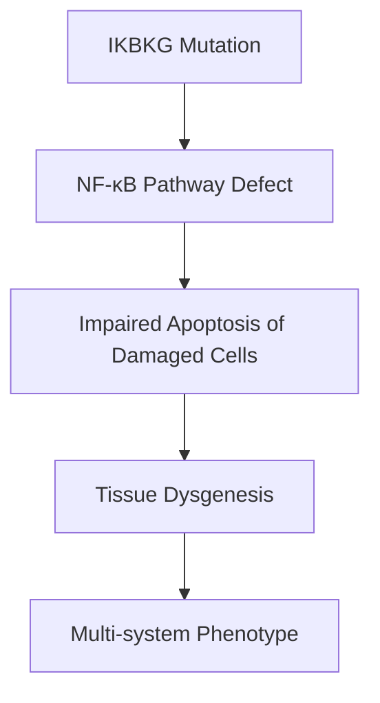
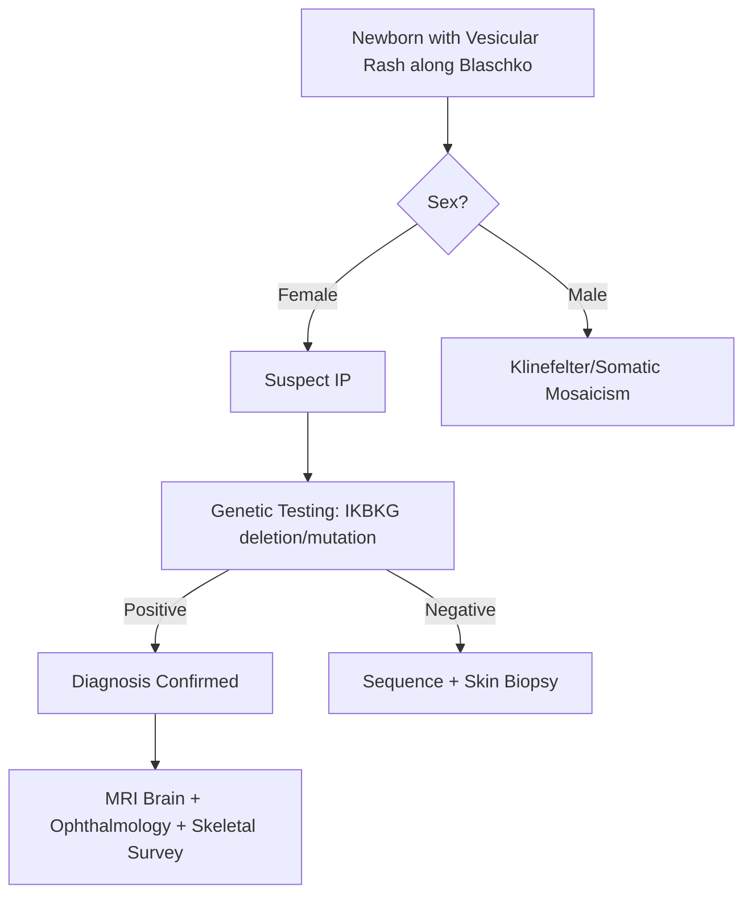

# Incontinentia Pigmenti

> [!tip] **Definition**
> A rare **X-linked dominant** disorder, **lethal in males**, caused by mutations in the **IKBKG (NEMO) gene** on Xq28. Characterised by **dermatological, neurological, ocular, and skeletal abnormalities**. Hallmark: **four stages of skin lesions** along Blaschko lines.

> [!tip] **Pearl:** IP is part of the **neurocutaneous syndromes**. Skin manifestations evolve through four stages from birth to adulthood; CNS involvement (seizures, intellectual disability) determines prognosis.

## Learning Objectives
- [ ] Define IP and its X-linked dominant inheritance (lethal in males)
- [ ] Explain IKBKG (NEMO) gene and NF-κB pathway
- [ ] Describe the four skin stages
- [ ] Recognise neurological (seizures, ID, stroke), ocular, and skeletal features
- [ ] Order investigations: skin biopsy, genetic testing, MRI brain, ophthalmology
- [ ] Apply management: supportive, multidisciplinary, family screening
- [ ] Counsel on genetic testing and reproductive options

---

## 1. Definition / Epidemiology / Classification

### Definition
A multi-system disorder affecting ectodermal and mesodermal tissues. Classic skin lesions evolve through four stages; CNS, ocular, and skeletal involvement is variable.

### Epidemiology
- **Prevalence:** 1 in 50,000 (rare)
- **Sex:** Almost exclusively female (males usually die in utero)
- **Inheritance:** X-linked dominant; sporadic in 50% (de novo IKBKG mutation)

### Classification (Skin Stages)
| Stage | Age | Lesion |
|-------|-----|--------|
| **1 - Vesicular** | Birth to 2 weeks | Inflammatory vesicles, pustules along Blaschko lines |
| **2 - Verrucous** | 2-6 weeks | Wart-like plaques, linear |
| **3 - Hyperpigmented** | 3-6 months | Whorled "marble cake" brown hyperpigmentation along Blaschko lines |
| **4 - Hypopigmented/atrophic** | Adolescence/adulthood | Pale, atrophic, hairless patches |

---

## 2. Aetiology / Pathophysiology

### Genetics
- **IKBKG (NEMO)** gene on Xq28 (inhibitor of nuclear factor kappa-B kinase subunit gamma)
- **X-linked dominant** — affected females have 50% chance of passing to offspring
- **Male lethality** — surviving males have Klinefelter (47,XXY), somatic mosaicism, or hypomorphic mutations
- **Familial cases:** Recurrent deletion (exons 4-10) due to NEMORR pseudogene-mediated recombination
- **Sporadic cases:** De novo mutation in 50%

### Pathophysiology

- NF-κB regulates apoptosis, inflammation, immune response
- Loss of IKBKG → defective NF-κB signalling → abnormal cell death

---

## 3. Clinical Features

### History
- Newborn with blistering rash (often mistaken for herpes)
- Family history of miscarriage (male lethality)
- May be diagnosed antenatally with abnormal karyotype/microarray

### Examination
| Domain | Finding |
|--------|---------|
| **Higher cortical** | Intellectual disability (10-30%), seizures (often focal) |
| **Cranial nerves** | Strabismus, nystagmus |
| **Motor** | Hemiparesis (post-stroke, porencephalic cyst), spasticity |
| **Cerebellar** | Ataxia (rare) |
| **Skin** | Four-stage lesions along Blaschko lines |
| **Hair** | Alopecia (vertex scarring), woolly hair |
| **Nails** | Dystrophic |
| **Teeth** | Hypodontia, delayed eruption, conical teeth |
| **Ocular** | Retinal detachment, microphthalmia, cataract, optic atrophy |
| **Skeletal** | Hemivertebrae, syndactyly, asymmetry of limbs |
| **Cardiac** | Rare (PDA, septal defects) |

### Specific Features
| Feature | Frequency |
|---------|-----------|
| **Skin (any stage)** | 100% |
| **Seizures** | 15-30% |
| **Hemiparesis** | 5-10% (post-stroke, porencephaly) |
| **Ocular** | 30-40% |
| **Skeletal** | 30% |
| **Cognitive impairment** | 10-30% |

---

## 4. Diagnostic Approach

### Diagnostic Criteria (Updated)
- **Major criteria (≥1):**
  - Typical neonatal vesicular rash with eosinophils
  - Verrucous or hyperpigmented lesions
  - Linear atrophic/hypopigmented stage
  - Alopecia, woolly hair
- **Minor criteria:**
  - Dental anomalies, nail dystrophy, retinal disease
  - CNS abnormalities, seizures
  - Family history

---

## 5. Investigations

### First-Line
| Test | Finding |
|------|---------|
| **Genetic testing (IKBKG)** | Deletion (exons 4-10) in 80%; sequencing for point mutations |
| **Skin biopsy** (if genetic negative) | Eosinophilic spongiosis, dyskeratosis; **eosinophil-rich vesicular stage** |
| **MRI brain** | Porencephalic cyst, white matter changes, stroke (old) |
| **EEG** | If seizures suspected |
| **Ophthalmology** | Retinal detachment, cataract, microphthalmia, optic atrophy |

### Other
- **Skeletal survey:** Hemivertebrae, asymmetry
- **Dental assessment:** Hypodontia, conical teeth
- **Cardiac echo (rare involvement):** PDA, septal defects

---

## 6. Differential Diagnosis
| Differential | Distinguishing Feature |
|--------------|----------------------|
| **Neonatal herpes simplex** | Vesicular rash, HSV PCR positive, no hyperpigmentation stage |
| **Epidermolysis bullosa** | Skin fragility, no Blaschko distribution, no IP features |
| **Hypomelanosis of Ito** | Whorled hypopigmentation (no preceding stages), chromosomal mosaicism |
| **Linear epidermal nevus** | No prior vesicular stage |
| **Aplasia cutis congenita** | Congenital absence of skin (usually scalp), no preceding rash |
| **Tuberous sclerosis** | Hypopigmented ash-leaf macules, angiofibromas, no Blaschko |
| **CHILD syndrome** | X-linked dominant, hemidysplasia, ichthyosiform erythroderma |

---

## 7. Management

### Disease-Modifying
- **None specific** — supportive, multidisciplinary
- **Genetic counselling** — female carriers have 50% risk per pregnancy

### Symptomatic
| Symptom | Management |
|---------|------------|
| **Seizures** | Standard ASMs (levetiracetam, carbamazepine); investigate acute stroke if focal |
| **Hemiparesis** | Physiotherapy, occupational therapy, orthotics |
| **Retinal detachment** | Laser/cryotherapy; surgical repair |
| **Skin** | Skin care; topical steroids for inflammation |
| **Teeth** | Dental review; implants/prosthetics |
| **Cognitive/developmental** | Early intervention, special education, OT/SLT |

### Multidisciplinary Care
- Dermatology, neurology, ophthalmology, genetics, orthopaedics, dentistry, psychology

### Genetic Counselling
- **Female carriers:** 50% risk per pregnancy; prenatal testing available
- **Male lethality:** Most male conceptions non-viable; surviving males usually XXY (Klinefelter)
- **Prenatal:** Chorionic villus sampling, amniocentesis (IKBKG testing)

---

## 8. Drug Interactions / Cautions
| Drug | Concern |
|------|---------|
| **Live vaccines** | If on immunosuppression for skin inflammation |
| **Topical steroids** | Long-term → skin atrophy |

---

## 9. Procedures
### Skin Biopsy
- **Indication:** Diagnostic uncertainty; genetic negative
- **Finding:** Stage-specific histology (eosinophilic spongiosis, dyskeratosis, pigment incontinence in hyperpigmented stage)

---

## 10. Complications
| Complication | Frequency | Management |
|--------------|-----------|------------|
| **Seizures** | 15-30% | ASMs |
| **Stroke (perinatal)** | 5-10% | Acute management; rehabilitation |
| **Retinal detachment** | 10% | Ophthalmology, surgery |
| **Cognitive impairment** | 10-30% | Educational support |
| **Skeletal asymmetry** | 30% | Orthopaedic |

---

## 11. Red Flags
- Newborn female with linear vesicular rash (misdiagnosed as herpes)
- Recurrent miscarriages in family history (male lethality)
- Stroke in infancy with skin findings = IP
- Retinal detachment risk — urgent ophthalmology

---

## 12. Prognosis
| Factor | Good | Poor |
|--------|------|------|
| **Sex** | Female (males die) | — |
| **Skin only** | Yes | No |
| **CNS** | None | Seizures, stroke, ID |
| **Ocular** | Normal | Retinal detachment |
| **Genetics** | Familial (known) | De novo with severe mutation |

- Most females have normal life expectancy with adequate care
- Skin lesions fade with age
- Major morbidity from CNS and ocular involvement

---

## 13. Topic Correlation
| Topic | Overlap |
|-------|---------|
| Tuberous sclerosis | Neurocutaneous syndrome |
| Von Hippel-Lindau | Phakomatosis |
| Hypomelanosis of Ito | Skin mosaicism |
| Neonatal herpes | Differential |

---

## 14. Special Situations
| Situation | Consideration |
|-----------|---------------|
| **Pregnancy** | 50% transmission risk; prenatal diagnosis available |
| **Family screening** | Mandatory; cascade IKBKG testing |
| **Anaesthesia** | No specific concerns |
| **Immunisations** | Standard schedule |
| **Driving** | Seizure restrictions if applicable |

---

## FCPS/MRCP High-Yield Summary
| Category | Key Points |
|----------|------------|
| **Definition** | X-linked dominant; lethal in males; IKBKG (NEMO) mutation |
| **Inheritance** | X-linked dominant; 50% recurrence in females |
| **Skin stages** | Vesicular → Verrucous → Hyperpigmented → Hypopigmented (Blaschko lines) |
| **CNS** | Seizures (15-30%), hemiparesis (stroke), ID (10-30%) |
| **Ocular** | Retinal detachment, microphthalmia |
| **Diagnosis** | Genetic testing (IKBKG); skin biopsy if negative |
| **Management** | Supportive, multidisciplinary |

---

## Viva Questions
1. **Q:** Gene and inheritance in IP?
   **A:** IKBKG (NEMO) on Xq28; X-linked dominant; lethal in males.
2. **Q:** Stages of skin lesions?
   **A:** Vesicular → Verrucous → Hyperpigmented (Blaschko) → Hypopigmented/atrophic.
3. **Q:** What is NEMO?
   **A:** IKBKG protein; regulates NF-κB pathway; loss → abnormal apoptosis.
4. **Q:** Why are males rarely affected?
   **A:** Hemizygous males usually die in utero; surviving have Klinefelter (XXY) or mosaicism.
5. **Q:** Major CNS features?
   **A:** Seizures, hemiparesis (post-stroke, porencephaly), intellectual disability.
6. **Q:** Differential of neonatal vesicular rash in IP?
   **A:** Herpes simplex, epidermolysis bullosa, linear epidermal nevus.

---

## Common Confusions / Exam Traps
| Confusion | Clarification |
|-----------|---------------|
| IP vs hypomelanosis of Ito | IP has vesicular stage first; HI = hypopigmentation from birth |
| IP vs neonatal herpes | IP has eosinophils; HSV has multinucleated giant cells, PCR+ |
| Male lethality | Most male conceptions non-viable; rare survivors XXY or mosaic |
| IP vs TSC | TSC = ash-leaf macules (hypopigmented), angiofibromas; IP = 4 stages |

---

## Mnemonics
1. **IP Stages** — **V**esicular → **V**errucous → **H**yperpigmented → **H**ypopigmented (**V-V-H-H**)
2. **Blaschko Lines** — **S**wirling, **S**treak-like pattern following embryological development
3. **NEMO/IKBKG** — **N**F-κB **E**ssential **MO**dulator; missing = NF-κB dysfunction

---

## MCQs (10)

1. **Q:** Which gene is mutated in Incontinentia Pigmenti?
   **A:** NF1  **B:** TSC1  **C:** IKBKG (NEMO)  **D:** VHL
   **Answer:** C — IKBKG (NEMO) on Xq28.

2. **Q:** IP inheritance pattern?
   **A:** Autosomal recessive  **B:** Autosomal dominant  **C:** X-linked dominant  **D:** Mitochondrial
   **Answer:** C — X-linked dominant; lethal in males.

3. **Q:** First skin lesion in IP newborn?
   **A:** Hyperpigmentation  **B:** Vesicular rash  **C:** Hypopigmentation  **D:** Café-au-lait
   **Answer:** B — Vesicular stage at birth to 2 weeks.

4. **Q:** What is the appearance of hyperpigmented stage?
   **A:** Linear following Blaschko lines ("marble cake")  **B:** Café-au-lait  **C:** Ash-leaf  **D:** Mongolian spot
   **Answer:** A — Whorled hyperpigmentation along Blaschko lines.

5. **Q:** IP is lethal in which sex?
   **A:** Females  **B:** Males  **C:** Both  **D:** Neither
   **Answer:** B — Hemizygous males die in utero; rare survivors XXY or mosaic.

6. **Q:** Skin biopsy in IP shows:
   **A:** Multinucleated giant cells  **B:** Eosinophilic spongiosis (vesicular stage)  **C:** Koilocytes  **D:** Acanthosis
   **Answer:** B — Eosinophil-rich vesicular stage is characteristic.

7. **Q:** Ocular feature in IP requiring urgent treatment:
   **A:** Strabismus  **B:** Retinal detachment  **C:** Cataract  **D:** Nystagmus
   **Answer:** B — Retinal detachment requires laser/cryotherapy.

8. **Q:** CNS feature in IP includes:
   **A:** Subdural haematoma  **B:** Porencephalic cyst with hemiparesis  **C:** Meningitis  **D:** Brain tumour
   **Answer:** B — Porencephaly from perinatal stroke is characteristic.

9. **Q:** Most common mode of presentation in newborn IP?
   **A:** Failure to thrive  **B:** Linear vesicular rash  **C:** Seizure  **D:** Cataract
   **Answer:** B — Linear vesicular rash at birth (often misdiagnosed as herpes).

10. **Q:** What pathway is dysfunctional in IP?
    **A:** MAPK  **B:** mTOR  **C:** NF-κB  **D:** Wnt
    **Answer:** C — IKBKG/NEMO regulates NF-κB signalling.

---

## SBA Questions (10)

1. **Scenario:** Newborn girl with linear vesicular rash along Blaschko lines. Skin biopsy shows eosinophilic spongiosis.
   **Options:** A. Neonatal herpes B. IP C. Epidermolysis bullosa D. Linear epidermal nevus
   **Answer:** B — IP: eosinophilic spongiosis, Blaschko distribution, female. Confirm with IKBKG testing.

2. **Scenario:** 4-year-old girl with history of neonatal vesicular rash, now has whorled hyperpigmentation along Blaschko lines, focal seizures.
   **Options:** A. Tuberous sclerosis B. IP C. NF1 D. Sturge-Weber
   **Answer:** B — Classic 4-stage progression + seizures = IP.

3. **Scenario:** Mother of an IP-affected daughter wants prenatal testing. What is the recurrence risk?
   **Options:** A. 0% B. 25% C. 50% D. 100%
   **Answer:** C — X-linked dominant; 50% transmission per pregnancy.

4. **Scenario:** Pregnant woman carries IKBKG mutation. Ultrasound at 12 weeks shows 47,XXY karyotype. What is the prognosis?
   **Options:** A. Normal male B. IP phenotype C. Klinefelter syndrome D. Incompatible with life
   **Answer:** C — XXY male survives with Klinefelter syndrome + IP features.

5. **Scenario:** 5-year-old IP patient with new onset right-sided weakness. MRI shows old left-sided porencephalic cyst.
   **Options:** A. New stroke B. Tumour C. Old perinatal stroke sequelae D. Demyelination
   **Answer:** C — Old perinatal stroke → porencephaly → hemiparesis; IP-related.

6. **Scenario:** IP patient with progressive visual loss. Ophthalmology finds retinal detachment. Most appropriate management?
   **Options:** A. Observation B. Laser/cryotherapy C. Steroids D. Vitamin A
   **Answer:** B — Urgent ophthalmology intervention to prevent blindness.

7. **Scenario:** Family history of recurrent miscarriages (male foetuses) in maternal line. Live-born daughter has IP. Why?
   **Options:** A. AR inheritance B. X-linked dominant male lethality C. Maternal infection D. Unknown
   **Answer:** B — Male conceptions non-viable; affected females survive with IKBKG mutation.

8. **Scenario:** 8-year-old IP patient with focal seizures. EEG shows left frontal epileptiform activity. MRI shows old porencephaly. Most appropriate ASM?
   **Options:** A. Sodium valproate B. Carbamazepine C. Levetiracetam D. Ethosuximide
   **Answer:** C — Levetiracetam or carbamazepine both work; levetiracetam often first-line due to favourable side-effect profile.

9. **Scenario:** IP patient (female, age 6) — skeletal survey shows hemivertebrae. What's the management?
   **Options:** A. Observation only B. Orthopaedic follow-up C. Bisphosphonates D. Vitamin D
   **Answer:** B — Orthopaedic surveillance for scoliosis/asymmetry; bracing/surgery if severe.

10. **Scenario:** Family of IP patient requests genetic testing of healthy 3-year-old son. Most appropriate approach?
    **Options:** A. Test immediately B. Defer to adulthood C. Offer testing with parental consent D. Refuse
    **Answer:** C — Cascade testing with parental consent; boys unlikely affected unless XXY/mosaic.

---

## Flashcards
- **Q:** IP gene? **A:** IKBKG (NEMO) on Xq28
- **Q:** IP inheritance? **A:** X-linked dominant; lethal in males
- **Q:** IP 4 skin stages? **A:** Vesicular → Verrucous → Hyperpigmented → Hypopigmented
- **Q:** What are Blaschko lines? **A:** Embryonic skin development pattern; linear/swirling
- **Q:** Skin biopsy in IP? **A:** Eosinophilic spongiosis (vesicular stage)
- **Q:** CNS features in IP? **A:** Seizures, hemiparesis (porencephaly/stroke), ID
- **Q:** Ocular features in IP? **A:** Retinal detachment, microphthalmia, cataract
- **Q:** IP recurrence risk? **A:** 50% (X-linked dominant)
- **Q:** Pathway involved? **A:** NF-κB
- **Q:** Male IP survivors have? **A:** Klinefelter (XXY) or somatic mosaicism

---

## Answer Key

### MCQs
1. **C** — IKBKG (NEMO)
2. **C** — X-linked dominant
3. **B** — Vesicular stage first
4. **A** — Whorled Blaschko lines
5. **B** — Lethal in males
6. **B** — Eosinophilic spongiosis
7. **B** — Retinal detachment = urgent
8. **B** — Porencephaly + hemiparesis
9. **B** — Linear vesicular rash at birth
10. **C** — NF-κB pathway

### SBAs
1. **B** — IP with eosinophilic spongiosis
2. **B** — IP with classic 4-stage evolution
3. **C** — 50% recurrence (X-linked)
4. **C** — XXY survives with Klinefelter
5. **C** — Old perinatal stroke sequelae
6. **B** — Laser/cryotherapy for detachment
7. **B** — Male lethality explains miscarriages
8. **C** — Levetiracetam for focal seizure
9. **B** — Orthopaedic surveillance
10. **C** — Cascade testing with consent

---

## One-Page Revision Card
| Topic | Incontinentia Pigmenti |
|-------|----------------------|
| **Definition** | X-linked dominant; IKBKG (NEMO); lethal in males |
| **Skin stages** | Vesicular → Verrucous → Hyperpigmented → Hypopigmented (Blaschko) |
| **CNS** | Seizures (15-30%), hemiparesis (porencephaly), ID (10-30%) |
| **Ocular** | Retinal detachment, microphthalmia |
| **Diagnosis** | Genetic (IKBKG); skin biopsy (eosinophilic spongiosis) |
| **Management** | Supportive, multidisciplinary; ASM for seizures; laser for detachment |
| **Genetic** | 50% recurrence; prenatal testing available |