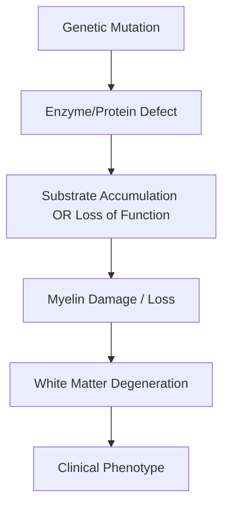
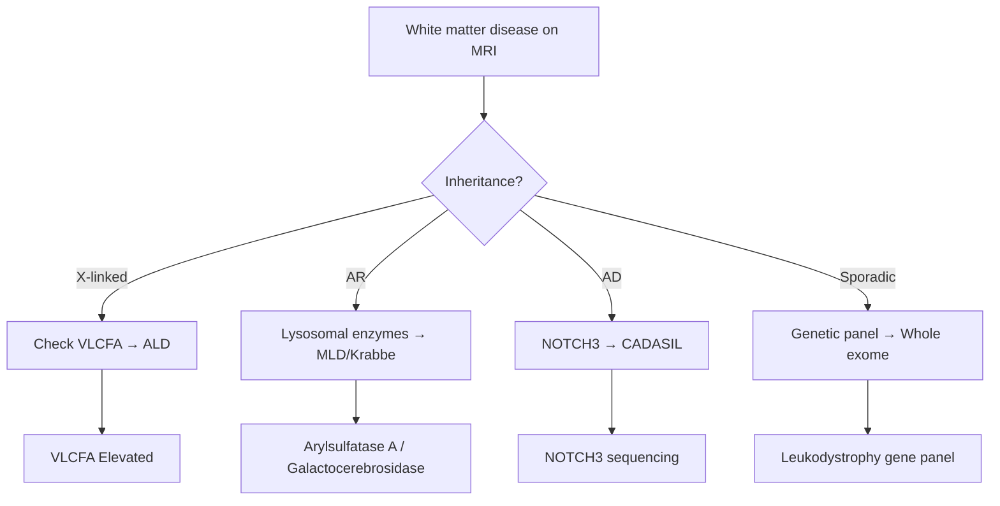

# Leukodystrophies

> [!tip] **Definition**
> A heterogeneous group of inherited disorders characterised by **progressive degeneration of white matter** (myelin) in the CNS, often with peripheral nerve involvement (leukoencephalomyelopathy). Most are **autosomal recessive**, presenting in infancy/childhood with developmental regression, motor decline, and seizures.

> [!tip] **Pearl:** Adult-onset leukodystrophies (e.g., CADASIL, AMN/ALD) are increasingly recognised — important differential of "atypical MS."

## Learning Objectives
- [ ] Define leukodystrophies and differentiate from demyelinating diseases
- [ ] Classify by biochemical defect (peroxisomal, lysosomal, mitochondrial, myelin protein)
- [ ] Describe major types: ALD/AMN, MLD, Krabbe, Alexander, Canavan, CADASIL, vanishing white matter
- [ ] Recognise clinical patterns (infantile vs adult onset)
- [ ] Order investigations: MRI pattern recognition, biochemical assays, genetic testing
- [ ] Apply management: supportive, disease-modifying (HSCT for ALD, gene therapy for MLD)
- [ ] Counsel on genetic testing and family screening

---

## 1. Definition / Epidemiology / Classification

### Definition
Inherited disorders of myelin metabolism or maintenance causing progressive CNS white matter disease. May affect CNS alone, PNS (leukoencephalomyelopathy), or systemic (e.g., adrenal in ALD).

### Epidemiology
- **Incidence:** ~1 in 7,000 (combined)
- **Age:** Most childhood-onset; some adult-onset (CADASIL, AMN)
- **Sex:** Most equal; ALD/AMN X-linked (males)

### Classification
| Group | Disease | Defect |
|-------|---------|--------|
| **Peroxisomal** | X-linked adrenoleukodystrophy (X-ALD/AMN) | ABCD1 (VLCFA accumulation) |
| **Lysosomal** | Metachromatic leukodystrophy (MLD) | Arylsulfatase A (sulfatide accumulation) |
| | Krabbe disease | Galactocerebrosidase (galactosylsphingosine) |
| | Fabry disease | α-galactosidase A (X-linked) |
| **Amino/organic acid** | Canavan disease | Aspartoacylase (N-acetylaspartate) |
| | Maple syrup urine disease | BCKD complex |
| **Myelin protein** | Pelizaeus-Merzbacher | PLP1 duplication |
| **Mitochondrial** | MNGIE, Kearns-Sayre | mtDNA/nDNA |
| **Vascular** | CADASIL, CARASIL | NOTCH3, HTRA1 |
| **Other** | Alexander disease | GFAP (Rosenthal fibres) |
| | Vanishing white matter | EIF2B1-5 |

---

## 2. Aetiology / Pathophysiology

### Genetics
- **X-ALD/AMN:** Xq28, ABCD1 mutations → VLCFA accumulation → oxidative stress, demyelination
- **MLD:** ARSA mutations (or PSAP saposin B) → sulfatide accumulation
- **Krabbe:** GALC mutations → psychosine accumulation → oligodendrocyte death
- **CADASIL:** NOTCH3 mutations (chr 19) → granular osmiophilic material (GOM) in arterioles
- **PMD:** PLP1 duplication (most) → misfolded myelin protein

### Pathophysiology

---

## 3. Clinical Features

### History
- **Infantile:** Developmental regression, loss of milestones, hypotonia → spasticity
- **Childhood:** School failure, gait abnormality, vision/hearing loss, seizures
- **Adult:** Personality change, cognitive decline, gait difficulty, stroke-like episodes

### Examination
| Domain | Finding |
|--------|---------|
| **Higher cortical** | Cognitive decline, executive dysfunction, dementia, behaviour change |
| **Cranial nerves** | Optic atrophy, nystagmus (PMD), dysphagia |
| **Motor** | Spasticity, weakness (pyramidal); ataxia (cerebellar involvement) |
| **Sensory** | Peripheral neuropathy (MLD, Krabbe, Fabry) |
| **Coordination** | Cerebellar ataxia |
| **Autonomic** | Bladder/bowel (CADASIL, AMN); anhidrosis (Fabry) |
| **Systemic** | Adrenal insufficiency (ALD), angiokeratomas (Fabry), organomegaly |

### Specific Syndromes
| Disease | Hallmark Features |
|---------|-------------------|
| **Childhood cerebral ALD** | Boys 4-8y, behaviour change, vision loss, adrenal insufficiency |
| **AMN (adult)** | Males 20-40y, spastic paraparesis, adrenal insufficiency, neuropathy |
| **MLD (late infantile)** | 1-2y onset, developmental regression, peripheral neuropathy, cherry-red spot absent |
| **Krabbe (infantile)** | 3-6m onset, irritability, hypertonia, optic atrophy, peripheral neuropathy |
| **Canavan** | Macrocephaly, hypotonia → spasticity, NAA accumulation |
| **Alexander** | Macrocephaly, seizures, developmental delay, Rosenthal fibres |
| **PMD** | Nystagmus (rotary), hypotonia → spasticity, males, X-linked |
| **CADASIL** | Migraine with aura, subcortical strokes, dementia (adult) |
| **Fabry** | Angiokeratomas, neuropathic pain, renal/cardiac disease, stroke |
| **Vanishing white matter** | Stress-triggered deterioration, ovarian dysgenesis, optic atrophy |

---

## 4. Diagnostic Approach

### Diagnostic Criteria
- **MRI pattern recognition** is key:
  - **ALD/AMN:** Posterior periventricular (parieto-occipital) white matter; contrast-enhancing edge
  - **MLD:** Symmetric periventricular, "tigroid" pattern (sparing perivascular)
  - **Krabbe:** Periventricular, corticospinal tracts, posterior corpus callosum
  - **CADASIL:** External capsule, anterior temporal pole subcortical lacunes
  - **PMD:** Diffuse, "tigroid" or homogeneous
  - **Alexander:** Frontal predominance, contrast enhancement (periventricular)
  - **VWM:** Vanishing white matter (CSF-like signal on FLAIR)

---

## 5. Investigations

### First-Line
| Test | Finding |
|------|---------|
| **MRI brain ± spine** | Pattern recognition (key diagnostic) |
| **VLCFA (very long chain fatty acids)** | Elevated in X-ALD/AMN |
| **Lysosomal enzyme panel** | Arylsulfatase A (MLD), galactocerebrosidase (Krabbe) |
| **α-galactosidase A** | Fabry (males) |
| **Plasma amino acids** | NAA (Canavan), branched-chain (MSUD) |
| **ACTH/cortisol** | Adrenal insufficiency (ALD) |

### Neuroimaging
| Modality | Finding |
|----------|---------|
| **MRI T2/FLAIR** | Hyperintense white matter; pattern diagnostic |
| **MRI T1** | Hypointense chronic lesions |
| **DWI** | Active demyelination |
| **MR spectroscopy** | NAA peak (Canavan), lactate (mito) |
| **Contrast-enhanced MRI** | Active ALD edge enhancement (Loes score) |

### Genetic Testing
- **Targeted gene panels** for leukodystrophies (40+ genes)
- **WES/WGS** if panel negative

### Other
- **Nerve conduction studies:** Demyelinating neuropathy (MLD, Krabbe)
- **Skin biopsy** (CADASIL): Granular osmiophilic material (GOM) in arterioles

---

## 6. Differential Diagnosis
| Differential | Distinguishing Feature |
|--------------|----------------------|
| **Multiple sclerosis** | OCB+, dissemination in time/space, no VLCFA |
| **Acute disseminated encephalomyelitis (ADEM)** | Post-infectious, monophasic |
| **Small vessel disease (hypertensive)** | Older, lacunar pattern, vascular risk factors |
| **Mitochondrial disease** | Lactic acidosis, RRF on biopsy |
| **CNS vasculitis** | Vessel wall enhancement, inflammatory markers |
| **Toxic/metabolic** | Drug history (methotrexate, cocaine), specific patterns |

---

## 7. Management

### Disease-Modifying (Limited but Growing)
| Disease | Therapy | Indication |
|---------|---------|------------|
| **X-ALD** | **Hematopoietic stem cell transplant (HSCT)** | Pre-symptomatic or early cerebral disease (Loes 0.5-9) |
| | Gene therapy (Lenti-D/Atidarsagene) | Alternative to HSCT in early disease |
| | Lorenzo's oil (glyceryl trioleate/trierucate) | Adjunct; controversial; pre-symptomatic |
| | Adrenal replacement | Adrenal insufficiency |
| **MLD** | **Atidarsagene autotemcel (Libmeldy)** | Gene therapy (autologous HSCT + ARSA gene) — early disease |
| | HSCT | Early disease |
| **Fabry** | Enzyme replacement (agalsidase α/β) | All symptomatic; chaperone (migalastat) for amenable mutations |
| **Krabbe** | HSCT | Pre-symptomatic (limited) |
| **CADASIL** | Aspirin, smoking cessation, BP control | Antiplatelet; no specific therapy |
| **PMD** | Supportive only | No disease-modifying therapy |

### Symptomatic
| Symptom | Management |
|---------|------------|
| **Spasticity** | Baclofen, tizanidine, physiotherapy, intrathecal baclofen (severe) |
| **Seizures** | Standard ASMs (avoid valproate in mito) |
| **Dystonia** | Trihexyphenidyl, botulinum toxin, deep brain stimulation |
| **Pain (Fabry)** | Carbamazepine, gabapentin; enzyme replacement |
| **Swallowing** | PEG if progressive |
| **Bladder** | Anticholinergics, intermittent catheterisation |
| **Behavioural** | SSRIs, antipsychotics, behaviour therapy |

### Genetic Counselling & Screening
- **X-ALD:** Screen all males in maternal family; ABCD1 testing; VLCFA
- **MLD, Krabbe:** AR; carrier testing, prenatal diagnosis
- **CADASIL:** AD; predictive testing (adult-onset)
- **Newborn screening:** Implemented in some countries for X-ALD (allows early HSCT)

### Multidisciplinary Care
- Neurology, rehabilitation, physiotherapy, OT, SLT, neuropsychology, social work, palliative care

---

## 8. Drug Interactions / Cautions
| Drug | Concern |
|------|---------|
| **Valproate** | Avoid in mitochondrial leukodystrophies (POLG) |
| **Lorenzo's oil** | Thrombocytopenia; monitor CBC |
| **Enzyme replacement (Fabry)** | Infusion reactions; antibody formation |
| **Busulfan (pre-HSCT)** | Severe myelosuppression, infertility |

---

## 9. Procedures
### Hematopoietic Stem Cell Transplant (HSCT)
- **Indication:** Early cerebral X-ALD, early MLD, pre-symptomatic Krabbe
- **Goal:** Replace microglia with donor cells producing functional enzyme
- **Outcome:** Stabilisation if performed early; ineffective once symptomatic
- **Risks:** GVHD, infection, infertility, transplant-related mortality 5-15%

### Skin Biopsy (CADASIL)
- **Indication:** Suspected CADASIL with negative NOTCH3
- **Finding:** Granular osmiophilic material (GOM) in arteriolar walls on EM

---

## 10. Complications
| Complication | Frequency | Management |
|--------------|-----------|------------|
| **Adrenal crisis** | X-ALD 10-15% | Steroid replacement; emergency plan |
| **Status epilepticus** | Variable | Standard treatment |
| **Aspiration pneumonia** | Late | Swallow assessment, PEG |
| **DVT/PE** | Immobile | Prophylaxis |
| **Pressure ulcers** | Late | 2-hourly turning |
| **Behavioural disturbances** | Common | SSRIs, antipsychotics |

---

## 11. Red Flags
- Previously normal child with developmental regression
- White matter disease + adrenal insufficiency = ALD (adrenal crisis risk)
- Macrocephaly + leukoencephalopathy = Canavan, Alexander
- White matter disease + peripheral neuropathy = MLD, Krabbe
- Migraine + stroke + dementia in adult = CADASIL

---

## 12. Prognosis
| Disease | Prognosis |
|---------|-----------|
| **Infantile MLD/Krabbe** | Death by 5-10 years |
| **Childhood cerebral ALD** | Death within 2-5 years untreated; HSCT can stabilise |
| **AMN** | Slowly progressive over decades; ~50% wheelchair-bound by 20y |
| **CADASIL** | Median survival to 65-70 years |
| **Adult MLD** | Variable; 10-20 years |
| **PMD** | Variable; severe connatal forms fatal in infancy |

---

## 13. Topic Correlation
| Topic | Overlap |
|-------|---------|
| Multiple sclerosis | White matter differential |
| Mitochondrial disorders | MNGIE/KS overlap |
| Inborn errors of metabolism | Biochemical defects |
| Fabry disease | Multi-system, treatable |

---

## 14. Special Situations
| Situation | Consideration |
|-----------|---------------|
| **Pregnancy** | Carrier testing partner; prenatal diagnosis available |
| **Newborn screening** | X-ALD included in some US states; allows pre-symptomatic HSCT |
| **Family screening** | Mandatory for X-ALD; cascade testing for AD/AR forms |
| **Anaesthesia** | Caution with mitochondrial forms (malignant hyperthermia risk debated) |
| **Driving** | Seizures, cognitive decline — DVLA notification |
| **Palliative care** | Early integration in progressive forms |

---

## FCPS/MRCP High-Yield Summary
| Category | Key Points |
|----------|------------|
| **Definition** | Inherited white matter disorders |
| **Major types** | ALD/AMN (ABCD1), MLD (ARSA), Krabbe (GALC), CADASIL (NOTCH3), Fabry (GLA) |
| **MRI clues** | Posterior (ALD), tigroid (MLD), anterior temporal (CADASIL), frontal (Alexander) |
| **Investigations** | MRI pattern, VLCFA, lysosomal enzymes, genetic panel |
| **Management** | HSCT (early ALD/MLD), gene therapy (MLD), ERT (Fabry), supportive |
| **Red flags** | Adrenal insufficiency + white matter disease = ALD |
| **Newborn screening** | X-ALD in US states |

---

## Viva Questions
1. **Q:** What is the most common leukodystrophy in adults?
   **A:** Cerebral autosomal dominant arteriopathy with subcortical infarcts and leukoencephalopathy (CADASIL).
2. **Q:** Genetic defect in X-ALD?
   **A:** ABCD1 gene on Xq28; VLCFA accumulation.
3. **Q:** When is HSCT indicated in X-ALD?
   **A:** Pre-symptomatic or early cerebral disease (Loes score 0.5-9); ineffective once symptomatic.
4. **Q:** MRI findings in CADASIL?
   **A:** T2/FLAIR hyperintensities in anterior temporal pole and external capsule — highly specific.
5. **Q:** What is the Loes score?
   **A:** MRI severity score for X-ALD (0-34); based on location and extent of lesions; guides HSCT decision.
6. **Q:** Disease-modifying therapy for Fabry?
   **A:** Enzyme replacement (agalsidase α/β) or oral chaperone (migalastat for amenable mutations).
7. **Q:** Pathognomonic finding in CADASIL?
   **A:** Granular osmiophilic material (GOM) in arterioles on EM of skin biopsy.

---

## Common Confusions / Exam Traps
| Confusion | Clarification |
|-----------|---------------|
| ALD vs AMN | ALD = childhood cerebral; AMN = adult myelopathy + adrenal |
| MLD vs MS | MLD = AR, no OCB, symmetric, "tigroid" MRI |
| CADASIL vs small vessel disease | CADASIL: anterior temporal, family history, NOTCH3 |
| Krabbe vs MLD | Krabbe: early onset, irritability, optic atrophy; MLD: later, peripheral neuropathy |
| HSCT timing | Effective ONLY in early/pre-symptomatic ALD; useless in advanced disease |

---

## Mnemonics
1. **MLD** — **M**etachromatic = **L**euko**D**ystrophy; **A**rylsulfatase A deficiency; **S**ulfatide accumulation
2. **CADASIL** — **C**erebral, **A**utosomal **D**ominant, **A**rteriopathy, **S**ubcortical **I**nfarc ts, **L**eukoencephalopathy
3. **ALD MRI** — **A**drenoleukodystrophy; **P**osterior (parieto-occipital) lesions; **L**oes score
4. **Fabry** — **F**abry = angiokeratomas, **a**crodynia, **b**urning pain, **r**enal failure, **y**oung stroke

---

## MCQs (10)

1. **Q:** Which gene is mutated in X-linked adrenoleukodystrophy (X-ALD)?
   **A:** ABCD1  **B:** ARSA  **C:** NOTCH3  **D:** GALC
   **Answer:** A — ABCD1 on Xq28; VLCFA accumulation.

2. **Q:** Which MRI finding is characteristic of CADASIL?
   **A:** Posterior periventricular  **B:** Anterior temporal pole involvement  **C:** Frontal predominance  **D:** Corpus callosum lesions
   **Answer:** B — Anterior temporal pole lesions are highly specific for CADASIL.

3. **Q:** Disease-modifying therapy for early MLD?
   **A:** Gene therapy (Atidarsagene/Libmeldy)  **B:** Steroids  **C:** IVIG  **D:** Plasmapheresis
   **Answer:** A — Atidarsagene (autologous HSCT + ARSA gene) approved for early MLD.

4. **Q:** HSCT in X-ALD is most effective when:
   **A:** Symptomatic  **B:** Pre-symptomatic or early cerebral disease  **C:** Adrenal crisis  **D:** Adult onset
   **Answer:** B — Effective ONLY in pre-symptomatic/early disease (Loes 0.5-9).

5. **Q:** Pathognomonic finding in CADASIL on skin biopsy?
   **A:** Granular osmiophilic material (GOM)  **B:** Rosenthal fibres  **C:** Neurofibrillary tangles  **D:** Lewy bodies
   **Answer:** A — GOM in arteriolar walls on EM.

6. **Q:** Which disease presents with macrocephaly and N-acetylaspartate accumulation?
   **A:** Alexander  **B:** Canavan  **C:** Krabbe  **D:** MLD
   **Answer:** B — Canavan disease: macrocephaly, hypotonia, NAA peak on MRS.

7. **Q:** Pelizaeus-Merzbacher disease is caused by mutation in:
   **A:** PLP1  **B:** ARSA  **C:** NOTCH3  **D:** ABCD1
   **Answer:** A — PLP1 duplication; X-linked; nystagmus, hypotonia.

8. **Q:** Fabry disease is treated with:
   **A:** Gene therapy  **B:** Enzyme replacement (agalsidase)  **C:** Steroids  **D:** Plasmapheresis
   **Answer:** B — ERT (agalsidase α/β) or oral chaperone (migalastat).

9. **Q:** Which leukodystrophy shows "tigroid" pattern on MRI?
   **A:** ALD  **B:** MLD  **C:** CADASIL  **D:** PMD
   **Answer:** B — MLD: symmetric periventricular with sparing of perivascular regions (tigroid).

10. **Q:** Vanishing white matter disease is caused by mutation in:
    **A:** EIF2B1-5  **B:** GALC  **C:** ABCD1  **D:** GLA
    **Answer:** A — EIF2B1-5 (translation initiation); triggered by stressors (fever, trauma).

---

## SBA Questions (10)

1. **Scenario:** 6-year-old boy with behaviour change, vision loss, and hyperpigmentation. MRI shows parieto-occipital white matter disease with contrast-enhancing edge. ACTH elevated.
   **Options:** A. MLD B. X-ALD C. CADASIL D. Krabbe
   **Answer:** B — Boy + behaviour change + posterior white matter + adrenal insufficiency = X-ALD. **Lorenzo's oil + HSCT evaluation**.

2. **Scenario:** 35-year-old woman with migraine, recurrent lacunar strokes, and progressive cognitive decline. MRI shows anterior temporal white matter lesions. Mother had similar.
   **Options:** A. Multiple sclerosis B. CADASIL C. Small vessel disease D. Antiphospholipid syndrome
   **Answer:** B — Migraine + stroke + dementia + anterior temporal lesions + family = CADASIL. NOTCH3 testing.

3. **Scenario:** 18-month-old with developmental regression, peripheral neuropathy, and "tigroid" MRI. Arylsulfatase A activity is 5% of normal.
   **Options:** A. MLD B. Krabbe C. Canavan D. ALD
   **Answer:** A — Late-infantile MLD; ARSA deficiency. Consider gene therapy if early.

4. **Scenario:** Newborn screening shows elevated C26:0 lysophosphatidylcholine. What's the diagnosis?
   **Options:** A. MLD B. X-ALD C. Krabbe D. PMD
   **Answer:** B — C26:0 LPC is a screening biomarker for X-ALD (allows pre-symptomatic HSCT).

5. **Scenario:** 3-month-old infant with irritability, hypertonia, optic atrophy. MRI shows periventricular white matter disease. GALC activity absent.
   **Options:** A. MLD B. Krabbe C. Canavan D. ALD
   **Answer:** B — Infantile Krabbe disease; GALC deficiency; psychosine accumulation. Pre-symptomatic HSCT evaluation.

6. **Scenario:** 25-year-old man with burning pain in hands/feet, angiokeratomas on scrotum, and proteinuria.
   **Options:** A. Fabry disease B. CADASIL C. ALD D. Krabbe
   **Answer:** A — Fabry disease; α-galactosidase A deficiency; ERT (agalsidase).

7. **Scenario:** Infant with macrocephaly, hypotonia, developmental regression. MRI MRS shows elevated N-acetylaspartate peak.
   **Options:** A. Alexander B. Canavan C. MLD D. Krabbe
   **Answer:** B — Canavan disease; aspartoacylase deficiency; NAA accumulation. No disease-modifying therapy.

8. **Scenario:** 30-year-old man with spastic paraparesis, adrenal insufficiency, mild peripheral neuropathy. MRI shows thoracic cord atrophy. VLCFA elevated.
   **Options:** A. Childhood ALD B. AMN C. CADASIL D. MLD
   **Answer:** B — Adult adrenomyeloneuropathy (AMN); ABCD1 mutation. Adrenal replacement + supportive care.

9. **Scenario:** 5-year-old with normal development, then after a febrile illness has acute neurological deterioration. MRI shows cystic white matter degeneration.
   **Options:** A. MLD B. VWM C. ALD D. CADASIL
   **Answer:** B — Vanishing white matter disease; stress-triggered deterioration. Avoid stressors.

10. **Scenario:** 10-year-old boy with rotary nystagmus, hypotonia, and developmental delay. MRI shows diffuse white matter disease. PLP1 duplication.
    **Options:** A. ALD B. PMD C. MLD D. CADASIL
    **Answer:** B — Pelizaeus-Merzbacher disease; PLP1 duplication; X-linked. No disease-modifying therapy; supportive.

---

## Flashcards
- **Q:** ABCD1 mutation? **A:** X-ALD (X-linked adrenoleukodystrophy)
- **Q:** ARSA mutation? **A:** MLD (metachromatic leukodystrophy)
- **Q:** GALC mutation? **A:** Krabbe disease
- **Q:** NOTCH3 mutation? **A:** CADASIL
- **Q:** GLA mutation? **A:** Fabry disease (X-linked)
- **Q:** PLP1 mutation? **A:** Pelizaeus-Merzbacher disease
- **Q:** GFAP mutation? **A:** Alexander disease (Rosenthal fibres)
- **Q:** EIF2B mutation? **A:** Vanishing white matter disease
- **Q:** CADASIL MRI clue? **A:** Anterior temporal pole white matter lesions
- **Q:** Loes score? **A:** MRI severity score for X-ALD (guides HSCT decision)
- **Q:** Best HSCT timing in X-ALD? **A:** Pre-symptomatic or Loes 0.5-9
- **Q:** MLD gene therapy? **A:** Atidarsagene autotemcel (Libmeldy)

---

## Answer Key

### MCQs
1. **A** — ABCD1 on Xq28
2. **B** — Anterior temporal pole = CADASIL
3. **A** — Atidarsagene (Libmeldy) for early MLD
4. **B** — HSCT effective only pre-symptomatic/early
5. **A** — GOM = pathognomonic in CADASIL
6. **B** — Canavan: macrocephaly + NAA peak
7. **A** — PLP1 = PMD (X-linked, nystagmus)
8. **B** — ERT for Fabry
9. **B** — Tigroid pattern = MLD
10. **A** — EIF2B = VWM

### SBAs
1. **B** — X-ALD with adrenal insufficiency
2. **B** — CADASIL with anterior temporal lesions
3. **A** — MLD with ARSA deficiency
4. **B** — X-ALD newborn screening
5. **B** — Krabbe with GALC deficiency
6. **A** — Fabry with angiokeratomas
7. **B** — Canavan with macrocephaly + NAA
8. **B** — AMN with VLCFA elevation
9. **B** — VWM with stress-triggered deterioration
10. **B** — PMD with PLP1 duplication

---

## One-Page Revision Card
| Topic | Leukodystrophies |
|-------|-----------------|
| **Definition** | Inherited white matter disorders |
| **Major types** | ALD (ABCD1), MLD (ARSA), Krabbe (GALC), CADASIL (NOTCH3), Fabry (GLA), PMD (PLP1) |
| **MRI clues** | Posterior (ALD), tigroid (MLD), anterior temporal (CADASIL), macrocephaly (Canavan/Alexander) |
| **Investigations** | MRI pattern, VLCFA, lysosomal enzymes, genetic panel |
| **Management** | HSCT (early ALD/MLD), gene therapy (MLD), ERT (Fabry), supportive |
| **Red flags** | Adrenal insufficiency + white matter disease = ALD; macrocephaly = Canavan/Alexander |
| **Newborn screening** | X-ALD allows pre-symptomatic HSCT |