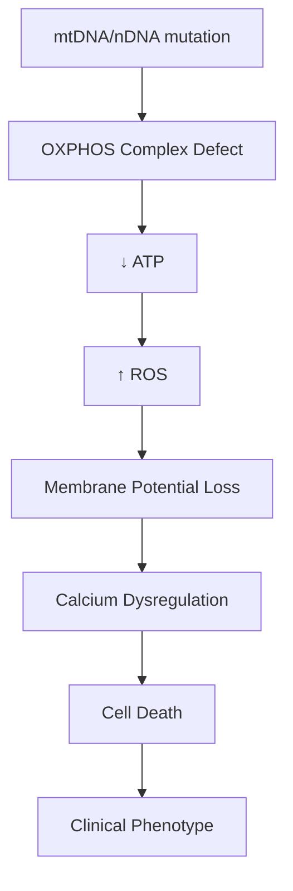
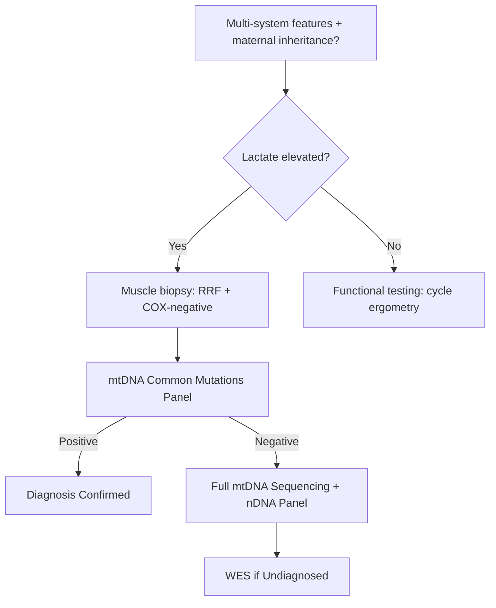

# Mitochondrial Disorders

> [!tip] **Definition**
> Genetically heterogeneous disorders from dysfunction of mitochondria, the principal energy-producing organelles. Result from mutations in **nuclear DNA (nDNA)** or **mitochondrial DNA (mtDNA)** affecting oxidative phosphorylation (OXPHOS). Demonstrate **maternal inheritance** (mtDNA), **heteroplasmy**, and **threshold effect**.

> [!tip] Tissues with high energy demand (CNS, muscle, heart, retina, endocrine glands) are most vulnerable → "encephalomyopathy."

## Learning Objectives
- [ ] Define mitochondrial disorders; explain maternal inheritance, heteroplasmy, threshold effect
- [ ] Describe epidemiology and major syndromes (MELAS, MERRF, KS, CPEO, LHON, NARP, Leigh)
- [ ] Explain OXPHOS dysfunction pathophysiology
- [ ] Recognize multi-system features (CNS, muscle, cardiac, endocrine, ocular)
- [ ] Order investigations: lactate, muscle biopsy, mtDNA/nDNA testing, MRI
- [ ] Apply management: supportive, avoid mitochondrial toxins, exercise, vitamins
- [ ] Counsel on genetic testing and reproductive options

---

## 1. Definition / Epidemiology / Classification

### Definition
Disorders caused by mutations affecting mitochondrial structure/function. mtDNA encodes 13 OXPHOS subunits, 22 tRNAs, 2 rRNAs; nDNA encodes ~1500 mitochondrial proteins. Dysfunction → ↓ ATP, ↑ ROS, defective apoptosis.

### Epidemiology
- **Incidence:** 1 in 5,000 (combined); 1 in 200 carries pathogenic mtDNA mutation
- **Age:** Any; 80% childhood-onset
- **Sex:** Equal; some nDNA subtypes AR/AD

### Classification
| Class | Example | Inheritance |
|-------|---------|-------------|
| mtDNA point mutations | MELAS (m.3243A>G), MERRF (m.8344A>G), LHON (m.11778G>A) | Maternal |
| mtDNA deletions | Kearns-Sayre, CPEO, Pearson | Usually sporadic |
| mtDNA depletion | POLG, TK2 | AR |
| nDNA-related | Multiple deletions (POLG, TWNK); subunits (SDHA) | AR/AD |

| Syndrome | Onset | Key Features |
|----------|-------|--------------|
| **MELAS** | Childhood-young adult | Stroke-like episodes, lactic acidosis, ragged-red fibres, seizures |
| **MERRF** | Childhood-young adult | Myoclonic Epilepsy, Ragged Red Fibres, ataxia |
| **Kearns-Sayre** | <20 years | PEO, pigmentary retinopathy, heart block, ataxia |
| **CPEO** | Adult | Progressive external ophthalmoplegia, ptosis |
| **LHON** | Young adults | Painless bilateral optic neuropathy (male predominance) |
| **NARP** | Childhood | Neuropathy, Ataxia, Retinitis Pigmentosa |
| **Leigh** | Infancy | Subacute necrotising encephalomyelopathy |

---

## 2. Aetiology / Pathophysiology

### Genetics
- **Maternal inheritance:** mtDNA transmitted exclusively via oocyte (sperm mtDNA degraded)
- **Heteroplasmy:** Mixed mutant/wild-type mtDNA in cells; varies between tissues
- **Threshold effect:** Phenotype manifests when mutant load exceeds tissue threshold (60-90% in muscle)
- **Mitotic segregation:** Random partitioning → changing mutant load over time
- **nDNA mutations:** POLG (mtDNA polymerase γ; AD/AR), TWNK, TYMP (→ MNGIE)

### Pathophysiology

---

## 3. Clinical Features

### History
- Multi-system involvement; "any symptom in any organ at any age"
- Common: fatigue, exercise intolerance, seizures, stroke-like episodes, vision loss, hearing loss, diabetes

### Examination
| Domain | Finding |
|--------|---------|
| **Higher cortical** | Cognitive impairment, stroke-like deficits (posterior, reversible) |
| **Cranial nerves** | PEO, ptosis, optic atrophy, sensorineural hearing loss |
| **Motor** | Myopathy, exercise intolerance, weakness |
| **Sensory** | Peripheral neuropathy (axonal) |
| **Coordination** | Cerebellar ataxia (MERRF, KS) |
| **Cardiac** | Cardiomyopathy, conduction defects (WPW, AV block) |
| **Endocrine** | Diabetes, hypothyroidism, hypoparathyroidism |
| **Ocular** | Pigmentary retinopathy, optic atrophy |

### Specific Syndromes
| Syndrome | Hallmark Features |
|----------|-------------------|
| **MELAS** | Stroke-like (posterior), seizures, lactic acidosis, deafness, diabetes, short stature |
| **MERRF** | Myoclonus, epilepsy, ataxia, RRF, deafness |
| **Kearns-Sayre** | PEO + retinopathy + onset <20y + ≥1: heart block, ataxia, CSF protein >1g/L |
| **LHON** | Painless subacute bilateral central vision loss |
| **Leigh** | Developmental regression, brainstem signs, basal ganglia lesions |
| **MNGIE** | GI dysmotility, cachexia, leukoencephalopathy |

---

## 4. Diagnostic Approach

### Modified Walker Criteria (Key Elements)
- **Clinical:** ≥3 organ systems OR specific syndrome
- **Histology:** Ragged-red fibres, COX-negative fibres
- **Enzymology:** Complex I-V activity <30%
- **Molecular:** Known pathogenic mtDNA/nDNA mutation
- **Metabolic:** Elevated lactate, FGF21, GDF15

---

## 5. Investigations

### First-Line
| Test | Finding |
|------|---------|
| **Blood lactate/pyruvate** | Elevated (>2 mmol/L); ratio >20 |
| **Fasting glucose, HbA1c** | Diabetes (MELAS) |
| **CK, ECG, Echo** | Mild CK elevation; WPW, AV block, cardiomyopathy |
| **Audiology, Ophthalmology** | Sensorineural loss, retinopathy, optic atrophy |

### Neuroimaging
- **MRI brain:** Stroke-like lesions (posterior, cortex, NOT vascular territory); basal ganglia/brainstem (Leigh); leukoencephalopathy (MNGIE); calcifications (KS)
- **MR spectroscopy:** Lactate peak

### Muscle Biopsy (Gold Standard)
- **Ragged-red fibres** (Gomori trichrome) — subsarcolemmal mitochondrial aggregates
- **COX-negative / SDH-positive** fibres — Complex IV deficiency
- **EM:** Abnormal mitochondria, paracrystalline inclusions

### Genetic Testing
| Test | Use |
|------|-----|
| **mtDNA common mutation panel** | First-tier (m.3243A>G, m.8344A>G, m.11778G>A, deletions) |
| **Full mtDNA sequencing** | Negative panel + clinical suspicion |
| **Nuclear gene panel** | POLG, TWNK, TYMP |
| **WES/WGS** | Undiagnosed |

### Biomarkers
- **FGF21, GDF15:** Serum biomarkers (~85% sensitivity)

---

## 6. Differential Diagnosis
| Differential | Distinguishing Feature |
|--------------|----------------------|
| **Inborn errors (PDH def)** | No ragged-red fibres |
| **Leukodystrophies** | No lactic acidosis |
| **Friedreich ataxia** | GAA repeat, cardiomyopathy, no stroke-like |
| **Multiple sclerosis** | Vascular territory, OCB+ |
| **Hereditary myopathies** | No multi-system involvement |

---

## 7. Management

### Disease-Modifying (Limited Evidence)
| Agent | Mechanism |
|-------|-----------|
| **Coenzyme Q10** | Electron carrier, antioxidant |
| **Idebenone** | CoQ10 analogue (LHON) |
| **L-Arginine** | NO precursor — MELAS stroke |
| **L-Citrulline** | NO precursor — chronic MELAS |
| **Riboflavin (B2)** | Complex I/II cofactor |
| **Creatine, α-lipoic acid** | Adjuncts |

### Symptomatic
| Symptom | Management |
|---------|------------|
| **Seizures** | **Avoid valproate**; Use levetiracetam, lamotrigine |
| **Stroke-like (MELAS)** | IV L-Arginine acute; L-citrulline chronic |
| **Diabetes** | Standard (avoid metformin if lactate risk) |
| **Heart block (KS)** | **Pacemaker** required |
| **Ptosis/PEO** | Surgical correction, props |

### Avoid (Mitochondrial Toxins)
- Valproate, linezolid, aminoglycosides, chloramphenicol, barbiturates, prolonged propofol
- Tobacco, alcohol

### Lifestyle
- **Aerobic exercise** — improves mitochondrial biogenesis
- Avoid prolonged fasting, dehydration, extreme temperatures

### Genetic Counselling
- **Maternal:** All offspring at risk (heteroplasmy variable)
- **Reproductive:** Prenatal testing (CVS/amniocentesis), PGD, **mitochondrial donation** (UK legal)

---

## 8. Drug Interactions / Cautions
| Drug | Concern | Alternative |
|------|---------|-------------|
| **Valproate** | Inhibits OXPHOS; hepatotoxic in POLG | Levetiracetam, lamotrigine |
| **Linezolid** | Inhibits mt protein synthesis | Other antibiotics |
| **Aminoglycosides** | Ototoxicity (esp. m.1555A>G) | Avoid |
| **Metformin** | Lactic acidosis risk | Insulin |
| **Propofol** | PRIS risk with prolonged infusion | Sevoflurane |
| **Statins** | Myopathy risk | Lower dose, monitor |

---

## 9. Procedures
### Muscle Biopsy
- **Indication:** Suspected mitochondrial myopathy with negative genetic testing
- **Site:** Vastus lateralis (open/needle)
- **Processing:** Histochemistry (COX, SDH), EM, mtDNA studies

---

## 10. Complications
| Complication | Frequency | Management |
|--------------|-----------|------------|
| **Sudden cardiac death** (AV block) | KS 5-10% | Pacemaker |
| **Stroke-like episodes** | MELAS | L-Arginine |
| **Status epilepticus** | MERRF/MELAS | Avoid valproate |
| **Diabetes** | MELAS 30-50% | Standard |

---

## 11. Red Flags
- Maternal family history of multi-system disease
- Stroke-like episode + seizures + lactic acidosis = MELAS
- PEO + retinopathy + heart block = Kearns-Sayre (pacemaker needed)
- Sudden visual loss in young male = LHON
- Unexplained multi-organ disease in child = mitochondrial screen

---

## 12. Prognosis
| Factor | Good | Poor |
|--------|------|------|
| **Syndrome** | LHON, CPEO | Leigh, MELAS with stroke |
| **Heteroplasmy** | Low | High |
| **Age at onset** | Adult | Infantile (Leigh) |
| **Organs involved** | Single | Multi-system, cardiac, CNS |

---

## 13. Topic Correlation
| Topic | Overlap |
|-------|---------|
| Leukoencephalopathies | Imaging overlap |
| Friedreich ataxia | Ataxia + cardiomyopathy |
| Inborn errors of metabolism | Metabolic crises |

---

## 14. Special Situations
| Situation | Consideration |
|-----------|---------------|
| **Pregnancy** | Risk of metabolic decompensation; monitor diabetes |
| **Paediatric** | Leigh, MELAS, MERRF; ketogenic diet controversial |
| **Anaesthesia** | Avoid prolonged propofol, valproate |
| **Driving** | DVLA notification for seizures/visual loss |

---

## FCPS/MRCP High-Yield Summary
| Category | Key Points |
|----------|------------|
| **Inheritance** | Maternal; Heteroplasmy + threshold effect |
| **Syndromes** | MELAS (m.3243), MERRF (m.8344), KS, CPEO, LHON, Leigh |
| **Investigations** | Lactate↑, FGF21/GDF15, muscle biopsy (RRF, COX-), mtDNA panel, MRI (stroke-like) |
| **Management** | CoQ10, L-Arginine (MELAS), avoid valproate, exercise |
| **Drugs to Avoid** | Valproate, linezolid, aminoglycosides |
| **Genetic** | Maternal transmission, PGD, mitochondrial donation |

---

## Viva Questions
1. **Q:** Define heteroplasmy and threshold effect. **A:** Heteroplasmy = mixed wild-type/mutant mtDNA; threshold = mutant load needed (60-90% muscle).
2. **Q:** Mutations in MELAS and MERRF? **A:** MELAS = m.3243A>G (tRNA-Leu); MERRF = m.8344A>G (tRNA-Lys).
3. **Q:** Kearns-Sayre diagnostic criteria? **A:** PEO + retinopathy + onset <20y + ≥1: AV block, ataxia, CSF protein >1g/L.
4. **Q:** Why avoid valproate? **A:** Inhibits OXPHOS; hepatotoxic in POLG; worsens seizures.
5. **Q:** LHON presentation? **A:** Young adult male (90%); painless subacute bilateral central vision loss; m.11778G>A.
6. **Q:** MELAS stroke treatment? **A:** IV L-Arginine (NO precursor) within 3 hours.
7. **Q:** Muscle biopsy finding? **A:** Ragged-red fibres; COX-negative, SDH-positive.

---

## Common Confusions / Exam Traps
| Confusion | Clarification |
|-----------|---------------|
| mtDNA vs nDNA | mtDNA = maternal; nDNA = Mendelian |
| MERRF vs Unverricht-Lundborg | MERRF has RRF; ULBD has no RRF |
| MELAS vs ischaemic stroke | MELAS: posterior, cortex, not vascular territory |
| LHON vs optic neuritis | LHON: bilateral painless; ON: pain, RAPD |

---

## Mnemonics
1. **MELAS** — **M**itochondrial, **E**ncephalopathy, **L**actic acidosis, **A**stroke-like, **S**eizures
2. **MERRF** — **M**yoclonic **E**pilepsy with **R**agged **R**ed **F**ibres
3. **Avoid Mito Toxins** — **V**alproate, **L**inezolid, **A**minoglycosides, **P**ropofol (prolonged)

---

## MCQs (10)

1. **Q:** Inheritance pattern of mtDNA disorders?
   **A:** Paternal  **B:** Maternal  **C:** Autosomal dominant  **D:** X-linked
   **Answer:** B — mtDNA transmitted only via oocyte.

2. **Q:** Which mutation causes MELAS?
   **A:** m.8344A>G  **B:** m.3243A>G  **C:** m.11778G>A  **D:** m.8993T>G
   **Answer:** B — m.3243A>G (tRNA-Leu).

3. **Q:** Kearns-Sayre features all EXCEPT:
   **A:** PEO  **B:** Pigmentary retinopathy  **C:** Onset <20y  **D:** Lactic acidosis
   **Answer:** D — Lactic acidosis is feature of MELAS/MERRF, not KS.

4. **Q:** Which drug should be AVOIDED in mitochondrial epilepsy?
   **A:** Levetiracetam  **B:** Lamotrigine  **C:** Valproate  **D:** Lacosamide
   **Answer:** C — Valproate inhibits OXPHOS; hepatotoxic in POLG.

5. **Q:** Heteroplasmy refers to:
   **A:** Variable expressivity  **B:** Mixed mutant/wild-type mtDNA  **C:** X-inactivation  **D:** Imprinting
   **Answer:** B — Heteroplasmy = mixed mtDNA populations in cells.

6. **Q:** LHON typical demographic?
   **A:** Female children  **B:** Young adult males  **C:** Elderly females  **D:** All ages equally
   **Answer:** B — 80-90% male, ages 15-35.

7. **Q:** Role of L-Arginine in MELAS?
   **A:** Antioxidant  **B:** NO precursor for vasodilation  **C:** Complex I cofactor  **D:** Mitochondrial biogenesis
   **Answer:** B — IV arginine in acute stroke-like episode.

8. **Q:** Muscle biopsy in mitochondrial disease shows:
   **A:** Centronuclear fibres  **B:** Ragged-red fibres  **C:** Nemaline rods  **D:** Rimmed vacuoles
   **Answer:** B — Subsarcolemmal mitochondrial aggregates on Gomori trichrome.

9. **Q:** Leigh syndrome pathology:
   **A:** Cortical necrosis  **B:** Subacute necrotising encephalomyelopathy  **C:** White matter demyelination  **D:** Anterior horn cell loss
   **Answer:** B — Bilateral basal ganglia/brainstem lesions; infantile onset.

10. **Q:** Which nDNA mutation causes mtDNA depletion?
    **A:** m.3243A>G  **B:** POLG  **C:** m.8993T>G  **D:** FXN
    **Answer:** B — POLG encodes mtDNA polymerase γ.

---

## SBA Questions (10)

1. **Scenario:** 25-year-old woman with seizures, right hemianopia, lactic acidosis. MRI shows left parieto-occipital cortical T2 hyperintensity not respecting vascular territory. Mother had diabetes and deafness.
   **Options:** A. Ischaemic stroke B. MELAS C. Multiple sclerosis D. Herpes encephalitis
   **Answer:** B — Posterior stroke-like episode + lactate + maternal history = MELAS. Treat with IV L-Arginine.

2. **Scenario:** 18-year-old man with painless bilateral vision loss over 2 weeks. Visual acuity 20/200 both eyes. MRI normal. Family history in maternal uncle.
   **Options:** A. Optic neuritis B. LHON C. Toxic optic neuropathy D. CRAO
   **Answer:** B — LHON = bilateral painless central vision loss, maternal inheritance, m.11778G>A.

3. **Scenario:** 10-year-old with PEO, pigmentary retinopathy, 3rd degree AV block.
   **Options:** A. Myotonic dystrophy B. Kearns-Sayre C. MELAS D. MERRF
   **Answer:** B — PEO + retinopathy + onset <20y + AV block = Kearns-Sayre. **Pacemaker needed**.

4. **Scenario:** Patient with MERRF develops seizures. Which AED should be AVOIDED?
   **Options:** A. Levetiracetam B. Lamotrigine C. Valproate D. Clonazepam
   **Answer:** C — Valproate inhibits OXPHOS.

5. **Scenario:** 35-year-old with myoclonus, ataxia, seizures. Muscle biopsy shows RRF. Most likely inheritance?
   **Options:** A. AD B. AR C. Maternal D. Sporadic
   **Answer:** C — MERRF = maternal (m.8344A>G in tRNA-Lys).

6. **Scenario:** Infant with developmental regression, hypotonia, brainstem signs. MRI shows bilateral putaminal T2 hyperintensities. Lactate elevated.
   **Options:** A. Leigh syndrome B. MELAS C. Krabbe D. Tay-Sachs
   **Answer:** A — Infantile brainstem/basal ganglia lesions + lactate = Leigh syndrome.

7. **Scenario:** 30-year-old with MNGIE syndrome. Which enzyme is deficient?
   **Options:** A. Thymidine phosphorylase B. Hexosaminidase A C. Arylsulfatase A D. Galactocerebrosidase
   **Answer:** A — TYMP mutations cause MNGIE.

8. **Scenario:** Confirmed m.3243A>G MELAS presents with acute stroke-like episode. Most appropriate ACUTE treatment?
   **Options:** A. Aspirin B. IV L-Arginine C. IVIG D. Thrombolysis
   **Answer:** B — IV L-Arginine within 3h; thrombolysis ineffective (not true stroke).

9. **Scenario:** 40-year-old with CPEO and ptosis. Which distinguishes CPEO from Kearns-Sayre?
   **Options:** A. Bilateral ptosis B. Absence of retinopathy/heart block C. Adult onset D. Myopathy
   **Answer:** B — CPEO is isolated; KS requires retinopathy + ≥1 multi-system feature.

10. **Scenario:** Reproductive options for woman with mtDNA mutation. Only method to PREVENT transmission?
    **Options:** A. Prenatal CVS B. PGD C. Mitochondrial donation D. Avoid pregnancy
    **Answer:** C — Mitochondrial donation (3-parent IVF); PGD/CVS reduces but doesn't eliminate risk.

---

## Flashcards
- **Q:** MELAS mutation? **A:** m.3243A>G (tRNA-Leu)
- **Q:** MERRF mutation? **A:** m.8344A>G (tRNA-Lys)
- **Q:** LHON mutation? **A:** m.11778G>A (ND4/Complex I)
- **Q:** Kearns-Sayre criteria? **A:** PEO + retinopathy + <20y onset + ≥1: AV block, ataxia, CSF protein >1g/L
- **Q:** Heteroplasmy definition? **A:** Mixed wild-type and mutant mtDNA in cells
- **Q:** Threshold effect? **A:** Mutant load needed for phenotype (>60-90%)
- **Q:** Maternal inheritance? **A:** mtDNA transmitted only via oocyte
- **Q:** Drugs to avoid in mito disease? **A:** Valproate, linezolid, aminoglycosides, prolonged propofol
- **Q:** Muscle biopsy finding? **A:** Ragged-red fibres; COX-negative, SDH-positive
- **Q:** Acute MELAS stroke treatment? **A:** IV L-Arginine within 3h
- **Q:** FGF21/GDF15? **A:** Serum biomarkers (~85% sensitivity)
- **Q:** Leigh pathology? **A:** Bilateral basal ganglia/brainstem necrosis

---

## Answer Key

### MCQs
1. **B** — Maternal inheritance (mtDNA from oocyte only)
2. **B** — m.3243A>G = MELAS
3. **D** — Lactic acidosis is feature of MELAS/MERRF, not KS
4. **C** — Valproate inhibits OXPHOS
5. **B** — Heteroplasmy = mixed mtDNA populations
6. **B** — Young adult male predominance
7. **B** — L-Arginine is NO precursor
8. **B** — Ragged-red fibres on Gomori trichrome
9. **B** — Leigh = subacute necrotising encephalomyelopathy
10. **B** — POLG = mtDNA polymerase γ

### SBAs
1. **B** — MELAS = posterior stroke-like + lactate + maternal
2. **B** — LHON = painless bilateral vision loss, maternal
3. **B** — KS = PEO + retinopathy + onset <20y + AV block → pacemaker
4. **C** — Valproate inhibits OXPHOS
5. **C** — MERRF maternal inheritance
6. **A** — Leigh = infantile brainstem lesions
7. **A** — TYMP deficiency = MNGIE
8. **B** — IV L-Arginine for MELAS stroke
9. **B** — CPEO = isolated PEO; KS = multi-system
10. **C** — Mitochondrial donation prevents transmission

---

## One-Page Revision Card
| Topic | Mitochondrial Disorders |
|-------|-------------------------|
| **Definition** | OXPHOS dysfunction (mtDNA/nDNA); maternal inheritance |
| **Key syndromes** | MELAS (m.3243), MERRF (m.8344), LHON (m.11778), KS, CPEO, Leigh |
| **Clinical** | Multi-system: stroke (MELAS), myoclonus (MERRF), vision loss (LHON), PEO (KS/CPEO) |
| **Investigations** | Lactate↑, FGF21/GDF15, muscle biopsy (RRF/COX-), mtDNA panel, MRI (stroke-like) |
| **Management** | CoQ10, IV L-Arginine (MELAS acute), avoid valproate, exercise, pacemaker (KS) |
| **Drugs to avoid** | Valproate, linezolid, aminoglycosides, prolonged propofol |
| **Reproductive** | Maternal transmission; PGD reduces but doesn't eliminate; mitochondrial donation only complete prevention |