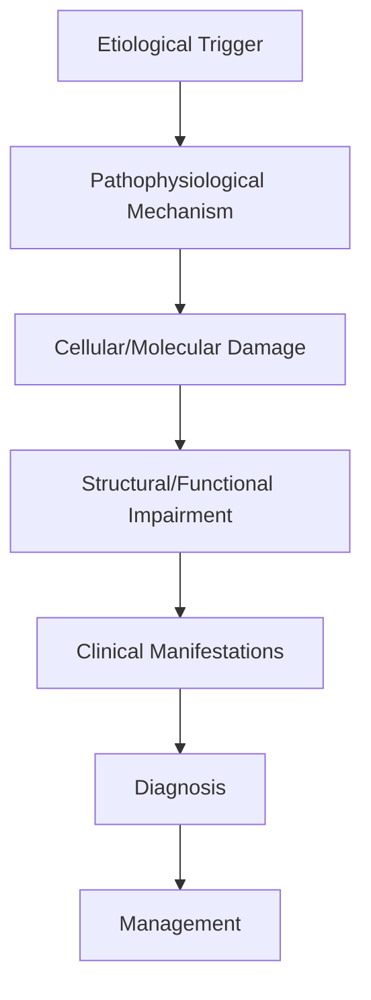
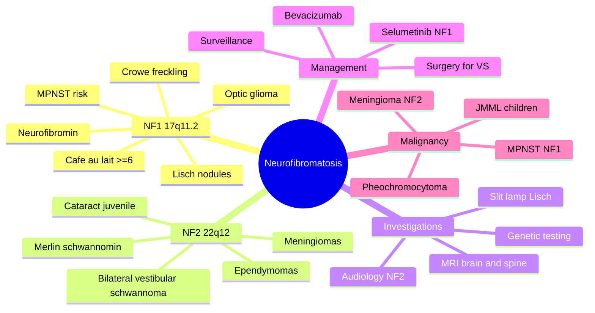

# Neurofibromatosis Type 1 & 2

> [!tip] **High-Yield Definition**
> Comprehensive clinical note for Neurofibromatosis Type 1 & 2 covering definition, epidemiology, aetiology, pathophysiology, clinical features, investigations, differential diagnosis, management, drug interactions, procedures, complications, red flags, prognosis, topic correlation, and special situations for FCPS/MRCP examination preparation based on Davidson 24th Edition Chapter 25: Neurology.

---

## 1. Definition / Epidemiology / Classification

### Definition
Neurofibromatosis Type 1 & 2 is a neurological disorder within the 18 genetic neurological disorders category. It is characterised by specific clinical, pathological, radiological, and laboratory features that allow differentiation from related conditions.

### Epidemiology
- **Incidence/Prevalence:** Variable depending on the specific condition.
- **Age:** Adult onset is most common, but paediatric and elderly presentations occur.
- **Sex:** Variable depending on the condition.
- **Geography:** Worldwide distribution, with higher prevalence in certain regions.
- **Risk Factors:** Genetic predisposition, environmental factors, comorbidities, family history.

### Classification
| Subtype | Key Features | Prognosis |
|---------|-------------|-----------|
| Mild/early | Subtle symptoms, preserved function | Best |
| Moderate | Clear symptoms, functional impairment | Variable |
| Severe | Significant disability, complications | Worst |

---

## 2. Aetiology / Pathophysiology

### Aetiology
- **Primary (idiopathic):** Most cases have no identifiable cause.
- **Genetic:** May be inherited (AD, AR, X-linked, mitochondrial, sporadic).
- **Autoimmune:** Autoantibodies, immune-mediated inflammation.
- **Infectious:** Viral, bacterial, fungal, parasitic.
- **Metabolic:** Electrolyte, endocrine, hepatic, renal, nutritional.
- **Toxic:** Drugs, alcohol, heavy metals, environmental toxins.
- **Vascular:** Ischaemia, haemorrhage, vasculitis.
- **Neoplastic:** Primary, secondary, paraneoplastic.
- **Traumatic:** Acute, chronic, repetitive.
- **Degenerative:** Neurodegeneration, protein misfolding.

### Pathophysiology


---

## 3. Clinical Features

### History
- **Onset/Duration:** Acute, subacute, or chronic.
- **Progression:** Static, progressive, relapsing-remitting, stepwise.
- **Key symptoms:** Specific to the condition.
- **Triggers:** Stress, infection, trauma, drugs, hormonal, environmental.
- **Systemic symptoms:** Constitutional features.
- **Drug/Family/Social history:** Relevant exposures, comorbidities.

### Examination
| Domain | Key Findings | Localisation Value |
|--------|-------------|-------------------|
| Higher function | Cognitive, behavioural | Cortical, subcortical, limbic |
| Cranial nerves | Pupils, eye movements, facial, bulbar | Brainstem, cranial nerve, NMJ |
| Motor | Weakness, tone, reflexes | UMN, LMN, NMJ, muscle |
| Sensory | All modalities, pattern | Peripheral, spinal, brainstem |
| Coordination | Ataxia, nystagmus, dysmetria | Cerebellar, sensory, vestibular |
| Gait | Spastic, ataxic, parkinsonian | Multiple |
| Autonomic | Orthostatic, sweating, GI, bladder | Autonomic, peripheral, central |

### Specific Clinical Features
The clinical features are determined by the underlying aetiology, location of pathology, and rate of progression. Patients typically present with a constellation of symptoms and signs that allow clinical localisation and subsequent targeted investigation.

---

## 4. Diagnostic Approach / Algorithm

```mermaid
flowchart TD
    A[Clinical Presentation] --> B[Anatomical Localisation]
    B --> C[Pathophysiological Category]
    C --> D[Formulate Differential]
    D --> E[Targeted Investigations]
    E --> F[Confirm Diagnosis]
    F --> G[Assess Severity/Prognosis]
    G --> H[Initiate Management]
    H --> I[Monitor Response]
    I --> J{Response?}
    J --> YES1 [Good - Continue]
    J --> NO1 [Poor - Escalate]
    YES1 --> K[Monitor]
    NO1 --> H
```

---

## 5. Investigations

### First-Line Investigations
- **Blood tests:** FBC, U&Es, LFTs, glucose, calcium, magnesium, ESR, CRP, autoimmune, infection.
- **Imaging:** CT/MRI brain/spine (essential for most neurological conditions).
- **Neurophysiology:** EEG, nerve conduction, EMG, evoked potentials.
- **CSF:** Cell count, protein, glucose, OCBs, PCR, culture.

### Second-Line Investigations
- **Genetic testing:** Gene panels, WES, WGS.
- **Antibody testing:** Antineuronal, autoimmune, paraneoplastic.
- **Biopsy:** Nerve, muscle, brain, skin.
- **Advanced imaging:** PET-CT, MR spectroscopy, fMRI.

### Specialised Investigations
- **Biomarkers:** Neurofilament light chain, tau, beta-amyloid, 14-3-3, RT-QuIC.
- **Autonomic testing:** Head-up tilt, sudomotor, QSART.
- **Neuropsychology:** Cognitive testing, behavioural assessment.
- **Genetic counselling:** Family screening, predictive testing.

---

## 6. Differential Diagnosis

| Differential | Distinguishing Features | Key Test |
|--------------|------------------------|----------|
| Vascular | Sudden onset, focal, vascular risk factors | MRI/CT, vessel imaging |
| Inflammatory | Subacute, multifocal, systemic | MRI, CSF, antibodies |
| Infectious | Fever, systemic, exposure | Bloods, CSF, imaging |
| Neoplastic | Progressive, mass effect | MRI, biopsy |
| Degenerative | Progressive, symmetric, hereditary | MRI, genetic |
| Toxic/Metabolic | Drug history, systemic, reversible | Bloods, toxicology |
| Autoimmune | Multifocal, antibodies, immunotherapy response | Antibodies, MRI, CSF |
| Functional | Inconsistent, distractible | Clinical, video, biomarkers |

---

## 7. Management

### Acute Management
- **Stabilisation:** ABCDE approach, emergency resuscitation.
- **Specific treatment:** Disease-specific interventions.
- **Symptomatic relief:** Pain, seizures, spasticity, autonomic dysfunction.
- **Prevention of complications:** DVT, pressure sores, infection.

### Disease-Modifying Treatment
- **Pharmacological:** First-line, second-line, escalation, maintenance.
- **Procedural:** Surgery, biopsy, drainage, ablation, stimulation.
- **Immunotherapy:** Steroids, IVIG, plasma exchange, immunosuppressants, biologics.
- **Rehabilitation:** Physiotherapy, OT, speech therapy.

### Long-Term Management
- **Monitoring:** Clinical, imaging, biomarkers, side effects.
- **Prevention:** Vaccinations, prophylaxis, lifestyle modification.
- **Supportive care:** Multidisciplinary team, social work, psychological support.
- **Palliative care:** Advanced care planning, end-of-life care, hospice.

---

## 8. Drug Interactions / Contraindications / Comorbidity Cautions

| Drug Class | Interaction / Caution | Management |
|------------|----------------------|------------|
| Antiseizure medications | Enzyme induction, teratogenicity | Monitor, supplement, switch |
| Immunosuppressants | Infection, malignancy, teratogenicity | Monitor, prophylaxis |
| Anticoagulants | Bleeding risk, drug interactions | Monitor INR, avoid combinations |
| Antihypertensives | Hypotension, falls | Monitor BP, adjust dose |
| Antibiotics | Nephrotoxicity, ototoxicity | Monitor renal |
| Antivirals | Nephrotoxicity, neuropsychiatric | Monitor renal, dose adjust |
| Steroids | DM, HTN, osteoporosis, infection | Monitor, prophylaxis, taper |
| Biologics | Infusion reactions, infection | Monitor, prophylaxis |

---

## 9. Procedures

### Common Procedures
- **Lumbar puncture:** Diagnostic, therapeutic (IIH, NPH). Contraindications: raised ICP, mass lesion, coagulopathy.
- **Nerve conduction studies/EMG:** Diagnostic, prognosis. Minor discomfort.
- **EEG:** Diagnostic, monitoring. No significant complications.
- **MRI brain/spine:** Diagnostic, monitoring. Contraindications: pacemaker, metallic implants.
- **CT head:** Emergency, rapid. Radiation exposure, contrast reactions.
- **Biopsy:** Stereotactic, open. Indications: diagnosis, molecular profiling.

---

## 10. Complications

| Complication | Frequency | Prevention | Management |
|--------------|-----------|------------|------------|
| Infection | Common | Hygiene, prophylaxis, vaccination | Antibiotics, antifungals |
| Thrombosis | Common | Prophylaxis, mobility | Anticoagulation |
| Pressure sores | Common | Positioning, nutrition | Wound care, surgery |
| Spasticity | Common | Positioning, stretching | Baclofen, BoNT |
| Contractures | Common | Passive movements, splints | Physiotherapy, surgery |
| Aspiration | Common | Swallow assessment | NGT, PEG, thickeners |
| Falls | Common | Environment, mobility | Walking aids |
| Fractures | Common | Bone health, prevention | Vitamin D, bisphosphonate |
| Depression | Common | Screening, support | Antidepressants, CBT |
| Cognitive decline | Variable | Monitoring, training | Rehabilitation |
| Autonomic dysfunction | Variable | Monitoring, hydration | Midodrine, fludrocortisone |
| Respiratory failure | Variable | Monitoring, supportive | Ventilation, NIV |
| Death | Variable | Monitoring, palliative | End-of-life care |

---

## 11. Red Flags / Emergencies

### Emergency Presentations
- **Rapid neurological deterioration:** New focal deficit, decreased consciousness, seizures.
- **Status epilepticus:** Continuous seizures >5 min.
- **Raised ICP:** Headache, vomiting, papilloedema, altered consciousness.
- **Respiratory failure:** Hypoxia, hypercapnia, ventilatory failure.
- **Cardiac arrest:** Arrhythmia, MI, pulmonary embolism.
- **Infection:** Sepsis, meningitis, abscess, encephalitis.
- **Drug toxicity:** Overdose, side effects, interactions.
- **Haemorrhage:** Intracranial, systemic, coagulopathy.

---

## 12. Prognosis

### Natural History
- **Acute:** May resolve with treatment, may progress, may be fatal.
- **Subacute:** Variable, depends on cause and treatment.
- **Chronic:** Often progressive, may be stable, may have relapses.
- **Recovery:** Variable, may be complete, partial, or none.

### Prognostic Factors
- **Favourable:** Young age, early treatment, mild disease, reversible cause, good premorbid function, family support.
- **Unfavourable:** Older age, delayed treatment, severe disease, irreversible cause, poor premorbid function, comorbidities.

---

## 13. Topic Correlation

| Related Topic | Link | Key Overlap |
|---------------|------|-------------|
| Davidson 24th Ed Chapter 25 | [[Davidson Chapter 25 - Neurology Hierarchy]] | Comprehensive neurology |
| Neurology MOC | [[Neurology MOC]] | All neurology topics |
| Drug Reference | [[../00_Index/Neurology Drug Reference]] | Medications |
| Local Hub | [[../18_Genetic_Neurological_Disorders/Hub]] | Section-specific |
| Clinical Examination | [[../01_Fundamentals_Examination/Neurological History Taking]] | Clinical approach |
| Investigation | [[../01_Fundamentals_Examination/Neuroimaging (CT-MRI) Principles]] | Imaging |

---

## 14. Special Situations

| Situation | Consideration |
|-----------|---------------|
| **Pregnancy** | Pre-conception counselling, teratogenicity, drug safety, monitoring, delivery planning, breastfeeding. |
| **Lactation** | Drug safety, breastfeeding, monitoring, support. |
| **Paediatric** | Developmental considerations, drug dosing, school, family, vaccination, growth, puberty. |
| **Elderly / Frail** | Comorbidities, polypharmacy, falls, bone health, cognition, social, end-of-life. |
| **Renal impairment** | Drug dose adjustment, monitoring, dialysis, transplant. |
| **Hepatic impairment** | Drug dose adjustment, monitoring, transplant. |
| **Immunocompromised** | Infection prophylaxis, vaccination, drug interactions, malignancy screening. |
| **Perioperative** | Drug management, anaesthesia planning, VTE prophylaxis, infection prevention, monitoring. |
| **Driving / DVLA** | Fitness to drive, restrictions, notification, reassessment. |
| **Occupational** | Fitness for work, adaptations, rehabilitation, disability, return to work. |

---

## FCPS/MRCP High-Yield Summary

| Category | Key Points |
|----------|------------|
| **Definition** | Comprehensive definition with key diagnostic criteria |
| **Epidemiology** | Incidence, prevalence, age, sex, geography, risk factors |
| **Aetiology** | Primary causes, secondary causes, genetic, environmental |
| **Pathophysiology** | Mechanism of disease, cellular/molecular basis |
| **Clinical Features** | History, examination, key findings, variants |
| **Diagnosis** | Diagnostic criteria, classification, severity |
| **Investigations** | First-line, second-line, specialised, biomarkers |
| **Differential Diagnosis** | Key differentials, distinguishing features, tests |
| **Management** | Acute, disease-modifying, symptomatic, supportive |
| **Complications** | Common, serious, prevention, management |
| **Prognosis** | Natural history, prognostic factors, outcomes |
| **Viva Pearls** | Key examination points |
| **Drug Doses** | First-line, second-line, emergency |
| **Scoring Systems** | Specific scores used in management |
| **Genetics** | Inheritance, genes, mutations, family screening |
| **Imaging Signs** | Characteristic findings, differential |

---

## Viva Questions (PACES/FCPS Style)

1. **Q:** Define and classify its variants.
   **A:** Comprehensive definition with classification of subtypes based on aetiology, severity, and clinical features.

2. **Q:** What are the key clinical features?
   **A:** Specific symptoms and signs including onset, progression, key features, and associated findings.

3. **Q:** What is the first-line treatment?
   **A:** First-line pharmacological and non-pharmacological management based on current evidence.

4. **Q:** What are the red flags requiring urgent referral?
   **A:** Specific emergency presentations and complications requiring immediate intervention.

5. **Q:** What is the prognosis?
   **A:** Natural history, prognostic factors, and long-term outcomes.

6. **Q:** How do you differentiate from key differentials?
   **A:** Clinical features, investigations, and response to treatment that distinguish from alternative diagnoses.

7. **Q:** What investigations are most useful?
   **A:** First-line and second-line investigations including imaging, neurophysiology, CSF, and biomarkers.

8. **Q:** Describe the stepwise management approach.
   **A:** Stepwise escalation from first-line to second-line to third-line therapy with monitoring.

9. **Q:** What are the emergency presentations?
   **A:** Specific emergency scenarios and immediate management priorities.

10. **Q:** How does management change in pregnancy/paediatrics/elderly?
    **A:** Special considerations for each population including drug safety, monitoring, and support.

---

## Common Confusions / Exam Traps

| Confusion | Clarification |
|-----------|---------------|
| Similar presentation but different cause | Differentiate by history, examination, investigations |
| Treatment response vs natural history | Assess with objective measures, biomarkers |
| Drug interactions | Check each drug, monitor, adjust doses |
| Disease progression vs treatment failure | Monitor response, escalate appropriately |
| Functional vs organic | Inconsistent, distractible, disability greater than impairment |
| Acute vs chronic | Time course, progression, reversibility |
| Primary vs secondary | Underlying cause, contributing factors |
| Side effects vs symptoms | Temporal relationship, dose relationship |

---

## Mnemonics

1. **NF1 = 17 letters = 17q11.2 = neurofibromin** (GAP-related tumour suppressor, regulates Ras).
2. **NF2 = 22 = chromosome 22q12 = merlin (schwannomin)** (links membrane to cytoskeleton).
3. **CALM-FAN-O** — NF1 diagnostic features: **C**afé-au-lait, **A**xillary/inguinal **F**reckling (Crowe), **L**isch nodules, **M**ultiple neuro**F**ibromas, optic **A**strocytoma (optic glioma), **N**eurofibromas, **O**ptic glioma mnemonic. *(Also: ≥6 CAL macules diagnostic).*
4. **CAL Spots** — ≥6 café-au-lait macules; **>5 mm prepubertal, >15 mm postpubertal**.
5. **Crowe Sign** — Axillary or inguinal freckling (pathognomonic of NF1).
6. **Lisch Nodules** — Iris hamartomas (≥2); slit-lamp finding in >90% adult NF1.
7. **NF2 = "MISME"** — **M**ultiple **I**nherited **S**chwannomas, **M**eningiomas, and **E**pendymomas.
8. **Bilateral VS = NF2** — **Bilateral vestibular schwannomas are pathognomonic** of NF2.
9. **Optic pathway glioma = NF1**; **vestibular schwannoma = NF2**.
10. **Malignancy Watch NF1** — MPNST (malignant peripheral nerve sheath tumour), pilocytic astrocytoma, JMML, pheochromocytoma, GIST.

---

## Mind Map



---

## Spaced Repetition Trackers

| Day | Topic | Question (front) | Answer (back) | Confidence (1-5) |
|-----|-------|------------------|---------------|------------------|
| 1 | Gene NF1 | NF1 gene and chromosome? | NF1 on 17q11.2 (neurofibromin) | 4 |
| 1 | Gene NF2 | NF2 gene and chromosome? | NF2/merlin on 22q12 | 3 |
| 2 | CAL | Diagnostic CAL criteria? | ≥6 macules, >5mm pre / >15mm post | 4 |
| 3 | Crowe | Crowe sign? | Axillary/inguinal freckling | 5 |
| 5 | Lisch | What are Lisch nodules? | Iris hamartomas (melanocytic) | 4 |
| 7 | NF2 path | Pathognomonic NF2 tumour? | Bilateral vestibular schwannomas | 5 |
| 10 | NF1 malignancy | Most feared NF1 malignancy? | MPNST (malignant peripheral nerve sheath tumour) | 4 |
| 14 | NF2 tumours | MISME syndrome tumours? | Multiple schwannomas, meningiomas, ependymomas | 3 |
| 21 | Treatment NF1 | NF1 inoperable plexiform neurofibroma drug? | Selumetinib (MEK inhibitor) | 3 |
| 30 | Surveillance NF2 | NF2 screening? | Annual MRI brain/spine, audiology | 4 |

---

## Self-Test Scorecard

| Domain | Questions Attempted | Correct | Accuracy | Weak Areas |
|--------|---------------------|---------|----------|------------|
| Genetics & Pathogenesis | /3 | | | |
| NF1 Clinical | /3 | | | |
| NF2 Clinical | /2 | | | |
| Management & Surveillance | /2 | | | |
| **Overall** | **/10** | | | |

---

## MCQs (10)

1. **Q:** The gene mutated in Neurofibromatosis type 1 is located on which chromosome?
   **A:** A. 11q22  **B.** 17q11.2  **C.** 22q12  **D.** 5q23
   **Answer:** B — 17q11.2.
   **Explanation:** NF1 gene (17q11.2) encodes neurofibromin, a Ras-GAP tumour suppressor. Loss of neurofibromin → Ras-MAPK hyperactivation → tumour predisposition.

2. **Q:** Diagnostic number of café-au-lait macules for NF1:
   **A:** A. ≥3  **B.** ≥6  **C.** ≥10  **D.** Any
   **Answer:** B — ≥6.
   **Explanation:** NF1 NIH criteria: ≥6 café-au-lait macules (>5mm prepubertal, >15mm postpubertal). Six or more is highly suggestive in adults; in children, ≥6 of any size may be a transient sign.

3. **Q:** Crowe sign refers to:
   **A:** A. Lisch nodules  **B.** Axillary or inguinal freckling  **C.** Optic glioma  **D.** Scoliosis
   **Answer:** B — Axillary/inguinal freckling.
   **Explanation:** Crowe sign = axillary/inguinal freckling. Present in ~80% NF1 patients and is a diagnostic criterion. Freckling is in skin folds where CALMs do not usually occur.

4. **Q:** Lisch nodules are:
   **A:** A. Retinal hamartomas  **B.** Iris hamartomas  **C.** Conjunctival telangiectasias  **D.** Lens opacities
   **Answer:** B — Iris hamartomas.
   **Explanation:** Lisch nodules are pigmented iris hamartomas seen on slit-lamp examination in >90% of adult NF1 patients. They do not affect vision.

5. **Q:** The pathognomonic lesion of NF2 is:
   **A:** A. Optic glioma  **B.** Bilateral vestibular schwannomas  **C.** Pilocytic astrocytoma  **D.** Meningioma
   **Answer:** B — Bilateral vestibular schwannomas.
   **Explanation:** Bilateral vestibular (acoustic) schwannomas are pathognomonic of NF2 and one of the Manchester/diagnostic criteria. Hearing loss, tinnitus, and imbalance follow.

6. **Q:** Most feared malignancy in NF1:
   **A:** A. Meningioma  **B.** MPNST (malignant peripheral nerve sheath tumour)  **C.** Schwannoma  **D.** Pituitary adenoma
   **Answer:** B — MPNST.
   **Explanation:** MPNST arises in 8-13% of NF1 patients, often from pre-existing plexiform neurofibroma. New pain, rapid growth, or neurological deficit in a known neurofibroma should prompt MRI ± PET and biopsy.

7. **Q:** NF2 protein is called:
   **A:** A. Neurofibromin  **B.** Merlin (schwannomin)  **C.** Tuberin  **D.** Hamartin
   **Answer:** B — Merlin.
   **Explanation:** Merlin (also called schwannomin) is encoded by the NF2 gene on 22q12. It links membrane proteins to the cytoskeleton and acts as a tumour suppressor via the Hippo pathway.

8. **Q:** In NF2, which eye finding is characteristic?
   **A:** A. Lisch nodules  **B.** Retinal haemangioblastoma  **C.** Posterior subcapsular cataract  **D.** Optic glioma
   **Answer:** C — Posterior subcapsular cataract.
   **Explanation:** Juvenile posterior subcapsular lenticular opacities (often subcapsular cataracts) are characteristic of NF2 and present in ~50-80% of patients, often before tumour symptoms.

9. **Q:** Drug approved (FDA) for inoperable symptomatic plexiform neurofibroma in NF1 children:
   **A:** A. Imatinib  **B.** Selumetinib  **C.** Bevacizumab  **D.** Everolimus
   **Answer:** B — Selumetinib.
   **Explanation:** Selumetinib (Koselugo), a MEK1/2 inhibitor, was FDA-approved in 2020 for inoperable symptomatic plexiform neurofibromas in NF1 children ≥2 years, reducing tumour volume in ~70%.

10. **Q:** Surveillance MRI for NF2 typically includes:
    **Options:** A. Brain only  **B.** Annual MRI brain and whole spine + audiology  **C.** MRI annually of brain, no spine  **D.** No MRI
    **Answer:** B — Brain + whole spine + audiology.
    **Explanation:** NF2 surveillance includes annual MRI brain and spine (for schwannomas, meningiomas, ependymomas), audiology (pure-tone audiometry ± ABR), and ophthalmology.

---

## SBA Questions (10)

1. **Scenario:** 7-year-old with ≥6 café-au-lait macules, axillary freckling, and 2 Lisch nodules. Diagnosis?
   **Options:** A. NF1  **B.** NF2  **C.** Tuberous sclerosis  **D.** McCune-Albright
   **Answer:** A — NF1.
   **Explanation:** ≥6 CALMs + axillary freckling (Crowe) + ≥2 Lisch nodules = NIH diagnostic criteria for NF1. McCune-Albright has CALMs with irregular "coast of Maine" borders and polyostotic fibrous dysplasia.

2. **Scenario:** 18-year-old with progressive bilateral hearing loss; MRI shows bilateral cerebellopontine angle masses. Diagnosis?
   **Options:** A. NF1  **B.** NF2  **C.** Bilateral otitis media  **D.** Cholesteatoma
   **Answer:** B — NF2.
   **Explanation:** Bilateral vestibular schwannomas are pathognomonic for NF2. Audiometry shows high-frequency SNHL; MRI with gadolinium shows enhancing CPA masses.

3. **Scenario:** NF1 adult develops acute pain, rapid growth, and new neurological deficit in a known plexiform neurofibroma. Next step?
   **Options:** A. Reassure  **B.** MRI ± PET and biopsy to exclude MPNST  **C.** Increase vitamin E  **D.** Aspirate
   **Answer:** B — MRI ± PET and biopsy.
   **Explanation:** New pain, rapid growth, and neurological deficit in a plexiform neurofibroma raise strong suspicion for MPNST. FDG-PET (SUV >3.5 suggests malignancy) and core/open biopsy are required urgently.

4. **Scenario:** NF2 patient with growing vestibular schwannoma and progressive hearing loss. Best treatment to preserve hearing?
   **Options:** A. Radical excision  **B.** Bevacizumab (anti-VEGF)  **C.** Radiotherapy only  **D.** Cochlear implant only
   **Answer:** B — Bevacizumab.
   **Explanation:** Bevacizumab (anti-VEGF monoclonal antibody) has shown tumour shrinkage and hearing stabilisation in NF2-associated VS. Surgery reserved for life-threatening tumours; cochlear implant or ABI for hearing rehabilitation.

5. **Scenario:** Child with NF1 and progressive visual loss. Next investigation?
   **Options:** A. Refraction  **B.** MRI brain + orbits with optic nerve protocol  **C.** Visual evoked potentials only  **D.** No investigation
   **Answer:** B — MRI brain + orbits.
   **Explanation:** Optic pathway glioma (OPG) occurs in ~15% of NF1 children. MRI brain/orbits with thin sections through the optic pathway confirms diagnosis; asymptomatic OPG is observed, symptomatic treated with chemotherapy (carboplatin/vincristine) or selumetinib.

6. **Scenario:** Adult NF1 patient with episodic headaches, palpitations, and BP 200/110. Next test?
   **Options:** A. CT head  **B.** 24-hour urinary catecholamines / plasma metanephrines  **C.** EEG  **D.** Tilt-table
   **Answer:** B — Plasma/urine metanephrines.
   **Explanation:** NF1 has increased risk of pheochromocytoma (~0.1-5.7%). Episodic hypertension, headache, palpitations, and sweating warrant biochemical screening (plasma free metanephrines, 24-h urinary catecholamines) and imaging if positive.

7. **Scenario:** NF1 child with acute limp, hip pain, and lytic tibial lesion on X-ray. Most likely diagnosis?
   **Options:** A. Osteosarcoma  **B.** Non-ossifying fibroma (NOF)  **C.** Osteomyelitis  **D.** Pathological fracture from cystic bone
   **Answer:** B — Non-ossifying fibroma.
   **Explanation:** NF1 is associated with non-ossifying fibromas and scoliosis, but pathologic fracture through a NOF or tibial pseudarthrosis can present with limp. Always consider MPNST in unexplained pain. Tibial pseudarthrosis is classic in NF1.

8. **Scenario:** Pregnant NF1 patient with enlarging abdominal mass and hypertension. Imaging shows an adrenal mass. Diagnosis?
   **Options:** A. Adrenal adenoma  **B.** Pheochromocytoma  **C.** Renal cell carcinoma  **D.** Adrenal metastasis
   **Answer:** B — Pheochromocytoma.
   **Explanation:** NF1 increases risk of pheochromocytoma; pregnancy may unmask or worsen it. Confirm with plasma/urinary metanephrines, alpha-blockade (phenoxybenzamine/doxazosin) BEFORE beta-blockade, then surgical resection.

9. **Scenario:** NF2 patient with rapidly growing cranial meningioma causing mass effect. Best management?
   **Options:** A. Wait and scan  **B.** Surgical resection  **C.** Aspirin  **D.** Physiotherapy
   **Answer:** B — Surgical resection.
   **Explanation:** Symptomatic or rapidly growing meningiomas in NF2 require surgical resection. Stereotactic radiosurgery (SRS) is an option for selected smaller lesions. Hydroxycarbamide, bevacizumab, and lapatinib are under investigation.

10. **Scenario:** 6-year-old with NF1 and learning difficulties. Best management?
    **Options:** A. No intervention  **B.** Neuropsychological assessment, school support, individualised education plan (IEP)  **C.** Antipsychotic medication  **D.** EEG
    **Answer:** B — Neuropsychometric testing + school support.
    **Explanation:** Cognitive/learning difficulties affect ~50% of NF1 children (ADHD, visuospatial deficits). Formal neuropsychometric assessment guides individualised education plans, ADHD management (methylphenidate), and behavioural support.

---

## Tags

`#neurofibromatosis` `#NF1` `#NF2` `#neurofibromin` `#merlin` `#schwannomin` `#17q11` `#22q12` `#cafe-au-lait` `#Crowe-sign` `#Lisch-nodules` `#optic-glioma` `#vestibular-schwannoma` `#MPNST` `#pheochromocytoma` `#selumetinib` `#bevacizumab` `#bilateral-VS` `#MISME` `#FCPS` `#MRCP`
## Local Navigation
**Heading Hub:** [[../Hub]]  
**Chapter Hierarchy:** [[Davidson Chapter 25 - Neurology Hierarchy]]  
**Chapter MOC:** [[Neurology MOC]]  
**Drug Reference:** [[../00_Index/Neurology Drug Reference]]  
