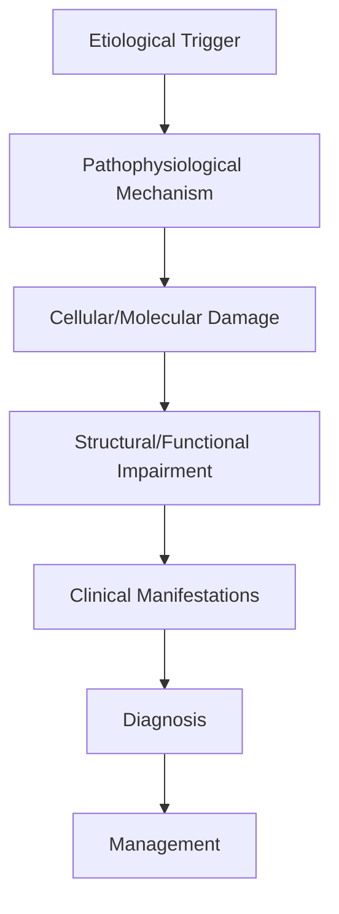
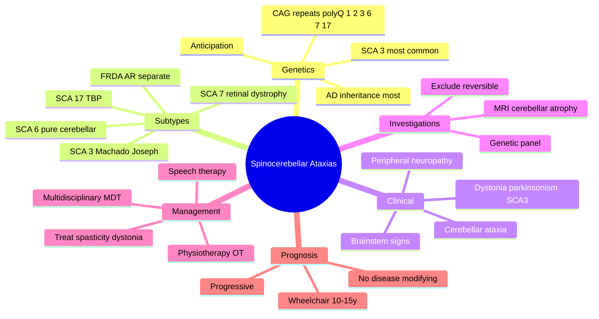

# Spinocerebellar Ataxias

> [!tip] **High-Yield Definition**
> Comprehensive clinical note for Spinocerebellar Ataxias covering definition, epidemiology, aetiology, pathophysiology, clinical features, investigations, differential diagnosis, management, drug interactions, procedures, complications, red flags, prognosis, topic correlation, and special situations for FCPS/MRCP examination preparation based on Davidson 24th Edition Chapter 25: Neurology.

---

## 1. Definition / Epidemiology / Classification

### Definition
Spinocerebellar Ataxias is a neurological disorder within the 18 genetic neurological disorders category. It is characterised by specific clinical, pathological, radiological, and laboratory features that allow differentiation from related conditions.

### Epidemiology
- **Incidence/Prevalence:** Variable depending on the specific condition.
- **Age:** Adult onset is most common, but paediatric and elderly presentations occur.
- **Sex:** Variable depending on the condition.
- **Geography:** Worldwide distribution, with higher prevalence in certain regions.
- **Risk Factors:** Genetic predisposition, environmental factors, comorbidities, family history.

### Classification
| Subtype | Key Features | Prognosis |
|---------|-------------|-----------|
| Mild/early | Subtle symptoms, preserved function | Best |
| Moderate | Clear symptoms, functional impairment | Variable |
| Severe | Significant disability, complications | Worst |

---

## 2. Aetiology / Pathophysiology

### Aetiology
- **Primary (idiopathic):** Most cases have no identifiable cause.
- **Genetic:** May be inherited (AD, AR, X-linked, mitochondrial, sporadic).
- **Autoimmune:** Autoantibodies, immune-mediated inflammation.
- **Infectious:** Viral, bacterial, fungal, parasitic.
- **Metabolic:** Electrolyte, endocrine, hepatic, renal, nutritional.
- **Toxic:** Drugs, alcohol, heavy metals, environmental toxins.
- **Vascular:** Ischaemia, haemorrhage, vasculitis.
- **Neoplastic:** Primary, secondary, paraneoplastic.
- **Traumatic:** Acute, chronic, repetitive.
- **Degenerative:** Neurodegeneration, protein misfolding.

### Pathophysiology


---

## 3. Clinical Features

### History
- **Onset/Duration:** Acute, subacute, or chronic.
- **Progression:** Static, progressive, relapsing-remitting, stepwise.
- **Key symptoms:** Specific to the condition.
- **Triggers:** Stress, infection, trauma, drugs, hormonal, environmental.
- **Systemic symptoms:** Constitutional features.
- **Drug/Family/Social history:** Relevant exposures, comorbidities.

### Examination
| Domain | Key Findings | Localisation Value |
|--------|-------------|-------------------|
| Higher function | Cognitive, behavioural | Cortical, subcortical, limbic |
| Cranial nerves | Pupils, eye movements, facial, bulbar | Brainstem, cranial nerve, NMJ |
| Motor | Weakness, tone, reflexes | UMN, LMN, NMJ, muscle |
| Sensory | All modalities, pattern | Peripheral, spinal, brainstem |
| Coordination | Ataxia, nystagmus, dysmetria | Cerebellar, sensory, vestibular |
| Gait | Spastic, ataxic, parkinsonian | Multiple |
| Autonomic | Orthostatic, sweating, GI, bladder | Autonomic, peripheral, central |

### Specific Clinical Features
The clinical features are determined by the underlying aetiology, location of pathology, and rate of progression. Patients typically present with a constellation of symptoms and signs that allow clinical localisation and subsequent targeted investigation.

---

## 4. Diagnostic Approach / Algorithm

```mermaid
flowchart TD
    A[Clinical Presentation] --> B[Anatomical Localisation]
    B --> C[Pathophysiological Category]
    C --> D[Formulate Differential]
    D --> E[Targeted Investigations]
    E --> F[Confirm Diagnosis]
    F --> G[Assess Severity/Prognosis]
    G --> H[Initiate Management]
    H --> I[Monitor Response]
    I --> J{Response?}
    J --> YES1 [Good - Continue]
    J --> NO1 [Poor - Escalate]
    YES1 --> K[Monitor]
    NO1 --> H
```

---

## 5. Investigations

### First-Line Investigations
- **Blood tests:** FBC, U&Es, LFTs, glucose, calcium, magnesium, ESR, CRP, autoimmune, infection.
- **Imaging:** CT/MRI brain/spine (essential for most neurological conditions).
- **Neurophysiology:** EEG, nerve conduction, EMG, evoked potentials.
- **CSF:** Cell count, protein, glucose, OCBs, PCR, culture.

### Second-Line Investigations
- **Genetic testing:** Gene panels, WES, WGS.
- **Antibody testing:** Antineuronal, autoimmune, paraneoplastic.
- **Biopsy:** Nerve, muscle, brain, skin.
- **Advanced imaging:** PET-CT, MR spectroscopy, fMRI.

### Specialised Investigations
- **Biomarkers:** Neurofilament light chain, tau, beta-amyloid, 14-3-3, RT-QuIC.
- **Autonomic testing:** Head-up tilt, sudomotor, QSART.
- **Neuropsychology:** Cognitive testing, behavioural assessment.
- **Genetic counselling:** Family screening, predictive testing.

---

## 6. Differential Diagnosis

| Differential | Distinguishing Features | Key Test |
|--------------|------------------------|----------|
| Vascular | Sudden onset, focal, vascular risk factors | MRI/CT, vessel imaging |
| Inflammatory | Subacute, multifocal, systemic | MRI, CSF, antibodies |
| Infectious | Fever, systemic, exposure | Bloods, CSF, imaging |
| Neoplastic | Progressive, mass effect | MRI, biopsy |
| Degenerative | Progressive, symmetric, hereditary | MRI, genetic |
| Toxic/Metabolic | Drug history, systemic, reversible | Bloods, toxicology |
| Autoimmune | Multifocal, antibodies, immunotherapy response | Antibodies, MRI, CSF |
| Functional | Inconsistent, distractible | Clinical, video, biomarkers |

---

## 7. Management

### Acute Management
- **Stabilisation:** ABCDE approach, emergency resuscitation.
- **Specific treatment:** Disease-specific interventions.
- **Symptomatic relief:** Pain, seizures, spasticity, autonomic dysfunction.
- **Prevention of complications:** DVT, pressure sores, infection.

### Disease-Modifying Treatment
- **Pharmacological:** First-line, second-line, escalation, maintenance.
- **Procedural:** Surgery, biopsy, drainage, ablation, stimulation.
- **Immunotherapy:** Steroids, IVIG, plasma exchange, immunosuppressants, biologics.
- **Rehabilitation:** Physiotherapy, OT, speech therapy.

### Long-Term Management
- **Monitoring:** Clinical, imaging, biomarkers, side effects.
- **Prevention:** Vaccinations, prophylaxis, lifestyle modification.
- **Supportive care:** Multidisciplinary team, social work, psychological support.
- **Palliative care:** Advanced care planning, end-of-life care, hospice.

---

## 8. Drug Interactions / Contraindications / Comorbidity Cautions

| Drug Class | Interaction / Caution | Management |
|------------|----------------------|------------|
| Antiseizure medications | Enzyme induction, teratogenicity | Monitor, supplement, switch |
| Immunosuppressants | Infection, malignancy, teratogenicity | Monitor, prophylaxis |
| Anticoagulants | Bleeding risk, drug interactions | Monitor INR, avoid combinations |
| Antihypertensives | Hypotension, falls | Monitor BP, adjust dose |
| Antibiotics | Nephrotoxicity, ototoxicity | Monitor renal |
| Antivirals | Nephrotoxicity, neuropsychiatric | Monitor renal, dose adjust |
| Steroids | DM, HTN, osteoporosis, infection | Monitor, prophylaxis, taper |
| Biologics | Infusion reactions, infection | Monitor, prophylaxis |

---

## 9. Procedures

### Common Procedures
- **Lumbar puncture:** Diagnostic, therapeutic (IIH, NPH). Contraindications: raised ICP, mass lesion, coagulopathy.
- **Nerve conduction studies/EMG:** Diagnostic, prognosis. Minor discomfort.
- **EEG:** Diagnostic, monitoring. No significant complications.
- **MRI brain/spine:** Diagnostic, monitoring. Contraindications: pacemaker, metallic implants.
- **CT head:** Emergency, rapid. Radiation exposure, contrast reactions.
- **Biopsy:** Stereotactic, open. Indications: diagnosis, molecular profiling.

---

## 10. Complications

| Complication | Frequency | Prevention | Management |
|--------------|-----------|------------|------------|
| Infection | Common | Hygiene, prophylaxis, vaccination | Antibiotics, antifungals |
| Thrombosis | Common | Prophylaxis, mobility | Anticoagulation |
| Pressure sores | Common | Positioning, nutrition | Wound care, surgery |
| Spasticity | Common | Positioning, stretching | Baclofen, BoNT |
| Contractures | Common | Passive movements, splints | Physiotherapy, surgery |
| Aspiration | Common | Swallow assessment | NGT, PEG, thickeners |
| Falls | Common | Environment, mobility | Walking aids |
| Fractures | Common | Bone health, prevention | Vitamin D, bisphosphonate |
| Depression | Common | Screening, support | Antidepressants, CBT |
| Cognitive decline | Variable | Monitoring, training | Rehabilitation |
| Autonomic dysfunction | Variable | Monitoring, hydration | Midodrine, fludrocortisone |
| Respiratory failure | Variable | Monitoring, supportive | Ventilation, NIV |
| Death | Variable | Monitoring, palliative | End-of-life care |

---

## 11. Red Flags / Emergencies

### Emergency Presentations
- **Rapid neurological deterioration:** New focal deficit, decreased consciousness, seizures.
- **Status epilepticus:** Continuous seizures >5 min.
- **Raised ICP:** Headache, vomiting, papilloedema, altered consciousness.
- **Respiratory failure:** Hypoxia, hypercapnia, ventilatory failure.
- **Cardiac arrest:** Arrhythmia, MI, pulmonary embolism.
- **Infection:** Sepsis, meningitis, abscess, encephalitis.
- **Drug toxicity:** Overdose, side effects, interactions.
- **Haemorrhage:** Intracranial, systemic, coagulopathy.

---

## 12. Prognosis

### Natural History
- **Acute:** May resolve with treatment, may progress, may be fatal.
- **Subacute:** Variable, depends on cause and treatment.
- **Chronic:** Often progressive, may be stable, may have relapses.
- **Recovery:** Variable, may be complete, partial, or none.

### Prognostic Factors
- **Favourable:** Young age, early treatment, mild disease, reversible cause, good premorbid function, family support.
- **Unfavourable:** Older age, delayed treatment, severe disease, irreversible cause, poor premorbid function, comorbidities.

---

## 13. Topic Correlation

| Related Topic | Link | Key Overlap |
|---------------|------|-------------|
| Davidson 24th Ed Chapter 25 | [[Davidson Chapter 25 - Neurology Hierarchy]] | Comprehensive neurology |
| Neurology MOC | [[Neurology MOC]] | All neurology topics |
| Drug Reference | [[../00_Index/Neurology Drug Reference]] | Medications |
| Local Hub | [[../18_Genetic_Neurological_Disorders/Hub]] | Section-specific |
| Clinical Examination | [[../01_Fundamentals_Examination/Neurological History Taking]] | Clinical approach |
| Investigation | [[../01_Fundamentals_Examination/Neuroimaging (CT-MRI) Principles]] | Imaging |

---

## 14. Special Situations

| Situation | Consideration |
|-----------|---------------|
| **Pregnancy** | Pre-conception counselling, teratogenicity, drug safety, monitoring, delivery planning, breastfeeding. |
| **Lactation** | Drug safety, breastfeeding, monitoring, support. |
| **Paediatric** | Developmental considerations, drug dosing, school, family, vaccination, growth, puberty. |
| **Elderly / Frail** | Comorbidities, polypharmacy, falls, bone health, cognition, social, end-of-life. |
| **Renal impairment** | Drug dose adjustment, monitoring, dialysis, transplant. |
| **Hepatic impairment** | Drug dose adjustment, monitoring, transplant. |
| **Immunocompromised** | Infection prophylaxis, vaccination, drug interactions, malignancy screening. |
| **Perioperative** | Drug management, anaesthesia planning, VTE prophylaxis, infection prevention, monitoring. |
| **Driving / DVLA** | Fitness to drive, restrictions, notification, reassessment. |
| **Occupational** | Fitness for work, adaptations, rehabilitation, disability, return to work. |

---

## FCPS/MRCP High-Yield Summary

| Category | Key Points |
|----------|------------|
| **Definition** | Comprehensive definition with key diagnostic criteria |
| **Epidemiology** | Incidence, prevalence, age, sex, geography, risk factors |
| **Aetiology** | Primary causes, secondary causes, genetic, environmental |
| **Pathophysiology** | Mechanism of disease, cellular/molecular basis |
| **Clinical Features** | History, examination, key findings, variants |
| **Diagnosis** | Diagnostic criteria, classification, severity |
| **Investigations** | First-line, second-line, specialised, biomarkers |
| **Differential Diagnosis** | Key differentials, distinguishing features, tests |
| **Management** | Acute, disease-modifying, symptomatic, supportive |
| **Complications** | Common, serious, prevention, management |
| **Prognosis** | Natural history, prognostic factors, outcomes |
| **Viva Pearls** | Key examination points |
| **Drug Doses** | First-line, second-line, emergency |
| **Scoring Systems** | Specific scores used in management |
| **Genetics** | Inheritance, genes, mutations, family screening |
| **Imaging Signs** | Characteristic findings, differential |

---

## Viva Questions (PACES/FCPS Style)

1. **Q:** Define and classify its variants.
   **A:** Comprehensive definition with classification of subtypes based on aetiology, severity, and clinical features.

2. **Q:** What are the key clinical features?
   **A:** Specific symptoms and signs including onset, progression, key features, and associated findings.

3. **Q:** What is the first-line treatment?
   **A:** First-line pharmacological and non-pharmacological management based on current evidence.

4. **Q:** What are the red flags requiring urgent referral?
   **A:** Specific emergency presentations and complications requiring immediate intervention.

5. **Q:** What is the prognosis?
   **A:** Natural history, prognostic factors, and long-term outcomes.

6. **Q:** How do you differentiate from key differentials?
   **A:** Clinical features, investigations, and response to treatment that distinguish from alternative diagnoses.

7. **Q:** What investigations are most useful?
   **A:** First-line and second-line investigations including imaging, neurophysiology, CSF, and biomarkers.

8. **Q:** Describe the stepwise management approach.
   **A:** Stepwise escalation from first-line to second-line to third-line therapy with monitoring.

9. **Q:** What are the emergency presentations?
   **A:** Specific emergency scenarios and immediate management priorities.

10. **Q:** How does management change in pregnancy/paediatrics/elderly?
    **A:** Special considerations for each population including drug safety, monitoring, and support.

---

## Common Confusions / Exam Traps

| Confusion | Clarification |
|-----------|---------------|
| Similar presentation but different cause | Differentiate by history, examination, investigations |
| Treatment response vs natural history | Assess with objective measures, biomarkers |
| Drug interactions | Check each drug, monitor, adjust doses |
| Disease progression vs treatment failure | Monitor response, escalate appropriately |
| Functional vs organic | Inconsistent, distractible, disability greater than impairment |
| Acute vs chronic | Time course, progression, reversibility |
| Primary vs secondary | Underlying cause, contributing factors |
| Side effects vs symptoms | Temporal relationship, dose relationship |

---

## Mnemonics

1. **PolyQ-opathies** — SCA 1, 2, 3, 6, 7, 17 are **CAG repeat (polyglutamine)** disorders.
2. **SCA 1-2-3-6-7-17** — Most common; SCA 3 (Machado-Joseph) is the **commonest worldwide**; SCA 6 is **pure cerebellar**; SCA 7 includes **retinal degeneration**.
3. **SCA 6 = pure** — Most "pure" cerebellar ataxia with very slow progression (CACNA1A calcium channel).
4. **SCA 7 = vision** — Only SCA with retinal dystrophy / pigmentary retinopathy leading to blindness.
5. **SCA 3 = most common** — Machado-Joseph disease; bulging eyes, dystonia, peripheral neuropathy, parkinsonism.
6. **Anticipation** — Earlier and more severe disease in successive generations (paternal > maternal for SCA 1, 2, 3, 7).
7. **EA (Episodic Ataxias)** — EA1 (KCNA1, myokymia), EA2 (CACNA1A, nystagmus, responsive to acetazolamide).
8. **Friedreich vs SCA** — FRDA: AR, **absent reflexes**, cardiomyopathy, scoliosis, diabetes, GAA repeat, onset <25y. SCA: AD, **hyperreflexia**, often adult onset.
9. **Cerebellar Triad** — Ataxia + dysmetria + dysarthria (scanning, staccato); nystagmus, intention tremor.
10. **MRI Clue** — **Cerebellar atrophy** (vermis > hemispheres) ± brainstem atrophy (especially pontine in SCA 2, 3).

---

## Mind Map



---

## Spaced Repetition Trackers

| Day | Topic | Question (front) | Answer (back) | Confidence (1-5) |
|-----|-------|------------------|---------------|------------------|
| 1 | Most common | Most common SCA worldwide? | SCA 3 (Machado-Joseph disease) | 4 |
| 1 | Pure | Pure cerebellar SCA? | SCA 6 (CACNA1A) | 4 |
| 2 | Vision | SCA with retinal degeneration? | SCA 7 (ATXN7) | 5 |
| 3 | Repeat | Mutation type in SCAs 1,2,3,6,7,17? | CAG trinucleotide repeat (polyglutamine) | 5 |
| 5 | Anticipation | Phenomenon of earlier onset in successive generations? | Anticipation | 5 |
| 7 | SCA 6 gene | Gene in SCA 6? | CACNA1A (calcium channel) | 3 |
| 10 | Differentiate | Differentiate SCA from FRDA? | SCA: AD, hyperreflexia; FRDA: AR, areflexia, cardiomyopathy | 4 |
| 14 | Imaging | MRI in SCA? | Cerebellar ± brainstem atrophy | 4 |
| 21 | EA2 | Drug-responsive episodic ataxia? | Acetazolamide (EA2) | 3 |
| 30 | Counselling | Recurrence risk to child of SCA patient? | 50% (AD) | 4 |

---

## Self-Test Scorecard

| Domain | Questions Attempted | Correct | Accuracy | Weak Areas |
|--------|---------------------|---------|----------|------------|
| Genetics & SCA Subtypes | /3 | | | |
| Clinical Features | /3 | | | |
| Investigations & Differential | /2 | | | |
| Management & Genetic Counselling | /2 | | | |
| **Overall** | **/10** | | | |

---

## MCQs (10)

1. **Q:** Most common spinocerebellar ataxia worldwide is:
   **A:** A. SCA 1  **B.** SCA 2  **C.** SCA 3 (Machado-Joseph disease)  **D.** SCA 6
   **Answer:** C — SCA 3.
   **Explanation:** SCA 3 (Machado-Joseph disease, ATXN3 gene) is the most common SCA worldwide, accounting for 20-50% of families depending on ethnic background, especially common in Portugal, Brazil, and East Asia.

2. **Q:** SCA 6 is characterised by:
   **A:** A. Retinal degeneration  **B.** "Pure" cerebellar ataxia with slow progression  **C.** Prominent brainstem signs  **D.** Peripheral neuropathy
   **Answer:** B — "Pure" cerebellar ataxia.
   **Explanation:** SCA 6 (CACNA1A gene, P/Q-type calcium channel) produces a relatively pure cerebellar syndrome with slow progression and minimal brainstem or peripheral nerve involvement.

3. **Q:** Which SCA is associated with retinal degeneration?
   **A:** A. SCA 1  **B.** SCA 3  **C.** SCA 6  **D.** SCA 7
   **Answer:** D — SCA 7.
   **Explanation:** SCA 7 (ATXN7) is the only SCA with progressive pigmentary retinal dystrophy causing visual loss (often the first sign). It is also the SCA with the most prominent anticipation.

4. **Q:** Genetic basis of SCAs 1, 2, 3, 6, 7, 17:
   **A:** A. GAA repeat  **B.** CAG repeat (polyglutamine)  **C.** CGG repeat  **D.** CTG repeat
   **Answer:** B — CAG repeat.
   **Explanation:** SCAs 1, 2, 3, 6, 7, 17 are polyglutamine (polyQ) CAG repeat expansion disorders. SCA 12 is a CAG repeat in PPP2R2B (not a classic polyQ disease); FRDA is a GAA repeat.

5. **Q:** SCA 3 (Machado-Joseph disease) is NOT typically associated with:
   **A:** A. Ataxia  **B.** Dystonia / parkinsonism  **C.** Retinal degeneration  **D.** Peripheral neuropathy
   **Answer:** C — Retinal degeneration.
   **Explanation:** SCA 3 features cerebellar ataxia, pyramidal signs, dystonia, peripheral neuropathy, and bulging eyes. Retinal degeneration is specific to SCA 7.

6. **Q:** Genetic phenomenon causing earlier onset in successive generations of SCAs:
   **A:** A. Anticipation  **B.** Penetrance variability  **C.** Imprinting  **D.** Mosaicism
   **Answer:** A — Anticipation.
   **Explanation:** CAG repeat instability during meiosis (especially paternal) leads to expansion in successive generations → earlier onset and more severe disease (anticipation).

7. **Q:** MRI finding in SCA:
   **A:** A. Caudate atrophy  **B.** Cerebellar ± brainstem atrophy  **C.** Cortical ribbon hyperintensity  **D.** Hippocampal atrophy
   **Answer:** B — Cerebellar ± brainstem atrophy.
   **Explanation:** SCA classically shows cerebellar (vermis and hemispheres) atrophy; pontine and olivary atrophy occurs in SCA 2, 3, and 7. Caudate atrophy is HD; cortical ribbon is CJD.

8. **Q:** Episodic ataxia type 2 (EA2) is caused by mutations in:
   **A:** A. KCNA1  **B.** CACNA1A  **C.** SCN1A  **D.** ATP1A2
   **Answer:** B — CACNA1A.
   **Explanation:** EA2 is due to CACNA1A mutations (same gene as SCA 6 and FHM1). EA1 is due to KCNA1 (with neuromyotonia/myokymia). EA2 responds to acetazolamide.

9. **Q:** Which of the following is a reversible cause that should be excluded before diagnosing hereditary SCA?
   **A:** A. Vitamin B12 deficiency  **B.** Wilson's disease  **C.** Hypothyroidism  **D.** All of the above
   **Answer:** D — All of the above.
   **Explanation:** Reversible causes of ataxia must be excluded: B12, copper (Wilson), thyroid, anti-GAD, coeliac, paraneoplastic (anti-Yo, anti-Hu), alcohol, structural lesions (MRI brain), MS.

10. **Q:** Recurrence risk in offspring of an SCA patient (autosomal dominant):
    **A:** A. 0%  **B.** 25%  **C.** 50%  **D.** 100%
    **Answer:** C — 50%.
    **Explanation:** SCAs (except SCAs with reduced penetrance) follow autosomal dominant inheritance with 50% risk to each offspring. Genetic counselling and prenatal diagnosis/PGD are options.

---

## SBA Questions (10)

1. **Scenario:** 35-year-old of Azorean descent with progressive gait ataxia, dystonia, peripheral neuropathy, and bulging eyes. Family history positive. Most likely SCA?
   **Options:** A. SCA 1  **B.** SCA 2  **C.** SCA 3  **D.** SCA 6
   **Answer:** C — SCA 3 (Machado-Joseph).
   **Explanation:** Portuguese/Azorean descent + ataxia + dystonia + neuropathy + bulging eyes is classic SCA 3. Originally described in Portuguese-Azorean families.

2. **Scenario:** 50-year-old with slowly progressive gait ataxia, mild dysarthria, no brainstem/cognitive/retinal signs, MRI shows pure cerebellar atrophy. Likely subtype?
   **Options:** A. SCA 1  **B.** SCA 3  **C.** SCA 6  **D.** SCA 7
   **Answer:** C — SCA 6.
   **Explanation:** Slowly progressive pure cerebellar ataxia without brainstem, peripheral, or retinal signs and isolated cerebellar atrophy on MRI is typical of SCA 6 (CACNA1A).

3. **Scenario:** SCA patient with progressive visual loss, retinal pigmentary changes, and worsening ataxia. Most likely genotype?
   **Options:** A. SCA 1  **B.** SCA 3  **C.** SCA 6  **D.** SCA 7
   **Answer:** D — SCA 7.
   **Explanation:** Retinal dystrophy with ataxia is pathognomonic of SCA 7; visual symptoms often precede ataxia. ATXN7 gene with prominent anticipation.

4. **Scenario:** 25-year-old with episodic vertigo, ataxia, and interictal nystagmus lasting hours, triggered by stress/caffeine. Most likely diagnosis?
   **Options:** A. SCA 6  **B.** EA 2  **C.** Migraine vertigo  **D.** Meniere's
   **Answer:** B — Episodic Ataxia type 2.
   **Explanation:** EA2 (CACNA1A) presents with paroxysmal ataxia/vertigo lasting hours, interictal gaze-evoked nystagmus, and dramatic response to acetazolamide. Often misdiagnosed as Meniere's or migraine.

5. **Scenario:** SCA patient asks about disease-modifying therapy. Best current answer?
   **Options:** A. Riluzole  **B.** No proven disease-modifying therapy  **C.** Stem cell therapy  **D.** Idebenone
   **Answer:** B — No proven disease-modifying therapy.
   **Explanation:** There is no disease-modifying therapy for polyQ SCAs. Management is supportive: physiotherapy, occupational therapy, speech therapy, dystonia/spasticity treatment, genetic counselling, and clinical trial enrolment.

6. **Scenario:** SCA patient with severe spasticity interfering with seating. Best focal treatment?
   **Options:** A. Oral baclofen only  **B.** Botulinum toxin ± intrathecal baclofen  **C.** Spinal surgery  **D.** Steroids
   **Answer:** B — Botulinum toxin ± intrathecal baclofen.
   **Explanation:** Severe spasticity in SCA is treated with oral antispasmodics, then focal botulinum toxin, and intrathecal baclofen for refractory cases.

7. **Scenario:** SCA patient with severe dysphagia, recurrent aspiration, and weight loss. Best intervention?
   **Options:** A. NG tube only  **B.** PEG placement  **C.** Tracheostomy  **D.** TPN only
   **Answer:** B — PEG placement.
   **Explanation:** Recurrent aspiration despite swallow therapy in advanced SCA is an indication for PEG feeding, with discussion of advance care planning and goals of care.

8. **Scenario:** First-degree relative of SCA patient wants genetic testing. First step?
   **Options:** A. Direct blood test  **B.** Genetic counselling before predictive test  **C.** MRI brain  **D.** EMG
   **Answer:** B — Genetic counselling.
   **Explanation:** Predictive genetic testing requires pre-test counselling covering implications (50% risk, no cure, insurance, family planning, mental health), informed consent, and support. Multidisciplinary protocol recommended.

9. **Scenario:** 8-year-old child of SCA parent (parent confirmed ATXN3). At-risk child asymptomatic. Test now?
   **Options:** A. Yes  **B.** No — defer until age of consent (≥18) unless symptomatic  **C.** Test at school entry  **D.** Test at age 12
   **Answer:** B — Defer until adulthood.
   **Explanation:** Predictive testing of asymptomatic minors is generally not recommended in untreatable adult-onset conditions, as it removes the child's future autonomous choice and provides no medical benefit.

10. **Scenario:** Patient with chronic alcohol use, peripheral neuropathy, gait ataxia, and cerebellar vermis atrophy on MRI. Most likely diagnosis?
    **Options:** A. SCA  **B.** Alcoholic cerebellar degeneration  **C.** Wernicke's  **D.** MSA-C
    **Answer:** B — Alcoholic cerebellar degeneration.
    **Explanation:** Alcoholic cerebellar degeneration is a non-genetic cause of ataxia (typically middle cerebellar vermis), associated with chronic alcohol use and thiamine deficiency, with normal genetic tests.

---

## Tags

`#spinocerebellar-ataxia` `#SCA` `#SCA1` `#SCA2` `#SCA3` `#Machado-Joseph` `#SCA6` `#SCA7` `#SCA17` `#polyglutamine` `#CAG-repeat` `#anticipation` `#CACNA1A` `#cerebellar-atrophy` `#EA2` `#acetazolamide` `#genetic-counselling` `#predictive-testing` `#FCPS` `#MRCP`
## Local Navigation
**Heading Hub:** [[../Hub]]  
**Chapter Hierarchy:** [[Davidson Chapter 25 - Neurology Hierarchy]]  
**Chapter MOC:** [[Neurology MOC]]  
**Drug Reference:** [[../00_Index/Neurology Drug Reference]]  
