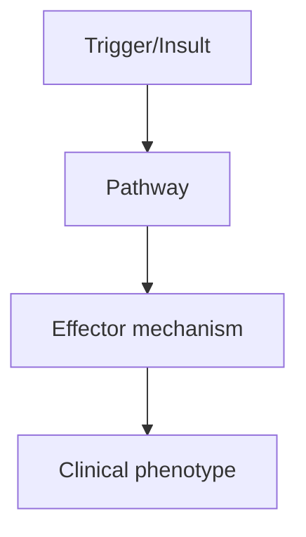
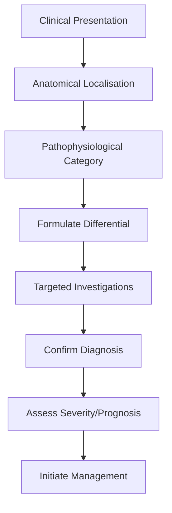
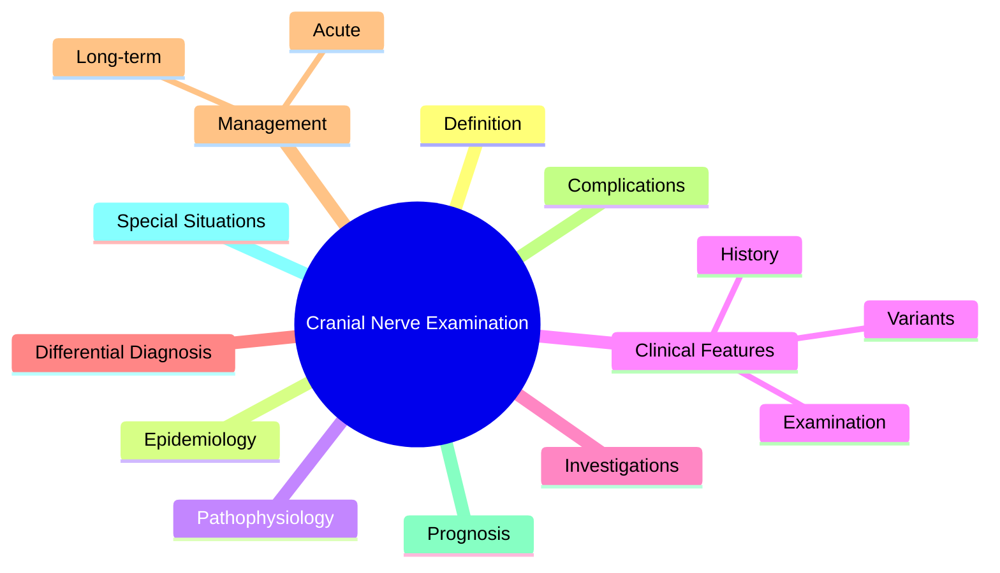

# Cranial Nerve Examination

> [!tip] **High-Yield Definition**
> Systematic examination of all 12 cranial nerves (I-XII). Essential for localising brainstem, skull base, and peripheral nerve lesions.

---

## 1. Definition / Epidemiology / Classification

### Definition
Systematic examination of all 12 cranial nerves (I-XII). Essential for localising brainstem, skull base, and peripheral nerve lesions.

### Epidemiology
Common CN palsies: VII (Bell's palsy, 20-30/100,000/year), VI (false localising sign of raised ICP), III (aneurysm, microvascular).

### Classification
| Variant | Key Features | Prognosis |
|---------|-------------|-----------|
| | | |

---

## 2. Aetiology / Pathophysiology

### Aetiology
CN I: trauma, frontal lobe tumour. CN II: optic neuritis, AION, papilloedema, optic nerve compression. CN III: PComm aneurysm, microvascular (DM/HTN), uncal herniation, cavernous sinus. CN IV: trauma (long course), microvascular. CN V: trigeminal neuralgia, herpes, skull base. CN VI: raised ICP, microvascular, cavernous sinus, petrous apex. CN VII: Bell's palsy (HSV), Ramsay Hunt (VZV), Lyme, sarcoid, tumour. CN VIII: vestibular schwannoma, BPPV, Meniere's. CN IX-X: bulbar palsy, MND, syringobulbia, jugular foramen. CN XI: SCM/trapezius weakness (neck surgery, MND). CN XII: hypoglossal palsy (MND, carotid dissection, surgery).

### Pathophysiology

---

## 3. Clinical Features

### History
- **Onset/Duration:**
- **Progression:**
- **Key symptoms:**
- **Triggers:**
- **Systemic symptoms:**
- **Drug/Family/Social history:**

### Examination
| Domain | Key Findings | Localisation Value |
|--------|-------------|-------------------|
| | | |

### Specific Clinical Features
CN I: smell (each nostril). CN II: acuity (Snellen), colour (Ishihara), fields (confrontation), pupils, RAPD, fundi. CN III/IV/VI: eye movements, ptosis, pupils, nystagmus. CN V: facial sensation (V1, V2, V3), corneal reflex, motor (masseter, temporalis). CN VII: facial movement (raise eyebrows, smile, puff cheeks), taste (anterior 2/3 tongue). CN VIII: hearing (whisper, Rinne, Weber), vestibular (Hallpike, head impulse). CN IX/X: palate elevation, gag, cough. CN XI: SCM (turn head against resistance), trapezius (shrug shoulders). CN XII: tongue protrusion, wasting, fasciculations.

---

## 4. Diagnostic Approach / Algorithm

---

## 5. Investigations

MRI brain (skull base, brainstem), NCS (VII blink reflex, EMG), audiometry, ENG, LP, autoimmune, infection screen.

---

## 6. Differential Diagnosis

| Differential | Distinguishing Features | Key Test |
|--------------|------------------------|----------|
| | | |

---

## 7. Management

Treat underlying cause. Eye patch (CN III/IV/VI palsy, artificial tears), swallowing assessment (IX/X), communication aids.

---

## 8. Drug Interactions / Contraindications / Comorbidity Cautions

| Drug | Interaction / Caution | Management |
|------|----------------------|------------|
| | | |

---

## 9. Procedures (if applicable)

### Procedure:
- **Indications:**
- **Contraindications:**
- **Preparation / Principle:**
- **Complications:**
- **Viva Pearls:**

---

## 10. Complications

| Complication | Frequency | Prevention / Monitoring | Management |
|--------------|-----------|------------------------|------------|
| | | | |

---

## 11. Red Flags / Emergencies

CN III palsy with pupil involvement (aneurysm), progressive cranial nerve palsies (skull base lesion, malignancy), multiple cranial nerve involvement (cavernous sinus, nasopharyngeal Ca, base of skull).

---

## 12. Prognosis

Depends on cause. Bell's palsy 70% complete recovery. Microvascular palsies usually resolve. Aneurysmal CN III requires urgent treatment.

---

## 13. Topic Correlation

| Related Topic | Link | Key Overlap |
|---------------|------|-------------|
| | | |

---

## 14. Special Situations

| Situation | Consideration |
|-----------|---------------|
| **Pregnancy** | |
| **Lactation** | |
| **Paediatric** | |
| **Elderly / Frail** | |
| **Renal impairment** | |
| **Hepatic impairment** | |
| **Immunocompromised** | |
| **Perioperative** | |
| **Driving / DVLA** | |
| **Occupational** | |

---

## FCPS/MRCP High-Yield Summary

| Category | Key Points |
|----------|------------|
| **Definition** | Systematic examination of all 12 cranial nerves (I-XII). Essential for localising brainstem, skull base, and peripheral nerve lesions. |
| **Epidemiology** | Common CN palsies: VII (Bell's palsy, 20-30/100,000/year), VI (false localising sign of raised ICP), III (aneurysm, microvascular). |
| **Pathophysiology** | |
| **Clinical** | CN I: smell (each nostril). CN II: acuity (Snellen), colour (Ishihara), fields (confrontation), pupils, RAPD, fundi. CN III/IV/VI: eye movements, ptosis, pupils, nystagmus. CN V: facial sensation (V1, |
| **Diagnosis** | |
| **Investigations** | MRI brain (skull base, brainstem), NCS (VII blink reflex, EMG), audiometry, ENG, LP, autoimmune, infection screen. |
| **Management** | Treat underlying cause. Eye patch (CN III/IV/VI palsy, artificial tears), swallowing assessment (IX/X), communication aids. |
| **Complications** | |
| **Prognosis** | Depends on cause. Bell's palsy 70% complete recovery. Microvascular palsies usually resolve. Aneurysmal CN III requires urgent treatment. |
| **Viva Pearls** | |
| **Drug Doses** | |
| **Scoring Systems** | |
| **Genetics** | |
| **Imaging Signs** | |

---

## Viva Questions (PACES/FCPS Style)

1. **Q:** Define Cranial Nerve Examination and classify its variants.
   **A:** Based on the definition above.

2. **Q:** What are the key clinical features?
   **A:** CN I: smell (each nostril). CN II: acuity (Snellen), colour (Ishihara), fields (confrontation), pupils, RAPD, fundi. CN III/IV/VI: eye movements, ptosis, pupils, nystagmus. CN V: facial sensation (V1, V2, V3), corneal reflex, motor (masseter, temporalis). CN VII: facial movement (raise eyebrows, smi

3. **Q:** What is the first-line treatment?
   **A:** Based on the management section.

4. **Q:** What are the red flags requiring urgent referral?
   **A:** CN III palsy with pupil involvement (aneurysm), progressive cranial nerve palsies (skull base lesion, malignancy), multiple cranial nerve involvement (cavernous sinus, nasopharyngeal Ca, base of skull).

5. **Q:** What is the prognosis?
   **A:** Depends on cause. Bell's palsy 70% complete recovery. Microvascular palsies usually resolve. Aneurysmal CN III requires urgent treatment.

6. **Q:** How do you differentiate Cranial Nerve Examination from key differentials?
   **A:** Clinical features, investigations, and response to treatment.

7. **Q:** What investigations are most useful?
   **A:** Based on the investigations section.

8. **Q:** Describe the stepwise management approach.
   **A:** Based on the management algorithm.

9. **Q:** What are the emergency presentations?
   **A:** Based on the red flags section.

10. **Q:** How does management change in pregnancy/paediatrics/elderly?
    **A:** Special considerations per population.

---

## Common Confusions / Exam Traps

| Confusion | Clarification |
|-----------|---------------|
| | |

---

## Mnemonics
1. **LR6SO4)3** — **L**ateral **R**ectus (VI), **S**uperior **O**blique (IV), all others (III) — eye movements
1. **OOO TAFV GVH** — **O**lfactory, **O**ptic, **O**culomotor, **T**rochlear, **A**bducens, **F**acial, **V**estibulocochlear, **G**lossopharyngeal, **V**agus, **H**ypoglossal (I-XII)
1. **Bell's = LMN** — Bell's palsy spares nothing (LMN VII affects all branches including forehead); UMN spares forehead (bilateral cortical innervation)

---

## Mind Map

---

## Spaced Repetition Trackers

| Review Interval | Date | Score (0-5) | Notes |
|-----------------|------|-------------|-------|
| Day 1 | | | |
| Day 3 | | | |
| Day 7 | | | |
| Day 14 | | | |
| Day 30 | | | |
| Day 90 | | | |

---

## Self-Test Scorecard

| Section | Score /5 | Last Attempt |
|---------|----------|--------------|
| Definition & Epidemiology | | |
| Pathophysiology | | |
| Clinical Features | | |
| Investigations | | |
| Differential Diagnosis | | |
| Management | | |
| Complications & Prognosis | | |
| Viva Questions | | |
| MCQs | | |
| SBAs | | |

---

## MCQs (10)

1. **Question:** CN III palsy with pupil involvement suggests:
   **Options:** A. Compressive lesion (PCOM aneurysm, uncal herniation) B. Microvascular (diabetes) C. Myasthenia D. Migraine
   **Answer:** A
   **Explanation:** Pupil-involving CN III = posterior communicating aneurysm or uncal herniation.

2. **Question:** CN IV palsy causes:
   **Options:** A. Vertical diplopia worse on downgaze/adduction B. Horizontal diplopia C. Ptosis D. Pupil abnormality
   **Answer:** A
   **Explanation:** CN IV = superior oblique. Vertical diplopia, worse on downgaze/adduction.

3. **Question:** CN VI palsy is:
   **Options:** A. Common false localising sign of raised ICP B. Always due to aneurysm C. Pupil-involving D. Surgical emergency
   **Answer:** A
   **Explanation:** CN VI has long intracranial course, vulnerable to stretch from raised ICP (false localising).

4. **Question:** Bell's palsy is:
   **Options:** A. Idiopathic LMN CN VII palsy (often HSV) B. UMN lesion C. Trigeminal neuralgia D. Stroke
   **Answer:** A
   **Explanation:** Acute LMN CN VII palsy. Often viral (HSV).

5. **Question:** Hutchinson's sign (vesicles on nose tip) suggests:
   **Options:** A. V1 herpes zoster ophthalmicus (nasociliary branch) B. Trigeminal neuralgia C. Bell's palsy D. Migraine
   **Answer:** A
   **Explanation:** Hutchinson's sign = nasociliary V1 in HZO.

6. **Question:** Jaw jerk is exaggerated in:
   **Options:** A. UMN lesion above CN V nucleus B. LMN CN V C. Trigeminal neuralgia D. Bell's palsy
   **Answer:** A
   **Explanation:** Brisk jaw jerk = UMN lesion, e.g., pseudobulbar palsy, ALS, MS.

7. **Question:** Uvula deviates right on phonation. Right CN X weakness. Site?
   **Options:** A. Right vagus nerve or nucleus ambiguus B. Right cortex C. Left cortex D. Bilateral
   **Answer:** A
   **Explanation:** Uvula deviates AWAY from weak side. Right vagus weakness → uvula to left.

8. **Question:** Tongue deviates right on protrusion. Site of lesion?
   **Options:** A. Right hypoglossal (LMN XII) B. Right cortex C. Left cortex D. Bilateral
   **Answer:** A
   **Explanation:** Tongue deviates TOWARDS weak side. Right CN XII = right tongue weakness.

9. **Question:** Loss of smell right nostril only. Site?
   **Options:** A. Right olfactory nerve/bulb B. Right frontal lobe C. Right temporal lobe D. Right optic nerve
   **Answer:** A
   **Explanation:** Olfactory nerve (I). Anosmia unilateral = nerve lesion.

---

## SBA Questions (10)

1. **Scenario:** Ptosis, 'down and out' eye, dilated pupil. Next step?
   **Options:** A. Urgent CT/MRI + MRA (PCOM aneurysm) B. Bedrest and review C. Botulinum toxin D. Observe E. Oral steroids
   **Answer:** A
   **Explanation:** Pupil-involving CN III = neurosurgical emergency.

2. **Scenario:** Unilateral facial weakness including forehead, can't close eye. Diagnosis?
   **Options:** A. Bell's palsy (LMN CN VII) B. Stroke (UMN) C. Trigeminal neuralgia D. Migraine E. Other option
   **Answer:** A
   **Explanation:** Forehead involvement = LMN. Bell's palsy.

3. **Scenario:** Bilateral facial weakness, reduced taste, hyperacusis. Diagnosis?
   **Options:** A. Bilateral Bell's palsy or GBS variant B. Stroke C. Trigeminal neuralgia D. Facial trauma E. Other option
   **Answer:** A
   **Explanation:** Bilateral LMN VII. Consider GBS, sarcoid, Lyme.

---

## Tags

**Tags:** #neurology #cranial-nerves #CN-III #CN-IV #CN-VI #Bell's-palsy #Hutchinson-sign #FCPS #MRCP

---

## Local Navigation
**Heading Hub:** [[../Clinical Assessment Hub]]
**Chapter Hierarchy:** [[../../Davidson Chapter 25 - Neurology Hierarchy]]
**Chapter MOC:** [[../../Neurology MOC]]
**Drug Reference:** [[../../00_Index/Neurology Drug Reference]]