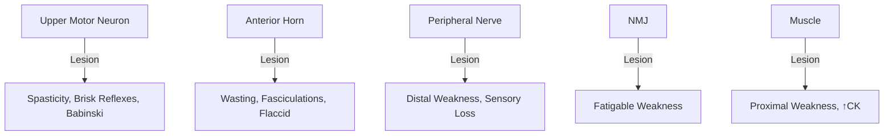
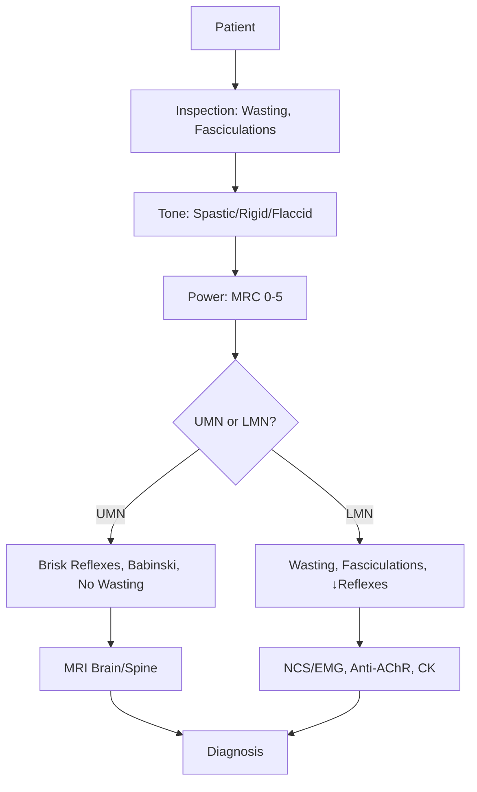

# Motor System Examination

> [!tip] Systematic motor assessment = **Inspection → Tone → Power → Reflexes → Coordination**. **UMN vs LMN differentiation** is the central clinical skill — drives 80% of neurological localisation. Document with **stick-figure diagram** and **MRC grade**.

## Learning Objectives
- [ ] Sequence motor exam: inspection, tone, power, reflexes, coordination
- [ ] Grade power using MRC scale (0–5)
- [ ] Distinguish UMN from LMN signs
- [ ] Localise lesion from pattern (pyramidal, monoparesis, paraparesis, hemiparesis)
- [ ] Recognise extrapyramidal, cerebellar, NMJ, myopathic patterns
- [ ] Identify red flags requiring urgent imaging

---

## 1. Definition / Epidemiology / Classification

### Definition
**Motor examination** assesses the corticospinal tract, lower motor neurons, NMJ, and muscle. Components: inspection, tone, power, reflexes, coordination, gait, involuntary movements.

### Classification
| Level | Pattern | Reflexes | Tone | Wasting |
|-------|---------|----------|------|---------|
| **UMN** | Pyramidal (UE extensors, LE flexors) | ↑ Brisk | ↑ Spastic | Late disuse |
| **LMN** | Weak, fasciculations | ↓/Absent | ↓ Flaccid | Early, marked |
| **Extrapyramidal** | Bradykinesia, rigidity, tremor | Normal | Rigid | None (early) |
| **Cerebellar** | Ataxia, dysmetria | Normal/Pendular | ↓ Hypotonic | None |
| **NMJ** | Fatigable, ocular/bulbar | Normal | Normal | None (early) |
| **Myopathic** | Proximal, symmetric | Normal/↓ | Normal | Marked |

### Epidemiology
- Motor deficits = ~40% of neurology referrals
- **Stroke** = leading cause of focal motor deficit (UMN)
- **Peripheral neuropathies** = most common cause of distal LMN weakness
- **Myopathies** = proximal; **NMJ** = fatigable

---

## 2. Aetiology / Pathophysiology

### Aetiology
- **Genetic:** DMD/BMD (dystrophin), SMA (SMN1), Huntington (CAG), HSP (SPG4)
- **Autoimmune:** GBS, CIDP, MG, LEMS, MS
- **Infectious:** Polio (anterior horn), HIV, Lyme
- **Vascular:** Stroke, cord compression, syrinx
- **Neoplastic:** MND, paraneoplastic neuropathy
- **Metabolic/Toxic:** B12, alcohol, critical illness myopathy
- **Drug-induced:** Statin, steroid, vincristine

### Pathophysiology

### Molecular Basis
- **SOD1, FUS, C9orf72** — ALS
- **Dystrophin** Xp21 — DMD/BMD
- **SMN1** — SMA
- **PMP22, MPZ, MFN2** — CMT
- **Anti-AChR, MuSK** — MG
- **Anti-VGCC** — LEMS

---

## 3. Clinical Features

### History
- **Onset:** Acute (vascular), subacute (inflammatory), chronic (degenerative)
- **Pattern:** Distal vs proximal, symmetric vs asymmetric, fatigability
- **Associated:** Sensory, pain, autonomic, bulbar, respiratory
- **Diurnal variation:** MG worse at night/end of day

### Examination
| Domain | Key Findings | Localisation |
|--------|-------------|--------------|
| **Inspection** | Wasting, fasciculations, hypertrophy, posture, scars | LMN, dystrophy |
| **Tone** | Spasticity, rigidity, paratonia, hypotonia | UMN, extrapyramidal |
| **Power** | MRC 0-5; pattern | Lesion level |
| **Reflexes** | Brisk/abnormal (UMN), absent (LMN), inverted | Central/peripheral |
| **Involuntary** | Tremor, dystonia, chorea, fasciculations | Extrapyramidal/anterior horn |
| **Coordination** | Finger-nose, heel-shin, dysdiadochokinesia | Cerebellar |

### Specific Syndromes
| Syndrome | Features | Localisation |
|----------|---------|--------------|
| **Pyramidal** | UE extensors, LE flexors (Wernicke-Mann) | Corticospinal |
| **Monoparesis** | Single limb | Cortex (contralateral), cord (ipsilateral), plexus/nerve |
| **Paraparesis** | Both legs | Cord (above T1), cauda equina |
| **Hemiparesis** | One side | Contralateral cortex/capsule/brainstem |
| **Proximal myopathy** | Hip/shoulder girdle, Gowers | Muscle |
| **Fatigable** | Worsens with use, ocular | NMJ (MG, LEMS) |
| **Parkinsonism** | Bradykinesia, rigidity, tremor | Basal ganglia |

### Associated Findings
- **Pseudohypertrophy of calves** — DMD
- **Scapular winging** — Serratus anterior (long thoracic nerve), FSHD
- **Gowers sign** — Proximal weakness
- **Fasciculations** — Anterior horn (MND, polio) or benign
- **Fibrillations** — Only on EMG (denervation)

---

## 4. Diagnostic Approach / Algorithm

### MRC Scale
| Grade | Description |
|-------|-------------|
| **0** | No contraction |
| **1** | Flicker/trace |
| **2** | Movement with gravity eliminated |
| **3** | Against gravity only |
| **4** | Against resistance (4− slight, 4 moderate, 4+ strong) |
| **5** | Normal |

---

## 5. Investigations

### First-Line
| Test | Indication | Finding |
|------|------------|---------|
| **CK** | Myopathy | ↑↑ DMD, ↑ polymyositis |
| **ESR/CRP** | Myositis | ↑ |
| **TSH, electrolytes** | Endocrine | Hypothyroid, K+ disorders |
| **HbA1c, B12** | Neuropathy | ↑glucose, ↓B12 |

### Neuroimaging & Neurophysiology
| Modality | Indication | Findings |
|----------|------------|----------|
| **MRI Brain** | UMN signs, stroke, MS | Cortical/subcortical lesion |
| **MRI Spine** | Cord compression, myelopathy | Cord signal/compression |
| **NCS/EMG** | LMN signs, neuropathy, myopathy | Denervation, myopathy |
| **RNS/SFEMG** | NMJ disorder | Decrement (MG), increment (LEMS) |

---

## 6. Differential Diagnosis
| Differential | Distinguishing Features | Key Test |
|--------------|------------------------|----------|
| **UMN vs LMN** | Reflexes, tone, wasting, fasciculations | Combined features |
| **Stroke vs Bell's palsy** | Forehead sparing = UMN (stroke) | CT/MRI |
| **Peripheral vs radiculopathy** | Length-dependent vs dermatomal | NCS/EMG |
| **MG vs LEMS** | MG: ocular, ↑with use; LEMS: proximal + autonomic, ↑with exercise | Anti-AChR/Anti-VGCC |
| **Functional** | Inconsistency, Hoover's +ve, give-way | Clinical, Hoover's |

---

## 7. Management

### Acute UMN (Stroke)
- ABC, glucose, urgent CT/MRI, thrombolysis if eligible
- DVT prophylaxis, bladder care, early mobilisation

### Spasticity
| Agent | Dose |
|-------|------|
| **Baclofen** | 5mg TDS → 100mg/day max; intrathecal for severe |
| **Tizanidine** | 2-24mg/day (avoid CYP1A2 inhibitors) |
| **Dantrolene** | 25-100mg TDS (monitor LFT) |
| **Botulinum toxin** | Focal spasticity (equinus, adductors) |
| **Benzodiazepines** | Diazepam 2-5mg TDS |

### Myasthenia Gravis
- **Pyridostigmine** 30-60mg Q4-6H (symptomatic)
- **Immunosuppression:** Prednisolone, azathioprine, mycophenolate
- **Crisis:** IVIG 2g/kg or plasma exchange + ICU
- **Thymectomy** if <65y, AChR-Ab +, generalised

### Motor Neuron Disease
- **Riluzole** 50mg BD (prolongs survival 3-6 months)
- **Edaravone** (selected ALS)
- MDT: PEG, NIV, communication aids

---

## 8. Drug Interactions / Contraindications
| Drug | Caution | Management |
|------|---------|------------|
| **Baclofen** | Sedation, abrupt withdrawal → seizures | Titrate slowly |
| **Tizanidine** | CYP1A2 substrate ↑levels | Avoid fluvoxamine, ciprofloxacin |
| **Dantrolene** | Hepatotoxicity | Serial LFT |
| **Pyridostigmine** | Cholinergic effects | Watch for muscarinic SE |

---

## 9. Procedures
### LP (for GBS, CIDP)
- Indicated for GBS (albuminocytologic dissociation)
- See CSF analysis note

---

## 10. Complications
| Complication | Frequency | Prevention/Management |
|--------------|-----------|----------------------|
| **Contractures** | Chronic UMN | Stretching, splints, botox, intrathecal baclofen |
| **Pressure sores** | Immobility | 2-hourly turning |
| **DVT/PE** | Immobilisation | LMWH prophylaxis |
| **Aspiration** | Bulbar weakness | SALT, NG/PEG |
| **Respiratory failure** | High cord, GBS, MG | Serial FVC, NIF; intubate FVC<20 |

---

## 11. Red Flags / Emergencies
| Red Flag | Action | Time |
|----------|--------|------|
| **Sudden focal weakness** | Stroke pathway, CT/MRI | <4.5h thrombolysis |
| **Ascending paralysis + areflexia** | GBS — FVC, NIF, monitor airway | ICU, IVIG/PLEX |
| **FVC<20 ml/kg or NIF<-30** | Elective intubation | Immediate |
| **Cord compression signs** | Urgent MRI spine, neurosurgery | <24h |
| **Myasthenic crisis** | ICU, IVIG/PLEX, intubation | Immediate |
| **Todd's paresis** | Observe, MRI if persistent | Hours |

---

## 12. Prognosis
| Condition | Good | Poor |
|-----------|------|------|
| **Stroke** | Mild deficit, early rehab | Severe, large stroke |
| **GBS** | <30y, no ventilation | >40, ventilation, AMAN/AMSAN |
| **MG** | Thymectomy, IS response | Thymoma, MuSK, crisis |
| **MND** | Young, slower progression | Respiratory, FVC<50% |

---

## 13. Topic Correlation
- **Neurological Examination** — full sequence
- **Sensory System Examination** — combined sensorimotor
- **Anatomical Localisation Principles** — UMN/LMN
- **GBS, MG, MND, Stroke, MS, Cord Compression** — disease-specific

---

## 14. Special Situations
| Situation | Consideration |
|-----------|---------------|
| **Pregnancy** | GBS, MG may worsen; Safe: prednisolone, IVIG, pyridostigmine; Avoid: MMF, MTX |
| **Paediatric** | SMA, DMD; Genetic counselling |
| **Elderly** | Falls, polypharmacy, multi-level disease |
| **Renal** | Baclofen dose reduction |
| **Hepatic** | Avoid dantrolene, tizanidine |
| **Driving** | Stroke: 1mo; Seizure: 1yr; Group 2 stricter |

---

## FCPS/MRCP High-Yield Summary
- **UMN signs:** Spasticity, brisk reflexes, Babinski +ve, no wasting, clasp-knife
- **LMN signs:** Flaccid, wasting, fasciculations, ↓reflexes
- **MRC 0-5:** 4 split into 4−, 4, 4+
- **Pyramidal pattern:** UE extensors weak, LE flexors weak
- **Inverted reflex:** LMN at level, UMN below (cord lesion)
- **Hoover's:** Functional weakness; contralateral hip extension
- **Gowers:** Proximal weakness (DMD, myopathy)
- **Pseudo-bulbar vs bulbar:** Pseudo: UMN (spastic, brisk jaw jerk); Bulbar: LMN (flaccid, fasciculations)
- **MG:** Anti-AChR; **LEMS:** Anti-VGCC
- **Cord compression:** Sensory level + UMN below + LMN at level + sphincters

---

## Viva Questions
1. List 5 UMN signs. → Spasticity, hyperreflexia, Babinski, clonus, absent abdominals.
2. MRC 4 splits. → 4−, 4, 4+ quantifies resistance against gravity.
3. Pyramidal vs peripheral. → Pyramidal: extensor UE/flexor LE, hyperreflexia; Peripheral: distal, sensory, areflexia.
4. Inverted reflex? → Absent at level (LMN), brisk below (UMN) — localises cord.
5. Gowers sign? → Proximal LL weakness (DMD, myopathy).
6. Functional signs? → Inconsistency, Hoover's +ve, give-way, co-contraction.
7. Bell's palsy forehead? → Involved = LMN CN VII.
8. MG vs LEMS? → MG: ocular/bulbar, fatigable; LEMS: proximal + autonomic, brief exercise improves.
9. Spasticity definition? → Velocity-dependent ↑tone (UMN).
10. GBS intubation? → FVC<20, NIF<-30, bulbar dysfunction.

---

## Common Confusions / Exam Traps
| Confusion | Clarification |
|-----------|---------------|
| **Early stroke** | Initially flaccid (cerebral shock), spastic over days-weeks |
| **Early GBS** | Areflexia but lesion is proximal root (not anterior horn) |
| **Cerebellar hypotonia** | Mimics LMN but reflexes normal |
| **Inverted supinator/biceps** | Localises C5/C6 cord lesion |
| **Todd's paresis vs stroke** | Todd's = post-ictal, 24-48h; Stroke persistent |
| **Bilateral UMN cervical myelopathy** | May mimic myopathy (proximal) |

---

## Mnemonics
1. **UMN — "BAD"** = Brisk, Ankle clonus, Babinski
2. **LMN — "FLAP"** = Fasciculations, Low tone, Atrophy, Paralysis (areflexia)
3. **MRC — "5-4-3-2-1-0"** = Normal → Flicker → None
4. **Pyramidal** = "UE-Extensor, LE-Flexor" (Wernicke-Mann)
5. **Bell's** = "Forehead falls flat" = LMN
6. **Bilateral proximal weakness** = DMP (Dermatomyositis, Myotonic, Polymyositis, endo)

---

## One-Page Revision Card
| Field | Content |
|-------|---------|
| **Definition** | Motor exam: inspection, tone, power (MRC 0-5), reflexes, coordination |
| **Key Clinical** | UMN: spastic, brisk, Babinski, no wasting. LMN: flaccid, wasting, fasciculations, areflexic |
| **Localisation** | Pattern: pyramidal, distal, proximal, fatigable, ataxic, rigid |
| **Investigations** | MRI (UMN), NCS/EMG (LMN), CK (myopathy), Anti-AChR (MG) |
| **Management** | Treat cause; Spasticity: baclofen/tizanidine/botox; MG: pyridostigmine+IS |
| **Drugs/Doses** | Baclofen 5mg TDS; Pyridostigmine 60mg Q4-6H; Riluzole 50mg BD |
| **Red Flags** | Stroke (4.5h), GBS (FVC<20), MG crisis, cord compression (24h) |
| **Viva Pearls** | MRC 4 most tested; Inverted reflex = cord; Hoover's = functional |

---

## MCQs (10)
1. **Question:** MRC grade 4+ indicates which of the following?
   **Options:** A. Movement against gravity only B. Movement with minimal resistance C. Movement with strong resistance easily overcome D. Normal power
   **Answer:** C
   **Explanation:** 4+ = strong resistance easily overcome; 4 = moderate; 4− = slight.

2. **Question:** A 60-year-old has sudden right-sided weakness with right UMN facial weakness (forehead sparing) and aphasia. Where is the lesion?
   **Options:** A. Right internal capsule B. Left MCA territory C. Right cortex D. Brainstem
   **Answer:** B
   **Explanation:** Forehead sparing = UMN = contralateral (left) cortical lesion; aphasia = dominant hemisphere.

3. **Question:** Which is a LOWER motor neuron sign?
   **Options:** A. Spasticity B. Hyperreflexia C. Fasciculations D. Babinski
   **Answer:** C
   **Explanation:** Fasciculations = anterior horn/nerve lesion. Others = UMN.

4. **Question:** Gowers sign is indicative of?
   **Options:** A. Distal neuropathy B. Cerebellar ataxia C. Proximal myopathy D. UMN lesion
   **Answer:** C
   **Explanation:** Hands walk up thighs to stand = proximal LL weakness (DMD, polymyositis).

5. **Question:** In cervical cord compression at C5, which reflex would be INVERTED?
   **Options:** A. Biceps (C5/6) B. Triceps (C7) C. Supinator (C5/6) D. Finger jerk (C8)
   **Answer:** C
   **Explanation:** Inverted supinator = finger flexion on tap; C5/6 cord lesion (LMN at level, UMN below).

6. **Question:** Fatigable ptosis worse at night — antibody most likely?
   **Options:** A. Anti-VGCC B. Anti-GM1 C. Anti-AChR D. Anti-MuSK
   **Answer:** C
   **Explanation:** MG — anti-AChR +ve in 80-90% generalised. MuSK in seronegative. VGCC = LEMS.

7. **Question:** Bilateral foot drop with foot inversion weakness. Which nerve?
   **Options:** A. Common peroneal B. Tibial C. Sural D. Femoral
   **Answer:** A
   **Explanation:** Common peroneal palsy = foot drop (EHL) + inversion weakness (L5).

8. **Question:** Earliest sign of corticospinal tract dysfunction?
   **Options:** A. Spasticity B. Wasting C. Loss of dexterity D. Hyperreflexia
   **Answer:** C
   **Explanation:** Loss of fine finger movements is earliest; spasticity/Babinski develop over days.

9. **Question:** Winging of scapula is associated with weakness of?
   **Options:** A. Trapezius B. Serratus anterior C. Latissimus dorsi D. Rhomboid
   **Answer:** B
   **Explanation:** Serratus anterior (long thoracic nerve); medial winging worse on pushing.

10. **Question:** In UMN lower limb lesion, most reliable reflex for documentation?
    **Options:** A. Knee jerk B. Ankle jerk C. Babinski sign D. Cremasteric
    **Answer:** C
    **Explanation:** Babinski = most reliable UMN sign; ankle jerk can be absent in normal elderly.

---

## SBA Questions (10)
1. **Scenario:** 25-year-old with bilateral ascending weakness, areflexia 3 weeks post-diarrhoea. CSF: protein 1.5 g/L, cells 2/μL. Diagnosis?
   **Options:** A. Transverse myelitis B. GBS C. Poliomyelitis D. Polymyositis
   **Answer:** B
   **Explanation:** Post-Campylobacter, ascending LMN, areflexia, **albuminocytologic dissociation** = GBS.

2. **Scenario:** 70-year-old with bilateral proximal weakness, brisk reflexes in legs, sensory level at umbilicus, urinary retention. Most urgent next step?
   **Options:** A. LP B. MRI whole spine C. EMG/NCS D. Anti-AChR
   **Answer:** B
   **Explanation:** Cord compression = **urgent MRI spine** (<24h for surgical decompression).

3. **Scenario:** 35-year-old with fatigable ptosis and diplopia worse with reading. First-line symptomatic treatment?
   **Options:** A. Prednisolone 60mg B. Pyridostigmine 60mg Q4-6H C. IVIG 2g/kg D. Azathioprine
   **Answer:** B
   **Explanation:** MG first-line symptomatic = pyridostigmine (AChE inhibitor).

4. **Scenario:** 60-year-old with progressive right foot drop, EHL/tibialis anterior wasting, sensory loss over dorsum, normal reflexes. Diagnosis?
   **Options:** A. L5 radiculopathy B. Common peroneal neuropathy C. Sciatic neuropathy D. Peripheral neuropathy
   **Answer:** B
   **Explanation:** Common peroneal at fibular head — motor (foot drop) + sensory (lateral leg), normal reflexes.

5. **Scenario:** 50-year-old with progressive weakness, wasting, fasciculations in all 4 limbs, brisk jaw jerk, pseudobulbar affect. Diagnosis?
   **Options:** A. Cervical myelopathy B. MND (ALS) C. MS D. Polymyositis
   **Answer:** B
   **Explanation:** Mixed UMN+LMN in multiple regions + pseudobulbar = ALS.

6. **Scenario:** 22-year-old with bilateral facial weakness, no limb weakness, preserved taste, ↓tears. Diagnosis?
   **Options:** A. Bilateral Bell's palsy B. Sarcoidosis C. MG D. GBS (MFS variant)
   **Answer:** D
   **Explanation:** Bilateral CN VII + normal limbs = MFS; anti-GQ1b +ve.

7. **Scenario:** 40-year-old alcoholic, 2 months progressive proximal weakness, painless, normal reflexes, CK mildly elevated. Cause?
   **Options:** A. Alcoholic neuropathy B. Alcoholic myopathy C. Thiamine deficiency D. Hypokalaemia
   **Answer:** B
   **Explanation:** Alcoholic myopathy = proximal, painless, ↑CK (mild).

8. **Scenario:** 70-year-old with sudden dense right hemiplegia, aphasia, gaze deviation left. CT: hyperdense left MCA. Immediate management?
   **Options:** A. Aspirin 300mg B. IV thrombolysis within 4.5h C. Warfarin D. Heparin
   **Answer:** B
   **Explanation:** Acute ischaemic stroke (L MCA) = IV alteplase <4.5h.

9. **Scenario:** 60-year-old with quadriparesis over 24h, areflexia, bilateral CN VII palsy. FVC=18 ml/kg. Next step?
   **Options:** A. IV methylprednisolone B. IVIG 2g/kg + elective intubation C. Plasma exchange only D. LP
   **Answer:** B
   **Explanation:** GBS with FVC<20 = intubate + IVIG (or PLEX). Steroids NOT useful in GBS.

10. **Scenario:** 4-year-old boy with Gowers sign, calf pseudohypertrophy, proximal weakness, learning difficulty. Diagnosis?
    **Options:** A. Becker MD B. Duchenne MD C. SMA D. Cerebral palsy
    **Answer:** B
    **Explanation:** DMD = X-linked (dystrophin), onset 3-5y, calf pseudohypertrophy, ↑CK.

---

## Flashcards
- **Q:** UMN signs (5)? **A:** Spasticity, hyperreflexia, Babinski, clonus, absent abdominals.
- **Q:** LMN signs (5)? **A:** Wasting, fasciculations, hypotonia, weakness, areflexia.
- **Q:** MRC 4 splits? **A:** 4− (slight), 4 (moderate), 4+ (strong).
- **Q:** Gowers sign? **A:** Proximal LL weakness (DMD, myopathy).
- **Q:** Bell's forehead? **A:** Forehead involved = LMN CN VII.
- **Q:** Inverted supinator? **A:** C5/6 cord lesion.
- **Q:** MG antibody? **A:** Anti-AChR (80-90% generalised).
- **Q:** LEMS antibody? **A:** Anti-VGCC; ↑with brief exercise.
- **Q:** Intubate in GBS? **A:** FVC<20, NIF<-30, bulbar dysfunction.
- **Q:** Hoover's? **A:** Functional; contralateral hip extension.

---

## Answer Key
### MCQs
1. **C** — MRC 4+ = strong resistance easily overcome
2. **B** — Forehead sparing = contralateral cortical
3. **C** — Fasciculations = LMN
4. **C** — Gowers = proximal myopathy
5. **C** — Inverted supinator = C5/6 cord
6. **C** — MG = anti-AChR
7. **A** — Common peroneal = foot drop
8. **C** — Loss of dexterity = earliest UMN
9. **B** — Serratus anterior winging
10. **C** — Babinski = reliable UMN

### SBAs
1. **B** — GBS = albuminocytologic dissociation
2. **B** — Cord compression = urgent MRI
3. **B** — MG = pyridostigmine
4. **B** — Common peroneal at fibular head
5. **B** — Mixed UMN+LMN = ALS
6. **D** — Bilateral CN VII + ↓tears = MFS
7. **B** — Alcoholic myopathy = proximal, painless
8. **B** — Stroke = IV thrombolysis <4.5h
9. **B** — GBS + FVC<20 = intubate + IVIG
10. **B** — DMD = 4-5y onset, pseudohypertrophy

---

## Local Navigation
**Heading Hub:** [[Fundamentals & Examination Hub]]  
**Topic-Group Hub:** [[Clinical Assessment Hub]]  
**Chapter Hierarchy:** [[Davidson Chapter 25 - Neurology Hierarchy]]  
**Chapter MOC:** [[Neurology MOC]]  
**Drug Reference:** [[../00_Index/Neurology Drug Reference]]  
**Related Topics:** [[Neurological Examination]], [[Anatomical Localisation Principles]], [[Sensory System Examination]]
