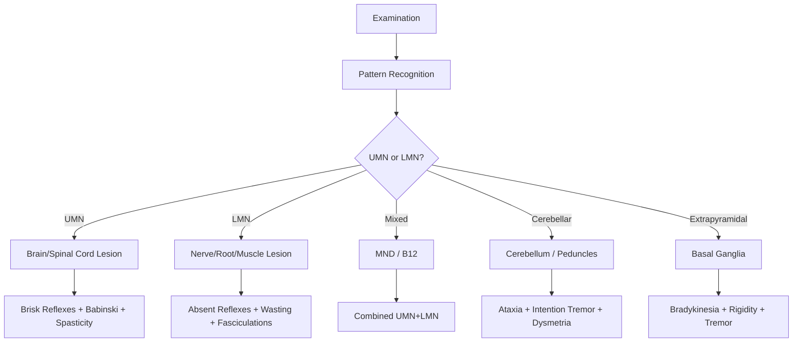
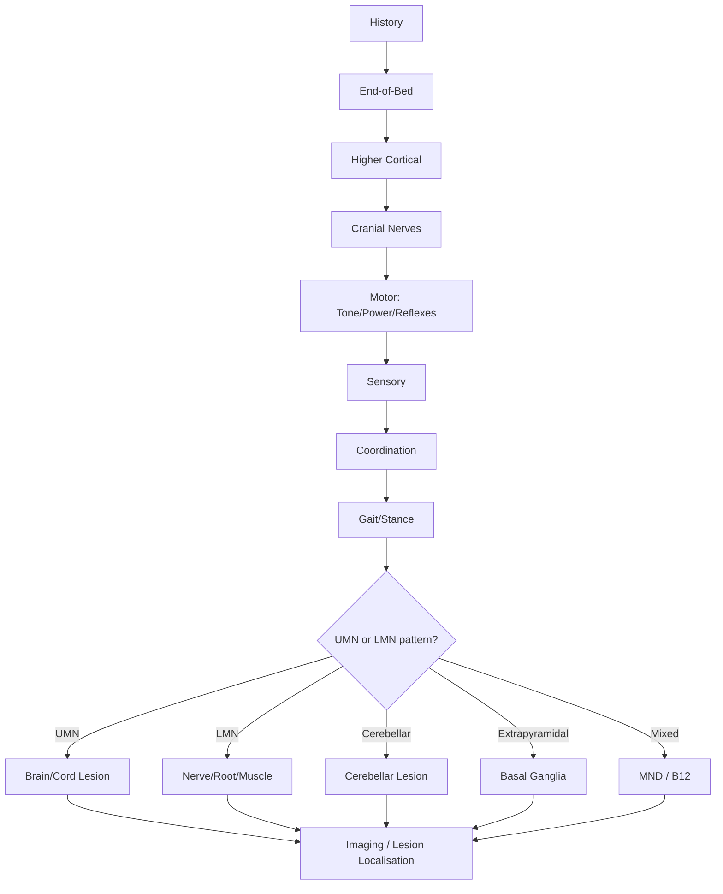
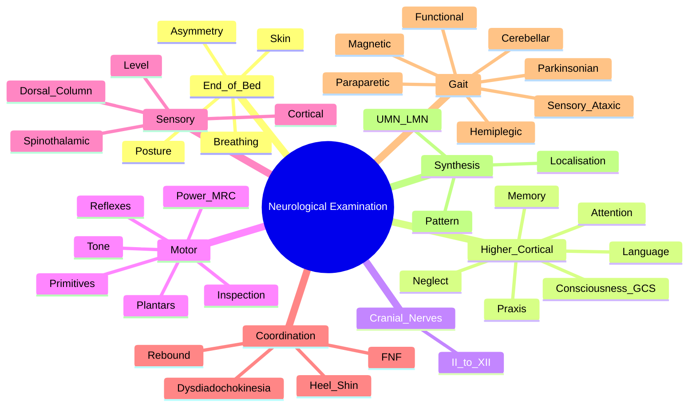
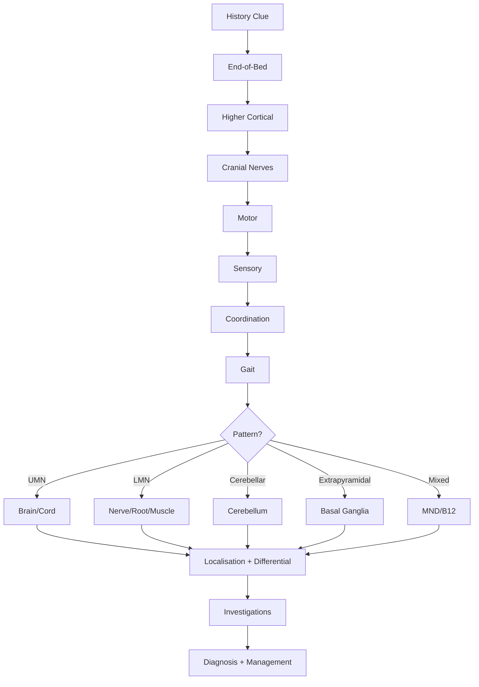

# Neurological Examination

> [!tip] **Systematic approach = localise the lesion.** Examine: Higher cortical function → Cranial nerves → Motor (tone, power, reflexes) → Sensory → Coordination → Gait/Stance. **Always compare sides** and look for **patterns** (UMN vs LMN, central vs peripheral, symmetrical vs asymmetrical).

> [!tip] **PACES Station 2 / 4 (~6–8 min focused):** End-of-bed inspection, then targeted exam based on history. Examiner wants a confident **synthesis** ("this is a left-sided UMN facial weakness + right hemiparesis + aphasia, suggesting a left MCA territory stroke").

## Learning Objectives
- [ ] Perform systematic neurological examination (PACES/MRCP format)
- [ ] Identify UMN vs LMN signs, central vs peripheral lesions
- [ ] Recognise common patterns (hemiparesis, paraparesis, mononeuropathy, polyneuropathy)
- [ ] Integrate higher cortical, cranial nerve, motor, sensory, and coordination findings
- [ ] Recognise functional overlay (positive signs)

---

## 1. Definition / Epidemiology / Classification

### Definition
A structured bedside assessment evaluating the integrity of the central and peripheral nervous system through inspection, palpation, tone, power, reflexes, coordination, sensation, cranial nerve, and higher cortical testing.

### Epidemiology / PACES Marks
- **PACES Station 2/4:** ~25–30 marks; systematic exam + correct interpretation = pass.
- **Common scenarios:** Stroke (asymmetric UMN), Bell's palsy (LMN CN VII), Parkinsonism (TRAP), MS (multifocal CNS), Peripheral neuropathy (glove-stocking LMN + reflexes).
- **Common pitfalls:** Missing subtle UMN signs (extensor plantar, brisk reflex), missing visual field defect, missing inattention, missing functional overlay.

### Classification
| Category | Components |
|----------|------------|
| **End-of-bed** | General appearance, posture, asymmetry, breathing pattern, dysmorphism, skin, devices |
| **Higher cortical** | Conscious level (GCS), orientation, attention, memory, language, praxis, neglect, executive |
| **Cranial nerves** | II–XII systematic (see Cranial Nerve Examination) |
| **Motor** | Inspection (wasting, fasciculations), tone (spasticity, rigidity, hypotonia), power (MRC 0–5), reflexes (deep, superficial, primitive), involuntary movements |
| **Sensory** | Spinothalamic (pain, temperature), dorsal column (proprioception, vibration, light touch), cortical (discrimination, stereognosis) |
| **Coordination** | Finger-nose, heel-shin, dysmetria, intention tremor, dysdiadochokinesia, rebound |
| **Gait/Stance** | Romberg, heel-toe, tandem, casual, arm swing, festination, magnetic |
| **Autonomic** | BP lying/standing, heart rate variability, sweating, bladder |

---

## 2. Aetiology / Pathophysiology

### Aetiology (Exam Pattern Recognition)
| Pattern | Likely Localisation | Common Causes |
|---------|---------------------|---------------|
| **Asymmetric UMN hemiparesis** | Contralateral corticospinal tract (above decussation) | Stroke, tumour, MS |
| **Symmetric UMN (paraparesis)** | Spinal cord | Compression, MS, myelitis, B12, anterior spinal artery |
| **Asymmetric LMN** | Multiple peripheral nerves/roots | Mononeuritis multiplex, polio, MND onset |
| **Symmetric LMN** | Polyneuropathy | GBS, CIDP, diabetic, B12, drugs |
| **Mixed UMN+LMN** | Motor neuron disease, B12 | MND, subacute combined degeneration |
| **Cerebellar** | Ipsilateral cerebellum/cerebellar peduncle | Stroke (PICA, AICA), tumour, MS, paraneoplastic, alcohol |
| **Parkinsonian** | Substantia nigra | PD, atypical (PSP, MSA, CBD) |
| **Dementia pattern** | Cortex/subcortex | AD, FTD, LBD, vascular |

### Pathophysiology

### Molecular/Genetic Basis (in exam findings)
- **Myotonia (percussion/grip):** Myotonic dystrophy (CTG repeat, AD), myotonia congenita (CLCN1)
- **Fasciculations:** LMN (MND, benign fasciculation syndrome)
- **Winging of scapula:** Long thoracic nerve (C5-C7), facioscapulohumeral muscular dystrophy (FSHD)
- **Gowers sign:** Proximal myopathy (DMD, sarcoglycanopathies, inflammatory)
- **Calf pseudohypertrophy:** DMD, Becker
- **Hammer toes + pes cavus:** CMT, Friedreich ataxia

---

## 3. Clinical Features (Examination Findings)

### End-of-Bed Inspection
- **Posture:** Decorticate (flexor, above red nucleus) vs decerebrate (extensor, below red nucleus); dystonic; parkinsonian
- **Asymmetry:** Wasting, fasciculations, contractures, deformity
- **Skin:** Café-au-lait (NF1, NF2), ash-leaf spots (tuberous sclerosis), port-wine stain (Sturge-Weber), livedo reticularis (Sneddon/APS)
- **Dysmorphism:** Low-set ears, hypertelorism, microcephaly (congenital, genetic)
- **Breathing:** Cheyne-Stokes (bilateral hemispheric/diencephalic), central neurogenic hyperventilation (midbrain), apneustic (pontine), ataxic (medullary)
- **Eye opening:** Eyes open (alert), to pain, none
- **Tubes/devices:** EVD, shunt, tracheostomy, NG tube, IV lines

### Higher Cortical Function
| Domain | Test |
|--------|------|
| **Consciousness** | GCS (Eye 1–4, Verbal 1–5, Motor 1–6); AVPU; FOUR score |
| **Orientation** | Time, place, person |
| **Attention** | Serial 7s, months backward, digit span |
| **Memory** | Anterograde: name/address recall at 5 min; Retrograde: past events |
| **Language** | Spontaneous speech, comprehension, naming, repetition, reading, writing (Boston/WAB) |
| **Praxis** | "Show me how to wave, brush teeth, use a hammer" (ideomotor) |
| **Neglect** | Line bisection, clock drawing, sensory extinction (double simultaneous) |
| **Executive** | Verbal fluency (animals in 1 min), trail-making, Luria 3-step |
| **Visuospatial** | Clock drawing, pentagon copy (MMSE/MoCA) |

### Motor Examination
| Component | UMN Signs | LMN Signs |
|-----------|-----------|-----------|
| **Tone** | Spasticity (velocity-dependent, "clasp-knife"), clonus, ↑ | Hypotonia, flaccid |
| **Wasting** | Disuse (mild, late) | Marked, early |
| **Fasciculations** | Absent | Present (LMN, MND) |
| **Power** | Pyramimal distribution (extensors UE, flexors LE) | According to nerve/root/myotome |
| **Reflexes** | Brisk, ± spread | Absent/depressed |
| **Plantar** | Extensor (Babinski) | Flexor/absent |
| **Clonus** | Present (ankle, knee) | Absent |
| **Spasm** | Spasticity | Cramps, contractures |

### MRC Power Grading
- **0** No contraction
- **1** Flicker/trace
- **2** Active movement with gravity eliminated
- **3** Active movement against gravity
- **4** Active movement against resistance (4−, 4, 4+)
- **5** Normal power

### Reflexes (Grading)
- **0** Absent
- **+** Depressed
- **++** Normal
- **+++** Brisk
- **++++** Brisk with clonus

| Reflex | Root | Site |
|--------|------|------|
| Biceps | C5-C6 | Elbow |
| Supinator | C5-C6 | Forearm |
| Triceps | C7 | Elbow |
| Finger (Hoffmann) | C8-T1 (UMN sign) | Flick distal phalanx |
| Knee (patellar) | L3-L4 | Knee |
| Ankle (Achilles) | S1 | Ankle |
| Plantar | L5-S1 | Sole (normal = flexor) |

**Primitive reflexes (frontal release signs):** Glabellar tap, palmomental, snout, grasp, root, suck — significant in adults with frontal lobe disease (dementia, FTD, NPH).

### Sensory Examination
| Modality | Tract | Test |
|----------|-------|------|
| **Light touch** | Both | Cotton wool |
| **Pain (pinprick)** | Spinothalamic | Neuro-tip/pin |
| **Temperature** | Spinothalamic | Hot/cold tubes |
| **Vibration** | Dorsal column | 128 Hz tuning fork (toe > finger; absent > toe normal = peripheral) |
| **Proprioception** | Dorsal column | Big toe up/down (smallest movement) |
| **Two-point discrimination** | Cortical | Caliper, finger |
| **Stereognosis** | Cortical | Identify coin/pen in hand (eyes closed) |
| **Graphesthesia** | Cortical | Number drawn on palm |
| **Tactile extinction** | Parietal | Double simultaneous (patient ignores one side) |

**Sensory level:** Mark on trunk; in spinal cord lesion = ~2 segments below lesion; helpful in cord compression, MS, transverse myelitis.

### Coordination
| Test | Limb | Cerebellar Sign |
|------|------|----------------|
| Finger-nose-finger | UE | Dysmetria, intention tremor, past-pointing |
| Heel-shin | LE | Ataxic (wavy line) |
| Dysdiadochokinesia | UE | Slow/impaired rapid alternating movements |
| Rebound (Stewart-Holmes) | UE | Overshoot (Holmes sign) |
| Pendular knee jerk | LE | Continue swinging |
| Dysarthria | Speech | Scanning, staccato |
| Nystagmus | Eyes | Gaze-evoked, direction-changing |

### Gait / Stance
| Gait | Pattern | Cause |
|------|---------|-------|
| **Hemiplegic (circumducting)** | Swings affected leg in arc | Stroke |
| **Paraparetic (scissoring)** | Stiff, adducted legs | Spinal cord |
| **Steppage (foot drop)** | High-stepping | LMN (peroneal/L5) |
| **Cerebellar (wide-based, ataxic)** | Staggering, falls to side | Cerebellar |
| **Sensory ataxic** | Stomping, worse eyes closed (Romberg +ve) | Dorsal column |
| **Parkinsonian** | Shuffling, festination, reduced arm swing | PD |
| **Magnetic** | Feet "stick" to floor | NPH, frontal |
| **Apraxic** | Cannot initiate, freezing | Bilateral frontal |
| **Antalgic** | Avoid weight-bearing | Pain |
| **Trendelenburg** | Pelvis drops to opposite side | Hip abductor (L5, gluteus medius) |
| **Functional** | Bizarre, distractible, knee buckling | FND |

### Romberg Test
- **Positive (worse with eyes closed):** Sensory ataxia (dorsal column: B12, syphilis, CIDP, sensory neuropathy)
- **Negative:** Cerebellar ataxia (wobbles with eyes open and closed equally)

---

## 4. Diagnostic Approach / Algorithm

### Diagnostic Reasoning Steps
1. **Recognise pattern** (UMN vs LMN vs cerebellar vs extrapyramidal)
2. **Localise** (level of neuroaxis)
3. **Side** (left/right/bilateral)
4. **Severity** (MRC, mRS, NIHSS, EDSS)
5. **Investigations** (imaging, neurophysiology, CSF, biopsy)

### Scoring Systems
| Scale | Use | Range |
|-------|-----|-------|
| **GCS** | Consciousness | 3–15 (Eye 1–4, Verbal 1–5, Motor 1–6) |
| **FOUR score** | Consciousness (intubated) | 0–16 |
| **NIHSS** | Stroke | 0–42 |
| **mRS** | Stroke/disability | 0–6 |
| **EDSS** | MS | 0–10 |
| **MRC** | Muscle power | 0–5 |
| **UPDRS** | Parkinson's | 0–199 |
| **MMSE / MoCA** | Cognition | MMSE 0–30 (≥24 normal); MoCA 0–30 (≥26 normal) |
| **Barthel / Rankin** | ADL | 0–20 / 0–6 |

---

## 5. Investigations (Driven by Pattern)

### First-Line
| Investigation | Indication |
|---------------|------------|
| **BM / Glucose** | Acute presentations |
| **FBC, U&E, Ca, Mg, LFT, CRP, ESR, glucose** | All |
| **TFT, B12, folate, ferritin** | Cognitive, neuropathy, myelopathy |
| **CT head** | Acute, trauma, haemorrhage, mass |
| **MRI brain** | MS, AD, posterior fossa, cord, white matter |
| **MRI spine** | Myelopathy, radiculopathy, MS |
| **CXR, ECG** | Cardioembolic, paraneoplastic |

### Second-Line
- **EEG:** Seizure, encephalopathy, NCSE
- **NCS/EMG:** Peripheral neuropathy, myopathy, NMJ, radiculopathy
- **LP:** MS, GBS, meningitis, encephalitis, NPH
- **Autoimmune antibodies:** NMDA-R, LGI1, CASPR2, MOG, AQP4
- **Genetic:** HD, CMT, DMD, mitochondrial

---

## 6. Differential Diagnosis (by Pattern)

| Pattern | Differential |
|---------|--------------|
| **Asymmetric UMN hemiparesis** | Stroke (ischaemic, haemorrhagic), tumour, MS, abscess |
| **Symmetric UMN paraparesis** | Cord compression, MS, B12, anterior spinal artery, hereditary spastic paraplegia |
| **Asymmetric LMN weakness** | Mononeuritis multiplex, MND, polio, radiculopathy |
| **Symmetric LMN weakness** | GBS, CIDP, diabetic, drug-induced, B12, critical illness |
| **Cerebellar syndrome** | Stroke (PICA, AICA, SCA), MS, tumour, paraneoplastic, alcohol, hereditary (SCA, FA) |
| **Parkinsonian syndrome** | PD, PSP, MSA, CBD, DLB, drug-induced, vascular |
| **Dementia** | AD, FTD, LBD, vascular, WKS, NPH, reversible causes (B12, thyroid, syphilis) |
| **Sensory level** | Cord compression, MS, transverse myelitis, anterior spinal artery |
| **Glove-stocking sensory loss** | Peripheral neuropathy (diabetic, B12, alcohol, CIDP, GBS) |
| **Cerebellar ataxia with neuropathy** | Paraneoplastic, alcohol, vitamin deficiency |

---

## 7. Management (Examination-Linked Communication)

### Reporting Examination Findings (PACES)
- **Structure:** End-of-bed → Higher cortical → CN → Motor (tone, power, reflexes) → Sensory → Coordination → Gait → Summary
- **Synthesis:** "Mr X has a left-sided upper motor neuron facial weakness (forehead sparing) with right hemiparesis affecting the arm more than the leg, expressive aphasia, and a right homonymous hemianopia. The pattern localises to the **left MCA territory**, most likely an ischaemic stroke."

### Documenting Severity
- Always state: **GCS, NIHSS, mRS, MMSE/MoCA, MRC grade, mRS, EDSS** (where applicable)
- Functional impact: ADL (Barthel), driving, work
- Red flags: New-onset, deteriorating, asymmetric, brainstem signs

### Functional Overlay Recognition (Positive Signs)
| Sign | Description |
|------|-------------|
| **Hoover** | Hip extension weakness (organic) abolished by contralateral hip flexion (functional) |
| **Tremor entrainment** | Tremor adopts frequency of contralateral movement |
| **Give-way weakness** | Sudden collapse with no anatomical pattern |
| **Co-contraction** | Simultaneous agonist/antagonist activation |
| **Inconsistency** | Cannot walk but can stand on toes; cannot flex hip but can sit up |
| **Distractibility** | Tremor/abnormal movement stops with concentration on other task |
| **Wasted weak limb** | Reflexes preserved (no LMN pattern) |

---

## 8. Drug / Comorbidity Cautions (Exam Interpretation)

| Finding | Drug / Cause | Recognise |
|---------|--------------|-----------|
| Parkinsonism | Antipsychotics, metoclopramide, MPTP | Symmetric, less tremor, often reversible |
| Ataxia | Anticonvulsants (PHT, CBZ, BDZ), alcohol, lithium, methotrexate | Drug levels, temporal relation |
| Peripheral neuropathy | Chemotherapy (vincristine, cisplatin, taxanes), metronidazole, isoniazid, nitrofurantoin, amiodarone, statins, alcohol | Cumulative dose, B12, diabetes |
| Myopathy | Statins, steroids, colchicine, alcohol, D-penicillamine, hydroxychloroquine | CK, EMG, drug holiday |
| Myasthenia | Penicillamine, magnesium, fluoroquinolones, immune checkpoint inhibitors | Tensilon, antibody, AChR |
| Cognitive decline | Anticholinergics, benzodiazepines, anticonvulsants, opioids, chemotherapy | STOPP/START, drug review |
| Tremor | Lithium, valproate, salbutamol, levothyroxine, caffeine, alcohol withdrawal | Withdrawal states, drug level |

---

## 9. Procedures: Examination Practical Skills

### Standard PACES Sequence
1. **Wash hands, introduce, position patient (45°), expose appropriately**
2. **End-of-bed:** General appearance, asymmetry, breathing
3. **Higher cortical:** Orientation, attention (months backward), memory (address recall), language (naming, repetition, comprehension), praxis, neglect
4. **Cranial nerves:** CN II (acuity, fields, fundi, pupils), III/IV/VI (eye movements, nystagmus), V/VII (sensation, power, corneal, facial), VIII (hearing, Rinne/Weber), IX/X (palate, gag), XI (SCM/trapezius), XII (tongue)
5. **Motor:** Inspection (wasting, fasciculations, deformity), tone (rigidity, spasticity), power (MRC), reflexes (deep, plantar, primitive)
6. **Sensory:** Spinothalamic, dorsal column, cortical; **map** any level
7. **Coordination:** Finger-nose, heel-shin, dysdiadochokinesia, rebound
8. **Gait:** Casual, heel-toe, Romberg, tandem, on toes/heels
9. **Stand, thank patient, summarise findings, suggest differentials**

### Communication During Exam
- **Explain** what you are doing: "I'm going to test the strength in your arms"
- **Watch** for pain inhibition vs true weakness
- **Compare sides** systematically
- **End with a summary** of pattern and localisation

---

## 10. Complications of Incomplete Examination
| Missed Feature | Consequence |
|----------------|-------------|
| **Visual field defect** | Missed homonymous hemianopia (stroke) |
| **Aphasia** | Misinterpreted as confusion |
| **Extensor plantar** | Missed UMN sign (cord lesion) |
| **Fasciculations** | Missed MND |
| **Wasting** | Missed LMN lesion |
| **Sensory level** | Missed cord compression |
| **Neglect** | Missed right parietal stroke |
| **Primitive reflexes** | Missed frontal/dementia |
| **Gait** | Missed NPH, cerebellar, parkinsonian |
| **Functional overlay** | Missed psychological factor or coexistent organic disease |

---

## 11. Red Flags / Emergencies
| Red Flag | Action |
|----------|--------|
| **GCS ≤8 / Falling** | Airway protection, urgent CT |
| **Asymmetric pupils / new CN III palsy** | Uncal herniation, PCA aneurysm |
| **Sudden focal deficit** | Stroke pathway, immediate CT |
| **Sensory level with cord signs** | Emergency MRI spine |
| **Bilateral leg weakness + sphincter loss** | Cauda equina / cord compression |
| **Cushing's triad** | Raised ICP — urgent CT ± neurosurgery |
| **New confusion + fever + rash** | Meningococcal meningitis |
| **Status epilepticus** | Time-targeted algorithm |
| **Suspected NCSE** | Continuous EEG |
| **Cervical cord lesion + respiratory failure** | ICU, spinal precautions |

---

## 12. Prognosis
| Factor | Good Prognosis | Poor Prognosis |
|--------|----------------|----------------|
| **Pattern** | Reversible metabolic/toxic | Neurodegenerative, malignancy |
| **Severity at presentation** | GCS >13, NIHSS <5 | GCS ≤8, NIHSS >15 |
| **Time-to-treatment** | Rapid (stroke, cord compression) | Delayed |
| **Comorbidities** | Few | Multiple |
| **Age** | Young | Elderly with frailty |
| **Rehabilitation potential** | Good baseline, support | Cognitive, social, mobility barriers |

- **Examination quality** directly informs prognosis and management.
- **Serial exams** (stroke units, ICU) detect deterioration.
- **Functional overlay** does not preclude recovery but requires MDT approach.

---

## 13. Topic Correlation
| Related Topic | Key Overlap |
|---------------|-------------|
| **Neurological History Taking** | Exam validates localisation |
| **Cranial Nerve Examination** | Specific subset of full exam |
| **Motor System Examination** | UMN vs LMN signs |
| **Sensory System Examination** | Modality and level mapping |
| **Coordination & Gait Examination** | Cerebellar/ataxia |
| **Higher Cortical Function** | MMSE/MoCA components |
| **Anatomical Localisation** | Translates findings to neuroanatomy |

---

## 14. Special Situations
| Situation | Consideration |
|-----------|---------------|
| **Pregnancy** | Eclampsia, CVST, normal physiological oedema; informed consent |
| **Paediatric** | Modified sequence; observe play; fundi last |
| **Elderly** | Multiple comorbidities, fatigue, polypharmacy |
| **Confused / Acute** | AMPLEx collateral history, basic GCS, gross motor |
| **Intubated / ICU** | FOUR score, motor response, pupillary, brainstem reflexes |
| **Bed-bound** | Limited gait; emphasise motor, sensory at bedside |
| **Functional overlay suspected** | Be respectful, positive signs, do not dismiss |
| **Learning disability** | Adapted sequence, carer present |
| **Non-English** | Interpreter; nonverbal cues (asymmetry, eye movements) |

---

## FCPS/MRCP High-Yield Summary
| Category | Key Points |
|----------|------------|
| **Definition** | Systematic bedside assessment to localise neurological disease |
| **Order** | End-of-bed → Higher cortical → CN → Motor → Sensory → Coordination → Gait |
| **UMN signs** | Spasticity, brisk reflexes, Babinski, clonus, no wasting/fasciculations |
| **LMN signs** | Wasting, fasciculations, hypotonia, absent reflexes |
| **MRC grading** | 0 = no contraction; 5 = normal power |
| **Reflexes** | Biceps C5-6; Triceps C7; Knee L3-4; Ankle S1 |
| **Sensory** | Spinothalamic (pain, temp); Dorsal column (vibration, proprioception); Cortical (stereognosis, 2PD) |
| **Gait** | Hemiplegic, paraparetic, cerebellar, sensory ataxic, parkinsonian, magnetic, functional |
| **Romberg** | +ve eyes closed = sensory ataxia; cerebellar = wobbles equally with eyes open/closed |
| **Scoring** | GCS, NIHSS, mRS, EDSS, MMSE/MoCA, UPDRS |
| **Functional overlay** | Hoover, tremor entrainment, give-way, inconsistency |
| **Viva pearls** | Always summarise with localisation; UMN/LMN pattern recognition |

---

## Viva Questions (PACES/FCPS Style)
1. **Q:** Describe the systematic neurological examination. **A:** End-of-bed inspection → Higher cortical (consciousness, orientation, attention, memory, language, praxis, neglect) → Cranial nerves II–XII → Motor (inspection, tone, power, reflexes, plantars, primitive) → Sensory (spinothalamic, dorsal column, cortical) → Coordination (FNF, heel-shin, dysdiadochokinesia) → Gait/Stance (casual, heel-toe, Romberg, tandem).
2. **Q:** What are the UMN signs? **A:** Spasticity (velocity-dependent, "clasp-knife"), brisk reflexes with spread, extensor plantar (Babinski), clonus (ankle, knee), no wasting/fasciculations, pseudo-bulbar affect.
3. **Q:** What are the LMN signs? **A:** Wasting, fasciculations, hypotonia, depressed/absent reflexes, flexor or absent plantar, weakness in myotomal/nerve distribution.
4. **Q:** How do you differentiate cerebellar from sensory ataxia? **A:** Cerebellar: wide-based, present with eyes open AND closed (Romberg negative), intention tremor, dysmetria, dysdiadochokinesia, scanning speech. Sensory: high-stepping, worse with eyes closed (Romberg positive), no cerebellar signs, often associated with dorsal column loss.
5. **Q:** What is Romberg's test and how do you interpret it? **A:** Patient stands with feet together, eyes open then closed. Positive (sway/fall with eyes closed) = sensory ataxia (dorsal column). Wobbles equally with eyes open and closed = cerebellar ataxia.
6. **Q:** Name 5 functional overlay signs. **A:** Hoover sign (hip extension weakness abolished by contralateral flexion), tremor entrainment, give-way weakness, co-contraction, distractibility, inconsistency (e.g., cannot walk but normal strength on bed).
7. **Q:** How do you differentiate Bell's palsy from a stroke affecting the face? **A:** Bell's palsy: LMN pattern (forehead involved, complete hemifacial weakness, no other signs). Stroke (UMN): forehead sparing, often with hemiparesis, aphasia, or other cortical signs.
8. **Q:** What primitive reflexes do you test? **A:** Glabellar tap, palmomental, snout, grasp, root, suck — frontal release signs, significant in adults with frontal lobe disease (dementia, FTD, NPH).
9. **Q:** How do you assess neglect? **A:** Line bisection (deviates to right in right neglect), clock drawing, sensory extinction (touch both arms simultaneously — patient ignores one side), visual extinction.
10. **Q:** How do you localise a UMN lesion from examination? **A:** Combined UMN pattern (e.g., hemiparesis + UMN facial + aphasia) = contralateral corticospinal tract above decussation. Isolated UMN leg = spinal cord or medial frontal (anterior cerebral). Bilateral UMN legs = cord. UMN arm + leg = contralateral internal capsule/cortex.
11. **Q:** How do you differentiate Parkinsonian tremor from essential tremor? **A:** Parkinsonian: 4–6 Hz, rest tremor, asymmetric, with rigidity/bradykinesia. Essential: 5–10 Hz, postural/action, bilateral, often alcohol-responsive, no bradykinesia.
12. **Q:** What is a sensory level and how do you map it? **A:** Sensory level = dermatomal boundary below which sensation is impaired. In cord lesions, level is ~2 segments above the lesion. Map with cotton wool, pin, vibration; mark on trunk; helpful in MS, cord compression, transverse myelitis.

---

## Common Confusions / Exam Traps
| Confusion | Clarification |
|-----------|---------------|
| **UMN vs LMN facial weakness** | UMN: forehead sparing (contralateral corticobulbar); LMN: forehead involved (ipsilateral CN VII) |
| **Spasticity vs rigidity** | Spasticity: velocity-dependent, "clasp-knife," UMN; Rigidity: constant throughout range, "lead-pipe," basal ganglia |
| **Rest vs postural tremor** | Rest: PD; Postural: essential, dystonic, physiological, drug-induced |
| **Cerebellar vs sensory ataxia** | Romberg: +ve in sensory, -ve in cerebellar |
| **Brisk reflexes in anxious patient** | Bilaterally brisk but flexor plantars and no other UMN signs |
| **Absent ankle jerks in elderly** | Normal variant if bilateral and no other findings |
| **Functional vs organic** | Positive signs (Hoover, entrainment), but do not miss organic disease; can coexist |
| **GCS in intubated patient** | Use FOUR score (eye, motor, brainstem, respiration) |
| **Wrist vs finger drop** | Wrist drop = radial nerve; finger drop = posterior interosseous/C7 |
| **MRC 4 vs 5** | 4 = movement against resistance but not full; 5 = full power |

---

## Mnemonics
1. **PITS** — **P**ower, **I**nspection, **T**one, **S**ensation (motor sequence; though reflexes + plantars come between tone and sensation)
2. **Lobes** — Frontal (motor, executive, personality), Parietal (sensation, neglect, praxis), Temporal (memory, language — Wernicke), Occipital (vision)
3. **UMN = Above, LMN = Below** — UMN lesion above the anterior horn cell (brain/cord); LMN at or below
4. **CN numbers → function:** I (smell), II (vision), III/IV/VI (EOM), V (face sensation/muscles), VII (face movement), VIII (hearing/balance), IX/X (swallow/voice), XI (SCM/trap), XII (tongue)
5. **Trendelenburg** — Pelvis drops to the side of the weak abductor (gluteus medius L5); Trendelenburg gait = hip drop to opposite side of the affected leg
6. **Romberg** — Eyes closed removes visual compensation; only sensory ataxia worsens
7. **Sensory levels** — T4 = nipple; T10 = umbilicus; L1 = inguinal; L4 = medial knee; S1 = lateral foot

---

## Mind Map

---

## Flowchart (Examination Algorithm)

---

## One-Page Revision Card
| **Topic** | **Neurological Examination** |
|-----------|------------------------------|
| **Sequence** | End-of-bed → Higher cortical → CN → Motor → Sensory → Coordination → Gait |
| **UMN signs** | Spasticity, brisk reflexes, Babinski, clonus, no wasting/fasciculations |
| **LMN signs** | Wasting, fasciculations, hypotonia, absent reflexes |
| **MRC** | 0 (none) → 5 (normal) |
| **Reflexes** | C5-6 biceps, C7 triceps, L3-4 knee, S1 ankle |
| **Sensory** | Spinothalamic (pain, temp), Dorsal column (vib, proprioception), Cortical (2PD, stereognosis) |
| **Cerebellar** | FNF, heel-shin, dysdiadochokinesia, rebound |
| **Gait** | Hemiplegic, paraparetic, cerebellar, sensory ataxic, parkinsonian, magnetic, functional |
| **Romberg** | +ve eyes closed = sensory; -ve = cerebellar |
| **Scoring** | GCS 3-15; NIHSS 0-42; mRS 0-6; MMSE 0-30; MoCA 0-30 |
| **Functional signs** | Hoover, tremor entrainment, give-way, distractibility |

---

## Spaced Repetition Trackers
### 24-Hour Recall Prompts
- [ ] Recite UMN vs LMN signs
- [ ] State reflex roots
- [ ] Differentiate cerebellar vs sensory ataxia
- [ ] Describe Romberg test
- [ ] List 5 functional overlay signs

### Revision Schedule
- [x] Day 1
- [ ] Day 3, 7, 15, 30, 90

---

## Must Know / Should Know / Nice to Know
### Must Know
- UMN vs LMN signs
- Reflex roots
- Cerebellar vs sensory ataxia
- GCS, MMSE/MoCA, NIHSS, mRS
- Cranial nerve screening
- 5 functional overlay signs
- Romberg interpretation

### Should Know
- MRC grading
- Primitive reflexes
- Trendelenburg, Romberg, heel-toe
- Sensory level mapping
- Drug-induced parkinsonism
- MND pattern (mixed UMN/LMN)

### Nice to Know
- Apraxia, neglect, alien limb
- Astereognosis, agraphaesthesia
- Akinetic mutism, locked-in
- Dysautonomia testing
- Specific cerebellar peduncle syndromes

---

## Exam Answer Modes
### Long Answer Skeleton
1. Systematic examination sequence
2. UMN vs LMN signs (pattern recognition)
3. Cranial nerve screening
4. Higher cortical function tests
5. Coordination and gait
6. Pattern → localisation → differential
7. Functional overlay recognition
8. Scoring systems

### Short Note Skeleton
- Sequence (end-of-bed → higher cortical → CN → motor → sensory → coordination → gait)
- UMN signs / LMN signs
- Reflex roots
- 3 functional overlay signs

### Viva One-Liners
- **UMN** → Spasticity, brisk reflexes, Babinski, clonus
- **LMN** → Wasting, fasciculations, hypotonia, absent reflexes
- **Cerebellar ataxia** → Romberg negative
- **Sensory ataxia** → Romberg positive
- **Bell's palsy** → LMN CN VII (forehead involved)

---

## Summary
The **systematic neurological examination** is the cornerstone of neurological practice. The sequence — **end-of-bed inspection → higher cortical function → cranial nerves II–XII → motor (inspection, tone, power, reflexes, plantars, primitives) → sensory (spinothalamic, dorsal column, cortical) → coordination → gait/stance** — establishes **anatomical localisation** and **pathophysiological pattern** (UMN vs LMN, cerebellar, extrapyramidal, mixed). **Always compare sides**, look for **patterns**, and end with a **synthesis statement**. **Functional overlay (Hoover, entrainment, give-way, distractibility)** must be recognised but does not exclude organic disease. **Scoring systems (GCS, NIHSS, mRS, MMSE, MoCA, UPDRS, EDSS, MRC)** standardise severity. The examination validates the **history-based localisation** and guides **targeted investigations and management**.

---

## MCQs (10)
1. **Question:** Which sign is pathognomonic of an upper motor neuron lesion?
   **Options:** A. Fasciculations B. Wasting C. Extensor plantar response (Babinski) D. Hypotonia
   **Answer:** C
   **Explanation:** Babinski sign (extensor plantar) is the cardinal sign of UMN lesion above the anterior horn cell. Fasciculations, wasting, and hypotonia are LMN signs.

2. **Question:** A patient has wide-based gait, present with eyes open and closed equally, with intention tremor and dysdiadochokinesia. Where is the lesion?
   **Options:** A. Dorsal column B. Cerebellum C. Vestibular system D. Frontal lobe
   **Answer:** B
   **Explanation:** Cerebellar ataxia: wide-based, present with eyes open AND closed (Romberg negative), intention tremor, dysdiadochokinesia, scanning speech.

3. **Question:** Which reflex corresponds to the C7 spinal root?
   **Options:** A. Biceps B. Triceps C. Knee jerk D. Ankle jerk
   **Answer:** B
   **Explanation:** Biceps = C5-C6; Triceps = C7; Knee = L3-L4; Ankle = S1.

4. **Question:** In Bell's palsy, which pattern of facial weakness is seen?
   **Options:** A. UMN pattern (forehead sparing) B. LMN pattern (forehead involved) C. Bilateral D. Hemilingual weakness
   **Answer:** B
   **Explanation:** Bell's palsy = LMN CN VII palsy → forehead AND lower face involved. Stroke (UMN) = forehead sparing due to bilateral cortical innervation of upper face.

5. **Question:** Romberg's test is positive (worse with eyes closed) in which condition?
   **Options:** A. Cerebellar ataxia B. Sensory ataxia (dorsal column) C. Vestibular disease D. Parkinson's disease
   **Answer:** B
   **Explanation:** Romberg positive = sensory ataxia (dorsal column — relies on visual compensation). Cerebellar ataxia wobbles equally with eyes open and closed.

6. **Question:** Which functional sign is positive when contralateral hip flexion abolishes apparent ipsilateral hip extension weakness?
   **Options:** A. Babinski B. Romberg C. Hoover D. Kernig
   **Answer:** C
   **Explanation:** Hoover sign: hip extension weakness (suggesting functional) is abolished by contralateral hip flexion (which normally inhibits ipsilateral extension). Positive Hoover = functional overlay.

7. **Question:** Primitive (frontal release) reflexes are significant in adults with which pathology?
   **Options:** A. Cerebellar disease B. Peripheral neuropathy C. Frontal lobe disease / dementia D. Brainstem stroke
   **Answer:** C
   **Explanation:** Primitive reflexes (glabellar, palmomental, snout, grasp, root, suck) re-emerge in adults with frontal lobe disease — dementia (especially FTD, NPH, vascular), or acute frontal lesions.

8. **Question:** Which finding is NOT part of the cardinal features of Parkinson's disease (TRAP)?
   **Options:** A. Tremor (rest) B. Rigidity C. Akinesia/bradykinesia D. Aphasia
   **Answer:** D
   **Explanation:** TRAP = Tremor (rest), Rigidity, Akinesia/bradykinesia, Postural instability. Aphasia is a cortical sign (dominant hemisphere stroke or FTD).

9. **Question:** A patient has wasting, fasciculations, hypotonia, and absent reflexes in the right hand, with brisk reflexes and an upgoing plantar in the right leg. Where is the lesion?
   **Options:** A. Right brachial plexus B. Right ulnar nerve C. Motor neuron disease D. Right C8 root
   **Answer:** C
   **Explanation:** Mixed UMN (right leg) and LMN (right hand) signs in the same limb = motor neuron disease (MND/ALS). Pure LMN = nerve/root; pure UMN = central.

10. **Question:** A patient with dorsal column loss has positive Romberg sign. What is the most likely site of lesion?
    **Options:** A. Cerebellar vermis B. Posterior column of spinal cord C. Spinothalamic tract D. Corticospinal tract
    **Answer:** B
    **Explanation:** Dorsal column = vibration, proprioception, light touch. Loss → sensory ataxia, positive Romberg. Cerebellar = negative Romberg. Spinothalamic = pain/temp (negative Romberg). Corticospinal = motor (UMN signs).

---

## SBA Questions (10)
1. **Scenario:** A 65-year-old man has right-sided facial weakness affecting the forehead, inability to close the right eye, and loss of taste over the right anterior tongue. What is the most likely diagnosis?
   **Options:** A. Left MCA stroke B. Right Bell's palsy (LMN CN VII) C. Right pontine stroke D. Trigeminal neuralgia
   **Answer:** B
   **Explanation:** LMN CN VII palsy (forehead involved, eye closure affected, +/- taste, +/- hyperacusis, +/- lacrimation) = Bell's palsy. UMN (left MCA stroke) = forehead sparing.

2. **Scenario:** A 40-year-old woman has progressive bilateral leg weakness, brisk knee reflexes, absent ankle reflexes, and a sensory level at T10. What is the most likely diagnosis?
   **Options:** A. GBS B. Cord compression at T8 C. Cauda equina D. Peripheral neuropathy
   **Answer:** B
   **Explanation:** Mixed UMN (brisk knee) and LMN (absent ankle) signs with a sensory level = spinal cord compression. Sensory level = cord (cauda equina has no UMN, no level). GBS: ascending, areflexic, no level.

3. **Scenario:** A 70-year-old man has bilateral resting tremor, rigidity, bradykinesia, and postural instability. He is on haloperidol. What is the most likely cause?
   **Options:** A. Idiopathic Parkinson's disease B. Drug-induced parkinsonism C. Progressive supranuclear palsy D. Essential tremor
   **Answer:** B
   **Explanation:** Antipsychotic (haloperidol) is a common cause of drug-induced parkinsonism (D2 blockade). Often symmetric, less tremor, reversible on stopping drug. PD = asymmetric, with non-drug history.

4. **Scenario:** A 30-year-old has progressive gait ataxia, dysarthria, nystagmus, and a family history of similar symptoms in the maternal grandmother. What is the most likely inheritance pattern?
   **Options:** A. Autosomal dominant B. Autosomal recessive C. X-linked D. Mitochondrial
   **Answer:** D
   **Explanation:** Maternal-only transmission (grandmother → mother → patient), multi-system (cerebellum, brainstem), and progressive ataxia = mitochondrial inheritance (e.g., MELAS, MERFF, NARP, Friedreich is AR, not maternal).

5. **Scenario:** A 55-year-old man with new-onset left hemiparesis has preserved sensation, normal reflexes, normal coordination, and no cranial nerve deficit. MRI is normal. Which sign most supports functional weakness?
   **Options:** A. Brisk left reflexes B. Left extensor plantar C. Right Hoover sign (extension preserved) D. Left cerebellar sign
   **Answer:** C
   **Explanation:** Hoover sign: contralateral right hip flexion abolishes left hip extension weakness = positive Hoover = functional overlay. Brisk reflexes/extensor plantar would suggest UMN organic.

6. **Scenario:** A 25-year-old has 2 days of ascending weakness and areflexia, with preserved sensation. LP shows protein 1.5 g/L and WCC 2. What is the diagnosis?
   **Options:** A. Multiple sclerosis B. Guillain-Barré syndrome (GBS) C. Transverse myelitis D. Cauda equina
   **Answer:** B
   **Explanation:** GBS: ascending weakness, areflexia, LP showing **albuminocytological dissociation** (↑protein, normal cells) at 1–2 weeks.

7. **Scenario:** A 50-year-old woman has bilateral facial weakness (forehead involved) with preserved limb power. She has had 2 prior episodes of transient vision loss. What is the diagnosis?
   **Options:** A. Bilateral Bell's palsy B. Myasthenia gravis C. Stroke D. Sarcoidosis
   **Answer:** B
   **Explanation:** Bilateral facial weakness with prior episodes of vision loss (ocular MG) = myasthenia gravis. Bilateral Bell's palsy is rare; myasthenia causes fatigable weakness, not true paralysis.

8. **Scenario:** A 60-year-old has unilateral rest tremor (right), bradykinesia, rigidity, and reduced right arm swing. What is the most likely diagnosis?
   **Options:** A. Essential tremor B. Idiopathic Parkinson's disease C. Progressive supranuclear palsy D. Functional tremor
   **Answer:** B
   **Explanation:** Asymmetric rest tremor + bradykinesia + rigidity + reduced arm swing = idiopathic PD (TRAP). Essential = bilateral postural; PSP = early falls, vertical gaze palsy; functional = distractible.

9. **Scenario:** A 45-year-old with chronic alcohol use has nystagmus, ophthalmoplegia, ataxia, and confusion. What is the most likely diagnosis?
   **Options:** A. Alcohol intoxication B. Wernicke's encephalopathy C. Hepatic encephalopathy D. Subdural haematoma
   **Answer:** B
   **Explanation:** Classic triad of Wernicke's encephalopathy: **ophthalmoplegia, ataxia, confusion** — give IV thiamine before glucose.

10. **Scenario:** A patient has 2 years of progressive memory loss, personality change, and language difficulties. Examination shows frontal release signs (grasp, snout). What is the diagnosis?
    **Options:** A. Alzheimer's disease B. Behavioural variant frontotemporal dementia C. Lewy body dementia D. Normal pressure hydrocephalus
    **Answer:** B
    **Explanation:** Early personality change, disinhibition, language, with primitive reflexes = behavioural variant FTD. AD: memory predominant. LBD: parkinsonism, hallucinations. NPH: triad of dementia, gait, incontinence.

---

## Flashcards
- **Q:** UMN signs?
  **A:** Spasticity, brisk reflexes, Babinski, clonus, no wasting/fasciculations
- **Q:** LMN signs?
  **A:** Wasting, fasciculations, hypotonia, absent reflexes
- **Q:** Reflex roots?
  **A:** Biceps C5-6; Triceps C7; Knee L3-4; Ankle S1
- **Q:** Cerebellar vs sensory ataxia on Romberg?
  **A:** Cerebellar: -ve (wobbles with eyes open too); Sensory: +ve (worse with eyes closed)
- **Q:** MRC 0–5?
  **A:** 0 none, 1 flicker, 2 anti-gravity eliminated, 3 anti-gravity, 4 against resistance, 5 normal
- **Q:** TRAP for Parkinson's?
  **A:** Tremor (rest), Rigidity, Akinesia, Postural instability
- **Q:** Functional overlay signs?
  **A:** Hoover, tremor entrainment, give-way, co-contraction, distractibility, inconsistency
- **Q:** Bell's palsy vs stroke facial weakness?
  **A:** Bell's: LMN (forehead involved); Stroke: UMN (forehead sparing)
- **Q:** MND pattern?
  **A:** Mixed UMN + LMN signs without sensory loss
- **Q:** Wernicke's triad?
  **A:** Ophthalmoplegia, ataxia, confusion (give thiamine before glucose)

---

## Answer Key with Explanations
### MCQs
1. **C** — Babinski (extensor plantar) = UMN sign
2. **B** — Cerebellar ataxia: wide-based, Romberg negative, intention tremor, dysdiadochokinesia
3. **B** — Triceps = C7
4. **B** — Bell's palsy = LMN CN VII (forehead involved)
5. **B** — Romberg +ve = sensory ataxia (dorsal column)
6. **C** — Hoover sign = functional overlay
7. **C** — Primitive reflexes re-emerge in frontal lobe disease / dementia
8. **D** — Aphasia not part of TRAP (cortical sign)
9. **C** — Mixed UMN + LMN = MND
10. **B** — Dorsal column = Romberg +ve

### SBAs
1. **B** — Bell's palsy = LMN CN VII (forehead involved, taste, hyperacusis)
2. **B** — Sensory level + mixed UMN/LMN = cord compression
3. **B** — Haloperidol-induced parkinsonism (D2 blockade)
4. **D** — Maternal-only + multi-system = mitochondrial
5. **C** — Hoover sign = functional overlay
6. **B** — GBS: ascending areflexia + albuminocytological dissociation
7. **B** — Myasthenia gravis (bilateral facial + ocular)
8. **B** — Asymmetric TRAP = idiopathic PD
9. **B** — Wernicke's: ophthalmoplegia, ataxia, confusion
10. **B** — Personality change + primitive reflexes = bvFTD

---

## Local Navigation
**Heading Hub:** [[01_Fundamentals_Examination/Fundamentals & Examination Hub]]
**Topic-Group Hub:** [[01_Fundamentals_Examination/Clinical Assessment Hub]]
**Chapter Hierarchy:** [[Davidson Chapter 25 - Neurology Hierarchy]]
**Chapter MOC:** [[Neurology MOC]]
**Drug Reference:** [[00_Index/Neurology Drug Reference]]
**Related Topics:** [[Neurological History Taking]], [[Cranial Nerve Examination]], [[Motor System Examination]], [[Sensory System Examination]], [[Coordination & Gait Examination]], [[Higher Cortical Function Assessment]]

## PasTest Scenario SBAs (Clinical Vignettes)

> **Auto-generated PasTest/Mediscope-style scenario SBAs** grounded in the authored source. Each scenario tests a real clinical fact (triad, specific sign, contraindication, trial, first-line Rx) extracted from the topic. *Source: Ch 27: Neurology & Stroke — Neurological Examination*

**Q1.** What is the most appropriate first-line therapy for Neurological Examination?

  - **A.** Structure: + Synthesis:
  - **B.** An advanced/surgical therapy reserved for refractory disease
  - **C.** Symptomatic treatment only, no disease-modifying therapy
  - **D.** Empiric broad-spectrum therapy without specific indication

  > **Answer: A** — Structure: + Synthesis:
  >
  > *Source:* ### Reporting Examination Findings (PACES)
- **Structure:** End-of-bed → Higher cortical → CN → Motor (tone, power, reflexes) → Sensory → Coordination → Gait → Summary
- **Synthesis:** "Mr X has a lef

