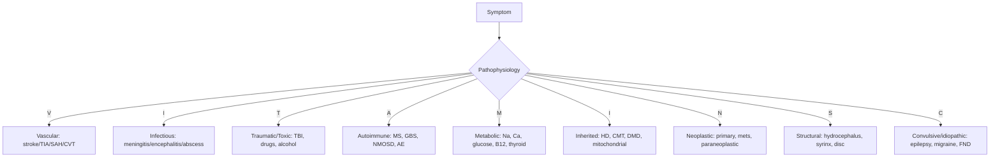
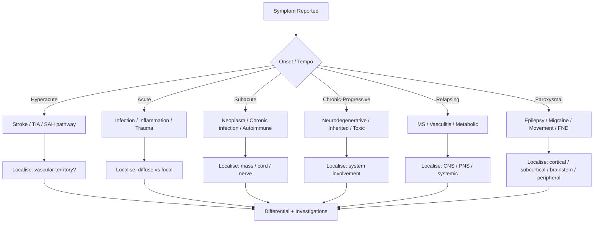
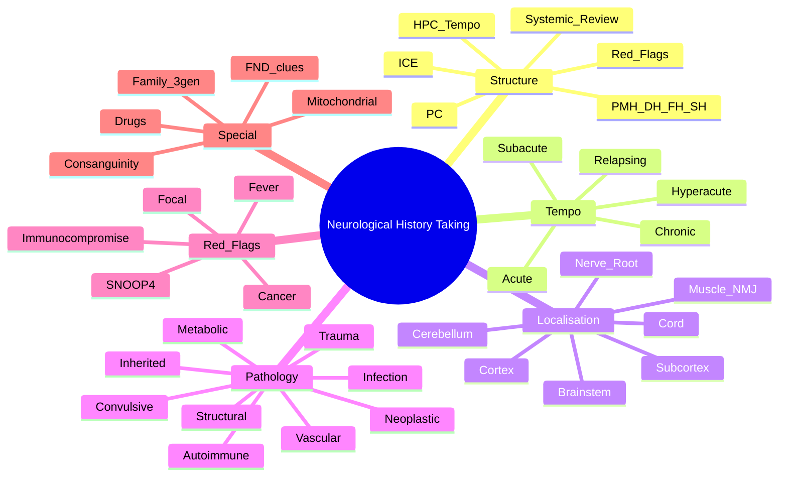
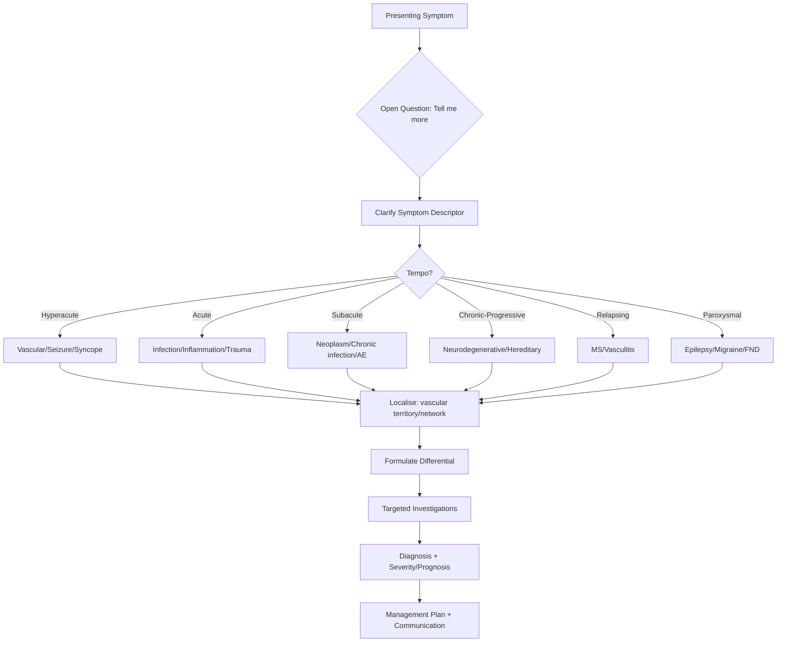

# Neurological History Taking

> [!tip] **The single most diagnostic step in neurology is the history** — it localises the lesion in 80–90% of cases before examination or imaging. Approach every symptom with: **Where is the lesion? What is the pathology? What is the pace?**

> [!tip] **PACES Framework:** Present Complaint → Associated symptoms → Chronology → Exacerbating/Relieving → Severity/Impact → Relevant systems review → Drug/Family/Social → Red flags.

## Learning Objectives
- [ ] Structure a neurological history to localise the lesion
- [ ] Differentiate key symptom descriptors (weakness vs fatigue, numbness vs tingling, dizziness vs vertigo)
- [ ] Identify red flags requiring urgent investigation
- [ ] Elicit relevant past medical, drug, family, and social history
- [ ] Apply PACES/FCPS history-taking framework

---

## 1. Definition / Epidemiology / Classification

### Definition
A structured patient interview that elicits the symptom characteristics, tempo, distribution, associated features, and contextual factors needed to anatomically localise and pathophysiologically classify a neurological complaint.

### Epidemiology / Setting
- **Outpatient neurology referrals:** ~30% headache, 15% epilepsy/syncope, 15% weakness/ neuropathy, 10% movement disorders, 10% cognitive, 10% MS/visual, 10% others.
- **PACES Station 2 (~20 min):** Structured history + focused examination; 60% mark on clinical synthesis.
- **FCPS Long Case:** 30–45 min focused history + 30 min examination; 2 examiners.

### Classification of Symptom Categories
| Category | Examples | Localisation value |
|----------|----------|--------------------|
| **Negative phenomena** | Weakness, numbness, loss of vision, deafness | Tissue loss / interruption of pathway |
| **Positive phenomena** | Paraesthesia, pain, spasm, tremor, flashing lights | Hyperexcitability / irritation |
| **Transient** | TIA, aura, seizure, syncope, migraine | Vascular / electrical / migrainous |
| **Progressive** | Neuropathy, dementia, tumour, degenerative | Cumulative structural / metabolic |
| **Relapsing** | MS, vasculitis, porphyria | Inflammatory / immune-mediated |
| **Paroxysmal** | Epilepsy, dyskinesia, TIA, migraine | Network dysfunction |

---

## 2. Aetiology / Pathophysiology

### Aetiology by Tempo (Mnemonic: **VITAMINS-C**)
| Tempo | Differential | Clues |
|-------|--------------|-------|
| **Hyperacute (sec–min)** | Stroke, TIA, seizure, syncope, migraine | Sudden onset, witness account |
| **Acute (hours–days)** | Infection (meningitis, encephalitis, abscess), inflammation (GBS, myelitis), trauma, metabolic | Fever, prodrome, sequential |
| **Subacute (days–weeks)** | Tumour, chronic infection (TB, HIV, Lyme), autoimmune encephalitis, vasculitis | Insidious, progressive |
| **Chronic (months–years)** | Neurodegenerative (PD, AD, ALS), hereditary (HMSN, HD), chronic demyelinating | Family history, gradual decline |
| **Relapsing-remitting** | MS, NMOSD, porphyria, Behçet, lupus | Discrete episodes with partial/full recovery |

### Pathophysiological Categories

### Molecular/Genetic Basis (in history-taking)
- **Family pedigree (3 generations):** AD (HD, CMT1A, DMD carrier), AR (Friedreich, SMA), X-linked (DMD, Fragile X), Mitochondrial (MELAS, LHON, MERFF) — **maternal inheritance only**.
- **Consanguinity:** AR disorders (Friedreich, Wilson, NBIA, SMA).
- **Ethnicity:** Sickle cell (Black African), Tay-Sachs (Ashkenazi Jewish), NPC (Amish), Wilson (Indian/Eastern European).

---

## 3. Clinical Features (History Domain)

### History: Symptom Descriptors (FCPS/MRCP high-yield)
| Symptom | Distinguish |
|---------|-------------|
| **Weakness** | True motor loss vs fatigue (weakness + objective signs) vs pain inhibition vs functional |
| **Numbness** | Loss of sensation vs tingling vs heaviness — clarify laterality, level, modality, dissociation |
| **Dizziness** | **Vertigo** (room spinning, rotational) vs **Presyncope** (light-headed, fading vision) vs **Imbalance** (disequilibrium) vs **Non-specific** (often anxiety/medication) |
| **Diplopia** | Monocular (ocular) vs binocular (neuromuscular); horizontal vs vertical vs oblique; gaze-dependent; fatigable (MG) |
| **Headache** | Site, quality, severity (1–10), onset (thunderclap!), duration, frequency, aura, photophobia, triggers, red flags |
| **Visual loss** | Monocular (retinal/optic nerve/IAC) vs binocular (chiasmal/retrochiasmal/cortical); transient vs persistent; positive phenomena (fortification spectra, flashes) |
| **Speech** | **Dysarthria** (motor, articulation) vs **Aphasia** (language; Broca = non-fluent, Wernicke = fluent) vs **Dysphonia** (vocal cord) |
| **Seizure** | Aura, motor activity (tonic/clonic), automatisms, side, post-ictal (Todd's, confusion), duration, triggers (sleep, alcohol, photosensitivity) |
| **Tremor** | Rest (PD) vs postural (essential, dystonic) vs intention (cerebellar); frequency, side, alcohol responsiveness |
| **Cognitive** | Memory (episodic vs semantic), executive, language, visuospatial; insight preserved (AD) vs impaired (FTD); fluctuations (LBD) |

### Triggers & Patterns
- **Posture:** Orthostatic hypotension (autonomic); SUNCT (brief stabbing, unilateral); exertional (Chiari, SAH, cardiac)
- **Sleep:** Nocturnal epilepsy (frontal lobe, parasomnia mimics); RBD (Lewy body); cluster (alcohol)
- **Diet:** B12/folate (vegans, alcohol); Thiamine (alcohol, malnutrition); Gluten (coeliac ataxia)
- **Drugs:** Anticonvulsants (movement, cognitive), L-DOPA (dyskinesia), metronidazole (encephalopathy), recreational
- **Temperature:** Heat intolerance in MS (Uhthoff); Cold-induced (paramyotonia)
- **Menses/Pregnancy:** Migraine, MS relapse risk, chorea gravidarum, eclampsia

### Red Flags (SNOOP4 for Headache; Generalised for any Neuro Symptom)
| Red Flag | Significance |
|----------|--------------|
| **S**udden/Thunderclap (peak in <1 min) | SAH, CVST, RCVS, dissection, stroke |
| **S**ystemic signs (fever, weight loss, immunocompromise, cancer) | Infection, vasculitis, paraneoplastic |
| **N**eurological deficit (focal, confusion, seizures) | Stroke, mass, encephalitis |
| **O**nset >50 years (new headache) | Temporal arteritis, mass |
| **P**apilloedema | Raised ICP, mass, IIH, CVST |
| **P**ostural aggravation | Chiari, leak |
| **P**recipitated by Valsalva/cough/exertion | Posterior fossa lesion, raised ICP |
| **P**regnancy/postpartum | Eclampsia, CVST, pituitary apoplexy |
| **4th "P"** — Pattern change (new/different headache) | Secondary cause |

### Functional / Functional Neurological Disorder (FND) Clues
- Inconsistency, incongruity, Hoover sign, give-way weakness
- La belle indifférence (not sensitive, not specific)
- Hoover positive (extension weakness abolished by contralateral flexion)
- Tremor entrainment / distractibility
- Premorbid anxiety, depression, prior trauma
- **DO NOT** dismiss organic disease — FND can coexist.

---

## 4. Diagnostic Approach / Algorithm

### Diagnostic Reasoning
| Step | Question |
|------|----------|
| **1. What is the symptom?** | Define precisely (paraesthesia vs numbness; vertigo vs imbalance) |
| **2. Where is the lesion?** | Localise along neuro axis (muscle, NMJ, nerve, root, cord, brainstem, cerebellum, subcortex, cortex) |
| **3. What is the pathology?** | Vascular, infective, inflammatory, neoplastic, metabolic, degenerative |
| **4. What is the tempo?** | Acute/subacute/chronic; static/relapsing/progressive |
| **5. What test confirms?** | Imaging, neurophysiology, CSF, biopsy, genetic |

### Severity / Impact
- **mRS (modified Rankin Scale):** 0 (no symptoms) → 6 (dead)
- **NIHSS (stroke):** 0–42
- **EDSS (MS):** 0–10 pyramidal/cerebellar/brainstem/sensory/bowel/bladder/visual/cerebral
- **ADL/IADL, Karnofsky, Barthel Index:** Functional impact

---

## 5. Investigations (Driven by Localisation)

### First-Line
| Investigation | Indication | Expected Finding |
|---------------|------------|------------------|
| **BM / Glucose** | All acute presentations | Hypoglycaemia mimics stroke/seizure |
| **ECG** | Stroke, syncope, palpitations | AF, QT, Brugada, WPW |
| **BP, SpO2, Temp** | All | Triage severity, autonomic |
| **FBC, U&E, Ca, Mg, Glucose, LFT, CRP, ESR** | All | Infection, metabolic, vasculitis (ESR), GCA (ESR/CRP) |

### Neuroimaging
| Modality | Indication |
|----------|------------|
| **CT Head (non-contrast)** | Acute stroke, trauma, haemorrhage; excludes mass before LP |
| **CT Angio (aorta-to-vertex)** | Suspected dissection, large vessel occlusion |
| **MRI Brain** | MS, AD, posterior fossa, cord, FND positive signs |
| **MRI Spine** | Myelopathy, radiculopathy, cauda equina, MS |
| **DSA** | Aneurysm, vasculitis (when non-invasive equivocal) |

### Neurophysiology
- **EEG:** Seizure, encephalopathy, NCSE, presurgical
- **NCS/EMG:** Peripheral neuropathy, myopathy, NMJ, radiculopathy
- **EPs (VEP, SEP, BAEP):** MS workup, demyelination

### CSF
- **Always** if fever, immunocompromised, unexplained encephalopathy, MS workup, suspected SAH (CT negative)

---

## 6. Differential Diagnosis

| Differential | Distinguishing Features | Key Test |
|--------------|------------------------|----------|
| **Functional Neurological Disorder (FND)** | Inconsistency, Hoover sign, distractibility, premorbid stressors | Clinical, positive signs |
| **Migraine (with/without aura)** | Photophobia, throbbing, N&V, ≥30 min, triggers | Clinical; red flag screen |
| **Tension-type headache** | Bilateral, pressing, mild, no N&V | Clinical |
| **Cluster headache** | Unilateral peri-orbital, autonomic, circadian, restless | Clinical; trial of O2/subcutaneous triptan |
| **TIA vs Migraine aura** | TIA: sudden, negative, <1 h, vascular territory; Migraine: gradual, positive, longer | Imaging, risk stratification |
| **Epilepsy vs PNES vs syncope** | Tongue biting, incontinence, post-ictal (epilepsy); asynchrony, eyes closed (PNES); prodrome, brief (syncope) | Video-EEG, ECG/tilt |
| **Parkinsonism: PD vs atypical** | Asymmetric onset, levodopa response (PD); early falls, autonomic, vertical gaze (PSP/MSA) | DATscan, autonomic tests |
| **Peripheral vs central vertigo** | Peripheral: unidirectional nystagmus, deafness, tinnitus; Central: multidirectional, vertical, brainstem signs | HINTS exam, MRI |
| **Dementia vs delirium vs depression** | Dementia: progressive, insight; Delirium: acute, fluctuating attention; Pseudodementia (depression): recent onset, "I don't know" | MoCA, 4AT, AMTS, clock |

---

## 7. Management

### Communication & Empathic History
| Skill | Example |
|-------|---------|
| **Open question** | "Tell me what brought you in today" |
| **Closed question** | "Was the weakness on the right or left side?" |
| **Clarification** | "When you say dizzy, do you mean spinning or light-headed?" |
| **Empathy** | "I can see this has been very difficult for you" |
| **Summarising** | "So, to summarise, you have had…" |
| **ICE** | Ideas, Concerns, Expectations |
| **Signposting** | "I'd now like to ask about your past medical history" |

### Documentation (PACES)
1. **PC + HPC:** Onset, duration, character, severity, progression, triggers, relieving, associated
2. **Systemic review:** Headache, vision, speech, swallow, weakness, sensation, balance, bladder/bowel, sleep, mood, cognition
3. **PMH:** Diabetes, HTN, AF, hyperlipidaemia, cancer, HIV, autoimmune, psychiatric
4. **Drugs:** Anticonvulsants, anticoagulants, antipsychotics, chemotherapy, recreational
5. **Allergies**
6. **Family history:** Stroke, epilepsy, dementia, PD, MS, neurogenetic (3-generation pedigree)
7. **Social:** Occupation, alcohol, smoking, recreational, travel, pets, diet
8. **Functional impact:** ADL, work, driving, mood
9. **Red flags**
10. **Patient's ideas/concerns/expectations**

### Red Flag Escalation
- Same-day referral: suspected TIA, status epilepticus, cauda equina, GCA, SAH
- 2-week wait: suspected tumour, atypical Parkinson's
- Urgent: rapidly progressive dementia, autonomic failure, unexplained encephalopathy

---

## 8. Drug History Cautions (Relevant to Neurological Symptoms)

| Drug | Symptom | Recognition |
|------|---------|-------------|
| **Antipsychotics (typical)** | Acute dystonia, parkinsonism, NMS, TD | Months–years use; EPS, hyperthermia, rigidity |
| **Anticonvulsants (PHT, CBZ, VPA)** | Ataxia, cognitive, tremor, hyponatraemia (CBZ), hepatotoxicity (VPA) | Drug levels, LFTs |
| **Metronidazole** | Encephalopathy, cerebellar signs | MRI: dentate T2 hyperintensity |
| **Lithium** | Tremor, cerebellar, nephrogenic DI, thyroid | Levels, TFTs, U&E |
| **Statins** | Myalgia, myopathy, rare rhabdomyolysis | CK if symptoms |
| **Chemotherapy (vincristine, cisplatin, taxanes)** | Peripheral neuropathy | Cumulative dose |
| **Immune checkpoint inhibitors** | Autoimmune encephalitis, myasthenia, GBS | Clinical vigilance; ICI cohort |
| **5-FU, methotrexate** | PRES, stroke-like, encephalopathy | MRI, methotrexate levels |
| **Benzodiazepines (long-term)** | Cognitive decline, falls, dependence | Review, taper |
| **Anticholinergics (TCAs, antihistamines)** | Confusion, urinary retention, falls (elderly) | STOPP/START criteria |

---

## 9. Procedures: History-Linked Tools

- **Structured proforma** for PACES: 4 sections (PC, systemic review, PMH/FH/Social, ICE)
- **Mnemonic checklist** (LOC, weakness, numbness, vision, speech, swallow, balance, bladder, sleep, mood, cognition)
- **Family pedigree chart:** 3 generations, with affection status, age of onset, consanguinity

---

## 10. Complications of Missed/Suboptimal History

| Missed Feature | Consequence |
|----------------|-------------|
| **Temple/visual sx in GCA** | Irreversible blindness |
| **Thunderclap headache** | Missed SAH (re-bleed 30% within 24h) |
| **Antenatal symptoms** | Missed eclampsia/CVST |
| **Drug history** | Missed NMS, serotonin syndrome, withdrawal |
| **Family pedigree** | Missed HD, FTD, mitochondrial |
| **Functional overlay** | Unnecessary invasive workup |
| **Red flag omission** | Delayed tumour/CNS infection |
| **Driving disclosure** | Legal/insurance implications; DVLA reportable |

---

## 11. Red Flags / Emergencies

| Red Flag | Action |
|----------|--------|
| **Sudden severe headache** | Urgent CT → LP if negative |
| **Focal deficit <4.5 h** | Thrombolysis/thrombectomy pathway |
| **Sudden painless monocular vision loss** | Same-day ophthalmology/AMAU |
| **New seizure in adult** | Same-day assessment, driving |
| **Suspected meningitis/encephalitis** | **DO NOT wait for LP** — empirical antibiotics/acyclovir within 1 h |
| **Cord compression / cauda equina** | Emergency MRI + neurosurgical referral |
| **GCA (jaw claudication, scalp tenderness, vision)** | Urgent IV/oral steroids (do not wait for biopsy) |
| **NCSE** | Continuous EEG, IV ASM |
| **Status epilepticus** | Time-targeted algorithm (see Status Epilepticus note) |

---

## 12. Prognosis

| Factor | Good Prognosis | Poor Prognosis |
|--------|----------------|----------------|
| **Symptom tempo** | Hyperacute (treatable — stroke, TIA) | Progressive (degenerative, malignancy) |
| **Clarity of history** | Reliable witness, clear tempo | Vague, inconsistent (functional overlay) |
| **Localising value** | Specific syndrome (e.g., LMN only) | Multi-system (less localising) |
| **Patient factors** | Young, fit, no comorbidities | Elderly, comorbidities, cognitive impairment |
| **Early recognition** | TIA clinic reduces stroke 80% | Delayed presentation increases morbidity |

- **History quality** directly correlates with diagnostic accuracy (~80–90% in experienced clinicians).
- **Time-to-treatment** (stroke, meningitis, GCA, status epilepticus, cord compression) drives outcome.

---

## 13. Topic Correlation
| Related Topic | Key Overlap |
|---------------|-------------|
| **Neurological Examination** | Exam validates history-based localisation |
| **Cranial Nerve Examination** | Specific symptom-driven examination |
| **Anatomical Localisation** | Translates symptoms to neuroanatomy |
| **Higher Cortical Function** | Cognitive symptom screening |
| **Coma Assessment** | Acute history from witnesses |
| **Status Epilepticus** | Witness history critical for diagnosis |

---

## 14. Special Situations
| Situation | Consideration |
|-----------|---------------|
| **Pregnancy** | Eclampsia, CVST, Bell's palsy, carpal tunnel (3rd trimester) |
| **Paediatric** | Developmental history, perinatal, consanguinity, vaccination; non-verbal cues |
| **Elderly** | Polypharmacy, atypical presentations, cognitive impairment, falls |
| **Learning disability** | Use carer history, easy-read material, capacity assessment |
| **Non-English speaker** | Professional interpreter (not family) |
| **Acute/Confused patient** | Witness + collateral + ambulance record; AMPLE history |
| **Driving (DVLA)** | Specific conditions reportable; counsel about driving restrictions |
| **Occupational** | Job-specific symptoms (e.g., manganese, solvents) |
| **Medico-legal** | Document carefully; functional overlay considered |

---

## FCPS/MRCP High-Yield Summary
| Category | Key Points |
|----------|------------|
| **Definition** | Structured interview to localise and classify neurological disease |
| **Framework** | PC → Tempo → Localisation → Pathology → Investigations |
| **Symptom clarity** | Vertigo vs dizziness, weakness vs fatigue, dysarthria vs aphasia |
| **Red flags** | SNOOP4 (headache); general: focal deficit, fever, immunocompromise, cancer |
| **Tempo categories** | VITAMINS-C: Vascular, Infection, Trauma, Autoimmune, Metabolic, Inherited, Neoplastic, Structural, Convulsive/Idiopathic |
| **Family history** | 3-gen pedigree; maternal-only = mitochondrial; consanguinity = AR |
| **Drug history** | Antipsychotics (NMS/EPS), anticonvulsants, chemo, antibiotics (metronidazole encephalopathy) |
| **Functional overlay** | Recognise; do not miss organic disease |
| **DVLA** | 1-year seizure-free; TIA 1 month; stroke 1 month; specific conditions reportable |
| **Viva pearls** | Always start with tempo; never miss the witness account |

---

## Viva Questions (PACES/FCPS Style)

1. **Q:** How do you structure a neurological history? **A:** PC with symptom clarification (what, where, when, character, severity, radiation, timing, aggravating/relieving) → associated symptoms (systemic review) → PMH, drugs, allergies → family history (3-gen pedigree) → social history (alcohol, smoking, occupation, travel) → ICE → red flags.
2. **Q:** How do you differentiate vertigo, presyncope, and disequilibrium? **A:** Vertigo = room spinning (vestibular); Presyncope = light-headed with vision fading (cardiovascular, orthostatic); Disequilibrium = imbalance, no spinning (sensory/cerebellar/brainstem).
3. **Q:** What are the SNOOP4 red flags for headache? **A:** **S**udden/thunderclap, **S**ystemic signs (fever, weight loss, cancer), **N**eurological deficit, **O**nset >50, **P**apilloedema, **P**ostural, **P**recipitated by Valsalva, **P**regnancy/postpartum, **P**attern change.
4. **Q:** How do you differentiate migraine aura from TIA? **A:** Migraine aura = gradual build-up (5–20 min), positive phenomena (fortification spectra, scintillating scotoma), lasts <60 min, associated with headache. TIA = sudden, negative phenomena (loss), <60 min, vascular territory, vascular risk factors.
5. **Q:** When is a 3-generation pedigree essential? **A:** Suspected hereditary disease (HD, CMT, FTD, SCA, mitochondrial); check for AD/AR/XL/maternal (mitochondrial) pattern; consanguinity suggests AR.
6. **Q:** How do you recognise FND? **A:** Inconsistency/incongruity with examination; positive signs (Hoover, tremor entrainment); premorbid stressors; "rule in" not "rule out"; functional overlay can coexist with organic disease.
7. **Q:** What is the differential of "thunderclap headache"? **A:** SAH (most important, 11%), CVST, RCVS, arterial dissection, posterior reversible encephalopathy syndrome (PRES), hypertensive emergency, pituitary apoplexy, third ventricular colloid cyst, meningitis (rare).
8. **Q:** What are the DVLA driving rules after first seizure/epilepsy? **A:** Group 1 (car/motorcycle): **1 year seizure-free** off ASM (or only nocturnal seizures); Group 2 (HGV/bus): **10 years off ASM** without seizures.
9. **Q:** What is the relevance of consanguinity in neurological history? **A:** Increases risk of autosomal recessive disorders: Friedreich ataxia, Wilson disease, NBIA, SMA, certain leukodystrophies, metabolic encephalopathies.
10. **Q:** What features suggest mitochondrial inheritance? **A:** Maternal-only transmission (no male-to-offspring), variable expressivity, multi-system (CNS, muscle, eye, ear, endocrine, cardiac), lactate elevation, ragged red fibres on muscle biopsy, stroke-like episodes (MELAS).
11. **Q:** What symptom questions differentiate functional from organic weakness? **A:** Functional: give-way, intermittent, "my leg gives way" (especially under attention), Hoover sign, distractibility, inconsistency (e.g., unable to walk but normal strength on bed). Organic: objective pattern, consistent, with atrophy, fasciculations, reflex change, sensory level.
12. **Q:** How do you document a PACES history? **A:** Concise structured (PC + 4–6 lines HPC, ROS in 2 lines, PMH/DH/FH/SH in 2 lines, ICE, summary with differentials).

---

## Common Confusions / Exam Traps
| Confusion | Clarification |
|-----------|---------------|
| **Dysarthria vs aphasia** | Dysarthria = motor articulation (tongue, lips, palate); aphasia = language (cortical, usually dominant hemisphere) |
| **Vertigo vs dizziness** | Vertigo = rotational illusion; dizziness = non-specific; clarify at bedside |
| **Dementia vs delirium** | Delirium = acute, fluctuating, attention impaired; Dementia = chronic, progressive, memory |
| **TIA vs stroke** | TIA = resolution <24h, no infarction on imaging (though DWI may show); Stroke = persistent >24h or imaging evidence |
| **Migraine with aura vs TIA** | Migraine: positive symptoms, gradual, longer, headache; TIA: negative, sudden, short, vascular |
| **Syncope vs seizure** | Syncope: prodrome, brief, rapid recovery, no post-ictal; Seizure: aura, motor, post-ictal confusion/Todd's, tongue bite |
| **Functional vs organic** | Functional is real, not malingering; positive signs, but rule out organic carefully |
| **Aphasia vs dysarthria** | Don't miss language problem in dominant hemisphere stroke |
| **Facial weakness: UMN vs LMN** | UMN: forehead sparing (contralateral corticobulbar); LMN: forehead involved (ipsilateral CN VII) |
| **GCA vs cluster headache** | GCA: age >50, jaw claudication, vision loss, ↑ESR/CRP; cluster: autonomic, circadian, restless |

---

## Mnemonics
1. **SNOOP4** — Sudden, Systemic, Neurological, Older, Papilloedema, Postural, Precipitated, Pregnancy, Pattern change
2. **VITAMINS-C** — Vascular, Infection/Inflammation, Trauma/Toxic, Autoimmune, Metabolic, Inherited, Neoplastic, Structural, Convulsive/Idiopathic
3. **AMPLE** — Allergies, Medications, Past medical, Last meal, Events (acute setting)
4. **ICE** — Ideas, Concerns, Expectations
5. **ATTRACT** — **A**ura, **T**riggers, **T**empo, **R**elieving, **A**ssociated, **C**haracter, **T**iming
6. **"3 generations, 2 sides, 1 cause"** — Pedigree rules
7. **4 Ps of Headache Red Flags** — Positional, Precipitated, Postpartum, Pattern change

---

## Mind Map

---

## Flowchart (Diagnostic Algorithm)

---

## One-Page Revision Card
| **Topic** | **Neurological History Taking** |
|-----------|--------------------------------|
| **Definition** | Structured interview to localise and classify neurological disease |
| **Framework** | PC → Tempo → Localisation → Pathology → Investigations |
| **Tempo categories** | Hyperacute, Acute, Subacute, Chronic, Relapsing, Paroxysmal |
| **Pathology** | VITAMINS-C: Vascular, Infection, Trauma, Autoimmune, Metabolic, Inherited, Neoplastic, Structural, Convulsive |
| **Symptom clarity** | Vertigo vs dizziness; dysarthria vs aphasia; weakness vs fatigue |
| **Red flags** | SNOOP4 (headache); fever + neuro; cancer + neuro; immunocompromise + neuro |
| **Family history** | 3-gen pedigree; consanguinity = AR; maternal-only = mitochondrial |
| **Drugs** | Antipsychotics, anticonvulsants, chemo, metronidazole, lithium |
| **FND clues** | Hoover, inconsistency, incongruity, distractibility |
| **DVLA** | 1-yr seizure-free (Group 1); 10-yr off ASM (Group 2) |
| **Viva pearls** | Tempo first; clarify symptom; always ask ICE |

---

## Spaced Repetition Trackers
### 24-Hour Recall Prompts
- [ ] Recite SNOOP4 red flags
- [ ] List tempo categories and differential for each
- [ ] Differentiate vertigo vs presyncope vs disequilibrium
- [ ] State DVLA driving rules for first seizure
- [ ] Recognise FND clues

### Revision Schedule
- [x] Day 1 (creation)
- [ ] Day 3, 7, 15, 30, 90

---

## Must Know / Should Know / Nice to Know
### Must Know
- SNOOP4 red flags
- Tempo categories (VITAMINS-C)
- Symptom descriptors (vertigo vs dizziness; aphasia vs dysarthria)
- 3-gen pedigree rules
- DVLA driving rules

### Should Know
- Functional overlay recognition
- Drug-induced neurological symptoms
- Family history: AD/AR/XL/mitochondrial patterns
- PACES documentation format

### Nice to Know
- Consanguinity prevalence by region
- Mitochondrial disease multi-system features
- Medico-legal documentation
- Specific syndromes by ethnicity

---

## Exam Answer Modes
### Long Answer Skeleton
1. Framework (tempo first; localise; pathology; test)
2. Symptom clarification (descriptors)
3. Tempo categories with differentials
4. Red flags (SNOOP4 + general)
5. Family/social/drug history relevance
6. Communication skills (PACES, ICE)
7. Documentation

### Short Note Skeleton
- Framework → tempo → localise → pathology → investigations
- Red flags (SNOOP4)
- Family pedigree rules

### Viva One-Liners
- **Tempo categories** → Hyperacute/Acute/Subacute/Chronic/Relapsing/Paroxysmal
- **Red flags** → SNOOP4
- **DVLA seizure** → 1 year (Group 1); 10 years (Group 2)
- **Mitochondrial** → Maternal-only, multi-system, lactate

---

## Summary
Neurological history is the cornerstone of neurological practice, **localising the lesion in 80–90% of cases before examination or imaging**. The structured approach: **presenting complaint with symptom clarification → tempo (hyperacute/acute/subacute/chronic/relapsing) → anatomical localisation (muscle to cortex) → pathological category (VITAMINS-C: vascular, infection, trauma, autoimmune, metabolic, inherited, neoplastic, structural, convulsive) → targeted investigations**. **Red flags (SNOOP4)** must be actively sought; **3-generation family pedigree** identifies inheritance patterns; **drug history** reveals toxic and withdrawal syndromes; **functional overlay** must be recognised but not assumed without excluding organic disease. **DVLA driving regulations, ICE, and PACES documentation** complete the consultation. The quality of history-taking directly determines diagnostic accuracy, appropriate investigation, and time-to-treatment in time-critical conditions (stroke, meningitis, GCA, status epilepticus, cord compression).

---

## MCQs (10)
1. **Question:** A patient describes "dizziness." Which feature most strongly suggests peripheral vestibular vertigo rather than presyncope?
   **Options:** A. Light-headedness on standing B. Rotational sense of room spinning C. Pallor and sweating preceding the episode D. Brief loss of consciousness
   **Answer:** B
   **Explanation:** Rotational illusion is pathognomonic of vestibular (peripheral or central) vertigo. Light-headedness with standing suggests orthostatic presyncope; pallor/sweating/prodromal symptoms suggest vasovagal syncope.

2. **Question:** A 65-year-old man reports new headache, jaw claudication, and transient visual loss. Which is the most appropriate immediate action?
   **Options:** A. CT head B. Lumbar puncture C. Start high-dose prednisolone without waiting for biopsy D. Aspirin
   **Answer:** C
   **Explanation:** Suspected giant cell arteritis: start high-dose steroids immediately (oral or IV) to prevent irreversible blindness. Do not wait for biopsy or ESR result.

3. **Question:** A 22-year-old woman has sudden loss of vision in the right eye lasting 5 minutes, with associated flashing lights and zigzag patterns, followed by a unilateral throbbing headache. What is the most likely diagnosis?
   **Options:** A. Retinal artery occlusion B. Migraine with aura C. Amaurosis fugax D. Optic neuritis
   **Answer:** B
   **Explanation:** Gradual build-up of positive visual phenomena (fortification spectra) followed by headache is classic migraine with aura. TIA/amaurosis fugax: sudden, negative (loss), brief, vascular risk factors.

4. **Question:** Which red flag is NOT included in the SNOOP4 mnemonic for headache?
   **Options:** A. Systemic symptoms B. Onset >50 years C. Photophobia D. Papilloedema
   **Answer:** C
   **Explanation:** SNOOP4 = Sudden, Systemic, Neurological deficit, Onset >50, Papilloedema, Postural, Precipitated by Valsalva, Pregnancy, Pattern change. Photophobia is a feature of migraine, not a red flag.

5. **Question:** A 40-year-old man has progressive weakness, sensory loss, and sphincter disturbance over 3 weeks. Which is the most important first investigation?
   **Options:** A. Lumbar puncture B. MRI whole spine with contrast C. Nerve conduction studies D. CT head
   **Answer:** B
   **Explanation:** Subacute cord compression (tumour, abscess, inflammatory) is the priority. MRI whole spine with contrast localises the lesion and guides urgent management.

6. **Question:** Which feature most strongly suggests autosomal recessive inheritance in a family history?
   **Options:** A. Multiple generations affected B. Male-to-male transmission C. Consanguinity D. Earlier onset in successive generations
   **Answer:** C
   **Explanation:** Consanguinity increases the likelihood of autosomal recessive disorders (Friedreich ataxia, Wilson disease, NBIA). AD = multiple generations, male-to-male transmission; AR = sibs only, consanguinity.

7. **Question:** A 30-year-old woman has brief episodes of limb shaking and speech arrest lasting 2 minutes, with preserved consciousness. MRI shows a right carotid stenosis. What type of event is this?
   **Options:** A. Focal seizure B. TIA (limb-shaking TIA) C. Migraine with aura D. Functional neurological disorder
   **Answer:** B
   **Explanation:** Limb-shaking TIA is due to haemodynamic compromise from critical carotid stenosis. Distinguish from focal seizure (typically positive, longer, post-ictal).

8. **Question:** Which of the following is a recognised mitochondrial inheritance pattern?
   **Options:** A. Male-to-male transmission B. Variable expressivity with maternal-only transmission C. Skipped generations D. X-linked carrier females
   **Answer:** B
   **Explanation:** Mitochondrial inheritance: maternal-only (mitochondria from oocyte), variable expressivity, multi-system (CNS, muscle, eye, ear, endocrine, cardiac). Examples: MELAS, MERFF, LHON, NARP, Leigh.

9. **Question:** A patient describes "weakness" in the legs. Which feature most suggests true motor weakness rather than fatigue?
   **Options:** A. Worsening at end of day B. Improvement with rest C. Difficulty climbing stairs and rising from a chair with objective findings D. Heaviness in the limbs
   **Answer:** C
   **Explanation:** True motor weakness has objective signs (difficulty with specific actions, MRC grading, gait change, examination findings). Fatigue worsens with activity and improves with rest; heaviness is non-specific.

10. **Question:** A patient with epilepsy has been seizure-free for 9 months off medication. According to DVLA (UK), can they drive a car?
    **Options:** A. Yes, immediately B. Yes, after 6 months seizure-free C. No, must wait 1 year seizure-free D. No, must wait 5 years
    **Answer:** C
    **Explanation:** Group 1 (car/motorcycle) requires 1 year seizure-free off ASM (or only nocturnal seizures). Group 2 (HGV/bus) requires 10 years off ASM without seizures.

---

## SBA Questions (10)
1. **Scenario:** A 28-year-old woman has had 2 days of progressive ascending weakness and paraesthesia, with a recent diarrhoeal illness. Examination shows mild bilateral facial weakness and areflexia. What is the most appropriate immediate investigation?
   **Options:** A. MRI brain B. MRI spine C. Lumbar puncture D. Nerve conduction studies
   **Answer:** C
   **Explanation:** Suspected Guillain-Barré syndrome (GBS): LP shows albuminocytological dissociation (↑protein, normal cells). NCS may be normal early. MRI spine excludes cord compression but is not the priority.

2. **Scenario:** A 50-year-old man reports sudden severe "thunderclap" headache reaching maximum intensity in 30 seconds. CT head 6 hours later is normal. What is the most appropriate next step?
   **Options:** A. Discharge with analgesia B. Lumbar puncture for xanthochromia C. MRI brain D. Reassurance and review in 1 week
   **Answer:** B
   **Explanation:** Normal CT 6h post-thunderclap does not exclude SAH (CT sensitivity ~98% at 6h but not 100%). LP for xanthochromia (bilirubin) is the next step if CT negative and SAH suspected. (Modern CTA may also be used.)

3. **Scenario:** A 35-year-old woman has a maternal history of stroke, deafness, and diabetes in multiple maternal relatives. She presents with stroke-like episodes and lactic acidosis. What is the most likely diagnosis?
   **Options:** A. Multiple sclerosis B. MELAS (Mitochondrial Encephalomyopathy, Lactic Acidosis, Stroke-like episodes) C. CADASIL D. Fabry disease
   **Answer:** B
   **Explanation:** Maternal-only transmission, multi-system (stroke, deafness, diabetes), lactic acidosis = MELAS. CADASIL: AD, NOTCH3, migraine + stroke + dementia. Fabry: X-linked, neuropathic pain, angiokeratomas, renal/cardiac.

4. **Scenario:** A 45-year-old man reports unilateral tremor, slowness, and stiffness of the right arm for 2 years. Examination shows rest tremor, rigidity, and bradykinesia on the right. What is the most likely diagnosis?
   **Options:** A. Essential tremor B. Parkinson's disease C. Multiple system atrophy D. Functional tremor
   **Answer:** B
   **Explanation:** Asymmetric rest tremor, rigidity, and bradykinesia = Parkinson's disease (TRAP). Essential tremor = bilateral postural/action, not rest. MSA = early autonomic, falls, cerebellar signs.

5. **Scenario:** A 70-year-old man on warfarin for AF presents with sudden severe headache, vomiting, and GCS 12. CT head shows a large right parietal intracerebral haemorrhage. What is the most appropriate immediate action?
   **Options:** A. Reverse warfarin with IV vitamin K + PCC (4-factor prothrombin complex concentrate) B. Platelet transfusion C. Aspirin D. Continue warfarin
   **Answer:** A
   **Explanation:** Life-threatening ICH on warfarin: urgent reversal with IV vitamin K (10 mg) + 4-factor PCC (e.g., Octaplex/Beriplex) is faster than FFP. PCC corrects INR within minutes. Target INR <1.3.

6. **Scenario:** A 25-year-old woman has had 3 days of fever, headache, neck stiffness, and photophobia. What is the most appropriate immediate action?
   **Options:** A. CT head B. Lumbar puncture C. Empirical IV ceftriaxone (and dexamethasone if bacterial suspected) D. MRI brain
   **Answer:** C
   **Explanation:** Suspected bacterial meningitis: empirical antibiotics (ceftriaxone ± ampicillin for Listeria) + dexamethasone should be given within 1 hour — do not delay for CT or LP.

7. **Scenario:** A 60-year-old man with hypertension and diabetes presents with sudden right-sided weakness and aphasia. Symptoms started 90 minutes ago. What is the most appropriate immediate action?
   **Options:** A. Aspirin 300mg B. CT head to assess for haemorrhage and eligibility for thrombolysis C. MRI brain D. Lumbar puncture
   **Answer:** B
   **Explanation:** Hyperacute stroke pathway: immediate non-contrast CT head to exclude haemorrhage and determine eligibility for IV thrombolysis (within 4.5 h) ± mechanical thrombectomy (within 6–24 h for LVO).

8. **Scenario:** A 40-year-old man with no prior history reports transient loss of consciousness with tongue biting and post-ictal confusion lasting 30 minutes. Witnesses describe generalised tonic-clonic activity. What is the most likely diagnosis?
   **Options:** A. Vasovagal syncope B. Generalised tonic-clonic seizure C. Psychogenic non-epileptic seizure D. Cardiogenic syncope
   **Answer:** B
   **Explanation:** Tongue biting (lateral), post-ictal confusion, tonic-clonic activity = generalised tonic-clonic seizure. Syncope (vasovagal/cardiac) is brief, no tonic-clonic phase (or brief myoclonus), rapid recovery.

9. **Scenario:** A 35-year-old man with a strong family history of early-onset dementia has progressive personality change, disinhibition, and language difficulties at age 45. What is the most likely diagnosis?
   **Options:** A. Alzheimer's disease B. Frontotemporal dementia (behavioural variant) C. Lewy body dementia D. Vascular dementia
   **Answer:** B
   **Explanation:** Early-onset (<65) dementia with personality change, disinhibition, and language = behavioural variant frontotemporal dementia. AD: memory loss predominant. LBD: parkinsonism, hallucinations, fluctuations.

10. **Scenario:** A 20-year-old has a 2-day history of sudden painful loss of vision in one eye, with pain on eye movement, and a relative afferent pupillary defect. What is the most likely diagnosis?
    **Options:** A. Retinal artery occlusion B. Acute optic neuritis C. Migraine with aura D. Central retinal vein occlusion
    **Answer:** B
    **Explanation:** Painful loss of vision in young person with RAPD = optic neuritis (often first manifestation of MS). CRAO: sudden, painless, no light perception, retinal pallor. CRVO: painless, fundal haemorrhages, "blood and thunder."

---

## Flashcards
- **Q:** SNOOP4 red flags for headache?
  **A:** **S**udden, **S**ystemic, **N**eurological deficit, **O**nset >50, **P**apilloedema, **P**ostural, **P**recipitated by Valsalva, **P**regnancy/postpartum, **P**attern change
- **Q:** VITAMINS-C pathology categories?
  **A:** Vascular, Infection, Trauma/Toxic, Autoimmune, Metabolic, Inherited, Neoplastic, Structural, Convulsive/Idiopathic
- **Q:** Vertigo vs presyncope vs disequilibrium?
  **A:** Vertigo = rotational illusion (vestibular); Presyncope = light-headed, vision fading (CV/orthostatic); Disequilibrium = imbalance (sensory/cerebellar)
- **Q:** DVLA driving rules after first seizure?
  **A:** Group 1: 1-year seizure-free; Group 2: 10 years off ASM
- **Q:** Mitochondrial inheritance pattern?
  **A:** Maternal-only (mitochondria from oocyte), variable expressivity, multi-system
- **Q:** Aortic dissection red flags?
  **A:** Sudden severe tearing chest/back pain, BP differential, pulse deficit, mediastinal widening
- **Q:** Functional neurological disorder (FND) positive signs?
  **A:** Hoover (extension weakness abolished by contralateral flexion), tremor entrainment, give-way, inconsistency
- **Q:** 3-gen pedigree inheritance patterns?
  **A:** AD: every generation, male-to-male. AR: sibs only, consanguinity. XL: males, female carriers. Mitochondrial: maternal-only.
- **Q:** Migraine with aura features?
  **A:** Gradual build-up (5–20 min), positive (fortification spectra, scintillating scotoma), lasts <60 min, followed by headache
- **Q:** PACES history documentation?
  **A:** PC + HPC (clarified) + systemic review + PMH/DH/FH/SH + ICE + red flags + summary with differentials

---

## Answer Key with Explanations
### MCQs
1. **B** — Rotational illusion = vestibular vertigo
2. **C** — GCA: high-dose steroids immediately to prevent blindness
3. **B** — Positive visual phenomena + headache = migraine with aura
4. **C** — Photophobia is migraine feature, not red flag
5. **B** — Subacute cord compression: MRI spine with contrast urgent
6. **C** — Consanguinity = AR disorder
7. **B** — Limb-shaking TIA from critical carotid stenosis
8. **B** — Mitochondrial: maternal-only, multi-system, variable
9. **C** — True motor weakness has objective signs (MRC, gait, exam)
10. **C** — DVLA Group 1: 1-year seizure-free

### SBAs
1. **C** — GBS: LP for albuminocytological dissociation
2. **B** — Negative CT at 6h does not exclude SAH; LP for xanthochromia
3. **B** — MELAS: maternal inheritance, multi-system, lactic acidosis
4. **B** — Asymmetric rest tremor + rigidity + bradykinesia = PD (TRAP)
5. **A** — Warfarin ICH: IV vitamin K + 4-factor PCC urgently
6. **C** — Suspected bacterial meningitis: empirical antibiotics within 1h
7. **B** — Hyperacute stroke: immediate CT to assess thrombolysis eligibility
8. **B** — Tongue biting + post-ictal confusion = GTC seizure
9. **B** — bvFTD: early-onset, personality change, disinhibition
10. **B** — Painful vision loss + RAPD in young = optic neuritis (MS)

---

## Local Navigation
**Heading Hub:** [[01_Fundamentals_Examination/Fundamentals & Examination Hub]]
**Topic-Group Hub:** [[01_Fundamentals_Examination/Clinical Assessment Hub]]
**Chapter Hierarchy:** [[Davidson Chapter 25 - Neurology Hierarchy]]
**Chapter MOC:** [[Neurology MOC]]
**Drug Reference:** [[00_Index/Neurology Drug Reference]]
**Related Topics:** [[Neurological Examination]], [[Cranial Nerve Examination]], [[Motor System Examination]], [[Sensory System Examination]], [[Higher Cortical Function Assessment]]

## PasTest Scenario SBAs (Clinical Vignettes)

> **Auto-generated PasTest/Mediscope-style scenario SBAs** grounded in the authored source. Each scenario tests a real clinical fact (triad, specific sign, contraindication, trial, first-line Rx) extracted from the topic. *Source: Ch 27: Neurology & Stroke — Neurological History Taking*

**Q1.** Which of the following features is most specific or characteristic of Neurological History Taking?

  - **A.** Dizziness
  - **B.** A feature common to many acute inflammatory conditions
  - **C.** A non-specific sign that does not localise the diagnosis
  - **D.** An investigation finding rather than a clinical feature

  > **Answer: A** — Dizziness
  >
  > *Source:* Loss of sensation vs tingling vs heaviness — clarify laterality, level, modality, dissociation |
| **Dizziness** | **Vertigo** (room spinning, rotational) vs **Presyncope** (light-headed, fading visio

**Q2.** What is the most appropriate first-line therapy for Neurological History Taking?

  - **A.** Open question
  - **B.** An advanced/surgical therapy reserved for refractory disease
  - **C.** Symptomatic treatment only, no disease-modifying therapy
  - **D.** Empiric broad-spectrum therapy without specific indication

  > **Answer: A** — Open question
  >
  > *Source:* **Open question**   "Tell me what brought you in today"

