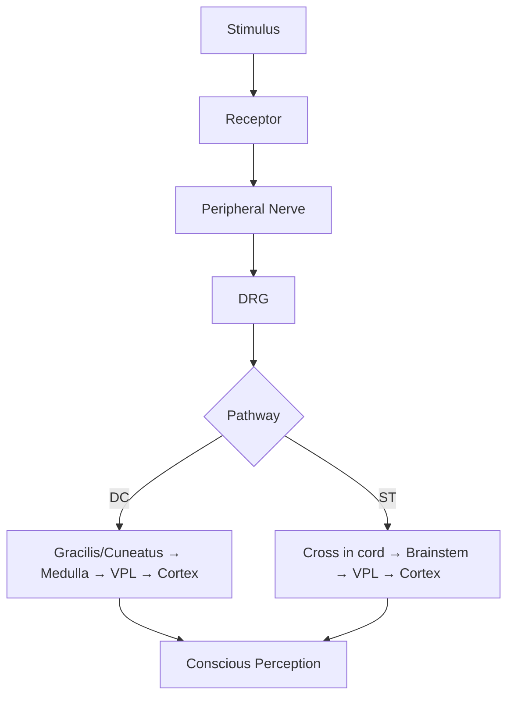
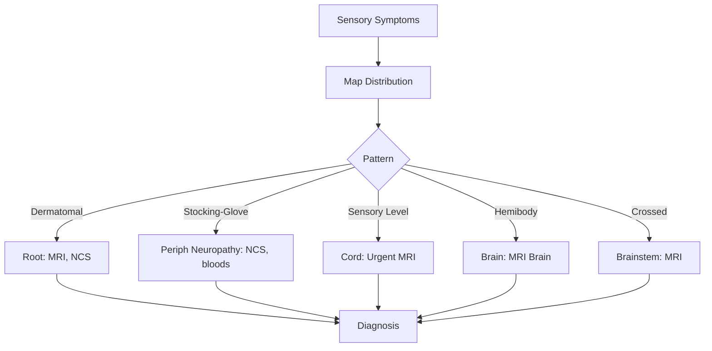

# Sensory System Examination

> [!tip] Sensory exam is **subjective** — rely on consistent testing, dermatomal mapping, and **sensory level** documentation. **Spinothalamic vs dorsal column** separation is key to localisation.

## Learning Objectives
- [ ] Test all sensory modalities systematically
- [ ] Map dermatomes and identify common patterns
- [ ] Distinguish spinothalamic vs dorsal column lesions
- [ ] Localise sensory level (cord, root, nerve, central)
- [ ] Recognise red flags (saddle, level, dissociation)
- [ ] Apply FCPS/MRCP high-yield distinctions

---

## 1. Definition / Epidemiology / Classification

### Definition
**Sensory examination** assesses peripheral nerves, dorsal roots, spinal cord tracts, brainstem, thalamus, and sensory cortex.

### Classification
| Pathway | Modalities | Cross |
|---------|-----------|-------|
| **Dorsal Column–Medial Lemniscus** | Fine touch, vibration, proprioception, 2-point | Medulla |
| **Spinothalamic (anterolateral)** | Pain, temperature, crude touch | Cord (1-2 levels above) |
| **Trigeminal** | Face sensation | Brainstem nuclei → VPM |
| **Cortical (parietal)** | Stereognosis, graphaesthesia, extinction | Cortical |

### Epidemiology
- Sensory symptoms = ~30% neurology presentations
- **Peripheral neuropathy** = most common (length-dependent)
- **Cervical/lumbar radiculopathy** = next most common

---

## 2. Aetiology / Pathophysiology

### Aetiology by Pattern
- **Length-dependent neuropathy:** DM, B12, alcohol, drugs (vincristine)
- **Mononeuropathy:** Trauma, compression (carpal tunnel, meralgia)
- **Mononeuritis multiplex:** Vasculitis, DM, sarcoid, Lyme
- **Polyradiculopathy:** GBS, CIDP, cauda equina
- **Myelopathy:** Cord compression, MS, B12, syrinx, transverse myelitis
- **Brainstem:** Lateral medullary (Wallenberg), lateral pontine
- **Thalamic:** Pure sensory stroke (lacunar)
- **Cortical:** Parietal stroke, tumour, MS

### Pathophysiology

### Molecular Basis
- **B12 deficiency** — Subacute combined degeneration
- **Anti-MAG** — Demyelinating sensory > motor neuropathy
- **Anti-Hu** — Paraneoplastic sensory neuronopathy
- **Fabry disease** — Small fibre neuropathy
- **HSAN, SCN9A** — Hereditary sensory neuropathies

---

## 3. Clinical Features

### History
- **Onset/Duration:** Acute (vascular, GBS), subacute (B12, inflammation), chronic (DM)
- **Pattern:** Distal symmetric, dermatomal, hemibody, level
- **Modality:** Numbness, tingling, burning, hyperaesthesia
- **Triggers:** Cold (cryoglobulinaemia), posture (carpal tunnel)
- **Associated:** Pain, weakness, sphincter, gait, autonomic

### Examination
| Modality | Test | Tract |
|----------|------|-------|
| **Light touch** | Cotton wool | DC + ST |
| **Pinprick (pain)** | Neuro-tip | Aδ/C, ST |
| **Temperature** | Hot/cold tubes | Aδ/C, ST |
| **Vibration** | 128Hz tuning fork | Aβ, DC |
| **Proprioception** | Joint position sense | Aα, DC |
| **2-point discrimination** | Calipers | Aβ, cortical |
| **Stereognosis** | Identify object in hand | Cortical |
| **Graphaesthesia** | Number on palm | Cortical |
| **Extinction** | Double simultaneous stimulation | Parietal |

### Specific Patterns
| Pattern | Features | Lesion |
|---------|---------|--------|
| **Stocking-glove** | Distal, symmetric | Peripheral neuropathy |
| **Dermatomal** | Single root | Radiculopathy |
| **Sensory level** | Loss below dermatome | Cord (above) |
| **Suspended sensory loss** | Cape distribution, DC preserved | Syrinx |
| **Dissociated sensory loss** | Pain/temp lost, DC preserved | Central cord, syrinx |
| **Crossed sensory** | Ipsi face + contra body | Lateral medulla |
| **Hemibody** | Face + body | Thalamic/parietal |
| **Cortical** | Discriminative only | Parietal |
| **Cauda equina** | Saddle, LMN | Lumbosacral roots |
| **Conus medullaris** | Saddle, mixed UMN+LMN | T12-L2 cord |

### Key Dermatomes
| Landmark | Dermatome |
|----------|-----------|
| **C5** | Lateral upper arm (deltoid) |
| **C6** | Thumb, lateral forearm |
| **C7** | Middle finger |
| **C8** | Little finger, medial forearm |
| **T4** | Nipple line |
| **T10** | Umbilicus |
| **L1** | Inguinal region |
| **L3** | Medial knee |
| **L4** | Medial leg, medial malleolus |
| **L5** | Dorsum of foot, great toe |
| **S1** | Lateral foot, sole, small toe |
| **S2-S4** | Saddle, perineum |

---

## 4. Diagnostic Approach / Algorithm

### Sensory Level Significance
- C4 (shoulders) to C8 (fingers) — cervical
- T4 (nipple), T10 (umbilicus) — thoracic
- L1 (inguinal), L4 (knee) — lumbar
- S1 (lateral foot), S3-S5 (saddle) — sacral

---

## 5. Investigations

### First-Line
| Test | Indication |
|------|------------|
| **FBG, HbA1c** | Distal neuropathy |
| **B12, folate** | Macrocytosis, dorsal column |
| **TSH** | Hypothyroidism |
| **U&E, LFT, ESR, CRP** | Vasculitis, metabolic |
| **SPEP/UPEP, IFE** | Paraprotein |
| **ANA, ANCA, ENA** | Connective tissue |
| **HIV, Hep B/C, Lyme** | Risk-based |
| **Cryoglobulins** | Cold-precipitable |

### Neuroimaging & Neurophysiology
| Test | Indication | Finding |
|------|------------|---------|
| **MRI Spine** | Sensory level | Cord lesion |
| **MRI Brain** | Hemibody, brainstem, thalamic | Lesion |
| **NCS** | Peripheral nerve | Axonal vs demyelinating |
| **EMG** | Root/plexus/neuronopathy | Denervation |
| **Skin biopsy (IENFD)** | Small fibre neuropathy | ↓nerve fibre density |
| **SSEP** | DC pathology | Delayed |

### CSF
- GBS, CIDP: Albuminocytologic dissociation
- MS: OCB

---

## 6. Differential Diagnosis
| Condition | Distinguishing | Test |
|-----------|---------------|------|
| **Peripheral neuropathy vs radiculopathy** | Length-dependent vs dermatomal | NCS/EMG |
| **Cord compression vs transverse myelitis** | MRI | MRI + LP |
| **Syringomyelia vs central cord** | Dissociated sensory | MRI |
| **B12 vs MS** | DC predominant | B12, MRI |
| **Small fibre neuropathy** | Burning, normal NCS | Skin biopsy |
| **Conversion** | Inconsistency, non-anatomical | Clinical, Hoover's |

---

## 7. Management

### By Cause
- **DM:** Glycaemic control; symptomatic (gabapentin, duloxetine)
- **B12:** IM hydroxycobalamin 1mg alternate days × 2 weeks, then 1mg 3-monthly
- **GBS/CIDP:** IVIG 2g/kg, plasma exchange
- **Cord compression:** Urgent surgical decompression (<24h)
- **Syrinx:** Treat cause (Chiari decompression)

### Neuropathic Pain (NICE)
| Agent | Dose | Notes |
|-------|------|-------|
| **Gabapentin** | 300mg → 3600mg/day TDS | Renal adjust |
| **Pregabalin** | 75mg → 600mg/day BD | Renal adjust |
| **Duloxetine** | 30-60mg BD | SSNRI |
| **Amitriptyline** | 10-75mg nocte | TCA, ECG>40 |
| **Capsaicin 8%** | Patch | Localised PHN |

### Non-Pharmacological
- TENS, acupuncture, CBT, foot care (DM)

---

## 8. Drug Interactions / Cautions
| Drug | Interaction/Caution | Management |
|------|---------------------|------------|
| **Gabapentin/Pregabalin** | Sedation, abuse | Titr ate, avoid opioids |
| **Duloxetine** | MAOI, serotonergic | Serotonin syndrome risk |
| **Amitriptyline** | Anticholinergic, cardiac | ECG >40y, avoid elderly |
| **Tramadol** | SSRIs, MAOIs | Serotonin syndrome |
| **Carbamazepine** | CYP inducer, SIADH | Many interactions |

---

## 9. Procedures
### LP
- See CSF analysis note

### Nerve/Skin Biopsy
- Sural: vasculitis, amyloid
- Skin: small fibre (IENFD)

---

## 10. Complications
| Complication | Frequency | Management |
|--------------|-----------|------------|
| **Neuropathic pain** | Common | Gabapentinoids, antidepressants |
| **Foot ulcers (DM)** | 15-25% | Foot care, orthotics |
| **Charcot joint** | DM | Bracing, off-loading |
| **Pressure sores** | Pain loss | Inspection, repositioning |
| **Falls** | Proprioceptive loss | Physio, mobility aids |

---

## 11. Red Flags / Emergencies
| Red Flag | Action | Time |
|----------|--------|------|
| **Saddle + sphincter** | Cauda — MRI | Emergency |
| **Sensory level + UMN below** | Cord — MRI | <24h |
| **Suspended sensory loss (cape)** | Syrinx — MRI | Urgent |
| **Acute hemibody** | Stroke pathway | <4.5h |
| **Crossed sensory** | Brainstem stroke | Urgent MRI |
| **Rapid ascending sensory loss** | GBS — FVC | ICU |

---

## 12. Prognosis
| Condition | Prognosis |
|-----------|-----------|
| **DM neuropathy** | Stable if glucose controlled |
| **B12** | Reversible if early (<6mo) |
| **GBS** | 80% good recovery |
| **MS** | Variable |
| **Cord compression** | Reversible if <24-48h surgical |

---

## 13. Topic Correlation
- **Motor System Examination** — combined sensorimotor
- **Anatomical Localisation Principles** — patterns
- **Spinal Cord Syndromes, MS, Stroke, GBS** — disease-specific

---

## 14. Special Situations
| Situation | Consideration |
|-----------|---------------|
| **Pregnancy** | Carpal tunnel (3rd trimester); B12 in vegans |
| **Paediatric** | HSAN, Fabry; Genetic testing |
| **Elderly** | Falls, B12, DM, position sense |
| **Renal** | Uraemic neuropathy; gabapentin dose reduce |
| **Hepatic** | Caution duloxetine, TCAs |
| **Diabetes** | Strict glucose; annual foot exam |
| **Driving** | Sensory + ataxia may restrict |

---

## FCPS/MRCP High-Yield Summary
- **DC:** Vibration, proprioception, fine touch, 2-point (cross at medulla)
- **ST:** Pain, temperature, crude touch (cross at cord)
- **Key dermatomes:** T4=nipple, T10=umbilicus, L4=medial knee, S1=lateral foot
- **Suspended:** Cape = syrinx
- **Dissociated:** Pain/temp lost, DC preserved = central cord
- **Crossed:** Lateral medullary (ipsi face + contra body)
- **Cauda:** Saddle, LMN, late sphincter, severe pain
- **Conus:** Saddle, mixed UMN+LMN, early sphincter
- **B12:** Subacute combined — DC + lateral CST
- **Cortical:** Astereognosis, agraphaesthesia, extinction

---

## Viva Questions
1. List 5 modalities and tracts. → Pain/temp = ST; Vibration/proprioception = DC
2. T10 dermatome. → Umbilicus
3. Suspended sensory loss? → Syrinx (cape)
4. Dissociated sensory loss? → Pain/temp lost, DC preserved
5. Cauda vs conus? → Cauda: LMN; Conus: mixed
6. B12 sensory signs? → DC loss + spastic paraparesis
7. Cortical sensory loss? → Astereognosis, agraphaesthesia
8. Crossed sensory? → Lateral medullary
9. First-line neuropathic pain? → Gabapentin/pregabalin/duloxetine/amitriptyline
10. Small fibre neuropathy? → Skin biopsy (IENFD), normal NCS

---

## Common Confusions / Exam Traps
| Confusion | Clarification |
|-----------|---------------|
| **Cervical cord vs root** | Cord = bilateral, level, UMN below; Root = unilateral, dermatomal, LMN |
| **Syrinx vs central cord** | Syrinx: capelike, dissociated; central cord: motor > sensory |
| **Conus vs cauda** | Conus = mixed; Cauda = LMN |
| **B12 vs cervical myelopathy** | B12 = no compression; Cervical = MRI shows compression |
| **Sensory level vs DC cross** | T10 sensory = T7-T8 cord (DC cross 1-2 levels higher) |
| **Suspended vs level** | Suspended = selective modality loss in cape; Level = all modalities below |
| **Acute cord vs GBS** | Cord = UMN + level + sphincter; GBS = LMN + ascending + areflexia |

---

## Mnemonics
1. **DC** = "VP-FT-2P" = Vibration, Proprioception, Fine Touch, 2-Point
2. **ST** = "PT-CT" = Pain, Temperature, Crude Touch
3. **Dermatomes** = "T4 tit, T10 belly, T12 groin"
4. **Cauda** = "Caudal roots, LMN, late sphincter, more pain"
5. **Conus** = "Cord, mixed, early sphincter, less pain"
6. **B12** = "Subacute combined: dorsal + lateral"
7. **Dissociated** = "Syrinx ST loss, DC preserved"

---

## One-Page Revision Card
| Field | Content |
|-------|---------|
| **Definition** | Sensory exam: LT, pain, temp, vibration, proprioception, cortical |
| **Tracts** | DC: vibration, proprioception, fine touch (cross at medulla). ST: pain, temp, crude touch (cross at cord) |
| **Dermatomes** | T4=nipple, T10=umbilicus, L1=inguinal, L4=medial knee, S1=lateral foot |
| **Patterns** | Stocking-glove; Dermatomal; Level; Crossed; Hemibody; Cortical |
| **Investigations** | Glucose, B12, autoimmune, NCS/EMG, MRI, skin biopsy (small fibre) |
| **Management** | Treat cause; Neuropathic pain: gabapentin, duloxetine |
| **Red Flags** | Saddle + sphincter (cauda); Level (cord); Suspended (syrinx); Crossed (brainstem) |
| **Viva Pearls** | "DC crosses at medulla, ST at cord"; "Suspended = syrinx"; "Cauda LMN, Conus mixed" |

---

## MCQs (10)
1. **Question:** Which tract carries pain and temperature?
   **Options:** A. Dorsal column B. Spinothalamic C. Corticospinal D. Spinocerebellar
   **Answer:** B
   **Explanation:** ST = pain, temperature, crude touch. Crosses 1-2 levels above entry at cord.

2. **Question:** T10 dermatome corresponds to?
   **Options:** A. Nipple B. Umbilicus C. Inguinal ligament D. Knee
   **Answer:** B
   **Explanation:** T10 = umbilicus. T4 = nipple, T12 = inguinal, L4 = medial knee.

3. **Question:** Suspended cape-distribution sensory loss is characteristic of?
   **Options:** A. Cord compression B. Syringomyelia C. Peripheral neuropathy D. Carpal tunnel
   **Answer:** B
   **Explanation:** Syrinx = central cord → loss of pain/temp in cape distribution, DC preserved = dissociated.

4. **Question:** Vibration and proprioception are carried by?
   **Options:** A. Spinothalamic B. Dorsal column C. Spinocerebellar D. Corticospinal
   **Answer:** B
   **Explanation:** DC = vibration, proprioception, fine touch, 2-point. Crosses at medulla.

5. **Question:** Cauda equina affects which dermatomes?
   **Options:** A. C5-T1 B. T10-L1 C. L2-S5 D. S2-S4 only
   **Answer:** C
   **Explanation:** Cauda = L2-S5 nerve roots → saddle, posterior thigh, lateral leg, sphincter.

6. **Question:** Loss of right body pain/temp and left face sensation. Where?
   **Options:** A. Right thalamus B. Left lateral medulla C. Right lateral medulla D. Right cord
   **Answer:** B
   **Explanation:** Crossed sensory (ipsi face + contra body) = lateral medullary (Wallenberg).

7. **Question:** First-line treatment for neuropathic pain (NICE)?
   **Options:** A. Paracetamol B. NSAIDs C. Gabapentin/pregabalin or duloxetine D. Opioids
   **Answer:** C
   **Explanation:** NICE first-line: gabapentin/pregabalin OR duloxetine OR amitriptyline.

8. **Question:** Small fibre neuropathy — which is true?
   **Options:** A. Loss of vibration B. Normal NCS C. Hyperreflexia D. Fasciculations
   **Answer:** B
   **Explanation:** Small fibre (Aδ, C) = pain/burning; NCS tests large fibres = NORMAL. Skin biopsy ↓IENFD.

9. **Question:** B12 deficiency typical sensory finding?
   **Options:** A. Suspended sensory loss B. Loss of vibration/proprioception C. Saddle anaesthesia D. Hemibody loss
   **Answer:** B
   **Explanation:** B12 = subacute combined degeneration → DC (vibration, proprioception) + lateral CST (spastic paresis).

10. **Question:** Cortical sensory loss includes all EXCEPT?
    **Options:** A. Astereognosis B. Agraphaesthesia C. Loss of vibration D. Sensory extinction
    **Answer:** C
    **Explanation:** Vibration = DC, not cortical. Cortical = astereognosis, agraphaesthesia, extinction, 2PD loss.

---

## SBA Questions (10)
1. **Scenario:** 40-year-old with burning feet, normal NCS, normal reflexes. DM negative. Next test?
   **Options:** A. Repeat NCS B. Skin biopsy for IENFD C. MRI spine D. B12
   **Answer:** B
   **Explanation:** Small fibre neuropathy suspected. NCS normal expected. Skin biopsy (IENFD) is gold standard.

2. **Scenario:** 60-year-old with right body sensory loss, hemiparesis. CT: left thalamic haemorrhage. Pathway affected?
   **Options:** A. Spinothalamic only B. CST + ST C. All sensory + motor D. Cerebellar
   **Answer:** C
   **Explanation:** Thalamic lesion = pure sensory stroke (lacunar) ± motor if extends (sensorimotor). All sensory via VPL.

3. **Scenario:** 50-year-old with new saddle anaesthesia, urinary retention, bilateral leg weakness. Most urgent next step?
   **Options:** A. LP B. MRI whole spine C. Urodynamics D. NCS
   **Answer:** B
   **Explanation:** Cauda equina = emergency MRI within hours for surgical decompression.

4. **Scenario:** 30-year-old with bilateral hand numbness, worse at night, Tinel's at wrist. Diagnosis?
   **Options:** A. Cubital tunnel B. Carpal tunnel C. Cervical radiculopathy D. Thoracic outlet
   **Answer:** B
   **Explanation:** Carpal tunnel = median; nocturnal, Tinel's +ve, Phalen's +ve. Affects thumb, index, middle, radial ring.

5. **Scenario:** 70-year-old with sudden loss of pain/temp on right body and left face, vertigo, dysphagia. Diagnosis?
   **Options:** A. Lateral medullary (Wallenberg) B. Lateral pontine C. Thalamic D. Cerebellar
   **Answer:** A
   **Explanation:** Lateral medullary = PICA; cross sensory (ipsi face, contra body), nucleus ambiguus (dysphagia), vestibular nuclei (vertigo).

6. **Scenario:** 35-year-old with progressive loss of pinprick over both arms in cape distribution, vibration preserved. Most likely?
   **Options:** A. MS B. Cervical spondylosis C. Syringomyelia D. MND
   **Answer:** C
   **Explanation:** Dissociated cape distribution = syringomyelia. Associated with Chiari I.

7. **Scenario:** 25-year-old with B12 deficiency and vibration loss. Other finding expected?
   **Options:** A. Hyperreflexia in legs B. Areflexia C. Fasciculations D. Sensory level T10
   **Answer:** A
   **Explanation:** B12 = subacute combined. DC (vibration) + lateral CST (spastic paresis, hyperreflexia, Babinski).

8. **Scenario:** 60-year-old with sensory loss over medial leg, medial malleolus, great toe. Which root?
   **Options:** A. L3 B. L4 C. L5 D. S1
   **Answer:** B
   **Explanation:** L4 = medial leg, medial malleolus. L3 = anterior thigh/knee. L5 = dorsum foot, great toe. S1 = lateral foot.

9. **Scenario:** Decreased sensation over lateral upper arm. Which dermatome?
   **Options:** A. C5 B. C6 C. C7 D. T1
   **Answer:** A
   **Explanation:** C5 = lateral upper arm (regimental badge), deltoid. C6 = thumb. C7 = middle finger. T1 = medial forearm.

10. **Scenario:** Diabetic with foot ulcer and loss of protective sensation. Which modality most important to test?
    **Options:** A. Vibration B. Proprioception C. 10g monofilament D. Temperature
    **Answer:** C
    **Explanation:** 10g Semmes-Weinstein monofilament tests protective sensation — NICE recommended for foot screening in DM.

---

## Flashcards
- **Q:** Spinothalamic modalities? **A:** Pain, temperature, crude touch. Cross at cord.
- **Q:** Dorsal column modalities? **A:** Vibration, proprioception, fine touch. Cross at medulla.
- **Q:** T10 dermatome? **A:** Umbilicus.
- **Q:** Suspended sensory loss? **A:** Cape distribution (syrinx).
- **Q:** Dissociated sensory loss? **A:** Pain/temp lost, DC preserved.
- **Q:** Crossed sensory? **A:** Lateral medullary (ipsi face + contra body).
- **Q:** Cauda vs conus? **A:** Cauda: LMN, late sphincter; Conus: mixed, early sphincter.
- **Q:** B12 sensory? **A:** DC loss (vibration) + CST (spastic).
- **Q:** Small fibre neuropathy? **A:** Skin biopsy (IENFD), NCS normal.
- **Q:** First-line neuropathic pain? **A:** Gabapentin, pregabalin, duloxetine, amitriptyline.

---

## Answer Key
### MCQs
1. **B** — ST = pain, temp
2. **B** — T10 = umbilicus
3. **B** — Suspended = syrinx
4. **B** — DC = vibration, proprioception
5. **C** — Cauda = L2-S5
6. **B** — Crossed = lateral medulla
7. **C** — Gabapentinoids/duloxetine
8. **B** — Small fibre = normal NCS
9. **B** — B12 = DC loss
10. **C** — Vibration is DC, not cortical

### SBAs
1. **B** — Small fibre = skin biopsy
2. **C** — Thalamic = all sensory
3. **B** — Cauda = emergency MRI
4. **B** — Carpal tunnel = median
5. **A** — Lateral medullary (PICA)
6. **C** — Dissociated cape = syrinx
7. **A** — B12 = hyperreflexia (CST)
8. **B** — Medial leg = L4
9. **A** — Lateral upper arm = C5
10. **C** — 10g monofilament = protective

---

## Local Navigation
**Heading Hub:** [[Fundamentals & Examination Hub]]  
**Topic-Group Hub:** [[Clinical Assessment Hub]]  
**Chapter Hierarchy:** [[Davidson Chapter 25 - Neurology Hierarchy]]  
**Chapter MOC:** [[Neurology MOC]]  
**Drug Reference:** [[../00_Index/Neurology Drug Reference]]  
**Related Topics:** [[Neurological Examination]], [[Anatomical Localisation Principles]], [[Spinal Cord Syndromes]]
