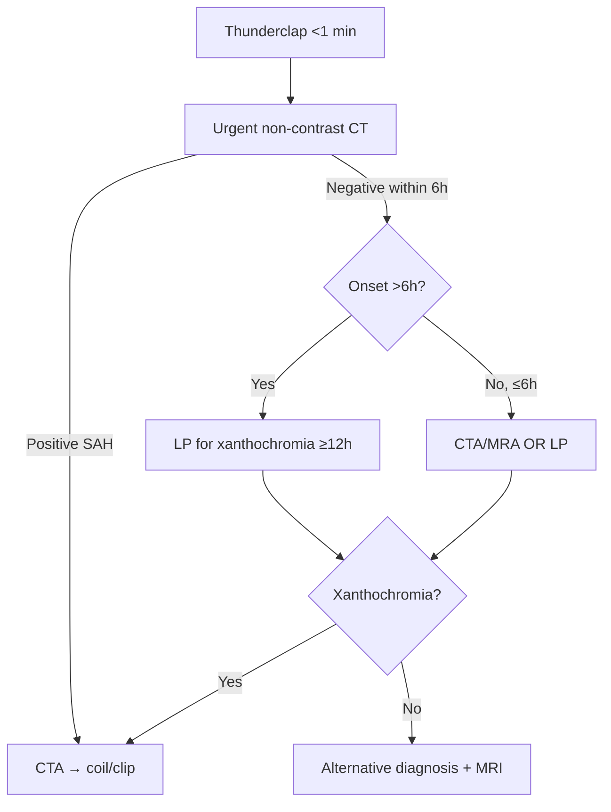

# Thunderclap Headache & SAH

> [!tip] **Definition**
> **Thunderclap Headache (TCH):** Severe headache reaching maximum intensity within **<1 minute**, lasting ≥5 minutes. A medical emergency until proven otherwise.
> **Subarachnoid Haemorrhage (SAH):** Bleeding into subarachnoid space (most often aneurysmal). "First and worst" headache, "explosion in head."

## 1. Definition / Epidemiology / Classification

### Epidemiology
- **SAH incidence:** 6-10/100,000/year
- **Aneurysmal SAH:** 80-85% of non-traumatic SAH
- **Perimesencephalic non-aneurysmal SAH (PNSAH):** 10% (excellent prognosis)
- **Mortality:** 30-40% overall; 50% pre-hospital
- **Risk factors:** Hypertension, smoking, alcohol, family history (2 first-degree relatives = screen), ADPKD, Ehlers-Danlos IV, NF1, fibromuscular dysplasia

### Severity Scores
| Score | Components | Range |
|-------|-----------|-------|
| **WFNS** | GCS + focal deficit | I-V |
| **Hunt & Hess** | Symptom severity | 0-5 |
| **Modified Fisher** | CT blood + IVH | 0-4 (predicts vasospasm) |

## 2. Aetiology / Pathophysiology

### Causes of Thunderclap Headache
- **Vascular:** Aneurysmal SAH (most important), RCVS, cervical artery dissection, cerebral venous sinus thrombosis, ICH, pituitary apoplexy
- **Non-vascular:** Third ventricle colloid cyst (positional), idiopathic

### Pathophysiology (Aneurysmal SAH)
- **Saccular aneurysm:** Outpouching at Circle of Willis bifurcation (85% anterior: AComm 30%, PComm 25%, MCA 20%)
- **Complications:** **Rebleed** (peak 24h), **DCI/vasospasm** (days 3-14, peak 7), hydrocephalus (acute obstructive or chronic communicating), hyponatraemia (SIADH/CSW), seizures, cardiac stunning (Takotsubo)

## 3. Clinical Features

### History
- Sudden onset <1 min, worst at onset
- Meningism, photophobia, vomiting
- LOC at onset (50%)
- CN III palsy (PComm aneurysm)
- Seizures 5-10% at onset

### Red Flags (SNOOP)
**S**ystemic symptoms, **N**eurological deficits, **O**nset sudden, **O**lder age (>50 new), **P**attern change/positional

### Examination
- GCS, meningism, focal deficits (CN III, hemiparesis, aphasia)
- **Subhyaloid haemorrhages (Terson syndrome)** — poor prognostic marker

## 4. Diagnostic Approach

### CT Sensitivity
- **Within 6h:** ~99% sensitive
- **24h:** ~85%
- **7 days:** ~50%

### LP Interpretation
- **Xanthochromia** (spectrophotometry, not visual) — pathognomonic SAH
- **RBC >2000 ×10⁶/L** without clearing tubes 1→4 = SAH
- **Clearing tubes 1→4** = traumatic tap

## 5. Investigations

### Immediate
| Investigation | Indication |
|---------------|------------|
| **Non-contrast CT Head** | First-line; ~99% sensitive within 6h |
| **CT angiography** | Identify aneurysm; second-line if CT positive |
| **LP** | CT negative + >6h onset or persistent suspicion; **≥12h for xanthochromia** |
| **MRI (FLAIR, SWI, T2*)** | Alternative; subacute SAH |
| **MRA** | If CTA contraindicated |
| **DSA** | Gold standard for aneurysm; treatment planning |

### Other
- **ECG:** QT prolongation, T-wave inversion, ST changes (cerebral T-wave); mimic MI
- **Troponin:** Cardiac stunning (Takotsubo)
- **U&E, glucose:** Hyponatraemia, stress hyperglycaemia
- **MRV/CTV:** If CVST suspected
- **Carotid/vertebral MRA/Doppler:** If dissection suspected

## 6. Differential Diagnosis

| Condition | Distinguishing | Key Test |
|-----------|---------------|----------|
| **Migraine** | Build-up over minutes-hours; prior episodes | Clinical |
| **Meningitis/encephalitis** | Fever, progressive | LP |
| **CVST** | Female, OCP/pregnancy, papilloedema | CTV/MRV |
| **Cervical artery dissection** | Neck pain, Horner's | MRA, fat-sat MRI |
| **RCVS** | Recurrent TCH, postpartum/SSRI; "string of beads" | CTA/MRA |
| **Pituitary apoplexy** | Visual loss, ophthalmoplegia, hormonal | MRI pituitary |
| **Idiopathic TCH** | Diagnosis of exclusion | Follow-up |

## 7. Management

### Emergency (Aneurysmal SAH)
| Time | Action |
|------|--------|
| **T=0** | ABCDE, IV, O2, NPO, analgesia (paracetamol/opioid; **avoid NSAIDs**), antiemetic |
| **T=0-1h** | CT → CTA → Neurosurgery/INR referral |
| **T=1-24h** | **SBP <160** (labetalol/nicardipine); reverse anticoagulation; **Nimodipine 60mg PO/NG 4-hourly ×21 days** |
| **T=24-72h** | Aneurysm securement: **Endovascular coiling** (ISAT — preferred if anatomy suitable) OR **Surgical clipping** |
| **T=3-14d** | Monitor DCI (clinical, TCD, CTA); treat with euvolaemia, induced HTN (after clipping/coiling), angioplasty |

### Complication Management
| Complication | Rx |
|--------------|-----|
| **Rebleed** | Emergency coiling/clipping; reverse anticoagulation |
| **Acute hydrocephalus** | EVD |
| **Vasospasm/DCI** | Nimodipine; euvolaemia; induced HTN (after securing aneurysm); intra-arterial nimodipine/milrinone; angioplasty |
| **Hyponatraemia** | **CSW (volume depletion)** → 0.9% saline + salt; **SIADH** → fluid restriction |
| **Seizures** | Short-term levetiracetam (high-risk) |
| **Cardiac stunning** | Supportive |

### Nimodipine — Key Points
- **60mg PO/NG 4-hourly ×21 days**
- **Reduces DCI by 30%; NOT for BP control**
- Hypotension → reduce to 30mg 2-hourly

### Idiopathic TCH / RCVS / PNSAH
- **Idiopathic TCH:** Reassurance; NSAIDs short-term OK
- **RCVS:** Nimodipine 30-60mg TDS ×4-12 weeks; avoid serotonergic drugs
- **PNSAH:** No aneurysm on DSA; supportive; excellent prognosis

## 8. Drug Interactions / Cautions
| Drug | Caution |
|------|---------|
| Nimodipine | Hypotension; avoid grapefruit |
| Tranexamic acid | Thrombotic risk; short-term only |
| Labetalol/Nicardipine | Bradycardia, bronchospasm; monitor BP |
| NSAIDs | Avoid in SAH (platelet dysfunction) |
| Triptans | Contraindicated if vascular cause |

## 9. Procedures
### LP after Negative CT
- **Timing:** ≥12h post-onset for xanthochromia
- **Procedure:** L3/4 or L4/5; 4 tubes; opening pressure
- **Interpretation:** Xanthochromia (bilirubin) = SAH; clearing tubes 1→4 = traumatic tap

### EVD
- Indication: Acute hydrocephalus, raised ICP

## 10. Complications

| Complication | Frequency | Onset | Management |
|--------------|-----------|-------|------------|
| **Rebleed** | 4% in 24h; 20% in 14d untreated | Early | Emergency coiling/clipping |
| **Vasospasm/DCI** | 30% clinical, 70% angio | Days 3-14 (peak 7) | Nimodipine, euvolaemia, induced HTN, angioplasty |
| **Acute hydrocephalus** | 15-30% | Early | EVD |
| **Chronic hydrocephalus** | 10-30% | Weeks-months | VP shunt |
| **Hyponatraemia** | 30-50% | Days 1-14 | CSW vs SIADH |
| **Cardiac stunning** | 10-20% | Early | Supportive |

## 11. Red Flags / Emergencies

| Red Flag | Immediate Action |
|----------|------------------|
| TCH + GCS drop | Resuscitate, urgent CT, neurosurgery |
| CN III palsy + headache | Urgent CTA — PComm aneurysm |
| New focal deficit post-SAH | Urgent CT; vasospasm protocol |
| Rebleed | Urgent CT, prepare coiling/clipping |
| Acute hydrocephalus | EVD |

## 12. Prognosis
| Factor | Good | Poor |
|--------|------|------|
| Grade | WFNS I-II, H&H 1-2 | WFNS IV-V, H&H 4-5 |
| CT blood | Modified Fisher 0-1 | Fisher 3-4 |
| Age | <60 | >70 |
| Rebleed/DCI | None | Rebleed, severe DCI |

- **Aneurysmal SAH:** 30-40% mortality; 50% pre-hospital
- **PNSAH:** Excellent prognosis
- **Vasospasm peak:** Day 7; monitor with TCD (Lindegaard >3)

## 13. Topic Correlation
| Related Topic | Key Overlap |
|---------------|-------------|
| Thunderclap Headache | SAH as cause; differential |
| CT Brain | Non-contrast CT, CTA |
| CSF Analysis | Xanthochromia; traumatic tap |
| Stroke Emergency | Vasospasm mimics stroke |
| RCVS | Recurrent TCH; reversible |

## 14. Special Situations
| Situation | Consideration |
|-----------|---------------|
| Pregnancy | Avoid CT (use MRI/MRA); coil preferred |
| Paediatric | AVM more common; consider EDS IV |
| Elderly | Higher surgical risk; coiling preferred |
| ADPKD/Family Hx | Screening MRA; genetic counselling |

## FCPS/MRCP High-Yield Summary
| Category | Key Points |
|----------|------------|
| Definition | TCH = peak intensity <1 min; SAH = blood in subarachnoid space |
| Aetiology | Aneurysm (85%), PNSAH (10%), AVM, dissection, RCVS |
| Clinical | Sudden onset, worst ever, meningism, CN III palsy (PComm), Terson syndrome |
| Diagnosis | **CT first** (sensitive within 6h); LP for xanthochromia (>12h); CTA |
| Management | ABCDE; analgesia; **Nimodipine 60mg 4-hourly ×21d**; secure aneurysm (coil/clip) |
| Complications | Rebleed, vasospasm/DCI, hydrocephalus, hyponatraemia |
| Drug Doses | Nimodipine 60mg 4-hourly; Labetalol/Nicardipine for SBP<160 |
| Scoring | WFNS, Hunt & Hess, Modified Fisher |

## Viva Questions
1. **Q:** Most important cause of TCH?
   **A:** Aneurysmal SAH until proven otherwise.
2. **Q:** CT normal in TCH at 3 hours. Next step?
   **A:** CT within 6h has ~99% sensitivity. If within 6h, CTA/MRA or LP (best ≥12h).
3. **Q:** What is xanthochromia?
   **A:** Yellow CSF discoloration from bilirubin (RBC breakdown); spectrophotometry gold standard; takes 6-12h.
4. **Q:** SAH vs traumatic tap on LP?
   **A:** Xanthochromia, no clearing tubes 1→4, similar RBC counts (SAH); clearing (traumatic).
5. **Q:** Why nimodipine in SAH?
   **A:** Reduces DCI by 30%; neuroprotective; **NOT for BP control**.
6. **Q:** Hunt & Hess 4 = ?
   **A:** Stupor + severe focal deficit.
7. **Q:** When does vasospasm peak?
   **A:** Day 3-14, peak day 7.
8. **Q:** Most common aneurysm site?
   **A:** Anterior communicating artery (~30%).
9. **Q:** Rebleed management?
   **A:** Emergency coiling/clipping; reverse anticoagulation.
10. **Q:** Modified Fisher grade 4?
    **A:** Thick SAH + IVH — highest vasospasm risk.
11. **Q:** Coiling vs clipping?
    **A:** ISAT: coiling if anatomy suitable; clipping if complex/large haematoma.
12. **Q:** What is PNSAH?
    **A:** Perimesencephalic non-aneurysmal SAH; no aneurysm on DSA; excellent prognosis.

## Common Confusions / Exam Traps
| Confusion | Clarification |
|-----------|---------------|
| LP timing | **Wait ≥12h** for xanthochromia; LP within 6h unreliable |
| Traumatic tap vs SAH | Clearing tubes 1→4 = traumatic; xanthochromia = SAH |
| Nimodipine dose | 60mg PO 4-hourly; **not for BP control** |
| DCI prevention | **Euvolaemia + induced HTN** (after aneurysm secured); NOT hypervolaemia |
| CSW vs SIADH | Both hyponatraemic; CSW = euvolaemic/hypovolaemic; SIADH = euvolaemic |
| Terson syndrome | Vitreal haemorrhage = poor prognostic marker in SAH |

## Mnemonics
1. **SNOOP** — **S**ystemic, **N**eurological, **O**nset sudden, **O**lder age, **P**attern change — secondary headache red flags
2. **PNSAH = "Pretty Normal SAH"** — excellent prognosis

## MCQs (10)
1. **Q:** First investigation in suspected SAH?
   **Options:** A. MRI B. LP C. CT head D. CTA E. DSA
   **Answer:** C — CT within 6h ~99% sensitivity.
2. **Q:** Most common site of saccular aneurysm?
   **Options:** A. Basilar tip B. AComm C. PComm D. MCA E. PCA
   **Answer:** B — AComm (~30%).
3. **Q:** Nimodipine in SAH given for?
   **Options:** A. BP control B. Vasospasm/DCI C. Seizure prevention D. Analgesia E. Sedation
   **Answer:** B — Reduces DCI; NOT BP control.
4. **Q:** CT negative in TCH at 4h; management?
   **Options:** A. Discharge B. LP immediately C. LP after ≥12h OR CTA/MRI D. Aspirin E. Triptan
   **Answer:** C — LP best ≥12h; CTA/MRI alternative.
5. **Q:** Xanthochromia indicates?
   **Options:** A. Traumatic tap B. Old SAH C. Infection D. Hyperbilirubinaemia E. Liver failure
   **Answer:** B — Bilirubin from RBC breakdown in CSF.
6. **Q:** Vasospasm peak day post-SAH?
   **Options:** A. Day 1 B. Day 3 C. Day 7 D. Day 14 E. Day 21
   **Answer:** C — Peak day 7.
7. **Q:** Most common cause of non-traumatic SAH?
   **Options:** A. AVM B. Mycotic C. Berry aneurysm D. Trauma E. Hypertensive
   **Answer:** C — Saccular aneurysm ~85%.
8. **Q:** Modified Fisher grade 4 = ?
   **Options:** A. No SAH B. Thin SAH C. Thick SAH only D. Thick SAH + IVH E. SDH
   **Answer:** D — Highest vasospasm risk.
9. **Q:** Hunt & Hess grade 3 = ?
   **Options:** A. Asymptomatic B. Severe HA + meningism C. Drowsy + mild focal D. Stupor + severe deficit E. Coma
   **Answer:** C — Drowsy + mild focal deficit.
10. **Q:** Terson syndrome associated with?
    **Options:** A. SAH B. Meningitis C. Migraine D. Pituitary apoplexy E. CVST
    **Answer:** A — Poor prognostic marker in SAH.

## SBA Questions (10)
1. **Scenario:** 50y woman, sudden severe occipital headache 3h ago, neck stiffness, GCS 14. CT normal.
   **Q:** Next step?
   **Options:** A. Discharge B. LP immediately C. LP after ≥12h OR CTA D. Aspirin E. Triptan
   **Answer:** C — LP best ≥12h; CTA acceptable alternative.
2. **Scenario:** SAH confirmed, WFNS 2, modified Fisher 2. CTA: 7mm AComm aneurysm.
   **Q:** Best definitive Rx?
   **Options:** A. Conservative B. Surgical clipping only C. Endovascular coiling if suitable D. Nimodipine only E. Aspirin
   **Answer:** C — ISAT favours coiling for suitable anatomy.
3. **Scenario:** Day 8 post-SAH. Sudden aphasia + right hemiparesis. TCD: MCA 200 cm/s.
   **Q:** Diagnosis?
   **Options:** A. Rebleed B. Vasospasm/DCI C. Hydrocephalus D. Seizure E. Pneumonia
   **Answer:** B — Vasospasm/DCI; TCD >200.
4. **Scenario:** Day 5 post-SAH. Na+ 122, UO 200 ml/h, euvolaemic.
   **Q:** Diagnosis?
   **Options:** A. SIADH B. CSW C. DI D. Hypovolaemia E. Hypervolaemia
   **Answer:** B — CSW (high urine output + salt loss); salt + fluids.
5. **Scenario:** 35y woman, recurrent TCH over 2 weeks, postpartum, on SSRI. CTA: "string of beads."
   **Q:** Diagnosis?
   **Options:** A. SAH B. RCVS C. Vasculitis D. Migraine E. Cluster
   **Answer:** B — RCVS.
6. **Scenario:** SAH patient suddenly drops GCS 6h post-ictus.
   **Q:** Cause?
   **Options:** A. Vasospasm B. Rebleed C. Hydrocephalus D. Seizure E. Pneumonia
   **Answer:** C — Acute hydrocephalus; EVD.
7. **Scenario:** SAH, Na+ 128, BP 110/70, CVP 4, euvolaemic.
   **Q:** Diagnosis and Rx?
   **Options:** A. SIADH — fluid restrict B. CSW — 0.9% saline + salt C. DI — DDAVP D. Hypovolaemia — restrict E. Hypervolaemia — diuretics
   **Answer:** B — CSW (euvolaemic + hyponatraemia); salt + fluids.
8. **Scenario:** Day 10 post-coiling. Dilated ventricles, GCS 12.
   **Q:** Management?
   **Options:** A. Repeat coiling B. EVD C. LP only D. Nimodipine escalation E. Surgery
   **Answer:** B — Hydrocephalus → EVD ± VP shunt.
9. **Scenario:** Severe headache + CN III palsy. CT: SAH. CTA: 8mm PComm aneurysm.
   **Q:** Why CN III palsy?
   **Options:** A. Brainstem stroke B. PComm compresses CN III C. Hydrocephalus D. Vasospasm E. Herniation
   **Answer:** B — Adjacent CN III compression.
10. **Scenario:** 45y SAH, H&H 4. Family asks prognosis.
    **Q:** Evidence-based answer?
    **Options:** A. Excellent B. ~30-40% mortality overall; poor grade worse C. Always fatal D. No grading impact E. Guaranteed recovery
    **Answer:** B — 30-40% mortality; H&H 4-5 = poor.

## Flashcards
- **Q:** First investigation in suspected SAH?
  **A:** Non-contrast CT head.
- **Q:** LP timing for xanthochromia?
  **A:** ≥12 hours after headache onset.
- **Q:** Nimodipine dose in SAH?
  **A:** 60mg PO 4-hourly ×21 days.
- **Q:** Nimodipine purpose?
  **A:** Reduces DCI; NOT BP control.
- **Q:** Peak vasospasm day post-SAH?
  **A:** Day 7.
- **Q:** What is PNSAH?
  **A:** Perimesencephalic non-aneurysmal SAH — excellent prognosis.
- **Q:** Hunt & Hess 5?
  **A:** Moribund/comatose.
- **Q:** What does Terson syndrome indicate?
  **A:** Vitreal/subhyaloid haemorrhage = poor prognostic marker in SAH.

## Answer Key

### MCQs
1. C | 2. B | 3. B | 4. C | 5. B | 6. C | 7. C | 8. D | 9. C | 10. A

### SBAs
1. C | 2. C | 3. B | 4. B | 5. B | 6. C | 7. B | 8. B | 9. B | 10. B

> **Local Navigation:** [[Thunderclap Headache]], [[Emergency Approach Hub]], [[CSF Analysis & Interpretation]]