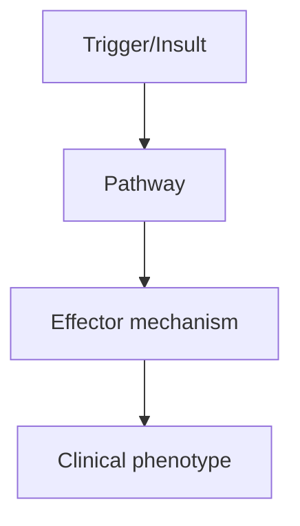
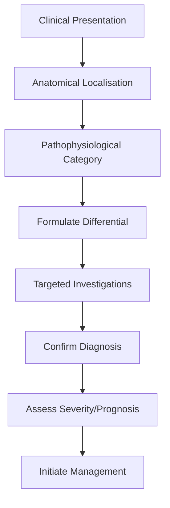
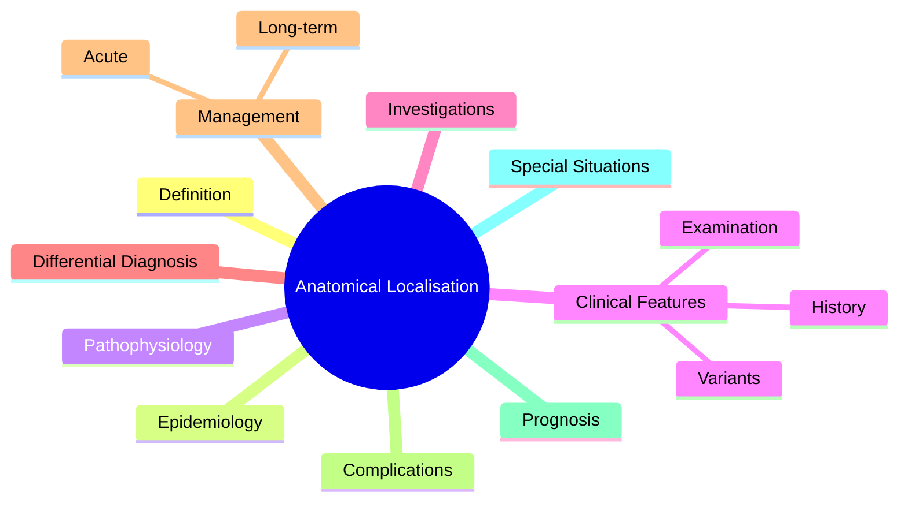

# Anatomical Localisation Principles

> [!tip] **High-Yield Definition**
> Process of identifying anatomical site of neurological lesion from clinical features. Localisation precedes investigation and diagnosis. Key principle: history = 80% of localisation.

---

## 1. Definition / Epidemiology / Classification

### Definition
Process of identifying anatomical site of neurological lesion from clinical features. Localisation precedes investigation and diagnosis. Key principle: history = 80% of localisation.

### Epidemiology
N/A (clinical skill). Mastery is essential for all neurologists and trainees.

### Classification
| Variant | Key Features | Prognosis |
|---------|-------------|-----------|
| | | |

---

## 2. Aetiology / Pathophysiology

### Aetiology
Approach: CNS (cortex, subcortical, brainstem, cerebellum, cord) vs PNS (root, plexus, peripheral nerve, NMJ, muscle). UMN vs LMN signs. Crossed signs indicate brainstem.

### Pathophysiology

---

## 3. Clinical Features

### History
- **Onset/Duration:**
- **Progression:**
- **Key symptoms:**
- **Triggers:**
- **Systemic symptoms:**
- **Drug/Family/Social history:**

### Examination
| Domain | Key Findings | Localisation Value |
|--------|-------------|-------------------|
| | | |

### Specific Clinical Features
UMN signs: increased tone (spasticity), weakness (pyramidal pattern), hyperreflexia, Babinski, clonus, no wasting. LMN signs: wasting, fasciculations, flaccid weakness, hyporeflexia, no Babinski. Sensory level = cord. Dissociated sensory loss = central cord (syrinx).

---

## 4. Diagnostic Approach / Algorithm

---

## 5. Investigations

MRI brain/spine (localisation), NCS/EMG (PNS, NMJ, muscle), CSF, bloods. Investigations TARGET the localised lesion.

---

## 6. Differential Diagnosis

| Differential | Distinguishing Features | Key Test |
|--------------|------------------------|----------|
| | | |

---

## 7. Management

Localise first, then investigate, then diagnose. Use VINDICATE differential after localisation. History and examination > imaging.

---

## 8. Drug Interactions / Contraindications / Comorbidity Cautions

| Drug | Interaction / Caution | Management |
|------|----------------------|------------|
| | | |

---

## 9. Procedures (if applicable)

### Procedure:
- **Indications:**
- **Contraindications:**
- **Preparation / Principle:**
- **Complications:**
- **Viva Pearls:**

---

## 10. Complications

| Complication | Frequency | Prevention / Monitoring | Management |
|--------------|-----------|------------------------|------------|
| | | | |

---

## 11. Red Flags / Emergencies

Sudden focal deficit, GCS <13, new cranial nerve palsy + contralateral weakness (brainstem), cauda equina, conus medullaris - all require urgent imaging.

---

## 12. Prognosis

Depends on lesion site and aetiology. Accurate localisation reduces unnecessary investigations and time to diagnosis.

---

## 13. Topic Correlation

| Related Topic | Link | Key Overlap |
|---------------|------|-------------|
| | | |

---

## 14. Special Situations

| Situation | Consideration |
|-----------|---------------|
| **Pregnancy** | |
| **Lactation** | |
| **Paediatric** | |
| **Elderly / Frail** | |
| **Renal impairment** | |
| **Hepatic impairment** | |
| **Immunocompromised** | |
| **Perioperative** | |
| **Driving / DVLA** | |
| **Occupational** | |

---

## FCPS/MRCP High-Yield Summary

| Category | Key Points |
|----------|------------|
| **Definition** | Process of identifying anatomical site of neurological lesion from clinical features. Localisation precedes investigation and diagnosis. Key principle: history = 80% of localisation. |
| **Epidemiology** | N/A (clinical skill). Mastery is essential for all neurologists and trainees. |
| **Pathophysiology** | |
| **Clinical** | UMN signs: increased tone (spasticity), weakness (pyramidal pattern), hyperreflexia, Babinski, clonus, no wasting. LMN signs: wasting, fasciculations, flaccid weakness, hyporeflexia, no Babinski. Sens |
| **Diagnosis** | |
| **Investigations** | MRI brain/spine (localisation), NCS/EMG (PNS, NMJ, muscle), CSF, bloods. Investigations TARGET the localised lesion. |
| **Management** | Localise first, then investigate, then diagnose. Use VINDICATE differential after localisation. History and examination > imaging. |
| **Complications** | |
| **Prognosis** | Depends on lesion site and aetiology. Accurate localisation reduces unnecessary investigations and time to diagnosis. |
| **Viva Pearls** | |
| **Drug Doses** | |
| **Scoring Systems** | |
| **Genetics** | |
| **Imaging Signs** | |

---

## Viva Questions (PACES/FCPS Style)

1. **Q:** Define Anatomical Localisation Principles and classify its variants.
   **A:** Based on the definition above.

2. **Q:** What are the key clinical features?
   **A:** UMN signs: increased tone (spasticity), weakness (pyramidal pattern), hyperreflexia, Babinski, clonus, no wasting. LMN signs: wasting, fasciculations, flaccid weakness, hyporeflexia, no Babinski. Sensory level = cord. Dissociated sensory loss = central cord (syrinx).

3. **Q:** What is the first-line treatment?
   **A:** Based on the management section.

4. **Q:** What are the red flags requiring urgent referral?
   **A:** Sudden focal deficit, GCS <13, new cranial nerve palsy + contralateral weakness (brainstem), cauda equina, conus medullaris - all require urgent imaging.

5. **Q:** What is the prognosis?
   **A:** Depends on lesion site and aetiology. Accurate localisation reduces unnecessary investigations and time to diagnosis.

6. **Q:** How do you differentiate Anatomical Localisation Principles from key differentials?
   **A:** Clinical features, investigations, and response to treatment.

7. **Q:** What investigations are most useful?
   **A:** Based on the investigations section.

8. **Q:** Describe the stepwise management approach.
   **A:** Based on the management algorithm.

9. **Q:** What are the emergency presentations?
   **A:** Based on the red flags section.

10. **Q:** How does management change in pregnancy/paediatrics/elderly?
    **A:** Special considerations per population.

---

## Common Confusions / Exam Traps

| Confusion | Clarification |
|-----------|---------------|
| | |

---

## Mnemonics
1. **UMNL** — U=Up, M=Motor, N=Neuron, L=Lose inhibition: spasticity, hyperreflexia, Babinski
1. **LMNL** — L=Low, M=Motor, N=Neuron, L=Lose anterior horn: wasting, weakness, fasciculations, reduced reflexes
1. **Myotomes L2-S1** — **L**2 hip flex, **L**3 knee ext, **L**4 ankle dorsi, **L**5 great toe, **S**1 ankle plantar

---

## Mind Map

---

## Spaced Repetition Trackers

| Review Interval | Date | Score (0-5) | Notes |
|-----------------|------|-------------|-------|
| Day 1 | | | |
| Day 3 | | | |
| Day 7 | | | |
| Day 14 | | | |
| Day 30 | | | |
| Day 90 | | | |

---

## Self-Test Scorecard

| Section | Score /5 | Last Attempt |
|---------|----------|--------------|
| Definition & Epidemiology | | |
| Pathophysiology | | |
| Clinical Features | | |
| Investigations | | |
| Differential Diagnosis | | |
| Management | | |
| Complications & Prognosis | | |
| Viva Questions | | |
| MCQs | | |
| SBAs | | |

---

## MCQs (10)

1. **Question:** LMN signs include all EXCEPT:
   **Options:** A. Spasticity B. Wasting C. Fasciculations D. Reduced reflexes
   **Answer:** A
   **Explanation:** UMN signs include spasticity. LMN = wasting, fasciculations, reduced reflexes.

2. **Question:** Right-sided UMN facial palsy spares forehead because:
   **Options:** A. Upper face has bilateral cortical innervation B. Lower face has bilateral cortical innervation C. LMN only affects upper face D. Bell's palsy
   **Answer:** A
   **Explanation:** Forehead bilateral cortical innervation; UMN spares forehead. LMN (Bell's) affects all branches.

3. **Question:** Lesion at C3-4 causes:
   **Options:** A. Quadriplegia + respiratory failure B. Isolated hand weakness C. Locked-in syndrome D. Ataxia
   **Answer:** A
   **Explanation:** High cervical cord → quadriplegia + respiratory failure (phrenic C3-5).

4. **Question:** Brown-Séquard syndrome (hemisection) findings:
   **Options:** A. Ipsilateral UMN + dorsal column, contralateral spinothalamic loss B. Bilateral LMN signs C. Isolated sensory loss D. Bilateral UMN
   **Answer:** A
   **Explanation:** Ipsilateral corticospinal + dorsal column, contralateral spinothalamic (1-2 levels below).

5. **Question:** Locked-in syndrome lesion is at:
   **Options:** A. Ventral pons (basilar artery) B. Midbrain C. Cerebellum D. Cortex
   **Answer:** A
   **Explanation:** Ventral pons: spares reticular (consciousness) + tegmentum (vertical gaze/blinking), damages corticospinal/corticobulbar.

6. **Question:** Cerebellar sign:
   **Options:** A. Dysmetria + intention tremor B. Spasticity C. Wasting D. Hyperreflexia
   **Answer:** A
   **Explanation:** Cerebellar: dysmetria, intention tremor, dysdiadochokinesia, nystagmus, ataxic gait, scanning speech, hypotonia.

7. **Question:** Cauda equina lesion affects:
   **Options:** A. LMN only (peripheral nerves below conus) B. UMN only C. Mixed UMN/LMN D. Sensory only
   **Answer:** A
   **Explanation:** Cauda equina = peripheral nerves → pure LMN, areflexic, asymmetric.

8. **Question:** Conus medullaris syndrome:
   **Options:** A. Mixed UMN/LMN, early urinary retention, saddle anaesthesia B. Pure LMN C. Pure UMN D. Bilateral leg pain only
   **Answer:** A
   **Explanation:** Conus (T12-L2) = mixed UMN (corticospinal) + LMN (sacral), early bladder, symmetric saddle.

9. **Question:** Crossed signs (ipsilateral CN + contralateral body) suggest:
   **Options:** A. Brainstem lesion B. Spinal cord C. Cortex D. Cauda equina
   **Answer:** A
   **Explanation:** Brainstem: ipsilateral CN palsy + contralateral hemiparesis (corticospinal decussates below).

10. **Question:** Which tract decussates at the medulla?
   **Options:** A. Corticospinal tract B. Dorsal column C. Spinothalamic D. Cerebellar
   **Answer:** A
   **Explanation:** Corticospinal decussates at cervicomedullary junction. Below = contralateral control.

---

## SBA Questions (10)

1. **Scenario:** Right hemiparesis, right UMN facial palsy (forehead sparing), aphasia. Site?
   **Options:** A. Left MCA cortical B. Right brainstem C. Right MCA D. Cervical cord E. Right pons
   **Answer:** A
   **Explanation:** Forehead-sparing + aphasia = left cortical lesion. Brainstem = crossed signs.

2. **Scenario:** Right arm/leg UMN signs, left face LMN weakness. Site?
   **Options:** A. Right pons B. Right cortex C. Left pons D. Right cervical cord E. Right thalamus
   **Answer:** A
   **Explanation:** Crossed signs = brainstem. Right pons affects right corticospinal + right CN VII fascicle.

3. **Scenario:** Bilateral leg weakness, UMN signs, sensory level T10. Site?
   **Options:** A. T10 spinal cord B. Cauda equina C. Conus medullaris D. Bilateral peripheral nerves E. Lumbar plexus
   **Answer:** A
   **Explanation:** Bilateral UMN + sensory level = spinal cord. LMN at level, UMN below.

4. **Scenario:** Pinprick loss right leg, vibration loss left leg. Site?
   **Options:** A. Left hemicord T10 B. Right hemicord T10 C. Cauda equina D. Conus medullaris E. Peripheral neuropathy
   **Answer:** A
   **Explanation:** Brown-Séquard: ipsilateral dorsal column + corticospinal, contralateral spinothalamic.

5. **Scenario:** Bilateral facial weakness (LMN, including forehead), no limb weakness. Site?
   **Options:** A. Bilateral CN VII (facial nerves) B. Brainstem C. Bilateral cortex D. Muscle E. NMJ
   **Answer:** A
   **Explanation:** Bilateral LMN facial weakness = bilateral CN VII (bilateral Bell's, Lyme, sarcoid, GBS overlap).

---

## Tags

**Tags:** #neurology #anatomy #localisation #UMN #LMN #crossed-signs #Brown-Sequard #FCPS #MRCP

---

## Local Navigation
**Heading Hub:** [[../Fundamentals & Examination Hub]]
**Chapter Hierarchy:** [[../../Davidson Chapter 25 - Neurology Hierarchy]]
**Chapter MOC:** [[../../Neurology MOC]]
**Drug Reference:** [[../../00_Index/Neurology Drug Reference]]