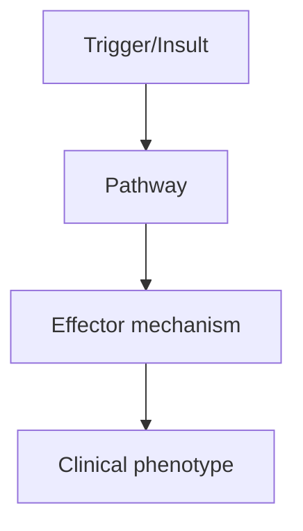
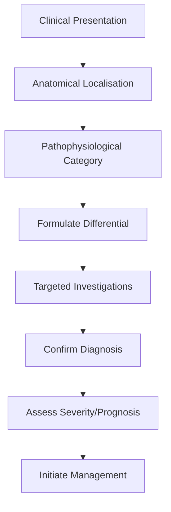
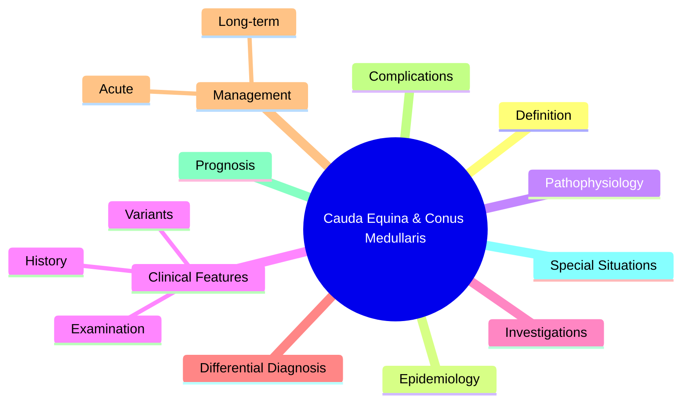

# Cauda Equina & Conus Medullaris Syndromes

> [!tip] **High-Yield Definition**
> Cauda equina syndrome (CES): compression of lumbosacral nerve roots (L2-S5) below the conus medullaris (which ends at L1). Conus medullaris syndrome: lesion at T12-L2 affecting the terminal cord. Both are neurosurgical emergencies.

---

## 1. Definition / Epidemiology / Classification

### Definition
Cauda equina syndrome (CES): compression of lumbosacral nerve roots (L2-S5) below the conus medullaris (which ends at L1). Conus medullaris syndrome: lesion at T12-L2 affecting the terminal cord. Both are neurosurgical emergencies.

### Epidemiology
Incidence: 1-3 per 100,000. Most common causes: large central disc herniation (L4/5, L5/S1), spinal stenosis, tumour (metastasis, ependymoma, schwannoma), epidural abscess, haematoma, trauma.

### Classification
| Variant | Key Features | Prognosis |
|---------|-------------|-----------|
| | | |

---

## 2. Aetiology / Pathophysiology

### Aetiology
Disc herniation (most common), spinal stenosis, tumour (metastases, ependymoma, schwannoma, meningioma), epidural abscess, haematoma (anticoagulation, epidural), trauma, ankylosing spondylitis, post-operative.

### Pathophysiology

---

## 3. Clinical Features

### History
- **Onset/Duration:**
- **Progression:**
- **Key symptoms:**
- **Triggers:**
- **Systemic symptoms:**
- **Drug/Family/Social history:**

### Examination
| Domain | Key Findings | Localisation Value |
|--------|-------------|-------------------|
| | | |

### Specific Clinical Features
Saddle anaesthesia (S2-S4), bilateral leg pain/weakness, bladder dysfunction (retention > incontinence), bowel dysfunction, reduced anal tone, sexual dysfunction, perianal sensation loss. Conus medullaris: mixed UMN/LMN signs, early bowel/bladder.

---

## 4. Diagnostic Approach / Algorithm

---

## 5. Investigations

EMERGENCY MRI whole spine within hours; CT if MRI contraindicated; do not delay for LP. Urodynamics post-op. Inflammatory markers if abscess suspected.

---

## 6. Differential Diagnosis

| Differential | Distinguishing Features | Key Test |
|--------------|------------------------|----------|
| | | |

---

## 7. Management

EMERGENCY surgical decompression within 24-48h (ideally <24h for best bladder recovery). High-dose IV dexamethasone if tumour suspected. Antibiotics for abscess. Cauda equina is a surgical emergency - time-critical.

---

## 8. Drug Interactions / Contraindications / Comorbidity Cautions

| Drug | Interaction / Caution | Management |
|------|----------------------|------------|
| | | |

---

## 9. Procedures (if applicable)

### Procedure:
- **Indications:**
- **Contraindications:**
- **Preparation / Principle:**
- **Complications:**
- **Viva Pearls:**

---

## 10. Complications

| Complication | Frequency | Prevention / Monitoring | Management |
|--------------|-----------|------------------------|------------|
| | | | |

---

## 11. Red Flags / Emergencies

Acute urinary retention with overflow incontinence, saddle anaesthesia, bilateral sciatica, loss of anal tone - all require IMMEDIATE MRI and surgical referral.

---

## 12. Prognosis

Best outcomes with decompression <24h, especially for bladder function. CES-I (incomplete) better than CES-R (retention) vs CES-S (saddle anaesthesia only). Bladder recovery 50-70% if <48h, poor if >48h.

---

## 13. Topic Correlation

| Related Topic | Link | Key Overlap |
|---------------|------|-------------|
| | | |

---

## 14. Special Situations

| Situation | Consideration |
|-----------|---------------|
| **Pregnancy** | |
| **Lactation** | |
| **Paediatric** | |
| **Elderly / Frail** | |
| **Renal impairment** | |
| **Hepatic impairment** | |
| **Immunocompromised** | |
| **Perioperative** | |
| **Driving / DVLA** | |
| **Occupational** | |

---

## FCPS/MRCP High-Yield Summary

| Category | Key Points |
|----------|------------|
| **Definition** | Cauda equina syndrome (CES): compression of lumbosacral nerve roots (L2-S5) below the conus medullaris (which ends at L1). Conus medullaris syndrome: lesion at T12-L2 affecting the terminal cord. Both |
| **Epidemiology** | Incidence: 1-3 per 100,000. Most common causes: large central disc herniation (L4/5, L5/S1), spinal stenosis, tumour (metastasis, ependymoma, schwanno |
| **Pathophysiology** | |
| **Clinical** | Saddle anaesthesia (S2-S4), bilateral leg pain/weakness, bladder dysfunction (retention > incontinence), bowel dysfunction, reduced anal tone, sexual dysfunction, perianal sensation loss. Conus medull |
| **Diagnosis** | |
| **Investigations** | EMERGENCY MRI whole spine within hours; CT if MRI contraindicated; do not delay for LP. Urodynamics post-op. Inflammatory markers if abscess suspected. |
| **Management** | EMERGENCY surgical decompression within 24-48h (ideally <24h for best bladder recovery). High-dose IV dexamethasone if tumour suspected. Antibiotics for abscess. Cauda equina is a surgical emergency - |
| **Complications** | |
| **Prognosis** | Best outcomes with decompression <24h, especially for bladder function. CES-I (incomplete) better than CES-R (retention) vs CES-S (saddle anaesthesia only). Bladder recovery 50-70% if <48h, poor if >4 |
| **Viva Pearls** | |
| **Drug Doses** | |
| **Scoring Systems** | |
| **Genetics** | |
| **Imaging Signs** | |

---

## Viva Questions (PACES/FCPS Style)

1. **Q:** Define Cauda Equina & Conus Medullaris Syndromes and classify its variants.
   **A:** Based on the definition above.

2. **Q:** What are the key clinical features?
   **A:** Saddle anaesthesia (S2-S4), bilateral leg pain/weakness, bladder dysfunction (retention > incontinence), bowel dysfunction, reduced anal tone, sexual dysfunction, perianal sensation loss. Conus medullaris: mixed UMN/LMN signs, early bowel/bladder.

3. **Q:** What is the first-line treatment?
   **A:** Based on the management section.

4. **Q:** What are the red flags requiring urgent referral?
   **A:** Acute urinary retention with overflow incontinence, saddle anaesthesia, bilateral sciatica, loss of anal tone - all require IMMEDIATE MRI and surgical referral.

5. **Q:** What is the prognosis?
   **A:** Best outcomes with decompression <24h, especially for bladder function. CES-I (incomplete) better than CES-R (retention) vs CES-S (saddle anaesthesia only). Bladder recovery 50-70% if <48h, poor if >48h.

6. **Q:** How do you differentiate Cauda Equina & Conus Medullaris Syndromes from key differentials?
   **A:** Clinical features, investigations, and response to treatment.

7. **Q:** What investigations are most useful?
   **A:** Based on the investigations section.

8. **Q:** Describe the stepwise management approach.
   **A:** Based on the management algorithm.

9. **Q:** What are the emergency presentations?
   **A:** Based on the red flags section.

10. **Q:** How does management change in pregnancy/paediatrics/elderly?
    **A:** Special considerations per population.

---

## Common Confusions / Exam Traps

| Confusion | Clarification |
|-----------|---------------|
| | |

---

## Mnemonics
1. **CES 3 S's** — **S**addle anaesthesia, **S**phincter loss, **S**ciatica: emergency MRI
1. **CONUS EARLY** — **C**onus = **EARLY** bladder, **EARLY** bowel, **EARLY** saddle (T12-L2)
1. **CAUDA LATE** — Cauda = **LATE** bladder, asymmetric, LMN only, areflexic

---

## Mind Map

---

## Spaced Repetition Trackers

| Review Interval | Date | Score (0-5) | Notes |
|-----------------|------|-------------|-------|
| Day 1 | | | |
| Day 3 | | | |
| Day 7 | | | |
| Day 14 | | | |
| Day 30 | | | |
| Day 90 | | | |

---

## Self-Test Scorecard

| Section | Score /5 | Last Attempt |
|---------|----------|--------------|
| Definition & Epidemiology | | |
| Pathophysiology | | |
| Clinical Features | | |
| Investigations | | |
| Differential Diagnosis | | |
| Management | | |
| Complications & Prognosis | | |
| Viva Questions | | |
| MCQs | | |
| SBAs | | |

---

## MCQs (10)

1. **Question:** Cauda equina syndrome is:
   **Options:** A. Surgical emergency (urgent MRI + decompression) B. Medical emergency C. Self-limiting D. Always traumatic
   **Answer:** A
   **Explanation:** Surgical emergency. Decompression <24-48h improves outcomes.

2. **Question:** Cauda equina involves:
   **Options:** A. Peripheral nerves below conus (LMN only) B. Spinal cord (UMN) C. Brainstem D. Cortex
   **Answer:** A
   **Explanation:** Pure LMN. Asymmetric, areflexic, radicular pain.

3. **Question:** Earliest sign of cauda equina:
   **Options:** A. Saddle anaesthesia B. Headache C. Visual loss D. Facial weakness
   **Answer:** A
   **Explanation:** Saddle anaesthesia (S2-S4) is the classic early sign.

4. **Question:** Conus medullaris bladder dysfunction:
   **Options:** A. Early urinary retention B. Late retention C. No bladder issue D. Frequency only
   **Answer:** A
   **Explanation:** Conus = sacral segments. Early bladder.

5. **Question:** Most common cause of cauda equina syndrome:
   **Options:** A. Large central L4/5 or L5/S1 disc herniation B. Spinal cord tumour C. Brain mass D. Cerebellar lesion
   **Answer:** A
   **Explanation:** Most common = large central disc herniation.

6. **Question:** Best surgical outcome if decompression within:
   **Options:** A. 24-48 hours B. 1 week C. 2 weeks D. 1 month
   **Answer:** A
   **Explanation:** <24h ideal; 24-48h reasonable; >48h poor bladder recovery.

7. **Question:** Cauda equina is areflexic because:
   **Options:** A. Peripheral nerves (no UMN reflex arc) B. Spinal cord lesion C. Brain lesion D. Muscle disease
   **Answer:** A
   **Explanation:** Pure LMN = peripheral nerves. Reflexes lost (areflexic).

8. **Question:** Conus medullaris vs cauda equina - conus is:
   **Options:** A. Symmetric, early bladder, mixed UMN/LMN B. Asymmetric, late bladder, LMN only C. Brain lesion D. Cerebellar
   **Answer:** A
   **Explanation:** Conus: mixed UMN/LMN, early bladder, symmetric saddle.

---

## SBA Questions (10)

1. **Scenario:** Bilateral sciatica, saddle anaesthesia, urinary retention. Next step?
   **Options:** A. MRI lumbosacral spine urgently B. CT head C. Wait for improvement D. Bedrest E. Oral steroids
   **Answer:** A
   **Explanation:** Classic CES. MRI urgent → surgical decompression if confirmed.

2. **Scenario:** 6h post-CES decompression, no bladder function. Prognosis?
   **Options:** A. Bilateral complete CES has poor bladder prognosis B. Full recovery guaranteed C. Always need catheter D. No recovery possible E. Other option
   **Answer:** A
   **Explanation:** Bilateral complete retention >48h → poor bladder recovery.

3. **Scenario:** Saddle anaesthesia, urinary retention, no motor weakness. CES or conus?
   **Options:** A. Cauda equina (but atypical - no motor) B. Conus medullaris C. Peripheral neuropathy D. Spinal cord compression E. Polyradiculopathy
   **Answer:** A
   **Explanation:** Saddle + retention is enough to suspect CES regardless of motor. MRI urgently.

---

## Tags

**Tags:** #neurology #spinal-cord #cauda-equina #conus-medullaris #emergency #CES #FCPS #MRCP

---

## Local Navigation
**Heading Hub:** [[../Emergency Approach Hub]]
**Chapter Hierarchy:** [[../../Davidson Chapter 25 - Neurology Hierarchy]]
**Chapter MOC:** [[../../Neurology MOC]]
**Drug Reference:** [[../../00_Index/Neurology Drug Reference]]