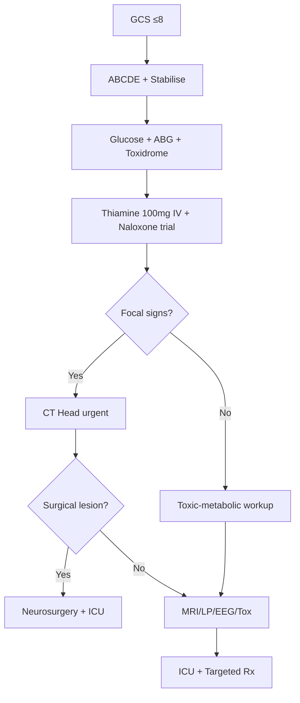

# Coma Assessment & Management

> [!tip] **Definition & Mnemonic**
> **Coma:** GCS ≤8, eyes closed, unrousable, no sleep-wake cycles.
> **Differentiate:** Stupor | Vegetative State (VS, wakefulness no awareness ≥1 month) | Minimally Conscious State (MCS, reproducible purposeful behaviour) | Locked-in (awake, vertical eye movements only) | Brain Death (apnoea + absent brainstem reflexes).
> **Causes: TIPS-AEIOU** — Trauma, Infection, Psychogenic, Stroke, Alcohol/Airway, Epilepsy, Insulin, Opiates/Uraemia.

## 1. Definition / Epidemiology / Classification

### Epidemiology
- 30-50/100,000/year; ~5% medical admissions
- Causes: Stroke 25-30%, toxic-metabolic 25-30%, trauma 15-20%, anoxia 10-15%, CNS infection 5-10%, NCSE 5%
- Mortality 25-90% (anoxic worst ~80%)

### Classification
| Type | Key Features | Prognosis |
|------|--------------|-----------|
| **Supratentorial structural** | Mass effect, focal signs, asymmetric pupils, rostro-caudal deterioration | Surgical candidates do well |
| **Infratentorial structural** | Brainstem signs, pinpoint/mid-position pupils, CN palsies | High mortality |
| **Diffuse metabolic-toxic** | Symmetric reactive pupils, preserved brainstem reflexes, myoclonus/asterixis | Often reversible |
| **Psychogenic** | Eyelash reflex preserved, eye closure resistance, normal EEG | Good |

## 2. Aetiology / Pathophysiology
- **Supratentorial:** ICH, SAH, subdural/epidural, large MCA infarct, tumour, abscess, venous sinus thrombosis
- **Infratentorial:** Basilar thrombosis, pontine haemorrhage, cerebellar mass, central pontine myelinolysis
- **Diffuse-metabolic:** Hypoglycaemia, DKA/HHS, hepatic, renal, respiratory, thiamine deficiency (Wernicke)
- **Diffuse-toxic:** Alcohol, BZD, opioids, TCAs, CO, methanol
- **Diffuse-infectious:** Meningitis, encephalitis (HSV, autoimmune), sepsis encephalopathy
- **Diffuse-seizure:** Post-ictal, non-convulsive SE (NCSE)
- **Other:** Hypothermia (<32°C), hyperthermia, PRES, RCVS

**Pathophysiology:** Coma requires **bilateral hemispheric** or **Ascending Reticular Activating System (ARAS)** dysfunction (brainstem cholinergic/noradrenergic projections → thalamus → cortex).

## 3. Clinical Features

### History (collateral — crucial)
- **Onset:** Sudden (vascular, seizure, arrest) vs progressive (metabolic, infection)
- **Preceding:** Headache (SAH, meningitis), fever, neck pain, diplopia, vertigo
- **Past:** Diabetes, epilepsy, cirrhosis, dialysis, cardiac, addiction, depression

### Examination — Localisation
| Domain | Key Findings | Localisation |
|--------|--------------|--------------|
| **GCS** | E/V/M; ≤8 = intubate | Severity |
| **FOUR score** | Eye, Motor, Brainstem, Respiration (0-16) | Better for intubated |
| **Pupils** | Size, reactivity, symmetry | **Anisocoria >1mm** = uncal; bilateral fixed dilated = anoxia/herniation; pinpoint reactive = pontine/opioid |
| **Corneal** | CN V→VII | Pons |
| **Oculocephalic (doll's)** | Eyes move opposite to head turn | Cortex→brainstem |
| **Caloric (oculovestibular)** | Cold water → nystagmus opposite | Pons/medulla; absent = severe brainstem dysfunction |
| **Gag/Cough** | CN IX/X | Medulla |
| **Apnoea test** | Off vent, PCO2 rise | Brain death |

### Breathing Patterns
| Pattern | Lesion |
|---------|--------|
| Cheyne-Stokes | Bilateral hemispheric/diencephalic |
| Central neurogenic hyperventilation | Midbrain |
| Apneustic | Pons |
| Ataxic (Biot's) | Medulla (imminent arrest) |

## 4. Diagnostic Approach / Algorithm

### Scoring Systems
- **GCS** 3-15; ≤8 = coma
- **FOUR** (Eye/Motor/Brainstem/Respiration) — includes brainstem; intubated-friendly
- **CRS-R** — for VS/MCS assessment

## 5. Investigations

### Immediate (parallel with stabilisation)
- **Capillary glucose** — ALWAYS FIRST
- **ABG/VBG** — pH, PCO2, lactate, CO-Hb, Met-Hb, electrolytes
- **Bedside ECG** — QT, arrhythmia, hyperkalaemia
- **Toxidrome exam** — pupils, RR, skin, mental status

### Urgent (within 1-2h)
- **CT head (non-contrast):** All unexplained coma
- **CT angiography:** Basilar occlusion, dissection, aneurysm
- **Bloods:** FBC, U&E, LFT, ammonia, lactate, CK, troponin, coagulation, toxicology, AED levels
- **Lumbar puncture:** Febrile, meningism, immunocompromised (after CT)
- **cEEG:** Unexplained coma (rule out NCSE)
- **MRI brain:** CT negative; brainstem stroke, encephalitis, Wernicke (mammillary bodies), DWI for anoxic injury

### Specific
- **Autoimmune encephalitis:** CSF/serum antibodies (NMDA-R, LGI1, CASPR2, GABA-B, AMPAR)
- **Inborn error:** Ammonia, lactate, pyruvate, acylcarnitine, amino/organic acids
- **CO:** CO-Hb level
- **Vasculitis:** ESR, CRP, ANCA, ANA, CSF OCB

## 6. Differential Diagnosis

| Condition | Distinguishing Features | Key Test |
|-----------|------------------------|----------|
| **Locked-in syndrome** | Quadriplegia, anarthria, preserved consciousness, vertical eye movements | MRI ventral pons |
| **Vegetative state** | Wakefulness, no awareness ≥1 month; sleep-wake cycles | CRS-R |
| **MCS** | Reproducible but inconsistent purposeful behaviour | CRS-R |
| **Akinetic mutism** | Alert but mute, no spontaneous movement | MRI (frontal/cingulate) |
| **Psychogenic** | Eyelash reflex, eye closure resistance, normal awake EEG | EEG, formal psychiatry |
| **Brain death** | Apnoea + absent brainstem reflexes + irreversible cause | UK Code testing |
| **Catatonia** | Waxy flexibility, posturing, responds to lorazepam | DSM-5; lorazepam trial |

## 7. Management

### Emergency Algorithm (time-critical)
| Time | Action |
|------|--------|
| **T=0** | ABCDE + **intubate** if GCS ≤8 (RSI: ketamine/propofol + rocuronium); O2 100%; 2× IV; NGT + IDC |
| **T=0-5 min** | **Glucose**: <4 → 50ml 50% dextrose + **Thiamine 100mg IV** (before dextrose if malnourished/alcoholic); Naloxone 0.4-2mg IV if opioid features |
| **T=5-30 min** | Stabilise: MAP>70, T<37.5°C, normoglycaemia, PaCO2 35-40, SpO2>94%, Na+ 140-150 |
| **T=30-60 min** | CT head, treat raised ICP, targeted aetiological Rx |

### Raised ICP Management
| Step | Intervention |
|------|-------------|
| **Tier 1** | Head up 30°, midline neck, normocapnia, **Mannitol 20% 100-200ml IV** OR **3% NaCl 150-250ml IV** |
| **Tier 2** | Sedation/analgesia, NMJ blockade, brief hyperventilation (PaCO2 30-35), EVD |
| **Tier 3** | Decompressive craniectomy, barbiturate coma, hypothermia |

### Targeted Treatments
| Cause | Rx |
|-------|-----|
| Opioid | Naloxone 0.4-2mg IV (titrate; infusion if long-acting) |
| BZD | Flumazenil 0.2mg IV (CAUTION — chronic BZD/TCA) |
| Hypoglycaemia | 50ml 50% dextrose + Thiamine |
| Wernicke | Thiamine 100mg IV TDS ×3 days |
| HSV encephalitis | Acyclovir 10mg/kg IV TDS ×14-21d |
| Bacterial meningitis | Ceftriaxone 2g IV BD + Dexamethasone 10mg IV QDS ± Ampicillin |
| TCA overdose | NaHCO3 8.4% 100ml bolus (wide QRS) |
| Methanol | Ethanol or fomepizole + haemodialysis |
| β-blocker/CCB | Glucagon, high-dose insulin/dextrose, lipid emulsion |
| Basilar thrombosis | IV thrombolysis + mechanical thrombectomy (urgent) |
| Cerebellar mass | Posterior fossa decompression |
| SAH | Nimodipine 60mg 4-hourly PO ×21d; secure aneurysm |

## 8. Drug Interactions / Cautions

| Drug | Caution |
|------|---------|
| Naloxone | Short t½ vs long-acting opioids — re-sedation risk; titrate, don't bolus in chronic users |
| Flumazenil | **CONTRAINDICATED** in chronic BZD users, TCA overdose, seizure disorder |
| Mannitol | Renal failure (osmotic nephrosis), hypovolaemia (rebound ICP) |
| Hypertonic saline | Central line (3-23%); volume overload, hypernatraemia |
| Thiopental | Hypotension, cardiac depression |
| Propofol | Propofol Infusion Syndrome (>4mg/kg/hr >48h) |
| Dextrose | **Always thiamine first** in alcoholics (precipitates Wernicke's) |

## 9. Procedures
### Lumbar Puncture in Coma
- **Indication:** Febrile, meningism, immunocompromised, SAH (CT negative)
- **CT first** to exclude raised ICP/mass; LP contraindicated if papilloedema, focal deficit, GCS ≤12 with focal signs, coagulopathy, platelets <50

### Brainstem Death Testing (UK Code)
- **Preconditions:** Apnoeic on vent; irreversible cause; exclude confounders (drugs ≤4 half-lives, T>34°C, Na+>115, no severe metabolic/endocrine disturbance)
- **Clinical tests (2 doctors):** (1) Pupils fixed, no corneal reflex; (2) No motor response above foramen magnum; (3) No gag/cough; (4) No eye movements on caloric; (5) Apnoea: PaCO2 ≥6.0 kPa with no respiratory effort
- **Ancillary** (if clinical impossible): EEG, SSEP, TCD, CT/MR angiography

### Continuous EEG (cEEG)
- Indication: Unexplained coma, post-cardiac arrest, RSE; duration 24-48h

## 10. Complications

| Complication | Frequency | Management |
|--------------|-----------|------------|
| Aspiration pneumonia | 20-30% | Early intubation, NGT, head elevation |
| DVT/PE | 5-15% | Mechanical + LMWH (if no ICH) |
| Pressure ulcers | Common | 2-hourly turning |
| VAP | High | VAP bundle, daily sedation holds |
| Contractures | Long-term | Physiotherapy, splints |

## 11. Red Flags / Emergencies
| Red Flag | Immediate Action |
|----------|------------------|
| GCS ≤8 / Falling GCS | Intubate, ICU |
| Anisocoria >1mm | Urgent CT — uncal herniation |
| Bilateral fixed dilated pupils | Severe anoxia/herniation |
| Cushing's triad (HTN + bradycardia + irregular RR) | Imminent herniation — hyperosmolar therapy, neurosurgery |
| Pinpoint reactive + tetraplegia | Pontine lesion; naloxone trial; MRI |
| Cerebellar signs | Urgent CT — risk of brainstem compression |
| Fever + Coma | Empirical antibiotics + acyclovir + LP |

## 12. Prognosis
| Factor | Good | Poor |
|--------|------|------|
| Cause | Toxic-metabolic (reversible) | Anoxia, massive stroke, brainstem haemorrhage |
| Duration | <6h reversible | >24h with structural cause |
| Pupils | Reactive | Fixed dilated (especially 24-72h post-arrest) |
| Motor | Localising | Decerebrate / none |
| cEEG/SSEP/NSE | Normal | Malignant / absent N20 / NSE>33 |

- **Post-anoxic:** Bilateral absent N20 SSEP + absent pupillary/corneal reflexes at 72h = poor outcome (highest specificity)
- **VS:** <1% recovery after 12 months (traumatic), 3 months (non-traumatic)

## 13. Topic Correlation
| Related Topic | Key Overlap |
|---------------|-------------|
| Status Epilepticus | NCSE as cause of unexplained coma |
| Stroke | Large hemispheric, basilar, cerebellar infarct |
| CNS Infections | Febrile coma; empirical Rx; LP timing |
| Brain Death | Irreversible coma; UK Code |
| Metabolic Encephalopathy | Most common non-structural cause |

## 14. Special Situations
| Situation | Consideration |
|-----------|---------------|
| Pregnancy | Eclampsia (MgSO4); LMWH prophylaxis |
| Paediatric | Non-accidental injury, inborn errors, Reye's |
| Elderly | Polypharmacy, subdural (cerebral atrophy) |
| Renal | Uraemic encephalopathy; avoid nephrotoxic drugs |
| Hepatic | Coagulopathy (LP contraindicated); Wilson's in young |
| Immunocompromised | Toxoplasmosis, PML, fungal, TB, CMV |
| DVLA | Restrictions depend on cause; 6-12 months if seizure |

## FCPS/MRCP High-Yield Summary
| Category | Key Points |
|----------|------------|
| Definition | GCS ≤8, no wakefulness, no awareness |
| Aetiology | TIPS-AEIOU; stroke, metabolic, trauma, anoxia |
| Pathophysiology | Bilateral cortex OR ARAS damage |
| Clinical | GCS/FOUR; pupils (anisocoria = herniation, pinpoint = pontine/opioid) |
| Diagnosis | Glucose first, CT, ABG, tox, EEG (NCSE), MRI brainstem |
| Management | ABCDE + intubate if GCS ≤8; glucose+thiamine; naloxone; raised ICP = head up + mannitol/HTS |
| Drug Doses | Thiamine 100mg IV; Naloxone 0.4-2mg; Mannitol 200ml 20%; 3% NaCl 250ml; Acyclovir 10mg/kg TDS |
| Scoring | GCS, FOUR, CRS-R |
| Imaging | Mammillary body T2/FLAIR (Wernicke); basal ganglia T1 (hepatic); H-shaped pons (CPM) |

## Viva Questions
1. **Q:** Define coma vs VS/MCS/locked-in/brain death.
   **A:** Coma = GCS ≤8, eyes closed. VS = wakefulness no awareness ≥1 month. MCS = inconsistent but reproducible purposeful behaviour. Locked-in = awake, vertical eye movements only. Brain death = apnoea + absent brainstem reflexes.
2. **Q:** Approach to unconscious patient? **A:** ABCDE → Glucose → Thiamine before dextrose if risk → Naloxone if opioid → ABG, ECG, toxidrome → CT head → ICU.
3. **Q:** What does asymmetric pupil indicate? **A:** Uncal herniation — ipsilateral CN III palsy (blown, fixed); urgent CT/neurosurgery.
4. **Q:** Why FOUR score better than GCS for intubated? **A:** Includes brainstem reflexes + respiration.
5. **Q:** When to suspect NCSE? **A:** Unexplained prolonged coma, fluctuating consciousness with subtle myoclonus, post-arrest myoclonus. Confirm with **Salzburg criteria on cEEG**.
6. **Q:** Apnoea test procedure? **A:** Disconnect vent, deliver 100% O2 at 6 L/min. Confirmed if no respiratory effort as PaCO2 ≥6.0 kPa over 5-10 min.
7. **Q:** Brain death preconditions? **A:** Irreversible cause; exclude confounders (drugs ≤4 half-lives, hypothermia, severe metabolic/endocrine); apnoeic; 2 doctors independently.
8. **Q:** When is flumazenil contraindicated? **A:** Chronic BZD users, TCA overdose, mixed overdose, seizure disorder.
9. **Q:** Differentiate metabolic vs structural coma. **A:** Metabolic: symmetric reactive pupils, preserved brainstem reflexes, asterixis, no focal signs, normal CT. Structural: focal signs, asymmetric pupils, abnormal brainstem reflexes.
10. **Q:** Post-cardiac arrest prognostication? **A:** Wait ≥72h. Bilateral absent N20 SSEP + absent pupillary/corneal reflexes = poor outcome (highest specificity).
11. **Q:** Management of raised ICP. **A:** Tier 1: head up 30°, osmotherapy (mannitol/HTS). Tier 2: sedation, paralysis, hyperventilation, EVD. Tier 3: craniectomy, barbiturate coma, hypothermia.
12. **Q:** Pupillary patterns in coma? **A:** Reactive symmetric = metabolic; unilateral dilated = uncal; bilateral fixed dilated = anoxia/herniation; pinpoint reactive = pontine or opioid; mid-position fixed = midbrain.

## Common Confusions / Exam Traps
| Confusion | Clarification |
|-----------|---------------|
| Coma vs VS | Coma = no eye opening; VS = eye opening but no awareness |
| Locked-in | **AWARE** — vertical eye movements/blinking preserved |
| Brain death vs VS | Brain death = no brainstem reflexes + apnoea; VS = sleep-wake cycles |
| Mannitol vs HTS | Mannitol = volume depletion (avoid if hypotensive); HTS = volume expansion |
| Thiamine first | Always before dextrose in alcoholics (prevents Wernicke's) |
| Flumazenil | Seizures in chronic BZD/TCA users; avoid unless pure BZD overdose |
| Post-anoxic myoclonus | Lance-Adams = chronic (good); post-hypoxic = acute (poor) |
| Cushing's triad | HTN + bradycardia + irregular RR = LATE raised ICP sign |

## Mnemonics
1. **TIPS-AEIOU** — **T**rauma, **I**nfection, **P**sychogenic, **S**troke, **A**lcohol/Airway, **E**pilepsy, **I**nsulin, **O**piates, **U**raemia
2. **GCS 8 = INTUBATE** — Airway protection
3. **FORE** — **F**OUR score: **E**ye, **M**otor, **B**rainstem, **R**espiration
4. **Pinpoint = Pontine OR Pusher** (opiate)

## MCQs (10)
1. **Q:** 55-year-old unresponsive, GCS 5, pupils 1mm reactive, RR 6. Most likely cause?
   **Options:** A. SAH B. Basilar thrombosis C. Opioid overdose D. Hepatic E. Cord lesion
   **Answer:** C — Opioid toxidrome; naloxone.
2. **Q:** Pupil pattern most consistent with uncal herniation?
   **Options:** A. Bilateral pinpoint reactive B. Bilateral fixed dilated C. Unilateral dilated fixed D. Mid-position fixed E. Bilateral reactive
   **Answer:** C — Uncal herniation compresses CN III → blown pupil.
3. **Q:** Elderly on warfarin falls, GCS drops 14→8, CT: crescent-shaped hyperdensity. Diagnosis?
   **Options:** A. Extradural B. Acute subdural C. Chronic subdural D. SAH E. Contusion
   **Answer:** B — Acute subdural (crescent, crosses sutures).
4. **Q:** Best scoring for coma in intubated patient?
   **Options:** A. GCS B. FOUR C. NIHSS D. ABCD2 E. SOFA
   **Answer:** B — FOUR includes brainstem; intubated-friendly.
5. **Q:** Diabetic GCS 6, glucose "low." Immediate management?
   **Options:** A. Dextrose after thiamine B. Dextrose alone C. Glucagon IM D. Mannitol E. Naloxone
   **Answer:** A — Dextrose with thiamine first if risk.
6. **Q:** Most reliable predictor of poor outcome post-arrest at 72h?
   **Options:** A. Absent pupillary reflex B. Absent corneal reflex C. Bilateral absent N20 SSEP D. Status myoclonus E. Burst suppression EEG
   **Answer:** C — Bilateral absent N20 = most specific (AAN 2015).
7. **Q:** Cerebellar haematoma >3cm, deteriorating consciousness — definitive Rx?
   **Options:** A. Mannitol B. Anticoagulation reversal C. Posterior fossa decompression D. EVD alone E. Thrombolysis
   **Answer:** C — Cerebellar mass = surgical decompression.
8. **Q:** Postpartum, seizures, bilateral thalamic hypodensity. Cause?
   **Options:** A. Eclampsia B. PRES C. CVST D. HELLP E. Vasculitis
   **Answer:** C — Postpartum bilateral thalamic = deep cerebral venous thrombosis.
9. **Q:** Cushing's triad in head injury indicates:
   **Options:** A. Hypovolaemic shock B. Brainstem herniation C. Spinal shock D. Sympathetic storm E. Vagal overactivity
   **Answer:** B — Late sign of raised ICP/impending herniation.
10. **Q:** Apnoea test threshold for brain death?
    **Options:** A. PaCO2 ≥4.5 kPa B. PaCO2 ≥6.0 kPa C. PaCO2 ≥8.0 kPa D. PaO2 <8 kPa E. pH <7.0
    **Answer:** B — PaCO2 ≥6.0 kPa (45-50 mmHg).

## SBA Questions (10)
1. **Scenario:** 60y, GCS 4, pinpoint pupils, RR 6, SpO2 85%.
   **Q:** First-line drug?
   **Options:** A. Flumazenil B. Naloxone C. Atropine D. Glucagon E. Adrenaline
   **Answer:** B — Naloxone titrated.
2. **Scenario:** 35y alcoholic comatose, glucose 2.5 mmol/L.
   **Q:** Correct sequence?
   **Options:** A. Dextrose then thiamine B. Thiamine then dextrose C. Naloxone then dextrose D. Glucagon then thiamine E. Mannitol then dextrose
   **Answer:** B — Thiamine 100mg IV **before** dextrose.
3. **Scenario:** 70y sudden coma, BP 230/120, bradycardia 50, irregular RR, right pupil 6mm fixed.
   **Q:** Diagnosis?
   **Options:** A. Brainstem stroke B. Cerebellar infarct C. Uncal herniation D. SE E. Brain death
   **Answer:** C — Cushing's + blown pupil = uncal herniation.
4. **Scenario:** 25y IVDU, fever, neck stiffness, GCS 9, normal CT.
   **Q:** Empirical Rx?
   **Options:** A. Acyclovir B. Ceftriaxone + ampicillin + dexamethasone C. Penicillin V D. Anticoagulation E. Anti-TB
   **Answer:** B — Bacterial meningitis (Listeria cover).
5. **Scenario:** 45y post-arrest, GCS 3, pupils 4mm fixed, off sedation 72h. cEEG: GPDs 1Hz. Bilateral absent N20.
   **Q:** Prognosis?
   **Options:** A. Good B. Poor (death/vegetative) C. Locked-in likely D. Uncertain, need MRI E. Need repeat EEG
   **Answer:** B — Bilateral absent N20 + absent pupils + malignant EEG = poor.
6. **Scenario:** 28y, confusion, agitation, seizures, GCS 4. CT: bilateral thalamic oedema. LP: lymphocytic, normal glucose, OCB+.
   **Q:** Diagnosis?
   **Options:** A. HSV B. Japanese encephalitis C. Anti-NMDA-R encephalitis D. CVST E. ADEM
   **Answer:** C — Anti-NMDA-R encephalitis.
7. **Scenario:** 80y, subdural 12mm, post-burr hole, GCS 6, ICP 35mmHg.
   **Q:** First-line hyperosmolar Rx?
   **Options:** A. 0.9% saline B. 5% dextrose C. Mannitol 20% 200ml OR 3% saline 250ml D. Hypotonic fluids E. IV furosemide
   **Answer:** C — Hyperosmolar therapy.
8. **Scenario:** GCS 6 ventilated patient, sudden BP 80/50, HR 40, irregular RR. Pupils now 5mm fixed bilaterally.
   **Q:** Diagnosis?
   **Options:** A. Spinal shock B. Brainstem herniation C. Cardiac arrhythmia D. Brain death E. SAH
   **Answer:** B — Terminal Cushing's = brainstem herniation.
9. **Scenario:** Locked-in syndrome from basilar thrombosis.
   **Q:** What confirms preserved awareness?
   **Options:** A. Spontaneous eye opening B. Vertical eye movements + blinking on command C. Sleep-wake cycles D. Withdrawal to pain E. Brainstem reflexes
   **Answer:** B — Vertical eye movements + blinking on command.
10. **Scenario:** 22y diabetic, GCS 7, glucose 35, ketones 4+, pH 7.10.
    **Q:** Immediate management?
    **Options:** A. Mannitol B. Insulin infusion C. IV fluids + insulin D. NaHCO3 E. Antibiotics
    **Answer:** C — DKA: fluids + insulin + K+.

## Flashcards
- **Q:** GCS threshold for intubation? **A:** ≤8.
- **Q:** Asymmetric dilated pupil in coma? **A:** Uncal herniation compressing CN III.
- **Q:** FOUR score best for? **A:** Intubated patients.
- **Q:** Most specific poor prognostic marker post-arrest? **A:** Bilateral absent N20 SSEP at 72h.
- **Q:** Cushing's triad? **A:** HTN + bradycardia + irregular RR.
- **Q:** Why thiamine before dextrose in alcoholics? **A:** Prevents Wernicke's.
- **Q:** Apnoea test PaCO2 threshold for brain death? **A:** ≥6.0 kPa.
- **Q:** Pinpoint reactive pupils suggest? **A:** Pontine lesion OR opioid.

## Answer Key

### MCQs
1. C | 2. C | 3. B | 4. B | 5. A | 6. C | 7. C | 8. C | 9. B | 10. B

### SBAs
1. B | 2. B | 3. C | 4. B | 5. B | 6. C | 7. C | 8. B | 9. B | 10. C

> **Local Navigation:** [[Emergency Approach Hub]], [[Fundamentals & Examination Hub]]