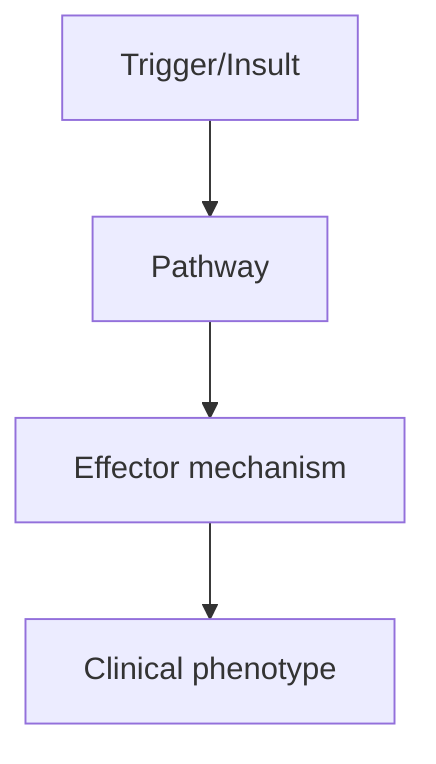
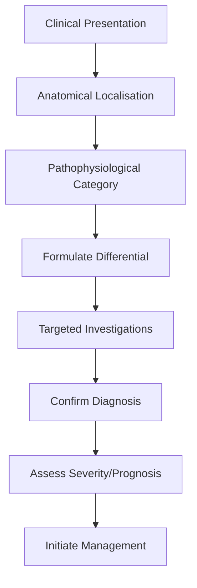
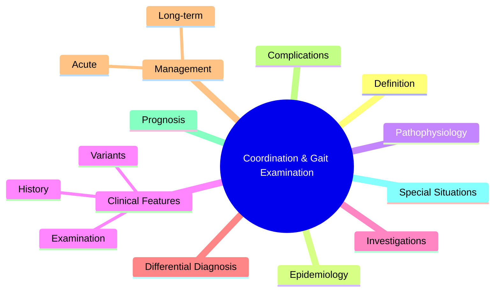

# Coordination & Gait Examination

> [!tip] **High-Yield Definition**
> Systematic examination of cerebellar function, proprioception, vestibular system, and gait. Critical for localising lesions in cerebellum, dorsal columns, peripheral nerves, basal ganglia, and frontal lobes.

---

## 1. Definition / Epidemiology / Classification

### Definition
Systematic examination of cerebellar function, proprioception, vestibular system, and gait. Critical for localising lesions in cerebellum, dorsal columns, peripheral nerves, basal ganglia, and frontal lobes.

### Epidemiology
N/A (clinical skill). Common in MS, stroke, PD, cerebellar degeneration, B12 deficiency, alcohol.

### Classification
| Variant | Key Features | Prognosis |
|---------|-------------|-----------|
| | | |

---

## 2. Aetiology / Pathophysiology

### Aetiology
Cerebellar ataxia: stroke, tumour, MS, paraneoplastic, alcohol, drugs (phenytoin), genetic (SCA, FA). Sensory ataxia: B12, copper, dorsal column disease, sensory neuropathy. Vestibular: vestibular neuritis, BPPV, Meniere's. Gait disorders: stroke, PD, NPH, frontal gait disorder.

### Pathophysiology

---

## 3. Clinical Features

### History
- **Onset/Duration:**
- **Progression:**
- **Key symptoms:**
- **Triggers:**
- **Systemic symptoms:**
- **Drug/Family/Social history:**

### Examination
| Domain | Key Findings | Localisation Value |
|--------|-------------|-------------------|
| | | |

### Specific Clinical Features
Cerebellar signs: dysmetria (finger-nose, heel-shin), intention tremor, dysdiadochokinesia, nystagmus (gaze-evoked), scanning speech, hypotonia, wide-based gait. Sensory ataxia: Romberg positive, high-stepping gait. Gait patterns: hemiplegic (circumducting), parkinsonian (shuffling, festination), ataxic (wide-based), spastic (scissor), waddling (proximal weakness), steppage (foot drop).

---

## 4. Diagnostic Approach / Algorithm

---

## 5. Investigations

MRI brain (cerebellum, brainstem, posterior fossa), MRI spine (cord), NCS/EMG (peripheral neuropathy), B12, copper, autoimmune, paraneoplastic, genetic testing.

---

## 6. Differential Diagnosis

| Differential | Distinguishing Features | Key Test |
|--------------|------------------------|----------|
| | | |

---

## 7. Management

Treat underlying cause. Physiotherapy, gait aids, occupational therapy. Vestibular rehabilitation for vestibular disorders.

---

## 8. Drug Interactions / Contraindications / Comorbidity Cautions

| Drug | Interaction / Caution | Management |
|------|----------------------|------------|
| | | |

---

## 9. Procedures (if applicable)

### Procedure:
- **Indications:**
- **Contraindications:**
- **Preparation / Principle:**
- **Complications:**
- **Viva Pearls:**

---

## 10. Complications

| Complication | Frequency | Prevention / Monitoring | Management |
|--------------|-----------|------------------------|------------|
| | | | |

---

## 11. Red Flags / Emergencies

Sudden onset ataxia (stroke), progressive ataxia (tumour, paraneoplastic, CJD), ataxia + headache + vomiting (raised ICP, posterior fossa lesion).

---

## 12. Prognosis

Depends on cause. Cerebellar stroke often improves. Genetic ataxias progressive. Vestibular disorders often self-limiting.

---

## 13. Topic Correlation

| Related Topic | Link | Key Overlap |
|---------------|------|-------------|
| | | |

---

## 14. Special Situations

| Situation | Consideration |
|-----------|---------------|
| **Pregnancy** | |
| **Lactation** | |
| **Paediatric** | |
| **Elderly / Frail** | |
| **Renal impairment** | |
| **Hepatic impairment** | |
| **Immunocompromised** | |
| **Perioperative** | |
| **Driving / DVLA** | |
| **Occupational** | |

---

## FCPS/MRCP High-Yield Summary

| Category | Key Points |
|----------|------------|
| **Definition** | Systematic examination of cerebellar function, proprioception, vestibular system, and gait. Critical for localising lesions in cerebellum, dorsal columns, peripheral nerves, basal ganglia, and frontal |
| **Epidemiology** | N/A (clinical skill). Common in MS, stroke, PD, cerebellar degeneration, B12 deficiency, alcohol. |
| **Pathophysiology** | |
| **Clinical** | Cerebellar signs: dysmetria (finger-nose, heel-shin), intention tremor, dysdiadochokinesia, nystagmus (gaze-evoked), scanning speech, hypotonia, wide-based gait. Sensory ataxia: Romberg positive, high |
| **Diagnosis** | |
| **Investigations** | MRI brain (cerebellum, brainstem, posterior fossa), MRI spine (cord), NCS/EMG (peripheral neuropathy), B12, copper, autoimmune, paraneoplastic, genetic testing. |
| **Management** | Treat underlying cause. Physiotherapy, gait aids, occupational therapy. Vestibular rehabilitation for vestibular disorders. |
| **Complications** | |
| **Prognosis** | Depends on cause. Cerebellar stroke often improves. Genetic ataxias progressive. Vestibular disorders often self-limiting. |
| **Viva Pearls** | |
| **Drug Doses** | |
| **Scoring Systems** | |
| **Genetics** | |
| **Imaging Signs** | |

---

## Viva Questions (PACES/FCPS Style)

1. **Q:** Define Coordination & Gait Examination and classify its variants.
   **A:** Based on the definition above.

2. **Q:** What are the key clinical features?
   **A:** Cerebellar signs: dysmetria (finger-nose, heel-shin), intention tremor, dysdiadochokinesia, nystagmus (gaze-evoked), scanning speech, hypotonia, wide-based gait. Sensory ataxia: Romberg positive, high-stepping gait. Gait patterns: hemiplegic (circumducting), parkinsonian (shuffling, festination), at

3. **Q:** What is the first-line treatment?
   **A:** Based on the management section.

4. **Q:** What are the red flags requiring urgent referral?
   **A:** Sudden onset ataxia (stroke), progressive ataxia (tumour, paraneoplastic, CJD), ataxia + headache + vomiting (raised ICP, posterior fossa lesion).

5. **Q:** What is the prognosis?
   **A:** Depends on cause. Cerebellar stroke often improves. Genetic ataxias progressive. Vestibular disorders often self-limiting.

6. **Q:** How do you differentiate Coordination & Gait Examination from key differentials?
   **A:** Clinical features, investigations, and response to treatment.

7. **Q:** What investigations are most useful?
   **A:** Based on the investigations section.

8. **Q:** Describe the stepwise management approach.
   **A:** Based on the management algorithm.

9. **Q:** What are the emergency presentations?
   **A:** Based on the red flags section.

10. **Q:** How does management change in pregnancy/paediatrics/elderly?
    **A:** Special considerations per population.

---

## Common Confusions / Exam Traps

| Confusion | Clarification |
|-----------|---------------|
| | |

---

## Mnemonics
1. **DANISH** — **D**ysdiadochokinesia, **A**taxia, **N**ystagmus, **I**ntention tremor, **S**canning speech, **H**ypotonia (cerebellar signs)
1. **TANDEM** — **T**an**d**em walking tests **cerebellar ataxia**
1. **NPH 3 W's** — **W**obbly, **W**et, **W**acky (gait, incontinence, dementia)

---

## Mind Map

---

## Spaced Repetition Trackers

| Review Interval | Date | Score (0-5) | Notes |
|-----------------|------|-------------|-------|
| Day 1 | | | |
| Day 3 | | | |
| Day 7 | | | |
| Day 14 | | | |
| Day 30 | | | |
| Day 90 | | | |

---

## Self-Test Scorecard

| Section | Score /5 | Last Attempt |
|---------|----------|--------------|
| Definition & Epidemiology | | |
| Pathophysiology | | |
| Clinical Features | | |
| Investigations | | |
| Differential Diagnosis | | |
| Management | | |
| Complications & Prognosis | | |
| Viva Questions | | |
| MCQs | | |
| SBAs | | |

---

## MCQs (10)

1. **Question:** Cerebellar signs include:
   **Options:** A. Dysmetria, intention tremor, dysdiadochokinesia B. Spasticity, hyperreflexia C. Wasting, fasciculations D. Sensory loss
   **Answer:** A
   **Explanation:** Cerebellar: dysmetria, intention tremor, dysdiadochokinesia, nystagmus, ataxic gait, scanning speech, hypotonia.

2. **Question:** Romberg positive in:
   **Options:** A. Sensory ataxia (dorsal column) B. Cerebellar ataxia C. Frontal ataxia D. Vestibular ataxia
   **Answer:** A
   **Explanation:** Romberg = proprioceptive loss. Sways/falls with eyes closed.

3. **Question:** Gait in NPH:
   **Options:** A. Magnetic gait (broad-based, shuffling) B. High-stepping C. Waddling D. Festinating
   **Answer:** A
   **Explanation:** NPH triad: magnetic gait, urinary incontinence, dementia.

4. **Question:** Trendelenburg gait indicates:
   **Options:** A. Proximal myopathy or hip abductor weakness B. Cerebellar disease C. Parkinson's D. Sensory neuropathy
   **Answer:** A
   **Explanation:** Hip abductor (gluteus medius) weakness → pelvic drop contralateral side.

5. **Question:** Parkinsonian gait features:
   **Options:** A. Shuffling, festination, reduced arm swing, stooped B. Wide-based ataxic C. High-stepping, foot slap D. Magnetic
   **Answer:** A
   **Explanation:** Short shuffling, festination, freezing, reduced arm swing, stooped posture.

6. **Question:** Heel-toe (tandem) walking tests:
   **Options:** A. Cerebellar function (truncal ataxia) B. Sensory ataxia C. Parkinson's D. Frontal ataxia
   **Answer:** A
   **Explanation:** Tandem walking is sensitive for cerebellar ataxia.

7. **Question:** Waddling gait is from:
   **Options:** A. Bilateral proximal hip weakness (muscular dystrophy) B. Cerebellar C. Parkinson's D. Sensory ataxia
   **Answer:** A
   **Explanation:** Bilateral proximal weakness → waddling/Trendelenburg.

8. **Question:** Frontal gait apraxia features:
   **Options:** A. Magnetic, shuffling, freezing; often with dementia/frontal signs B. Ataxic C. Spastic D. Sensory
   **Answer:** A
   **Explanation:** Gait apraxia = frontal lobe. Magnetic-like, can't initiate walking.

9. **Question:** Cerebellar vermis lesion causes:
   **Options:** A. Truncal ataxia (wide-based gait, can't sit) B. Appendicular ataxia C. Intention tremor D. Dysarthria
   **Answer:** A
   **Explanation:** Vermis = midline (truncal). Flocculonodular = vestibular.

10. **Question:** Foot drop gait (high-stepping):
   **Options:** A. Common peroneal nerve (L4-5) or peripheral neuropathy B. Cerebellum C. Cortex D. Cauda equina
   **Answer:** A
   **Explanation:** Foot drop → high step to clear. Common peroneal palsy or motor neuropathy.

---

## SBA Questions (10)

1. **Scenario:** Progressive gait, urinary incontinence, dementia. MRI: ventriculomegaly > atrophy. Diagnosis?
   **Options:** A. Normal pressure hydrocephalus B. Alzheimer's C. Parkinson's D. Frontal lobe tumour E. CJD
   **Answer:** A
   **Explanation:** NPH classic triad. MRI: ventriculomegaly with normal sulci. Tap test → gait improvement → VP shunt.

2. **Scenario:** Wide-based ataxic gait, falls either side, nystagmus, dysarthria. MRI: cerebellar atrophy. Cause?
   **Options:** A. Cerebellar ataxia (SCA, alcohol, paraneoplastic) B. Sensory ataxia C. Frontal ataxia D. Parkinson's E. Other option
   **Answer:** A
   **Explanation:** Cerebellar signs (4 limbs + gait + nystagmus + dysarthria).

3. **Scenario:** High-stepping gait with foot slap. Site?
   **Options:** A. Common peroneal nerve (L4-5) or peripheral neuropathy B. Cerebellum C. Cortex D. Cauda equina E. Other option
   **Answer:** A
   **Explanation:** Foot drop → high step. Common peroneal palsy or motor neuropathy.

---

## Tags

**Tags:** #neurology #cerebellum #ataxia #gait #Romberg #NPH #magnetic-gait #FCPS #MRCP

---

## Local Navigation
**Heading Hub:** [[../Clinical Assessment Hub]]
**Chapter Hierarchy:** [[../../Davidson Chapter 25 - Neurology Hierarchy]]
**Chapter MOC:** [[../../Neurology MOC]]
**Drug Reference:** [[../../00_Index/Neurology Drug Reference]]