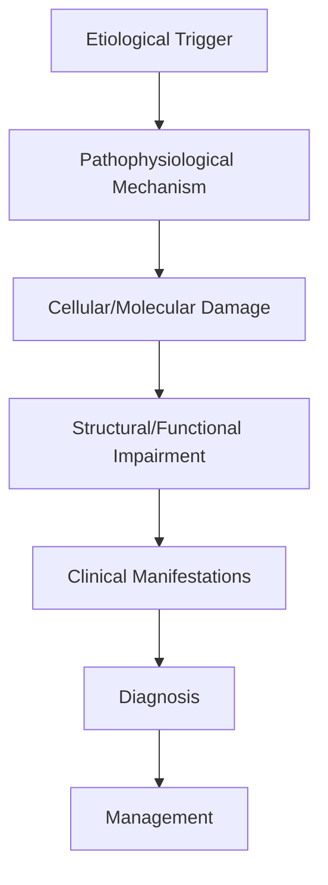
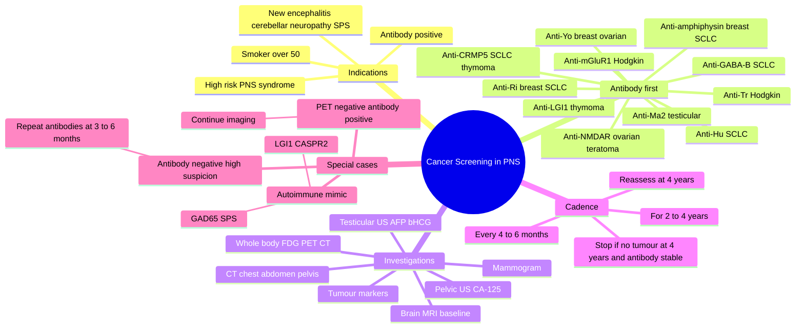

# Cancer Screening in PNS

> [!tip] **High-Yield Definition**
> Comprehensive clinical note for Cancer Screening in PNS covering definition, epidemiology, aetiology, pathophysiology, clinical features, investigations, differential diagnosis, management, drug interactions, procedures, complications, red flags, prognosis, topic correlation, and special situations for FCPS/MRCP examination preparation based on Davidson 24th Edition Chapter 25: Neurology.

---

## 1. Definition / Epidemiology / Classification

### Definition
Cancer Screening in PNS is a neurological disorder within the 19 paraneoplastic neurological syndromes category. It is characterised by specific clinical, pathological, radiological, and laboratory features that allow differentiation from related conditions.

### Epidemiology
- **Incidence/Prevalence:** Variable depending on the specific condition.
- **Age:** Adult onset is most common, but paediatric and elderly presentations occur.
- **Sex:** Variable depending on the condition.
- **Geography:** Worldwide distribution, with higher prevalence in certain regions.
- **Risk Factors:** Genetic predisposition, environmental factors, comorbidities, family history.

### Classification
| Subtype | Key Features | Prognosis |
|---------|-------------|-----------|
| Mild/early | Subtle symptoms, preserved function | Best |
| Moderate | Clear symptoms, functional impairment | Variable |
| Severe | Significant disability, complications | Worst |

---

## 2. Aetiology / Pathophysiology

### Aetiology
- **Primary (idiopathic):** Most cases have no identifiable cause.
- **Genetic:** May be inherited (AD, AR, X-linked, mitochondrial, sporadic).
- **Autoimmune:** Autoantibodies, immune-mediated inflammation.
- **Infectious:** Viral, bacterial, fungal, parasitic.
- **Metabolic:** Electrolyte, endocrine, hepatic, renal, nutritional.
- **Toxic:** Drugs, alcohol, heavy metals, environmental toxins.
- **Vascular:** Ischaemia, haemorrhage, vasculitis.
- **Neoplastic:** Primary, secondary, paraneoplastic.
- **Traumatic:** Acute, chronic, repetitive.
- **Degenerative:** Neurodegeneration, protein misfolding.

### Pathophysiology


---

## 3. Clinical Features

### History
- **Onset/Duration:** Acute, subacute, or chronic.
- **Progression:** Static, progressive, relapsing-remitting, stepwise.
- **Key symptoms:** Specific to the condition.
- **Triggers:** Stress, infection, trauma, drugs, hormonal, environmental.
- **Systemic symptoms:** Constitutional features.
- **Drug/Family/Social history:** Relevant exposures, comorbidities.

### Examination
| Domain | Key Findings | Localisation Value |
|--------|-------------|-------------------|
| Higher function | Cognitive, behavioural | Cortical, subcortical, limbic |
| Cranial nerves | Pupils, eye movements, facial, bulbar | Brainstem, cranial nerve, NMJ |
| Motor | Weakness, tone, reflexes | UMN, LMN, NMJ, muscle |
| Sensory | All modalities, pattern | Peripheral, spinal, brainstem |
| Coordination | Ataxia, nystagmus, dysmetria | Cerebellar, sensory, vestibular |
| Gait | Spastic, ataxic, parkinsonian | Multiple |
| Autonomic | Orthostatic, sweating, GI, bladder | Autonomic, peripheral, central |

### Specific Clinical Features
The clinical features are determined by the underlying aetiology, location of pathology, and rate of progression. Patients typically present with a constellation of symptoms and signs that allow clinical localisation and subsequent targeted investigation.

---

## 4. Diagnostic Approach / Algorithm

```mermaid
flowchart TD
    A[Clinical Presentation] --> B[Anatomical Localisation]
    B --> C[Pathophysiological Category]
    C --> D[Formulate Differential]
    D --> E[Targeted Investigations]
    E --> F[Confirm Diagnosis]
    F --> G[Assess Severity/Prognosis]
    G --> H[Initiate Management]
    H --> I[Monitor Response]
    I --> J{Response?}
    J --> YES1 [Good - Continue]
    J --> NO1 [Poor - Escalate]
    YES1 --> K[Monitor]
    NO1 --> H
```

---

## 5. Investigations

### First-Line Investigations
- **Blood tests:** FBC, U&Es, LFTs, glucose, calcium, magnesium, ESR, CRP, autoimmune, infection.
- **Imaging:** CT/MRI brain/spine (essential for most neurological conditions).
- **Neurophysiology:** EEG, nerve conduction, EMG, evoked potentials.
- **CSF:** Cell count, protein, glucose, OCBs, PCR, culture.

### Second-Line Investigations
- **Genetic testing:** Gene panels, WES, WGS.
- **Antibody testing:** Antineuronal, autoimmune, paraneoplastic.
- **Biopsy:** Nerve, muscle, brain, skin.
- **Advanced imaging:** PET-CT, MR spectroscopy, fMRI.

### Specialised Investigations
- **Biomarkers:** Neurofilament light chain, tau, beta-amyloid, 14-3-3, RT-QuIC.
- **Autonomic testing:** Head-up tilt, sudomotor, QSART.
- **Neuropsychology:** Cognitive testing, behavioural assessment.
- **Genetic counselling:** Family screening, predictive testing.

---

## 6. Differential Diagnosis

| Differential | Distinguishing Features | Key Test |
|--------------|------------------------|----------|
| Vascular | Sudden onset, focal, vascular risk factors | MRI/CT, vessel imaging |
| Inflammatory | Subacute, multifocal, systemic | MRI, CSF, antibodies |
| Infectious | Fever, systemic, exposure | Bloods, CSF, imaging |
| Neoplastic | Progressive, mass effect | MRI, biopsy |
| Degenerative | Progressive, symmetric, hereditary | MRI, genetic |
| Toxic/Metabolic | Drug history, systemic, reversible | Bloods, toxicology |
| Autoimmune | Multifocal, antibodies, immunotherapy response | Antibodies, MRI, CSF |
| Functional | Inconsistent, distractible | Clinical, video, biomarkers |

---

## 7. Management

### Acute Management
- **Stabilisation:** ABCDE approach, emergency resuscitation.
- **Specific treatment:** Disease-specific interventions.
- **Symptomatic relief:** Pain, seizures, spasticity, autonomic dysfunction.
- **Prevention of complications:** DVT, pressure sores, infection.

### Disease-Modifying Treatment
- **Pharmacological:** First-line, second-line, escalation, maintenance.
- **Procedural:** Surgery, biopsy, drainage, ablation, stimulation.
- **Immunotherapy:** Steroids, IVIG, plasma exchange, immunosuppressants, biologics.
- **Rehabilitation:** Physiotherapy, OT, speech therapy.

### Long-Term Management
- **Monitoring:** Clinical, imaging, biomarkers, side effects.
- **Prevention:** Vaccinations, prophylaxis, lifestyle modification.
- **Supportive care:** Multidisciplinary team, social work, psychological support.
- **Palliative care:** Advanced care planning, end-of-life care, hospice.

---

## 8. Drug Interactions / Contraindications / Comorbidity Cautions

| Drug Class | Interaction / Caution | Management |
|------------|----------------------|------------|
| Antiseizure medications | Enzyme induction, teratogenicity | Monitor, supplement, switch |
| Immunosuppressants | Infection, malignancy, teratogenicity | Monitor, prophylaxis |
| Anticoagulants | Bleeding risk, drug interactions | Monitor INR, avoid combinations |
| Antihypertensives | Hypotension, falls | Monitor BP, adjust dose |
| Antibiotics | Nephrotoxicity, ototoxicity | Monitor renal |
| Antivirals | Nephrotoxicity, neuropsychiatric | Monitor renal, dose adjust |
| Steroids | DM, HTN, osteoporosis, infection | Monitor, prophylaxis, taper |
| Biologics | Infusion reactions, infection | Monitor, prophylaxis |

---

## 9. Procedures

### Common Procedures
- **Lumbar puncture:** Diagnostic, therapeutic (IIH, NPH). Contraindications: raised ICP, mass lesion, coagulopathy.
- **Nerve conduction studies/EMG:** Diagnostic, prognosis. Minor discomfort.
- **EEG:** Diagnostic, monitoring. No significant complications.
- **MRI brain/spine:** Diagnostic, monitoring. Contraindications: pacemaker, metallic implants.
- **CT head:** Emergency, rapid. Radiation exposure, contrast reactions.
- **Biopsy:** Stereotactic, open. Indications: diagnosis, molecular profiling.

---

## 10. Complications

| Complication | Frequency | Prevention | Management |
|--------------|-----------|------------|------------|
| Infection | Common | Hygiene, prophylaxis, vaccination | Antibiotics, antifungals |
| Thrombosis | Common | Prophylaxis, mobility | Anticoagulation |
| Pressure sores | Common | Positioning, nutrition | Wound care, surgery |
| Spasticity | Common | Positioning, stretching | Baclofen, BoNT |
| Contractures | Common | Passive movements, splints | Physiotherapy, surgery |
| Aspiration | Common | Swallow assessment | NGT, PEG, thickeners |
| Falls | Common | Environment, mobility | Walking aids |
| Fractures | Common | Bone health, prevention | Vitamin D, bisphosphonate |
| Depression | Common | Screening, support | Antidepressants, CBT |
| Cognitive decline | Variable | Monitoring, training | Rehabilitation |
| Autonomic dysfunction | Variable | Monitoring, hydration | Midodrine, fludrocortisone |
| Respiratory failure | Variable | Monitoring, supportive | Ventilation, NIV |
| Death | Variable | Monitoring, palliative | End-of-life care |

---

## 11. Red Flags / Emergencies

### Emergency Presentations
- **Rapid neurological deterioration:** New focal deficit, decreased consciousness, seizures.
- **Status epilepticus:** Continuous seizures >5 min.
- **Raised ICP:** Headache, vomiting, papilloedema, altered consciousness.
- **Respiratory failure:** Hypoxia, hypercapnia, ventilatory failure.
- **Cardiac arrest:** Arrhythmia, MI, pulmonary embolism.
- **Infection:** Sepsis, meningitis, abscess, encephalitis.
- **Drug toxicity:** Overdose, side effects, interactions.
- **Haemorrhage:** Intracranial, systemic, coagulopathy.

---

## 12. Prognosis

### Natural History
- **Acute:** May resolve with treatment, may progress, may be fatal.
- **Subacute:** Variable, depends on cause and treatment.
- **Chronic:** Often progressive, may be stable, may have relapses.
- **Recovery:** Variable, may be complete, partial, or none.

### Prognostic Factors
- **Favourable:** Young age, early treatment, mild disease, reversible cause, good premorbid function, family support.
- **Unfavourable:** Older age, delayed treatment, severe disease, irreversible cause, poor premorbid function, comorbidities.

---

## 13. Topic Correlation

| Related Topic | Link | Key Overlap |
|---------------|------|-------------|
| Davidson 24th Ed Chapter 25 | [[Davidson Chapter 25 - Neurology Hierarchy]] | Comprehensive neurology |
| Neurology MOC | [[Neurology MOC]] | All neurology topics |
| Drug Reference | [[../00_Index/Neurology Drug Reference]] | Medications |
| Local Hub | [[../19_Paraneoplastic_Neurological_Syndromes/Hub]] | Section-specific |
| Clinical Examination | [[../01_Fundamentals_Examination/Neurological History Taking]] | Clinical approach |
| Investigation | [[../01_Fundamentals_Examination/Neuroimaging (CT-MRI) Principles]] | Imaging |

---

## 14. Special Situations

| Situation | Consideration |
|-----------|---------------|
| **Pregnancy** | Pre-conception counselling, teratogenicity, drug safety, monitoring, delivery planning, breastfeeding. |
| **Lactation** | Drug safety, breastfeeding, monitoring, support. |
| **Paediatric** | Developmental considerations, drug dosing, school, family, vaccination, growth, puberty. |
| **Elderly / Frail** | Comorbidities, polypharmacy, falls, bone health, cognition, social, end-of-life. |
| **Renal impairment** | Drug dose adjustment, monitoring, dialysis, transplant. |
| **Hepatic impairment** | Drug dose adjustment, monitoring, transplant. |
| **Immunocompromised** | Infection prophylaxis, vaccination, drug interactions, malignancy screening. |
| **Perioperative** | Drug management, anaesthesia planning, VTE prophylaxis, infection prevention, monitoring. |
| **Driving / DVLA** | Fitness to drive, restrictions, notification, reassessment. |
| **Occupational** | Fitness for work, adaptations, rehabilitation, disability, return to work. |

---

## FCPS/MRCP High-Yield Summary

| Category | Key Points |
|----------|------------|
| **Definition** | Comprehensive definition with key diagnostic criteria |
| **Epidemiology** | Incidence, prevalence, age, sex, geography, risk factors |
| **Aetiology** | Primary causes, secondary causes, genetic, environmental |
| **Pathophysiology** | Mechanism of disease, cellular/molecular basis |
| **Clinical Features** | History, examination, key findings, variants |
| **Diagnosis** | Diagnostic criteria, classification, severity |
| **Investigations** | First-line, second-line, specialised, biomarkers |
| **Differential Diagnosis** | Key differentials, distinguishing features, tests |
| **Management** | Acute, disease-modifying, symptomatic, supportive |
| **Complications** | Common, serious, prevention, management |
| **Prognosis** | Natural history, prognostic factors, outcomes |
| **Viva Pearls** | Key examination points |
| **Drug Doses** | First-line, second-line, emergency |
| **Scoring Systems** | Specific scores used in management |
| **Genetics** | Inheritance, genes, mutations, family screening |
| **Imaging Signs** | Characteristic findings, differential |

---

## Viva Questions (PACES/FCPS Style)

1. **Q:** Define and classify its variants.
   **A:** Comprehensive definition with classification of subtypes based on aetiology, severity, and clinical features.

2. **Q:** What are the key clinical features?
   **A:** Specific symptoms and signs including onset, progression, key features, and associated findings.

3. **Q:** What is the first-line treatment?
   **A:** First-line pharmacological and non-pharmacological management based on current evidence.

4. **Q:** What are the red flags requiring urgent referral?
   **A:** Specific emergency presentations and complications requiring immediate intervention.

5. **Q:** What is the prognosis?
   **A:** Natural history, prognostic factors, and long-term outcomes.

6. **Q:** How do you differentiate from key differentials?
   **A:** Clinical features, investigations, and response to treatment that distinguish from alternative diagnoses.

7. **Q:** What investigations are most useful?
   **A:** First-line and second-line investigations including imaging, neurophysiology, CSF, and biomarkers.

8. **Q:** Describe the stepwise management approach.
   **A:** Stepwise escalation from first-line to second-line to third-line therapy with monitoring.

9. **Q:** What are the emergency presentations?
   **A:** Specific emergency scenarios and immediate management priorities.

10. **Q:** How does management change in pregnancy/paediatrics/elderly?
    **A:** Special considerations for each population including drug safety, monitoring, and support.

---

## Common Confusions / Exam Traps

| Confusion | Clarification |
|-----------|---------------|
| Similar presentation but different cause | Differentiate by history, examination, investigations |
| Treatment response vs natural history | Assess with objective measures, biomarkers |
| Drug interactions | Check each drug, monitor, adjust doses |
| Disease progression vs treatment failure | Monitor response, escalate appropriately |
| Functional vs organic | Inconsistent, distractible, disability greater than impairment |
| Acute vs chronic | Time course, progression, reversibility |
| Primary vs secondary | Underlying cause, contributing factors |
| Side effects vs symptoms | Temporal relationship, dose relationship |

---

## Mnemonics

1. **SCREEN-PNS** — Universal cancer screening steps in suspected paraneoplastic neurological syndrome:
   **S**erum + CSF paraneoplastic antibody panel
   **C**T chest/abdomen/pelvis (CT-CAP)
   **R**eview for organ-specific clues (smoker → chest, women → breast/ovary, men <50 → testes)
   **E**xam: breast, testicular, skin, lymph nodes, thyroid
   **E**xplore with PET-CT if initial screen negative
   **N**o tumour found? **P**lan interval screening
   **-P**ET-CT repeat every 4–6 months
   **-N**o tumour ≠ no PNS — continue follow-up
   **-S**erum-only antibody positive? Still screen!

2. **ANTIBODY → TUMOUR MAP** — High-yield antibody-to-tumour associations:
   **Anti-Hu (ANNA-1)** → SCLC (always do CT chest)
   **Anti-Yo (PCA-1)** → breast + ovarian (mammogram + US pelvis + CA-125)
   **Anti-Ma2** → testicular germ cell (US testes + AFP/β-hCG; consider orchiectomy)
   **Anti-Ri (ANNA-2)** → breast + SCLC
   **Anti-CRMP5 (CV2)** → SCLC + thymoma
   **Anti-Tr (DNER)** → Hodgkin lymphoma (CT neck/chest/abdomen/pelvis)
   **Anti-mGluR1** → Hodgkin lymphoma
   **Anti-amphiphysin** → breast + SCLC
   **Anti-LGI1** → thymoma (CT chest)
   **Anti-NMDAR** → ovarian teratoma (pelvic US / MRI)
   **Anti-GABA-B** → SCLC (CT chest)
   **Anti-PCA2** → SCLC + LEMS
   **Anti-Zic4** → SCLC

3. **4-6-2-4** — Cancer screening cadence after initial negative workup in antibody-positive PNS:
   **4** — repeat screening every **4–6** months
   **6** — for at least **2** years
   **2** — then consider extending to **4** years if high-risk antibody
   **4** — PET-CT + clinical exam at each visit
   → Most occult cancers are detected within 12–18 months.

---

## Mind Map



---

## Spaced Repetition Trackers

| Day | Reviewer Score (/10) | Recall Notes | Re-study Targets |
|-----|----------------------|--------------|-------------------|
| Day 1 |  |  |  |
| Day 3 |  |  |  |
| Day 7 |  |  |  |
| Day 14 |  |  |  |
| Day 30 |  |  |  |
| Day 90 |  |  |  |

> **Spaced-retention rule:** If recall drops below 7/10, re-read section and repeat the Day-1 row.

---

## Self-Test Scorecard

Score each section **/5** after a single-pass read. Target ≥ 35/50 before exam.

| Section | Score | Weak Areas | Action Plan |
|---------|-------|------------|-------------|
| Definition / Epidemiology / Classification | /5 |  |  |
| Aetiology / Pathophysiology | /5 |  |  |
| Clinical Features | /5 |  |  |
| Diagnostic Approach / Algorithm | /5 |  |  |
| Investigations | /5 |  |  |
| Differential Diagnosis | /5 |  |  |
| Management | /5 |  |  |
| Drug Interactions / Contraindications / Comorbidity Cautions | /5 |  |  |
| Procedures | /5 |  |  |
| Complications | /5 |  |  |

> **Interpretation:** 40–50 = exam-ready; 30–39 = needs re-read; <30 = restart from section 1.

---

## MCQs (10)

1. **A 60-year-old smoker presents with subacute sensory neuronopathy and is anti-Hu positive. The MOST appropriate first cancer-screening investigation is:**
   - A. Whole-body PET-CT
   - B. CT chest
   - C. Mammogram
   - D. Testicular ultrasound

2. **Anti-Yo (PCA-1) antibody positivity mandates screening for:**
   - A. Testicular germ cell tumour
   - B. Breast and ovarian carcinoma
   - C. Thymoma
   - D. Hodgkin lymphoma

3. **A young man with anti-Ma2 encephalitis and negative initial CT chest/abdomen/pelvis requires:**
   - A. Discharge — no tumour
   - B. Testicular ultrasound + AFP/β-hCG ± orchiectomy if PET positive
   - C. CT abdomen only
   - D. Annual PET-CT only

4. **Whole-body FDG-PET-CT is MOST useful in paraneoplastic screening when:**
   - A. CT chest/abdomen/pelvis is negative but suspicion remains high
   - B. Anti-GAD65 antibody is positive
   - C. Patient is under 30 with a self-limiting syndrome
   - D. CSF is normal

5. **The recommended interval for repeat cancer screening in antibody-positive PNS after negative initial workup is:**
   - A. Every 4–6 months for 2–4 years
   - B. Every 5 years
   - C. Once-off
   - D. Every 10 years

6. **Anti-Tr (DNER) antibodies are most associated with:**
   - A. SCLC
   - B. Breast cancer
   - C. Hodgkin lymphoma
   - D. Renal cell carcinoma

7. **A woman with anti-NMDAR encephalitis should be screened for:**
   - A. Testicular germ cell tumour
   - B. Ovarian teratoma
   - C. Thymoma
   - D. SCLC

8. **A patient with paraneoplastic neurological syndrome has a positive antibody but completely negative CT chest/abdomen/pelvis AND negative PET-CT. The MOST appropriate next step is:**
   - A. Discharge
   - B. Continue interval screening every 4–6 months for 2–4 years
   - C. Empiric chemotherapy
   - D. Bone marrow biopsy

9. **Anti-LGI1 antibody positivity in an older man mandates a search for:**
   - A. Breast cancer
   - B. Thymoma
   - C. SCLC
   - D. Testicular germ cell tumour

10. **Tumour markers routinely ordered in suspected paraneoplastic neurological syndromes include all EXCEPT:**
    - A. CA-125 (ovary)
    - B. AFP and β-hCG (testicular germ cell)
    - C. PSA (prostate — only if clinical indication)
    - D. CA 19-9 / CEA (non-specific, low yield in PNS)

---

## SBA Questions (10)

1. **A 55-year-old woman develops subacute cerebellar ataxia. Anti-Yo antibodies are positive. The MOST appropriate first-line cancer screen is:**
   - A. CT chest
   - B. Mammogram + pelvic ultrasound + CA-125
   - C. Testicular ultrasound
   - D. Colonoscopy
   - E. Whole-body MRI

2. **A 35-year-old man presents with limbic and brainstem encephalitis. Anti-Ma2 antibodies are detected. CT-CAP, testicular ultrasound, and PET-CT are all negative. The MOST appropriate next step is:**
   - A. Discharge — workup is complete
   - B. Repeat CT-CAP, testicular ultrasound, and PET-CT every 4–6 months for 2–4 years
   - C. Empiric orchidectomy
   - D. Annual MRI brain only
   - E. Bone marrow biopsy

3. **A 60-year-old with paraneoplastic sensory neuronopathy has anti-Hu antibodies. CT chest shows a 2 cm spiculated right upper-lobe nodule. The MOST appropriate next step is:**
   - A. PET-CT for staging + tissue diagnosis
   - B. MRI brain with contrast
   - C. Mammogram
   - D. PSA
   - E. Reassure

4. **Whole-body FDG-PET-CT in paraneoplastic screening is MOST useful when:**
   - A. CT chest/abdomen/pelvis is negative but clinical suspicion is high
   - B. Anti-GAD65 antibody is positive
   - C. The patient is under 25 with mild symptoms
   - D. CSF is normal
   - E. Cancer is already confirmed histologically

5. **A 28-year-old woman with anti-NMDAR encephalitis has a normal pelvic ultrasound. The MOST appropriate next investigation is:**
   - A. Mammogram
   - B. CT chest
   - C. Pelvic MRI ± repeat ultrasound
   - D. Testicular ultrasound
   - E. Bone scan

6. **A 70-year-old man with anti-CRMP5 (CV2) antibodies, sensory neuronopathy, optic neuritis, and chorea has a normal CT chest. The MOST appropriate next step is:**
   - A. Discharge
   - B. Whole-body FDG-PET-CT
   - C. Mammogram
   - D. Carotid Doppler
   - E. EEG

7. **Anti-amphiphysin antibody in a 50-year-old woman with stiff person syndrome mandates screening for:**
   - A. Testicular germ cell tumour
   - B. Breast carcinoma + small cell lung cancer
   - C. Thymoma
   - D. Hodgkin lymphoma
   - E. Renal cell carcinoma

8. **A patient with antibody-positive paraneoplastic syndrome has a negative initial CT-CAP and PET-CT. The MOST appropriate follow-up cadence is:**
   - A. Repeat imaging every 4–6 months for at least 2 years
   - B. One repeat at 5 years
   - C. No further screening required
   - D. Annual MRI brain only
   - E. Bone scan every 2 years

9. **A 50-year-old with Hodgkin lymphoma develops subacute cerebellar degeneration. Anti-Tr antibodies are positive. The MOST appropriate management of the PNS is:**
   - A. Supportive care only
   - B. Optimal treatment of Hodgkin lymphoma + immunotherapy (steroids ± IVIG)
   - C. Methotrexate monotherapy
   - D. Plasmapheresis alone
   - E. Withhold chemotherapy

10. **In paraneoplastic screening, which ONE antibody is LEAST likely to be associated with a tumour?**
    - A. Anti-Hu
    - B. Anti-Yo
    - C. Anti-GAD65 (in classic stiff person syndrome)
    - D. Anti-CRMP5
    - E. Anti-Ma2

---

## Tags

#neurology #PNS #paraneoplastic #Cancer_Screening_in_PNS #FCPS #MRCP #Davidson25

---

## Local Navigation
**Heading Hub:** [[../Hub]]  
**Chapter Hierarchy:** [[Davidson Chapter 25 - Neurology Hierarchy]]  
**Chapter MOC:** [[Neurology MOC]]  
**Drug Reference:** [[../00_Index/Neurology Drug Reference]]

## PasTest Scenario SBAs (Clinical Vignettes)

> **Auto-generated PasTest/Mediscope-style scenario SBAs** grounded in the authored source. Each scenario tests a real clinical fact (triad, specific sign, contraindication, trial, first-line Rx) extracted from the topic. *Source: Ch 27: Neurology & Stroke — Cancer Screening in PNS*

**Q1.** Which of the following features is most specific or characteristic of Cancer Screening in PNS?

  - **A.** Key symptoms:
  - **B.** A feature common to many acute inflammatory conditions
  - **C.** A non-specific sign that does not localise the diagnosis
  - **D.** An investigation finding rather than a clinical feature

  > **Answer: A** — Key symptoms:
  >
  > *Source:* - **Key symptoms:** Specific to the condition

**Q2.** What is the most appropriate first-line therapy for Cancer Screening in PNS?

  - **A.** Rehabilitation:
  - **B.** An advanced/surgical therapy reserved for refractory disease
  - **C.** Symptomatic treatment only, no disease-modifying therapy
  - **D.** Empiric broad-spectrum therapy without specific indication

  > **Answer: A** — Rehabilitation:
  >
  > *Source:* **Rehabilitation:** Physiotherapy, OT, speech therapy.

