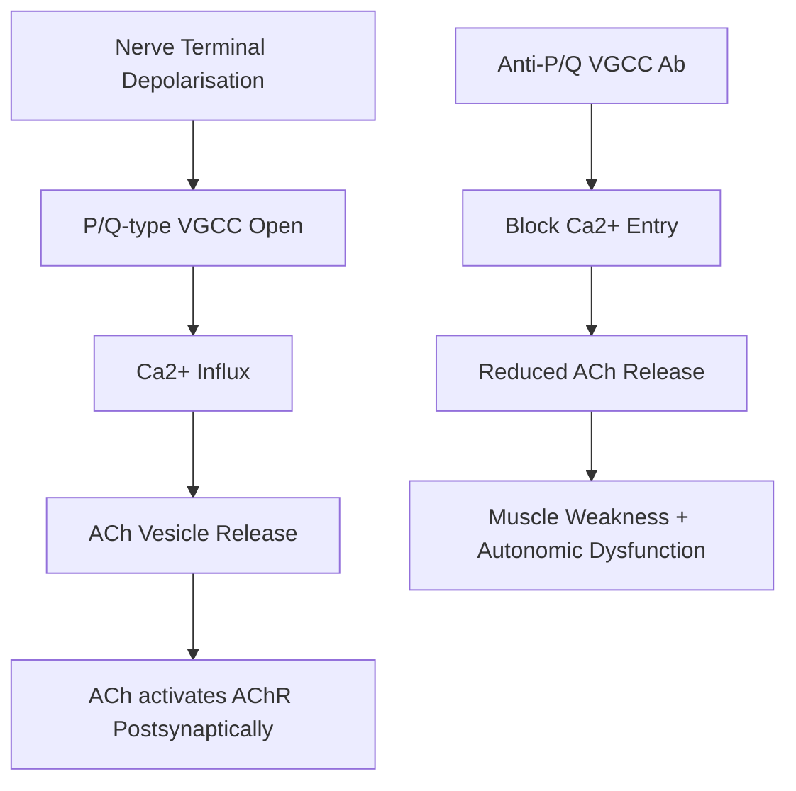
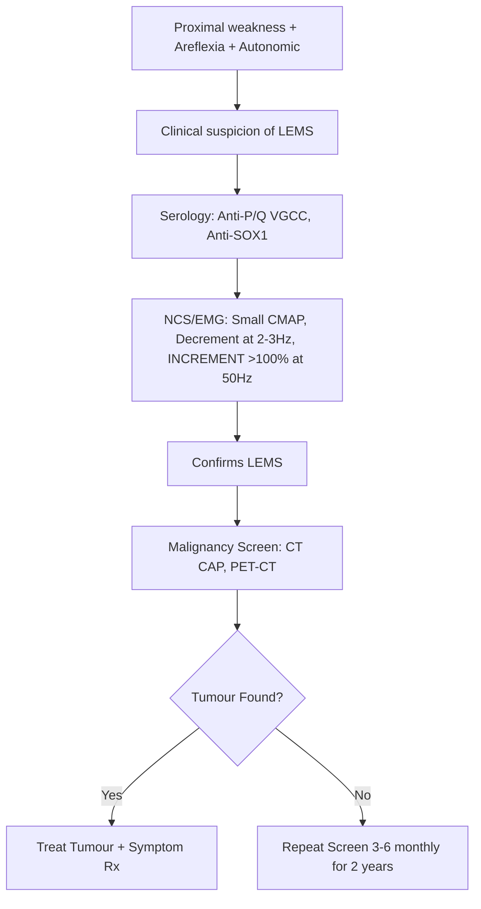
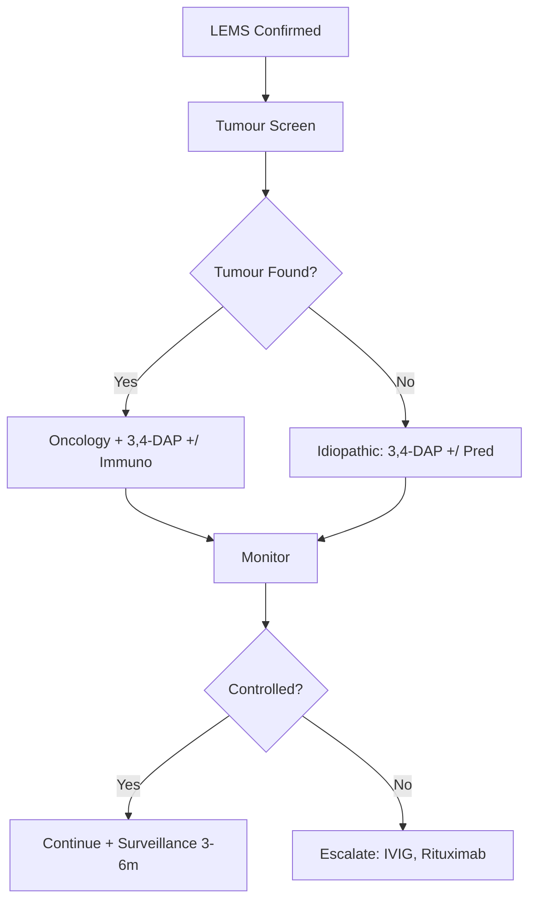

# Lambert-Eaton Myasthenic Syndrome (LEMS)

> [!tip] **Pearl**
> LEMS is a **presynaptic** disorder of the **P/Q-type voltage-gated calcium channels (VGCC)** at the **cholinergic synapse (NMJ + autonomic)** — often **paraneoplastic (SCLC in 50-60%)**. Hallmark: **proximal weakness IMPROVING with use** + **autonomic dysfunction + areflexia** + **>100% incremental response on RNS**.

Related: [[Myasthenia Gravis]], [[Cancer Screening in PNS]], [[Paraneoplastic Neurological Syndromes Hub]]

## Learning Objectives
- [ ] Define LEMS and distinguish from myasthenia gravis
- [ ] Describe VGCC pathophysiology
- [ ] Localise the lesion to the presynaptic NMJ
- [ ] Identify clinical features: proximal weakness, autonomic dysfunction, areflexia
- [ ] Investigate: anti-P/Q VGCC, NCS/RNS, CT CAP, PET
- [ ] Screen for occult malignancy (SCLC)
- [ ] Manage: 3,4-diaminopyridine, immunotherapy, tumour-directed

---

## 1. Definition / Epidemiology / Classification

### Definition
A **presynaptic autoimmune disorder** of neuromuscular transmission caused by antibodies against **presynaptic P/Q-type voltage-gated calcium channels** on motor nerve terminals, reducing ACh release. Frequently **paraneoplastic (50-60% SCLC)**.

### Epidemiology
- **Incidence:** 0.5-1/million/year (~100x less common than MG)
- **Age:** Peak 50-70 years
- **Sex:** M:F = 2:1 (paraneoplastic) / F:M = 2:1 (idiopathic)
- **Risk factors:** Smoking, HLA-DR3, DQ2

### Classification
| Type | Frequency | Associations |
|------|-----------|--------------|
| **Paraneoplastic (T-LEMS)** | 50-60% | SCLC, rarely prostate, thymoma, lymphoma |
| **Idiopathic (NT-LEMS)** | 40-50% | Younger, F>M, autoimmune comorbidity |

---

## 2. Aetiology / Pathophysiology

### Aetiology
- **Autoimmune:** Anti-P/Q VGCC antibodies (cross-reactive with tumour antigen in SCLC)
- **Paraneoplastic:** Tumour cells (esp. SCLC) express VGCC; immune response cross-reacts with presynaptic NMJ

### Pathophysiology

### Molecular Basis
- **Antibody:** Anti-P/Q-type VGCC (90% paraneoplastic, <50% idiopathic)
- **Other antibodies:** Anti-SOX1 (highly specific for SCLC-LEMS)
- **Mechanism:** Reduced Ca2+ influx → reduced quantal ACh release
- **Incremental response:** With brief maximal voluntary contraction or 50Hz RNS, Ca2+ accumulates → ACh release transiently restored → CMAP amplitude increases (100%+ increment)

---

## 3. Clinical Features

### History
- **Onset:** Subacute, progressive over months
- **Symptoms:**
  - **Proximal LE weakness** (hip girdle) > upper limb
  - **Cranial involvement mild/absent** (cf. MG)
  - **Autonomic:** Dry mouth (most common), constipation, erectile dysfunction, postural dizziness
  - **Lambert sign:** Strength improves with brief repeated effort
  - **Cough, dyspnoea** (SCLC symptoms)
  - **Smoking history**

### Examination
| Domain | Findings | Localisation |
|--------|----------|--------------|
| **Motor** | **Proximal > distal**, **LE > UE**, Gower's positive; fatigability less than MG | Presynaptic NMJ |
| **Reflexes** | **DIMINISHED/ABSENT** but **return after brief exercise (post-tetanic potentiation)** | Presynaptic NMJ |
| **Sensation** | Normal | Excludes neuropathy |
| **Cranial nerves** | Mild ptosis; **no diplopia/ophthalmoplegia (cf. MG)** | |
| **Autonomic** | Dry mouth, dry eyes, postural hypotension, ileus, impotence | Autonomic synapse |
| **Gait** | Waddling (proximal myopathic) | |

### Associated Findings
- **SCLC:** Weight loss, cough, haemoptysis, lymphadenopathy, Horner's
- **Other autoimmune:** Thyroid disease, RA, T1DM, coeliac (idiopathic LEMS)

---

## 4. Diagnostic Approach / Algorithm

### Diagnostic Criteria
| Criterion | Detail |
|-----------|--------|
| **Clinical** | Proximal weakness + autonomic + areflexia |
| **Serology** | Anti-P/Q VGCC positive (90% paraneoplastic, ~50% idiopathic) |
| **Electrodiagnostic** | **Small baseline CMAP** + **decrement at 2-3 Hz RNS** + **>100% INCREMENT after 10s MVC or 50Hz RNS** |
| **SOX1 antibody** | Highly specific for SCLC-LEMS |

### Severity Assessment
- Timed up-and-go, 6-min walk, dynamometry
- FVC, NIF (esp. if bulbar/respiratory symptoms)

---

## 5. Investigations

### First-Line
| Test | Indication | Finding |
|------|------------|---------|
| **Anti-P/Q VGCC** | All suspected LEMS | Positive in 90% paraneoplastic, 50% idiopathic |
| **Anti-SOX1** | All LEMS | Highly specific for SCLC-LEMS |
| **AChR antibody** | Exclude MG | Negative in LEMS |
| **CK** | Baseline | Usually normal |

### Neurophysiology
| Test | Finding |
|------|---------|
| **NCS** | **Small CMAP amplitude** distally; increment after exercise |
| **RNS (2-3 Hz)** | Decrement (10-20%) |
| **RNS (20-50 Hz) or post-exercise** | **INCREMENT >100%** (often >200%) — pathognomonic |
| **Post-tetanic potentiation** | Reflexes return transiently after 10s MVC |

### Imaging
| Modality | Indication |
|----------|------------|
| **CT CAP** | **All newly diagnosed LEMS** — SCLC screen |
| **FDG-PET-CT** | If CT negative, high clinical suspicion (or SOX1+) |
| **MRI Brain/Spine** | If atypical features |

### Cancer Screening
- CT CAP at diagnosis; if negative, repeat 3-6 monthly for 2 years

---

## 6. Differential Diagnosis

| Differential | Distinguishing Features | Key Test |
|--------------|------------------------|----------|
| **Myasthenia Gravis** | Ocular/bulbar, fatigability **worsens with use**, normal reflexes, **postsynaptic** | AChR Ab, decrement without increment |
| **Polymyositis** | Symmetric proximal, ↑CK, no autonomic | EMG myopathic, biopsy |
| **Inclusion body myositis** | Distal > proximal, finger flexors, quads, asymmetric | Rimmed vacuoles on biopsy |
| **CIDP** | Sensory + motor, areflexia, ↑CSF protein | NCS demyelination, no increment |
| **Botulism** | Acute, descending, dilated pupils, food/wound | NCS increment, culture |
| **SCLC mets to plexus** | Unilateral, painful, Horner's | MRI plexus, CT chest |

---

## 7. Management

### Symptomatic / First-line
| Agent | Dose | Notes |
|-------|------|-------|
| **3,4-Diaminopyridine (Amifampridine)** | **5-10 mg TDS PO** (max 100 mg/day) | **First-line**: blocks presynaptic K+ channels → ↑ Ca2+ entry → ↑ ACh release. Avoid in epilepsy. |
| **Pyridostigmine** | 30-60 mg TDS-QDS | Adjunct; modest benefit alone |

### Immunomodulation
| Agent | Indication | Dose |
|-------|------------|------|
| **Prednisolone** | Moderate-severe | 1 mg/kg, slow taper |
| **Azathioprine** | Steroid-sparing | 2-2.5 mg/kg/day |
| **Mycophenolate** | Alternative | 1-2 g/day |
| **IVIG** | Acute exacerbation | 2 g/kg over 2-5 days |
| **Rituximab** | Refractory / paraneoplastic | 375 mg/m2 weekly ×4 |

### Tumour-Directed
- **SCLC:** Treat per oncological protocol; tumour treatment often improves LEMS

### Algorithm

### Special Populations
- **Pregnancy:** Limited data; 3,4-DAP caution; avoid methotrexate, MMF
- **Elderly:** Lower 3,4-DAP starting dose; ECG baseline

---

## 8. Drug Interactions / Contraindications
| Drug | Caution | Management |
|------|---------|------------|
| **3,4-DAP** | **Seizure threshold ↓**; QTc ↑ at high dose | Avoid in epilepsy; ECG baseline; max 100 mg/day |
| **Aminoglycosides, Mg2+, CCBs** | Worsen NMJ block | Avoid if possible |

---

## 9. Procedures
- **NCS/EMG/RNS:** Performed by neurophysiology; confirmatory test
- **Bronchoscopy/EBUS:** For SCLC tissue diagnosis

---

## 10. Complications
| Complication | Frequency | Management |
|--------------|-----------|------------|
| **Respiratory failure** | Rare | Monitor FVC; avoid sedatives/opioids |
| **Severe autonomic dysfunction** | Common | Hydration, midodrine, laxatives, sialagogues |
| **SCLC progression** | 50-60% | Tumour therapy, surveillance |
| **Drug side effects** | Variable | Monitor |

---

## 11. Red Flags
| Red Flag | Action |
|----------|--------|
| **Acute respiratory failure** | ICU, ventilation |
| **New SCLC features** | Urgent CT/PET, oncology |
| **Sudden weakness deterioration** | Exclude infection, electrolyte disturbance, drug change |
| **Worsening on aminoglycoside/Mg** | Stop drug |

---

## 12. Prognosis
- **Tumour-dependent** in paraneoplastic (SCLC prognosis drives outcome)
- **Idiopathic:** Stable or slowly progressive; good response to 3,4-DAP
- **Disability:** Mild-moderate in most with treatment

---

## 13. Topic Correlation
| Related Topic | Key Overlap |
|---------------|-------------|
| [[Myasthenia Gravis]] | Differential; postsynaptic; AChR Ab |
| [[Paraneoplastic Cerebellar Degeneration]] | Often coexists; SCLC antibody panel |
| [[Cancer Screening in PNS]] | Same SCLC screening protocol |

---

## 14. Special Situations
| Situation | Consideration |
|-----------|---------------|
| **Pregnancy** | 3,4-DAP caution; consider IVIG |
| **Paediatric** | Consider congenital myasthenic syndrome; genetic testing |
| **Elderly** | Lower 3,4-DAP starting dose |
| **Anaesthesia** | **Avoid muscle relaxants (sensitivity)**; ensure post-op respiratory monitoring |
| **Driving** | DVLA notification if symptoms impair driving |

---

## FCPS/MRCP High-Yield Summary
| Category | Key Points |
|----------|------------|
| **Definition** | Presynaptic NMJ disorder; anti-P/Q-type VGCC Ab |
| **Epidemiology** | Rare (0.5-1/million); peak 50-70y; 50-60% paraneoplastic (SCLC) |
| **Pathophysiology** | ↓ Ca2+ entry → ↓ ACh release at NMJ + autonomic synapse |
| **Localisation** | Presynaptic NMJ (motor + autonomic) |
| **Clinical** | Proximal LE weakness, **areflexia improving with use**, autonomic (dry mouth, impotence, constipation), Lambert sign |
| **Diagnosis** | Anti-P/Q VGCC, SOX1; RNS = small CMAP + decrement + **>100% increment** |
| **Differentials** | MG, polymyositis, CIDP, botulism |
| **Management** | **3,4-DAP first-line**; immunotherapy; SCLC treatment |
| **Prognosis** | Tumour-dependent in paraneoplastic |

---

## Viva Questions
1. **Q:** Distinguish LEMS from myasthenia gravis.
   **A:** LEMS: presynaptic (anti-VGCC), proximal LE > UE, **areflexia improving with use**, prominent autonomic, paraneoplastic (SCLC), **incremental RNS**. MG: postsynaptic (anti-AChR), ocular/bulbar, normal reflexes, fatigability worsens with use, decrement without increment.
2. **Q:** Diagnostic RNS finding in LEMS?
   **A:** Small baseline CMAP + decremental response at 2-3Hz + **>100% increment at 50Hz/post-exercise**.
3. **Q:** First-line symptomatic therapy?
   **A:** 3,4-Diaminopyridine 5-10 mg TDS; blocks K+ channels → ↑ Ca2+ entry → ↑ ACh.
4. **Q:** How do you screen for malignancy?
   **A:** Anti-SOX1 + CT CAP ± FDG-PET; if negative, repeat 3-6 monthly for 2 years.
5. **Q:** What is the Lambert sign?
   **A:** Brief repeated effort improves strength; reflects transient Ca2+ accumulation restoring ACh release.
6. **Q:** Anaesthetic considerations?
   **A:** Sensitivity to muscle relaxants; avoid aminoglycosides, Mg2+, CCBs; post-op respiratory monitoring.

---

## Common Confusions
| Confusion | Clarification |
|-----------|---------------|
| LEMS vs MG reflex change | LEMS = areflexia (improves with use); MG = normal reflexes |
| 3,4-DAP vs 4-aminopyridine | 3,4-DAP is clinical; 4-AP is non-selective (CNS/seizure) |
| LEMS vs botulism | Botulism = acute, descending, food history; LEMS = chronic, proximal |
| SOX1 vs VGCC | SOX1 = SCLC-LEMS specific; VGCC = LEMS diagnosis |

---

## Mnemonics
1. **LEMS = PRE** — **P**resynaptic, **R**eflexes absent (improve with use), **E**xercise helps
2. **3,4-DAP** — 3,4-Diaminopyridine = first-line Rx
3. **SCLC screen** — **S**OX1, **C**T **C**AP, **L**ungs

---

## One-Page Revision Card
| Topic | Lambert-Eaton Myasthenic Syndrome |
|-------|-----------------------------------|
| Definition | Presynaptic anti-P/Q-type VGCC NMJ disorder; 50-60% paraneoplastic (SCLC) |
| Clinical | Proximal LE weakness, **areflexia (improves with use)**, autonomic (dry mouth, impotence, constipation) |
| Key sign | Lambert sign: strength improves with repeated use |
| Diagnosis | Anti-P/Q VGCC, Anti-SOX1; RNS: small CMAP + decrement + **>100% increment** |
| Differentials | MG, polymyositis, CIDP, botulism |
| Management | **3,4-DAP first-line**; immunotherapy; SCLC treatment |
| Tumour | SCLC screen: SOX1 + CT CAP + PET; repeat 3-6m ×2y if negative |
| Anaesthesia | Avoid muscle relaxants (sensitivity) |

---

## MCQs (10)
1. **Q:** LEMS is most commonly associated with which tumour?
   **Options:** A. Breast B. SCLC C. Thymoma D. Lymphoma
   **Answer:** B
2. **Q:** Most specific antibody for SCLC-LEMS?
   **Options:** A. Anti-Hu B. Anti-SOX1 C. Anti-Yo D. Anti-VGCC
   **Answer:** B
3. **Q:** RNS hallmark of LEMS?
   **Options:** A. Decrement at 2-3Hz B. >100% increment at 50Hz C. Fibrillations D. Myotonic discharges
   **Answer:** B
4. **Q:** First-line symptomatic drug for LEMS?
   **Options:** A. Pyridostigmine B. Prednisolone C. 3,4-DAP D. IVIG
   **Answer:** C
5. **Q:** LEMS antibody target:
   **Options:** A. AChR (postsynaptic) B. MuSK C. P/Q-type VGCC (presynaptic) D. LRP4
   **Answer:** C
6. **Q:** Distinguishes LEMS from MG:
   **Options:** A. Ocular symptoms B. Proximal weakness + areflexia + autonomic C. Anti-AChR positive D. Thymic hyperplasia
   **Answer:** B
7. **Q:** Lambert sign =
   **Options:** A. Worsening with use B. Improvement with brief repeated use C. Persistent areflexia D. Ptosis
   **Answer:** B
8. **Q:** Drug class that WORSENS LEMS?
   **Options:** A. Aminoglycosides B. Beta-blockers C. SSRIs D. Statins
   **Answer:** A
9. **Q:** 3,4-DAP works by:
   **Options:** A. Blocking ACh breakdown B. Blocking K+ channels → ↑ Ca2+ entry C. Inhibiting AChR D. Inhibiting complement
   **Answer:** B
10. **Q:** Anti-VGCC+ and SOX1+ but CT normal, next step:
    **Options:** A. Repeat CT in 5y B. PET-CT ± repeat imaging 3-6m C. No further imaging D. Whole-body MRI
    **Answer:** B

---

## SBA Questions (10)
1. **Scenario:** 60-year-old smoker with 6-month progressive proximal LE weakness, dry mouth, constipation, absent ankle reflexes returning briefly after walking. Diagnosis?
   **Options:** A. Polymyositis B. MG C. LEMS D. CIDP
   **Answer:** C
2. **Scenario:** NCS shows small CMAP and 200% increment after 10s MVC. Confirms:
   **Options:** A. MG B. LEMS C. Polymyositis D. ALS
   **Answer:** B
3. **Scenario:** LEMS with negative CT CAP and positive anti-SOX1. Next step?
   **Options:** A. Discharge B. FDG-PET-CT and 3-6m imaging for 2y C. Empirical chemo D. MRI brain
   **Answer:** B
4. **Scenario:** LEMS on 3,4-DAP develops new seizures. Most likely cause?
   **Options:** A. SCLC mets B. 3,4-DAP toxicity C. Electrolytes D. Stroke
   **Answer:** B
5. **Scenario:** Anaesthetic agent to AVOID in LEMS?
   **Options:** A. Propofol B. Suxamethonium C. Fentanyl D. Sevoflurane
   **Answer:** B
6. **Scenario:** LEMS, SOX1 negative, VGCC positive, CT normal. Most likely:
   **Options:** A. Paraneoplastic B. Idiopathic C. MG D. Polymyositis
   **Answer:** B
7. **Scenario:** LEMS on 3,4-DAP + prednisolone with persistent severe weakness. Next?
   **Options:** A. Stop 3,4-DAP B. Add IVIG / rituximab C. Increase steroids only D. Plasmapheresis
   **Answer:** B
8. **Scenario:** Most common autonomic symptom in LEMS?
   **Options:** A. Tachycardia B. Hypertension C. Dry mouth D. Diarrhoea
   **Answer:** C
9. **Scenario:** Reflexes absent at rest, return after 10s MVC. This is:
   **Options:** A. Hoffman B. Post-tetanic potentiation C. Lhermitte D. Babinski
   **Answer:** B
10. **Scenario:** LEMS for surgery. Avoid which antibiotic?
    **Options:** A. Amoxicillin B. Gentamicin C. Ceftriaxone D. Doxycycline
    **Answer:** B

---

## Flashcards
- **Q:** LEMS autoantigen? **A:** P/Q-type VGCC (presynaptic)
- **Q:** Hallmark RNS? **A:** Small CMAP + >100% increment at 50Hz/post-exercise
- **Q:** First-line Rx? **A:** 3,4-Diaminopyridine
- **Q:** Tumour? **A:** SCLC (50-60%)
- **Q:** Lambert sign? **A:** Strength improves with brief repeated use
- **Q:** SOX1 significance? **A:** Highly specific for SCLC-LEMS
- **Q:** Reflexes in LEMS? **A:** Areflexia, return after exercise (post-tetanic potentiation)
- **Q:** Anaesthetic risk? **A:** Sensitivity to muscle relaxants
- **Q:** 3,4-DAP mechanism? **A:** Blocks K+ channels → ↑ Ca2+ entry → ↑ ACh release
- **Q:** Drugs worsening LEMS? **A:** Aminoglycosides, Mg2+, CCBs, NMBs

---

## Answer Key

### MCQs
1. **B** — SCLC in 50-60%
2. **B** — SOX1 highly specific for SCLC-LEMS
3. **B** — >100% increment pathognomonic
4. **C** — 3,4-DAP first-line
5. **C** — Anti-P/Q VGCC presynaptic
6. **B** — LEMS triad
7. **B** — Improvement with use
8. **A** — Aminoglycosides worsen NMJ block
9. **B** — K+ channel blocker
10. **B** — SOX1+ mandates PET + serial imaging

### SBAs
1. **C** — Smoker + proximal LE + areflexia + autonomic = LEMS
2. **B** — 200% increment pathognomonic
3. **B** — SOX1+ mandates PET + serial imaging
4. **B** — 3,4-DAP lowers seizure threshold
5. **B** — Suxamethonium sensitivity
6. **B** — SOX1 negative suggests idiopathic
7. **B** — Add IVIG/rituximab for refractory
8. **C** — Dry mouth most common
9. **B** — Post-tetanic potentiation
10. **B** — Aminoglycoside worsens NMJ

---

## Local Navigation
**Heading Hub:** [[01_Fundamentals_Examination/Fundamentals & Examination Hub]]
**Topic-Group Hub:** [[19_Paraneoplastic_Neurological_Syndromes/Paraneoplastic Neurological Syndromes Hub]]
**Chapter Hierarchy:** [[Davidson Chapter 25 - Neurology Hierarchy]]
**Chapter MOC:** [[Neurology MOC]]
**Related Topics:** [[Myasthenia Gravis]], [[Paraneoplastic Cerebellar Degeneration]], [[Cancer Screening in PNS]]

## PasTest Scenario SBAs (Clinical Vignettes)

> **Auto-generated PasTest/Mediscope-style scenario SBAs** grounded in the authored source. Each scenario tests a real clinical fact (triad, specific sign, contraindication, trial, first-line Rx) extracted from the topic. *Source: Ch 27: Neurology & Stroke — Lambert-Eaton Myasthenic Syndrome*

**Q1.** Which of the following features is most specific or characteristic of Lambert-Eaton Myasthenic Syndrome?

  - **A.** Anti-SOX1
  - **B.** A feature common to many acute inflammatory conditions
  - **C.** A non-specific sign that does not localise the diagnosis
  - **D.** An investigation finding rather than a clinical feature

  > **Answer: A** — Anti-SOX1
  >
  > *Source:* ----|
| **Anti-P/Q VGCC** | All suspected LEMS | Positive in 90% paraneoplastic, 50% idiopathic |
| **Anti-SOX1** | All LEMS | Highly specific for SCLC-LEMS |
| **AChR antibody** | Exclude MG | Negati

**Q2.** What is the most appropriate first-line therapy for Lambert-Eaton Myasthenic Syndrome?

  - **A.** SCLC:
  - **B.** An advanced/surgical therapy reserved for refractory disease
  - **C.** Symptomatic treatment only, no disease-modifying therapy
  - **D.** Empiric broad-spectrum therapy without specific indication

  > **Answer: A** — SCLC:
  >
  > *Source:* **SCLC:** Treat per oncological protocol; tumour treatment often improves LEMS

