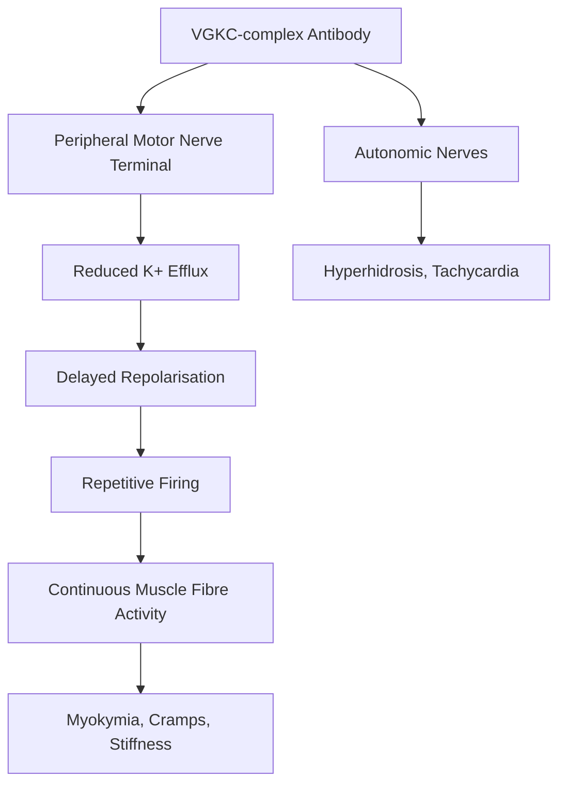
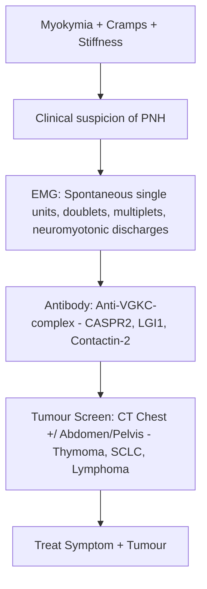
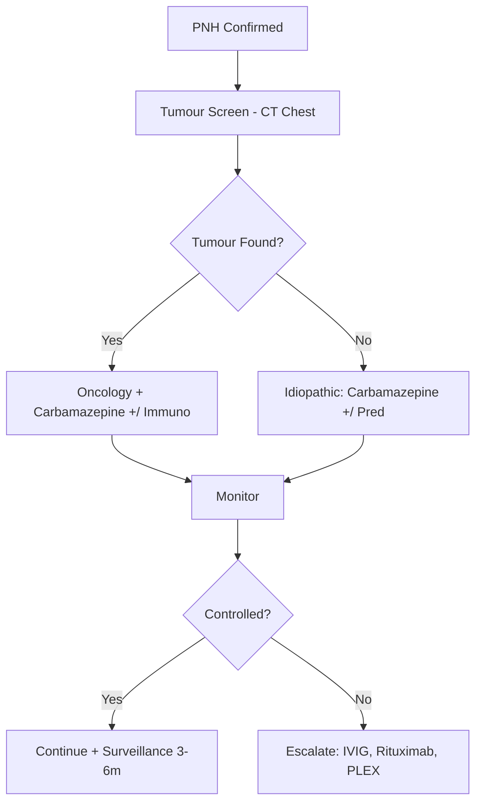

# Neuromyotonia (Isaacs Syndrome)

> [!tip] **Pearl**
> Neuromyotonia (peripheral nerve hyperexcitability, PNH) = **continuous muscle fibre activity** due to **presynaptic voltage-gated K+ channel (VGKC) antibodies** at the **peripheral motor nerve**. Hallmark: **myokymia (rippling), neuromyotonic discharges (bursting on EMG), cramps, stiffness, pseudomyotonia, hyperhidrosis**. Often paraneoplastic — **thymoma, SCLC, lymphoma**; sometimes antibody-mediated (anti-CASPR2, anti-LGI1).

Related: [[Lambert-Eaton Myasthenic Syndrome]], [[Cancer Screening in PNS]], [[Paraneoplastic Neurological Syndromes Hub]]

## Learning Objectives
- [ ] Define neuromyotonia and related PNH syndromes
- [ ] Distinguish from myotonia, tetany, dystonia, cramps
- [ ] Identify antibodies: anti-VGKC-complex (CASPR2, LGI1, Contactin-2)
- [ ] Investigate: NCS/EMG, antibody panel, tumour screen
- [ ] Screen for thymoma, SCLC, lymphoma
- [ ] Manage: carbamazepine, immunotherapy, tumour-directed

---

## 1. Definition / Epidemiology / Classification

### Definition
A disorder of **peripheral nerve hyperexcitability (PNH)** characterised by spontaneous, continuous muscle fibre activity due to **autoantibodies against presynaptic voltage-gated K+ channel (VGKC) complex proteins** (CASPR2 most common; LGI1, Contactin-2), leading to delayed nerve repolarisation, repetitive firing, and sustained muscle contraction.

### Epidemiology
- **Incidence:** Very rare (<1/million/year)
- **Age:** Any, peak 30-60y
- **Sex:** M > F (slight)
- **30-40% paraneoplastic**; 60-70% idiopathic/autoimmune

### Classification
| Type | Frequency | Associations |
|------|-----------|--------------|
| **Paraneoplastic (T-PNH)** | 30-40% | **Thymoma** (most common), SCLC, Hodgkin, ovarian |
| **Autoimmune (CASPR2 encephalitis)** | Variable | Limbic encephalitis, Morvan syndrome |
| **Idiopathic** | Most | Often seronegative |
| **Morvan syndrome** | Rare | PNH + limbic encephalitis + insomnia + autonomic; thymoma in 50% |

---

## 2. Aetiology / Pathophysiology

### Aetiology
- **Autoimmune:** Anti-VGKC-complex antibodies (CASPR2, LGI1, Contactin-2)
- **Paraneoplastic:** Tumour antigens cross-reactive with VGKC complex
- **Genetic:** None (acquired)
- **Other:** Post-infectious, drug-induced (rare)

### Pathophysiology

### Molecular Basis
- **VGKC complex proteins:** CASPR2 (most common neuromyotonia), LGI1 (limbic, faciobrachial dystonic seizures), Contactin-2
- **Mechanism:** Antibody binding → functional VGKC reduction → prolonged depolarisation → spontaneous/repetitive firing
- **Neuro-excitability studies:** Markedly increased axonal excitability
- **Autoantibody-mediated channelopathy** — both central (LGI1, Morvan) and peripheral (CASPR2) effects

---

## 3. Clinical Features

### History
- **Onset:** Insidious, progressive (months)
- **Symptoms:**
  - **Myokymia:** Continuous, fine, rippling muscle movements (visible under skin)
  - **Cramps:** Painful, often exercise-induced
  - **Stiffness / rigidity:** Especially calves, hands; interferes with gait
  - **Pseudomyotonia:** Slow relaxation (no percussion myotonia or true myotonic discharge)
  - **Hyperhidrosis:** Excessive sweating
  - **Paraesthesia:** Often focal or distal
  - **Weakness:** Mild distal weakness in some
  - **Insomnia, memory loss, confusion** (Morvan syndrome, limbic)

### Examination
| Domain | Findings | Localisation |
|--------|----------|--------------|
| **Motor** | **Myokymia** (rippling), **cramps**, mild distal weakness, **pseudomyotonia** | Peripheral motor nerve |
| **Tone** | Increased (continuous activity) | |
| **Reflexes** | Usually normal; may be brisk | |
| **Sensation** | Mild distal sensory loss / paraesthesia | |
| **Autonomic** | **Hyperhidrosis**, tachycardia, BP fluctuation | Autonomic nerve |
| **Coordination** | Normal | |
| **Higher cortical** | Insomnia, confusion, hallucinations (Morvan) | Limbic system |
| **Other** | Thymoma features (MG overlap, mass); SCLC features | Paraneoplastic |

### Specific Signs
- **Myokymia:** Fine, undulating, vermicular skin movement
- **Pseudomyotonia:** Delayed hand opening (no percussion myotonia, no "warm-up")
- **Lambert sign:** Brief exercise transiently improves

### Morvan Syndrome
- PNH + limbic encephalitis (memory loss, confusion, seizures) + insomnia + autonomic dysfunction
- 50% paraneoplastic (thymoma)

---

## 4. Diagnostic Approach / Algorithm

### Diagnostic Criteria
| Criterion | Detail |
|-----------|--------|
| **Clinical** | Myokymia, cramps, stiffness, pseudomyotonia |
| **Electrophysiology** | **Spontaneous single fibre discharges, doublets, triplets, multiplets, neuromyotonic bursts (high-frequency, decrementing)** |
| **Antibody** | Anti-VGKC-complex (CASPR2 most specific) |
| **Tumour screen** | CT chest (thymoma) ± CAP, ± PET |

### Severity Assessment
- Severity scale for stiffness/weakness/myokymia (0-3 or 0-5)
- Neuro-excitability studies (axonal excitability)

---

## 5. Investigations

### First-Line
| Test | Indication | Finding |
|------|------------|---------|
| **Serum anti-VGKC-complex** | All suspected PNH | CASPR2, LGI1, Contactin-2 |
| **Anti-AChR** | Exclude MG | Negative (or co-positive in thymoma) |
| **CK** | Baseline | Usually normal |
| **EMG/NCS** | Confirmatory | See below |

### Neurophysiology
| Test | Finding |
|------|---------|
| **EMG needle** | **Spontaneous single unit discharges**, **doublets/triplets/multiplets**, **neuromyotonic bursts (high-frequency 100-300Hz, decrementing)**; after-discharge |
| **NCS** | Normal motor/sensory conduction; ± mild distal CMAP reduction |
| **Neuro-excitability** | Increased axonal excitability (research) |

### Imaging
| Modality | Indication |
|----------|------------|
| **CT Chest** | **All** — thymoma (most common), SCLC, lymphoma |
| **MRI Brain** | If Morvan / limbic features (LGI1 encephalitis = mesial T2/FLAIR hyperintensity) |
| **PET-CT** | If initial screen negative but high clinical suspicion |

### Other
- Sleep study if Morvan (insomnia, REM behaviour)
- Cognitive/MRI if limbic features

---

## 6. Differential Diagnosis

| Differential | Distinguishing Features | Key Test |
|--------------|------------------------|----------|
| **Myotonia congenita / dystrophia myotonica** | True myotonic discharge ("dive-bomber"), percussion myotonia, family history, systemic features (DM1) | Clinical, EMG, genetic |
| **Stiff person syndrome** | Proximal > distal, anti-GAD, axial rigidity, antispasmodics help | Anti-GAD, EMG continuous agonist/antagonist |
| **Tetany (hypocalcaemia)** | Trousseau/Chvostek, perioral tingling, carpopedal spasm | Calcium, Mg, ABG |
| **Cramps / benign fasciculation** | No EMG discharges, no stiffness, no antibody | Clinical |
| **ALS** | Progressive weakness + UMN + LMN, no myokymia or antibody | EMG denervation, normal anti-VGKC |
| **Focal dystonia** | Task-specific, no EMG discharges, no antibody | Clinical, EMG normal |
| **Morvan syndrome (variant)** | PNH + limbic + insomnia + autonomic | Anti-CASPR2, MRI limbic |

---

## 7. Management

### Symptomatic / First-line
| Agent | Dose | Notes |
|-------|------|-------|
| **Carbamazepine** | 200-1200 mg/day | **First-line**: blocks Na+ channels → suppresses ectopic firing |
| **Phenytoin** | 200-400 mg/day | Alternative; Na+ channel blocker |
| **Lamotrigine** | 50-300 mg/day | Alternative |
| **Gabapentin / Pregabalin** | Variable | Adjunct for neuropathic pain |
| **Mexiletine** | 200-600 mg/day | Na+ channel blocker; useful for myotonia-like symptoms |

### Immunomodulation
| Agent | Indication | Dose |
|-------|------------|------|
| **Prednisolone** | Moderate-severe | 1 mg/kg, slow taper |
| **IVIG** | Acute exacerbation | 2 g/kg over 2-5 days |
| **Plasma exchange** | Severe / Morvan | 5 exchanges every other day |
| **Rituximab** | Refractory / Morvan | 375 mg/m2 weekly ×4 |
| **Azathioprine** | Steroid-sparing | 2-2.5 mg/kg/day |
| **Mycophenolate** | Alternative | 1-2 g/day |

### Tumour-Directed
- **Thymoma:** Thymectomy ± chemo/radiotherapy (often MG coexists)
- **SCLC / lymphoma / others:** Per oncology

### Algorithm

### Special Populations
- **Pregnancy:** Carbamazepine teratogenic; consider lamotrigine, gabapentin
- **Elderly:** Lower starting dose; falls risk with stiffness

---

## 8. Drug Interactions / Contraindications
| Drug | Caution |
|------|---------|
| **Carbamazepine** | **CYP3A4 inducer** — ↓warfarin, DOACs, OCP, many AEDs; SIADH, agranulocytosis, SJS/TEN (HLA-B*1502) |
| **Phenytoin** | CYP inducer, gum hyperplasia, SJS |
| **Lamotrigine** | SJS/TEN (slow titration) |
| **Rituximab** | Hepatitis B, PML |

---

## 9. Procedures
- **EMG/NCS** — confirmatory
- **Thymectomy** — if thymoma
- **Tumour biopsy** — for definitive cancer treatment

---

## 10. Complications
| Complication | Frequency | Management |
|--------------|-----------|------------|
| **Falls / immobility** | Common | PT, falls prevention |
| **Hyperthermia / rhabdomyolysis** | Severe muscle activity | Cooling, IV fluids, dantrolene |
| **Respiratory failure** | Rare | Ventilatory support |
| **Limbic encephalitis (Morvan)** | 30-50% Morvan | Immunotherapy, seizures Rx |
| **Sleep disturbance** | Common (Morvan) | Sedation, melatonin |
| **Drug side effects** | Variable | Monitor |

---

## 11. Red Flags
| Red Flag | Action |
|----------|--------|
| **Rapid respiratory decline** | ICU, ventilation |
| **Status myoclonus / seizures (Morvan)** | Urgent MRI, EEG, immunotherapy |
| **New thymoma / mass** | Oncology referral |
| **Hyperthermia / rhabdomyolysis** | Stop offending agent, cool, IV fluids |

---

## 12. Prognosis
- **Idiopathic:** Stable, may remit with immunotherapy
- **Paraneoplastic:** Tumour-dependent
- **Morvan:** Variable; can be severe
- **Disability:** Mild-moderate in most; significant in Morvan

---

## 13. Topic Correlation
| Related Topic | Key Overlap |
|---------------|-------------|
| [[Lambert-Eaton Myasthenic Syndrome]] | Both paraneoplastic NMJ/nerve disorders; Ca2+ vs K+ channel |
| [[Stiff Person Syndrome]] | Stiffness differential; anti-GAD vs anti-VGKC |
| [[Cancer Screening in PNS]] | Thymoma, SCLC screen |
| [[Morvan Syndrome]] | PNH + limbic + insomnia + autonomic |

---

## 14. Special Situations
| Situation | Consideration |
|-----------|---------------|
| **Pregnancy** | Carbamazepine teratogenic; lamotrigine/gabapentin |
| **Paediatric** | Very rare; consider genetic channelopathy |
| **Elderly** | Lower carbamazepine dose; falls risk |
| **Anaesthesia** | Avoid depolarising muscle relaxants (sensitivity); volatile anaesthetics |
| **Driving** | DVLA notification if symptoms impair driving |
| **Occupational** | Manual handling restrictions |

---

## FCPS/MRCP High-Yield Summary
| Category | Key Points |
|----------|------------|
| **Definition** | Peripheral nerve hyperexcitability (PNH); anti-VGKC-complex (CASPR2, LGI1) |
| **Epidemiology** | Very rare; 30-40% paraneoplastic |
| **Pathophysiology** | ↓ K+ efflux → delayed repolarisation → repetitive firing |
| **Localisation** | Peripheral motor nerve + autonomic |
| **Clinical** | **Myokymia**, cramps, stiffness, pseudomyotonia, hyperhidrosis |
| **Diagnosis** | EMG: neuromyotonic bursts; **anti-CASPR2/LGI1**; CT chest (thymoma) |
| **Differentials** | Myotonia (DM1), stiff person, tetany, ALS, dystonia |
| **Management** | **Carbamazepine first-line**; immunotherapy; tumour treatment |
| **Prognosis** | Tumour-dependent in paraneoplastic |
| **Viva Pearl** | "Myokymia + neuromyotonic discharges + thymoma = Isaacs"; "Morvan = PNH + limbic + insomnia" |

---

## Viva Questions
1. **Q:** Define neuromyotonia and the typical clinical features.
   **A:** Neuromyotonia (PNH) = continuous muscle fibre activity due to anti-VGKC-complex antibodies (CASPR2). Features: myokymia (rippling skin), cramps, stiffness, pseudomyotonia, hyperhidrosis.
2. **Q:** What are the characteristic EMG findings?
   **A:** Spontaneous single unit discharges, doublets/triplets/multiplets, **neuromyotonic bursts (high-frequency 100-300Hz, decrementing)**.
3. **Q:** What is Morvan syndrome?
   **A:** PNH + limbic encephalitis (memory loss, confusion, seizures) + insomnia + autonomic dysfunction. 50% thymoma-associated. Anti-CASPR2.
4. **Q:** First-line treatment?
   **A:** **Carbamazepine** (Na+ channel blocker) — usually dramatically effective.
5. **Q:** Most common tumour associated with neuromyotonia?
   **A:** **Thymoma** (also SCLC, lymphoma).
6. **Q:** How does neuromyotonia differ from myotonia?
   **A:** Neuromyotonia = nerve hyperexcitability (peripheral, after-discharge, neuromyotonic bursts); Myotonia = muscle membrane (percussion myotonia, "dive-bomber" discharges, warm-up, family history).

---

## Common Confusions
| Confusion | Clarification |
|-----------|---------------|
| Myokymia vs fasciculation | Myokymia = grouped/rippling, visible; fasciculation = single fibre, random |
| Pseudomyotonia vs myotonia | Pseudomyotonia = delayed relaxation, no percussion, no dive-bomber; Myotonia = percussion + EMG |
| PNH vs stiff person | PNH = nerve origin (Na+/K+); SPS = CNS (GAD, GABAergic) |
| Morvan vs limbic encephalitis | Morvan = PNH + limbic + insomnia + autonomic; limbic alone = LGI1, often no PNH |

---

## Mnemonics
1. **ISAACS = PNH = VGKC** — **I**saacs = **S**timulation = **A**nti-**A**b = **C**arbamazepine = **S**weating (autonomic)
2. **VGKC** — **V**oltage-gated **K**+ **C**hannel antibodies → CASPR2 / LGI1
3. **Thymoma** — always exclude in PNH

---

## One-Page Revision Card
| Topic | Neuromyotonia (Isaacs Syndrome) |
|-------|--------------------------------|
| Definition | PNH; anti-VGKC-complex (CASPR2, LGI1) |
| Clinical | Myokymia, cramps, stiffness, pseudomyotonia, hyperhidrosis |
| Morvan | PNH + limbic + insomnia + autonomic; 50% thymoma |
| Diagnosis | EMG: neuromyotonic bursts (100-300Hz); anti-CASPR2/LGI1; CT chest |
| Differentials | Myotonia, stiff person, tetany, ALS, dystonia |
| Management | **Carbamazepine first-line**; immunotherapy; tumour treatment |
| Tumour | **Thymoma** (most), SCLC, lymphoma |
| Prognosis | Tumour-dependent in paraneoplastic |

---

## MCQs (10)
1. **Q:** Neuromyotonia is associated with antibodies against:
   **Options:** A. AChR B. MuSK C. VGKC-complex (CASPR2) D. LRP4
   **Answer:** C
2. **Q:** Characteristic EMG finding in neuromyotonia:
   **Options:** A. Fibrillations B. Neuromyotonic bursts C. Myotonic discharges D. Fasciculations alone
   **Answer:** B
3. **Q:** First-line drug for neuromyotonia:
   **Options:** A. Pyridostigmine B. Carbamazepine C. Prednisolone D. IVIG
   **Answer:** B
4. **Q:** Most common tumour in neuromyotonia:
   **Options:** A. SCLC B. Thymoma C. Breast D. Lymphoma
   **Answer:** B
5. **Q:** Morvan syndrome includes all EXCEPT:
   **Options:** A. PNH B. Limbic encephalitis C. Insomnia D. Chorea
   **Answer:** D
6. **Q:** What is the mechanism of carbamazepine in PNH?
   **Options:** A. GABA agonist B. Na+ channel blocker → ↓ ectopic firing C. K+ channel opener D. Complement inhibition
   **Answer:** B
7. **Q:** Pseudomyotonia differs from myotonia by:
   **Options:** A. Has percussion myotonia B. No dive-bomber discharge, no percussion C. Family history D. Genetic basis
   **Answer:** B
8. **Q:** Most specific antibody for paraneoplastic PNH:
   **Options:** A. Anti-CASPR2 B. Anti-Hu C. Anti-Yo D. Anti-Ri
   **Answer:** A
9. **Q:** In neuromyotonia, autonomic features include:
   **Options:** A. Diarrhoea B. Hyperhidrosis C. Hypotension D. Bradycardia
   **Answer:** B
10. **Q:** Reflexes in PNH are typically:
    **Options:** A. Absent B. Brisk but normal C. Decreased D. Pendular
    **Answer:** B

---

## SBA Questions (10)
1. **Scenario:** 40-year-old with 6-month progressive muscle stiffness, visible rippling under skin, painful cramps, hyperhidrosis. EMG shows neuromyotonic bursts. Diagnosis?
   **Options:** A. Stiff person syndrome B. Isaacs syndrome C. Myotonia congenita D. ALS
   **Answer:** B
2. **Scenario:** Same patient — anti-CASPR2 positive, CT chest shows anterior mediastinal mass. Diagnosis:
   **Options:** A. SCLC B. Thymoma C. Lymphoma D. Teratoma
   **Answer:** B
3. **Scenario:** 50-year-old with PNH, confusion, memory loss, severe insomnia. Diagnosis:
   **Options:** A. Stiff person syndrome B. Morvan syndrome C. Anti-NMDAR D. Whipple's
   **Answer:** B
4. **Scenario:** First-line treatment for Isaacs syndrome symptoms:
   **Options:** A. Carbamazepine B. Prednisolone C. Pyridostigmine D. IVIG
   **Answer:** A
5. **Scenario:** PNH patient on carbamazepine with worsening. Next step:
   **Options:** A. Stop carbamazepine B. Add immunotherapy (steroids, IVIG) C. Increase carbamazepine alone D. Plasmapheresis weekly
   **Answer:** B
6. **Scenario:** 35-year-old with PNH, anti-CASPR2 positive, thymoma on CT. Next:
   **Options:** A. Symptomatic Rx B. Thymectomy + oncology C. Steroids alone D. Rituximab only
   **Answer:** B
7. **Scenario:** Carbamazepine side effect of which type:
   **Options:** A. SIADH, agranulocytosis, SJS B. Pancreatitis, hyperlipidaemia C. Hair loss, neuropathy D. Hyperpigmentation
   **Answer:** A
8. **Scenario:** Which antibody group does LGI1 belong to?
   **Options:** A. Anti-NMDAR B. VGKC-complex C. Anti-GAD D. Anti-GQ1b
   **Answer:** B
9. **Scenario:** PNH with respiratory failure. Immediate step:
   **Options:** A. Discharge B. ICU + ventilation + immunotherapy escalation C. Oral steroids D. Lumbar puncture
   **Answer:** B
10. **Scenario:** PNH patients need to be screened for:
    **Options:** A. Renal cell carcinoma B. Thymoma, SCLC, lymphoma C. Melanoma D. Pancreatic cancer
    **Answer:** B

---

## Flashcards
- **Q:** Autoantigen in PNH? **A:** VGKC-complex (CASPR2, LGI1)
- **Q:** EMG finding? **A:** Neuromyotonic bursts (100-300Hz, decrementing)
- **Q:** First-line Rx? **A:** Carbamazepine (Na+ channel blocker)
- **Q:** Most common tumour? **A:** Thymoma
- **Q:** Morvan syndrome? **A:** PNH + limbic + insomnia + autonomic
- **Q:** Myokymia? **A:** Rippling, undulating skin movements
- **Q:** Pseudomyotonia vs myotonia? **A:** Pseudomyotonia = delayed relaxation, no percussion/dive-bomber
- **Q:** Anti-CASPR2 significance? **A:** Specific for paraneoplastic PNH
- **Q:** LGI1 disease features? **A:** Limbic encephalitis, FBDS, hyponatraemia
- **Q:** Carbamazepine cautions? **A:** CYP inducer, SJS (HLA-B*1502), SIADH, agranulocytosis

---

## Answer Key

### MCQs
1. **C** — Anti-VGKC-complex (CASPR2)
2. **B** — Neuromyotonic bursts pathognomonic
3. **B** — Carbamazepine first-line
4. **B** — Thymoma most common
5. **D** — Morvan = PNH + limbic + insomnia + autonomic (no chorea)
6. **B** — Na+ channel blocker
7. **B** — No percussion, no dive-bomber
8. **A** — Anti-CASPR2 most specific
9. **B** — Hyperhidrosis
10. **B** — Normal/brisk reflexes

### SBAs
1. **B** — Myokymia + cramps + hyperhidrosis + neuromyotonic bursts = Isaacs
2. **B** — Anterior mediastinal mass = thymoma
3. **B** — PNH + limbic + insomnia = Morvan
4. **A** — Carbamazepine first-line
5. **B** — Add immunotherapy for refractory
6. **B** — Thymectomy + oncology
7. **A** — SIADH, agranulocytosis, SJS
8. **B** — LGI1 = VGKC-complex
9. **B** — ICU + ventilation + escalation
10. **B** — Thymoma, SCLC, lymphoma

---

## Local Navigation
**Heading Hub:** [[01_Fundamentals_Examination/Fundamentals & Examination Hub]]
**Topic-Group Hub:** [[19_Paraneoplastic_Neurological_Syndromes/Paraneoplastic Neurological Syndromes Hub]]
**Chapter Hierarchy:** [[Davidson Chapter 25 - Neurology Hierarchy]]
**Chapter MOC:** [[Neurology MOC]]
**Related Topics:** [[Lambert-Eaton Myasthenic Syndrome]], [[Stiff Person Syndrome]], [[Cancer Screening in PNS]]

## PasTest Scenario SBAs (Clinical Vignettes)

> **Auto-generated PasTest/Mediscope-style scenario SBAs** grounded in the authored source. Each scenario tests a real clinical fact (triad, specific sign, contraindication, trial, first-line Rx) extracted from the topic. *Source: Ch 27: Neurology & Stroke — Neuromyotonia Isaacs Syndrome*

**Q1.** Which of the following features is most specific or characteristic of Neuromyotonia Isaacs Syndrome?

  - **A.** Focal dystonia
  - **B.** A feature common to many acute inflammatory conditions
  - **C.** A non-specific sign that does not localise the diagnosis
  - **D.** An investigation finding rather than a clinical feature

  > **Answer: A** — Focal dystonia
  >
  > *Source:* | Progressive weakness + UMN + LMN, no myokymia or antibody | EMG denervation, normal anti-VGKC |
| **Focal dystonia** | Task-specific, no EMG discharges, no antibody | Clinical, EMG normal |
| **Morv

**Q2.** What is the most appropriate first-line therapy for Neuromyotonia Isaacs Syndrome?

  - **A.** Carbamazepine
  - **B.** An advanced/surgical therapy reserved for refractory disease
  - **C.** Symptomatic treatment only, no disease-modifying therapy
  - **D.** Empiric broad-spectrum therapy without specific indication

  > **Answer: A** — Carbamazepine
  >
  > *Source:* **Carbamazepine**   200-1200 mg/day   **First-line**: blocks Na+ channels → suppresses ectopic firing

