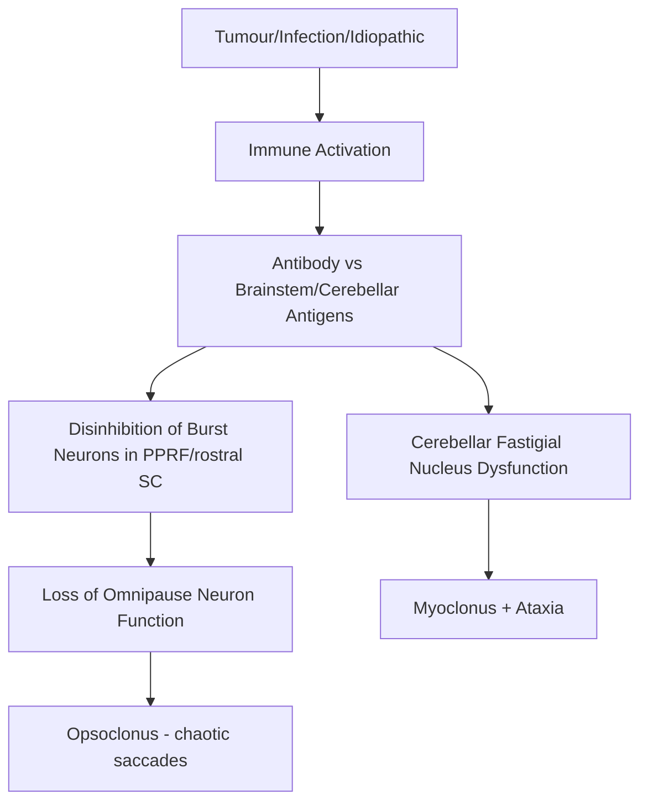
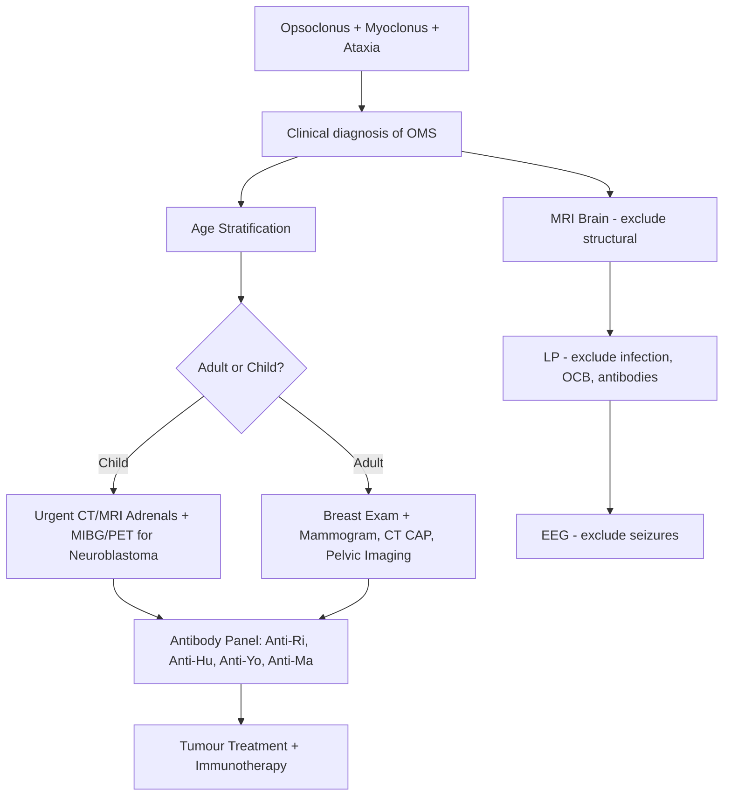
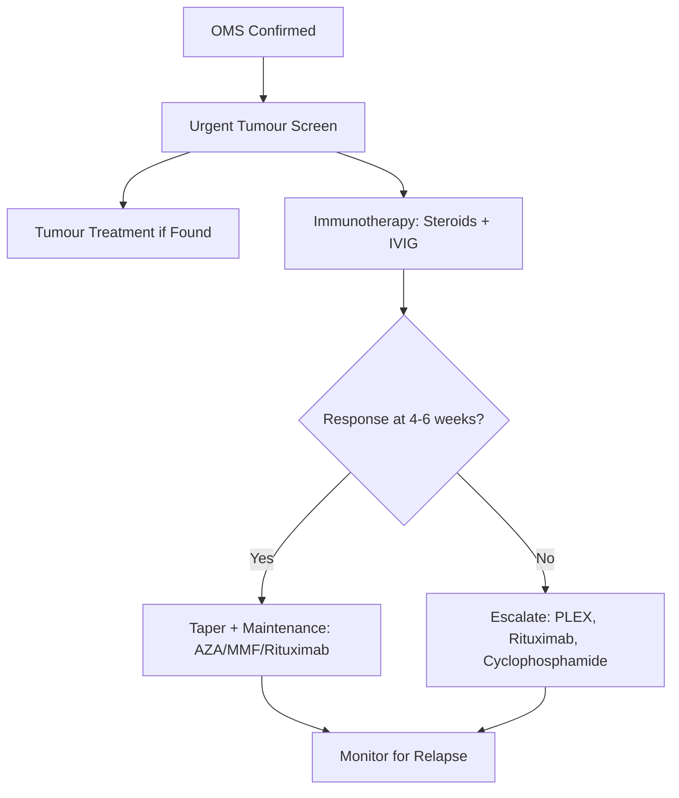

# Opsoclonus-Myoclonus Syndrome (OMS / "Dancing Eyes-Dancing Feet")

> [!tip] **Pearl**
> OMS = **opsoclonus** (chaotic, multi-directional conjugate saccades) + **myoclonus** (body/trunk) + **ataxia/cerebellar signs** ± **encephalopathy/behavioural change**. **"Dancing eyes, dancing feet"**. In **children**: usually **paraneoplastic — neuroblastoma**; in **adults**: often **paraneoplastic (SCLC, breast)** or post-infectious. **Anti-Ri (ANNA-2)** in adults (breast, SCLC); in children often **anti-Hu or seronegative**.

Related: [[Paraneoplastic Cerebellar Degeneration]], [[Cancer Screening in PNS]], [[Paraneoplastic Encephalitis]], [[Paraneoplastic Neurological Syndromes Hub]]

## Learning Objectives
- [ ] Define OMS and its key features
- [ ] Recognise opsoclonus vs nystagmus vs ocular flutter
- [ ] Identify causes: paraneoplastic (neuroblastoma in children; SCLC, breast in adults) and non-paraneoplastic
- [ ] Investigate: imaging, antibody panel, tumour screen
- [ ] Initiate immunotherapy: steroids, IVIG, rituximab
- [ ] Counsel on prognosis and tumour association

---

## 1. Definition / Epidemiology / Classification

### Definition
A **multifocal neurological disorder** characterised by the **clinical triad of opsoclonus + myoclonus + ataxia**, with or without encephalopathy, caused by autoimmune (often paraneoplastic) dysfunction of **brainstem/cerebellar circuit (omnipause neurons, fastigial nucleus)**.

### Epidemiology
- **Incidence:** Children 0.18/million/year; Adults 1/10 million
- **Children:** Median age 18 months; F > M; 50% paraneoplastic (neuroblastoma)
- **Adults:** Peak 40-50y; F > M; 50% paraneoplastic (SCLC, breast, ovarian)
- **Long-term disability:** High (cognitive, motor, sleep) — esp. children if delayed

### Classification
| Type | Frequency | Associations |
|------|-----------|--------------|
| **Paraneoplastic (children)** | 50% | Neuroblastoma (most common) |
| **Paraneoplastic (adults)** | 50% | SCLC, breast, ovarian, Hodgkin, teratoma |
| **Non-paraneoplastic (adults)** | 30-40% | Post-infectious, idiopathic, autoimmune |
| **Non-paraneoplastic (children)** | 50% | Post-infectious, idiopathic |

---

## 2. Aetiology / Pathophysiology

### Aetiology
- **Paraneoplastic:** Tumour antigens cross-react with neuronal antigens in brainstem/cerebellum
- **Infectious / post-infectious:** EBV, HSV, enterovirus, CJD, HIV, Lyme, mycoplasma
- **Autoimmune:** Coeliac, anti-GAD, MS, NMO
- **Drugs / toxins:** Lithium, SSRIs, organophosphates, thallium, cocaine
- **Metabolic:** Hyperosmolar non-ketotic, Wernicke's
- **Idiopathic**

### Pathophysiology

### Molecular Basis
- **Antibody targets:**
  - **Anti-Ri (ANNA-2):** adults; breast, SCLC, ovarian
  - **Anti-Hu (ANNA-1):** children with neuroblastoma; adults SCLC
  - **Anti-Yo, anti-Ma, anti-CV2/CRMP5:** less common
  - **Anti-GAD, anti-NMDAR, anti-DPPX:** atypical
- **Many paediatric cases seronegative**
- **Target cells:** Omnipause neurons (pons), cerebellar fastigial nucleus, Purkinje cells

---

## 3. Clinical Features

### History
- **Onset:** Subacute (days to weeks)
- **Key symptoms:**
  - **Opsoclonus:** Continuous, chaotic, multi-directional eye movements (horizontal, vertical, torsional); persists in sleep
  - **Myoclonus:** Trunk, limbs, face; stimulus-sensitive
  - **Ataxia:** Truncal, gait; unable to sit/stand
  - **Behavioural / cognitive:** Irritability, sleep disturbance, cognitive decline, rage, mutism (children)
  - **Vomiting, lethargy** (children)
  - **Dysarthria, dysphagia**
  - **Constitutional:** Weight loss, night sweats, cough (paraneoplastic)

### Examination
| Domain | Findings | Localisation |
|--------|----------|--------------|
| **Higher cortical** | Cognitive impairment, behaviour change (children) | Cerebral/cerebellar |
| **Cranial nerves** | **Opsoclonus** (chaotic, multidirectional, no inter-saccadic interval); preserved consciousness | Brainstem omnipause/cerebellar |
| **Motor** | **Myoclonus** (multifocal, stimulus-sensitive), weakness (mild) | Cerebellar / brainstem |
| **Coordination** | **Truncal + limb ataxia** (severe) | Cerebellar |
| **Gait** | Ataxic, unable to walk | Cerebellar |
| **Autonomic** | Sleep disturbance, irritability | |

### Opsoclonus vs Differentials
| Sign | Description | Distinguishing |
|------|-------------|----------------|
| **Opsoclonus** | Continuous, chaotic, multidirectional conjugate saccades; no inter-saccadic interval; persists in sleep | Brainstem/cerebellar |
| **Ocular flutter** | Similar to opsoclonus but purely horizontal | Brainstem |
| **Nystagmus** | Rhythmic, with slow phase + quick phase; suppressed by fixation | Vestibular/cerebellar |
| **Square-wave jerks** | Small horizontal saccades interrupting fixation | PSP, SCAs |

### Associated Findings (Paraneoplastic)
- **Children:** Abdominal mass, hypertension, weight loss, raccoon eyes (neuroblastoma)
- **Adults:** Breast mass, axillary nodes, cough, haemoptysis (SCLC)

---

## 4. Diagnostic Approach / Algorithm

### Diagnostic Criteria
| Criterion | Detail |
|-----------|--------|
| **Clinical** | Opsoclonus + myoclonus + ataxia ± encephalopathy |
| **Age stratification** | Children (neuroblastoma); adults (SCLC, breast) |
| **Antibody** | Anti-Ri (ANNA-2) most common in adults |
| **Imaging** | Tumour identified (chest/abdomen/pelvis ± PET) |
| **MRI brain** | Often normal; exclude structural, demyelination, CJD |

### Severity Assessment
- **OMS-DS (Disease Severity) score:** Motor, behaviour, sleep, ocular (0-12) — peds
- **Modified Rankin Scale** for adults

---

## 5. Investigations

### First-Line
| Test | Indication | Finding |
|------|------------|---------|
| **MRI Brain** | Exclude structural | Normal (or subtle cerebellar/brainstem T2 hyperintensity) |
| **Lumbar puncture** | Exclude infection, send OCB/antibodies | Mild pleocytosis, OCB, intrathecal antibody synthesis |
| **Antibody panel** | All | Anti-Ri, Hu, Yo, Ma, CV2, GAD, NMDAR |
| **Malignancy screen (children)** | Urgent | CT/MRI adrenals, MIBG, urinary catecholamines (VMA, HVA) |
| **Malignancy screen (adults)** | Urgent | CT CAP, mammogram, pelvic US, PET-CT |

### Cancer-Specific
| Population | Investigations |
|------------|---------------|
| **Children** | Urinary VMA/HVA, MIBG scan, MRI adrenals, CT chest/abdomen/pelvis |
| **Adults** | CT CAP, mammogram, breast MRI, pelvic US, FDG-PET-CT, tumour markers (CA-125, CA 15-3) |

### Neurophysiology
| Test | Finding |
|------|---------|
| **EEG** | Often normal or diffuse slowing; exclude seizures (myoclonus mimic) |
| **EMG** | Myoclonic bursts (cortical reflex myoclonus) |
| **SSEP** | Giant cortical responses (cortical myoclonus) |

---

## 6. Differential Diagnosis

| Differential | Distinguishing Features | Key Test |
|--------------|------------------------|----------|
| **Acute cerebellar ataxia (childhood)** | Post-varicella, milder, no opsoclonus | History, MRI normal |
| **CJD** | Rapid dementia, myoclonus, periodic sharp waves | RT-QuIC, MRI cortical ribboning, 14-3-3 |
| **Whipple's disease** | Oculomasticatory myorhythmia, weight loss, GI | PCR CSF/gut, duodenal biopsy |
| **Anti-NMDAR encephalitis** | Psychiatric, dyskinesias, seizures, hypoventilation | Anti-NMDAR Ab, ovarian teratoma |
| **Brainstem encephalitis (Bickerstaff)** | Ataxia, areflexia, ophthalmoplegia | Anti-GQ1b, MRI |
| **Metabolic/toxic encephalopathy** | Osmolar, drugs (lithium, OPs) | Glucose, osmolar, tox screen |
| **MS / NMO** | Demyelination, ON, myelitis | MRI, OCB, AQP4/MOG |
| **Cerebellar tumour / stroke** | Focal signs, headache | MRI |

---

## 7. Management

### Tumour-Directed (First Priority)
- **Children with neuroblastoma:** Surgical resection ± chemotherapy per oncology protocol
- **Adults with SCLC, breast, ovarian:** Tumour-specific therapy

### Immunotherapy
| Agent | Indication | Dose |
|-------|------------|------|
| **Corticosteroids** | First-line | Prednisolone 1-2 mg/kg/day or Methylprednisolone 30 mg/kg IV ×3-5d |
| **IVIG** | Often combined | 2 g/kg over 2-5 days, then 0.4-1 g/kg every 3-4 weeks |
| **Plasma exchange** | Severe | 5 exchanges every other day |
| **Rituximab** | Refractory / relapse | 375 mg/m2 weekly ×4 |
| **Cyclophosphamide** | Refractory | 500-1000 mg/m2 monthly |
| **Azathioprine** | Maintenance | 2-2.5 mg/kg/day |
| **Mycophenolate** | Maintenance | 1-2 g/day |

### Algorithm

### Supportive
- **Physiotherapy/OT:** Truncal ataxia, motor re-education
- **Speech therapy:** Dysarthria/dysphagia
- **Neuropsychology:** Cognitive, behavioural (esp. children)
- **Sleep:** Melatonin, behavioural strategies
- **School support / developmental input**

### Special Populations
- **Children:** Developmental surveillance, schooling, MDT
- **Pregnancy:** Limited data; IVIG safe; avoid cyclophosphamide, MMF
- **Elderly:** Treat tumour + immunotherapy with caution

---

## 8. Drug Interactions / Contraindications
| Drug | Caution |
|------|---------|
| **Corticosteroids** | Diabetes, hypertension, osteoporosis, infection, mood |
| **Cyclophosphamide** | Haemorrhagic cystitis (MESNA), infertility, malignancy |
| **Rituximab** | Hepatitis B reactivation, PML, infusion reactions |
| **IVIG** | Aseptic meningitis, thrombosis, anaphylaxis (IgA deficiency) |

---

## 9. Procedures
- **Lumbar puncture** — for CSF analysis
- **Tumour biopsy / resection** — definitive cancer treatment

---

## 10. Complications
| Complication | Frequency | Management |
|--------------|-----------|------------|
| **Cognitive / developmental delay** | High in children | Early intervention, education support |
| **Behavioural disturbance** | Common (children) | Behavioural therapy, melatonin, sedatives |
| **Sleep disturbance** | Common | Sleep hygiene, melatonin |
| **Relapse on taper** | 50-70% | Maintenance IST (rituximab, MMF) |
| **Long-term neurological sequelae** | High (motor, cognitive) | MDT rehabilitation |
| **Tumour progression** | Variable | Oncology follow-up |
| **Drug side effects** | Variable | Monitor (see above) |

---

## 11. Red Flags
| Red Flag | Action |
|----------|--------|
| **New abdominal mass in child** | Urgent neuroblastoma workup |
| **Breast mass in adult** | Urgent mammogram ± MRI |
| **Rapid deterioration** | Exclude CJD, fulminant infection, malignant infiltration |
| **Status myoclonus / respiratory compromise** | ICU, sedation, immunotherapy escalation |

---

## 12. Prognosis
- **Children:** Often good neurological recovery with tumour Rx + early aggressive immunotherapy; high relapse rate; cognitive and behavioural sequelae common
- **Adults:** Variable; better with successful tumour treatment; neurological recovery often incomplete
- **Predictors of good outcome:** Early treatment, tumour found and resected, single-modality immunotherapy response
- **Mortality:** Driven by underlying tumour; OMS itself rarely fatal

---

## 13. Topic Correlation
| Related Topic | Key Overlap |
|---------------|-------------|
| [[Paraneoplastic Cerebellar Degeneration]] | Overlapping; SCLC, breast, anti-Yo/Ri |
| [[Paraneoplastic Encephalitis]] | Anti-NMDAR, anti-Ma can cause OMS-like |
| [[Cancer Screening in PNS]] | Same age-specific workup |

---

## 14. Special Situations
| Situation | Consideration |
|-----------|---------------|
| **Pregnancy** | IVIG safe; avoid cyclophosphamide, MMF; tumour-specific MDT |
| **Lactation** | Limited data; check individual drug safety |
| **Paediatric** | Developmental surveillance; aggressive early immunotherapy; melatonin for sleep |
| **Elderly** | Caution with immunosuppression; consider supportive care |
| **Perioperative** | Continue steroids; monitor BP, glucose |
| **Vaccination** | Live vaccines contraindicated on immunosuppression |
| **Driving** | DVLA notification if symptoms impair driving (ataxia, vision) |

---

## FCPS/MRCP High-Yield Summary
| Category | Key Points |
|----------|------------|
| **Definition** | Triad: opsoclonus + myoclonus + ataxia ± encephalopathy |
| **Epidemiology** | Children: 50% neuroblastoma; Adults: 50% SCLC/breast |
| **Pathophysiology** | Autoimmune attack on brainstem omnipause + cerebellar fastigial nucleus |
| **Localisation** | Brainstem + cerebellum |
| **Clinical** | Dancing eyes, dancing feet; truncal ataxia, myoclonus; behavioural change (children) |
| **Diagnosis** | Clinical; MRI brain; antibody panel; **age-specific tumour screen** (MIBG/urine catecholamines in children; CT CAP/mammogram/PET in adults) |
| **Differentials** | CJD, Whipple's, NMDAR encephalitis, Bickerstaff, metabolic |
| **Management** | Tumour treatment + **aggressive immunotherapy** (steroids + IVIG → rituximab/cyclophosphamide) |
| **Prognosis** | High relapse rate; cognitive/motor sequelae common in children |
| **Viva Pearl** | "Dancing eyes-dancing feet in a toddler = neuroblastoma until proven otherwise" |

---

## Viva Questions
1. **Q:** What are the components of the OMS clinical triad?
   **A:** Opsoclonus (chaotic multidirectional saccades) + myoclonus + ataxia ± encephalopathy.
2. **Q:** What tumour is most commonly associated with OMS in children?
   **A:** **Neuroblastoma** — present in 50% of paediatric OMS.
3. **Q:** What antibody is most commonly associated with OMS in adults?
   **A:** **Anti-Ri (ANNA-2)** — associated with breast, SCLC, ovarian cancers.
4. **Q:** How does opsoclonus differ from nystagmus?
   **A:** Opsoclonus = chaotic, multidirectional, continuous, persists in sleep, no slow phase. Nystagmus = rhythmic, with slow + quick phase, suppressed by fixation.
5. **Q:** What investigations are essential in a child with new-onset OMS?
   **A:** **Urgent neuroblastoma workup**: CT/MRI adrenals, urinary VMA/HVA, MIBG scan, ± PET.
6. **Q:** What is first-line immunotherapy for OMS?
   **A:** Corticosteroids + IVIG (2 g/kg), then taper with maintenance IST (rituximab/MMF/AZA).

---

## Common Confusions
| Confusion | Clarification |
|-----------|---------------|
| OMS vs cerebellar ataxia | Ataxia is part of OMS; OMS has the eye finding |
| Opsoclonus vs nystagmus | Opsoclonus = chaotic, no slow phase; nystagmus = rhythmic |
| Adult vs child OMS | Children = neuroblastoma; adults = SCLC/breast |
| Steroid monotherapy | Steroids alone usually insufficient; combine with IVIG and tumour Rx |

---

## Mnemonics
1. **"Dancing eyes, dancing feet"** — clinical hallmark
2. **Paediatric OMS = Neuroblastoma** — search adrenals
3. **Adult OMS = Anti-Ri** — breast + SCLC
4. **MIBG** = metaiodobenzylguanidine (neuroblastoma imaging)

---

## One-Page Revision Card
| Topic | Opsoclonus-Myoclonus Syndrome |
|-------|------------------------------|
| Definition | Triad: opsoclonus + myoclonus + ataxia |
| Children | 50% paraneoplastic — **neuroblastoma** (MIBG, urine VMA/HVA) |
| Adults | 50% paraneoplastic — **SCLC, breast, ovarian** (Anti-Ri / ANNA-2) |
| Antibodies | Anti-Ri (adults), Anti-Hu (children/SCLC), many seronegative |
| MRI brain | Usually normal; exclude structural, demyelination |
| Differentials | CJD, Whipple's, NMDAR encephalitis, Bickerstaff |
| Management | Tumour treatment + **aggressive immunotherapy** (steroids + IVIG → rituximab/cyclophosphamide) |
| Prognosis | High relapse rate; cognitive/motor sequelae in children |

---

## MCQs (10)
1. **Q:** OMS triad is:
   **Options:** A. Opsoclonus, ataxia, dementia B. Opsoclonus, myoclonus, ataxia C. Nystagmus, myoclonus, seizures D. Opsoclonus, chorea, dementia
   **Answer:** B
2. **Q:** Most common tumour in paediatric OMS?
   **Options:** A. Wilms B. Neuroblastoma C. Retinoblastoma D. Medulloblastoma
   **Answer:** B
3. **Q:** Antibody most associated with adult paraneoplastic OMS?
   **Options:** A. Anti-Hu B. Anti-Ri (ANNA-2) C. Anti-Yo D. Anti-NMDAR
   **Answer:** B
4. **Q:** Opsoclonus differs from nystagmus by:
   **Options:** A. Rhythmic slow phase B. No slow phase, chaotic, multidirectional C. Suppressible by fixation D. Worse in sleep
   **Answer:** B
5. **Q:** First-line tumour investigation in child with new OMS:
   **Options:** A. CT chest B. CT/MRI adrenals + MIBG C. Mammogram D. MRI brain
   **Answer:** B
6. **Q:** First-line immunotherapy for OMS:
   **Options:** A. IVIG only B. Steroids + IVIG C. Rituximab only D. Cyclophosphamide only
   **Answer:** B
7. **Q:** Most useful urinary marker for neuroblastoma:
   **Options:** A. 5-HIAA B. VMA + HVA C. AFP D. Beta-hCG
   **Answer:** B
8. **Q:** What is the "dancing feet" feature of OMS?
   **Options:** A. Truncal myoclonus + ataxia B. Chorea C. Dystonia D. Seizure
   **Answer:** A
9. **Q:** Best imaging to detect occult neuroblastoma:
   **Options:** A. Plain X-ray B. MIBG scan C. CT chest D. MRI brain
   **Answer:** B
10. **Q:** What percentage of paediatric OMS is paraneoplastic?
    **Options:** A. 10% B. 30% C. 50% D. 80%
    **Answer:** C

---

## SBA Questions (10)
1. **Scenario:** 18-month-old with 2 weeks of irritability, chaotic eye movements, and trunk/limb jerks. CT abdomen shows adrenal mass. What is the most likely diagnosis?
   **Options:** A. Encephalitis B. Neuroblastoma-associated OMS C. Cerebellar astrocytoma D. Whipple's
   **Answer:** B
2. **Scenario:** 50-year-old woman with OMS, anti-Ri positive, mammogram normal. Next step?
   **Options:** A. Discharge B. Breast MRI / PET-CT for occult breast cancer C. Empirical chemo D. Lumbar puncture
   **Answer:** B
3. **Scenario:** Adult OMS, anti-Ri negative, anti-Hu positive, CT chest shows central mass. Diagnosis:
   **Options:** A. SCLC-associated OMS B. Breast cancer C. Lymphoma D. Ovarian cancer
   **Answer:** A
4. **Scenario:** Paediatric OMS after tumour resection, still symptomatic on weaning steroids. Next:
   **Options:** A. Stop treatment B. Maintenance IST (rituximab/MMF) + IVIG C. Increase steroids only D. No further treatment
   **Answer:** B
5. **Scenario:** Adult OMS with status myoclonus, autonomic instability. Initial step:
   **Options:** A. MRI brain B. ICU + IV sedatives + immunotherapy escalation C. Discharge C. LP only
   **Answer:** B
6. **Scenario:** Adult OMS unresponsive to steroids + IVIG + rituximab. Next:
   **Options:** A. Stop treatment B. Cyclophosphamide / PLEX C. Aspirin D. Memantine
   **Answer:** B
7. **Scenario:** Child with OMS, 24h urinary VMA elevated. This supports:
   **Options:** A. Pheochromocytoma B. Neuroblastoma C. Wilms D. Lymphoma
   **Answer:** B
8. **Scenario:** Adult with OMS, MRI brain normal, anti-Ri positive. CT chest shows mass. Next:
   **Options:** A. Symptomatic Rx B. Tumour biopsy + oncology referral C. Steroid trial D. Brain biopsy
   **Answer:** B
9. **Scenario:** What is the characteristic SSEP finding in OMS?
   **Options:** A. Normal B. Giant cortical responses (cortical myoclonus) C. Absent D. Delayed
   **Answer:** B
10. **Scenario:** What is the typical age of OMS in children?
    **Options:** A. Neonate B. 12-36 months C. 5-10 years D. Adolescent
    **Answer:** B

---

## Flashcards
- **Q:** OMS triad? **A:** Opsoclonus + myoclonus + ataxia
- **Q:** Paediatric OMS tumour? **A:** Neuroblastoma
- **Q:** Adult OMS antibody? **A:** Anti-Ri (ANNA-2)
- **Q:** Imaging for neuroblastoma? **A:** MIBG scan, MRI adrenals
- **Q:** Urinary marker for neuroblastoma? **A:** VMA + HVA
- **Q:** First-line immunotherapy? **A:** Steroids + IVIG
- **Q:** Refractory OMS? **A:** Rituximab, cyclophosphamide, PLEX
- **Q:** Relapse rate in paediatric OMS? **A:** 50-70%
- **Q:** CJD vs OMS? **A:** CJD = rapid dementia, periodic sharp waves, RT-QuIC+
- **Q:** Whipple's vs OMS? **A:** Whipple's = oculomasticatory myorhythmia, GI, PCR+

---

## Answer Key

### MCQs
1. **B** — Triad: opsoclonus + myoclonus + ataxia
2. **B** — Neuroblastoma in 50% paediatric
3. **B** — Anti-Ri/ANNA-2 most common in adults
4. **B** — No slow phase, chaotic
5. **B** — CT/MRI adrenals + MIBG
6. **B** — Steroids + IVIG
7. **B** — VMA + HVA
8. **A** — Truncal myoclonus + ataxia = "dancing feet"
9. **B** — MIBG scan
10. **C** — 50% paraneoplastic in children

### SBAs
1. **B** — Adrenal mass + child + OMS = neuroblastoma
2. **B** — Anti-Ri+ mandates occult breast cancer workup
3. **A** — Anti-Hu + SCLC
4. **B** — Maintenance IST to prevent relapse
5. **B** — Status myoclonus = ICU + escalation
6. **B** — Cyclophosphamide/PLEX for refractory
7. **B** — VMA + HVA = neuroblastoma
8. **B** — Tumour biopsy + oncology
9. **B** — Giant cortical responses (cortical myoclonus)
10. **B** — Median 18 months (12-36)

---

## Local Navigation
**Heading Hub:** [[01_Fundamentals_Examination/Fundamentals & Examination Hub]]
**Topic-Group Hub:** [[19_Paraneoplastic_Neurological_Syndromes/Paraneoplastic Neurological Syndromes Hub]]
**Chapter Hierarchy:** [[Davidson Chapter 25 - Neurology Hierarchy]]
**Chapter MOC:** [[Neurology MOC]]
**Related Topics:** [[Paraneoplastic Cerebellar Degeneration]], [[Cancer Screening in PNS]], [[Paraneoplastic Encephalitis]]

## PasTest Scenario SBAs (Clinical Vignettes)

> **Auto-generated PasTest/Mediscope-style scenario SBAs** grounded in the authored source. Each scenario tests a real clinical fact (triad, specific sign, contraindication, trial, first-line Rx) extracted from the topic. *Source: Ch 27: Neurology & Stroke — Opsoclonus-Myoclonus Syndrome*

**Q1.** Which of the following features is most specific or characteristic of Opsoclonus-Myoclonus Syndrome?

  - **A.** "Dancing eyes, dancing feet"
  - **B.** A feature common to many acute inflammatory conditions
  - **C.** A non-specific sign that does not localise the diagnosis
  - **D.** An investigation finding rather than a clinical feature

  > **Answer: A** — "Dancing eyes, dancing feet"
  >
  > *Source:* **"Dancing eyes, dancing feet"** — clinical hallmark
2

**Q2.** What is the most appropriate first-line therapy for Opsoclonus-Myoclonus Syndrome?

  - **A.** Adults with SCLC, breast, ovarian:
  - **B.** An advanced/surgical therapy reserved for refractory disease
  - **C.** Symptomatic treatment only, no disease-modifying therapy
  - **D.** Empiric broad-spectrum therapy without specific indication

  > **Answer: A** — Adults with SCLC, breast, ovarian:
  >
  > *Source:* **Adults with SCLC, breast, ovarian:** Tumour-specific therapy

