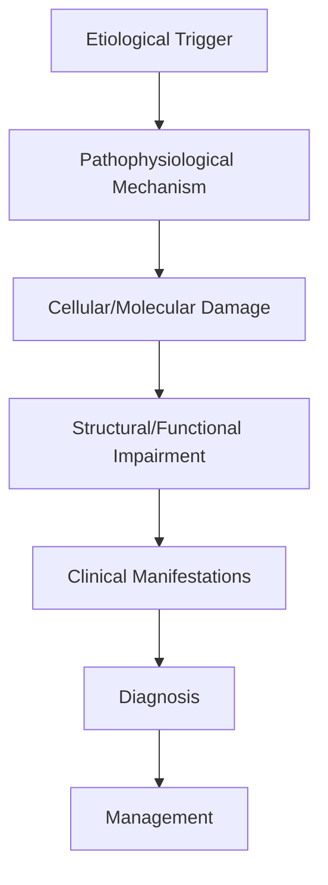
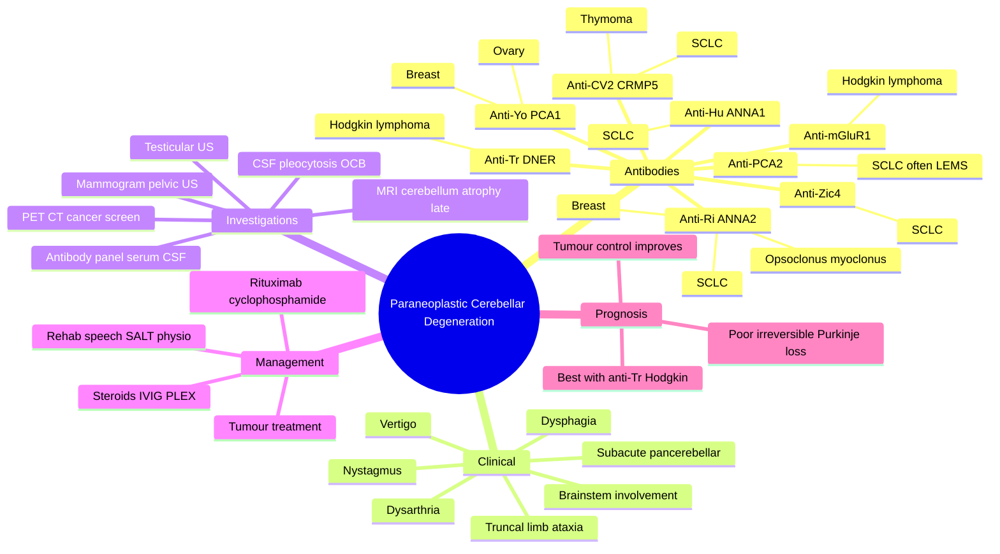

# Paraneoplastic Cerebellar Degeneration

> [!tip] **High-Yield Definition**
> Comprehensive clinical note for Paraneoplastic Cerebellar Degeneration covering definition, epidemiology, aetiology, pathophysiology, clinical features, investigations, differential diagnosis, management, drug interactions, procedures, complications, red flags, prognosis, topic correlation, and special situations for FCPS/MRCP examination preparation based on Davidson 24th Edition Chapter 25: Neurology.

---

## 1. Definition / Epidemiology / Classification

### Definition
Paraneoplastic Cerebellar Degeneration is a neurological disorder within the 19 paraneoplastic neurological syndromes category. It is characterised by specific clinical, pathological, radiological, and laboratory features that allow differentiation from related conditions.

### Epidemiology
- **Incidence/Prevalence:** Variable depending on the specific condition.
- **Age:** Adult onset is most common, but paediatric and elderly presentations occur.
- **Sex:** Variable depending on the condition.
- **Geography:** Worldwide distribution, with higher prevalence in certain regions.
- **Risk Factors:** Genetic predisposition, environmental factors, comorbidities, family history.

### Classification
| Subtype | Key Features | Prognosis |
|---------|-------------|-----------|
| Mild/early | Subtle symptoms, preserved function | Best |
| Moderate | Clear symptoms, functional impairment | Variable |
| Severe | Significant disability, complications | Worst |

---

## 2. Aetiology / Pathophysiology

### Aetiology
- **Primary (idiopathic):** Most cases have no identifiable cause.
- **Genetic:** May be inherited (AD, AR, X-linked, mitochondrial, sporadic).
- **Autoimmune:** Autoantibodies, immune-mediated inflammation.
- **Infectious:** Viral, bacterial, fungal, parasitic.
- **Metabolic:** Electrolyte, endocrine, hepatic, renal, nutritional.
- **Toxic:** Drugs, alcohol, heavy metals, environmental toxins.
- **Vascular:** Ischaemia, haemorrhage, vasculitis.
- **Neoplastic:** Primary, secondary, paraneoplastic.
- **Traumatic:** Acute, chronic, repetitive.
- **Degenerative:** Neurodegeneration, protein misfolding.

### Pathophysiology


---

## 3. Clinical Features

### History
- **Onset/Duration:** Acute, subacute, or chronic.
- **Progression:** Static, progressive, relapsing-remitting, stepwise.
- **Key symptoms:** Specific to the condition.
- **Triggers:** Stress, infection, trauma, drugs, hormonal, environmental.
- **Systemic symptoms:** Constitutional features.
- **Drug/Family/Social history:** Relevant exposures, comorbidities.

### Examination
| Domain | Key Findings | Localisation Value |
|--------|-------------|-------------------|
| Higher function | Cognitive, behavioural | Cortical, subcortical, limbic |
| Cranial nerves | Pupils, eye movements, facial, bulbar | Brainstem, cranial nerve, NMJ |
| Motor | Weakness, tone, reflexes | UMN, LMN, NMJ, muscle |
| Sensory | All modalities, pattern | Peripheral, spinal, brainstem |
| Coordination | Ataxia, nystagmus, dysmetria | Cerebellar, sensory, vestibular |
| Gait | Spastic, ataxic, parkinsonian | Multiple |
| Autonomic | Orthostatic, sweating, GI, bladder | Autonomic, peripheral, central |

### Specific Clinical Features
The clinical features are determined by the underlying aetiology, location of pathology, and rate of progression. Patients typically present with a constellation of symptoms and signs that allow clinical localisation and subsequent targeted investigation.

---

## 4. Diagnostic Approach / Algorithm

```mermaid
flowchart TD
    A[Clinical Presentation] --> B[Anatomical Localisation]
    B --> C[Pathophysiological Category]
    C --> D[Formulate Differential]
    D --> E[Targeted Investigations]
    E --> F[Confirm Diagnosis]
    F --> G[Assess Severity/Prognosis]
    G --> H[Initiate Management]
    H --> I[Monitor Response]
    I --> J{Response?}
    J --> YES1 [Good - Continue]
    J --> NO1 [Poor - Escalate]
    YES1 --> K[Monitor]
    NO1 --> H
```

---

## 5. Investigations

### First-Line Investigations
- **Blood tests:** FBC, U&Es, LFTs, glucose, calcium, magnesium, ESR, CRP, autoimmune, infection.
- **Imaging:** CT/MRI brain/spine (essential for most neurological conditions).
- **Neurophysiology:** EEG, nerve conduction, EMG, evoked potentials.
- **CSF:** Cell count, protein, glucose, OCBs, PCR, culture.

### Second-Line Investigations
- **Genetic testing:** Gene panels, WES, WGS.
- **Antibody testing:** Antineuronal, autoimmune, paraneoplastic.
- **Biopsy:** Nerve, muscle, brain, skin.
- **Advanced imaging:** PET-CT, MR spectroscopy, fMRI.

### Specialised Investigations
- **Biomarkers:** Neurofilament light chain, tau, beta-amyloid, 14-3-3, RT-QuIC.
- **Autonomic testing:** Head-up tilt, sudomotor, QSART.
- **Neuropsychology:** Cognitive testing, behavioural assessment.
- **Genetic counselling:** Family screening, predictive testing.

---

## 6. Differential Diagnosis

| Differential | Distinguishing Features | Key Test |
|--------------|------------------------|----------|
| Vascular | Sudden onset, focal, vascular risk factors | MRI/CT, vessel imaging |
| Inflammatory | Subacute, multifocal, systemic | MRI, CSF, antibodies |
| Infectious | Fever, systemic, exposure | Bloods, CSF, imaging |
| Neoplastic | Progressive, mass effect | MRI, biopsy |
| Degenerative | Progressive, symmetric, hereditary | MRI, genetic |
| Toxic/Metabolic | Drug history, systemic, reversible | Bloods, toxicology |
| Autoimmune | Multifocal, antibodies, immunotherapy response | Antibodies, MRI, CSF |
| Functional | Inconsistent, distractible | Clinical, video, biomarkers |

---

## 7. Management

### Acute Management
- **Stabilisation:** ABCDE approach, emergency resuscitation.
- **Specific treatment:** Disease-specific interventions.
- **Symptomatic relief:** Pain, seizures, spasticity, autonomic dysfunction.
- **Prevention of complications:** DVT, pressure sores, infection.

### Disease-Modifying Treatment
- **Pharmacological:** First-line, second-line, escalation, maintenance.
- **Procedural:** Surgery, biopsy, drainage, ablation, stimulation.
- **Immunotherapy:** Steroids, IVIG, plasma exchange, immunosuppressants, biologics.
- **Rehabilitation:** Physiotherapy, OT, speech therapy.

### Long-Term Management
- **Monitoring:** Clinical, imaging, biomarkers, side effects.
- **Prevention:** Vaccinations, prophylaxis, lifestyle modification.
- **Supportive care:** Multidisciplinary team, social work, psychological support.
- **Palliative care:** Advanced care planning, end-of-life care, hospice.

---

## 8. Drug Interactions / Contraindications / Comorbidity Cautions

| Drug Class | Interaction / Caution | Management |
|------------|----------------------|------------|
| Antiseizure medications | Enzyme induction, teratogenicity | Monitor, supplement, switch |
| Immunosuppressants | Infection, malignancy, teratogenicity | Monitor, prophylaxis |
| Anticoagulants | Bleeding risk, drug interactions | Monitor INR, avoid combinations |
| Antihypertensives | Hypotension, falls | Monitor BP, adjust dose |
| Antibiotics | Nephrotoxicity, ototoxicity | Monitor renal |
| Antivirals | Nephrotoxicity, neuropsychiatric | Monitor renal, dose adjust |
| Steroids | DM, HTN, osteoporosis, infection | Monitor, prophylaxis, taper |
| Biologics | Infusion reactions, infection | Monitor, prophylaxis |

---

## 9. Procedures

### Common Procedures
- **Lumbar puncture:** Diagnostic, therapeutic (IIH, NPH). Contraindications: raised ICP, mass lesion, coagulopathy.
- **Nerve conduction studies/EMG:** Diagnostic, prognosis. Minor discomfort.
- **EEG:** Diagnostic, monitoring. No significant complications.
- **MRI brain/spine:** Diagnostic, monitoring. Contraindications: pacemaker, metallic implants.
- **CT head:** Emergency, rapid. Radiation exposure, contrast reactions.
- **Biopsy:** Stereotactic, open. Indications: diagnosis, molecular profiling.

---

## 10. Complications

| Complication | Frequency | Prevention | Management |
|--------------|-----------|------------|------------|
| Infection | Common | Hygiene, prophylaxis, vaccination | Antibiotics, antifungals |
| Thrombosis | Common | Prophylaxis, mobility | Anticoagulation |
| Pressure sores | Common | Positioning, nutrition | Wound care, surgery |
| Spasticity | Common | Positioning, stretching | Baclofen, BoNT |
| Contractures | Common | Passive movements, splints | Physiotherapy, surgery |
| Aspiration | Common | Swallow assessment | NGT, PEG, thickeners |
| Falls | Common | Environment, mobility | Walking aids |
| Fractures | Common | Bone health, prevention | Vitamin D, bisphosphonate |
| Depression | Common | Screening, support | Antidepressants, CBT |
| Cognitive decline | Variable | Monitoring, training | Rehabilitation |
| Autonomic dysfunction | Variable | Monitoring, hydration | Midodrine, fludrocortisone |
| Respiratory failure | Variable | Monitoring, supportive | Ventilation, NIV |
| Death | Variable | Monitoring, palliative | End-of-life care |

---

## 11. Red Flags / Emergencies

### Emergency Presentations
- **Rapid neurological deterioration:** New focal deficit, decreased consciousness, seizures.
- **Status epilepticus:** Continuous seizures >5 min.
- **Raised ICP:** Headache, vomiting, papilloedema, altered consciousness.
- **Respiratory failure:** Hypoxia, hypercapnia, ventilatory failure.
- **Cardiac arrest:** Arrhythmia, MI, pulmonary embolism.
- **Infection:** Sepsis, meningitis, abscess, encephalitis.
- **Drug toxicity:** Overdose, side effects, interactions.
- **Haemorrhage:** Intracranial, systemic, coagulopathy.

---

## 12. Prognosis

### Natural History
- **Acute:** May resolve with treatment, may progress, may be fatal.
- **Subacute:** Variable, depends on cause and treatment.
- **Chronic:** Often progressive, may be stable, may have relapses.
- **Recovery:** Variable, may be complete, partial, or none.

### Prognostic Factors
- **Favourable:** Young age, early treatment, mild disease, reversible cause, good premorbid function, family support.
- **Unfavourable:** Older age, delayed treatment, severe disease, irreversible cause, poor premorbid function, comorbidities.

---

## 13. Topic Correlation

| Related Topic | Link | Key Overlap |
|---------------|------|-------------|
| Davidson 24th Ed Chapter 25 | [[Davidson Chapter 25 - Neurology Hierarchy]] | Comprehensive neurology |
| Neurology MOC | [[Neurology MOC]] | All neurology topics |
| Drug Reference | [[../00_Index/Neurology Drug Reference]] | Medications |
| Local Hub | [[../19_Paraneoplastic_Neurological_Syndromes/Hub]] | Section-specific |
| Clinical Examination | [[../01_Fundamentals_Examination/Neurological History Taking]] | Clinical approach |
| Investigation | [[../01_Fundamentals_Examination/Neuroimaging (CT-MRI) Principles]] | Imaging |

---

## 14. Special Situations

| Situation | Consideration |
|-----------|---------------|
| **Pregnancy** | Pre-conception counselling, teratogenicity, drug safety, monitoring, delivery planning, breastfeeding. |
| **Lactation** | Drug safety, breastfeeding, monitoring, support. |
| **Paediatric** | Developmental considerations, drug dosing, school, family, vaccination, growth, puberty. |
| **Elderly / Frail** | Comorbidities, polypharmacy, falls, bone health, cognition, social, end-of-life. |
| **Renal impairment** | Drug dose adjustment, monitoring, dialysis, transplant. |
| **Hepatic impairment** | Drug dose adjustment, monitoring, transplant. |
| **Immunocompromised** | Infection prophylaxis, vaccination, drug interactions, malignancy screening. |
| **Perioperative** | Drug management, anaesthesia planning, VTE prophylaxis, infection prevention, monitoring. |
| **Driving / DVLA** | Fitness to drive, restrictions, notification, reassessment. |
| **Occupational** | Fitness for work, adaptations, rehabilitation, disability, return to work. |

---

## FCPS/MRCP High-Yield Summary

| Category | Key Points |
|----------|------------|
| **Definition** | Comprehensive definition with key diagnostic criteria |
| **Epidemiology** | Incidence, prevalence, age, sex, geography, risk factors |
| **Aetiology** | Primary causes, secondary causes, genetic, environmental |
| **Pathophysiology** | Mechanism of disease, cellular/molecular basis |
| **Clinical Features** | History, examination, key findings, variants |
| **Diagnosis** | Diagnostic criteria, classification, severity |
| **Investigations** | First-line, second-line, specialised, biomarkers |
| **Differential Diagnosis** | Key differentials, distinguishing features, tests |
| **Management** | Acute, disease-modifying, symptomatic, supportive |
| **Complications** | Common, serious, prevention, management |
| **Prognosis** | Natural history, prognostic factors, outcomes |
| **Viva Pearls** | Key examination points |
| **Drug Doses** | First-line, second-line, emergency |
| **Scoring Systems** | Specific scores used in management |
| **Genetics** | Inheritance, genes, mutations, family screening |
| **Imaging Signs** | Characteristic findings, differential |

---

## Viva Questions (PACES/FCPS Style)

1. **Q:** Define and classify its variants.
   **A:** Comprehensive definition with classification of subtypes based on aetiology, severity, and clinical features.

2. **Q:** What are the key clinical features?
   **A:** Specific symptoms and signs including onset, progression, key features, and associated findings.

3. **Q:** What is the first-line treatment?
   **A:** First-line pharmacological and non-pharmacological management based on current evidence.

4. **Q:** What are the red flags requiring urgent referral?
   **A:** Specific emergency presentations and complications requiring immediate intervention.

5. **Q:** What is the prognosis?
   **A:** Natural history, prognostic factors, and long-term outcomes.

6. **Q:** How do you differentiate from key differentials?
   **A:** Clinical features, investigations, and response to treatment that distinguish from alternative diagnoses.

7. **Q:** What investigations are most useful?
   **A:** First-line and second-line investigations including imaging, neurophysiology, CSF, and biomarkers.

8. **Q:** Describe the stepwise management approach.
   **A:** Stepwise escalation from first-line to second-line to third-line therapy with monitoring.

9. **Q:** What are the emergency presentations?
   **A:** Specific emergency scenarios and immediate management priorities.

10. **Q:** How does management change in pregnancy/paediatrics/elderly?
    **A:** Special considerations for each population including drug safety, monitoring, and support.

---

## Common Confusions / Exam Traps

| Confusion | Clarification |
|-----------|---------------|
| Similar presentation but different cause | Differentiate by history, examination, investigations |
| Treatment response vs natural history | Assess with objective measures, biomarkers |
| Drug interactions | Check each drug, monitor, adjust doses |
| Disease progression vs treatment failure | Monitor response, escalate appropriately |
| Functional vs organic | Inconsistent, distractible, disability greater than impairment |
| Acute vs chronic | Time course, progression, reversibility |
| Primary vs secondary | Underlying cause, contributing factors |
| Side effects vs symptoms | Temporal relationship, dose relationship |

---

## Mnemonics

1. **TRAMP** — Antibody–tumour pairs in paraneoplastic cerebellar degeneration:
   **T**r (DNER) → Hodgkin lymphoma
   **R**i (ANNA-2) → Breast, SCLC
   **A**nti-Yo (PCA-1) → Ovary, breast
   **M**GluR1 → Hodgkin lymphoma
   **P**CA-2 (APCA) → SCLC (often with Lambert-Eaton)

2. **PAN-CEREBELLAR** — Clinical features of subacute pancerebellar degeneration:
   **P**rogressive over weeks–months
   **A**taxia (truncal + limb)
   **N**ystagmus (downbeat, gaze-evoked, opsoclonus if anti-Ri)
   **C**erebellar dysarthria (scanning speech)
   **E**ye movement abnormalities
   **R**eflexes preserved or hyperactive
   **E**sophageal dysmotility
   **B**rainstem signs late
   **E**xclude alcohol, thiamine, MS, genetic
   **L**ate cerebellar atrophy on MRI
   **L**ittle or no recovery
   **A**utoantibody testing essential

3. **YO-MA-TR-CV** — Antibody-driven cancer search algorithm in PCD:
   **Y**o → mammogram + pelvic US + CA-125 (breast/ovary)
   **O**therwise order whole-body PET-CT
   **M**a2 / Ri → testicular US + chest CT
   **A**nti-Tr → CT neck/chest/abdomen/pelvis ± PET for lymphoma
   **T**hyroid, thymus, lung → CT chest
   **R**epeat at 4–6 monthly intervals × 2 years
   **C**V2/CRMP5 → SCLC → CT chest
   **V**ideo-oculography to confirm

---

## Mind Map



---

## Spaced Repetition Trackers

| Day | Reviewer Score (/10) | Recall Notes | Re-study Targets |
|-----|----------------------|--------------|-------------------|
| Day 1 |  |  |  |
| Day 3 |  |  |  |
| Day 7 |  |  |  |
| Day 14 |  |  |  |
| Day 30 |  |  |  |
| Day 90 |  |  |  |

> **Spaced-retention rule:** If recall drops below 7/10, re-read section and repeat the Day-1 row.

---

## Self-Test Scorecard

Score each section **/5** after a single-pass read. Target ≥ 35/50 before exam.

| Section | Score | Weak Areas | Action Plan |
|---------|-------|------------|-------------|
| Definition / Epidemiology / Classification | /5 |  |  |
| Aetiology / Pathophysiology | /5 |  |  |
| Clinical Features | /5 |  |  |
| Diagnostic Approach / Algorithm | /5 |  |  |
| Investigations | /5 |  |  |
| Differential Diagnosis | /5 |  |  |
| Management | /5 |  |  |
| Drug Interactions / Contraindications / Comorbidity Cautions | /5 |  |  |
| Procedures | /5 |  |  |
| Complications | /5 |  |  |

> **Interpretation:** 40–50 = exam-ready; 30–39 = needs re-read; <30 = restart from section 1.

---

## MCQs (10)

1. **A 55-year-old woman develops gait ataxia, limb incoordination, scanning dysarthria, and downbeat nystagmus over 8 weeks. MRI brain is initially normal. The antibody most strongly predicting an underlying gynaecological or breast malignancy is:**
   - A. Anti-Hu (ANNA-1)
   - B. Anti-Yo (PCA-1)
   - C. Anti-Tr (DNER)
   - D. Anti-mGluR1

2. **A 24-year-old man presents with subacute pancerebellar degeneration and is found to have Hodgkin lymphoma. The associated antibody is most likely:**
   - A. Anti-Yo
   - B. Anti-Hu
   - C. Anti-Tr (DNER)
   - D. Anti-CRMP5

3. **A 60-year-old man with a 50-pack-year smoking history presents with rapidly progressive cerebellar ataxia, opsoclonus, myoclonus, and brainstem dysfunction. CT chest reveals a central hilar mass. The most likely antibody is:**
   - A. Anti-Yo
   - B. Anti-Ri (ANNA-2)
   - C. Anti-mGluR1
   - D. Anti-GAD65

4. **MRI brain in the early stage of paraneoplastic cerebellar degeneration most often shows:**
   - A. Marked cerebellar atrophy
   - B. Normal cerebellum or subtle T2/FLAIR hyperintensity
   - C. Cerebellar haemorrhage
   - D. Pontine infarct

5. **CSF in paraneoplastic cerebellar degeneration characteristically shows:**
   - A. Neutrophilic pleocytosis
   - B. Lymphocytic pleocytosis + oligoclonal bands
   - C. Albuminocytological dissociation
   - D. Normal CSF

6. **The pathological hallmark of paraneoplastic cerebellar degeneration is:**
   - A. Demyelination of cerebellar white matter
   - B. Diffuse loss of Purkinje cells with relative preservation of granule cells
   - C. Cerebellar abscess
   - D. Hypertrophy of the dentate nucleus

7. **Which is the most appropriate first-line cancer screen in a woman with anti-Yo antibodies?**
   - A. CT abdomen only
   - B. Mammogram + pelvic ultrasound + CA-125
   - C. Testicular ultrasound
   - D. Whole-body MRI only

8. **Anti-mGluR1 antibodies are most characteristically associated with:**
   - A. SCLC
   - B. Hodgkin lymphoma
   - C. Ovarian teratoma
   - D. Thymoma

9. **Compared with paraneoplastic encephalitis, paraneoplastic cerebellar degeneration generally has:**
   - A. Better recovery because cerebellum regenerates
   - B. Worse neurological prognosis due to irreversible Purkinje cell loss
   - C. Identical prognosis
   - D. Spontaneous remission in 50% of cases

10. **A patient with paraneoplastic cerebellar degeneration and anti-Tr antibodies has the BEST prognosis if:**
    - A. Antibody titre is highest
    - B. Hodgkin lymphoma is detected early and treated effectively
    - C. Brain MRI shows atrophy at presentation
    - D. They are over 65 years old

---

## SBA Questions (10)

1. **A 48-year-old woman develops truncal ataxia, dysarthria, and oscillopsia over 6 weeks. CT chest/abdomen/pelvis and mammogram are normal. Anti-Yo antibodies are positive in serum. The MOST appropriate next investigation is:**
   - A. Whole-body FDG-PET-CT
   - B. Repeat mammogram in 12 months
   - C. Anti-MAG antibody test
   - D. Colonoscopy
   - E. Muscle biopsy

2. **A 62-year-old man with new pancerebellar degeneration is found to have small cell lung cancer. The antibody with the highest specificity for SCLC in this setting is:**
   - A. Anti-Yo
   - B. Anti-Tr
   - C. Anti-Zic4
   - D. Anti-mGluR1
   - E. Anti-GAD65

3. **A 35-year-old man with subacute cerebellar ataxia is found to have Hodgkin lymphoma. The MOST likely antibody is:**
   - A. Anti-Yo
   - B. Anti-Hu
   - C. Anti-Tr (DNER)
   - D. Anti-CRMP5
   - E. Anti-LGI1

4. **The characteristic CSF finding in paraneoplastic cerebellar degeneration is:**
   - A. Neutrophilic pleocytosis with low glucose
   - B. Lymphocytic pleocytosis with unmatched OCB and elevated IgG index
   - C. Albuminocytological dissociation (raised protein, normal cells)
   - D. Xanthochromia
   - E. Eosinophilic pleocytosis

5. **A 50-year-old presents with opsoclonus, myoclonus, truncal ataxia, and brainstem signs. Anti-Ri antibodies are positive. The MOST likely associated tumours are:**
   - A. Hodgkin lymphoma
   - B. Breast carcinoma and small cell lung cancer
   - C. Thymoma
   - D. Renal cell carcinoma
   - E. Testicular germ cell tumour

6. **In established paraneoplastic cerebellar degeneration, the MRI finding that CONFIRMS chronicity is:**
   - A. Restricted diffusion in cerebellar cortex
   - B. Cerebellar atrophy with widened folia
   - C. FLAIR hyperintensity in dentate nucleus
   - D. Mass effect on the fourth ventricle
   - E. Contrast enhancement of cerebellar folia

7. **First-line immunotherapy for antibody-positive paraneoplastic cerebellar degeneration is:**
   - A. Methotrexate monotherapy
   - B. IV methylprednisolone + IVIG or plasma exchange
   - C. Cyclophosphamide alone
   - D. Mycophenolate mofetil alone
   - E. No immunotherapy — supportive care only

8. **The single most important factor influencing neurological recovery in paraneoplastic cerebellar degeneration is:**
   - A. Use of antiepileptic drugs
   - B. Early tumour detection and treatment
   - C. Choice of antidepressant
   - D. Bedrest duration
   - E. Antiplatelet therapy

9. **A patient with paraneoplastic cerebellar degeneration and anti-Hu antibodies is found to have small cell lung cancer on CT chest. The BEST initial management is:**
   - A. Wait and see
   - B. Platinum-based chemotherapy + immunotherapy (steroids ± IVIG)
   - C. Anticoagulation only
   - D. Whole brain radiotherapy alone
   - E. Lamotrigine

10. **Which ONE finding is LEAST supportive of a paraneoplastic cause in a patient with subacute cerebellar ataxia?**
    - A. Anti-Yo antibodies
    - B. Anti-Hu antibodies
    - C. Anti-GAD65 antibodies at high titre
    - D. Anti-Tr antibodies
    - E. Anti-CV2/CRMP5 antibodies

---

## Tags

#neurology #PNS #paraneoplastic #Paraneoplastic_Cerebellar_Degeneration #FCPS #MRCP #Davidson25

---

## Local Navigation
**Heading Hub:** [[../Hub]]  
**Chapter Hierarchy:** [[Davidson Chapter 25 - Neurology Hierarchy]]  
**Chapter MOC:** [[Neurology MOC]]  
**Drug Reference:** [[../00_Index/Neurology Drug Reference]]

## PasTest Scenario SBAs (Clinical Vignettes)

> **Auto-generated PasTest/Mediscope-style scenario SBAs** grounded in the authored source. Each scenario tests a real clinical fact (triad, specific sign, contraindication, trial, first-line Rx) extracted from the topic. *Source: Ch 27: Neurology & Stroke — Paraneoplastic Cerebellar Degeneration*

**Q1.** Which of the following features is most specific or characteristic of Paraneoplastic Cerebellar Degeneration?

  - **A.** Key symptoms:
  - **B.** A feature common to many acute inflammatory conditions
  - **C.** A non-specific sign that does not localise the diagnosis
  - **D.** An investigation finding rather than a clinical feature

  > **Answer: A** — Key symptoms:
  >
  > *Source:* - **Key symptoms:** Specific to the condition

**Q2.** What is the most appropriate first-line therapy for Paraneoplastic Cerebellar Degeneration?

  - **A.** Rehabilitation:
  - **B.** An advanced/surgical therapy reserved for refractory disease
  - **C.** Symptomatic treatment only, no disease-modifying therapy
  - **D.** Empiric broad-spectrum therapy without specific indication

  > **Answer: A** — Rehabilitation:
  >
  > *Source:* **Rehabilitation:** Physiotherapy, OT, speech therapy.

