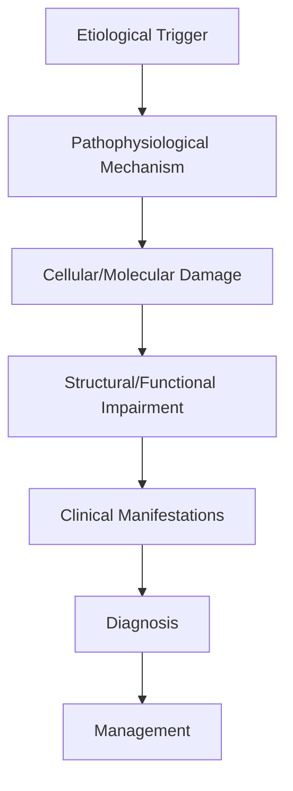
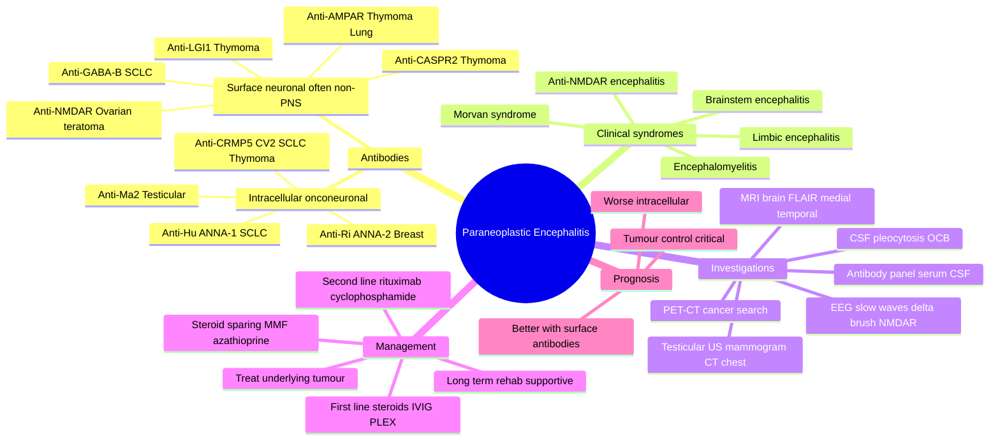

# Paraneoplastic Encephalitis

> [!tip] **High-Yield Definition**
> Comprehensive clinical note for Paraneoplastic Encephalitis covering definition, epidemiology, aetiology, pathophysiology, clinical features, investigations, differential diagnosis, management, drug interactions, procedures, complications, red flags, prognosis, topic correlation, and special situations for FCPS/MRCP examination preparation based on Davidson 24th Edition Chapter 25: Neurology.

---

## 1. Definition / Epidemiology / Classification

### Definition
Paraneoplastic Encephalitis is a neurological disorder within the 19 paraneoplastic neurological syndromes category. It is characterised by specific clinical, pathological, radiological, and laboratory features that allow differentiation from related conditions.

### Epidemiology
- **Incidence/Prevalence:** Variable depending on the specific condition.
- **Age:** Adult onset is most common, but paediatric and elderly presentations occur.
- **Sex:** Variable depending on the condition.
- **Geography:** Worldwide distribution, with higher prevalence in certain regions.
- **Risk Factors:** Genetic predisposition, environmental factors, comorbidities, family history.

### Classification
| Subtype | Key Features | Prognosis |
|---------|-------------|-----------|
| Mild/early | Subtle symptoms, preserved function | Best |
| Moderate | Clear symptoms, functional impairment | Variable |
| Severe | Significant disability, complications | Worst |

---

## 2. Aetiology / Pathophysiology

### Aetiology
- **Primary (idiopathic):** Most cases have no identifiable cause.
- **Genetic:** May be inherited (AD, AR, X-linked, mitochondrial, sporadic).
- **Autoimmune:** Autoantibodies, immune-mediated inflammation.
- **Infectious:** Viral, bacterial, fungal, parasitic.
- **Metabolic:** Electrolyte, endocrine, hepatic, renal, nutritional.
- **Toxic:** Drugs, alcohol, heavy metals, environmental toxins.
- **Vascular:** Ischaemia, haemorrhage, vasculitis.
- **Neoplastic:** Primary, secondary, paraneoplastic.
- **Traumatic:** Acute, chronic, repetitive.
- **Degenerative:** Neurodegeneration, protein misfolding.

### Pathophysiology


---

## 3. Clinical Features

### History
- **Onset/Duration:** Acute, subacute, or chronic.
- **Progression:** Static, progressive, relapsing-remitting, stepwise.
- **Key symptoms:** Specific to the condition.
- **Triggers:** Stress, infection, trauma, drugs, hormonal, environmental.
- **Systemic symptoms:** Constitutional features.
- **Drug/Family/Social history:** Relevant exposures, comorbidities.

### Examination
| Domain | Key Findings | Localisation Value |
|--------|-------------|-------------------|
| Higher function | Cognitive, behavioural | Cortical, subcortical, limbic |
| Cranial nerves | Pupils, eye movements, facial, bulbar | Brainstem, cranial nerve, NMJ |
| Motor | Weakness, tone, reflexes | UMN, LMN, NMJ, muscle |
| Sensory | All modalities, pattern | Peripheral, spinal, brainstem |
| Coordination | Ataxia, nystagmus, dysmetria | Cerebellar, sensory, vestibular |
| Gait | Spastic, ataxic, parkinsonian | Multiple |
| Autonomic | Orthostatic, sweating, GI, bladder | Autonomic, peripheral, central |

### Specific Clinical Features
The clinical features are determined by the underlying aetiology, location of pathology, and rate of progression. Patients typically present with a constellation of symptoms and signs that allow clinical localisation and subsequent targeted investigation.

---

## 4. Diagnostic Approach / Algorithm

```mermaid
flowchart TD
    A[Clinical Presentation] --> B[Anatomical Localisation]
    B --> C[Pathophysiological Category]
    C --> D[Formulate Differential]
    D --> E[Targeted Investigations]
    E --> F[Confirm Diagnosis]
    F --> G[Assess Severity/Prognosis]
    G --> H[Initiate Management]
    H --> I[Monitor Response]
    I --> J{Response?}
    J --> YES1 [Good - Continue]
    J --> NO1 [Poor - Escalate]
    YES1 --> K[Monitor]
    NO1 --> H
```

---

## 5. Investigations

### First-Line Investigations
- **Blood tests:** FBC, U&Es, LFTs, glucose, calcium, magnesium, ESR, CRP, autoimmune, infection.
- **Imaging:** CT/MRI brain/spine (essential for most neurological conditions).
- **Neurophysiology:** EEG, nerve conduction, EMG, evoked potentials.
- **CSF:** Cell count, protein, glucose, OCBs, PCR, culture.

### Second-Line Investigations
- **Genetic testing:** Gene panels, WES, WGS.
- **Antibody testing:** Antineuronal, autoimmune, paraneoplastic.
- **Biopsy:** Nerve, muscle, brain, skin.
- **Advanced imaging:** PET-CT, MR spectroscopy, fMRI.

### Specialised Investigations
- **Biomarkers:** Neurofilament light chain, tau, beta-amyloid, 14-3-3, RT-QuIC.
- **Autonomic testing:** Head-up tilt, sudomotor, QSART.
- **Neuropsychology:** Cognitive testing, behavioural assessment.
- **Genetic counselling:** Family screening, predictive testing.

---

## 6. Differential Diagnosis

| Differential | Distinguishing Features | Key Test |
|--------------|------------------------|----------|
| Vascular | Sudden onset, focal, vascular risk factors | MRI/CT, vessel imaging |
| Inflammatory | Subacute, multifocal, systemic | MRI, CSF, antibodies |
| Infectious | Fever, systemic, exposure | Bloods, CSF, imaging |
| Neoplastic | Progressive, mass effect | MRI, biopsy |
| Degenerative | Progressive, symmetric, hereditary | MRI, genetic |
| Toxic/Metabolic | Drug history, systemic, reversible | Bloods, toxicology |
| Autoimmune | Multifocal, antibodies, immunotherapy response | Antibodies, MRI, CSF |
| Functional | Inconsistent, distractible | Clinical, video, biomarkers |

---

## 7. Management

### Acute Management
- **Stabilisation:** ABCDE approach, emergency resuscitation.
- **Specific treatment:** Disease-specific interventions.
- **Symptomatic relief:** Pain, seizures, spasticity, autonomic dysfunction.
- **Prevention of complications:** DVT, pressure sores, infection.

### Disease-Modifying Treatment
- **Pharmacological:** First-line, second-line, escalation, maintenance.
- **Procedural:** Surgery, biopsy, drainage, ablation, stimulation.
- **Immunotherapy:** Steroids, IVIG, plasma exchange, immunosuppressants, biologics.
- **Rehabilitation:** Physiotherapy, OT, speech therapy.

### Long-Term Management
- **Monitoring:** Clinical, imaging, biomarkers, side effects.
- **Prevention:** Vaccinations, prophylaxis, lifestyle modification.
- **Supportive care:** Multidisciplinary team, social work, psychological support.
- **Palliative care:** Advanced care planning, end-of-life care, hospice.

---

## 8. Drug Interactions / Contraindications / Comorbidity Cautions

| Drug Class | Interaction / Caution | Management |
|------------|----------------------|------------|
| Antiseizure medications | Enzyme induction, teratogenicity | Monitor, supplement, switch |
| Immunosuppressants | Infection, malignancy, teratogenicity | Monitor, prophylaxis |
| Anticoagulants | Bleeding risk, drug interactions | Monitor INR, avoid combinations |
| Antihypertensives | Hypotension, falls | Monitor BP, adjust dose |
| Antibiotics | Nephrotoxicity, ototoxicity | Monitor renal |
| Antivirals | Nephrotoxicity, neuropsychiatric | Monitor renal, dose adjust |
| Steroids | DM, HTN, osteoporosis, infection | Monitor, prophylaxis, taper |
| Biologics | Infusion reactions, infection | Monitor, prophylaxis |

---

## 9. Procedures

### Common Procedures
- **Lumbar puncture:** Diagnostic, therapeutic (IIH, NPH). Contraindications: raised ICP, mass lesion, coagulopathy.
- **Nerve conduction studies/EMG:** Diagnostic, prognosis. Minor discomfort.
- **EEG:** Diagnostic, monitoring. No significant complications.
- **MRI brain/spine:** Diagnostic, monitoring. Contraindications: pacemaker, metallic implants.
- **CT head:** Emergency, rapid. Radiation exposure, contrast reactions.
- **Biopsy:** Stereotactic, open. Indications: diagnosis, molecular profiling.

---

## 10. Complications

| Complication | Frequency | Prevention | Management |
|--------------|-----------|------------|------------|
| Infection | Common | Hygiene, prophylaxis, vaccination | Antibiotics, antifungals |
| Thrombosis | Common | Prophylaxis, mobility | Anticoagulation |
| Pressure sores | Common | Positioning, nutrition | Wound care, surgery |
| Spasticity | Common | Positioning, stretching | Baclofen, BoNT |
| Contractures | Common | Passive movements, splints | Physiotherapy, surgery |
| Aspiration | Common | Swallow assessment | NGT, PEG, thickeners |
| Falls | Common | Environment, mobility | Walking aids |
| Fractures | Common | Bone health, prevention | Vitamin D, bisphosphonate |
| Depression | Common | Screening, support | Antidepressants, CBT |
| Cognitive decline | Variable | Monitoring, training | Rehabilitation |
| Autonomic dysfunction | Variable | Monitoring, hydration | Midodrine, fludrocortisone |
| Respiratory failure | Variable | Monitoring, supportive | Ventilation, NIV |
| Death | Variable | Monitoring, palliative | End-of-life care |

---

## 11. Red Flags / Emergencies

### Emergency Presentations
- **Rapid neurological deterioration:** New focal deficit, decreased consciousness, seizures.
- **Status epilepticus:** Continuous seizures >5 min.
- **Raised ICP:** Headache, vomiting, papilloedema, altered consciousness.
- **Respiratory failure:** Hypoxia, hypercapnia, ventilatory failure.
- **Cardiac arrest:** Arrhythmia, MI, pulmonary embolism.
- **Infection:** Sepsis, meningitis, abscess, encephalitis.
- **Drug toxicity:** Overdose, side effects, interactions.
- **Haemorrhage:** Intracranial, systemic, coagulopathy.

---

## 12. Prognosis

### Natural History
- **Acute:** May resolve with treatment, may progress, may be fatal.
- **Subacute:** Variable, depends on cause and treatment.
- **Chronic:** Often progressive, may be stable, may have relapses.
- **Recovery:** Variable, may be complete, partial, or none.

### Prognostic Factors
- **Favourable:** Young age, early treatment, mild disease, reversible cause, good premorbid function, family support.
- **Unfavourable:** Older age, delayed treatment, severe disease, irreversible cause, poor premorbid function, comorbidities.

---

## 13. Topic Correlation

| Related Topic | Link | Key Overlap |
|---------------|------|-------------|
| Davidson 24th Ed Chapter 25 | [[Davidson Chapter 25 - Neurology Hierarchy]] | Comprehensive neurology |
| Neurology MOC | [[Neurology MOC]] | All neurology topics |
| Drug Reference | [[../00_Index/Neurology Drug Reference]] | Medications |
| Local Hub | [[../19_Paraneoplastic_Neurological_Syndromes/Hub]] | Section-specific |
| Clinical Examination | [[../01_Fundamentals_Examination/Neurological History Taking]] | Clinical approach |
| Investigation | [[../01_Fundamentals_Examination/Neuroimaging (CT-MRI) Principles]] | Imaging |

---

## 14. Special Situations

| Situation | Consideration |
|-----------|---------------|
| **Pregnancy** | Pre-conception counselling, teratogenicity, drug safety, monitoring, delivery planning, breastfeeding. |
| **Lactation** | Drug safety, breastfeeding, monitoring, support. |
| **Paediatric** | Developmental considerations, drug dosing, school, family, vaccination, growth, puberty. |
| **Elderly / Frail** | Comorbidities, polypharmacy, falls, bone health, cognition, social, end-of-life. |
| **Renal impairment** | Drug dose adjustment, monitoring, dialysis, transplant. |
| **Hepatic impairment** | Drug dose adjustment, monitoring, transplant. |
| **Immunocompromised** | Infection prophylaxis, vaccination, drug interactions, malignancy screening. |
| **Perioperative** | Drug management, anaesthesia planning, VTE prophylaxis, infection prevention, monitoring. |
| **Driving / DVLA** | Fitness to drive, restrictions, notification, reassessment. |
| **Occupational** | Fitness for work, adaptations, rehabilitation, disability, return to work. |

---

## FCPS/MRCP High-Yield Summary

| Category | Key Points |
|----------|------------|
| **Definition** | Comprehensive definition with key diagnostic criteria |
| **Epidemiology** | Incidence, prevalence, age, sex, geography, risk factors |
| **Aetiology** | Primary causes, secondary causes, genetic, environmental |
| **Pathophysiology** | Mechanism of disease, cellular/molecular basis |
| **Clinical Features** | History, examination, key findings, variants |
| **Diagnosis** | Diagnostic criteria, classification, severity |
| **Investigations** | First-line, second-line, specialised, biomarkers |
| **Differential Diagnosis** | Key differentials, distinguishing features, tests |
| **Management** | Acute, disease-modifying, symptomatic, supportive |
| **Complications** | Common, serious, prevention, management |
| **Prognosis** | Natural history, prognostic factors, outcomes |
| **Viva Pearls** | Key examination points |
| **Drug Doses** | First-line, second-line, emergency |
| **Scoring Systems** | Specific scores used in management |
| **Genetics** | Inheritance, genes, mutations, family screening |
| **Imaging Signs** | Characteristic findings, differential |

---

## Viva Questions (PACES/FCPS Style)

1. **Q:** Define and classify its variants.
   **A:** Comprehensive definition with classification of subtypes based on aetiology, severity, and clinical features.

2. **Q:** What are the key clinical features?
   **A:** Specific symptoms and signs including onset, progression, key features, and associated findings.

3. **Q:** What is the first-line treatment?
   **A:** First-line pharmacological and non-pharmacological management based on current evidence.

4. **Q:** What are the red flags requiring urgent referral?
   **A:** Specific emergency presentations and complications requiring immediate intervention.

5. **Q:** What is the prognosis?
   **A:** Natural history, prognostic factors, and long-term outcomes.

6. **Q:** How do you differentiate from key differentials?
   **A:** Clinical features, investigations, and response to treatment that distinguish from alternative diagnoses.

7. **Q:** What investigations are most useful?
   **A:** First-line and second-line investigations including imaging, neurophysiology, CSF, and biomarkers.

8. **Q:** Describe the stepwise management approach.
   **A:** Stepwise escalation from first-line to second-line to third-line therapy with monitoring.

9. **Q:** What are the emergency presentations?
   **A:** Specific emergency scenarios and immediate management priorities.

10. **Q:** How does management change in pregnancy/paediatrics/elderly?
    **A:** Special considerations for each population including drug safety, monitoring, and support.

---

## Common Confusions / Exam Traps

| Confusion | Clarification |
|-----------|---------------|
| Similar presentation but different cause | Differentiate by history, examination, investigations |
| Treatment response vs natural history | Assess with objective measures, biomarkers |
| Drug interactions | Check each drug, monitor, adjust doses |
| Disease progression vs treatment failure | Monitor response, escalate appropriately |
| Functional vs organic | Inconsistent, distractible, disability greater than impairment |
| Acute vs chronic | Time course, progression, reversibility |
| Primary vs secondary | Underlying cause, contributing factors |
| Side effects vs symptoms | Temporal relationship, dose relationship |

---

## Mnemonics

1. **LIMBIC** — Paraneoplastic limbic encephalitis features:
   **L**imbic MRI FLAIR hyperintensity (medial temporal lobe)
   **I**mmunotherapy-responsive (early treatment critical)
   **M**emory loss + seizures + psychiatric features
   **B**rain CSF pleocytosis + OCB
   **I**ntracellular antibodies worse than surface (anti-Hu, Ma2 > anti-NMDAR, LGI1)
   **C**ancer search: PET-CT, testicular US, mammogram, CT chest

2. **HUMAN-2-NMDA** — Classic PNS antibody-tumour pairings in encephalitis:
   **H**u (ANNA-1) → SCLC, **U**se CT chest first
   **M**a2 → Testicular germ cell, **A**dd AFP/β-hCG + scrotal US
   **N**MDAR → Ovarian teratoma (often non-paraneoplastic)
   **2** (Ri/ANNA-2) → Breast/SCLC + brainstem/cerebellar
   **CV**2/CRMP5 → SCLC/thymoma + chorea/optic/sensory neuronopathy
   **G**ABA-B → SCLC + refractory seizures (limbic)

3. **SEIZURE-L** — First-line immunotherapy sequence in antibody-positive encephalitis:
   **S**teroids (IV methylpred 1 g × 3–5 d)
   **E**scalate if no response at 2 weeks
   **I**VIG (0.4 g/kg × 5 d) **or** PLEX (5 exchanges)
   **Z**oom to second-line: rituximab 375 mg/m² weekly × 4
   **U**se cyclophosphamide if rituximab fails
   **R**epeat imaging + CSF at 3 months
   **E**valuate for occult tumour (PET-CT)
   **L**ong-term: steroid-sparing agent (MMF, azathioprine)

---

## Mind Map



---

## Spaced Repetition Trackers

| Day | Reviewer Score (/10) | Recall Notes | Re-study Targets |
|-----|----------------------|--------------|-------------------|
| Day 1 |  |  |  |
| Day 3 |  |  |  |
| Day 7 |  |  |  |
| Day 14 |  |  |  |
| Day 30 |  |  |  |
| Day 90 |  |  |  |

> **Spaced-retention rule:** If recall drops below 7/10, re-read section and repeat the Day-1 row.

---

## Self-Test Scorecard

Score each section **/5** after a single-pass read. Target ≥ 35/50 before exam.

| Section | Score | Weak Areas | Action Plan |
|---------|-------|------------|-------------|
| Definition / Epidemiology / Classification | /5 |  |  |
| Aetiology / Pathophysiology | /5 |  |  |
| Clinical Features | /5 |  |  |
| Diagnostic Approach / Algorithm | /5 |  |  |
| Investigations | /5 |  |  |
| Differential Diagnosis | /5 |  |  |
| Management | /5 |  |  |
| Drug Interactions / Contraindications / Comorbidity Cautions | /5 |  |  |
| Procedures | /5 |  |  |
| Complications | /5 |  |  |

> **Interpretation:** 40–50 = exam-ready; 30–39 = needs re-read; <30 = restart from section 1.

---

## MCQs (10)

1. **A 58-year-old smoker presents with 6-week progressive short-term memory loss, temporal lobe seizures, and personality change. MRI shows bilateral medial temporal FLAIR hyperintensity. CSF has 28 lymphocytes and unmatched OCB. Which antibody most strongly predicts an underlying small cell lung cancer?**
   - A. Anti-LGI1
   - B. Anti-GABA-B receptor
   - C. Anti-Hu (ANNA-1)
   - D. Anti-NMDAR

2. **A 32-year-old man develops drowsiness, vertical gaze palsy, hypersomnia, and limb weakness over 3 months. MRI brain shows hypothalamic and brainstem T2 hyperintensity. The antibody most likely to predict a testicular germ cell tumour is:**
   - A. Anti-Yo (PCA-1)
   - B. Anti-Ma2
   - C. Anti-CRMP5 (CV2)
   - D. Anti-Ri (ANNA-2)

3. **Which one of the following is the LEAST likely to be a paraneoplastic (cancer-associated) aetiology?**
   - A. Anti-Hu (ANNA-1)
   - B. Anti-Yo (PCA-1)
   - C. Anti-LGI1
   - D. Anti-CRMP5 (CV2)

4. **The classic MRI signature of limbic encephalitis is:**
   - A. Bilateral caudate T1 hyperintensity
   - B. Bilateral medial temporal lobe FLAIR hyperintensity
   - C. Cerebellar T2 hyperintensity with atrophy
   - D. Diffuse cortical ribboning on DWI

5. **Anti-NMDAR encephalitis in a young woman mandates screening for:**
   - A. Small cell lung cancer
   - B. Ovarian teratoma
   - C. Thymoma
   - D. Hodgkin lymphoma

6. **CSF in paraneoplastic encephalitis characteristically shows:**
   - A. Neutrophilic pleocytosis with low glucose
   - B. Lymphocytic pleocytosis with oligoclonal bands
   - C. Albuminocytological dissociation
   - D. Xanthochromia

7. **The "extreme delta brush" pattern on EEG is most specific for:**
   - A. Anti-LGI1 encephalitis
   - B. Anti-Hu limbic encephalitis
   - C. Anti-NMDAR encephalitis
   - D. Anti-GABA-B encephalitis

8. **First-line immunotherapy for antibody-positive paraneoplastic encephalitis is:**
   - A. Methotrexate + azathioprine
   - B. IV methylprednisolone + IVIG or plasma exchange
   - C. Cyclophosphamide monotherapy
   - D. Mycophenolate mofetil alone

9. **A patient with anti-Ma2 encephalitis and a negative initial PET-CT and testicular ultrasound should:**
   - A. Be reassured and discharged
   - B. Have orchiectomy empirically
   - C. Have repeat screening every 4–6 months for at least 2 years
   - D. Have annual MRI brain only

10. **Compared with antibodies against intracellular onconeuronal antigens (anti-Hu, Ma2, Yo), surface antibodies (anti-NMDAR, LGI1, GABA-B) generally have:**
    - A. Worse response to immunotherapy
    - B. Lower cancer association and better immunotherapy response
    - C. Higher cancer association and worse prognosis
    - D. Identical prognosis

---

## SBA Questions (10)

1. **A 64-year-old man with a 40-pack-year smoking history presents with confusion, personality change, faciobrachial dystonic seizures, and hyponatraemia. MRI brain is normal. CT chest shows a 2 cm mediastinal lymph node. Which antibody is most consistent with this phenotype?**
   - A. Anti-Hu
   - B. Anti-CRMP5
   - C. Anti-LGI1
   - D. Anti-Yo
   - E. Anti-mGluR1

2. **A 22-year-old woman develops psychosis, oro-lingual dyskinesias, autonomic instability, and reduced conscious level after a prodromal viral illness. Pelvic ultrasound shows a left ovarian mass. The most likely diagnosis is:**
   - A. Anti-Hu limbic encephalitis
   - B. Anti-NMDAR encephalitis
   - C. Anti-GABA-B limbic encephalitis
   - D. Anti-Ma2 encephalitis
   - E. Anti-Ri opsoclonus-myoclonus

3. **A patient with paraneoplastic limbic encephalitis fails to improve after 2 weeks of IV methylprednisolone, IVIG, and 5 plasma exchanges. The next most appropriate escalation is:**
   - A. Cyclophosphamide + rituximab
   - B. Methotrexate
   - C. Azathioprine monotherapy
   - D. Natalizumab
   - E. Total lymphoid irradiation

4. **A 50-year-old man presents with limbic encephalitis and is found to have anti-GABA-B receptor antibodies. The MOST appropriate first-line cancer screening investigation is:**
   - A. Testicular ultrasound
   - B. Mammography
   - C. CT chest
   - D. Whole-body MRI
   - E. Colonoscopy

5. **Which ONE feature argues AGAINST a paraneoplastic aetiology in a patient with new-onset limbic encephalitis?**
   - A. Detection of anti-Hu in serum
   - B. PET-CT showing an FDG-avid mediastinal mass
   - C. Young woman with anti-NMDAR antibodies and ovarian teratoma
   - D. Negative antibody panel and full-body imaging at 6 months
   - E. CSF pleocytosis with OCB

6. **A 60-year-old develops anti-Ma2 encephalitis. CT chest/abdomen/pelvis and PET-CT are negative. Testicular ultrasound is normal. The next step in cancer screening is:**
   - A. Bilateral orchidectomy
   - B. Repeat PET-CT and testicular ultrasound every 4–6 months for 2–4 years
   - C. Annual CA-125 only
   - D. Bone marrow biopsy
   - E. No further screening required

7. **In paraneoplastic encephalitis, the strongest predictor of long-term neurological outcome is:**
   - A. Patient age
   - B. Antibody subtype and early tumour control
   - C. CSF protein level
   - D. EEG findings
   - E. Initial GCS

8. **Faciobrachial dystonic seizures in anti-LGI1 encephalitis respond best to:**
   - A. Levetiracetam alone
   - B. Sodium valproate alone
   - C. Early immunotherapy (steroids ± IVIG, rituximab)
   - D. Vagus nerve stimulation
   - E. Resective surgery

9. **A patient with limbic encephalitis and anti-Hu antibodies is found to have small cell lung cancer. The MOST important determinant of neurological recovery is:**
   - A. Choice of antibiotic for pneumonia prevention
   - B. Antigen-specific cancer therapy + concurrent immunotherapy
   - C. Antidepressant use
   - D. Antiepileptic monotherapy
   - E. Bedrest duration

10. **Morvan syndrome (neuromyotonia, insomnia, confusion, autonomic dysfunction, pain) is most characteristically associated with:**
    - A. Anti-Hu antibodies
    - B. Anti-CASPR2 antibodies ± thymoma
    - C. Anti-Yo antibodies
    - D. Anti-CRMP5 antibodies
    - E. Anti-mGluR1 antibodies

---

## Tags

#neurology #PNS #paraneoplastic #Paraneoplastic_Encephalitis #FCPS #MRCP #Davidson25

---

## Local Navigation
**Heading Hub:** [[../Hub]]  
**Chapter Hierarchy:** [[Davidson Chapter 25 - Neurology Hierarchy]]  
**Chapter MOC:** [[Neurology MOC]]  
**Drug Reference:** [[../00_Index/Neurology Drug Reference]]

## PasTest Scenario SBAs (Clinical Vignettes)

> **Auto-generated PasTest/Mediscope-style scenario SBAs** grounded in the authored source. Each scenario tests a real clinical fact (triad, specific sign, contraindication, trial, first-line Rx) extracted from the topic. *Source: Ch 27: Neurology & Stroke — Paraneoplastic Encephalitis*

**Q1.** Which of the following features is most specific or characteristic of Paraneoplastic Encephalitis?

  - **A.** Key symptoms:
  - **B.** A feature common to many acute inflammatory conditions
  - **C.** A non-specific sign that does not localise the diagnosis
  - **D.** An investigation finding rather than a clinical feature

  > **Answer: A** — Key symptoms:
  >
  > *Source:* - **Key symptoms:** Specific to the condition

**Q2.** What is the most appropriate first-line therapy for Paraneoplastic Encephalitis?

  - **A.** Rehabilitation:
  - **B.** An advanced/surgical therapy reserved for refractory disease
  - **C.** Symptomatic treatment only, no disease-modifying therapy
  - **D.** Empiric broad-spectrum therapy without specific indication

  > **Answer: A** — Rehabilitation:
  >
  > *Source:* **Rehabilitation:** Physiotherapy, OT, speech therapy.

