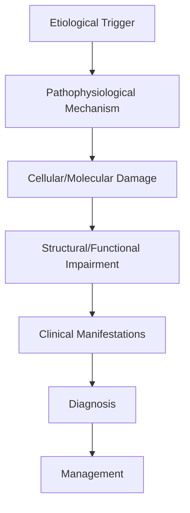
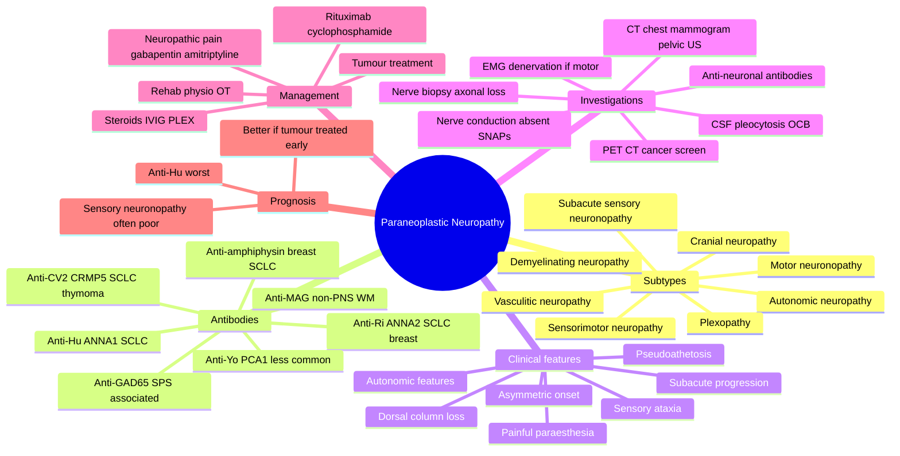

# Paraneoplastic Neuropathy

> [!tip] **High-Yield Definition**
> Comprehensive clinical note for Paraneoplastic Neuropathy covering definition, epidemiology, aetiology, pathophysiology, clinical features, investigations, differential diagnosis, management, drug interactions, procedures, complications, red flags, prognosis, topic correlation, and special situations for FCPS/MRCP examination preparation based on Davidson 24th Edition Chapter 25: Neurology.

---

## 1. Definition / Epidemiology / Classification

### Definition
Paraneoplastic Neuropathy is a neurological disorder within the 19 paraneoplastic neurological syndromes category. It is characterised by specific clinical, pathological, radiological, and laboratory features that allow differentiation from related conditions.

### Epidemiology
- **Incidence/Prevalence:** Variable depending on the specific condition.
- **Age:** Adult onset is most common, but paediatric and elderly presentations occur.
- **Sex:** Variable depending on the condition.
- **Geography:** Worldwide distribution, with higher prevalence in certain regions.
- **Risk Factors:** Genetic predisposition, environmental factors, comorbidities, family history.

### Classification
| Subtype | Key Features | Prognosis |
|---------|-------------|-----------|
| Mild/early | Subtle symptoms, preserved function | Best |
| Moderate | Clear symptoms, functional impairment | Variable |
| Severe | Significant disability, complications | Worst |

---

## 2. Aetiology / Pathophysiology

### Aetiology
- **Primary (idiopathic):** Most cases have no identifiable cause.
- **Genetic:** May be inherited (AD, AR, X-linked, mitochondrial, sporadic).
- **Autoimmune:** Autoantibodies, immune-mediated inflammation.
- **Infectious:** Viral, bacterial, fungal, parasitic.
- **Metabolic:** Electrolyte, endocrine, hepatic, renal, nutritional.
- **Toxic:** Drugs, alcohol, heavy metals, environmental toxins.
- **Vascular:** Ischaemia, haemorrhage, vasculitis.
- **Neoplastic:** Primary, secondary, paraneoplastic.
- **Traumatic:** Acute, chronic, repetitive.
- **Degenerative:** Neurodegeneration, protein misfolding.

### Pathophysiology


---

## 3. Clinical Features

### History
- **Onset/Duration:** Acute, subacute, or chronic.
- **Progression:** Static, progressive, relapsing-remitting, stepwise.
- **Key symptoms:** Specific to the condition.
- **Triggers:** Stress, infection, trauma, drugs, hormonal, environmental.
- **Systemic symptoms:** Constitutional features.
- **Drug/Family/Social history:** Relevant exposures, comorbidities.

### Examination
| Domain | Key Findings | Localisation Value |
|--------|-------------|-------------------|
| Higher function | Cognitive, behavioural | Cortical, subcortical, limbic |
| Cranial nerves | Pupils, eye movements, facial, bulbar | Brainstem, cranial nerve, NMJ |
| Motor | Weakness, tone, reflexes | UMN, LMN, NMJ, muscle |
| Sensory | All modalities, pattern | Peripheral, spinal, brainstem |
| Coordination | Ataxia, nystagmus, dysmetria | Cerebellar, sensory, vestibular |
| Gait | Spastic, ataxic, parkinsonian | Multiple |
| Autonomic | Orthostatic, sweating, GI, bladder | Autonomic, peripheral, central |

### Specific Clinical Features
The clinical features are determined by the underlying aetiology, location of pathology, and rate of progression. Patients typically present with a constellation of symptoms and signs that allow clinical localisation and subsequent targeted investigation.

---

## 4. Diagnostic Approach / Algorithm

```mermaid
flowchart TD
    A[Clinical Presentation] --> B[Anatomical Localisation]
    B --> C[Pathophysiological Category]
    C --> D[Formulate Differential]
    D --> E[Targeted Investigations]
    E --> F[Confirm Diagnosis]
    F --> G[Assess Severity/Prognosis]
    G --> H[Initiate Management]
    H --> I[Monitor Response]
    I --> J{Response?}
    J --> YES1 [Good - Continue]
    J --> NO1 [Poor - Escalate]
    YES1 --> K[Monitor]
    NO1 --> H
```

---

## 5. Investigations

### First-Line Investigations
- **Blood tests:** FBC, U&Es, LFTs, glucose, calcium, magnesium, ESR, CRP, autoimmune, infection.
- **Imaging:** CT/MRI brain/spine (essential for most neurological conditions).
- **Neurophysiology:** EEG, nerve conduction, EMG, evoked potentials.
- **CSF:** Cell count, protein, glucose, OCBs, PCR, culture.

### Second-Line Investigations
- **Genetic testing:** Gene panels, WES, WGS.
- **Antibody testing:** Antineuronal, autoimmune, paraneoplastic.
- **Biopsy:** Nerve, muscle, brain, skin.
- **Advanced imaging:** PET-CT, MR spectroscopy, fMRI.

### Specialised Investigations
- **Biomarkers:** Neurofilament light chain, tau, beta-amyloid, 14-3-3, RT-QuIC.
- **Autonomic testing:** Head-up tilt, sudomotor, QSART.
- **Neuropsychology:** Cognitive testing, behavioural assessment.
- **Genetic counselling:** Family screening, predictive testing.

---

## 6. Differential Diagnosis

| Differential | Distinguishing Features | Key Test |
|--------------|------------------------|----------|
| Vascular | Sudden onset, focal, vascular risk factors | MRI/CT, vessel imaging |
| Inflammatory | Subacute, multifocal, systemic | MRI, CSF, antibodies |
| Infectious | Fever, systemic, exposure | Bloods, CSF, imaging |
| Neoplastic | Progressive, mass effect | MRI, biopsy |
| Degenerative | Progressive, symmetric, hereditary | MRI, genetic |
| Toxic/Metabolic | Drug history, systemic, reversible | Bloods, toxicology |
| Autoimmune | Multifocal, antibodies, immunotherapy response | Antibodies, MRI, CSF |
| Functional | Inconsistent, distractible | Clinical, video, biomarkers |

---

## 7. Management

### Acute Management
- **Stabilisation:** ABCDE approach, emergency resuscitation.
- **Specific treatment:** Disease-specific interventions.
- **Symptomatic relief:** Pain, seizures, spasticity, autonomic dysfunction.
- **Prevention of complications:** DVT, pressure sores, infection.

### Disease-Modifying Treatment
- **Pharmacological:** First-line, second-line, escalation, maintenance.
- **Procedural:** Surgery, biopsy, drainage, ablation, stimulation.
- **Immunotherapy:** Steroids, IVIG, plasma exchange, immunosuppressants, biologics.
- **Rehabilitation:** Physiotherapy, OT, speech therapy.

### Long-Term Management
- **Monitoring:** Clinical, imaging, biomarkers, side effects.
- **Prevention:** Vaccinations, prophylaxis, lifestyle modification.
- **Supportive care:** Multidisciplinary team, social work, psychological support.
- **Palliative care:** Advanced care planning, end-of-life care, hospice.

---

## 8. Drug Interactions / Contraindications / Comorbidity Cautions

| Drug Class | Interaction / Caution | Management |
|------------|----------------------|------------|
| Antiseizure medications | Enzyme induction, teratogenicity | Monitor, supplement, switch |
| Immunosuppressants | Infection, malignancy, teratogenicity | Monitor, prophylaxis |
| Anticoagulants | Bleeding risk, drug interactions | Monitor INR, avoid combinations |
| Antihypertensives | Hypotension, falls | Monitor BP, adjust dose |
| Antibiotics | Nephrotoxicity, ototoxicity | Monitor renal |
| Antivirals | Nephrotoxicity, neuropsychiatric | Monitor renal, dose adjust |
| Steroids | DM, HTN, osteoporosis, infection | Monitor, prophylaxis, taper |
| Biologics | Infusion reactions, infection | Monitor, prophylaxis |

---

## 9. Procedures

### Common Procedures
- **Lumbar puncture:** Diagnostic, therapeutic (IIH, NPH). Contraindications: raised ICP, mass lesion, coagulopathy.
- **Nerve conduction studies/EMG:** Diagnostic, prognosis. Minor discomfort.
- **EEG:** Diagnostic, monitoring. No significant complications.
- **MRI brain/spine:** Diagnostic, monitoring. Contraindications: pacemaker, metallic implants.
- **CT head:** Emergency, rapid. Radiation exposure, contrast reactions.
- **Biopsy:** Stereotactic, open. Indications: diagnosis, molecular profiling.

---

## 10. Complications

| Complication | Frequency | Prevention | Management |
|--------------|-----------|------------|------------|
| Infection | Common | Hygiene, prophylaxis, vaccination | Antibiotics, antifungals |
| Thrombosis | Common | Prophylaxis, mobility | Anticoagulation |
| Pressure sores | Common | Positioning, nutrition | Wound care, surgery |
| Spasticity | Common | Positioning, stretching | Baclofen, BoNT |
| Contractures | Common | Passive movements, splints | Physiotherapy, surgery |
| Aspiration | Common | Swallow assessment | NGT, PEG, thickeners |
| Falls | Common | Environment, mobility | Walking aids |
| Fractures | Common | Bone health, prevention | Vitamin D, bisphosphonate |
| Depression | Common | Screening, support | Antidepressants, CBT |
| Cognitive decline | Variable | Monitoring, training | Rehabilitation |
| Autonomic dysfunction | Variable | Monitoring, hydration | Midodrine, fludrocortisone |
| Respiratory failure | Variable | Monitoring, supportive | Ventilation, NIV |
| Death | Variable | Monitoring, palliative | End-of-life care |

---

## 11. Red Flags / Emergencies

### Emergency Presentations
- **Rapid neurological deterioration:** New focal deficit, decreased consciousness, seizures.
- **Status epilepticus:** Continuous seizures >5 min.
- **Raised ICP:** Headache, vomiting, papilloedema, altered consciousness.
- **Respiratory failure:** Hypoxia, hypercapnia, ventilatory failure.
- **Cardiac arrest:** Arrhythmia, MI, pulmonary embolism.
- **Infection:** Sepsis, meningitis, abscess, encephalitis.
- **Drug toxicity:** Overdose, side effects, interactions.
- **Haemorrhage:** Intracranial, systemic, coagulopathy.

---

## 12. Prognosis

### Natural History
- **Acute:** May resolve with treatment, may progress, may be fatal.
- **Subacute:** Variable, depends on cause and treatment.
- **Chronic:** Often progressive, may be stable, may have relapses.
- **Recovery:** Variable, may be complete, partial, or none.

### Prognostic Factors
- **Favourable:** Young age, early treatment, mild disease, reversible cause, good premorbid function, family support.
- **Unfavourable:** Older age, delayed treatment, severe disease, irreversible cause, poor premorbid function, comorbidities.

---

## 13. Topic Correlation

| Related Topic | Link | Key Overlap |
|---------------|------|-------------|
| Davidson 24th Ed Chapter 25 | [[Davidson Chapter 25 - Neurology Hierarchy]] | Comprehensive neurology |
| Neurology MOC | [[Neurology MOC]] | All neurology topics |
| Drug Reference | [[../00_Index/Neurology Drug Reference]] | Medications |
| Local Hub | [[../19_Paraneoplastic_Neurological_Syndromes/Hub]] | Section-specific |
| Clinical Examination | [[../01_Fundamentals_Examination/Neurological History Taking]] | Clinical approach |
| Investigation | [[../01_Fundamentals_Examination/Neuroimaging (CT-MRI) Principles]] | Imaging |

---

## 14. Special Situations

| Situation | Consideration |
|-----------|---------------|
| **Pregnancy** | Pre-conception counselling, teratogenicity, drug safety, monitoring, delivery planning, breastfeeding. |
| **Lactation** | Drug safety, breastfeeding, monitoring, support. |
| **Paediatric** | Developmental considerations, drug dosing, school, family, vaccination, growth, puberty. |
| **Elderly / Frail** | Comorbidities, polypharmacy, falls, bone health, cognition, social, end-of-life. |
| **Renal impairment** | Drug dose adjustment, monitoring, dialysis, transplant. |
| **Hepatic impairment** | Drug dose adjustment, monitoring, transplant. |
| **Immunocompromised** | Infection prophylaxis, vaccination, drug interactions, malignancy screening. |
| **Perioperative** | Drug management, anaesthesia planning, VTE prophylaxis, infection prevention, monitoring. |
| **Driving / DVLA** | Fitness to drive, restrictions, notification, reassessment. |
| **Occupational** | Fitness for work, adaptations, rehabilitation, disability, return to work. |

---

## FCPS/MRCP High-Yield Summary

| Category | Key Points |
|----------|------------|
| **Definition** | Comprehensive definition with key diagnostic criteria |
| **Epidemiology** | Incidence, prevalence, age, sex, geography, risk factors |
| **Aetiology** | Primary causes, secondary causes, genetic, environmental |
| **Pathophysiology** | Mechanism of disease, cellular/molecular basis |
| **Clinical Features** | History, examination, key findings, variants |
| **Diagnosis** | Diagnostic criteria, classification, severity |
| **Investigations** | First-line, second-line, specialised, biomarkers |
| **Differential Diagnosis** | Key differentials, distinguishing features, tests |
| **Management** | Acute, disease-modifying, symptomatic, supportive |
| **Complications** | Common, serious, prevention, management |
| **Prognosis** | Natural history, prognostic factors, outcomes |
| **Viva Pearls** | Key examination points |
| **Drug Doses** | First-line, second-line, emergency |
| **Scoring Systems** | Specific scores used in management |
| **Genetics** | Inheritance, genes, mutations, family screening |
| **Imaging Signs** | Characteristic findings, differential |

---

## Viva Questions (PACES/FCPS Style)

1. **Q:** Define and classify its variants.
   **A:** Comprehensive definition with classification of subtypes based on aetiology, severity, and clinical features.

2. **Q:** What are the key clinical features?
   **A:** Specific symptoms and signs including onset, progression, key features, and associated findings.

3. **Q:** What is the first-line treatment?
   **A:** First-line pharmacological and non-pharmacological management based on current evidence.

4. **Q:** What are the red flags requiring urgent referral?
   **A:** Specific emergency presentations and complications requiring immediate intervention.

5. **Q:** What is the prognosis?
   **A:** Natural history, prognostic factors, and long-term outcomes.

6. **Q:** How do you differentiate from key differentials?
   **A:** Clinical features, investigations, and response to treatment that distinguish from alternative diagnoses.

7. **Q:** What investigations are most useful?
   **A:** First-line and second-line investigations including imaging, neurophysiology, CSF, and biomarkers.

8. **Q:** Describe the stepwise management approach.
   **A:** Stepwise escalation from first-line to second-line to third-line therapy with monitoring.

9. **Q:** What are the emergency presentations?
   **A:** Specific emergency scenarios and immediate management priorities.

10. **Q:** How does management change in pregnancy/paediatrics/elderly?
    **A:** Special considerations for each population including drug safety, monitoring, and support.

---

## Common Confusions / Exam Traps

| Confusion | Clarification |
|-----------|---------------|
| Similar presentation but different cause | Differentiate by history, examination, investigations |
| Treatment response vs natural history | Assess with objective measures, biomarkers |
| Drug interactions | Check each drug, monitor, adjust doses |
| Disease progression vs treatment failure | Monitor response, escalate appropriately |
| Functional vs organic | Inconsistent, distractible, disability greater than impairment |
| Acute vs chronic | Time course, progression, reversibility |
| Primary vs secondary | Underlying cause, contributing factors |
| Side effects vs symptoms | Temporal relationship, dose relationship |

---

## Mnemonics

1. **HUNT-SSN** — Paraneoplastic subacute sensory neuronopathy:
   **H**u (ANNA-1) antibodies
   **U**nilateral or asymmetric at onset
   **N**umbness, pain, sensory loss
   **T**runk and proximal limbs involved early
   **-S**ensory ataxia + pseudoathetosis
   **-S**NAPs absent on nerve conduction
   **-N**erve biopsy shows dorsal root ganglionitis

2. **CRMP5-Hu-MAG-CV** — Antibody–cancer pairings in paraneoplastic neuropathy:
   **C**V2/CRMP5 → SCLC/thymoma → mixed sensorimotor + optic + chorea
   **R**i → SCLC/breast → mixed neuropathy + ataxia
   **M**AG (usually non-PNS) → IgM paraproteinaemia/WM
   **P**araneoplastic AMAN → anti-Hu, CRMP5
   **5**-fluorouracil, vinca, cisplatin → toxic mimic
   **H**u → SCLC → sensory neuronopathy ± encephalomyelitis
   **u** → look for SCLC always

3. **PAIN-ATAXIA** — Red-flag pattern in paraneoplastic sensory neuronopathy:
   **P**ainful, asymmetric, subacute
   **A**taxia with preserved strength
   **I**ncreased falls / pseudoathetosis
   **N**CS: absent sensory action potentials
   **-A**bsent reflexes at ankles progressing proximally
   **-T**runk involvement
   **-A**utonomic dysfunction (orthostasis, GI)
   **-X**clude: diabetes, B12, HIV, syphilis, CIDP
   **-I**maging: PET-CT, mammogram, CT chest
   **-A**ntibody: anti-Hu, CRMP5, amphiphysin

---

## Mind Map



---

## Spaced Repetition Trackers

| Day | Reviewer Score (/10) | Recall Notes | Re-study Targets |
|-----|----------------------|--------------|-------------------|
| Day 1 |  |  |  |
| Day 3 |  |  |  |
| Day 7 |  |  |  |
| Day 14 |  |  |  |
| Day 30 |  |  |  |
| Day 90 |  |  |  |

> **Spaced-retention rule:** If recall drops below 7/10, re-read section and repeat the Day-1 row.

---

## Self-Test Scorecard

Score each section **/5** after a single-pass read. Target ≥ 35/50 before exam.

| Section | Score | Weak Areas | Action Plan |
|---------|-------|------------|-------------|
| Definition / Epidemiology / Classification | /5 |  |  |
| Aetiology / Pathophysiology | /5 |  |  |
| Clinical Features | /5 |  |  |
| Diagnostic Approach / Algorithm | /5 |  |  |
| Investigations | /5 |  |  |
| Differential Diagnosis | /5 |  |  |
| Management | /5 |  |  |
| Drug Interactions / Contraindications / Comorbidity Cautions | /5 |  |  |
| Procedures | /5 |  |  |
| Complications | /5 |  |  |

> **Interpretation:** 40–50 = exam-ready; 30–39 = needs re-read; <30 = restart from section 1.

---

## MCQs (10)

1. **A 60-year-old smoker develops subacute, painful, asymmetric loss of all sensory modalities in arms and trunk, with sensory ataxia and pseudoathetoid posturing of the fingers, over 3 months. CT chest shows a small peripheral lung lesion. The most likely antibody is:**
   - A. Anti-Yo (PCA-1)
   - B. Anti-Hu (ANNA-1)
   - C. Anti-GM1
   - D. Anti-MAG

2. **The pathological lesion in paraneoplastic subacute sensory neuronopathy is at the level of:**
   - A. Anterior horn cell
   - B. Dorsal root ganglion
   - C. Distal axon terminal
   - D. Schwann cell

3. **Which nerve conduction study pattern is most characteristic of paraneoplastic sensory neuronopathy?**
   - A. Absent sensory nerve action potentials with normal motor studies
   - B. Demyelinating motor conduction block
   - C. Small carpal tunnel
   - D. Normal sensory studies

4. **Anti-CV2 (CRMP5) antibodies are most commonly associated with:**
   - A. Pure sensory ataxia
   - B. Mixed sensorimotor neuropathy + optic neuritis + chorea + SCLC/thymoma
   - C. Lambert-Eaton only
   - D. Acute inflammatory demyelinating polyradiculoneuropathy

5. **Pseudoathetosis in a patient with proprioceptive loss indicates:**
   - A. Cerebellar disease
   - B. Severe dorsal column / large-fibre sensory dysfunction
   - C. Motor cortex lesion
   - D. Anxiety

6. **A 50-year-old woman with breast cancer presents with painful, asymmetric distal sensorimotor neuropathy. The most appropriate first investigation is:**
   - A. Anti-MAG antibody
   - B. Anti-Hu and anti-CRMP5 antibodies + nerve conduction studies
   - C. MRI brachial plexus only
   - D. Trial of vitamin B12

7. **A patient with paraneoplastic sensory neuronopathy is found to have anti-Hu antibodies. The MOST appropriate first cancer screen is:**
   - A. Whole-body PET-CT
   - B. Testicular ultrasound
   - C. Colonoscopy
   - D. Whole-body MRI

8. **A paraneoplastic autonomic neuropathy with severe orthostatic hypotension, anhidrosis, and ileus in a smoker is most likely associated with:**
   - A. Anti-MAG
   - B. Anti-Hu (ANNA-1) ± anti-CRMP5
   - C. Anti-GAD65
   - D. Anti-Yo

9. **CSF in paraneoplastic neuropathy characteristically shows:**
   - A. Neutrophilic pleocytosis
   - B. Albuminocytological dissociation
   - C. Lymphocytic pleocytosis with elevated protein and OCB
   - D. Xanthochromia

10. **First-line treatment of antibody-positive paraneoplastic neuropathy is:**
    - A. Plasmapheresis alone
    - B. IV methylprednisolone + IVIG or plasma exchange + tumour therapy
    - C. Cyclophosphamide monotherapy
    - D. Methotrexate

---

## SBA Questions (10)

1. **A 58-year-old man with a 30-pack-year smoking history presents with 3-month history of asymmetric painful sensory loss, sensory ataxia, absent ankle reflexes, and a small cell lung cancer on CT chest. The MOST likely antibody is:**
   - A. Anti-Yo
   - B. Anti-Hu (ANNA-1)
   - C. Anti-mGluR1
   - D. Anti-Tr
   - E. Anti-LGI1

2. **A 65-year-old presents with subacute mixed sensorimotor neuropathy, optic neuritis, and chorea. Anti-CRMP5 antibodies are positive. The MOST appropriate cancer screen is:**
   - A. Testicular ultrasound
   - B. Mammogram and pelvic ultrasound
   - C. CT chest and PET-CT
   - D. Colonoscopy
   - E. Whole-body MRI only

3. **The pathognomonic nerve conduction finding in paraneoplastic subacute sensory neuronopathy is:**
   - A. Conduction block in motor nerves
   - B. Absent or markedly reduced sensory nerve action potentials with preserved motor studies
   - C. Prolonged F-waves
   - D. Normal sensory nerve action potentials
   - E. A-waves

4. **A 55-year-old woman with breast cancer develops painful asymmetric neuropathy. Anti-amphiphysin antibodies are detected. The MOST appropriate additional screening is:**
   - A. Testicular ultrasound
   - B. CT chest for small cell lung cancer
   - C. CT abdomen for renal cell carcinoma
   - D. Bone scan
   - E. No further screening

5. **A 60-year-old with paraneoplastic sensory neuronopathy has negative initial CT chest/abdomen/pelvis and PET-CT. The MOST appropriate next step is:**
   - A. Discharge
   - B. Repeat imaging every 4–6 months for 2–4 years
   - C. Annual MRI brain only
   - D. Empiric chemotherapy
   - E. Bone marrow biopsy

6. **A patient with paraneoplastic neuropathy and anti-Hu antibodies has the WORST neurological prognosis when:**
   - A. Cancer is localised and resectable
   - B. Cancer is occult or untreatable, and treatment is delayed
   - C. Antibody titre is low
   - D. CSF is normal
   - E. Symptoms are distal only

7. **The differential diagnosis of paraneoplastic sensory neuronopathy includes all EXCEPT:**
   - A. Vitamin B12 deficiency
   - B. Sjögren-associated sensory ganglionopathy
   - C. Cisplatin chemotherapy
   - D. Diabetic polyneuropathy
   - E. Anti-MAG paraproteinaemic neuropathy

8. **First-line immunotherapy for antibody-positive paraneoplastic neuropathy is:**
   - A. Methotrexate + azathioprine
   - B. IV methylprednisolone + IVIG or plasma exchange
   - C. Cyclophosphamide alone
   - D. Mycophenolate mofetil alone
   - E. No immunotherapy

9. **A 50-year-old presents with paraneoplastic neuropathy, vitiligo, and type 1 diabetes. Anti-GAD65 antibodies are positive. The MOST likely associated tumour is:**
   - A. Small cell lung cancer
   - B. Thymoma
   - C. None — purely autoimmune association
   - D. Ovarian teratoma
   - E. Breast cancer

10. **A patient with paraneoplastic neuropathy develops new foot drop, asymmetric motor weakness, and painful distal symptoms. The MOST appropriate next step in management is:**
    - A. Stop all immunotherapy
    - B. Re-stage for cancer progression + escalate immunotherapy
    - C. Add carbamazepine only
    - D. Lumbar puncture
    - E. Reassure and observe

---

## Tags

#neurology #PNS #paraneoplastic #Paraneoplastic_Neuropathy #FCPS #MRCP #Davidson25

---

## Local Navigation
**Heading Hub:** [[../Hub]]  
**Chapter Hierarchy:** [[Davidson Chapter 25 - Neurology Hierarchy]]  
**Chapter MOC:** [[Neurology MOC]]  
**Drug Reference:** [[../00_Index/Neurology Drug Reference]]

## PasTest Scenario SBAs (Clinical Vignettes)

> **Auto-generated PasTest/Mediscope-style scenario SBAs** grounded in the authored source. Each scenario tests a real clinical fact (triad, specific sign, contraindication, trial, first-line Rx) extracted from the topic. *Source: Ch 27: Neurology & Stroke — Paraneoplastic Neuropathy*

**Q1.** Which of the following features is most specific or characteristic of Paraneoplastic Neuropathy?

  - **A.** CSF
  - **B.** A feature common to many acute inflammatory conditions
  - **C.** A non-specific sign that does not localise the diagnosis
  - **D.** An investigation finding rather than a clinical feature

  > **Answer: A** — CSF
  >
  > *Source:* Breast mass |
| **NCS** | All | Sensory neuronopathy: small/absent SNAP; motor preserved early |
| **CSF** | Atypical | Mild pleocytosis, OCB, antibody detection |
| **Anti-GM1, anti-MAG** | Different

**Q2.** What is the most appropriate first-line therapy for Paraneoplastic Neuropathy?

  - **A.** Pregnancy:
  - **B.** An advanced/surgical therapy reserved for refractory disease
  - **C.** Symptomatic treatment only, no disease-modifying therapy
  - **D.** Empiric broad-spectrum therapy without specific indication

  > **Answer: A** — Pregnancy:
  >
  > *Source:* **Pregnancy:** Treat cancer if possible; steroids; avoid cyclophosphamide

