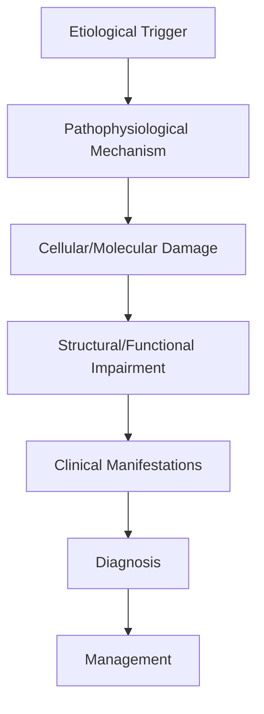
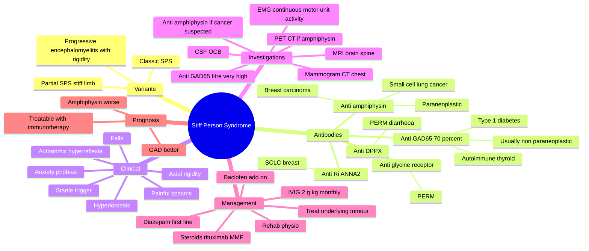

# Stiff Person Syndrome

> [!tip] **High-Yield Definition**
> Comprehensive clinical note for Stiff Person Syndrome covering definition, epidemiology, aetiology, pathophysiology, clinical features, investigations, differential diagnosis, management, drug interactions, procedures, complications, red flags, prognosis, topic correlation, and special situations for FCPS/MRCP examination preparation based on Davidson 24th Edition Chapter 25: Neurology.

---

## 1. Definition / Epidemiology / Classification

### Definition
Stiff Person Syndrome is a neurological disorder within the 19 paraneoplastic neurological syndromes category. It is characterised by specific clinical, pathological, radiological, and laboratory features that allow differentiation from related conditions.

### Epidemiology
- **Incidence/Prevalence:** Variable depending on the specific condition.
- **Age:** Adult onset is most common, but paediatric and elderly presentations occur.
- **Sex:** Variable depending on the condition.
- **Geography:** Worldwide distribution, with higher prevalence in certain regions.
- **Risk Factors:** Genetic predisposition, environmental factors, comorbidities, family history.

### Classification
| Subtype | Key Features | Prognosis |
|---------|-------------|-----------|
| Mild/early | Subtle symptoms, preserved function | Best |
| Moderate | Clear symptoms, functional impairment | Variable |
| Severe | Significant disability, complications | Worst |

---

## 2. Aetiology / Pathophysiology

### Aetiology
- **Primary (idiopathic):** Most cases have no identifiable cause.
- **Genetic:** May be inherited (AD, AR, X-linked, mitochondrial, sporadic).
- **Autoimmune:** Autoantibodies, immune-mediated inflammation.
- **Infectious:** Viral, bacterial, fungal, parasitic.
- **Metabolic:** Electrolyte, endocrine, hepatic, renal, nutritional.
- **Toxic:** Drugs, alcohol, heavy metals, environmental toxins.
- **Vascular:** Ischaemia, haemorrhage, vasculitis.
- **Neoplastic:** Primary, secondary, paraneoplastic.
- **Traumatic:** Acute, chronic, repetitive.
- **Degenerative:** Neurodegeneration, protein misfolding.

### Pathophysiology


---

## 3. Clinical Features

### History
- **Onset/Duration:** Acute, subacute, or chronic.
- **Progression:** Static, progressive, relapsing-remitting, stepwise.
- **Key symptoms:** Specific to the condition.
- **Triggers:** Stress, infection, trauma, drugs, hormonal, environmental.
- **Systemic symptoms:** Constitutional features.
- **Drug/Family/Social history:** Relevant exposures, comorbidities.

### Examination
| Domain | Key Findings | Localisation Value |
|--------|-------------|-------------------|
| Higher function | Cognitive, behavioural | Cortical, subcortical, limbic |
| Cranial nerves | Pupils, eye movements, facial, bulbar | Brainstem, cranial nerve, NMJ |
| Motor | Weakness, tone, reflexes | UMN, LMN, NMJ, muscle |
| Sensory | All modalities, pattern | Peripheral, spinal, brainstem |
| Coordination | Ataxia, nystagmus, dysmetria | Cerebellar, sensory, vestibular |
| Gait | Spastic, ataxic, parkinsonian | Multiple |
| Autonomic | Orthostatic, sweating, GI, bladder | Autonomic, peripheral, central |

### Specific Clinical Features
The clinical features are determined by the underlying aetiology, location of pathology, and rate of progression. Patients typically present with a constellation of symptoms and signs that allow clinical localisation and subsequent targeted investigation.

---

## 4. Diagnostic Approach / Algorithm

```mermaid
flowchart TD
    A[Clinical Presentation] --> B[Anatomical Localisation]
    B --> C[Pathophysiological Category]
    C --> D[Formulate Differential]
    D --> E[Targeted Investigations]
    E --> F[Confirm Diagnosis]
    F --> G[Assess Severity/Prognosis]
    G --> H[Initiate Management]
    H --> I[Monitor Response]
    I --> J{Response?}
    J --> YES1 [Good - Continue]
    J --> NO1 [Poor - Escalate]
    YES1 --> K[Monitor]
    NO1 --> H
```

---

## 5. Investigations

### First-Line Investigations
- **Blood tests:** FBC, U&Es, LFTs, glucose, calcium, magnesium, ESR, CRP, autoimmune, infection.
- **Imaging:** CT/MRI brain/spine (essential for most neurological conditions).
- **Neurophysiology:** EEG, nerve conduction, EMG, evoked potentials.
- **CSF:** Cell count, protein, glucose, OCBs, PCR, culture.

### Second-Line Investigations
- **Genetic testing:** Gene panels, WES, WGS.
- **Antibody testing:** Antineuronal, autoimmune, paraneoplastic.
- **Biopsy:** Nerve, muscle, brain, skin.
- **Advanced imaging:** PET-CT, MR spectroscopy, fMRI.

### Specialised Investigations
- **Biomarkers:** Neurofilament light chain, tau, beta-amyloid, 14-3-3, RT-QuIC.
- **Autonomic testing:** Head-up tilt, sudomotor, QSART.
- **Neuropsychology:** Cognitive testing, behavioural assessment.
- **Genetic counselling:** Family screening, predictive testing.

---

## 6. Differential Diagnosis

| Differential | Distinguishing Features | Key Test |
|--------------|------------------------|----------|
| Vascular | Sudden onset, focal, vascular risk factors | MRI/CT, vessel imaging |
| Inflammatory | Subacute, multifocal, systemic | MRI, CSF, antibodies |
| Infectious | Fever, systemic, exposure | Bloods, CSF, imaging |
| Neoplastic | Progressive, mass effect | MRI, biopsy |
| Degenerative | Progressive, symmetric, hereditary | MRI, genetic |
| Toxic/Metabolic | Drug history, systemic, reversible | Bloods, toxicology |
| Autoimmune | Multifocal, antibodies, immunotherapy response | Antibodies, MRI, CSF |
| Functional | Inconsistent, distractible | Clinical, video, biomarkers |

---

## 7. Management

### Acute Management
- **Stabilisation:** ABCDE approach, emergency resuscitation.
- **Specific treatment:** Disease-specific interventions.
- **Symptomatic relief:** Pain, seizures, spasticity, autonomic dysfunction.
- **Prevention of complications:** DVT, pressure sores, infection.

### Disease-Modifying Treatment
- **Pharmacological:** First-line, second-line, escalation, maintenance.
- **Procedural:** Surgery, biopsy, drainage, ablation, stimulation.
- **Immunotherapy:** Steroids, IVIG, plasma exchange, immunosuppressants, biologics.
- **Rehabilitation:** Physiotherapy, OT, speech therapy.

### Long-Term Management
- **Monitoring:** Clinical, imaging, biomarkers, side effects.
- **Prevention:** Vaccinations, prophylaxis, lifestyle modification.
- **Supportive care:** Multidisciplinary team, social work, psychological support.
- **Palliative care:** Advanced care planning, end-of-life care, hospice.

---

## 8. Drug Interactions / Contraindications / Comorbidity Cautions

| Drug Class | Interaction / Caution | Management |
|------------|----------------------|------------|
| Antiseizure medications | Enzyme induction, teratogenicity | Monitor, supplement, switch |
| Immunosuppressants | Infection, malignancy, teratogenicity | Monitor, prophylaxis |
| Anticoagulants | Bleeding risk, drug interactions | Monitor INR, avoid combinations |
| Antihypertensives | Hypotension, falls | Monitor BP, adjust dose |
| Antibiotics | Nephrotoxicity, ototoxicity | Monitor renal |
| Antivirals | Nephrotoxicity, neuropsychiatric | Monitor renal, dose adjust |
| Steroids | DM, HTN, osteoporosis, infection | Monitor, prophylaxis, taper |
| Biologics | Infusion reactions, infection | Monitor, prophylaxis |

---

## 9. Procedures

### Common Procedures
- **Lumbar puncture:** Diagnostic, therapeutic (IIH, NPH). Contraindications: raised ICP, mass lesion, coagulopathy.
- **Nerve conduction studies/EMG:** Diagnostic, prognosis. Minor discomfort.
- **EEG:** Diagnostic, monitoring. No significant complications.
- **MRI brain/spine:** Diagnostic, monitoring. Contraindications: pacemaker, metallic implants.
- **CT head:** Emergency, rapid. Radiation exposure, contrast reactions.
- **Biopsy:** Stereotactic, open. Indications: diagnosis, molecular profiling.

---

## 10. Complications

| Complication | Frequency | Prevention | Management |
|--------------|-----------|------------|------------|
| Infection | Common | Hygiene, prophylaxis, vaccination | Antibiotics, antifungals |
| Thrombosis | Common | Prophylaxis, mobility | Anticoagulation |
| Pressure sores | Common | Positioning, nutrition | Wound care, surgery |
| Spasticity | Common | Positioning, stretching | Baclofen, BoNT |
| Contractures | Common | Passive movements, splints | Physiotherapy, surgery |
| Aspiration | Common | Swallow assessment | NGT, PEG, thickeners |
| Falls | Common | Environment, mobility | Walking aids |
| Fractures | Common | Bone health, prevention | Vitamin D, bisphosphonate |
| Depression | Common | Screening, support | Antidepressants, CBT |
| Cognitive decline | Variable | Monitoring, training | Rehabilitation |
| Autonomic dysfunction | Variable | Monitoring, hydration | Midodrine, fludrocortisone |
| Respiratory failure | Variable | Monitoring, supportive | Ventilation, NIV |
| Death | Variable | Monitoring, palliative | End-of-life care |

---

## 11. Red Flags / Emergencies

### Emergency Presentations
- **Rapid neurological deterioration:** New focal deficit, decreased consciousness, seizures.
- **Status epilepticus:** Continuous seizures >5 min.
- **Raised ICP:** Headache, vomiting, papilloedema, altered consciousness.
- **Respiratory failure:** Hypoxia, hypercapnia, ventilatory failure.
- **Cardiac arrest:** Arrhythmia, MI, pulmonary embolism.
- **Infection:** Sepsis, meningitis, abscess, encephalitis.
- **Drug toxicity:** Overdose, side effects, interactions.
- **Haemorrhage:** Intracranial, systemic, coagulopathy.

---

## 12. Prognosis

### Natural History
- **Acute:** May resolve with treatment, may progress, may be fatal.
- **Subacute:** Variable, depends on cause and treatment.
- **Chronic:** Often progressive, may be stable, may have relapses.
- **Recovery:** Variable, may be complete, partial, or none.

### Prognostic Factors
- **Favourable:** Young age, early treatment, mild disease, reversible cause, good premorbid function, family support.
- **Unfavourable:** Older age, delayed treatment, severe disease, irreversible cause, poor premorbid function, comorbidities.

---

## 13. Topic Correlation

| Related Topic | Link | Key Overlap |
|---------------|------|-------------|
| Davidson 24th Ed Chapter 25 | [[Davidson Chapter 25 - Neurology Hierarchy]] | Comprehensive neurology |
| Neurology MOC | [[Neurology MOC]] | All neurology topics |
| Drug Reference | [[../00_Index/Neurology Drug Reference]] | Medications |
| Local Hub | [[../19_Paraneoplastic_Neurological_Syndromes/Hub]] | Section-specific |
| Clinical Examination | [[../01_Fundamentals_Examination/Neurological History Taking]] | Clinical approach |
| Investigation | [[../01_Fundamentals_Examination/Neuroimaging (CT-MRI) Principles]] | Imaging |

---

## 14. Special Situations

| Situation | Consideration |
|-----------|---------------|
| **Pregnancy** | Pre-conception counselling, teratogenicity, drug safety, monitoring, delivery planning, breastfeeding. |
| **Lactation** | Drug safety, breastfeeding, monitoring, support. |
| **Paediatric** | Developmental considerations, drug dosing, school, family, vaccination, growth, puberty. |
| **Elderly / Frail** | Comorbidities, polypharmacy, falls, bone health, cognition, social, end-of-life. |
| **Renal impairment** | Drug dose adjustment, monitoring, dialysis, transplant. |
| **Hepatic impairment** | Drug dose adjustment, monitoring, transplant. |
| **Immunocompromised** | Infection prophylaxis, vaccination, drug interactions, malignancy screening. |
| **Perioperative** | Drug management, anaesthesia planning, VTE prophylaxis, infection prevention, monitoring. |
| **Driving / DVLA** | Fitness to drive, restrictions, notification, reassessment. |
| **Occupational** | Fitness for work, adaptations, rehabilitation, disability, return to work. |

---

## FCPS/MRCP High-Yield Summary

| Category | Key Points |
|----------|------------|
| **Definition** | Comprehensive definition with key diagnostic criteria |
| **Epidemiology** | Incidence, prevalence, age, sex, geography, risk factors |
| **Aetiology** | Primary causes, secondary causes, genetic, environmental |
| **Pathophysiology** | Mechanism of disease, cellular/molecular basis |
| **Clinical Features** | History, examination, key findings, variants |
| **Diagnosis** | Diagnostic criteria, classification, severity |
| **Investigations** | First-line, second-line, specialised, biomarkers |
| **Differential Diagnosis** | Key differentials, distinguishing features, tests |
| **Management** | Acute, disease-modifying, symptomatic, supportive |
| **Complications** | Common, serious, prevention, management |
| **Prognosis** | Natural history, prognostic factors, outcomes |
| **Viva Pearls** | Key examination points |
| **Drug Doses** | First-line, second-line, emergency |
| **Scoring Systems** | Specific scores used in management |
| **Genetics** | Inheritance, genes, mutations, family screening |
| **Imaging Signs** | Characteristic findings, differential |

---

## Viva Questions (PACES/FCPS Style)

1. **Q:** Define and classify its variants.
   **A:** Comprehensive definition with classification of subtypes based on aetiology, severity, and clinical features.

2. **Q:** What are the key clinical features?
   **A:** Specific symptoms and signs including onset, progression, key features, and associated findings.

3. **Q:** What is the first-line treatment?
   **A:** First-line pharmacological and non-pharmacological management based on current evidence.

4. **Q:** What are the red flags requiring urgent referral?
   **A:** Specific emergency presentations and complications requiring immediate intervention.

5. **Q:** What is the prognosis?
   **A:** Natural history, prognostic factors, and long-term outcomes.

6. **Q:** How do you differentiate from key differentials?
   **A:** Clinical features, investigations, and response to treatment that distinguish from alternative diagnoses.

7. **Q:** What investigations are most useful?
   **A:** First-line and second-line investigations including imaging, neurophysiology, CSF, and biomarkers.

8. **Q:** Describe the stepwise management approach.
   **A:** Stepwise escalation from first-line to second-line to third-line therapy with monitoring.

9. **Q:** What are the emergency presentations?
   **A:** Specific emergency scenarios and immediate management priorities.

10. **Q:** How does management change in pregnancy/paediatrics/elderly?
    **A:** Special considerations for each population including drug safety, monitoring, and support.

---

## Common Confusions / Exam Traps

| Confusion | Clarification |
|-----------|---------------|
| Similar presentation but different cause | Differentiate by history, examination, investigations |
| Treatment response vs natural history | Assess with objective measures, biomarkers |
| Drug interactions | Check each drug, monitor, adjust doses |
| Disease progression vs treatment failure | Monitor response, escalate appropriately |
| Functional vs organic | Inconsistent, distractible, disability greater than impairment |
| Acute vs chronic | Time course, progression, reversibility |
| Primary vs secondary | Underlying cause, contributing factors |
| Side effects vs symptoms | Temporal relationship, dose relationship |

---

## Mnemonics

1. **STIFF** — Clinical features of stiff person syndrome:
   **S**pasms, painful, stimulus- and startle-induced
   **T**runk and proximal limb rigidity (axial)
   **I**nvoluntary co-contraction of agonist–antagonist muscles
   **D**iabetes association (type 1) in anti-GAD form
   **F**emale predominance; hyperlordosis; board-like abdomen

2. **GAD-AMPHI-Ri** — Antibody associations in stiff person spectrum:
   **G**AD65 → 70% of SPS, usually autoimmune (T1DM, thyroid)
   **A**mphiphysin → 10% of SPS, paraneoplastic — breast / SCLC
   **D**PPX (dipeptidyl peptidase–like 6) → PERM, hyperplexia
   **-R**i (ANNA-2) → SCLC, brainstem
   **-G**lyR (glycine receptor) → PERM, progressive encephalomyelitis
   **-A**QP4 / MOG → mimics, not SPS

3. **EMG-DIA-BAC-IVIG** — Management ladder for stiff person syndrome:
   **E**MG: continuous motor unit activity in paraspinals at rest
   **M**RI spine to exclude structural cause
   **D**iazepam (5–20 mg TDS, max 100 mg/d) — first-line symptomatic
   **I**mitrex / immunomodulation
   **A**dd baclofen 10–30 mg TDS
   **-B**enzodiazepine-sparing: levetiracetam, tizanidine
   **-A**ntibody screen (GAD, amphiphysin, GlyR, DPPX)
   **-C**ancer screen if amphiphysin or red flags: PET-CT, mammogram, CT chest
   **-I**mmunotherapy: IV methylpred + IVIG → rituximab, MMF
   **-V**IG 2 g/kg monthly for 3–6 months
   **-I**mmunosuppression long-term
   **-G**abapentin / pregabalin for pain

---

## Mind Map



---

## Spaced Repetition Trackers

| Day | Reviewer Score (/10) | Recall Notes | Re-study Targets |
|-----|----------------------|--------------|-------------------|
| Day 1 |  |  |  |
| Day 3 |  |  |  |
| Day 7 |  |  |  |
| Day 14 |  |  |  |
| Day 30 |  |  |  |
| Day 90 |  |  |  |

> **Spaced-retention rule:** If recall drops below 7/10, re-read section and repeat the Day-1 row.

---

## Self-Test Scorecard

Score each section **/5** after a single-pass read. Target ≥ 35/50 before exam.

| Section | Score | Weak Areas | Action Plan |
|---------|-------|------------|-------------|
| Definition / Epidemiology / Classification | /5 |  |  |
| Aetiology / Pathophysiology | /5 |  |  |
| Clinical Features | /5 |  |  |
| Diagnostic Approach / Algorithm | /5 |  |  |
| Investigations | /5 |  |  |
| Differential Diagnosis | /5 |  |  |
| Management | /5 |  |  |
| Drug Interactions / Contraindications / Comorbidity Cautions | /5 |  |  |
| Procedures | /5 |  |  |
| Complications | /5 |  |  |

> **Interpretation:** 40–50 = exam-ready; 30–39 = needs re-read; <30 = restart from section 1.

---

## MCQs (10)

1. **The antibody most commonly associated with classic stiff person syndrome is:**
   - A. Anti-amphiphysin
   - B. Anti-GAD65
   - C. Anti-NMDAR
   - D. Anti-CRMP5

2. **Anti-amphiphysin antibodies in a patient with stiff person syndrome should prompt evaluation for:**
   - A. Ovarian teratoma
   - B. Breast carcinoma and small cell lung cancer
   - C. Thymoma
   - D. Hodgkin lymphoma

3. **The characteristic electromyographic finding in stiff person syndrome is:**
   - A. Myotonic discharges
   - B. Continuous motor unit activity in paraspinal muscles at rest
   - C. Fibrillation potentials
   - D. Decrement on repetitive stimulation

4. **First-line symptomatic drug for stiff person syndrome is:**
   - A. Carbamazepine
   - B. Diazepam
   - C. Phenytoin
   - D. Levodopa

5. **Type 1 diabetes mellitus is most strongly associated with which antibody in stiff person syndrome?**
   - A. Anti-amphiphysin
   - B. Anti-GAD65
   - C. Anti-CRMP5
   - D. Anti-Hu

6. **Progressive encephalomyelitis with rigidity and myoclonus (PERM) is most characteristically associated with antibodies to:**
   - A. Glycine receptor
   - B. Acetylcholine receptor
   - C. AMPA receptor
   - D. mGluR1

7. **The BEST-confirmed disease-modifying immunotherapy for anti-GAD65 stiff person syndrome is:**
   - A. Cyclophosphamide alone
   - B. IVIG 2 g/kg monthly
   - C. Methotrexate monotherapy
   - D. Plasmapheresis alone

8. **A patient with stiff person syndrome and normal MRI spine, EMG showing continuous activity, and GAD65 titre >2000 U/mL should:**
   - A. Undergo cancer screening — anti-GAD65 may occasionally be paraneoplastic
   - B. Be discharged
   - C. Have thymectomy
   - D. Be started on insulin only

9. **Which of the following is the LEAST likely to be paraneoplastic?**
   - A. Anti-amphiphysin–positive SPS
   - B. Anti-Ri–positive SPS
   - C. Anti-GAD65–positive SPS with type 1 diabetes
   - D. Anti-glycine receptor–positive PERM with lung mass

10. **Baclofen in stiff person syndrome is best described as:**
    - A. First-line, used alone
    - B. Adjunctive, often combined with diazepam
    - C. Curative immunotherapy
    - D. A cancer-specific treatment

---

## SBA Questions (10)

1. **A 45-year-old woman with type 1 diabetes presents with 6 months of progressive axial rigidity, hyperlordosis, and painful startle-induced spasms. Anti-GAD65 antibodies are positive at high titre. The MOST likely diagnosis is:**
   - A. Anti-amphiphysin paraneoplastic SPS
   - B. Anti-GAD65 autoimmune stiff person syndrome
   - C. Progressive supranuclear palsy
   - D. Tetanus
   - E. Parkinson disease

2. **A 60-year-old man with small cell lung cancer develops painful axial rigidity and spasms. Anti-amphiphysin antibodies are positive. The MOST appropriate first-line symptomatic drug is:**
   - A. Diazepam
   - B. Levodopa
   - C. Pyridostigmine
   - D. 3,4-diaminopyridine
   - E. Carbamazepine

3. **A 40-year-old woman with stiff person syndrome fails to respond adequately to diazepam 20 mg TDS. The MOST appropriate next step is:**
   - A. Add baclofen + refer for IVIG
   - B. Add carbamazepine
   - C. Thymectomy
   - D. Withdraw all medication
   - E. Plasma exchange only

4. **The characteristic electromyographic finding in stiff person syndrome is:**
   - A. Myotonic discharges
   - B. Continuous motor unit activity in paraspinal and abdominal muscles abolished by IV diazepam
   - C. Decrement on 3-Hz repetitive stimulation
   - D. Fibrillation potentials
   - E. Myokymic discharges

5. **A 35-year-old presents with brainstem signs, painful rigidity, myoclonus, and hyperekplexia. Anti-glycine receptor antibodies are positive. The MOST likely diagnosis is:**
   - A. Anti-NMDAR encephalitis
   - B. Progressive encephalomyelitis with rigidity and myoclonus (PERM)
   - C. Whipple disease
   - D. Creutzfeldt–Jakob disease
   - E. Tetanus

6. **In anti-GAD65 stiff person syndrome, the disease-modifying treatment with the strongest evidence base is:**
   - A. Cyclophosphamide monotherapy
   - B. IVIG 2 g/kg monthly for 3–6 months
   - C. Methotrexate alone
   - D. Mycophenolate alone
   - E. Plasmapheresis only

7. **A 55-year-old with breast cancer and stiff person syndrome has anti-amphiphysin antibodies. The MOST important first management step is:**
   - A. Diazepam alone
   - B. Treat the breast cancer in parallel with immunotherapy (steroids + IVIG)
   - C. Anticoagulation
   - D. Levetiracetam monotherapy
   - E. Watch and wait

8. **A patient with stiff person syndrome and GAD65 antibodies is found to have normal MRI brain and spine, normal CSF, and EMG showing continuous activity in paraspinal muscles. The next step in management is:**
   - A. MRI brain with contrast
   - B. CT chest, abdomen, pelvis + mammogram for occult malignancy
   - C. Muscle biopsy
   - D. Carbidopa–levodopa trial
   - E. EEG only

9. **A 48-year-old with stiff person syndrome is started on high-dose diazepam. Which is the MOST important side effect to monitor for?**
   - A. Respiratory depression and sedation
   - B. Hyperglycaemia
   - C. Renal failure
   - D. Hyperthyroidism
   - E. Hepatic necrosis

10. **A patient with stiff person syndrome is started on IVIG. Which ONE feature is LEAST likely to predict response?**
    - A. High anti-GAD65 titre
    - B. Short disease duration
    - C. Underlying malignancy identified and treated
    - D. Advanced disease with contractures and fixed deformities
    - E. Concurrent immunotherapy

---

## Tags

#neurology #PNS #paraneoplastic #Stiff_Person_Syndrome #FCPS #MRCP #Davidson25

---

## Local Navigation
**Heading Hub:** [[../Hub]]  
**Chapter Hierarchy:** [[Davidson Chapter 25 - Neurology Hierarchy]]  
**Chapter MOC:** [[Neurology MOC]]  
**Drug Reference:** [[../00_Index/Neurology Drug Reference]]

## PasTest Scenario SBAs (Clinical Vignettes)

> **Auto-generated PasTest/Mediscope-style scenario SBAs** grounded in the authored source. Each scenario tests a real clinical fact (triad, specific sign, contraindication, trial, first-line Rx) extracted from the topic. *Source: Ch 27: Neurology & Stroke — Stiff Person Syndrome*

**Q1.** Which of the following features is most specific or characteristic of Stiff Person Syndrome?

  - **A.** Key symptoms:
  - **B.** A feature common to many acute inflammatory conditions
  - **C.** A non-specific sign that does not localise the diagnosis
  - **D.** An investigation finding rather than a clinical feature

  > **Answer: A** — Key symptoms:
  >
  > *Source:* - **Key symptoms:** Specific to the condition

**Q2.** What is the most appropriate first-line therapy for Stiff Person Syndrome?

  - **A.** Rehabilitation:
  - **B.** An advanced/surgical therapy reserved for refractory disease
  - **C.** Symptomatic treatment only, no disease-modifying therapy
  - **D.** Empiric broad-spectrum therapy without specific indication

  > **Answer: A** — Rehabilitation:
  >
  > *Source:* **Rehabilitation:** Physiotherapy, OT, speech therapy.

