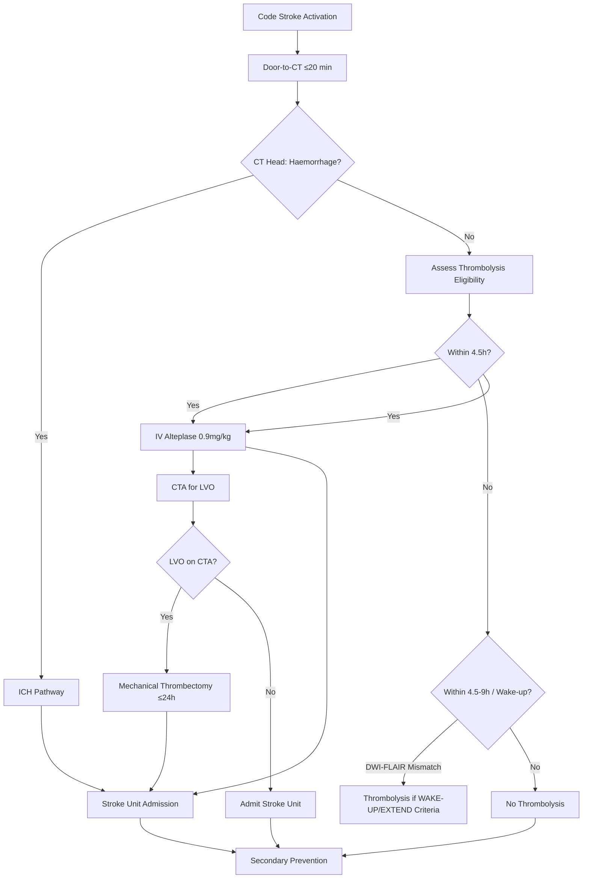
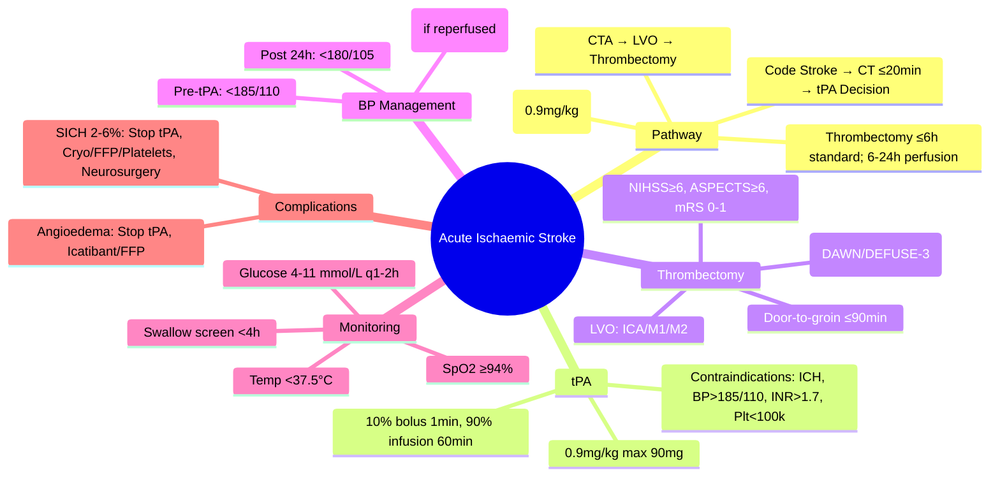

## Definition

An **acute ischaemic stroke (AIS)** is sudden neurological deficit from focal cerebral ischaemia with evidence of acute infarction on imaging (or clinically presumed if imaging not yet performed). It is the most common stroke subtype (~80-85%) and a medical emergency where 'time is brain' guides all decisions.

# Acute Ischaemic Stroke: Core Management

## Learning Objectives
- [ ] Apply hyperacute stroke pathway: recognition → imaging → reperfusion decision
- [ ] Apply IV thrombolysis eligibility criteria and contraindications
- [ ] Apply mechanical thrombectomy criteria for large vessel occlusion
- [ ] Manage blood pressure, glucose, temperature, and swallowing in hyperacute phase
- [ ] Identify FCPS/MRCP high-yield acute stroke management points

---

## Hyperacute Stroke Pathway

> **FCPS/MRCP**: **Door-to-CT ≤20 min, Door-to-needle ≤45 min, Door-to-groin ≤90 min** — Time is Brain.

---

## IV Alteplase (rt-PA) Thrombolysis

### Eligibility Criteria (Within 4.5 Hours)

| Criterion | Requirement |
|-----------|-------------|
| **Time** | **≤4.5 hours** from symptom onset (or last known well) |
| **Age** | **≥18 years** (no upper limit if fit) |
| **NIHSS** | **≥4** (some guidelines ≥4; ≤25) |
| **CT** | **No haemorrhage**; **No extensive early ischaemic change** (>1/3 MCA territory) |
| **BP** | **SBP <185 mmHg**, **DBP <110 mmHg** |
| **Glucose** | **>4 mmol/L (72 mg/dL)** and **<22 mmol/L (400 mg/dL)** |
| **Platelets** | **≥100 ×10⁹/L** |
| **INR** | **≤1.7** (if on warfarin) |
| **aPTT** | **Normal** (if on heparin) |
| **Platelets** | **≥100 ×10⁹/L** |
| **No recent** | Major surgery/trauma (14d), GI bleed (21d), stroke (3m), MI (3m) |

> **WAKE-UP / 4.5-9h Window**: **DWI-FLAIR mismatch** on MRI → thrombolysis eligible (WAKE-UP/EXTEND trial criteria).

---

## Alteplase Dosing

| Parameter | Dose |
|-----------|------|
| **Total Dose** | **0.9 mg/kg** (max 90 mg) |
| **Bolus** | **10%** (over 1 minute) |
| **Infusion** | **90%** over **60 minutes** |
| **Max Dose** | **90 mg** |

> **Give bolus first, then start infusion immediately** — do not delay.

---

## Thrombolysis Contraindications

| Category | Absolute Contraindications | Relative (Caution) |
|----------|---------------------------|-------------------|
| **Time** | >4.5h (unless DWI-FLAIR mismatch) | 3-4.5h (standard licence <4.5h) |
| **Bleeding** | Active internal bleeding | Recent GI bleed (3m) |
| | Recent intracranial surgery/trauma (3m) | Recent biopsy (3m) |
| | Known bleeding diathesis | |
| **Vascular** | Aneurysm, AVM, recent SAH | |
| **Coagulation** | Platelets <100k; INR >1.7; aPTT >40s | Platelets 100-150k |
| **Blood Pressure** | SBP >185 or DBP >110 (uncontrolled) | SBP 185-200 (treatable) |
| **Glucose** | <4 mmol/L or >22 mmol/L | 4-6 mmol/L (monitor) |
| **CT Findings** | **ICH, large infarct >1/3 MCA** | Early ischaemic change <1/3 MCA |
| **Recent Events** | Surgery/trauma 14d; stroke/MI 3m; GI bleed 21d | Recent minor surgery |
| **Anticoagulation** | INR >1.7; aPTT >40s; DOAC within 48h (unless normal coagulation) | |
| **Pregnancy** | | Relative (case-by-case) |

> **FCPS/MRCP**: **BP <185/110** is the most common exclusion — must lower before alteplase.

---

## Alteplase Dosing & Administration

| Phase | Dose | Duration |
|-------|------|----------|
| **Bolus** | **10% (0.09 mg/kg)** | **1 minute** |
| **Infusion** | **90% (0.81 mg/kg)** | **60 minutes** |
| **Total** | **0.9 mg/kg** (max 90 mg) | **61 minutes** |

> **Example**: 80 kg patient → 72 mg total (7.2 mg bolus + 64.8 mg infusion)

---

## Thrombolysis Complications

| Complication | Incidence | Management |
|--------------|-----------|------------|
| **Symptomatic ICH (SICH)** | **2-6%** (SITS-MOST) | **Stop alteplase**; Cryoprecipitate, FFP, platelets; **Neurosurgical consult** |
| **Asymptomatic ICH** | 10-15% | Monitor; usually no intervention |
| **Systemic Bleeding** | 5-10% | Supportive; transfuse if needed |
| **Angioedema** | 1-5% | **Stop alteplase**; Icatibant / FFP / Steroids; Airway if severe |
| **Anaphylaxis** | Rare | Standard anaphylaxis protocol |

> **SICH Definition (SITS-MOST)**: **Any ICH + NIHSS ↑≥4** within 36h post-alteplase.

---

## Blood Pressure Management Post-Thrombolysis

| Phase | Target | Agent |
|-------|--------|-------|
| **Pre-thrombolysis** | SBP <185, DBP <110 | Labetalol 10-20mg IV / Nicardipine 5mg/h infusion |
| **0-24h Post-tPA** | **SBP <180**, DBP <105 | Labetalol/Nicardipine infusion |
| **24-72h** | <140/90 (if no reperfusion) / <180/105 (if reperfusion) | Oral agents |
| **If SICH** | **SBP <140** | Aggressive control |

> **Key**: **Lower BP cautiously** — avoid hypoperfusion of ischaemic penumbra.

---

## Mechanical Thrombectomy (MT)

### Eligibility Criteria (Based on DAWN/DEFUSE-3/MR CLEAN)

| Criterion | Standard Window (≤6h) | Extended Window (6-24h) |
|-----------|----------------------|-------------------------|
| **Time** | **≤6h** from onset | **6-24h** (DAWN/DEFUSE-3) |
| **Imaging** | CTA: LVO (ICA, M1, M2) | **CTP/MRI: DWI-FLAIR mismatch or CTP mismatch** |
| | | Core <70ml (DEFUSE-3) / Clinical-core mismatch (DAWN) |
| **NIHSS** | **≥6** | **≥10** (DAWN) / **≥6** (DEFUSE-3) |
| **Pre-stroke mRS** | **0-1** | **0-1** |
| **Age** | ≥18 | ≥18 (DAWN: up to 80) |
| **ASPECTS** | **≥6** | **≥6** |

> **FCPS/MRCP**: **MT within 6h = standard**; **6-24h = perfusion imaging required (DAWN/DEFUSE-3 criteria)**.

---

## Mechanical Thrombectomy: Key Points

| Aspect | Detail |
|--------|--------|
| **Device** | Stent retriever (Solitaire, Trevo) ± Aspiration (ADAPT) |
| **Anesthesia** | General vs Conscious sedation (no outcome difference) |
| **Time Target** | **Door-to-groin ≤90 min**; **Groin-to-reperfusion ≤60 min** |
| **Success** | **mTICI 2b-3** (≥50% reperfusion) |
| **Complications** | Symptomatic ICH ~4%; Vessel perforation; Distal embolization |
| **Bridge Therapy** | **IV alteplase + MT** = standard if eligible for both |

---

## Blood Pressure Management in Acute Ischaemic Stroke

| Phase | SBP Target | Notes |
|-------|------------|-------|
| **Pre-thrombolysis** | **<185/110** | Lower before alteplase |
| **0-24h post-tPA** | **<180/105** | Labetalol/Nicardipine infusion |
| **24-72h** | **<140/90** (if reperfusion) / <180/105 (no reperfusion) | Oral agents preferred |
| **No thrombolysis** | **<180/105** (permissive hypertension if no bleed) | Avoid aggressive lowering |
| **If LVO + MT planned** | **<185/110** pre-MT; **<140** post-reperfusion | Avoid hypotension |

> **Permissive Hypertension**: **SBP 140-180** often tolerated in acute ischaemia (autoregulation impaired). **Do not aggressively lower** unless thrombolysis planned.

---

## Glucose, Temperature, Oxygen Management

| Parameter | Target | Action |
|-----------|--------|--------|
| **Glucose** | **4-11 mmol/L (72-200 mg/dL)** | Insulin infusion if >11; Dextrose if <4 |
| **Temperature** | **<37.5°C** | Paracetamol 1g q6h; Cooling if >38.5°C |
| **Oxygen** | **SpO₂ ≥94%** | O₂ if <94%; Avoid hyperoxia (SpO₂ >98%) |
| **Head Position** | **Head up 30°** | Reduces ICP; improves venous drainage |

---

## Dysphagia Screening

> **All stroke patients: NBM until screened** (within 4 hours of admission).

| Test | Fail Criteria | Action |
|------|---------------|--------|
| **Water Swallow Test** | Cough, choke, voice change, ≥3 swallows/50ml | NBM, SALT referral, NG tube |
| **GUSS** | Score <15 | NBM, SALT, NG/PEG |

---

---

## Clinical Features and Syndromes

This section summarises the clinical presentation patterns of acute ischaemic stroke. The detailed clinical syndromes (MCA, ACA, PCA, brainstem, cerebellar, lacunar, watershed) are covered in their own sub-files; see the Local Navigation below. The acute management pathway (hyperacute tPA and thrombectomy) is the focus of this overview file.

- **Sudden focal neurological deficit** — the cardinal presentation
- **Anterior circulation (carotid)**: face/arm > leg weakness, aphasia (dominant), neglect (non-dominant), gaze deviation
- **Posterior circulation (vertebrobasilar)**: brainstem/cerebellar signs, crossed findings, visual field defects, decreased consciousness
- **Lacunar syndromes**: pure motor hemiparesis, pure sensory stroke, sensorimotor, ataxic hemiparesis, dysarthria-clumsy hand
- See: [[Middle cerebral artery stroke|MCA]], [[Anterior cerebral artery stroke|ACA]], [[Posterior cerebral artery stroke|PCA]], [[Brainstem stroke syndromes]], [[Cerebellar infarction]], [[Lacunar infarction]], [[Lacunar syndromes]].

## FCPS/MRCP High-Yield Summary

| Concept | Key Points |
|---------|------------|
| **Time Windows** | **IV tPA ≤4.5h**; **MT ≤6h (standard), 6-24h (perfusion imaging)** |
| **tPA Dose** | **0.9 mg/kg** (max 90mg); 10% bolus + 90% over 60 min |
| **BP Targets** | Pre-tPA: <185/110; Post-tPA 24h: <180/105; 24-72h: <140/90 |
| **MT Eligibility** | LVO (ICA/M1/M2), NIHSS ≥6, ASPECTS≥6, ≤6h (or 6-24h w/ perfusion) |
| **MT Window** | ≤6h standard; 6-24h with perfusion mismatch (DAWN/DEFUSE-3) |
| **BP Post-tPA** | 0-24h: <180/105; 24-72h: <140/90 (reperfused) |
| **Glucose** | 4-11 mmol/L (avoid hypo/hyperglycaemia) |
| **Temperature** | <37.5°C (fever worsens outcome) |
| **Oxygen** | SpO₂ ≥94% (avoid hyperoxia) |
| **Swallow Screen** | <4h; Fail → NBM, SALT, NG tube |

---

## Viva Questions

1. **What is the time window for IV alteplase in acute ischaemic stroke?**
2. **What is the alteplase dose? How is it administered?**
2. **What are the absolute contraindications to IV alteplase?**
3. **What BP target pre-thrombolysis? How do you achieve it?**
3. **What is the mechanical thrombectomy time window? Eligibility criteria?**
4. **What is the BP target post-thrombolysis at 24h?**
4. **What are the mechanical thrombectomy eligibility criteria for 6-24h window?**
5. **What is the alteplase dose and administration?**
5. **What is SICH and its management?**
6. **What BP targets apply post-thrombolysis at 24h, 72h?**
6. **What are the mechanical thrombectomy eligibility criteria for 0-6h vs 6-24h?**
7. **What glucose and temperature targets in acute stroke?**
7. **What is the door-to-needle target for IV thrombolysis?**
8. **What is the mechanical thrombectomy eligibility for 6-24h window?**
9. **What is the albense dose and administration?**
9. **What is the time window for mechanical thrombectomy?**
10. **What are the alteplase contraindications?**

---

## Confusions & Mnemonics

| Confusion | Clarification |
|-----------|---------------|
| Time window tPA | **≤4.5h** standard; **4.5-9h = DWI-FLAIR mismatch** (WAKE-UP/EXTEND) |
| MT Window | **≤6h** standard; **6-24h with perfusion mismatch** (DAWN/DEFUSE-3) |
| BP for tPA | **<185/110** pre; **<180/105 post** (24h) |
| ASPECTS for MT | **≥6** for both windows |
| BP post-tPA | 0-24h: <180/105; 24-72h: <140/90 |
| Door-to-Needle | **≤45 min** |
| Door-to-Groin | **≤90 min** |
| Glucose in Stroke | **4-11 mmol/L** (hypo/hyper both bad) |
| WAKE-UP Trial | **DWI-FLAIR mismatch** = tPA eligible 4.5-9h |
| EXTEND Trial | **DWI-FLAIR mismatch** = tPA eligible 4.5-9h |

---

## Mind Map

---

## One-Page Revision Card

| **Acute Stroke Pathway** | **Key Times** |
|--------------------------|---------------|
| Door to CT | **≤20 min** |
| Door to Needle (tPA) | **≤45 min** |
| Door to Groin (MT) | **≤90 min** |
| tPA Window | **≤4.5h** (4.5-9h if DWI-FLAIR mismatch) |
| Thrombectomy | **≤6h** standard; **6-24h with perfusion** |

| **tPA** | **Details** |
|---------|-------------|
| Dose | 0.9 mg/kg (max 90mg) |
| Bolus | 10% over 1 min |
| Infusion | 90% over 60 min |
| Contraindications | ICH, >4.5h, BP>185/110, INR>1.7, Plt<100k, Glucose<4, >22, Recent surg/bleed |

| **Thrombectomy** | **Criteria** |
|------------------|--------------|
| LVO | ICA, M1, M2 |
| NIHSS | ≥6 |
| ASPECTS | ≥6 |
| Pre-mRS | 0-1 |
| Time | ≤6h (standard) / 6-24h (perfusion) |

| **BP Targets** | **Target** |
|----------------|------------|
| Pre-tPA | <185/110 |
| 0-24h post-tPA | <180/105 |
| 24-72h post-tPA | <140/90 (reperfused) / <180/105 |
| MT planned | <185/110 pre; <140 post |

| **Key Targets** | **Value** |
|-----------------|-----------|
| Glucose | 4-11 mmol/L |
| Temperature | <37.5°C |
| SpO₂ | ≥94% |
| Swallow Screen | <4 hours |

---

## Spaced Repetition Tracker

| Day | 1 | 3 | 7 | 15 | 30 |
|-----|---|---|---|----|----|
| tPA Time Window | ☐ | ☐ | ☐ | ☐ | ☐ |
| tPA Dose & Administration | ☐ | ☐ | ☐ | ☐ | ☐ |
| tPA Contraindications | ☐ | ☐ | ☐ | ☐ | ☐ |
| MT Eligibility | ☐ | ☐ | ☐ | ☐ | ☐ |
| BP Targets | ☐ | ☐ | ☐ | ☐ | ☐ |

---

## Self-Test Scorecard

| Question | My Answer | Correct? |
|----------|-----------|----------|
| tPA Time Window |  |  |
| tPA Dose |  |  |
| tPA Contraindications |  |  |
| MT Eligibility Criteria |  |  |
| Post-tPA BP Targets |  |  |

---

## Local Navigation

- [[Acute Ischaemic Stroke/Ischaemic stroke syndromes|Stroke Syndromes]]
- [[Acute Ischaemic Stroke/Middle cerebral artery stroke|MCA Stroke]]
- [[Reperfusion Therapy/Intravenous thrombolysis|IV Thrombolysis]]
- [[Reperfusion Therapy/Mechanical thrombectomy|Mechanical Thrombectomy]]
- [[Reperfusion Therapy/Intravenous alteplase eligibility|tPA Eligibility]]
- [[Reperfusion Therapy/Mechanical thrombectomy eligibility|MT Eligibility]]
- [[Stroke Unit Care and Complications/Blood pressure management in acute ischaemic stroke|BP Management]]
- [[Stroke Unit Care and Complications/Glucose, oxygen, and temperature control in stroke|Metabolic Control]]
---

## MCQs (10)
1. tPA window for ischaemic stroke?
   A) ≤ 4.5 h from onset
   B) **A**
   C) 
   D) 
   **Answer: A**

2. tPA dose?
   A) 0.9 mg/kg (max 90 mg)
   B) **B**
   C) 
   D) 
   **Answer: A**

3. Door-to-needle target?
   A) ≤ 45 min
   B) **C**
   C) 
   D) 
   **Answer: A**

4. Mechanical thrombectomy window?
   A) ≤ 6 h standard; 6-24 h with perfusion
   B) **D**
   C) 
   D) 
   **Answer: A**

5. Pre-tPA BP target?
   A) < 185/110 mmHg
   B) **A**
   C) 
   D) 
   **Answer: A**

6. Post-tPA BP target?
   A) < 180/105 for 24 h
   B) **B**
   C) 
   D) 
   **Answer: A**

7. MT eligibility — ASPECTS?
   A) ≥ 6
   B) **C**
   C) 
   D) 
   **Answer: A**

8. MT eligibility — NIHSS?
   A) ≥ 6
   B) **D**
   C) 
   D) 
   **Answer: A**

9. Absolute contraindication to tPA?
   A) Intracerebral haemorrhage
   B) **A**
   C) 
   D) 
   **Answer: A**

10. Door-to-groin target for MT?
   A) ≤ 90 min
   B) **B**
   C) 
   D) 
   **Answer: A**

## SBA Questions (10)
1. 65-year-old with right hemiparesis and aphasia, 2 h onset. Best next step? | CT head to exclude haemorrhage, then tPA if eligible

2. Same patient with BP 200/110. Action? | Lower BP to < 185/110 with IV labetalol, then give tPA

3. INR 1.8 in a patient with acute ischaemic stroke. Can you give tPA? | No, INR > 1.7 is contraindication

4. Glucose 2.5 in suspected stroke. Action? | Correct hypoglycaemia with IV dextrose; re-evaluate deficit

5. LVO at M1 with NIHSS 18, ASPECTS 8, 3 h onset. Best treatment? | IV tPA + mechanical thrombectomy

6. MT in 6-24 h window — what's required? | CT perfusion or MRI DWI-PWI mismatch (DAWN/DEFUSE-3 criteria)

7. Door-to-needle time target? | ≤ 45 min

8. Door-to-groin time target? | ≤ 90 min

9. tPA-related symptomatic ICH risk? | ~2-6%

10. Permissive hypertension target if no tPA? | < 220/120

## Flashcards
**Q: Time is brain?**
A: ~1.9 M neurons/min

**Q: tPA window?**
A: ≤ 4.5 h

**Q: tPA dose?**
A: 0.9 mg/kg (max 90 mg)

**Q: MT window?**
A: ≤ 6 h standard

**Q: DTN target?**
A: ≤ 45 min

**Q: DTG target?**
A: ≤ 90 min

**Q: Pre-tPA BP?**
A: < 185/110

**Q: Post-tPA BP?**
A: < 180/105 × 24 h

**Q: ASPECTS for MT?**
A: ≥ 6

**Q: sICH with tPA?**
A: ~2-6%

## Answer Key with Explanations
### MCQs
1. **A** — tPA window for ischaemic stroke?
2. **A** — tPA dose?
3. **A** — Door-to-needle target?
4. **A** — Mechanical thrombectomy window?
5. **A** — Pre-tPA BP target?
6. **A** — Post-tPA BP target?
7. **A** — MT eligibility — ASPECTS?
8. **A** — MT eligibility — NIHSS?
9. **A** — Absolute contraindication to tPA?
10. **A** — Door-to-groin target for MT?

### SBAs
1. **CT head to exclude haemorrhage, then tPA if eligible**
2. **Lower BP to < 185/110 with IV labetalol, then give tPA**
3. **No, INR > 1.7 is contraindication**
4. **Correct hypoglycaemia with IV dextrose; re-evaluate deficit**
5. **IV tPA + mechanical thrombectomy**
6. **CT perfusion or MRI DWI-PWI mismatch (DAWN/DEFUSE-3 criteria)**
7. **≤ 45 min**
8. **≤ 90 min**
9. **~2-6%**
10. **< 220/120**

## Local Navigation

- [[../Stroke Medicine MOC|Stroke Medicine MOC]]
- [[../Davidson Chapter 29 - Stroke Medicine Hierarchy|Davidson Chapter 29 - Stroke Medicine Hierarchy]]
