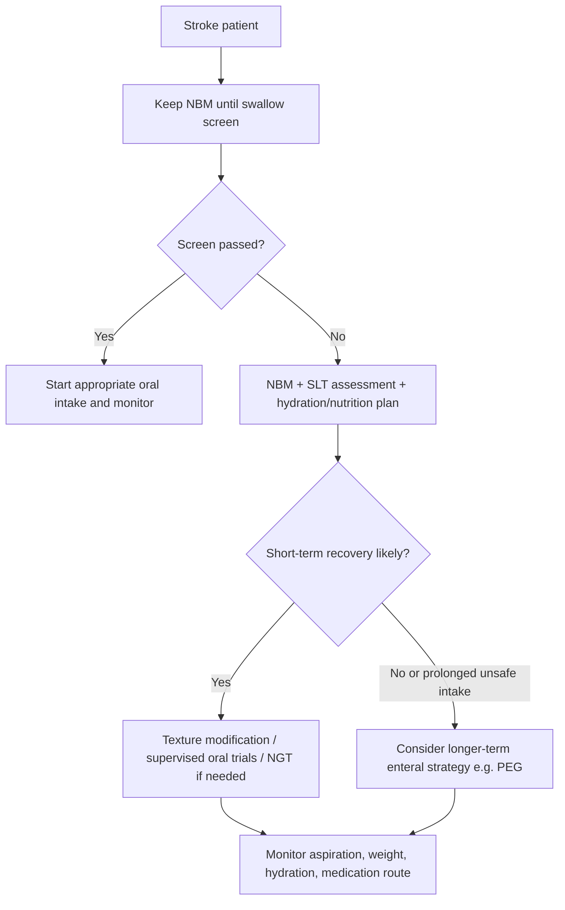
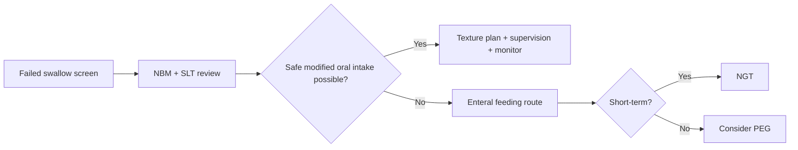

# Persistent dysphagia and nutrition planning

Related: [[../Stroke Medicine MOC|Stroke Medicine MOC]] · [[../Recovery, Rehabilitation, and Prognosis|Recovery, Rehabilitation, and Prognosis]] · [[Communication and swallowing sequelae|Communication and swallowing sequelae]] · [[Aphasia after stroke]] · [[Neglect and cognitive impairment after stroke]]

> [!important]
> **Every stroke patient should be treated as unsafe for oral intake until swallowing is screened.** The practical exam pearl is that persistent dysphagia is not only a feeding problem; it is a major cause of **aspiration pneumonia, dehydration, undernutrition, medication failure, and delayed rehabilitation**.

## Learning Objectives
- Define persistent dysphagia after stroke.
- Review the neuroanatomy and physiology of swallowing relevant to stroke.
- Recognize bedside clues to unsafe swallowing and aspiration risk.
- Outline the investigation pathway including swallow screen, speech-language therapy review, and instrumental studies.
- Plan nutrition, hydration, medication delivery, and long-term feeding support safely.

## Definition
**Post-stroke dysphagia** is impairment of swallowing after stroke affecting the oral, pharyngeal, and/or esophageal transfer of food, fluid, or medication. **Persistent dysphagia** means swallowing remains clinically important beyond the immediate hyperacute period and continues to influence hydration, nutrition, aspiration risk, rehabilitation planning, and discharge decisions.

## Core Anatomy
- Swallowing is coordinated by a bilateral but asymmetrically organized network involving:
  - **cerebral cortex**: primary motor and sensory cortex, insula, frontal operculum, cingulate
  - **subcortical pathways**: internal capsule, basal ganglia, thalamic connections
  - **brainstem swallowing centers** in the medulla
  - **cranial nerves**:
    - **V**: mastication
    - **VII**: lip seal, oral control
    - **IX**: pharyngeal sensation
    - **X**: palate, pharynx, larynx, airway protection
    - **XII**: tongue propulsion
- Stroke in the **brainstem**, dominant insula/operculum, bilateral hemispheres, or large MCA territories commonly disrupts safe swallowing.

## Core Physiology
Swallowing occurs in coordinated phases:
1. **Oral preparatory phase**: chewing, bolus formation
2. **Oral propulsive phase**: tongue drives bolus posteriorly
3. **Pharyngeal phase**: rapid reflex-like transfer with laryngeal elevation and airway closure
4. **Esophageal phase**: transfer to stomach

Normal swallowing requires:
- intact consciousness and attention
- oral motor strength and coordination
- timely swallow initiation
- adequate laryngeal closure and cough reflex
- synchronized breathing-swallow coordination

Stroke can produce:
- delayed swallow trigger
- weak tongue propulsion
- pharyngeal residue
- poor laryngeal elevation
- reduced cough and **silent aspiration**

## Normal Values / Important Cut-offs
- **No oral intake until swallow screen** is completed.
- Swallow screening should occur **as early as possible** after stabilization and before food, fluid, or oral medication.
- Persistent dysphagia should trigger:
  - formal **speech and language therapy (SLT)** review
  - hydration/nutrition assessment
  - medication route review
- Enteral feeding is usually preferred over prolonged starvation when oral intake is unsafe.
- Practical planning thresholds:
  - **short-term enteral feeding**: usually **nasogastric tube (NGT)**
  - **longer-term feeding need**: consider **PEG** when recovery is expected to be slow and unsafe swallowing persists, commonly after a trial period of days to weeks depending on clinical course
- Aspiration risk rises with:
  - reduced consciousness
  - severe brainstem stroke
  - recurrent coughing/choking
  - wet/gurgly voice
  - absent protective cough
  - large residues on instrumental testing

## Classification
### By phase predominantly affected
- oral phase dysphagia
- pharyngeal phase dysphagia
- mixed oropharyngeal dysphagia

### By severity
- mild: modified diet but adequate oral intake possible
- moderate: restricted consistencies, close supervision needed
- severe: oral intake unsafe; enteral route required

### By aspiration pattern
- overt aspiration
- silent aspiration
- aspiration risk without documented aspiration yet

## Etiology / Causes
- Acute ischemic stroke
- Intracerebral hemorrhage
- Brainstem stroke
- Large hemispheric stroke with reduced alertness
- Bilateral corticobulbar involvement
- Stroke-related deconditioning, delirium, or severe neglect worsening intake safety

## Risk Factors
| Risk factor | Why it matters |
|---|---|
| Brainstem stroke | Directly impairs swallowing circuitry |
| Severe stroke / high NIHSS | More likely impaired alertness and bulbar function |
| Dysarthria or facial weakness | Often accompanies poor oral control |
| Reduced consciousness | Unsafe coordination and poor airway protection |
| Cognitive impairment / neglect | Poor feeding awareness and reduced compliance |
| Previous frailty or malnutrition | Less reserve; worse recovery |
| Recurrent chest infection | Suggests aspiration burden |

## Pathophysiology
Stroke disrupts the cortical-brainstem network that coordinates bolus preparation, swallow initiation, pharyngeal clearance, and airway protection. Weak oral control leads to spillage and delayed initiation. Pharyngeal weakness or discoordination leads to residue. Impaired laryngeal closure and depressed cough allow aspiration, which may be clinically silent. Reduced intake then causes dehydration, undernutrition, electrolyte disturbance, medication interruption, and prolonged rehabilitation dependence.

## Clinical Features
### Bedside clues
- coughing or choking with fluids or food
- wet, gurgly, or hoarse voice after swallowing
- drooling or poor saliva control
- food pocketing in mouth
- prolonged mealtime
- repeated throat clearing
- inability to handle tablets
- recurrent desaturation during feeding
- fever or chest signs suggesting aspiration pneumonia

### Clues to severe/persistent problem
- repeated failure of swallow screening
- ongoing unsafe intake beyond first days
- recurrent aspiration events
- large dependence on suctioning or strict supervised feeding
- weight loss, poor intake, dehydration, hypernatremia, or rising urea

## Approach / Algorithm

## Investigations
### Core assessment
- bedside swallow screen
- full **SLT swallow assessment**
- stroke imaging to define lesion type/site
- hydration and nutritional assessment

### Laboratory support
- urea/creatinine
- sodium and other electrolytes
- glucose
- albumin/prealbumin are not acute diagnostic tests but may help overall nutritional context

### Instrumental studies when needed
- **VFSS / videofluoroscopic swallow study**
- **FEES / fiberoptic endoscopic evaluation of swallowing**

Indications include:
- uncertainty after bedside assessment
- suspected silent aspiration
- mismatch between symptoms and bedside findings
- recurrent aspiration despite precautions
- need to tailor consistencies precisely

## Interpretation Frameworks
### Unsafe swallow checklist
1. Can the patient maintain alertness and posture?
2. Is there effective saliva management?
3. Is voice wet/gurgly after trial swallow?
4. Is cough present or absent?
5. Is there delayed swallow initiation?
6. Is oral residue or pocketing present?
7. Is aspiration suspected clinically or instrumentally?

### Nutrition planning frame
- **Can the patient eat safely?**
- **Can the patient eat enough?**
- **Can the patient take fluids safely?**
- **Can medication be given reliably?**
- **Is short-term or long-term enteral access needed?**

## Diagnosis
Diagnosis is based on clinical swallowing dysfunction after stroke, usually confirmed by bedside and formal swallow assessment. A practical diagnosis should specify:
- severity
- aspiration risk
- current safe diet/fluid texture
- need for enteral feeding
- expected reversibility or persistence

Example:
> Persistent post-stroke oropharyngeal dysphagia with unsafe thin fluids and aspiration risk, currently requiring NGT feeding and SLT-guided supervised trials.

## Differential Diagnosis
- Reduced intake due to aphasia or confusion without true dysphagia
- Odynophagia from candidiasis/ulceration
- Esophageal obstruction or severe reflux-related disease
- Myasthenia gravis or other neuromuscular disorders predating stroke
- Drug sedation causing poor airway protection
- Functional refusal of feeding without physiological swallowing failure

## Tables / Comparison Charts
### Overt vs silent aspiration
| Feature | Overt aspiration | Silent aspiration |
|---|---|---|
| Coughing/choking | common | absent or minimal |
| Bedside recognition | easier | easily missed |
| Risk | high | high and deceptive |
| Need for instrumental study | sometimes | often important |

### Feeding route comparison
| Route | Best use | Advantages | Limitations |
|---|---|---|---|
| Modified oral diet | mild/moderate dysphagia | more natural, supports rehab | still aspiration risk if poorly selected |
| NGT | short-term enteral support | quick, bedside placement | discomfort, dislodgement, aspiration still possible |
| PEG | prolonged feeding need | more stable long-term route | invasive procedure, not for unstable short-term decisions |

## Management
### Immediate principles
- keep patient **NBM** until safe plan exists
- involve **SLT** early
- give hydration safely via appropriate route
- review medication route immediately
- avoid casual “sips” before assessment

### Oral intake strategies
- texture-modified diet
- thickened fluids if prescribed after assessment
- upright posture during and after feeding
- slow supervised feeding with small boluses
- good oral hygiene to reduce pneumonia risk

### Enteral feeding strategy
- **NGT** for short-term nutritional support when oral intake is unsafe or insufficient
- consider **PEG** if dysphagia is prolonged and recovery is not imminent
- continue reassessment; PEG should not be treated as abandonment of swallow recovery efforts

### Medication planning
- switch nonessential oral drugs temporarily if unsafe
- use liquid/crushed formulations only when appropriate and safe
- check whether tablets can be dispersed; some must not be crushed

### Multidisciplinary care
- SLT for swallowing rehabilitation
- dietitian for calorie/protein/fluid targets
- nursing for aspiration precautions and monitoring
- physician review for pneumonia, dehydration, and route decisions
- family counseling regarding realistic feeding goals and expectations

## Drug Interactions / Contraindications / Comorbidity Cautions
- Sedatives, excessive opioids, and some antipsychotics may worsen alertness and swallowing safety.
- Tablet crushing is not universally safe; modified-release or enteric-coated preparations may become dangerous or ineffective.
- Thickened fluids may reduce patient acceptance and overall fluid intake, so dehydration risk must still be watched.
- Frail elderly patients and those with dementia/delirium may have mixed neurogenic and behavioral feeding problems.

## Procedures / Indications / Contraindications
- **NGT insertion**
  - indication: short-term enteral support
  - caution: confirm placement correctly before use
- **PEG placement**
  - indication: prolonged unsafe oral intake when ongoing enteral feeding is appropriate
  - caution: not an emergency reflex decision; assess prognosis and goals
- **VFSS/FEES**
  - indication: refine physiology and aspiration pattern when bedside assessment is insufficient

## Procedure Mini-Sections
### Nasogastric feeding
- **Indication:** unsafe or inadequate oral intake in the short term.
- **Principle:** provides enteral nutrition, hydration, and medication access.
- **Complications:** dislodgement, misplacement, discomfort, aspiration if poorly managed.
- **Viva pearl:** tube presence does not remove aspiration risk from reflux or secretions.

### PEG feeding
- **Indication:** longer-term enteral support.
- **Principle:** durable gastric access when recovery is delayed.
- **Complications:** infection, leakage, procedure-related complications.
- **Viva pearl:** PEG is a nutritional route decision, not a cure for dysphagia.

## Complications
- aspiration pneumonia
- dehydration and hypernatremia
- malnutrition and weight loss
- medication omission or poor bioavailability
- prolonged hospital stay
- reduced engagement in rehabilitation
- caregiver distress and difficult discharge planning

## Red Flags / Emergencies
- repeated aspiration with respiratory compromise
- inability to maintain hydration
- severe malnutrition or rapid weight loss
- recurrent fever/chest sepsis after feeding
- unrecognized silent aspiration with unexplained deterioration
- tube misplacement or unsafe use of enteral access

## Prognosis
- Many patients improve within days to weeks, especially with smaller strokes and better consciousness.
- Persistent dysphagia is more likely with brainstem strokes, severe stroke, bilateral involvement, and recurrent aspiration events.
- Early structured swallowing rehabilitation and safe nutrition planning reduce preventable complications even when neurological recovery is slow.

## Topic Correlation
- [[Aphasia after stroke]] may complicate assessment because communication difficulty can mimic poor swallowing cooperation.
- [[Neglect and cognitive impairment after stroke]] may worsen safe feeding behavior.
- [[Aspiration pneumonia after stroke]] links directly to dysphagia-related morbidity.
- [[Stroke unit rehabilitation principles]] is relevant because nutrition and safe swallowing strongly affect rehabilitation tolerance.

## Special Situations
### Reduced consciousness
- avoid oral intake
- prioritize airway safety and enteral planning

### Brainstem stroke
- expect more severe pharyngeal dysfunction and aspiration risk
- instrumental assessment often more useful

### Frailty / elderly patient
- lower nutritional reserve
- higher pneumonia risk
- goals of care discussion may be needed

### Severe communication impairment
- coordinate with caregivers and use supported communication to explain feeding restrictions and plans

## FCPS/MRCP High-Yield Points
- Dysphagia after stroke is a major cause of **aspiration pneumonia**.
- Keep patients **NBM until screened**.
- Dysphagia may be **silent**; absence of cough does not prove safety.
- Persistent dysphagia needs a route plan for **food, fluids, and medications**.
- NGT is typically short-term; PEG is considered for longer-term needs.
- Good oral hygiene is a pneumonia-prevention measure.

## Common Viva Questions
- Why must oral intake be withheld until swallowing is assessed?
- How do you recognize silent aspiration?
- When would you choose NGT vs PEG?
- What are the consequences of poor nutrition planning after stroke?
- Why can medication administration become unsafe in dysphagia?

## Common Confusions / Exam Traps
- Confusing dysarthria with dysphagia.
- Assuming no cough means no aspiration.
- Forgetting medication route review.
- Thinking tube feeding completely eliminates aspiration risk.
- Delaying dietitian/SLT involvement while repeatedly “trying small oral intake.”

## Mnemonics
**SWALLOW** bedside memory aid:
- **S**creen first
- **W**et voice?
- **A**spiration risk
- **L**evel of consciousness
- **L**ook for residue
- **O**ral meds unsafe?
- **W**eight/hydration monitoring

## Mind Map
- Persistent dysphagia after stroke
  - anatomy
    - cortex
    - brainstem
    - CN V, VII, IX, X, XII
  - risks
    - aspiration
    - dehydration
    - malnutrition
    - medication failure
  - assessment
    - NBM
    - screen
    - SLT
    - VFSS/FEES
  - management
    - texture modification
    - NGT
    - PEG
    - oral care
    - supervised feeding

## Flowchart

## Suggested Visuals / Image Notes
- Diagram of oral and pharyngeal phases of swallowing
- Simple chart comparing NGT vs PEG indications
- Bedside swallow safety checklist card

## Suggested Video References
- Stroke swallowing assessment bedside demonstration
- VFSS interpretation examples in neurogenic dysphagia
- FEES overview for aspiration and residue patterns

## One-Page Revision Summary
- Stroke dysphagia = unsafe swallowing with aspiration, dehydration, and malnutrition risk.
- Keep patient NBM until screened.
- Brainstem stroke and severe stroke increase persistent dysphagia risk.
- Bedside red flags: cough, wet voice, pocketing, prolonged mealtime, recurrent chest infection.
- Silent aspiration can occur.
- SLT + dietitian + nursing + medical review are central.
- NGT for short-term enteral support; PEG for prolonged need.
- Oral hygiene, posture, supervision, and medication-route review matter.
- Never assume tube feeding alone removes aspiration risk.

## 24-Hour Recall Prompts
- List 5 bedside signs of unsafe swallowing after stroke.
- Distinguish overt from silent aspiration.
- When would you consider NGT vs PEG?
- Why is oral hygiene part of stroke dysphagia management?
- How does persistent dysphagia delay rehabilitation?

## 7-Day / 15-Day / 30-Day Revision Tracker
- **7 days:** redraw the assessment and feeding-route algorithm from memory.
- **15 days:** compare NGT and PEG without notes.
- **30 days:** answer all red flags and aspiration-prevention points from memory.

## Must Know / Should Know / Nice to Know
### Must Know
- NBM until swallow screen
- aspiration pneumonia risk
- NGT vs PEG basics
- silent aspiration concept

### Should Know
- VFSS/FEES roles
- medication route review
- hydration/electrolyte monitoring

### Nice to Know
- detailed swallowing neurophysiology
- advanced instrumental pattern interpretation

## My Weak Points
- Do I remember that dysphagia affects **medication delivery** as well as food?
- Do I automatically mention **silent aspiration**?
- Can I explain why PEG is not the first immediate reflex in every patient?

## Self-Test Scorecard
- Understanding of physiology /10
- Bedside assessment confidence /10
- Feeding-route decision confidence /10
- Aspiration prevention recall /10
- Viva readiness /10

## Exam Answer Modes
### Short note angle
Define post-stroke dysphagia, list causes and bedside features, mention aspiration risk, outline assessment, and summarize NGT/PEG-based nutrition planning.

### Viva angle
“This patient failed the swallow screen after stroke. I would keep them NBM, involve SLT, assess aspiration risk, maintain hydration, choose a safe medication route, and decide between modified oral intake, NGT, or PEG depending on severity and expected duration.”

## Summary
Persistent dysphagia after stroke is a common and clinically important rehabilitation problem. It reflects disruption of complex cortical-brainstem swallowing networks and can lead to aspiration pneumonia, dehydration, malnutrition, medication failure, and prolonged disability. Safe care depends on early screening, SLT-led assessment, route planning for food/fluid/medications, use of short-term or longer-term enteral support when necessary, and continuous reassessment as neurological recovery evolves.

## MCQs (10)
1. A stroke patient should generally remain NBM until:
   - A. CT is repeated
   - B. Blood pressure normalizes
   - C. Swallow screening is completed
   - D. Family confirms prior normal swallowing
   - E. IV fluids are started

2. The most feared common complication of post-stroke dysphagia is:
   - A. Migraine
   - B. Aspiration pneumonia
   - C. Otitis media
   - D. Peptic ulcer disease
   - E. Peripheral neuropathy

3. Which bedside finding most strongly suggests aspiration risk?
   - A. Tachycardia alone
   - B. Wet voice after swallowing
   - C. Isolated limb ataxia
   - D. Photophobia
   - E. Bradykinesia

4. Silent aspiration means:
   - A. Aspiration only during sleep
   - B. Aspiration without cough or obvious distress
   - C. Aspiration after PEG only
   - D. A psychiatric feeding refusal
   - E. Saliva pooling without airway risk

5. The usual short-term enteral feeding route is:
   - A. PEG
   - B. Jejunostomy
   - C. NGT
   - D. Rectal route
   - E. TPN in all cases

6. Which cranial nerve is especially important for tongue propulsion?
   - A. II
   - B. V
   - C. VII
   - D. X
   - E. XII

7. A patient with failed swallow screen and poor alertness should first receive:
   - A. Unsupervised sips of water
   - B. NBM and formal swallowing assessment
   - C. Oral high-protein diet
   - D. Sedation for agitation
   - E. Routine discharge planning

8. Which investigation best characterizes swallowing physiology when bedside assessment is insufficient?
   - A. EEG
   - B. EMG limb study
   - C. VFSS
   - D. Carotid Doppler only
   - E. Chest X-ray only

9. Which statement about PEG is most correct?
   - A. It should be inserted immediately in every dysphagic stroke patient
   - B. It cures aspiration risk
   - C. It is considered for longer-term enteral feeding needs
   - D. It replaces SLT assessment
   - E. It removes the need for oral care

10. Which measure helps reduce aspiration-related complications?
   - A. Poor oral hygiene
   - B. Supine feeding
   - C. Upright supervised feeding when permitted
   - D. Crushed tablets for all drugs automatically
   - E. Withholding hydration review

## SBA Questions (10)
1. A 72-year-old man with acute stroke repeatedly coughs after teaspoon water trials and has a wet voice. What is the best next step?
   - A. Continue oral fluids slowly
   - B. Keep him NBM and request formal swallow assessment
   - C. Start PEG immediately
   - D. Discharge with family supervision
   - E. Give sedatives before meals

2. A woman with lateral medullary stroke has no cough during feeding but develops recurrent fever and chest infiltrates. What important explanation must be considered?
   - A. Panic attacks
   - B. Silent aspiration
   - C. Drug allergy
   - D. Viral bronchitis only
   - E. Hyperthyroidism

3. A dysphagic stroke patient cannot safely swallow tablets. What is the best medication principle?
   - A. Stop all stroke medicines permanently
   - B. Crush every tablet indiscriminately
   - C. Review each drug formulation and use safe alternative routes or preparations
   - D. Force tablets with thickened fluid
   - E. Delay treatment for one week

4. A 79-year-old patient has persistent severe dysphagia two weeks after a large stroke, with repeated NGT dislodgement and ongoing enteral needs. Which route is most reasonable to discuss?
   - A. No feeding at all
   - B. PEG
   - C. Routine oral diet
   - D. Nebulized nutrition
   - E. Intramuscular feeding

5. Which professional is central for detailed swallowing rehabilitation planning?
   - A. Dermatologist
   - B. Speech and language therapist
   - C. Ophthalmologist
   - D. Orthopedic surgeon
   - E. Audiologist only

6. A patient with post-stroke dysphagia becomes drowsy after opioid escalation. Why does this matter?
   - A. It improves swallowing
   - B. Sedation can worsen airway protection and aspiration risk
   - C. It prevents silent aspiration
   - D. It eliminates need for SLT
   - E. It guarantees PEG success

7. Which finding most favors prolonged nutritional support rather than watchful waiting alone?
   - A. Single cough once on day 1 only
   - B. Persistent failed assessments with dehydration and poor oral intake
   - C. Normal voice and normal diet tolerance
   - D. Mild isolated hand weakness
   - E. Normal chest examination and weight stability

8. Why is oral hygiene emphasized in dysphagic stroke patients?
   - A. It lowers blood pressure
   - B. It reduces bacterial burden contributing to aspiration pneumonia
   - C. It directly improves aphasia
   - D. It replaces antibiotics
   - E. It predicts NIHSS

9. A patient with aphasia appears uncooperative during feeding. What important pitfall should be avoided?
   - A. Assuming every communication problem equals safe swallowing
   - B. Recognizing need for supported communication
   - C. Asking SLT to help assess
   - D. Supervising oral trials carefully
   - E. Reviewing aspiration risk

10. Which statement best summarizes persistent post-stroke dysphagia care?
   - A. It is purely a nursing issue
   - B. It requires multidisciplinary assessment, aspiration prevention, and nutrition planning
   - C. It is unimportant if imaging is stable
   - D. It always resolves within 24 hours
   - E. It only affects food, not medication delivery

## Flashcards
- Q: What is the first rule before feeding a new stroke patient?
  A: Keep NBM until swallow screening is completed.
- Q: Name two classic bedside clues to aspiration risk.
  A: Coughing/choking and wet voice after swallowing.
- Q: What is silent aspiration?
  A: Aspiration without obvious cough or distress.
- Q: Usual short-term enteral route in stroke dysphagia?
  A: Nasogastric tube.
- Q: When is PEG considered?
  A: When unsafe oral intake is prolonged and longer-term enteral support is needed.
- Q: Which specialist is central to swallowing assessment?
  A: Speech and language therapist.
- Q: Why is oral hygiene important?
  A: It reduces bacterial burden and aspiration pneumonia risk.
- Q: Does tube feeding abolish aspiration risk?
  A: No.
- Q: Which cranial nerve is key for tongue propulsion?
  A: CN XII.
- Q: Why review medication route in dysphagia?
  A: Tablets may be unsafe or ineffective if swallowed improperly.

## Answer Key with Explanations
### MCQs
1. **C** — Oral intake should not start before swallow screening.
2. **B** — Aspiration pneumonia is a major complication.
3. **B** — Wet voice after swallowing suggests pharyngeal residue/aspiration risk.
4. **B** — Silent aspiration lacks obvious cough.
5. **C** — NGT is the typical short-term route.
6. **E** — CN XII controls tongue propulsion.
7. **B** — Failed screen plus poor alertness requires NBM and formal assessment.
8. **C** — VFSS helps define swallowing physiology and aspiration pattern.
9. **C** — PEG is for longer-term enteral feeding needs, not every case.
10. **C** — Upright supervised feeding reduces aspiration risk when oral intake is allowed.

### SBAs
1. **B** — Keep NBM and escalate to formal swallowing assessment.
2. **B** — Silent aspiration is common and dangerous in stroke.
3. **C** — Medication formulations must be reviewed individually.
4. **B** — PEG becomes a reasonable discussion for prolonged enteral needs.
5. **B** — SLT is central for swallow rehabilitation planning.
6. **B** — Sedation worsens airway protection.
7. **B** — Persistent failure plus dehydration indicates need for enteral support planning.
8. **B** — Oral hygiene reduces aspiration pneumonia risk.
9. **A** — Communication problems do not prove swallowing safety.
10. **B** — Dysphagia care is multidisciplinary and extends beyond feeding alone.
