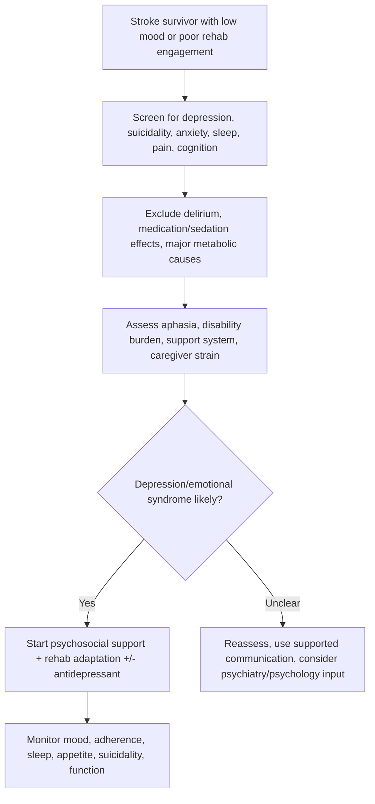
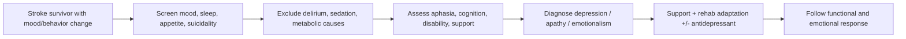

# Post-stroke depression and emotional change

Related: [[../Stroke Medicine MOC|Stroke Medicine MOC]] · [[../Recovery, Rehabilitation, and Prognosis|Recovery, Rehabilitation, and Prognosis]] · [[Long-term outcomes|Long-term outcomes]] · [[Functional outcome prediction after stroke]] · [[Aphasia after stroke]] · [[Neglect and cognitive impairment after stroke]]

> [!important]
> **Post-stroke depression is common, under-recognized, and functionally important.** The exam pearl is that poor mood after stroke is not merely a normal reaction: it can worsen rehabilitation participation, cognition, adherence, recovery, caregiver burden, and even mortality.

## Learning Objectives
- Define post-stroke depression and related emotional changes.
- Identify relevant neuroanatomical and neurobiological contributors.
- Recognize major clinical patterns, risk factors, and screening clues.
- Differentiate depression from apathy, delirium, emotionalism, and cognitive decline.
- Outline practical management including psychosocial, rehabilitative, and pharmacologic measures.

## Definition
**Post-stroke depression (PSD)** is a depressive syndrome occurring after stroke, characterized by persistent low mood and/or loss of interest with associated cognitive, behavioral, vegetative, and functional symptoms that exceed expected brief reactive sadness and interfere with recovery or quality of life.

**Emotional change after stroke** is broader and may include:
- depression
- anxiety
- emotional lability / pseudobulbar affect
- apathy
- irritability
- frustration related to disability or communication loss

## Core Anatomy
- Mood and emotional regulation depend on distributed networks involving:
  - **prefrontal cortex**
  - **anterior cingulate**
  - **basal ganglia**
  - **limbic circuits**
  - **thalamic connections**
- Stroke may disrupt these networks directly, especially with:
  - frontal-subcortical lesions
  - basal ganglia involvement
  - strategic left or right hemispheric lesions
- Aphasia, neglect, disability, and dependency may secondarily amplify emotional morbidity even when the lesion is not in a classic mood-regulation area.

## Core Physiology
Mood regulation involves monoaminergic signaling, fronto-limbic integration, reward pathways, sleep regulation, and social-behavioral feedback. After stroke, depression may arise from:
- direct network injury
- inflammatory and neurochemical change
- loss of independence and social role
- impaired communication and cognition
- persistent pain, sleep disturbance, and fatigue

Recovery is affected because depression reduces motivation, therapy participation, concentration, appetite, sleep quality, and adherence.

## Normal Values / Important Cut-offs
- Any stroke survivor with persistent low mood, anhedonia, hopelessness, tearfulness, withdrawal, or reduced rehabilitation engagement should be screened for depression.
- Practical diagnostic frame: symptoms should be **persistent and clinically significant**, not just a transient brief emotional reaction.
- Severe red flags include:
  - suicidal ideation
  - refusal of food/medication due to depression
  - profound psychomotor retardation or withdrawal
  - major caregiver breakdown caused by behavioral or mood change
- Screening tools may help, but **clinical judgment remains essential**, especially when aphasia or cognitive impairment limits questionnaire use.

## Classification
### By emotional syndrome
- post-stroke depression
- post-stroke anxiety
- emotional lability / pseudobulbar affect
- apathy syndrome
- mixed mood and adjustment difficulties

### By severity of depression
- mild
- moderate
- severe

### By temporal pattern
- early onset during inpatient recovery
- delayed depression after discharge and role loss
- persistent/recurrent depressive illness

## Etiology / Causes
- direct neurobiological effect of stroke on mood circuits
- reactive psychological response to disability
- communication loss, dependence, incontinence, pain, dysphagia, and fatigue
- social isolation after discharge
- prior vulnerability to mood disorder
- caregiver strain feeding back into patient distress

## Risk Factors
| Risk factor | Why it matters |
|---|---|
| Prior depression or anxiety | Strong predisposition |
| Severe disability | Greater loss of independence |
| Aphasia | Communication barrier, frustration, isolation |
| Cognitive impairment or neglect | Worsens adaptation and participation |
| Persistent pain, sleep disturbance, fatigue | Sustains low mood |
| Social isolation / weak support | Less emotional buffering |
| Female sex in some studies | Associated with higher depressive burden |
| Early emotional distress after stroke | May evolve into persistent syndrome |

## Pathophysiology
Post-stroke depression is multifactorial. Network disruption affects emotional regulation directly, while disability, dependence, altered identity, and reduced participation reinforce maladaptive emotional states. Inflammatory and neurochemical changes may further alter serotonergic and other signaling pathways. The result is a syndrome that is both biologically and psychosocially driven.

## Clinical Features
### Core depressive features
- persistent low mood
- loss of interest or pleasure
- hopelessness
- tearfulness
- fatigue and low drive
- poor concentration
- sleep disturbance
- appetite change
- guilt or worthlessness

### Stroke-specific presentation clues
- unexplained poor participation in rehab
- withdrawal from therapy or visitors
- irritability rather than overt sadness
- excessive catastrophic thinking about recovery
- worsening dependence due to low motivation
- emotional outbursts or crying spells

### Associated emotional changes
- anxiety about recurrence or disability
- emotionalism / pseudobulbar affect
- frustration due to aphasia
- apathy with little spontaneous engagement

## Approach / Algorithm

## Investigations
### Core assessment
- structured clinical history where possible
- collateral history from family/caregivers
- mental-state examination adapted for stroke deficits
- screen for suicidality
- review sleep, pain, appetite, bowel/bladder problems, and medications

### Functional context assessment
- rehabilitation participation pattern
- cognition and communication status
- social support and caregiver burden
- premorbid psychiatric history

### Supportive investigations when relevant
- rule out contributors such as infection, metabolic disturbance, hypothyroidism, anemia, medication adverse effects, or delirium when clinically suspected

## Interpretation Frameworks
### Depression vs common mimics after stroke
| Problem | Key clue |
|---|---|
| Post-stroke depression | sustained low mood/anhedonia affecting function |
| Apathy | low initiation without clear sadness/hopelessness |
| Delirium | fluctuating attention and awareness |
| Emotionalism/pseudobulbar affect | sudden crying/laughing out of proportion, not always sustained depression |
| Frustration from aphasia | mood symptoms may appear situational around communication difficulty |

### Practical bedside frame
1. Is the patient persistently sad or anhedonic?
2. Is rehab participation reduced beyond neurological limitation?
3. Are sleep, appetite, and motivation changed?
4. Could this instead be delirium, apathy, or medication effect?
5. Is there suicidal thinking or severe withdrawal?

## Diagnosis
Diagnosis is clinical. A practical diagnosis should specify the emotional syndrome and functional impact, for example:

> Post-stroke depression with poor therapy engagement and sleep disturbance, without delirium, in a patient with residual aphasia and dependency.

## Differential Diagnosis
- normal transient sadness / adjustment reaction
- delirium
- dementia or cognitive decline
- apathy syndrome
- pseudobulbar affect / emotionalism
- medication adverse effects or sedation
- hypothyroidism, anemia, infection, or chronic pain-associated low mood

## Tables / Comparison Charts
### Depression vs emotionalism vs apathy
| Feature | Depression | Emotionalism / pseudobulbar affect | Apathy |
|---|---|---|---|
| Sustained low mood | common | not necessary | often absent |
| Loss of interest | common | uncommon | common |
| Tearful episodes | may occur | prominent | uncommon |
| Hopelessness/guilt | common | uncommon | uncommon |
| Emotional trigger threshold | lowered | very low / disproportionate | blunted |
| Rehab participation | reduced | variably reduced | reduced |

## Management
### Core principles
- recognize and validate the syndrome early
- continue active stroke rehabilitation; do not interpret mood disorder as mere laziness
- use caregiver and team-based support
- treat pain, sleep disturbance, constipation, incontinence, and social isolation

### Non-pharmacologic measures
- psychoeducation for patient and family
- structured rehabilitation goals with encouragement
- supported communication for aphasic patients
- regular sleep-wake routine
- graded activity and social re-engagement
- psychological support / counseling where available

### Pharmacologic measures
- antidepressants such as **SSRIs** may be used when depression is clinically significant and after assessing bleeding risk, drug interactions, hyponatremia risk, and seizure risk where relevant
- choose medication individually; start low and monitor tolerability
- response is not immediate; combine with rehabilitation and psychosocial measures

### Follow-up targets
- mood
- therapy attendance and effort
- sleep and appetite
- suicidal thoughts
- caregiver stress
- functional recovery trajectory

## Drug Interactions / Contraindications / Comorbidity Cautions
- SSRIs may increase bleeding tendency, which matters in patients on **antiplatelets** or **anticoagulants**.
- Some antidepressants may worsen hyponatremia or interact with other centrally acting drugs.
- Sedatives can mimic or worsen depressive inactivity.
- Seizure history, prolonged QT risk, frailty, and polypharmacy should influence drug choice.
- Depression may coexist with cognitive impairment, making adherence and monitoring harder.

## Procedures / Indications / Contraindications
- **Psychiatry / psychology referral**
  - indication: severe symptoms, diagnostic uncertainty, suicidality, refractory symptoms
- **Supported communication assessment**
  - indication: aphasia limiting mood assessment
- **Team family meeting**
  - indication: major caregiver distress or difficult discharge adjustment

## Procedure Mini-Sections
### Suicidality screen
- **Indication:** any moderate or severe depressive presentation, severe hopelessness, or marked withdrawal.
- **Goal:** detect immediate safety risk.
- **Pearl:** never assume a physically disabled stroke patient has no suicide risk.

### Aphasia-adapted mood assessment
- **Indication:** suspected depression in patients with language impairment.
- **Goal:** avoid underdiagnosis due to communication barriers.
- **Pearl:** collateral history is often crucial.

## Complications
- poor rehab participation
- reduced independence gain
- malnutrition or poor intake
- medication nonadherence
- caregiver strain
- worse quality of life
- recurrent admissions or prolonged institutional care
- suicidality in severe cases

## Red Flags / Emergencies
- suicidal ideation or self-harm risk
- severe refusal of food, fluids, or medication
- marked withdrawal causing unsafe neglect of care
- severe agitation, psychosis, or diagnostic uncertainty with delirium
- caregiver collapse creating unsafe home situation

## Prognosis
- Many patients improve with recognition, support, and appropriate treatment.
- Untreated depression worsens functional outcome and may prolong disability.
- Mood symptoms may fluctuate with recovery stage, discharge stress, and role change.
- Early recognition improves both emotional wellbeing and rehabilitation success.

## Topic Correlation
- [[Functional outcome prediction after stroke]]: depression worsens predicted functional gains.
- [[Aphasia after stroke]]: communication barriers may hide depressive symptoms.
- [[Neglect and cognitive impairment after stroke]]: cognitive issues complicate assessment.
- [[Driving, work, and recurrence counseling after stroke]]: role loss and uncertainty often aggravate mood problems.

## Special Situations
### Aphasic patient
- depression may be missed because the patient cannot describe mood clearly
- use simple yes/no questions, observation, and caregiver history

### Elderly frail patient
- low mood may be mixed with apathy, sleep disturbance, pain, and social loss
- monitor for hyponatremia and drug adverse effects carefully

### Young stroke survivor
- return-to-work, family role, and identity loss may dominate emotional burden

### Intracerebral hemorrhage / anticoagulated patient
- choose antidepressants carefully if bleeding risk is a concern

## FCPS/MRCP High-Yield Points
- Post-stroke depression is **common and treatable**.
- It impairs rehabilitation and functional recovery.
- Distinguish depression from **apathy**, **delirium**, and **emotionalism**.
- Aphasia can mask depression.
- SSRIs may be useful but require interaction and bleeding-risk review.
- Always assess suicidality in significant depressive illness.

## Common Viva Questions
- Why is post-stroke depression clinically important?
- How would you distinguish depression from apathy after stroke?
- Why can aphasia lead to underdiagnosis of depression?
- What precautions are needed when prescribing SSRIs after stroke?
- How does depression affect rehabilitation outcome?

## Common Confusions / Exam Traps
- Calling all tearfulness “normal adjustment” without assessment.
- Missing depression in aphasic patients.
- Confusing emotionalism with sustained depressive syndrome.
- Ignoring bleeding/drug-interaction issues when starting SSRIs.
- Attributing poor rehab effort only to weakness instead of mood disorder.

## Mnemonics
**MOOD-STROKE** bedside reminder:
- **M**otivation reduced?
- **O**utlook hopeless?
- **O**utbursts or emotionalism?
- **D**elirium excluded?
- **S**uicidality screened?
- **T**herapy participation falling?
- **R**elationship/support strain?
- **O**ral intake/sleep affected?
- **K**ey drug interactions checked?
- **E**xpressive aphasia masking symptoms?

## Mind Map
- Post-stroke depression and emotional change
  - causes
    - lesion network disruption
    - disability
    - social loss
  - patterns
    - depression
    - anxiety
    - emotionalism
    - apathy
  - clues
    - low mood
    - poor rehab engagement
    - sleep/appetite change
  - management
    - psychosocial support
    - rehab adaptation
    - SSRIs selectively
    - suicidality assessment

## Flowchart

## Suggested Visuals / Image Notes
- Diagram of fronto-limbic mood circuits affected by stroke
- Table card: depression vs apathy vs emotionalism
- Team-based management chart for mood disorder in stroke rehabilitation

## Suggested Video References
- Stroke rehabilitation psychiatry overview
- Aphasia-adapted mood assessment examples
- Pseudobulbar affect vs depression teaching clips

## One-Page Revision Summary
- Post-stroke depression is common, treatable, and clinically important.
- It reduces rehab participation, quality of life, and functional recovery.
- Risk factors: prior mood disorder, severe disability, aphasia, cognitive impairment, pain, isolation.
- Differentiate from apathy, delirium, and emotionalism.
- Use clinical assessment plus caregiver collateral; aphasia can hide symptoms.
- Management: psychosocial support, rehab adaptation, treat sleep/pain/social issues, consider SSRIs with caution.
- Always screen for suicidality in significant cases.

## 24-Hour Recall Prompts
- Name 5 risk factors for post-stroke depression.
- Distinguish depression from emotionalism and apathy.
- Why can aphasia cause underrecognition of depression?
- What cautions apply to SSRIs after stroke?
- How does depression worsen rehabilitation outcome?

## 7-Day / 15-Day / 30-Day Revision Tracker
- **7 days:** reproduce the depression vs apathy vs emotionalism table from memory.
- **15 days:** explain the management approach without notes.
- **30 days:** give a 2-minute viva answer on post-stroke depression and suicidality screening.

## Must Know / Should Know / Nice to Know
### Must Know
- common and treatable
- worsens functional recovery
- distinguish from delirium/apathy/emotionalism
- screen suicidality

### Should Know
- aphasia-adapted assessment
- SSRI cautions with antithrombotics
- caregiver burden and social isolation effects

### Nice to Know
- detailed lesion-localization associations
- advanced psychometric screening tools

## My Weak Points
- Do I remember to ask about suicidality?
- Am I missing depression in aphasic patients?
- Do I check bleeding and hyponatremia risk before SSRIs?

## Self-Test Scorecard
- Symptom recognition /10
- Differential diagnosis /10
- Management confidence /10
- Drug-caution recall /10
- Viva readiness /10

## Exam Answer Modes
### Short note angle
Define post-stroke depression, list risk factors and clinical features, differentiate it from apathy/emotionalism, and outline management including psychosocial support and cautious antidepressant use.

### Viva angle
“Post-stroke depression is a common, treatable syndrome that impairs rehabilitation and quality of life. I would screen mood, sleep, appetite, suicidality, and rehab engagement, exclude delirium or medication effects, gather caregiver collateral especially if aphasia is present, and manage with support, rehabilitation adaptation, and selective antidepressant use when indicated.”

## Summary
Post-stroke depression and emotional change are major determinants of recovery after stroke. They arise from both brain-network injury and the lived consequences of disability. Because they are common, underdiagnosed, and reversible to an important degree, clinicians must screen actively, distinguish them from overlapping syndromes like apathy and emotionalism, and treat them as core rehabilitation issues rather than secondary afterthoughts.

## MCQs (10)
1. A major reason post-stroke depression matters clinically is that it:
   - A. Only affects mood, not function
   - B. Improves rehabilitation speed
   - C. Reduces rehabilitation participation and recovery
   - D. Prevents all recurrence
   - E. Occurs only in hemorrhagic stroke

2. Which feature best supports depression rather than apathy alone?
   - A. Reduced initiation without sadness
   - B. Persistent hopelessness and low mood
   - C. Fluctuating attention
   - D. Sudden laughing spells only
   - E. Isolated dysarthria

3. Which condition most commonly mimics depression after stroke because of fluctuating cognition?
   - A. Delirium
   - B. Migraine
   - C. Otitis media
   - D. Asthma
   - E. Glaucoma

4. A key bedside pitfall is:
   - A. Screening for suicidality
   - B. Using caregiver collateral in aphasia
   - C. Missing depression in aphasic patients
   - D. Treating sleep disturbance
   - E. Checking medications

5. Which factor increases risk of post-stroke depression?
   - A. Strong family support only
   - B. Prior depression
   - C. Immediate full recovery
   - D. Normal sleep and appetite
   - E. Mild transient sadness lasting one hour

6. Emotionalism / pseudobulbar affect is best described as:
   - A. Persistent anhedonia only
   - B. Sudden disproportionate crying or laughing episodes
   - C. Fluctuating delirium from infection
   - D. Pure motor weakness
   - E. A synonym for aphasia

7. Which statement about SSRIs after stroke is most correct?
   - A. They are contraindicated in all stroke survivors
   - B. They may be useful but require interaction and bleeding-risk review
   - C. They work immediately after the first dose
   - D. They remove the need for psychosocial support
   - E. They are only for apathy

8. Which symptom should trigger urgent safety assessment?
   - A. Mild frustration during one therapy session
   - B. Suicidal ideation
   - C. Stable appetite
   - D. Normal sleep
   - E. Mild word-finding difficulty alone

9. Post-stroke depression is usually:
   - A. purely psychological with no biological contribution
   - B. purely biological with no psychosocial contribution
   - C. multifactorial with biological and psychosocial elements
   - D. unrelated to stroke severity or disability
   - E. untreatable

10. Which of the following worsens rehabilitation outcome if left untreated?
   - A. Depression
   - B. Strong caregiver support
   - C. Good sleep hygiene
   - D. Supported communication
   - E. Early mood recognition

## SBA Questions (10)
1. A 70-year-old stroke survivor has stopped engaging with physiotherapy, sleeps poorly, has lost appetite, and says recovery is pointless. Best interpretation?
   - A. Normal recovery only
   - B. Likely post-stroke depression affecting rehabilitation
   - C. Pure dysarthria
   - D. Isolated pseudobulbar affect only
   - E. No further assessment needed

2. A woman with aphasia after left MCA stroke becomes withdrawn and tearful, but cannot answer long questions. Best next step?
   - A. Assume mood cannot be assessed
   - B. Use supported communication and caregiver collateral
   - C. Ignore mood until speech recovers
   - D. Diagnose dementia immediately
   - E. Start sedation

3. A stroke patient has crying spells triggered by minor stimuli but denies persistent sadness and continues active therapy. What syndrome is most likely?
   - A. Emotionalism / pseudobulbar affect
   - B. Severe melancholic depression only
   - C. Delirium
   - D. Mania
   - E. Peripheral neuropathy

4. Which feature most strongly supports urgent referral or escalation?
   - A. Mild frustration with slow walking progress
   - B. Suicidal ideation and refusal of medication
   - C. Asking repeated questions about prognosis
   - D. Occasional sadness after discharge
   - E. Needing more family reassurance

5. Why is post-stroke depression often underdiagnosed?
   - A. It never affects older adults
   - B. Aphasia and cognitive impairment can mask symptoms
   - C. It never occurs during rehabilitation
   - D. Only psychiatrists can detect low mood
   - E. Mood is irrelevant after stroke

6. A patient on dual antiplatelet therapy needs treatment for significant post-stroke depression. What prescribing principle is important?
   - A. Drug interactions and bleeding tendency should be reviewed
   - B. Antidepressants are always forbidden
   - C. Only benzodiazepines should be used
   - D. Stop all stroke medications first
   - E. Mood treatment should wait six months

7. Which factor most increases the likelihood of poor emotional recovery after stroke?
   - A. Strong social support
   - B. Prior mood disorder and severe disability
   - C. Early supervised rehabilitation
   - D. Good sleep routine
   - E. Normal appetite

8. A patient seems inactive and indifferent but not clearly sad or hopeless. Which overlapping syndrome should be considered?
   - A. Apathy
   - B. Migraine aura
   - C. Meningitis
   - D. Endocarditis
   - E. Hemiballismus

9. Which intervention belongs in standard management of post-stroke depression?
   - A. Ignore caregiver stress
   - B. Stop rehabilitation until mood fully normalizes
   - C. Psychoeducation and structured rehabilitation support
   - D. Rely on medication alone
   - E. Avoid follow-up

10. Best overall statement?
   - A. Mood disorder after stroke is secondary and rarely affects outcomes
   - B. Post-stroke depression is common, treatable, and functionally important
   - C. It only occurs in young patients
   - D. It cannot coexist with aphasia
   - E. It is always obvious clinically

## Flashcards
- Q: Why is post-stroke depression important?
  A: It worsens rehabilitation, function, and quality of life.
- Q: Name one key mimic of post-stroke depression.
  A: Delirium, apathy, or emotionalism.
- Q: What communication problem often causes underdiagnosis of depression after stroke?
  A: Aphasia.
- Q: Which urgent issue must be screened in significant depression?
  A: Suicidality.
- Q: Give one common risk factor for post-stroke depression.
  A: Prior depression or severe disability.
- Q: What is pseudobulbar affect?
  A: Sudden disproportionate crying or laughing episodes.
- Q: How can depression affect rehabilitation?
  A: It reduces motivation and participation.
- Q: What antidepressant class is commonly considered?
  A: SSRIs.
- Q: What must be reviewed before SSRI use in many stroke patients?
  A: Drug interactions and bleeding risk.
- Q: Is post-stroke depression purely psychological?
  A: No, it is multifactorial with biological and psychosocial contributors.

## Answer Key with Explanations
### MCQs
1. **C** — Depression impairs participation and recovery.
2. **B** — Hopelessness and sustained low mood favor depression over apathy.
3. **A** — Delirium causes fluctuating attention and can mimic low engagement.
4. **C** — Aphasia commonly hides depressive symptoms.
5. **B** — Prior depression is a major risk factor.
6. **B** — Emotionalism features sudden disproportionate crying/laughing episodes.
7. **B** — SSRIs may help but require risk review.
8. **B** — Suicidal ideation is an urgent red flag.
9. **C** — PSD has both biological and psychosocial mechanisms.
10. **A** — Untreated depression worsens recovery.

### SBAs
1. **B** — Poor engagement, sleep/appetite change, and hopelessness suggest PSD.
2. **B** — Aphasia-adapted assessment plus collateral is best.
3. **A** — Emotionalism can occur without persistent depressive syndrome.
4. **B** — Suicidality and refusal of care require escalation.
5. **B** — Aphasia/cognitive deficits obscure diagnosis.
6. **A** — Antithrombotic use requires bleeding-risk and interaction review.
7. **B** — Prior mood disorder plus disability strongly predisposes.
8. **A** — Low initiation without sadness suggests apathy.
9. **C** — Education and rehab support are core parts of care.
10. **B** — PSD is common, treatable, and clinically important.

## PasTest Scenario SBAs (Clinical Vignettes)

> **Auto-generated PasTest/Mediscope-style scenario SBAs** grounded in the authored source. Each scenario tests a real clinical fact (triad, specific sign, contraindication, trial, first-line Rx) extracted from the topic. *Source: Ch 27: Neurology & Stroke — Post-stroke depression and emotional change*

**Q1.** What is the most appropriate first-line therapy for Post-stroke depression and emotional change?

  - **A.** use caregiver and team-based support
  - **B.** An advanced/surgical therapy reserved for refractory disease
  - **C.** Symptomatic treatment only, no disease-modifying therapy
  - **D.** Empiric broad-spectrum therapy without specific indication

  > **Answer: A** — use caregiver and team-based support
  >
  > *Source:* use caregiver and team-based support

