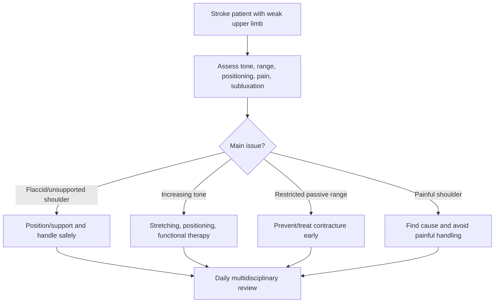
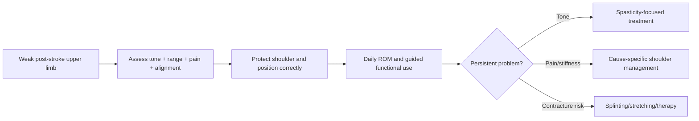

# Spasticity, contracture, and shoulder pain prevention

Related: [[../Stroke Medicine MOC|Stroke Medicine MOC]] · [[../Recovery, Rehabilitation, and Prognosis|Recovery, Rehabilitation, and Prognosis]] · [[Rehabilitation fundamentals|Rehabilitation fundamentals]] · [[Stroke unit rehabilitation principles]] · [[Early mobilization and multidisciplinary recovery planning]]

> [!important]
> After stroke, **abnormal tone, poor positioning, immobility, weakness, and improper handling of the hemiplegic limb** can lead to spasticity, contracture, and painful shoulder complications. The high-yield principle is: **prevention starts early with positioning, handling, range-of-motion care, and functional rehabilitation**.

## Learning Objectives
- Define spasticity, contracture, and post-stroke shoulder pain.
- Explain why hemiplegic limbs are vulnerable after stroke.
- Recognize risk factors and early warning signs.
- Outline preventive nursing, physiotherapy, and occupational-therapy measures.
- Summarize management options when prevention is insufficient.

## Definition
- **Spasticity** is a velocity-dependent increase in muscle tone due to upper motor neuron dysfunction.
- **Contracture** is fixed shortening of muscle, tendon, or periarticular tissue leading to loss of passive range of motion.
- **Post-stroke shoulder pain** refers to painful shoulder dysfunction after stroke, often related to subluxation, immobility, spasticity, soft-tissue injury, adhesive capsulitis, or poor handling.

## Core Anatomy
- Commonly affected upper-limb muscles include:
  - shoulder adductors/internal rotators
  - elbow flexors
  - wrist/finger flexors
- The weak hemiplegic shoulder is vulnerable because the glenohumeral joint depends heavily on **muscle support** for alignment.
- Loss of rotator-cuff and scapular stabilizer function may lead to **inferior subluxation**.
- Abnormal scapulohumeral rhythm and soft-tissue stiffness contribute to pain and restricted movement.

## Core Physiology
- Stroke damages descending inhibitory pathways, allowing exaggerated stretch reflexes and increased tone.
- Immobility promotes soft-tissue shortening and reduced joint range.
- Poor alignment and traction on a flaccid shoulder can cause pain and subluxation.
- Repetitive painful movement above safe range may trigger inflammation and further guarding.
- Neuroplastic recovery is helped by correct positioning and functional use; neglected limbs worsen.

## Normal Values / Important Cut-offs
- Any **painful or stiff shoulder** after stroke deserves prompt assessment; do not treat it as inevitable.
- Full passive range should be preserved as far as safely possible early in recovery.
- Sudden worsening tone, fixed posture, or reduced hygiene ability suggests clinically important spasticity/contracture progression.
- Handling the weak shoulder by pulling the arm is unsafe.

## Classification
### Spasticity patterns
- Mild dynamic increased tone
- Moderate function-limiting spasticity
- Severe fixed abnormal posture

### Contracture pattern
- Early reversible stiffness
- Established soft-tissue shortening
- Fixed deformity

### Shoulder pain mechanisms
- Flaccid subluxation
- Spastic painful shoulder
- Adhesive capsulitis / frozen shoulder
- Rotator cuff / soft tissue strain
- Complex regional pain syndrome in selected cases

## Etiology / Causes
- Upper motor neuron syndrome after stroke
- Prolonged immobility
- Poor limb positioning
- Inadequate range-of-motion exercises
- Pulling/lifting by the weak arm
- Neglect and nonuse
- Severe weakness with subluxation
- Spastic flexor pattern development

## Risk Factors
| Risk factor | Why it matters |
|---|---|
| Severe hemiplegia | Less protective movement |
| Delayed rehabilitation | More stiffness and nonuse |
| Poor positioning/handling | Shoulder injury and contracture risk |
| Sensory loss/neglect | Less protective feedback |
| Prolonged bed rest | Soft tissue shortening |
| Severe spasticity | Progressive fixed posture |
| Inadequate caregiver education | Recurrent preventable mishandling |

## Pathophysiology
Early after stroke, the limb may be flaccid and poorly supported, predisposing to traction injury and subluxation. Later, as upper motor neuron signs emerge, tone increases in characteristic flexor/adductor patterns, especially in the upper limb. Without proper stretching, positioning, functional use, and splinting/therapy when indicated, spasticity becomes persistent and soft tissues shorten, producing contracture. Pain then further limits movement, creating a vicious cycle of immobility, tone increase, and disability.

## Clinical Features
### Spasticity clues
- Increased tone with passive movement
- Flexed elbow/wrist/fingers
- Adducted/internally rotated shoulder
- Difficulty with dressing, hygiene, and passive care

### Contracture clues
- Reduced passive range of motion
- Fixed posture not easily corrected
- Hygiene difficulty in hand/axilla
- Pain on attempted stretching

### Shoulder pain clues
- Pain on movement or handling
- Drooping/subluxed shoulder in flaccid stage
- Limited abduction/external rotation
- Tenderness or guarding
- Refusal to participate in upper-limb activity

## Approach / Algorithm

## Investigations / Assessment Frameworks
### Primarily clinical assessment
- Tone assessment during passive movement
- Passive and active range-of-motion examination
- Observation for shoulder subluxation and scapular posture
- Pain assessment at rest and during movement
- Functional impact on dressing, hygiene, transfers, and therapy participation

### When selected tests may help
- X-ray/ultrasound if traumatic injury or significant subluxation is suspected
- Assessment for CRPS when pain is disproportionate with swelling, temperature/color change

## Interpretation Frameworks
### Practical bedside framework
1. **Is the limb flaccid or spastic?**
2. **Is passive range still preserved?**
3. **Is the shoulder painful because of subluxation, stiffness, spasticity, or mishandling?**
4. **Can the patient/caregiver position the limb safely?**
5. **What preventive step is needed today?** support, stretch, splint, pain control, education.

### Distinguishing major patterns
| Pattern | Key clue |
|---|---|
| Flaccid subluxed shoulder | Low tone, visible shoulder droop, pain with unsupported arm |
| Spastic upper limb | Flexor/adductor posture, increased resistance to passive movement |
| Established contracture | Reduced passive range, fixed stiffness |
| Adhesive/stiff painful shoulder | Painful restricted range, often with delayed movement |

## Diagnosis
This is a **rehabilitation complication-prevention topic**. The practical diagnosis is identifying early or established post-stroke upper-limb complications such as:
- evolving upper-limb spasticity
- elbow/wrist/hand contracture risk
- hemiplegic shoulder pain
- shoulder subluxation

## Differential Diagnosis
- Musculoskeletal injury unrelated to stroke
- Rotator cuff tear
- Cervical radiculopathy or pre-existing shoulder disease
- Complex regional pain syndrome
- Septic arthritis/cellulitis in rare concerning cases
- Central post-stroke pain (less mechanical pattern)

## Tables / Comparison Charts
### Prevention vs late problem pattern
| Stage | Main opportunity |
|---|---|
| Flaccid early stage | Support and protect shoulder |
| Emerging tone stage | Stretch, position, and guide function |
| Early stiffness stage | Maintain passive range and splint/therapy if needed |
| Fixed contracture stage | Limit disability, pain, hygiene difficulty |

### Common prevention measures
| Measure | Why it helps |
|---|---|
| Good positioning | Maintains alignment and reduces traction |
| Avoid pulling arm | Prevents shoulder injury |
| Daily range-of-motion work | Prevents stiffness |
| Support during transfers | Protects flaccid shoulder |
| Functional use as able | Reduces learned nonuse |
| Caregiver education | Prevents repeated mishandling |

## Management
### Prevention principles
- Start from the first days after stroke.
- Position the arm and shoulder properly in bed and chair.
- Avoid traction on the arm during transfers.
- Preserve passive range of motion.
- Use early functional movement and task practice when possible.
- Teach all staff and caregivers correct handling.

### Specific strategies
#### 1. Positioning
- Support the hemiplegic arm on pillows/arm troughs.
- Keep scapula and shoulder aligned.
- Avoid hanging unsupported arm.

#### 2. Handling and transfers
- Never pull the patient up by the weak arm.
- Support trunk and shoulder girdle during transfers.
- Use proper slings/support devices only when appropriate and not as a substitute for therapy.

#### 3. Range of motion and stretching
- Gentle regular passive and active-assisted movements.
- Respect pain and scapular movement.
- Avoid forceful abduction of a poorly aligned shoulder.

#### 4. Tone and contracture management
- Positioning and stretching
- Splinting in selected cases
- Functional practice and therapist-guided exercises
- Oral antispastic medication in selected patients
- Botulinum toxin for focal problematic spasticity in appropriate settings

#### 5. Shoulder pain management
- Identify cause: subluxation, stiffness, spasticity, soft-tissue injury, CRPS.
- Correct positioning and handling.
- Analgesia as needed.
- Gentle mobilization within safe range.

## Drug Interactions / Contraindications / Comorbidity Cautions
- Antispastic agents may cause drowsiness or worsen generalized weakness.
- Pain control helps participation but over-sedation reduces therapy quality.
- Forceful stretching of a painful shoulder can worsen injury.
- Sling use should be individualized; excessive use may encourage nonuse in some patients.

## Procedures / Indications / Contraindications
- **Positioning programs:** indicated in virtually all weak upper-limb stroke patients.
- **Passive/assisted ROM:** indicated to preserve range when active movement is limited.
- **Splinting:** considered when contracture risk is high or posture is problematic.
- **Botulinum toxin:** considered for focal spasticity causing pain, hygiene difficulty, or functional obstruction.

## Procedure Mini-Sections
### Hemiplegic shoulder protection during transfer
- **Indication:** flaccid or weak upper limb.
- **Goal:** avoid traction injury and subluxation.
- **Pearl:** the easiest way to prevent shoulder pain is to never pull on the arm.

### Daily range-of-motion routine
- **Indication:** reduced active use of limb.
- **Goal:** preserve passive range and delay contracture.
- **Pearl:** slow, aligned, scapula-aware movement is better than forceful hurried stretching.

### Focal spasticity intervention
- **Indication:** painful or function-limiting focal tone pattern.
- **Goal:** improve care, comfort, hygiene, and selected function.
- **Pearl:** injections work best when combined with therapy and positioning, not in isolation.

## Complications
- Fixed contracture
- Severe hygiene difficulty
- Pain limiting rehabilitation
- Shoulder subluxation or soft-tissue injury
- Learned nonuse of the limb
- Reduced ADL independence
- Caregiver burden

## Red Flags / Emergencies
- Sudden severe shoulder pain after mishandling/transfer
- Warm swollen extremely painful limb suggesting CRPS or other pathology
- Rapidly progressive fixed deformity
- Severe pain preventing all therapy participation
- Suspected fracture/dislocation after fall or traction injury

## Prognosis
- Prevention works far better than late treatment.
- Mild spasticity may be manageable with therapy and positioning, but established contracture is difficult to reverse fully.
- Early recognition and shoulder protection improve comfort, function, hygiene, and participation in rehab.

## Topic Correlation
- [[Stroke unit rehabilitation principles]]
- [[Early mobilization and multidisciplinary recovery planning]]
- [[Persistent dysphagia and nutrition planning]]
- [[../Stroke Unit Care and Complications/Aspiration pneumonia after stroke|Aspiration pneumonia after stroke]]

## Special Situations
- **Neglect/sensory loss:** patient may not protect the limb, increasing injury risk.
- **Severe aphasia/cognitive impairment:** caregiver teaching becomes even more important.
- **Very severe hemiplegia:** prevention goals may dominate over functional goals initially.
- **Painful spastic hand:** hygiene and nail care become practical exam/ward issues.

## FCPS/MRCP High-Yield Points
- Post-stroke upper-limb complications are often **preventable**.
- Never pull on the weak arm during transfer.
- Early positioning and ROM exercises reduce spasticity-related disability and contracture.
- The flaccid shoulder is prone to subluxation and pain.
- Botulinum toxin is a selected option for focal problematic spasticity.

## Common Viva Questions
- What is spasticity after stroke?
- How do you prevent hemiplegic shoulder pain?
- Why is the flaccid shoulder vulnerable to subluxation?
- What causes contracture after stroke?
- What are the indications for focal spasticity treatment?

## Common Confusions / Exam Traps
- Pulling the patient by the weak arm during transfer.
- Confusing all shoulder pain with spasticity alone.
- Ignoring passive range-of-motion loss until fixed contracture appears.
- Forceful stretching of a poorly aligned painful shoulder.
- Using medications without correcting positioning and handling.

## Mnemonics
- **PROTECT THE HEMIPLEGIC ARM**
  - **P**osition well
  - **R**ange of motion daily
  - **O**bserve tone
  - **T**ransfer safely
  - **E**ducate caregivers
  - **C**ontracture prevention
  - **T**reat pain early
- **No pull, no pain** = never pull the weak arm.

## Mind Map
- Post-stroke upper-limb prevention
  - problems
    - spasticity
    - contracture
    - shoulder pain
    - subluxation
  - causes
    - UMN syndrome
    - immobility
    - poor positioning
    - mishandling
  - prevention
    - support arm
    - safe transfer
    - ROM
    - therapy
    - caregiver training
  - treatment
    - analgesia
    - splinting
    - antispastic therapy
    - botulinum in selected cases

## Flowchart

## Suggested Visuals / Image Notes
- Diagram of safe hemiplegic arm positioning in bed and chair.
- Illustration of flaccid shoulder subluxation.
- Comparison table: spasticity vs contracture vs shoulder pain mechanisms.
- Transfer-handling infographic showing “do not pull the arm.”

## Suggested Video References
- Hemiplegic shoulder handling and positioning tutorial.
- Passive range-of-motion demonstration after stroke.
- Spasticity assessment and focal management teaching session.

## One-Page Revision Summary
### Spasticity, contracture, and shoulder pain prevention in one page
- **Problems:** abnormal tone, stiffness, fixed posture, hemiplegic shoulder pain.
- **Why happens:** UMN syndrome + immobility + poor handling + nonuse.
- **Main prevention:** correct positioning, support the arm, safe transfers, daily ROM, early rehab, caregiver education.
- **Big exam pearl:** **never pull the weak arm**.
- **Shoulder pain causes:** subluxation, stiffness, spasticity, soft-tissue injury, CRPS.
- **Selected treatment:** therapy, splinting, analgesia, antispastic measures, botulinum toxin when appropriate.

## 24-Hour Recall Prompts
- Define spasticity and contracture.
- Why is the flaccid shoulder vulnerable after stroke?
- List 4 preventive steps for hemiplegic shoulder pain.
- What causes contracture progression?
- When may botulinum toxin be useful?

## 7-Day / 15-Day / 30-Day Revision Tracker
- **Day 7:** recall the prevention steps for upper-limb complications.
- **Day 15:** compare flaccid shoulder pain with spastic painful shoulder.
- **Day 30:** give a 2-minute viva answer on prevention of post-stroke contracture.

## Must Know / Should Know / Nice to Know
### Must Know
- early positioning and ROM matter
- never pull on the weak arm
- flaccid shoulder can sublux
- spasticity can lead to contracture and pain
- caregiver/staff education is essential

### Should Know
- distinction between dynamic spasticity and fixed contracture
- selected role of splints and botulinum toxin
- CRPS as a painful complication differential

### Nice to Know
- detailed tone scales and advanced focal intervention pathways

## My Weak Points
- Do I remember shoulder protection from day 1?
- Can I separate spasticity from fixed contracture clinically?
- Do I think of positioning before medication?

## Self-Test Scorecard
- Prevention recall /10
- Shoulder-protection logic /10
- Complication recognition /10
- Treatment nuance /10
- Viva confidence /10

## Exam Answer Modes
### Short note skeleton
- Definitions
- Why these problems occur after stroke
- Preventive strategies
- Shoulder protection
- Treatment of established complications

### Viva answer skeleton
- Stroke can produce flaccidity early and spasticity later, predisposing to pain and contracture.
- The hemiplegic shoulder is vulnerable because muscular support is lost.
- Prevention relies on positioning, safe transfers, range-of-motion care, and early rehabilitation.
- Never pull on the weak arm.
- Established focal spasticity may need splints, medication, or botulinum toxin in selected cases.

## Summary
Spasticity, contracture, and shoulder pain are common but often preventable post-stroke complications that significantly reduce comfort, hygiene, and functional recovery. The key to prevention is early protection of the weak limb, regular range-of-motion care, good positioning, safe transfer technique, and coordinated multidisciplinary rehabilitation. In practice and in exams, the most important message is simple: **protect the arm early, maintain range, and do not pull on the hemiplegic shoulder**.

## MCQs (10)
1. Spasticity is best defined as:
   - A. Complete loss of all muscle tone
   - B. Velocity-dependent increase in tone after UMN lesion
   - C. Fixed joint fusion
   - D. Peripheral neuropathy only
   - E. Pure muscle atrophy

2. A major cause of post-stroke contracture is:
   - A. Good positioning and regular ROM
   - B. Prolonged immobility and untreated increased tone
   - C. Normal daily activity
   - D. Adequate caregiver training
   - E. Early functional use

3. The flaccid hemiplegic shoulder is vulnerable because:
   - A. It always has increased muscle support
   - B. The glenohumeral joint depends partly on muscular support for alignment
   - C. Stroke protects it from trauma
   - D. Subluxation never occurs after stroke
   - E. Pain proves there is no weakness

4. Which action should be avoided during transfer?
   - A. Supporting trunk and limb
   - B. Pulling on the weak arm
   - C. Using proper assistance
   - D. Educating caregivers
   - E. Protecting the shoulder

5. Which is a common cause of post-stroke shoulder pain?
   - A. Subluxation and poor handling
   - B. Hyperthyroidism only
   - C. Cataract
   - D. Otitis media
   - E. Asthma

6. Which preventive step is most universally appropriate?
   - A. Forceful stretching beyond pain
   - B. Daily safe range-of-motion work and positioning
   - C. No handling of the arm at all
   - D. Long-term sling use for everyone
   - E. Bed rest until 6 months

7. A fixed reduction in passive range of motion suggests:
   - A. Contracture formation
   - B. Pure sensory neglect only
   - C. Migraine aura
   - D. TIA
   - E. Pure aphasia

8. Which statement is most correct?
   - A. Shoulder pain after stroke is always due to spasticity alone
   - B. Caregiver education has little value
   - C. Prevention is more effective than late treatment of contracture
   - D. The weak arm should be used as a pulling handle during transfers
   - E. Positioning is irrelevant if medication is given

9. Botulinum toxin is most relevant in:
   - A. Selected focal problematic spasticity
   - B. Universal treatment for all stroke patients
   - C. Acute subarachnoid hemorrhage only
   - D. Bedside hypoglycemia treatment
   - E. Aspiration pneumonia treatment

10. The best exam pearl is:
   - A. Hemiplegic shoulder pain is inevitable and unpreventable
   - B. Never pull on the weak arm
   - C. Contracture reverses fully in all cases
   - D. Positioning is unimportant
   - E. ROM is contraindicated in all stroke patients

## SBA Questions (10)
1. A 69-year-old woman with dense left hemiplegia is transferred by a relative who lifts her by the weak arm. What complication is this most likely to worsen?
   - A. Hemiplegic shoulder pain/subluxation
   - B. Cataract
   - C. Hearing loss
   - D. Peptic ulcer disease
   - E. Psoriasis

2. A stroke patient develops increasing elbow and wrist flexor posture with resistance to passive movement. What is the most likely process?
   - A. Spasticity
   - B. Bell palsy
   - C. Ménière disease
   - D. Migraine aura
   - E. Essential tremor

3. A patient’s affected hand becomes difficult to open for washing and nail care because of fixed flexion. What has most likely developed?
   - A. Contracture
   - B. Aphasia
   - C. Dysphagia
   - D. TIA
   - E. Diplopia

4. What is the most appropriate early universal preventive measure for the weak upper limb after stroke?
   - A. Correct positioning and regular ROM
   - B. Ignore the arm until walking returns
   - C. Pull on the arm during transfer practice
   - D. Use only analgesics without therapy
   - E. Keep the limb unsupported at all times

5. A patient has severe shoulder pain and visible droop of the affected shoulder in the flaccid phase. What is the most likely mechanism?
   - A. Shoulder subluxation due to loss of support
   - B. Lacunar syndrome
   - C. Vestibular neuritis
   - D. Cluster headache
   - E. Optic neuritis

6. Which team approach best prevents upper-limb stroke complications?
   - A. Only physician review once monthly
   - B. Coordinated nursing, physio, OT, and caregiver handling plan
   - C. No therapist involvement
   - D. Transfer by any method as long as it is fast
   - E. Sedation to reduce all movement

7. A patient has focal painful finger flexor spasticity causing hygiene difficulty despite therapy. Which selected option may help?
   - A. Botulinum toxin
   - B. Antibiotics only
   - C. Bronchodilator inhaler
   - D. Dialysis
   - E. Ear irrigation

8. Which statement best describes contracture prevention?
   - A. It depends only on later surgery
   - B. It starts early with positioning, ROM, and functional use
   - C. It is unrelated to tone or immobility
   - D. It never affects hygiene
   - E. It requires no caregiver teaching

9. A patient has pain out of proportion, swelling, and temperature/color change in the limb. What important differential should be considered?
   - A. Complex regional pain syndrome
   - B. Cataract
   - C. Hyperthyroidism
   - D. Otitis externa
   - E. IBS

10. What is the core summary principle for this topic?
   - A. Prevention begins early and careful handling matters
   - B. Ignore mild stiffness because it never progresses
   - C. The weak arm should be used for leverage during transfers
   - D. Pain is always psychogenic after stroke
   - E. Therapy has no role once tone appears

## Flashcards
- Q: Define spasticity.
  A: Velocity-dependent increase in tone due to UMN dysfunction.
- Q: Define contracture.
  A: Fixed soft-tissue shortening with reduced passive range of motion.
- Q: Why is the hemiplegic shoulder vulnerable?
  A: Loss of muscular support predisposes to subluxation and injury.
- Q: What is the single best transfer rule for the weak arm?
  A: Never pull on it.
- Q: Name 4 preventive measures for upper-limb complications.
  A: Good positioning, arm support, safe transfers, daily ROM, early rehab, caregiver education.
- Q: What is one cause of post-stroke shoulder pain?
  A: Subluxation, stiffness, spasticity, soft-tissue injury, or CRPS.
- Q: When is botulinum toxin useful?
  A: Selected focal spasticity causing pain, hygiene problems, or functional obstruction.
- Q: Which stage is easier to manage: prevention or fixed contracture?
  A: Prevention.
- Q: What bedside sign suggests contracture rather than dynamic spasticity?
  A: Loss of passive range of motion.
- Q: What is the key memory phrase?
  A: Protect the arm early.

## Answer Key with Explanations
### MCQs
1. **B. Velocity-dependent increase in tone after UMN lesion** — correct definition of spasticity.
2. **B. Prolonged immobility and untreated increased tone** — major mechanism of contracture.
3. **B. The glenohumeral joint depends partly on muscular support for alignment** — explains vulnerability.
4. **B. Pulling on the weak arm** — classic avoidable mistake.
5. **A. Subluxation and poor handling** — common contributors to post-stroke shoulder pain.
6. **B. Daily safe range-of-motion work and positioning** — core preventive step.
7. **A. Contracture formation** — fixed loss of passive ROM suggests contracture.
8. **C. Prevention is more effective than late treatment of contracture** — key principle.
9. **A. Selected focal problematic spasticity** — correct indication for botulinum toxin.
10. **B. Never pull on the weak arm** — high-yield practical pearl.

### SBAs
1. **A. Hemiplegic shoulder pain/subluxation** — traction on the weak arm can worsen this immediately.
2. **A. Spasticity** — typical flexor posture with increased tone.
3. **A. Contracture** — fixed posture interfering with hygiene is classic.
4. **A. Correct positioning and regular ROM** — universal early preventive care.
5. **A. Shoulder subluxation due to loss of support** — most likely in the flaccid phase.
6. **B. Coordinated nursing, physio, OT, and caregiver handling plan** — best preventive model.
7. **A. Botulinum toxin** — selected option for focal problematic spasticity.
8. **B. It starts early with positioning, ROM, and functional use** — best summary.
9. **A. Complex regional pain syndrome** — should be considered in disproportionate painful swollen limb.
10. **A. Prevention begins early and careful handling matters** — core take-home message.
