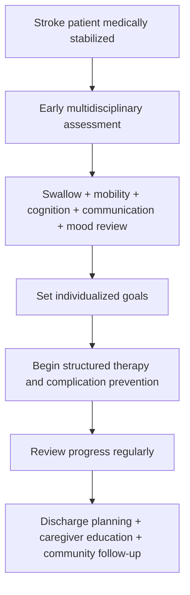
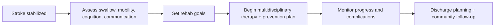

# Stroke unit rehabilitation principles

Related: [[../Stroke Medicine MOC|Stroke Medicine MOC]] · [[../Recovery, Rehabilitation, and Prognosis|Recovery, Rehabilitation, and Prognosis]] · [[Rehabilitation fundamentals|Rehabilitation fundamentals]] · [[Early mobilization and multidisciplinary recovery planning]] · [[../Stroke Unit Care and Complications/Dysphagia screening and aspiration risk|Dysphagia screening and aspiration risk]]

> [!important]
> **Stroke rehabilitation starts early and should be organized, multidisciplinary, and goal-directed.** The exam pearl is that **stroke-unit care improves outcome not only because of acute medical monitoring, but because it integrates early rehabilitation, complication prevention, swallowing assessment, communication support, mobility planning, and discharge preparation**.

## Learning Objectives
- Define stroke-unit rehabilitation and explain why specialized organized care improves outcomes.
- List the core disciplines and principles of multidisciplinary rehabilitation.
- Recognize key functional domains assessed after stroke.
- Outline how early rehabilitation reduces complications and disability.
- Summarize common exam points on swallowing, mobility, spasticity prevention, mood, and discharge planning.

## Definition
**Stroke unit rehabilitation principles** refer to the coordinated, multidisciplinary process of restoring function, preventing complications, and maximizing independence after stroke within a structured stroke-service environment. Rehabilitation begins **early**, continues through inpatient recovery, and extends into community reintegration and secondary prevention.

## Core Anatomy
- Stroke-related disability depends on lesion location and extent.
- Functional deficits reflect involvement of:
  - motor cortex/corticospinal tracts → weakness, spasticity, gait impairment
  - language cortex/networks → aphasia
  - parietal association areas → neglect
  - brainstem/cerebellum → balance, swallowing, coordination problems
  - frontal-subcortical circuits → executive dysfunction, apathy
- Rehabilitation planning must therefore be **deficit-specific**, not generic.

## Core Physiology
- Neural recovery depends on resolution of edema, reperfusion of penumbral tissue, synaptic reorganization, and neuroplastic adaptation.
- Repetition, task-specific practice, and environment-driven stimulation help functional reorganization.
- Immobility worsens outcomes via deconditioning, DVT, pressure injury, aspiration risk, contracture, and pneumonia.
- Stroke-unit rehabilitation works physiologically by combining medical stabilization with safe early activation and prevention of secondary injury.

## Normal Values / Important Cut-offs
- Rehabilitation should begin **as soon as the patient is medically and neurologically stable**.
- **Swallowing assessment** is an early priority before unsafe oral intake.
- Functional assessment should cover mobility, language, cognition, mood, continence, feeding, and social support.
- Rehabilitation goals should be **specific and realistic**, adjusted to premorbid function and stroke severity.
- Severe disability does **not** mean rehabilitation is futile; it changes the goals toward safety, prevention, and caregiver support.

## Classification
### By phase of recovery
- Hyperacute/acute rehabilitation
- Early inpatient rehabilitation
- Subacute rehabilitation
- Community / long-term rehabilitation

### By functional domain
- Motor rehabilitation
- Speech/language rehabilitation
- Swallowing rehabilitation
- Cognitive/behavioral rehabilitation
- Psychosocial/vocational rehabilitation

### By rehabilitation goal
- Impairment reduction
- Activity improvement
- Participation and reintegration
- Complication prevention
- Caregiver training and discharge planning

## Etiology / Causes of Rehabilitation Need
Rehabilitation is required because stroke may cause:
- hemiparesis or hemiplegia
- aphasia/dysarthria
- dysphagia
- neglect or cognitive impairment
- gait/balance disorder
- spasticity and contracture risk
- mood change and loss of independence

## Risk Factors for Poor Functional Recovery
| Risk factor | Why it matters |
|---|---|
| Large stroke severity | Greater baseline disability |
| Delayed rehabilitation | More deconditioning and complications |
| Dysphagia / aspiration | Nutritional and pulmonary complications |
| Severe cognitive impairment / neglect | Limits participation |
| Depression / apathy | Reduces engagement |
| Frailty / multimorbidity | Slower recovery |
| Poor caregiver or social support | Discharge difficulty and long-term dependence |

## Pathophysiology
Functional loss after stroke is caused by direct tissue injury plus secondary complications of immobility, malnutrition, aspiration, depression, and disuse. Rehabilitation aims to reduce these secondary harms while promoting neuroplastic adaptation and task relearning. Stroke units improve prognosis because they integrate **medical surveillance**, **multidisciplinary therapy**, **goal-setting**, and **complication prevention** rather than treating rehabilitation as an afterthought after acute stabilization.

## Clinical Features / Rehabilitation Needs Assessment
### Common deficits to identify
- Limb weakness
- Balance and gait disorder
- Speech/language impairment
- Dysphagia
- Cognitive slowing, neglect, inattention
- Mood disturbance
- Bladder/bowel dysfunction
- Shoulder pain, spasticity, contracture risk

### Practical bedside rehabilitation questions
- Can the patient sit, stand, transfer, or walk safely?
- Can the patient swallow safely?
- Is communication impaired?
- Is there neglect or cognitive impairment?
- What level of assistance is needed for feeding, dressing, toileting, and mobility?
- What is the likely discharge destination and support need?

## Approach / Algorithm

## Investigations / Assessment Frameworks
### Functional assessments
- NIHSS in acute phase for severity context
- Mobility and transfer assessment
- Swallow screening and formal speech/swallow review if abnormal
- ADL assessment (feeding, dressing, toileting, bathing)
- Communication/language evaluation
- Cognitive and neglect screening
- Mood screening

### Medical reviews that affect rehabilitation
- Nutritional status
- Bowel/bladder function
- Pain assessment, especially shoulder pain
- Pressure area risk
- Spasticity/contracture risk
- Secondary prevention plan and comorbidity optimization

## Interpretation Frameworks
### Stroke-unit rehabilitation thinking model
1. **Is the patient medically stable enough to engage?**
2. **Which domains are impaired?** motor, speech, swallow, cognition, mood, continence.
3. **What complications can be prevented now?** aspiration, DVT, pressure sores, contracture, deconditioning.
4. **What short-term goals are realistic?** safe feeding, sitting balance, transfer, communication, toileting.
5. **What long-term pathway is needed?** home rehab, inpatient rehab, skilled nursing, caregiver support.

### Why stroke units work
| Component | Benefit |
|---|---|
| Organized multidisciplinary care | Better coordination and fewer omissions |
| Early swallowing assessment | Less aspiration and pneumonia |
| Early mobility planning | Less DVT, deconditioning, pressure injury |
| Repeated goal review | Better functional targeting |
| Discharge planning | Safer transition and less preventable relapse |

## Diagnosis
This is not a disease-diagnosis note but a **management/rehabilitation framework**. The practical “diagnosis” is identifying specific post-stroke disabilities and rehabilitation priorities, such as:
- hemiparetic stroke requiring mobility rehab
- aphasic stroke requiring communication therapy
- dysphagic stroke requiring swallow support
- severe dependent stroke requiring full multidisciplinary inpatient planning

## Differential Diagnosis / Causes of Poor Participation
- Ongoing unstable stroke or deteriorating neurology
- Delirium or sepsis
- Hypoxia / metabolic disturbance
- Severe depression or apathy
- Uncontrolled pain
- Sedative drug effect
- Nonconvulsive seizure in selected cases

## Tables / Comparison Charts
### Organized stroke-unit rehab vs unstructured general care
| Feature | Organized stroke-unit rehab | Unstructured care |
|---|---|---|
| Team input | Coordinated multidisciplinary | Fragmented |
| Swallow review | Early routine | Often delayed |
| Mobilization plan | Structured | Inconsistent |
| Goal setting | Regular | Often absent |
| Discharge planning | Integrated | Reactive |
| Outcome | Better survival/function | Worse outcomes |

### Core stroke rehab team roles
| Discipline | Main role |
|---|---|
| Physician/stroke team | medical stability, prognosis, prevention |
| Nurse | observation, positioning, feeding safety, continence, education |
| Physiotherapist | mobility, balance, transfers, gait |
| Occupational therapist | ADLs, upper limb, home function, equipment |
| Speech and language therapist | aphasia, dysarthria, swallowing |
| Dietitian | nutrition optimization |
| Psychologist/psychiatry | cognition, mood, adjustment |
| Social worker/case manager | discharge support and family planning |

## Management
### Core principles
- Start rehabilitation early once medically safe.
- Use a **multidisciplinary stroke-unit model**.
- Match therapy to specific deficits.
- Prevent complications aggressively.
- Reassess goals repeatedly.

### Major rehabilitation domains
#### 1. Mobility and transfers
- Bed mobility, sitting balance, transfer practice, gait training
- Falls prevention and safe supervision level
- Assistive devices when needed

#### 2. Swallow and nutrition
- Early swallow screen
- Nil by mouth if unsafe until assessed
- Texture modification / tube feeding when required
- Aspiration prevention and hydration/nutrition support

#### 3. Communication and cognition
- Assess aphasia, dysarthria, neglect, executive dysfunction
- Use communication aids and caregiver training
- Simplify instructions and environment

#### 4. Upper limb and positioning
- Protect weak shoulder
- Prevent contracture and pain
- Encourage safe range-of-motion and supported positioning

#### 5. Mood, motivation, and family engagement
- Screen for post-stroke depression and emotional lability
- Set achievable goals
- Educate family/caregivers early

#### 6. Discharge and reintegration
- Plan discharge from the start
- Arrange follow-up therapy, equipment, home modifications, and secondary prevention review

## Drug Interactions / Contraindications / Comorbidity Cautions
- Over-sedation reduces rehabilitation participation.
- Severe orthostatic instability, ongoing cardiac ischemia, or unstable BP may temporarily limit mobilization intensity.
- Dysphagic patients need medication-route review to avoid aspiration.
- Spasticity drugs may help selected patients but can worsen weakness or drowsiness.
- Depression treatment may improve participation but should be individualized.

## Procedures / Indications / Contraindications
- **Swallow screening:** indicated early in all stroke patients before unsupervised oral intake.
- **Formal therapist assessments:** indicated when any functional domain is impaired.
- **Enteral feeding support:** indicated if nutrition or swallowing is unsafe.
- **Positioning / splinting / support devices:** indicated when weakness, shoulder subluxation, or contracture risk exists.

## Procedure Mini-Sections
### Early swallowing assessment
- **Indication:** all new stroke patients before oral intake when safe practice demands it.
- **Goal:** prevent aspiration and guide nutrition plan.
- **Pearl:** pneumonia prevention starts at the bedside, not after a chest infection appears.

### Goal-setting meeting
- **Indication:** once key deficits are identified.
- **Goal:** set realistic short-term and long-term rehabilitation targets.
- **Pearl:** good rehabilitation is specific, not vague encouragement.

### Positioning and pressure-area care
- **Indication:** weak, immobile, or dependent patients.
- **Goal:** prevent pressure injury, pain, and contracture.
- **Pearl:** nursing rehabilitation is as important as formal therapy time.

## Complications
- Aspiration pneumonia
- Malnutrition/dehydration
- DVT and PE
- Pressure sores
- Shoulder pain and subluxation
- Spasticity and contracture
- Depression and social isolation
- Falls and recurrent hospital admission

## Red Flags / Emergencies
- Unsafe swallow with aspiration risk
- New neurological deterioration during rehab
- Severe immobility with DVT/PE risk
- Marked depression/suicidal risk
- Recurrent seizures or unexplained reduced consciousness
- Uncontrolled pain or severe shoulder injury limiting therapy

## Prognosis
- Early, organized stroke-unit rehabilitation improves survival, independence, and discharge home rates.
- Prognosis depends on stroke severity, cognition, mood, comorbidity, family support, and complication burden.
- Even when full recovery is impossible, rehabilitation can still improve safety, dignity, and caregiver burden.

## Topic Correlation
- [[Early mobilization and multidisciplinary recovery planning]]
- [[Spasticity, contracture, and shoulder pain prevention]]
- [[Persistent dysphagia and nutrition planning]]
- [[../Stroke Unit Care and Complications/Aspiration pneumonia after stroke|Aspiration pneumonia after stroke]]

## Special Situations
- **Elderly frail patient:** focus on safe transfer, swallow, pressure care, and caregiver planning.
- **Severe aphasia:** communication support is essential for meaningful participation.
- **Neglect/cognitive impairment:** recovery is limited unless the environment and instructions are adapted.
- **Severe dependency:** rehabilitation still matters for positioning, prevention, continence, and family education.

## FCPS/MRCP High-Yield Points
- Stroke units improve outcomes because they combine **organized multidisciplinary care** with medical oversight.
- Rehabilitation starts **early**, not only after discharge.
- Swallowing, mobility, language, cognition, mood, and ADLs should all be assessed.
- Prevention of aspiration, DVT, pressure sores, and contracture is a core rehabilitation function.
- Discharge planning begins early and includes caregivers and community support.

## Common Viva Questions
- Why do stroke units improve outcome compared with general wards?
- What are the components of early stroke rehabilitation?
- Why is swallowing assessment important before oral intake?
- Which professionals form the core stroke rehabilitation team?
- What complications does early rehabilitation aim to prevent?

## Common Confusions / Exam Traps
- Thinking rehabilitation begins only after acute care ends.
- Reducing rehabilitation to physiotherapy alone.
- Ignoring mood, cognition, communication, or swallowing.
- Assuming severe disability means no rehabilitation benefit.
- Forgetting discharge planning and caregiver teaching.

## Mnemonics
- **STROKE UNIT = SAFE RECOVERY**
  - **S**wallow
  - **A**DLs
  - **F**alls prevention
  - **E**arly mobilization
  - **R**ehab team
  - **E**motional support
  - **C**ognition/communication
  - **O**ngoing goals
  - **V**TE prevention
  - **E**quipment/home planning
  - **R**ecurrence prevention
  - **Y**ielded function
- **Rehab is not one therapist; it is a system.**

## Mind Map
- Stroke unit rehabilitation
  - principles
    - early
    - multidisciplinary
    - goal-directed
    - complication prevention
  - domains
    - mobility
    - swallow
    - speech/language
    - cognition
    - mood
    - ADLs
  - team
    - nurses
    - physio
    - OT
    - SLT
    - dietitian
    - physician
    - social support
  - outcomes
    - independence
    - safer discharge
    - fewer complications

## Flowchart

## Suggested Visuals / Image Notes
- Diagram of the multidisciplinary stroke-unit team.
- Rehab timeline from acute stroke to community reintegration.
- Table of core functional domains assessed after stroke.
- Nursing/therapy positioning diagram for hemiplegic patient.

## Suggested Video References
- Stroke-unit rehabilitation overview lecture.
- Dysphagia screening and stroke swallowing care teaching video.
- Multidisciplinary stroke rehab case-based session.

## One-Page Revision Summary
### Stroke unit rehabilitation principles in one page
- **Core idea:** begin organized, multidisciplinary rehabilitation early once the patient is medically stable.
- **Why stroke units work:** integrated medical care + therapy + prevention of complications.
- **Assess:** swallow, mobility, ADLs, communication, cognition, mood, continence, social support.
- **Prevent:** aspiration, DVT, pressure sores, falls, contracture, malnutrition, depression.
- **Team:** physician, nurse, physio, OT, speech therapist, dietitian, psychology/social support.
- **Discharge:** plan early, involve caregivers, continue community rehab and secondary prevention.

## 24-Hour Recall Prompts
- Why do stroke units improve outcome?
- Name 5 functional domains in early rehabilitation assessment.
- List 4 complications that rehabilitation helps prevent.
- What is the role of speech and language therapy after stroke?
- Why should discharge planning start early?

## 7-Day / 15-Day / 30-Day Revision Tracker
- **Day 7:** recall the core rehab team and their roles.
- **Day 15:** compare organized stroke-unit care with unstructured ward care.
- **Day 30:** explain in 2 minutes why rehabilitation starts early after stroke.

## Must Know / Should Know / Nice to Know
### Must Know
- organized stroke-unit rehabilitation improves outcome
- early swallow and mobility assessment
- multidisciplinary team role
- complication prevention
- discharge planning with caregiver involvement

### Should Know
- neuroplasticity/task-specific practice logic
- mood/cognition effects on recovery
- deficit-specific therapy targeting

### Nice to Know
- detailed rehab outcome scales and advanced robotics/technology-assisted therapy

## My Weak Points
- Do I reduce rehabilitation to physiotherapy only?
- Do I remember swallowing and cognition as early priorities?
- Can I explain why stroke units outperform general wards?

## Self-Test Scorecard
- Principle recall /10
- Team-role recall /10
- Complication prevention /10
- Practical application /10
- Viva confidence /10

## Exam Answer Modes
### Short note skeleton
- Definition
- Why stroke units matter
- Core team and domains
- Complication prevention
- Discharge planning

### Viva answer skeleton
- Stroke rehabilitation starts early once the patient is stable.
- Stroke units improve outcomes through organized multidisciplinary care.
- Swallow, mobility, communication, cognition, mood, and ADLs must all be assessed.
- Prevent aspiration, DVT, pressure sores, contracture, and depression.
- Plan discharge and caregiver support from the beginning.

## Summary
Stroke unit rehabilitation principles are a central part of modern stroke medicine, not an optional later add-on. The key is early, structured, multidisciplinary care that combines recovery promotion with complication prevention, realistic goal-setting, and transition planning. In exams and clinical practice alike, this organized approach explains why specialized stroke units achieve better functional outcomes than fragmented general care.

## MCQs (10)
1. The main reason stroke units improve outcome is that they:
   - A. Provide rehabilitation only after discharge
   - B. Combine organized multidisciplinary care with acute medical oversight
   - C. Avoid speech and swallowing assessment
   - D. Use surgery in all patients
   - E. Prevent all recurrent strokes completely

2. Which early assessment is especially important before unsupervised oral feeding after stroke?
   - A. Skin-prick test
   - B. Swallow assessment
   - C. Audiometry
   - D. Bone density scan
   - E. Colonoscopy

3. Which is NOT a core rehabilitation domain after stroke?
   - A. Mobility
   - B. Communication
   - C. Cognition
   - D. Astrology profile
   - E. Activities of daily living

4. Which complication is specifically reduced by good early rehabilitation and nursing care?
   - A. Appendicitis
   - B. Pressure sores
   - C. Cataract
   - D. Psoriasis
   - E. Nephrolithiasis

5. Which professional is most directly involved in aphasia and swallowing management?
   - A. Speech and language therapist
   - B. Dermatologist
   - C. Ophthalmologist
   - D. Urologist
   - E. Dentist

6. Which statement is most correct?
   - A. Severe stroke means rehabilitation is useless
   - B. Rehabilitation starts only after hospital discharge
   - C. Discharge planning should begin early
   - D. Physiotherapy alone is sufficient rehabilitation
   - E. Mood assessment is irrelevant

7. Which of the following best describes stroke rehabilitation goals?
   - A. Generic exercise without reassessment
   - B. Specific, realistic, deficit-targeted functional goals
   - C. Bed rest until complete recovery
   - D. Avoiding all caregiver involvement
   - E. Ignoring continence and nutrition

8. Which mechanism best explains why early mobilization matters?
   - A. It prevents all hemorrhagic transformation
   - B. It reduces deconditioning, DVT, and pressure injury
   - C. It cures aphasia directly in all cases
   - D. It eliminates need for swallow assessment
   - E. It replaces secondary prevention

9. Which is a common cause of poor rehabilitation participation?
   - A. Post-stroke depression
   - B. Perfect cognition
   - C. Normal swallowing
   - D. Good family support
   - E. Stable medical condition

10. Which statement best reflects stroke-unit rehabilitation?
   - A. It is mainly a nursing-free model
   - B. It includes mobility, swallowing, cognition, mood, and discharge planning
   - C. It excludes family education
   - D. It is relevant only in minor stroke
   - E. It ignores complication prevention

## SBA Questions (10)
1. A 68-year-old man with left MCA stroke is medically stable on day 2. He has right hemiparesis and dysphasia. What is the best next rehabilitation principle?
   - A. Wait until discharge to start therapy
   - B. Begin coordinated multidisciplinary stroke-unit rehabilitation now
   - C. Restrict all activity indefinitely
   - D. Focus only on blood pressure and ignore function
   - E. Delay swallow assessment until aspiration occurs

2. A patient with acute stroke coughs while drinking water. What is the most appropriate immediate rehabilitation-related response?
   - A. Continue normal diet to improve confidence
   - B. Stop oral intake and arrange swallow assessment
   - C. Discharge home immediately
   - D. Ignore because dysphagia is expected
   - E. Start antidepressants only

3. Which combination best represents the core stroke rehabilitation team?
   - A. Surgeon + radiologist only
   - B. Nurse, physiotherapist, OT, speech therapist, physician
   - C. Dentist, podiatrist, optician only
   - D. Orthopedics alone
   - E. No team is needed if CT is available

4. A patient remains bedbound without positioning, mobilization, or pressure care. Which preventable complication becomes more likely?
   - A. Pressure sore and DVT
   - B. Appendicitis
   - C. Cataract
   - D. Otitis externa
   - E. Psoriasis flare

5. A woman after stroke has severe neglect and poor insight. Why is this important for rehabilitation?
   - A. It has no effect on recovery planning
   - B. It limits participation and requires adapted therapy/environment
   - C. It proves the stroke is functional
   - D. It removes need for occupational therapy
   - E. It contraindicates all mobilization permanently

6. Which statement best explains why stroke units outperform general wards?
   - A. They only provide more scans
   - B. They combine medical care, therapy, and complication prevention in an organized way
   - C. They avoid nursing input
   - D. They do not involve families
   - E. They use thrombolysis in every patient

7. A patient is profoundly dependent after severe stroke. What is the most appropriate rehabilitation view?
   - A. Rehabilitation has no role
   - B. Rehabilitation still matters for safety, positioning, swallowing, and caregiver training
   - C. Only community exercise matters
   - D. Mood screening is unnecessary
   - E. Pressure-area care is optional

8. Which early rehab issue most directly reduces aspiration pneumonia risk?
   - A. Swallow screening and feeding safety plan
   - B. Eye exercises
   - C. Hearing aid fitting only
   - D. Back massage alone
   - E. Routine antihistamine use

9. A patient engages poorly in therapy because of low mood and hopelessness. Which factor should be actively addressed?
   - A. Post-stroke depression
   - B. Dental enamel only
   - C. Earwax impaction only
   - D. Seasonal pollen count only
   - E. Presbyopia only

10. What is the best principle for discharge planning after stroke?
   - A. Start thinking about it only on the day of discharge
   - B. Begin early with caregiver, equipment, and follow-up planning
   - C. Avoid discussing home support
   - D. Ignore secondary prevention at discharge
   - E. Use the same plan for every patient

## Flashcards
- Q: When should stroke rehabilitation begin?
  A: As soon as the patient is medically and neurologically stable.
- Q: Why do stroke units improve outcome?
  A: Because they provide organized multidisciplinary care plus complication prevention and medical oversight.
- Q: Name 4 early rehabilitation domains.
  A: Mobility, swallowing, communication, cognition, ADLs, mood, continence.
- Q: Which team member leads aphasia/swallowing work?
  A: Speech and language therapist.
- Q: Name 3 complications early rehab tries to prevent.
  A: Aspiration pneumonia, DVT, pressure sores, contracture, falls.
- Q: Why is discharge planning started early?
  A: Because support needs, equipment, caregiver education, and follow-up must be arranged safely.
- Q: What is one common upper-limb complication after stroke?
  A: Shoulder pain/subluxation or contracture.
- Q: Severe disability means no rehab benefit—true or false?
  A: False; goals shift toward safety, prevention, and supported function.
- Q: Give one reason a patient may participate poorly in rehab.
  A: Depression, neglect, cognitive impairment, pain, or medical instability.
- Q: What is the core model of good stroke rehab?
  A: Early, multidisciplinary, goal-directed, complication-preventing stroke-unit care.

## Answer Key with Explanations
### MCQs
1. **B. Combine organized multidisciplinary care with acute medical oversight** — this is the key strength of stroke units.
2. **B. Swallow assessment** — essential before unsafe oral intake.
3. **D. Astrology profile** — not a rehabilitation domain.
4. **B. Pressure sores** — classic preventable immobility complication.
5. **A. Speech and language therapist** — central for aphasia and swallowing.
6. **C. Discharge planning should begin early** — true and high-yield.
7. **B. Specific, realistic, deficit-targeted functional goals** — correct rehabilitation philosophy.
8. **B. It reduces deconditioning, DVT, and pressure injury** — major benefit of early mobilization.
9. **A. Post-stroke depression** — common barrier to participation.
10. **B. It includes mobility, swallowing, cognition, mood, and discharge planning** — accurate summary.

### SBAs
1. **B. Begin coordinated multidisciplinary stroke-unit rehabilitation now** — early organized rehab improves outcomes.
2. **B. Stop oral intake and arrange swallow assessment** — aspiration prevention is crucial.
3. **B. Nurse, physiotherapist, OT, speech therapist, physician** — core multidisciplinary team.
4. **A. Pressure sore and DVT** — classic consequences of immobility and poor care planning.
5. **B. It limits participation and requires adapted therapy/environment** — neglect is a major functional barrier.
6. **B. They combine medical care, therapy, and complication prevention in an organized way** — best explanation for superior outcome.
7. **B. Rehabilitation still matters for safety, positioning, swallowing, and caregiver training** — severe disability does not negate rehabilitation.
8. **A. Swallow screening and feeding safety plan** — directly reduces aspiration risk.
9. **A. Post-stroke depression** — must be recognized and addressed.
10. **B. Begin early with caregiver, equipment, and follow-up planning** — safest discharge principle.
