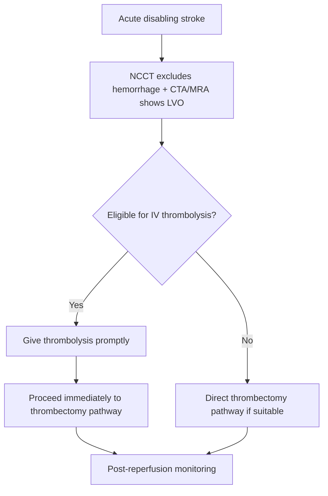
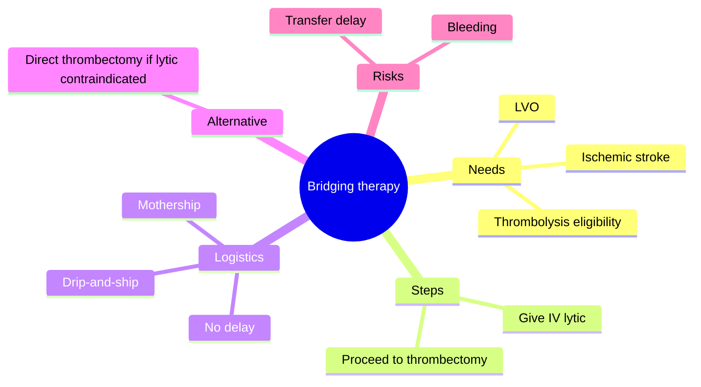
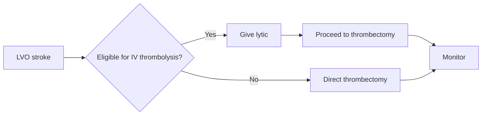

# Bridging therapy concept

Related: [[../Stroke Medicine MOC|Stroke Medicine MOC]] · [[../Reperfusion Therapy|Reperfusion Therapy]] · [[Mechanical thrombectomy|Mechanical thrombectomy]] · [[Intravenous alteplase eligibility|Intravenous alteplase eligibility]] · [[Mechanical thrombectomy eligibility|Mechanical thrombectomy eligibility]] · [[Large-vessel occlusion transfer pathway|Large-vessel occlusion transfer pathway]]

> [!important]
> **Bridging therapy** means giving IV thrombolysis first in an eligible patient with **large-vessel occlusion (LVO)** and then proceeding to **mechanical thrombectomy**. The key exam point is that alteplase/tenecteplase and thrombectomy are often **complementary**, not competing pathways.

## Learning Objectives
- Define bridging therapy in acute stroke reperfusion.
- Explain when bridging therapy is considered and why it matters in LVO care.
- Recognize common benefits, cautions, and clinical controversies in simple exam language.

## Definition
**Bridging therapy** refers to the strategy of giving **IV thrombolysis** to an eligible patient with acute ischaemic stroke and confirmed/suspected **large-vessel occlusion**, followed by transfer or direct progression to **mechanical thrombectomy**.

## Core Anatomy
- Bridging therapy matters most in **proximal anterior circulation LVO** such as ICA or M1 occlusion.
- It may also be relevant in selected **posterior circulation** LVO, especially **basilar artery occlusion**.
- These occlusions threaten large territories of potentially salvageable brain tissue.

## Core Physiology
- IV thrombolysis may begin clot dissolution early, potentially improving reperfusion before catheter treatment.
- Mechanical thrombectomy physically removes the clot if lysis alone is insufficient.
- Using both may increase the chance of rapid recanalization and better tissue salvage in selected patients.
- The main counterbalance is bleeding risk and the possibility that thrombolysis adds little in some circumstances.

## Normal Values / Important Cut-offs
- Bridging therapy is considered only when the patient is **eligible for IV thrombolysis** and also appears to be a **thrombectomy candidate**.
- Hemorrhage must be excluded first.
- Time remains critical: IV thrombolysis should not delay thrombectomy workflow.
- If IV thrombolysis is contraindicated, thrombectomy may still proceed alone in suitable LVO stroke.

## Classification
### Reperfusion strategy types
- **Bridging therapy**: IV thrombolysis + thrombectomy
- **Direct thrombectomy pathway**: thrombectomy without IV thrombolysis due to contraindication or protocol decision

### Clinical setting
- Drip-and-ship: thrombolysis at one centre then transfer
- Mothership: direct arrival to thrombectomy-capable centre with rapid combined workflow

## Etiology / Causes
Bridging therapy is used for acute ischemic stroke caused by **LVO**, commonly due to:
- Cardioembolism
- Large-artery atherothromboembolism
- Basilar thrombosis

## Risk Factors
### For needing bridging strategy
- LVO syndrome
- Early presentation within thrombolysis window
- Eligible for both lytic and endovascular therapy

### For bleeding risk during bridging
- Large infarct burden
- Uncontrolled severe hypertension
- Coagulopathy/anticoagulant exposure
- Older frailty with bleeding-prone comorbidity

## Pathophysiology
In LVO stroke, time-sensitive salvageable penumbra is threatened. IV thrombolysis can start recanalization quickly while endovascular treatment is being organized. If thrombolysis fails to fully reopen the artery, thrombectomy provides definitive clot retrieval. Thus bridging therapy links pharmacologic reperfusion to mechanical reperfusion in a single time-critical sequence.

## Clinical Features
### Clinical situations supporting bridging thinking
- Disabling acute ischemic stroke
- Confirmed or strongly suspected LVO on CTA/MRA
- Patient within thrombolysis criteria
- Planned thrombectomy pathway already active

### Situations reducing bridging applicability
- Clear contraindication to IV thrombolysis
- Very large completed infarct with poor expected benefit-risk profile
- Major bleeding-risk state

## Approach / Algorithm

## Investigations
### Core investigations
- Non-contrast CT head
- CTA/MRA to confirm LVO
- Blood glucose
- BP assessment
- CBC/coagulation review when indicated
- Stroke severity/disability assessment

### Additional / selected
- CT perfusion or MRI-based selection in extended-window settings where relevant
- Cardiac rhythm evaluation after stabilization for mechanism workup

## Interpretation Frameworks
### Bridging therapy bedside checklist
1. Is this **acute ischemic stroke**?
2. Is there a **treatable LVO**?
3. Is the patient eligible for **IV thrombolysis**?
4. Will giving thrombolysis **avoid delaying thrombectomy**?
5. If thrombolysis is contraindicated, can thrombectomy still proceed?

### Bridging vs direct thrombectomy
| Situation | Preferred thinking |
|---|---|
| LVO + thrombolysis eligible | Bridging therapy often considered |
| LVO + thrombolysis contraindicated | Direct thrombectomy |
| No LVO | Standard thrombolysis/non-thrombectomy stroke pathway |

## Diagnosis
This is a **reperfusion-strategy concept**, not a separate disease diagnosis. It applies after diagnosing acute ischemic stroke and identifying a patient who may benefit from both IV thrombolysis and thrombectomy.

## Differential Diagnosis
- Non-LVO ischemic stroke needing thrombolysis alone or standard care
- LVO stroke with contraindication to thrombolysis → direct thrombectomy
- Intracerebral hemorrhage
- Stroke mimic

## Tables / Comparison Charts
### Bridging therapy pros and cautions
| Potential advantage | Caution |
|---|---|
| Earlier reperfusion can begin before catheter retrieval | Bleeding risk from thrombolytic |
| Possible partial recanalization before thrombectomy | Should not delay thrombectomy |
| Useful in drip-and-ship model | Not possible if thrombolysis contraindicated |

### Common exam mistakes
| Mistake | Why wrong |
|---|---|
| Thinking alteplase/tenecteplase and thrombectomy are mutually exclusive | They may be sequentially combined |
| Delaying thrombectomy while focusing only on lytic infusion | Lost brain tissue time |
| Assuming thrombectomy is impossible if lytic is not given | Direct thrombectomy may still be appropriate |
| Ignoring LVO imaging confirmation | Bridging only makes sense in proper reperfusion context |

## Management
### Core principles
- If an LVO patient is **eligible for IV thrombolysis**, give it promptly according to protocol.
- Continue thrombectomy activation **without delay**.
- If thrombolysis is contraindicated, proceed to **direct thrombectomy** when appropriate.
- Coordinate stroke, imaging, transfer, and neurointervention teams efficiently.

### Workflow pearls
- “**Drip-and-ship**” means lytic given at first centre before transfer.
- “**Mothership**” means direct arrival at thrombectomy-capable centre.
- The key operational danger is losing time between steps.

## Drug Interactions / Contraindications / Comorbidity Cautions
- Standard thrombolysis contraindications still apply to the bridging component.
- Bridging does not mean “treat everyone with both”; it requires eligibility for both parts.
- Severe frailty, large completed infarct, or major bleeding-risk state may alter plan.
- Anticoagulant exposure may block the lytic step but not necessarily the thrombectomy step.

## Procedures / Indications / Contraindications
- **IV thrombolysis**: first step in eligible bridging cases.
- **Mechanical thrombectomy**: definitive clot-retrieval step in LVO.
- **Transfer to thrombectomy centre**: essential in drip-and-ship pathways.

## Procedure Mini-Sections
- **Procedure concept:** Bridging therapy
- **Indications:** LVO stroke where patient qualifies for both IV thrombolysis and thrombectomy pathway
- **Contraindications / cautions:** Any major thrombolysis contraindication affects the bridging component; thrombectomy may still proceed alone
- **Principle:** Start reperfusion pharmacologically, then continue to mechanical clot retrieval without delay
- **Viva pearl:** “Eligible for both” is the bridge; “contraindicated for lytic” does not equal “contraindicated for thrombectomy” 

## Complications
- Symptomatic intracranial hemorrhage from the lytic component
- Reperfusion injury
- Failed recanalization
- Transfer delay with infarct progression
- Procedure-related thrombectomy complications

## Red Flags / Emergencies
- LVO confirmed but thrombectomy activation delayed
- BP/bleeding-risk issue discovered after lytic start
- Neurological worsening during transfer
- Basilar artery occlusion requiring urgent uninterrupted pathway

## Prognosis
The benefit of bridging therapy depends on rapid organization, correct patient selection, and successful reperfusion. Prognosis worsens if workflow delays consume the advantage of combining therapies or if bleeding complications occur.

## Topic Correlation
- [[Intravenous alteplase eligibility|Intravenous alteplase eligibility]]
- [[Mechanical thrombectomy eligibility|Mechanical thrombectomy eligibility]]
- [[Large-vessel occlusion transfer pathway|Large-vessel occlusion transfer pathway]]
- [[Thrombolysis contraindications and bleeding-risk cautions|Thrombolysis contraindications and bleeding-risk cautions]]
- [[../Special Stroke Scenarios/Basilar artery occlusion|Basilar artery occlusion]]

## Special Situations
- **Drip-and-ship model:** classic bridging setting.
- **Basilar artery occlusion:** posterior circulation bridging/thrombectomy thinking can be crucial.
- **Lytic contraindication:** direct thrombectomy remains an option.
- **Wake-up stroke with favorable imaging:** may still enter advanced reperfusion pathway depending on protocol.

## FCPS/MRCP High-Yield Points
- Bridging therapy = **IV thrombolysis first + thrombectomy next** in eligible LVO stroke.
- The two strategies are **complementary**, not mutually exclusive.
- Thrombolysis must **not delay thrombectomy**.
- If thrombolysis is contraindicated, **direct thrombectomy** may still be appropriate.
- Drip-and-ship is a classic bridging workflow term.

## Common Viva Questions
1. What is bridging therapy in stroke medicine?
2. When is bridging therapy used?
3. Why must thrombolysis not delay thrombectomy?
4. What is the difference between bridging and direct thrombectomy?
5. What does drip-and-ship mean?

## Common Confusions / Exam Traps
- Thinking all thrombectomy patients must or must not get IV lytic.
- Forgetting that bridging depends on **eligibility for thrombolysis**.
- Missing the importance of workflow timing.
- Confusing bridging therapy with long-term antithrombotic bridging concepts from other specialties.

## Mnemonics
- **BRIDGE**
  - **B**olus/lysis first if eligible
  - **R**apid CTA-confirmed LVO
  - **I**mmediate thrombectomy pathway
  - **D**o not delay
  - **G**et transfer moving
  - **E**ndovascular retrieval follows

## Mind Map

## Flowchart

## Suggested Visuals / Image Notes
- Bridging vs direct thrombectomy decision chart
- Drip-and-ship vs mothership pathway diagram
- LVO reperfusion workflow map

## Suggested Video References
- Hyperacute LVO reperfusion workflow review
- Bridging therapy vs direct thrombectomy teaching session
- Stroke transfer logistics and LVO systems of care

## One-Page Revision Summary
### Bridging Therapy Concept at a Glance
- **Definition:** IV thrombolysis followed by thrombectomy in eligible LVO stroke
- **Use:** patient qualifies for both lytic therapy and thrombectomy pathway
- **Key rule:** thrombolysis must **not delay** thrombectomy
- **If lytic contraindicated:** direct thrombectomy may still be done
- **Classic terms:** drip-and-ship, mothership
- **Main risks:** bleeding, failed recanalization, transfer delay

## 24-Hour Recall Prompts
- Define bridging therapy in one sentence.
- What is the difference between bridging and direct thrombectomy?
- Why must lytic therapy not delay thrombectomy?
- What is drip-and-ship?
- Can thrombectomy still proceed if lytic is contraindicated?

## 7-Day / 15-Day / 30-Day Revision Tracker
- **Day 1:** Explain bridging therapy from memory.
- **Day 7:** Compare bridging with direct thrombectomy.
- **Day 15:** Practice three LVO workflow vignettes.
- **Day 30:** Redo MCQs/SBAs and identify transfer/logistics weak points.

## Must Know / Should Know / Nice to Know
### Must Know
- Bridging = lytic + thrombectomy
- Requires LVO and thrombolysis eligibility
- No delay to thrombectomy
- Direct thrombectomy if lytic contraindicated
- Drip-and-ship terminology

### Should Know
- Mothership model
- Posterior circulation relevance
- Common workflow pitfalls

### Nice to Know
- Detailed trial controversies beyond core exam need

## My Weak Points
- Do I remember bridging is not mandatory in every thrombectomy case?
- Can I explain drip-and-ship vs mothership?
- Do I remember that thrombectomy can still proceed alone?

## Self-Test Scorecard
- Understanding /10
- Recall /10
- Workflow reasoning /10
- MCQ performance /10
- Viva confidence /10

**Guide:**
- **<35/50** = weak topic
- **35–44/50** = acceptable but not secure
- **45+/50** = strong exam-ready topic

## Exam Answer Modes
### Long-answer skeleton
1. Definition
2. Indications
3. Workflow models
4. Benefits and cautions
5. Direct thrombectomy comparison

### Short-note skeleton
- LVO + lytic eligible
- Give thrombolysis first
- Continue to thrombectomy
- No delay
- Direct thrombectomy if needed

### Viva skeleton
- “What is bridging therapy?”
- “Who gets it?”
- “What is drip-and-ship?”
- “When do you skip the lytic step?”

## Summary
Bridging therapy is the sequential reperfusion strategy of **IV thrombolysis followed by mechanical thrombectomy** in eligible patients with acute ischaemic stroke due to **large-vessel occlusion**. It is especially relevant in LVO systems of care and transfer pathways. The central exam principles are that both treatments are **complementary**, thrombectomy must **not be delayed**, and direct thrombectomy remains possible when thrombolysis is contraindicated.

## MCQs (10)
1. Bridging therapy in stroke medicine means:
   A. Long-term aspirin plus statin  
   B. IV thrombolysis followed by thrombectomy  
   C. Anticoagulation after AF only  
   D. Ventricular drainage

2. Bridging therapy is most relevant in:
   A. Large-vessel occlusion stroke  
   B. Migraine aura  
   C. Bell palsy  
   D. Chronic neuropathy

3. Which statement is correct?
   A. Thrombolysis and thrombectomy are always mutually exclusive  
   B. In eligible LVO stroke they may be complementary  
   C. Bridging applies to hemorrhagic stroke  
   D. CTA is not needed

4. The major workflow rule in bridging therapy is:
   A. Thrombolysis must not delay thrombectomy  
   B. Wait for symptom resolution first  
   C. CT is optional  
   D. Always avoid transfer

5. If thrombolysis is contraindicated in an LVO patient, the next key option may be:
   A. Direct thrombectomy  
   B. No reperfusion at all ever  
   C. Lumbar puncture only  
   D. Chronic antibiotics

6. Which term describes lytic at first centre then transfer for thrombectomy?
   A. Drip-and-ship  
   B. Locked-in syndrome  
   C. Endarterectomy  
   D. Lacunar rescue

7. Which posterior circulation scenario may still fit bridging/thrombectomy thinking?
   A. Basilar artery occlusion  
   B. Tension headache  
   C. Otitis media  
   D. Essential tremor

8. The main physiologic rationale for bridging is:
   A. Start reperfusion early while definitive clot retrieval is arranged  
   B. Lower blood glucose  
   C. Prevent cataract  
   D. Treat raised ICP directly

9. Which is a recognized complication/risk in bridging pathways?
   A. Transfer delay with infarct progression  
   B. Osteoporosis  
   C. Nephrotic syndrome  
   D. Thyrotoxicosis

10. Bridging therapy requires:
    A. Eligibility for both thrombolysis and thrombectomy pathway  
    B. Intracerebral hemorrhage  
    C. Chronic anticoagulation only  
    D. No imaging

## SBA Questions (10)
1. A patient with acute left M1 occlusion is eligible for IV thrombolysis and thrombectomy. What is the best reperfusion concept?  
   A. Bridging therapy may be appropriate  
   B. Thrombectomy is forbidden after lytic  
   C. CT is unnecessary  
   D. Only aspirin is needed  
   E. Delay until tomorrow

2. Why is bridging therapy useful in LVO stroke?  
   A. It can begin reperfusion before catheter retrieval is completed  
   B. It eliminates all bleeding risk  
   C. It proves the stroke is hemorrhagic  
   D. It removes the need for CTA  
   E. It replaces rehabilitation

3. A patient has LVO but is ineligible for alteplase because of major recent bleeding. What is the best principle?  
   A. Direct thrombectomy may still be appropriate  
   B. No further reperfusion should be considered  
   C. CTA is no longer useful  
   D. Start DAPT instead of thrombectomy  
   E. Discharge the patient

4. What is the key operational error in bridging therapy?  
   A. Letting lytic administration delay thrombectomy workflow  
   B. Checking CTA  
   C. Monitoring BP  
   D. Calling the stroke team  
   E. Identifying LVO

5. Which phrase best defines drip-and-ship?  
   A. IV thrombolysis at first hospital, then transfer for thrombectomy  
   B. Ventricular drainage followed by rehab  
   C. Antiplatelets before CT  
   D. Home BP monitoring after discharge  
   E. Delayed anticoagulation after TIA

6. In bridging therapy, which imaging is crucial to identify the target lesion?  
   A. CTA/MRA showing LVO  
   B. Abdominal ultrasound  
   C. Bone scan  
   D. Colonoscopy  
   E. Audiogram

7. A patient with BAO is eligible for IV lytic and thrombectomy pathway. Which statement is best?  
   A. Posterior circulation can still be a bridging/thrombectomy scenario  
   B. Bridging is only for carotid disease and never for basilar occlusion  
   C. Reperfusion is irrelevant in posterior stroke  
   D. CTA is unnecessary in BAO  
   E. LVO cannot occur posteriorly

8. What is the major relationship between bridging therapy and direct thrombectomy?  
   A. They are alternative reperfusion strategies depending on lytic eligibility  
   B. They are identical terms  
   C. Both are chronic prevention strategies  
   D. Both are used for hemorrhagic stroke  
   E. Neither requires stroke diagnosis

9. Which is the best summary statement?  
   A. Bridging therapy combines pharmacologic and mechanical reperfusion in eligible LVO stroke  
   B. Bridging therapy is long-term DAPT  
   C. Bridging therapy replaces all imaging  
   D. Bridging therapy is for TIAs only  
   E. Bridging therapy is never used with transfer

10. The best prerequisite before bridging therapy is:
    A. Hemorrhage exclusion and confirmation of LVO  
    B. Proof of cataract  
    C. Normal thyroid function  
    D. Joint aspiration  
    E. Hearing test

## Flashcards
- Q: What is bridging therapy in acute stroke?  
  A: IV thrombolysis followed by mechanical thrombectomy in eligible LVO stroke.
- Q: What kind of stroke most commonly triggers bridging thinking?  
  A: Large-vessel occlusion stroke.
- Q: What is drip-and-ship?  
  A: Thrombolysis at first centre followed by transfer for thrombectomy.
- Q: What is the key workflow rule in bridging therapy?  
  A: Thrombolysis must not delay thrombectomy.
- Q: If thrombolysis is contraindicated in LVO stroke, what reperfusion option may remain?  
  A: Direct thrombectomy.
- Q: Which posterior circulation occlusion is a key bridging/thrombectomy scenario?  
  A: Basilar artery occlusion.
- Q: What imaging usually confirms the target lesion for bridging strategy?  
  A: CTA or MRA showing LVO.
- Q: Are thrombolysis and thrombectomy mutually exclusive in LVO stroke?  
  A: No.
- Q: What is the physiologic idea behind bridging?  
  A: Start lysis early while definitive clot retrieval is organized.
- Q: What is a major risk of poor bridging logistics?  
  A: Transfer delay and infarct progression.

## Answer Key with Explanations
### MCQs
1. **B** — This is the definition of bridging therapy in stroke.  
2. **A** — It is an LVO reperfusion strategy.  
3. **B** — In eligible LVO stroke, lytic and thrombectomy can be sequentially combined.  
4. **A** — Workflow delay is the main operational hazard.  
5. **A** — Direct thrombectomy remains possible if lytic is contraindicated.  
6. **A** — Drip-and-ship is the classic transfer term.  
7. **A** — Basilar artery occlusion can be a key posterior-circulation reperfusion scenario.  
8. **A** — The rationale is early lysis while definitive retrieval is organized.  
9. **A** — Transfer delay can cost salvageable brain tissue.  
10. **A** — Bridging needs eligibility for both components.

### SBAs
1. **A** — Eligible LVO stroke fits bridging therapy concept.  
2. **A** — IV lytic can start reperfusion while thrombectomy is being organized.  
3. **A** — Thrombectomy may still be performed even if lytic cannot be given.  
4. **A** — Delaying thrombectomy is the main operational error.  
5. **A** — That is the definition of drip-and-ship.  
6. **A** — LVO must be demonstrated on vascular imaging.  
7. **A** — BAO remains a crucial posterior-circulation reperfusion pathway.  
8. **A** — Direct thrombectomy and bridging differ mainly by whether the lytic step is appropriate.  
9. **A** — It combines pharmacologic and mechanical reperfusion.  
10. **A** — Hemorrhage exclusion plus LVO confirmation are the prerequisites.