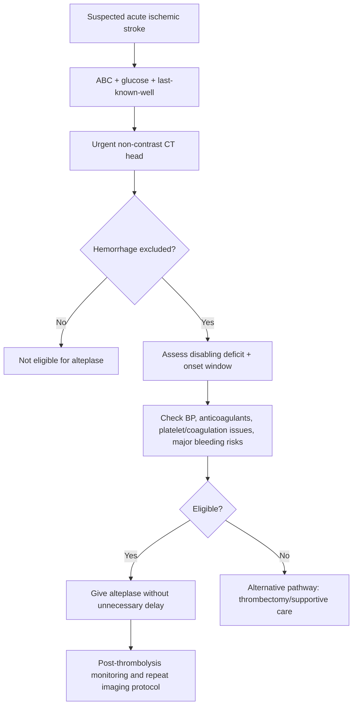
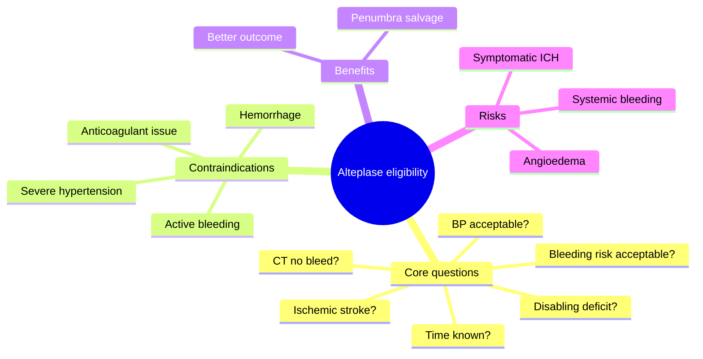
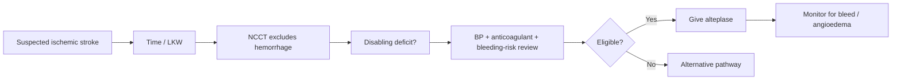

# Intravenous alteplase eligibility

Related: [[../Stroke Medicine MOC|Stroke Medicine MOC]] · [[../Reperfusion Therapy|Reperfusion Therapy]] · [[Intravenous thrombolysis|Intravenous thrombolysis]] · [[Mechanical thrombectomy eligibility|Mechanical thrombectomy eligibility]] · [[Thrombolysis contraindications and bleeding-risk cautions|Thrombolysis contraindications and bleeding-risk cautions]] · [[../Acute Ischaemic Stroke/Acute ischaemic stroke|Acute ischaemic stroke]]

> [!important]
> **Alteplase eligibility is a decision under time pressure.** The core exam logic is: confirm disabling ischemic stroke, establish time/last-known-well, exclude hemorrhage, check contraindications, control BP if needed, and do not delay treatment for unnecessary steps.

## Learning Objectives
- Define the role of intravenous alteplase in acute ischemic stroke.
- Apply a practical eligibility screen using onset time, disabling deficit, CT findings, BP, glucose, and bleeding risk.
- Recognize common contraindications, complications, and exam traps.

## Definition
**Intravenous alteplase eligibility** means a patient with suspected acute ischemic stroke has a clinical and imaging profile in which the expected benefit of IV alteplase outweighs the bleeding risk within the approved treatment framework.

## Core Anatomy
- Alteplase is most relevant where there is salvageable ischemic brain tissue, especially in **anterior circulation disabling strokes**.
- Large-vessel occlusion may still require thrombectomy; alteplase may be given before thrombectomy in eligible patients depending on protocol.
- Lacunar, cortical, retinal, or posterior circulation strokes may all be considered if symptoms are disabling and exclusion criteria are absent.

## Core Physiology
- Alteplase is a **recombinant tissue plasminogen activator** that promotes fibrinolysis by converting plasminogen to plasmin.
- It aims to restore perfusion before infarct core expands.
- Benefit is highly **time dependent**: earlier treatment generally means better outcome.
- Major risk is **symptomatic intracranial hemorrhage**.

## Normal Values / Important Cut-offs
- Standard time window is classically **within 4.5 hours** from onset / last-known-well in eligible patients.
- Blood pressure should be controlled to thrombolysis-safe protocol thresholds before treatment.
- Severe hypoglycaemia can mimic stroke and must be corrected/excluded.
- Platelets, anticoagulant status, and CT findings may change eligibility.
- Patients with **disabling deficit** are prioritized; non-disabling minor symptoms require more caution.

## Classification
### Practical eligibility groups
- **Clearly eligible**: disabling ischemic deficit, within window, CT excludes bleed, no major contraindication
- **Potentially eligible after correction**: BP initially too high but controllable, glucose abnormal but correctable, incomplete but rapidly clarifiable history
- **Ineligible / high risk**: hemorrhage, major active bleeding risk, certain anticoagulation/coagulation problems, very late untreated window under standard criteria

## Etiology / Causes
This note is about treatment selection, not disease causation; however alteplase is typically considered in:
- Cardioembolic stroke
- Large-artery thromboembolic stroke
- Some lacunar and other non-hemorrhagic ischemic strokes if disabling

## Risk Factors
### Factors increasing stroke recurrence / urgency
- Hypertension
- Atrial fibrillation
- Diabetes
- Smoking
- Prior TIA/stroke

### Factors increasing bleeding risk with thrombolysis
- Severe uncontrolled hypertension
- Anticoagulant use / coagulopathy
- Very large established infarction
- Recent major surgery or major active bleeding
- Prior intracranial hemorrhage or structural intracranial bleeding risk in relevant scenarios

## Pathophysiology
An occlusive thrombus reduces cerebral perfusion and creates ischemic penumbra. Alteplase can lyse thrombus and restore blood flow, reducing disability if given early enough and safely. However, damaged ischemic vessels may leak after reperfusion, causing symptomatic hemorrhage, especially when infarct burden is large or coagulation is abnormal.

## Clinical Features
### Features favoring treatment consideration
- Sudden focal neurological deficit consistent with stroke
- Persistent deficit at evaluation
- Clinically disabling symptoms such as hemiparesis, aphasia, hemianopia, severe dysarthria, brainstem syndrome, or disabling ataxia
- Last-known-well within accepted thrombolysis window

### Situations demanding caution
- Very mild and clearly non-disabling symptoms
- Seizure at onset with uncertainty whether deficit is post-ictal rather than ischemic
- Rapidly improving symptoms but residual disabling deficit remains
- High bleeding-risk history

## Approach / Algorithm

## Investigations
### Essential before/alongside decision
- Non-contrast CT head
- Capillary blood glucose
- Basic neurological assessment including severity / disabling nature
- BP measurement and repeated monitoring
- Anticoagulant history / medication history
- CBC and platelets where indicated and quickly available
- Coagulation profile when anticoagulant use/coagulopathy suspected

### Often done in parallel
- CT angiography if thrombectomy pathway considered
- Renal function/electrolytes
- ECG

> [!tip]
> In a clearly eligible patient, **do not delay alteplase for unnecessary tests** if hemorrhage has been excluded and no specific lab concern is suspected.

## Interpretation Frameworks
### Bedside alteplase decision frame
1. **Is this really an ischemic stroke?**
2. **What is the exact onset or last-known-well time?**
3. **Is the deficit disabling?**
4. **Is hemorrhage excluded on CT?**
5. **Is BP acceptable or can it be made acceptable safely?**
6. **Any major bleeding contraindication or anticoagulant issue?**
7. **Is thrombectomy also indicated?**

### Disabling vs non-disabling thinking
| Deficit | Practical implication |
|---|---|
| Aphasia, hemiparesis, hemianopia, severe dysarthria, disabling ataxia | Usually supports treatment if otherwise eligible |
| Minor sensory-only symptoms with no functional impact | More cautious decision |
| Improving symptoms but still disabling deficit remains | Still may be eligible |

## Diagnosis
This is not a separate disease diagnosis; it is a treatment-eligibility decision applied after diagnosing **acute ischemic stroke** and excluding hemorrhage or major contraindication.

## Differential Diagnosis
- Intracerebral hemorrhage
- TIA with complete recovery
- Post-ictal Todd paresis
- Hypoglycaemia
- Functional neurological disorder
- Migraine aura
- Brain tumor / subdural collection in selected cases

## Tables / Comparison Charts
### Key eligibility logic
| Question | Favors alteplase | Opposes alteplase |
|---|---|---|
| Stroke type | Acute ischemic stroke | Hemorrhage / mimic |
| Time | Within approved window | Clearly outside standard window |
| Deficit | Disabling persistent deficit | Non-disabling trivial symptoms |
| BP | Within target or controllable | Severe uncontrolled hypertension |
| Coagulation | No major bleeding risk | Significant anticoagulant/coagulopathy issue |

### Common “yes/no” checkpoints
| Checkpoint | Why it matters |
|---|---|
| Last-known-well time | Determines window eligibility |
| CT excludes bleed | Prevents catastrophic thrombolysis of hemorrhage |
| Disabling deficit present | Benefit more likely outweighs risk |
| BP controllable | High BP raises hemorrhagic risk |
| Anticoagulant history known | Some agents/statuses preclude or alter decision |

## Management
### Immediate decision-making steps
- Activate stroke pathway.
- Record exact symptom onset or last-known-well.
- Perform NIHSS/deficit assessment with focus on functional disability.
- Get urgent non-contrast CT.
- Check glucose and treat severe abnormality.
- Review BP, anticoagulants, recent bleeding/surgery, and other contraindications.

### If eligible
- Administer IV alteplase according to protocol without avoidable delay.
- Monitor neurologic status, BP, and bleeding signs closely.
- Avoid routine antiplatelet/anticoagulant use immediately afterward until follow-up imaging/protocol allows.
- Continue thrombectomy pathway if large-vessel occlusion is present and patient qualifies.

### If not eligible
- Consider mechanical thrombectomy if appropriate.
- Provide best medical therapy and stroke-unit care.
- Start secondary prevention once safe and indicated.

## Drug Interactions / Contraindications / Comorbidity Cautions
- Major concern is **bleeding risk**.
- Current anticoagulant use may preclude treatment depending on drug, timing, and coagulation status.
- Severe uncontrolled hypertension increases intracranial hemorrhage risk.
- Recent major surgery, active bleeding, or known intracranial bleeding-prone lesions may be contraindications.
- Hypoglycaemia can mimic stroke; correct it first.
- Pregnancy, severe liver disease, thrombocytopenia, and recent GI bleed require individualized specialist judgment.

## Procedures / Indications / Contraindications
- **IV alteplase**: indicated for eligible acute ischemic stroke within treatment window.
- **CT/CTA-based selection**: essential to exclude bleed and identify thrombectomy candidates.
- **Mechanical thrombectomy**: complementary reperfusion strategy in selected LVO patients.

## Procedure Mini-Sections
- **Procedure:** Intravenous alteplase administration
- **Indications:** Eligible disabling acute ischemic stroke within protocol window
- **Contraindications:** Hemorrhage on CT, major active bleeding risk, important anticoagulant/coagulopathy barriers, uncontrolled BP not safely correctable
- **Preparation / principle:** Confirm time, CT, glucose, BP, consent/protocol readiness, and weight-based dosing process
- **Complications:** Symptomatic intracranial hemorrhage, systemic bleeding, angioedema
- **Viva pearl:** “Do not delay for perfection” — after hemorrhage exclusion and core safety checks, time to needle matters greatly

## Complications
- Symptomatic intracranial hemorrhage
- Orolingual angioedema
- Systemic bleeding
- Reperfusion failure / no clinical improvement
- Hemorrhagic transformation

## Red Flags / Emergencies
- Sudden neurological worsening after alteplase
- Severe headache, vomiting, acute hypertension spike after treatment
- New reduced consciousness suggesting hemorrhage
- Orolingual swelling threatening airway
- Large-vessel occlusion needing urgent thrombectomy pathway even if alteplase is started

## Prognosis
When given to the right patient quickly, alteplase improves the chance of better functional outcome. Prognosis still depends on age, stroke severity, occlusion site, time to treatment, recanalization success, and complications.

## Topic Correlation
- [[../Acute Ischaemic Stroke/Acute ischaemic stroke|Acute ischaemic stroke]]
- [[Mechanical thrombectomy eligibility|Mechanical thrombectomy eligibility]]
- [[Thrombolysis contraindications and bleeding-risk cautions|Thrombolysis contraindications and bleeding-risk cautions]]
- [[Symptomatic intracranial haemorrhage after reperfusion|Symptomatic intracranial haemorrhage after reperfusion]]
- [[Post-thrombolysis monitoring and BP targets|Post-thrombolysis monitoring and BP targets]]

## Special Situations
- **Wake-up stroke:** may require imaging-based selection depending on local protocol.
- **Rapidly improving symptoms:** treat if a disabling deficit remains; do not be falsely reassured.
- **Posterior circulation stroke:** disabling symptoms may exist even with atypical NIHSS emphasis.
- **Elderly patients:** age alone is not the only question; overall eligibility and risk-benefit matter.
- **Seizure at onset:** do not assume stroke unless residual deficit is felt to be ischemic rather than purely post-ictal.

## FCPS/MRCP High-Yield Points
- First rule: **exclude hemorrhage on CT**.
- Second rule: know the **time/last-known-well**.
- Third rule: ask whether the deficit is **disabling**.
- BP and anticoagulant history are exam favorites because they often determine eligibility.
- Alteplase can be given in thrombectomy candidates if they also meet thrombolysis criteria and local protocol supports it.

## Common Viva Questions
1. What makes a stroke deficit “disabling” for alteplase decisions?
2. Why is the last-known-well time crucial?
3. What are the major contraindication categories for alteplase?
4. What is the most feared complication of thrombolysis?
5. Why should treatment not be delayed after CT excludes hemorrhage?

## Common Confusions / Exam Traps
- Treating before clear hemorrhage exclusion.
- Ignoring a disabling posterior circulation syndrome because NIHSS seems modest.
- Over-focusing on age while missing the more important bleeding-risk variables.
- Assuming rapidly improving symptoms automatically mean “no alteplase.”
- Delaying treatment for non-essential tests.

## Mnemonics
- **TIME-BP-CT** for alteplase screening:
  - **T**ime / last-known-well
  - **I**schemic stroke pattern
  - **M**ajor contraindications absent
  - **E**xclude hemorrhage
  - **B**lood pressure acceptable
  - **P**ersistent disabling deficit
  - **C**oagulation/anticoagulant review
  - **T**hrombectomy pathway considered

## Mind Map

## Flowchart

## Suggested Visuals / Image Notes
- Alteplase eligibility checklist card
- Hyperacute stroke pathway diagram showing CT, BP, and contraindication checks
- Post-thrombolysis monitoring chart

## Suggested Video References
- Acute ischemic stroke thrombolysis eligibility walkthrough
- CT-based stroke reperfusion decision teaching video
- Post-thrombolysis complication recognition

## One-Page Revision Summary
### Intravenous Alteplase Eligibility at a Glance
- **Indication:** eligible acute ischemic stroke with disabling deficit
- **Time:** classically within **4.5 hours** from onset/last-known-well
- **Must confirm:** non-contrast CT excludes hemorrhage
- **Must check:** BP, glucose, anticoagulants, major bleeding contraindications
- **Do not delay:** once core criteria are satisfied
- **Major risk:** symptomatic intracranial hemorrhage
- **After treatment:** close neuro/BP monitoring and delayed antithrombotics per protocol

## 24-Hour Recall Prompts
- State the five bedside questions you ask before alteplase.
- Why can a low NIHSS still represent a disabling stroke?
- What is the most feared complication of alteplase?
- Why is last-known-well time more important than arrival time?
- When should thrombectomy still be considered despite alteplase?

## 7-Day / 15-Day / 30-Day Revision Tracker
- **Day 1:** Reproduce the eligibility framework from memory.
- **Day 7:** Practice 5 mini-cases: eligible vs ineligible.
- **Day 15:** Compare alteplase vs thrombectomy pathways.
- **Day 30:** Redo the MCQs/SBAs and identify hesitation points.

## Must Know / Should Know / Nice to Know
### Must Know
- CT exclusion of hemorrhage
- Time window / last-known-well
- Disabling deficit concept
- BP and anticoagulant checks
- Symptomatic ICH risk

### Should Know
- Posterior circulation / low-NIHSS pitfalls
- Rapidly improving but disabling deficit nuance
- Parallel thrombectomy assessment

### Nice to Know
- Imaging-selected extended-window subtleties by local protocol
- Detailed alteplase pharmacology beyond exam core

## My Weak Points
- Do I remember the key contraindication categories?
- Can I explain why “mild” does not always mean “non-disabling”?
- Do I know when not to delay treatment?

## Self-Test Scorecard
- Understanding /10
- Recall /10
- Case triage /10
- MCQ performance /10
- Viva confidence /10

**Guide:**
- **<35/50** = weak topic
- **35–44/50** = acceptable but not secure
- **45+/50** = strong exam-ready topic

## Exam Answer Modes
### Long-answer skeleton
1. Role of alteplase
2. Eligibility criteria
3. Contraindications
4. Complications
5. Post-thrombolysis monitoring

### Short-note skeleton
- Time window
- CT no hemorrhage
- Disabling deficit
- BP / bleeding-risk review
- Major complication

### Viva skeleton
- “Who is eligible?”
- “What do you check first?”
- “What contraindications matter most?”
- “What if symptoms are improving?”

## Summary
Intravenous alteplase eligibility is a time-critical reperfusion decision in acute ischemic stroke. The exam framework is simple but strict: confirm an **ischemic disabling deficit**, determine **time/last-known-well**, **exclude hemorrhage on CT**, ensure **BP and bleeding risk are acceptable**, and treat promptly without unnecessary delay. The main feared complication is **symptomatic intracranial hemorrhage**, and thrombectomy assessment should occur in parallel when large-vessel occlusion is suspected.

## MCQs (10)
1. The single most important imaging requirement before giving IV alteplase is:
   A. MRI contrast enhancement  
   B. Exclusion of hemorrhage on non-contrast CT  
   C. Carotid bruit documentation  
   D. Skull X-ray

2. The standard classical time window for IV alteplase in eligible acute ischemic stroke is:
   A. 24 hours  
   B. 12 hours  
   C. 4.5 hours  
   D. 72 hours

3. Which symptom pattern most strongly supports a disabling deficit despite a modest-looking score?  
   A. Mild isolated non-bothersome toe numbness  
   B. Aphasia affecting communication  
   C. Chronic low back pain  
   D. Tremor only

4. The most feared complication of alteplase is:
   A. Nephrolithiasis  
   B. Symptomatic intracranial hemorrhage  
   C. Otitis media  
   D. Cataract

5. Before alteplase, which bedside test should never be forgotten because it may reveal a stroke mimic?  
   A. Peak flow  
   B. Blood glucose  
   C. Audiogram  
   D. Bone density scan

6. A patient is within window and CT shows no hemorrhage, but BP remains severely uncontrolled despite measures. The best conclusion is:  
   A. Alteplase should proceed regardless  
   B. Severe uncontrolled BP may preclude alteplase  
   C. Alteplase is indicated only if the patient is young  
   D. BP is irrelevant once CT is normal

7. Which statement about rapidly improving stroke symptoms is most accurate?  
   A. Alteplase is always contraindicated  
   B. Persistent disabling deficit may still justify treatment  
   C. It always means migraine  
   D. It removes all need for CT

8. Why is last-known-well time emphasized more than arrival time?  
   A. It determines biological treatment window relevance  
   B. It predicts blood group  
   C. It prevents aspiration  
   D. It measures rehab potential only

9. If large-vessel occlusion is suspected, the best concept is:  
   A. Forget reperfusion entirely  
   B. Consider thrombectomy pathway in parallel  
   C. Wait for symptoms to resolve spontaneously  
   D. Use antiplatelet only and discharge

10. Which scenario is most likely to be considered for alteplase if otherwise eligible?  
    A. Hemorrhage on CT  
    B. Persistent aphasia within 4.5 hours  
    C. Trivial fully resolved numbness  
    D. No known onset and no imaging selection pathway

## SBA Questions (10)
1. A 68-year-old woman develops sudden right hemiparesis and expressive aphasia 90 minutes ago. CT excludes hemorrhage. BP is acceptable and there is no bleeding history. What is the best next step?  
   A. Reassure and review next week  
   B. Give IV alteplase if protocol criteria are met  
   C. Start warfarin immediately  
   D. Delay treatment for routine MRI tomorrow  
   E. Assume this is migraine

2. A 59-year-old man arrives 2 hours after onset with severe dysarthria and right arm weakness. CT excludes bleed. Capillary glucose is 1.9 mmol/L and symptoms improve after correction. What is the best interpretation?  
   A. Give alteplase immediately anyway  
   B. Hypoglycaemia mimic must be considered  
   C. All low glucose states are strokes  
   D. Thrombectomy is mandatory  
   E. Start dual antiplatelet before glucose correction

3. A 72-year-old patient has sudden dense hemiplegia within 3 hours of onset. CT shows no bleed. BP remains markedly elevated despite treatment and above protocol threshold. What is the best conclusion?  
   A. Alteplase can be unsafe if BP remains uncontrolled  
   B. BP does not matter in stroke thrombolysis  
   C. Give alteplase and check BP later  
   D. Only age matters  
   E. Diagnose TIA

4. A 64-year-old man has mild improvement in symptoms but remains unable to speak coherently. What is the most appropriate principle?  
   A. Improvement always excludes thrombolysis  
   B. Persistent disabling aphasia may still justify alteplase  
   C. Aphasia is never disabling  
   D. Wait until deficit becomes complete  
   E. Send home if CT is normal

5. A patient with suspected acute ischemic stroke is being screened for alteplase. What is the most important time reference?  
   A. Time of ambulance booking  
   B. Last-known-well time  
   C. Breakfast time  
   D. Time of ECG  
   E. Time of ward arrival

6. Which patient most strongly suggests a thrombolysis-related emergency after treatment?  
   A. Stable weakness improving gradually  
   B. Sudden worsening headache and reduced consciousness  
   C. Mild dry mouth  
   D. Hungry feeling  
   E. Constipation

7. A 66-year-old patient with acute disabling stroke is also found to have a probable large-vessel occlusion on CTA. What is the correct overall concept?  
   A. Alteplase and thrombectomy considerations may coexist  
   B. Alteplase excludes thrombectomy forever  
   C. CTA means stroke is definitely hemorrhagic  
   D. Reperfusion is no longer useful  
   E. Rehab should wait 6 months

8. Why should alteplase not be delayed for many non-essential tests in an otherwise clear candidate?  
   A. Because earlier reperfusion improves outcome  
   B. Because lab tests are illegal  
   C. Because CT is unnecessary  
   D. Because glucose does not matter  
   E. Because all candidates are identical

9. Which scenario best represents a classic alteplase contraindication category?  
   A. Confirmed intracerebral hemorrhage  
   B. Controlled BP  
   C. Persistent disabling deficit  
   D. CTA being requested  
   E. Arrival with a relative

10. A patient presents with posterior circulation stroke causing severe disabling ataxia and dysarthria within window. NIHSS is not very high. What is the best principle?  
    A. Low NIHSS always means no treatment  
    B. Disabling posterior symptoms may still justify alteplase  
    C. Posterior strokes are not real strokes  
    D. Alteplase is only for anterior circulation stroke  
    E. Wait for complete coma

## Flashcards
- Q: What must be excluded on imaging before alteplase?  
  A: Intracranial hemorrhage, usually by non-contrast CT.
- Q: What classical time window is most commonly cited for alteplase eligibility?  
  A: Within 4.5 hours from onset/last-known-well in eligible patients.
- Q: What is the most feared complication of alteplase?  
  A: Symptomatic intracranial hemorrhage.
- Q: Why is blood glucose checked urgently?  
  A: Hypoglycaemia can mimic stroke.
- Q: Give examples of disabling deficits relevant to alteplase decisions.  
  A: Aphasia, hemiparesis, hemianopia, severe dysarthria, disabling ataxia.
- Q: Why is last-known-well time critical?  
  A: It determines whether the patient is within the treatment window.
- Q: How does severe uncontrolled BP affect alteplase use?  
  A: It may preclude treatment until safely controlled.
- Q: If large-vessel occlusion is suspected, what should be considered in parallel?  
  A: Mechanical thrombectomy pathway.
- Q: Do rapidly improving symptoms always exclude alteplase?  
  A: No; not if a disabling deficit persists.
- Q: What post-treatment complication besides hemorrhage should you remember?  
  A: Orolingual angioedema.

## Answer Key with Explanations
### MCQs
1. **B** — Hemorrhage must be excluded before thrombolysis.  
2. **C** — The standard classical window is 4.5 hours in eligible patients.  
3. **B** — Aphasia is functionally disabling even if some scores appear modest.  
4. **B** — Symptomatic intracranial hemorrhage is the major feared complication.  
5. **B** — Glucose is essential because hypoglycaemia may mimic stroke.  
6. **B** — Severe uncontrolled BP may make alteplase unsafe.  
7. **B** — Persistent disabling symptoms after partial improvement can still support treatment.  
8. **A** — Biological onset/last-known-well determines treatment window relevance.  
9. **B** — Thrombectomy assessment should proceed in parallel for suspected LVO.  
10. **B** — Persistent aphasia within window is a classic disabling symptom supporting treatment.

### SBAs
1. **B** — This patient is a classic candidate for alteplase if detailed protocol criteria are met.  
2. **B** — Severe hypoglycaemia can mimic stroke and symptom resolution after correction supports mimic rather than immediate thrombolysis.  
3. **A** — Persistently uncontrolled severe BP raises hemorrhagic risk and may preclude alteplase.  
4. **B** — Residual aphasia remains disabling, so improvement alone does not automatically exclude treatment.  
5. **B** — Last-known-well time anchors eligibility.  
6. **B** — Sudden worsening headache and reduced consciousness after treatment suggest intracranial hemorrhage until proven otherwise.  
7. **A** — Alteplase and thrombectomy pathways can both be relevant in the same patient.  
8. **A** — Reperfusion benefit falls with time; unnecessary delay harms outcomes.  
9. **A** — Confirmed ICH is a classic contraindication category.  
10. **B** — Posterior circulation strokes may be highly disabling despite a modest NIHSS.
