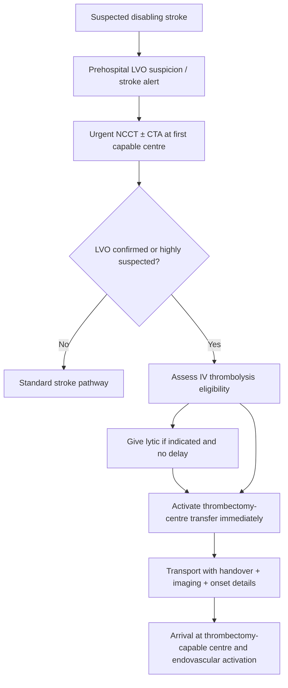
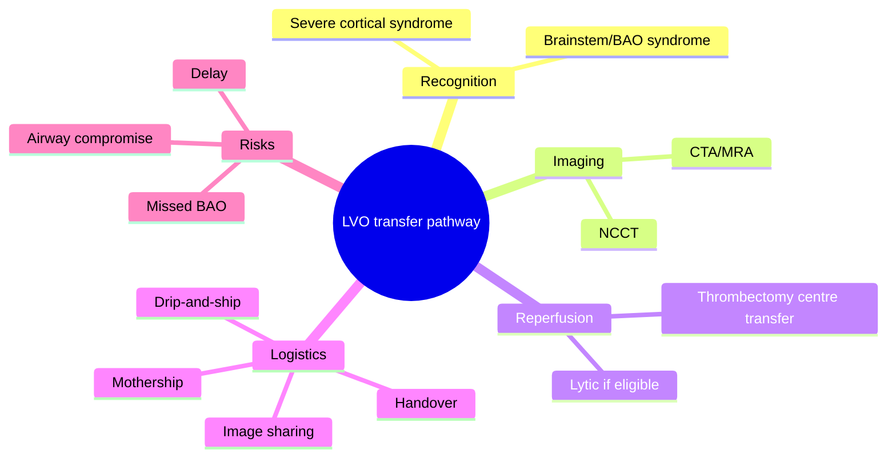

# Large-vessel occlusion transfer pathway

Related: [[../Stroke Medicine MOC|Stroke Medicine MOC]] · [[../Reperfusion Therapy|Reperfusion Therapy]] · [[Mechanical thrombectomy|Mechanical thrombectomy]] · [[Mechanical thrombectomy eligibility|Mechanical thrombectomy eligibility]] · [[Bridging therapy concept|Bridging therapy concept]] · [[../Special Stroke Scenarios/Basilar artery occlusion|Basilar artery occlusion]]

> [!important]
> In LVO stroke, **systems delay is brain loss**. The transfer pathway topic is about recognizing LVO early, imaging fast, starting eligible reperfusion without delay, and moving the patient efficiently to a thrombectomy-capable centre when needed.

## Learning Objectives
- Define the LVO transfer pathway in acute stroke systems of care.
- Outline key steps from first recognition to thrombectomy-capable centre arrival.
- Identify common transfer delays, workflow failures, and practical exam pearls.

## Definition
The **large-vessel occlusion transfer pathway** is the organized prehospital and in-hospital sequence used to identify patients with acute ischaemic stroke due to **LVO**, begin appropriate initial management, and transfer them rapidly to a **thrombectomy-capable centre** when that service is not immediately available.

## Core Anatomy
- LVO most often refers to major proximal occlusions such as **ICA** or **proximal MCA** in anterior circulation.
- It also includes important posterior circulation targets such as **basilar artery occlusion**.
- These occlusions threaten large or strategically vital brain territories, so delay has major disability consequences.

## Core Physiology
- LVO causes major reduction in cerebral perfusion with rapid loss of penumbra over time.
- Early thrombectomy can restore flow and reduce disability.
- Transfer delay allows infarct core expansion, worsens collaterals, and may turn a treatable patient into a poor candidate.
- Therefore, organized pathway speed is as important as individual treatment choice.

## Normal Values / Important Cut-offs
- Transfer urgency depends on **disabling symptoms**, **LVO confirmation/suspicion**, **time from onset**, and **available local capability**.
- CTA/MRA confirmation is central in many in-hospital pathways.
- IV thrombolysis should be given first when indicated and when it will not delay onward transfer.
- Large completed infarct, severe instability, or non-beneficial transfer scenarios may alter the pathway.

## Classification
### Pathway models
- **Drip-and-ship**: initial lytic/stabilization at first centre, then transfer
- **Mothership**: direct presentation to thrombectomy-capable centre
- **Direct-to-angio type pathway** in selected systems for strong LVO suspicion

### By pathway phase
- Prehospital recognition
- First-hospital imaging and stabilization
- Inter-hospital coordination and transport
- Arrival and thrombectomy activation

## Etiology / Causes
The pathway exists because LVO strokes arise from:
- Cardioembolism
- Large-artery atherothromboembolism
- Basilar thrombosis
- Tandem lesions in selected cases

## Risk Factors
### For LVO stroke itself
- Atrial fibrillation
- Hypertension
- Diabetes mellitus
- Dyslipidaemia
- Smoking
- Carotid/intracranial atherosclerosis

### For pathway delay/failure
- Failure to recognize cortical or posterior-circulation syndrome
- No early CTA
- Poor inter-hospital communication
- Waiting for non-essential tests
- Delayed transfer logistics
- Confusion about whether lytic therapy should happen before transfer

## Pathophysiology
In LVO stroke, a proximal arterial blockage deprives a large brain territory of blood supply. Even if the patient survives the initial event, each minute of delay allows progression from salvageable penumbra to irreversible infarct. Transfer pathways therefore function as a biological race against infarct expansion rather than a mere administrative exercise.

## Clinical Features
### Clinical clues suggesting LVO pathway activation
- Dense hemiparesis
- Aphasia
- Gaze deviation
- Severe neglect
- Severe cortical syndrome
- Sudden coma or devastating posterior circulation syndrome
- Brainstem signs suggesting BAO

### Pathway trigger caveats
- Some posterior-circulation LVOs may have deceptively low NIHSS.
- Wake-up stroke may still need urgent advanced imaging and transfer thinking.
- A patient may require transfer even after thrombolysis has already started.

## Approach / Algorithm

## Investigations
### Essential at first hospital
- Non-contrast CT head
- CTA/MRA when available to identify LVO
- Blood glucose
- BP assessment
- Basic reperfusion safety labs where indicated

### Transfer-related essentials
- Documentation of symptom onset/last-known-well
- NIHSS or practical deficit description
- Reperfusion treatments already given
- Imaging transfer/sharing with receiving centre
- Airway/hemodynamic stability assessment before transport

## Interpretation Frameworks
### LVO transfer checklist
1. Is this a **disabling stroke syndrome**?
2. Is LVO **confirmed or strongly suspected**?
3. Can **IV thrombolysis** be given locally without delaying transfer?
4. Is the patient **stable enough for transport** or does the airway need securing first?
5. Has the thrombectomy centre been alerted with imaging and timing details?

### Common pathway failures
| Failure | Why harmful |
|---|---|
| No CTA in suspected LVO | Delays recognition |
| Waiting for unnecessary tests | Wastes penumbra time |
| Giving lytic but forgetting transfer activation | Loses thrombectomy window |
| Poor handover/imaging transfer | Repeats work and delays treatment |
| Missing posterior circulation LVO | Catastrophic under-triage |

## Diagnosis
This is a **systems-of-care workflow topic**, not a separate disease diagnosis. It applies once acute ischemic stroke with suspected or confirmed **LVO** has been recognized.

## Differential Diagnosis
- Non-LVO ischemic stroke that does not need thrombectomy transfer
- Intracerebral hemorrhage
- Stroke mimic
- Very large completed infarct with poor expected endovascular benefit

## Tables / Comparison Charts
### Mothership vs drip-and-ship
| Model | Main idea | Strength | Limitation |
|---|---|---|---|
| Mothership | Direct to thrombectomy centre | Fast definitive care | May delay initial local treatment in some geographies |
| Drip-and-ship | First-hospital stabilization/lysis, then transfer | Allows early lytic/startup | Transfer delay risk |

### High-yield transfer pearls
| Pearl | Why important |
|---|---|
| Time of onset/last-known-well must travel with the patient | Central to reperfusion decisions |
| CTA images should be shared early | Prevents duplication and delay |
| BAO needs urgent pathway too | Posterior circulation can be missed |
| Lytic should not delay transfer | Avoids losing thrombectomy benefit |

## Management
### Prehospital/first-hospital principles
- Recognize possible LVO early using severe cortical or brainstem syndromes.
- Activate stroke pathway immediately.
- Obtain urgent CT ± CTA depending on capability.
- Give IV thrombolysis if indicated and it will not delay transfer.

### Transfer coordination
- Contact thrombectomy-capable centre early.
- Share imaging and clinical details promptly.
- Document onset time, anticoagulant history, BP, neurological status, airway status, and therapies already given.
- Arrange the fastest safe transport.

### Arrival at receiving centre
- Minimize repeat administrative delay.
- Move quickly into endovascular eligibility confirmation and angio-suite preparation.

## Drug Interactions / Contraindications / Comorbidity Cautions
- Anticoagulant history affects IV lytic decisions but does not always exclude thrombectomy transfer.
- Severe instability may require airway/ICU support before or during transfer.
- Large completed infarct may reduce thrombectomy benefit and affect urgency/value.
- Posterior circulation LVO should not be under-triaged because symptoms look “non-classic.”

## Procedures / Indications / Contraindications
- **IV thrombolysis** at first centre when eligible
- **Mechanical thrombectomy** at receiving centre for suitable LVO
- **Transfer itself** is a procedural systems step requiring safe transport and coordinated handover

## Procedure Mini-Sections
- **Procedure concept:** LVO transfer activation
- **Indications:** Suspected or confirmed disabling LVO stroke without immediate local thrombectomy access
- **Contraindications / cautions:** Medical instability, completed infarct/futility concerns, situations where transfer delays outweigh realistic benefit
- **Principle:** Move the right patient to the right centre without losing reperfusion time
- **Viva pearl:** Good stroke systems save brain before the catheter even touches the clot

## Complications
- Infarct expansion during delay
- Missed thrombectomy window
- Worsening consciousness or airway compromise during transport
- Repeat imaging delays from poor data transfer
- Under-triage of posterior-circulation LVO

## Red Flags / Emergencies
- Severe cortical syndrome with no CTA yet performed
- Confirmed LVO with no transfer call made
- Basilar artery occlusion at non-thrombectomy centre
- Neurological deterioration during transport wait
- Airway compromise in posterior circulation stroke

## Prognosis
Prognosis in LVO stroke improves when systems rapidly identify candidates and move them to thrombectomy-capable centres with minimal wasted time. Poor pathway performance can convert potentially reversible stroke into permanent disability.

## Topic Correlation
- [[Mechanical thrombectomy eligibility|Mechanical thrombectomy eligibility]]
- [[Bridging therapy concept|Bridging therapy concept]]
- [[Intravenous alteplase eligibility|Intravenous alteplase eligibility]]
- [[../Special Stroke Scenarios/Basilar artery occlusion|Basilar artery occlusion]]
- [[../Acute Ischaemic Stroke/Acute ischaemic stroke|Acute ischaemic stroke]]

## Special Situations
- **Basilar artery occlusion:** posterior LVO requires equally urgent transfer logic.
- **Drip-and-ship geography:** common when thrombectomy is centralized.
- **Wake-up stroke:** imaging may still support transfer for advanced reperfusion.
- **No CTA locally:** strong clinical suspicion may still justify urgent discussion with a higher centre depending on system protocol.

## FCPS/MRCP High-Yield Points
- LVO transfer pathway is a **systems emergency**.
- **CTA/MRA** is central to identifying thrombectomy targets.
- **IV thrombolysis should not delay transfer**.
- **Drip-and-ship** and **mothership** are key terms.
- Posterior-circulation LVO, especially **BAO**, must not be missed.

## Common Viva Questions
1. What is the LVO transfer pathway?
2. What information must be sent with the patient?
3. What is the difference between mothership and drip-and-ship?
4. Why should CTA be done early?
5. Why must thrombolysis not delay transfer?

## Common Confusions / Exam Traps
- Thinking transfer begins only after all labs are back.
- Forgetting to send CTA images and onset time.
- Missing BAO because the presentation is not a classic MCA syndrome.
- Treating inter-hospital transfer as administrative rather than biological urgency.

## Mnemonics
- **LVO MOVE**
  - **L**ocal recognition
  - **V**ascular imaging
  - **O**nset time documented
  - **M**ake transfer call early
  - **O**ffer lytic if eligible
  - **V**ehicle/transport arranged fast
  - **E**ndovascular team alerted

## Mind Map

## Flowchart

## Suggested Visuals / Image Notes
- Drip-and-ship vs mothership pathway diagram
- LVO transfer checklist card
- CTA-to-transfer workflow figure

## Suggested Video References
- Stroke systems-of-care and LVO transfer review
- Mechanical thrombectomy network workflow teaching
- Posterior circulation/LVO emergency logistics tutorial

## One-Page Revision Summary
### Large-Vessel Occlusion Transfer Pathway at a Glance
- **Goal:** move confirmed/suspected LVO stroke rapidly to a thrombectomy-capable centre
- **Need:** early recognition, CT ± CTA, onset time, fast communication
- **Give:** IV lytic locally if indicated **without delaying transfer**
- **Key models:** drip-and-ship, mothership
- **Do not miss:** basilar artery occlusion/posterior circulation LVO
- **Main threat:** systems delay causing loss of penumbra

## 24-Hour Recall Prompts
- Define drip-and-ship and mothership.
- Why is CTA so important in LVO transfer?
- What details must accompany the patient?
- Why should lytic not delay transfer?
- Why is BAO a common under-triage risk?

## 7-Day / 15-Day / 30-Day Revision Tracker
- **Day 1:** Recite the transfer pathway steps.
- **Day 7:** Compare mothership vs drip-and-ship.
- **Day 15:** Practice 3 LVO transfer vignettes.
- **Day 30:** Redo MCQs/SBAs and identify workflow gaps.

## Must Know / Should Know / Nice to Know
### Must Know
- Early CTA/MRA
- Transfer to thrombectomy centre
- Lytic should not delay transfer
- Drip-and-ship vs mothership
- BAO transfer urgency

### Should Know
- Handover essentials
- Airway/stability assessment before transport
- System-delay pitfalls

### Nice to Know
- Regional pathway design nuances beyond core exam need

## My Weak Points
- Do I remember onset time and CTA images must go with the patient?
- Do I think transfer is just admin instead of urgent biology?
- Can I recognize posterior-circulation LVO as a transfer emergency?

## Self-Test Scorecard
- Understanding /10
- Recall /10
- Workflow reasoning /10
- MCQ performance /10
- Viva confidence /10

**Guide:**
- **<35/50** = weak topic
- **35–44/50** = acceptable but not secure
- **45+/50** = strong exam-ready topic

## Exam Answer Modes
### Long-answer skeleton
1. Definition
2. Recognition of LVO
3. Imaging and first-hospital steps
4. Transfer models
5. Workflow pitfalls and prognosis

### Short-note skeleton
- Suspect LVO
- CT/CTA early
- Give lytic if eligible
- Transfer rapidly
- Do not miss BAO

### Viva skeleton
- “What is drip-and-ship?”
- “What information must travel with the patient?”
- “Why must CTA be done early?”
- “Why must lytic not delay transfer?”

## Summary
The large-vessel occlusion transfer pathway is the time-critical systems process that identifies LVO stroke early, performs urgent imaging, initiates any appropriate local reperfusion, and rapidly transfers the patient to a thrombectomy-capable centre. High-yield principles are early **CTA/MRA**, prompt communication, **drip-and-ship vs mothership** thinking, and the rule that **IV thrombolysis must not delay transfer**. Basilar artery occlusion is a key posterior-circulation transfer emergency.

## MCQs (10)
1. The primary goal of the LVO transfer pathway is to:
   A. Delay imaging for certainty  
   B. Move thrombectomy candidates rapidly to the right centre  
   C. Treat all strokes with aspirin only  
   D. Avoid vascular imaging

2. Which imaging study most directly identifies a thrombectomy target?
   A. CTA/MRA  
   B. Plain skull X-ray  
   C. ECG  
   D. Spirometry

3. Which pair of terms is classically associated with LVO systems of care?
   A. Drip-and-ship and mothership  
   B. Nephrotic and nephritic  
   C. STEMI and NSTEMI  
   D. COPD and asthma

4. IV thrombolysis at the first centre should be given:
   A. Only if it does not delay transfer in an eligible patient  
   B. Never in LVO stroke  
   C. Only after thrombectomy is finished  
   D. Without CT

5. Which posterior-circulation emergency must not be missed in the transfer pathway?
   A. Basilar artery occlusion  
   B. Benign positional vertigo  
   C. Tinnitus  
   D. Otitis externa

6. The most harmful pathway failure is often:
   A. Delay causing infarct expansion  
   B. Asking onset time  
   C. Sharing images  
   D. Calling the stroke team

7. Which patient most strongly needs thrombectomy transfer thinking?
   A. Aphasia, gaze deviation, dense hemiparesis with LVO on CTA  
   B. Chronic toe numbness  
   C. Tension headache  
   D. Stable neuropathy

8. Drip-and-ship means:
   A. Give lytic locally then transfer for thrombectomy  
   B. Send home with aspirin  
   C. Direct ICU discharge  
   D. Delay all reperfusion

9. What information is especially essential to send with the patient?
   A. Onset time and imaging  
   B. Shoe size only  
   C. Past dermatology note only  
   D. Vision chart alone

10. Why is LVO transfer a biological emergency rather than just administration?
    A. Salvageable penumbra is lost with delay  
    B. It improves hair growth  
    C. It reduces osteoarthritis  
    D. It treats infection

## SBA Questions (10)
1. A 65-year-old man at a non-thrombectomy hospital has aphasia, right hemiplegia, and CTA-confirmed left M1 occlusion. What is the next key systems step?  
   A. Immediate transfer activation to a thrombectomy-capable centre  
   B. Discharge after aspirin  
   C. Wait for all non-essential tests before acting  
   D. Delay until MRI next week  
   E. Cancel reperfusion planning

2. Why is CTA crucial in the LVO transfer pathway?  
   A. It identifies the target occlusion for thrombectomy planning  
   B. It replaces blood glucose testing  
   C. It proves all strokes are hemorrhagic  
   D. It removes the need for clinical exam  
   E. It measures anticoagulant dose

3. A patient at a first hospital is eligible for IV thrombolysis and transfer for thrombectomy. What is the best principle?  
   A. Give lytic if indicated but do not delay transfer  
   B. Delay all transfer until 24-hour repeat CT  
   C. Never give lytic in LVO  
   D. Ignore onset time  
   E. Wait for rehab review first

4. Which phrase best defines mothership?  
   A. Direct arrival at a thrombectomy-capable centre  
   B. Delayed imaging after admission  
   C. Local aspirin only pathway  
   D. ICU transfer after discharge  
   E. Posterior circulation mimic syndrome

5. A patient with sudden coma and brainstem signs at a non-thrombectomy hospital should raise concern for which transfer-sensitive condition?  
   A. Basilar artery occlusion  
   B. Tension headache  
   C. Lumbar spondylosis  
   D. Otitis media  
   E. Essential tremor

6. What is the most common operational error in LVO transfer?  
   A. Delayed recognition and transfer activation  
   B. Checking CT  
   C. Documenting onset time  
   D. Sharing images  
   E. Calling the receiving centre

7. Which information is most important in the transfer handover?  
   A. Onset time, deficit severity, imaging, and treatment already given  
   B. Favorite food and music only  
   C. Dermatology follow-up only  
   D. Old orthopedic X-rays  
   E. Dental history only

8. Why can posterior circulation LVO be under-triaged?  
   A. Symptoms may not resemble classic anterior cortical stroke  
   B. It never affects consciousness  
   C. CTA cannot detect it  
   D. It never needs thrombectomy  
   E. It always causes Bell palsy only

9. What is the physiologic consequence of transfer delay in LVO stroke?  
   A. Penumbra becomes infarct core  
   B. Hair loss stops  
   C. Cataracts improve  
   D. Kidney function normalizes  
   E. BP always falls

10. The best summary of the LVO transfer pathway is:  
    A. Early recognition, urgent imaging, rapid communication, and fast transfer to thrombectomy-capable care  
    B. Slow evaluation with repeated non-essential steps  
    C. Treat all strokes identically  
    D. Avoid CTA  
    E. Focus only on long-term prevention

## Flashcards
- Q: What is the main purpose of the LVO transfer pathway?  
  A: Rapid movement of appropriate LVO stroke patients to a thrombectomy-capable centre.
- Q: What imaging is central to identifying LVO?  
  A: CTA or MRA.
- Q: What does drip-and-ship mean?  
  A: Give lytic locally, then transfer for thrombectomy.
- Q: What does mothership mean?  
  A: Direct arrival at a thrombectomy-capable centre.
- Q: What key posterior circulation emergency must not be missed?  
  A: Basilar artery occlusion.
- Q: Should IV thrombolysis delay transfer in an eligible LVO patient?  
  A: No.
- Q: Name two clinical clues to LVO.  
  A: Aphasia/gaze deviation/dense hemiparesis or severe brainstem syndrome.
- Q: What must travel with the patient?  
  A: Onset time, imaging, clinical details, and treatment already given.
- Q: Why is transfer delay dangerous?  
  A: Salvageable penumbra is lost over time.
- Q: What is the core systems principle here?  
  A: Time-efficient coordinated reperfusion care.

## Answer Key with Explanations
### MCQs
1. **B** — The purpose is rapid access to thrombectomy-capable care.  
2. **A** — CTA/MRA identifies the occlusion.  
3. **A** — These are the classic LVO pathway models.  
4. **A** — Lytic should be given if indicated, but not at the cost of delayed transfer.  
5. **A** — BAO is the classic posterior circulation transfer emergency.  
6. **A** — Delay causes irreversible tissue loss.  
7. **A** — This is the classic anterior circulation LVO syndrome.  
8. **A** — That is the definition of drip-and-ship.  
9. **A** — Timing and imaging are central to receiving-centre decisions.  
10. **A** — Delay converts penumbra into infarct core.

### SBAs
1. **A** — Confirmed M1 occlusion at a non-thrombectomy centre requires immediate transfer activation.  
2. **A** — CTA identifies whether a treatable LVO exists.  
3. **A** — The rule is to treat eligible patients without losing thrombectomy time.  
4. **A** — Mothership refers to direct presentation to a thrombectomy-capable centre.  
5. **A** — Sudden coma plus brainstem signs strongly suggests BAO.  
6. **A** — Delayed recognition and transfer activation are common devastating workflow errors.  
7. **A** — These are the critical handover elements.  
8. **A** — Posterior circulation strokes may not look like classic cortical syndromes and can be missed.  
9. **A** — Ongoing delay enlarges irreversible infarct core.  
10. **A** — That is the correct systems summary of the LVO transfer pathway.