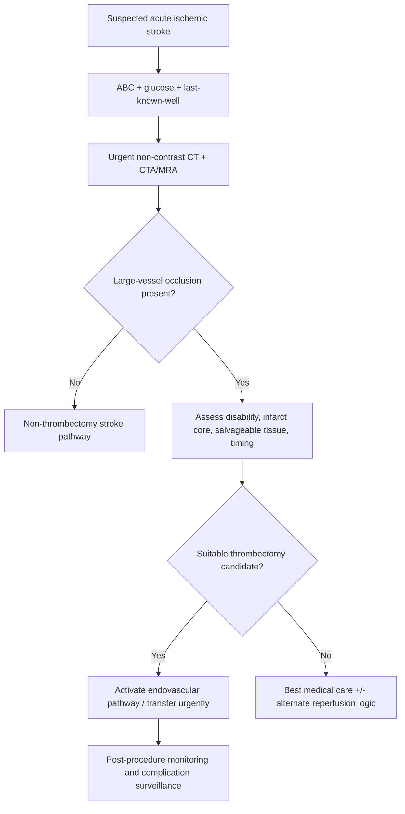
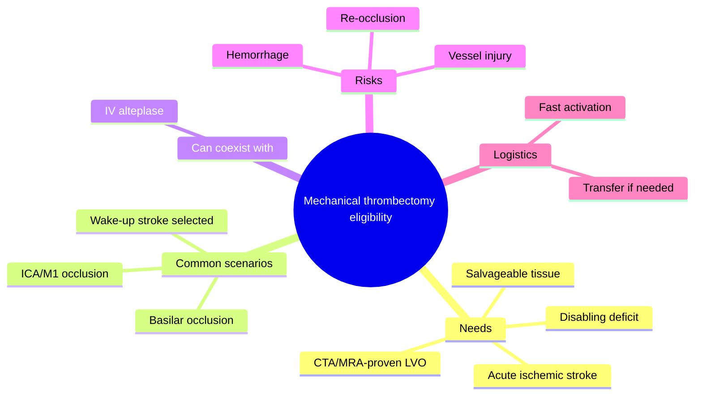
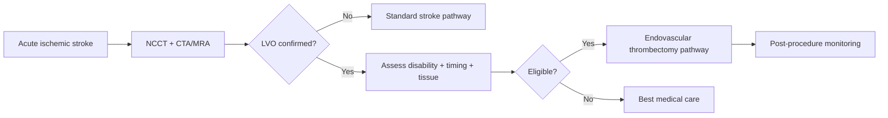

# Mechanical thrombectomy eligibility

Related: [[../Stroke Medicine MOC|Stroke Medicine MOC]] · [[../Reperfusion Therapy|Reperfusion Therapy]] · [[Mechanical thrombectomy|Mechanical thrombectomy]] · [[Intravenous alteplase eligibility|Intravenous alteplase eligibility]] · [[Large-vessel occlusion transfer pathway|Large-vessel occlusion transfer pathway]] · [[../Acute Ischaemic Stroke/Acute ischaemic stroke|Acute ischaemic stroke]]

> [!important]
> **Mechanical thrombectomy eligibility** is a time-critical decision in **acute ischaemic stroke with large-vessel occlusion (LVO)**. The key exam logic is: identify a disabling stroke, confirm a treatable LVO on vascular imaging, assess timing and salvageable tissue logic, and do not miss posterior or severe anterior circulation syndromes.

## Learning Objectives
- Define the role of mechanical thrombectomy in acute stroke.
- Recognize the core clinical and imaging features that support thrombectomy eligibility.
- Distinguish thrombectomy thinking from IV alteplase thinking while understanding that both may coexist.

## Definition
**Mechanical thrombectomy eligibility** means that a patient with acute ischaemic stroke has a clinical and imaging profile in which endovascular clot retrieval is likely to improve outcome by restoring perfusion to salvageable brain tissue in a treatable **large-vessel occlusion**.

## Core Anatomy
- Thrombectomy is most relevant for **proximal large-vessel occlusions**, especially in the **anterior circulation** such as **internal carotid artery** and **proximal middle cerebral artery** occlusions.
- Selected **posterior circulation** occlusions, especially **basilar artery occlusion**, may also be thrombectomy candidates.
- Large-vessel occlusion produces high-risk penumbral loss and often severe or disabling deficits.

## Core Physiology
- Proximal arterial occlusion blocks blood flow to large tissue territories.
- Without reperfusion, infarct core expands and penumbra is lost.
- Mechanical thrombectomy physically removes the clot and can restore flow even when IV thrombolysis alone is insufficient.
- Benefit depends on **time**, **collateral supply**, **infarct core burden**, and **clinical severity/disability**.

## Normal Values / Important Cut-offs
- Early treatment is best, but selected patients may still be eligible in **extended windows** using imaging-based selection.
- **CTA/MRA** is essential to prove LVO.
- A patient may still need thrombectomy even if they are also eligible for alteplase.
- Large established infarct core, absent salvageable tissue, or severe pre-existing limitation may alter benefit-risk balance.
- Posterior circulation thrombectomy thinking is especially important in **basilar artery occlusion**.

## Classification
### By vascular territory
- Anterior circulation thrombectomy candidates
- Posterior circulation thrombectomy candidates

### By timing framework
- Early-window thrombectomy candidate
- Extended-window thrombectomy candidate selected by imaging/clinical profile

### By reperfusion relationship
- Thrombectomy **with bridging IV thrombolysis** when eligible
- Thrombectomy **without thrombolysis** when alteplase is contraindicated or not suitable

## Etiology / Causes
This topic applies to stroke mechanisms that produce LVO, including:
- Cardioembolism
- Large-artery atherosclerotic thrombosis/embolism
- Tandem lesions in selected cases
- Basilar thrombosis

## Risk Factors
- Atrial fibrillation
- Hypertension
- Diabetes mellitus
- Dyslipidaemia
- Smoking
- Carotid or intracranial atherosclerotic disease
- Previous TIA/stroke

## Pathophysiology
A large proximal clot suddenly shuts off perfusion to a major vascular territory. Thrombolysis may fail to recanalize large clots quickly enough. Mechanical thrombectomy removes the clot directly, restoring blood flow to threatened but salvageable tissue. The chance of benefit falls as infarct core enlarges and collateral support fails.

## Clinical Features
### Clinical situations suggesting thrombectomy consideration
- Severe or clearly disabling acute ischaemic stroke
- Cortical syndrome suggesting LVO: gaze deviation, aphasia, neglect, dense hemiparesis
- Sudden profound posterior-circulation syndrome such as BAO
- LVO seen or strongly suspected on vascular imaging
- Large mismatch between clinical deficit and established infarct burden

### Important caveats
- Some LVO patients may not look profoundly severe at first, especially posterior circulation stroke.
- Low NIHSS does not always exclude a clinically important LVO if the syndrome is disabling.
- Wake-up stroke may still enter an imaging-selected thrombectomy pathway.

## Approach / Algorithm

## Investigations
### Essential
- Non-contrast CT head to exclude hemorrhage
- **CT angiography** or **MR angiography** to confirm LVO
- Clinical stroke severity/disability assessment
- Glucose
- CBC, renal function, electrolytes
- Coagulation status when reperfusion decisions are being made

### Additional / selective
- CT perfusion or MRI-based tissue selection in extended windows where used
- ECG and cardiac monitoring for embolic source
- Repeat imaging depending on evolution and procedure planning

## Interpretation Frameworks
### Core thrombectomy decision questions
1. Is this an **acute ischaemic stroke**?
2. Is there a **treatable large-vessel occlusion**?
3. Is the deficit **disabling/severe enough** to justify intervention?
4. Is there enough **salvageable tissue** or acceptable infarct-core burden?
5. Is the patient within an **early or imaging-selected extended window**?
6. Does the patient need **bridging alteplase** as well?

### Typical LVO clues
| Clinical clue | Why it matters |
|---|---|
| Aphasia + gaze deviation + dense hemiparesis | Suggests proximal anterior circulation LVO |
| Severe neglect | Suggests major hemispheric cortical involvement |
| Sudden coma/brainstem syndrome | Suggests basilar occlusion |
| Clinical deficit worse than early CT changes | May indicate salvageable penumbra |

## Diagnosis
This is a **treatment eligibility decision** made after diagnosing acute ischaemic stroke and confirming a treatable **large-vessel occlusion** on vascular imaging.

## Differential Diagnosis
- Acute ischaemic stroke without LVO
- Intracerebral hemorrhage
- Stroke mimic such as hypoglycaemia or seizure
- Very large completed infarct with little salvageable tissue
- Severe comorbidity or premorbid status making procedure benefit unlikely

## Tables / Comparison Charts
### Alteplase vs thrombectomy
| Feature | IV alteplase | Mechanical thrombectomy |
|---|---|---|
| Main target | Pharmacologic clot lysis | Endovascular clot retrieval |
| Best niche | Early eligible ischemic stroke | Confirmed LVO |
| Imaging need | CT excludes bleed | CT excludes bleed + vascular imaging confirms LVO |
| Can coexist? | Yes | Yes |

### Who should trigger thrombectomy thinking?
| Scenario | Thrombectomy relevance |
|---|---|
| ICA/M1 occlusion with disabling deficit | High |
| Basilar artery occlusion | High |
| Distal small-vessel stroke | Usually lower |
| No LVO on CTA/MRA | Not eligible as thrombectomy target |

## Management
### Core management logic
- Do not delay vascular imaging in suspected LVO.
- If LVO is confirmed and the patient is suitable, activate **endovascular stroke pathway** urgently.
- If the patient is also eligible for IV alteplase, thrombectomy assessment proceeds **in parallel**, not instead of it.
- If thrombectomy is unavailable locally, arrange **rapid transfer** according to stroke network pathway.

### Peri-procedural considerations
- BP and airway management
- Coordination between stroke, radiology, anaesthesia, and neurointervention teams
- Careful documentation of onset/last-known-well time
- Monitoring for reperfusion success and complications

### After thrombectomy
- Stroke-unit/ICU monitoring
- Repeat imaging as protocol requires
- Watch for reperfusion injury, hemorrhage, edema, or re-occlusion
- Continue mechanism-directed secondary prevention afterward

## Drug Interactions / Contraindications / Comorbidity Cautions
- Alteplase contraindications do **not automatically** eliminate thrombectomy candidacy if LVO is present.
- Very large completed infarct burden may reduce benefit and increase harm.
- Severe frailty, poor premorbid functional status, or major comorbidity may affect decision-making.
- Sedation/anaesthesia decisions can affect BP and neurological monitoring.
- Anticoagulation history matters for overall reperfusion planning but is not identical to alteplase-only logic.

## Procedures / Indications / Contraindications
- **Mechanical thrombectomy**: indicated for selected acute ischaemic stroke patients with confirmed treatable LVO and appropriate imaging-clinical profile.
- **Transfer to thrombectomy-capable centre**: when local capability is absent.
- **Bridging thrombolysis**: if alteplase criteria are also met.

## Procedure Mini-Sections
- **Procedure:** Endovascular mechanical thrombectomy
- **Indications:** Confirmed LVO with disabling stroke and favorable timing/imaging profile
- **Contraindications / cautions:** Large completed infarct, lack of meaningful salvageable tissue, procedural futility concerns, bleeding/procedural risks depending on context
- **Principle:** Catheter-based clot retrieval restores perfusion
- **Complications:** Intracranial hemorrhage, vessel injury, embolization to new territory, edema, reperfusion injury
- **Viva pearl:** In LVO stroke, thrombectomy thinking must happen fast and often in parallel with alteplase thinking

## Complications
- Symptomatic intracranial hemorrhage
- Failed recanalization
- Re-occlusion
- Distal embolization
- Cerebral edema
- Access-site complications

## Red Flags / Emergencies
- Suspected LVO with rapidly evolving deficit
- Basilar artery occlusion
- Wake-up stroke with disabling syndrome and possible salvageable tissue
- Deterioration during inter-hospital transfer delay
- Post-procedural neurological worsening

## Prognosis
When performed in an appropriate patient promptly, thrombectomy can dramatically improve functional outcome in LVO stroke. Prognosis depends on time to reperfusion, collateral circulation, infarct core size, occlusion site, reperfusion success, age, and complications.

## Topic Correlation
- [[Intravenous alteplase eligibility|Intravenous alteplase eligibility]]
- [[Large-vessel occlusion transfer pathway|Large-vessel occlusion transfer pathway]]
- [[Bridging therapy concept|Bridging therapy concept]]
- [[../Special Stroke Scenarios/Basilar artery occlusion|Basilar artery occlusion]]
- [[../Acute Ischaemic Stroke/Acute ischaemic stroke|Acute ischaemic stroke]]

## Special Situations
- **Basilar artery occlusion:** posterior circulation thrombectomy thinking is vital.
- **Wake-up stroke:** imaging-based selection may still allow thrombectomy.
- **Alteplase-ineligible patient with LVO:** thrombectomy may still be appropriate.
- **Low-NIHSS but disabling LVO:** do not dismiss solely because the score is modest.

## FCPS/MRCP High-Yield Points
- Thrombectomy is for **confirmed LVO**, not every ischemic stroke.
- **CTA/MRA** is essential.
- It may be indicated even when alteplase is contraindicated.
- **Basilar artery occlusion** is a key posterior-circulation thrombectomy scenario.
- Timing matters, but selected patients can still be treated in extended windows using imaging-based logic.

## Common Viva Questions
1. Which stroke patients should make you think of thrombectomy?
2. Why is CTA important in acute stroke?
3. Can a patient receive both alteplase and thrombectomy?
4. Why may thrombectomy still be relevant when alteplase is contraindicated?
5. What are the main complications of thrombectomy?

## Common Confusions / Exam Traps
- Thinking alteplase and thrombectomy are mutually exclusive.
- Forgetting vascular imaging in suspected LVO.
- Assuming a low NIHSS always rules out thrombectomy need.
- Missing posterior circulation thrombectomy candidates such as BAO.
- Ignoring transfer logistics in a non-thrombectomy centre.

## Mnemonics
- **LVO = LOOK VASCULARLY OBLIGATORY**
- **THROMBECTOMY**
  - **T**ime / tissue
  - **H**emorrhage excluded
  - **R**adiology confirms LVO
  - **O**utcome benefit expected
  - **M**echanical retrieval
  - **B**ridging alteplase may coexist

## Mind Map

## Flowchart

## Suggested Visuals / Image Notes
- LVO stroke pathway diagram
- CTA examples of ICA/M1 occlusion and basilar occlusion
- Thrombectomy vs alteplase comparison chart

## Suggested Video References
- Mechanical thrombectomy eligibility and workflow review
- CTA interpretation for LVO
- Hyperacute stroke reperfusion decision-making

## One-Page Revision Summary
### Mechanical Thrombectomy Eligibility at a Glance
- **Use:** selected acute ischaemic stroke with **confirmed large-vessel occlusion**
- **Need:** CT to exclude bleed + **CTA/MRA** to prove LVO
- **Common sites:** ICA, proximal MCA, selected basilar artery occlusion
- **Think about:** disabling deficit, salvageable tissue, timing, transfer logistics
- **May coexist with:** **IV alteplase**
- **May still be used if alteplase contraindicated**
- **Major risks:** hemorrhage, vessel injury, failed recanalization

## 24-Hour Recall Prompts
- Name the key imaging step that makes thrombectomy possible.
- Which occlusion sites should immediately trigger thrombectomy thinking?
- Can alteplase and thrombectomy be used together?
- Why can thrombectomy still matter when alteplase is contraindicated?
- Why is basilar artery occlusion an important special scenario?

## 7-Day / 15-Day / 30-Day Revision Tracker
- **Day 1:** Reproduce the thrombectomy pathway from memory.
- **Day 7:** Compare alteplase eligibility with thrombectomy eligibility.
- **Day 15:** Practice 5 LVO case vignettes.
- **Day 30:** Redo questions and identify imaging-selection weak points.

## Must Know / Should Know / Nice to Know
### Must Know
- CTA/MRA-proven LVO
- Disabling stroke syndrome
- Time/tissue logic
- Basilar artery occlusion relevance
- Alteplase and thrombectomy can coexist

### Should Know
- Transfer to thrombectomy-capable centre
- Extended-window imaging-based selection
- Post-procedure complications

### Nice to Know
- Detailed device/procedural nuances
- Advanced perfusion-core mismatch thresholds beyond exam core

## My Weak Points
- Do I remember that CTA/MRA is essential?
- Do I wrongly think thrombectomy and alteplase are mutually exclusive?
- Can I identify posterior-circulation thrombectomy scenarios?

## Self-Test Scorecard
- Understanding /10
- Recall /10
- Imaging-based triage /10
- MCQ performance /10
- Viva confidence /10

**Guide:**
- **<35/50** = weak topic
- **35–44/50** = acceptable but not secure
- **45+/50** = strong exam-ready topic

## Exam Answer Modes
### Long-answer skeleton
1. Definition and rationale
2. Clinical clues to LVO
3. Imaging confirmation
4. Eligibility logic
5. Relationship with alteplase
6. Complications and prognosis

### Short-note skeleton
- What thrombectomy is
- Who is eligible
- CTA/MRA role
- Anterior/posterior circulation examples
- Main cautions

### Viva skeleton
- “Who gets thrombectomy?”
- “What imaging do you need?”
- “Can you also give alteplase?”
- “What are the major complications?”

## Summary
Mechanical thrombectomy eligibility is a reperfusion decision for **acute ischaemic stroke with confirmed large-vessel occlusion**. The essential steps are to confirm ischemic stroke, exclude hemorrhage, prove LVO on **CTA/MRA**, judge whether the deficit is disabling and the tissue still salvageable, and move rapidly into an endovascular pathway or transfer. It is especially important in major anterior circulation LVO and in **basilar artery occlusion**, and it may be combined with IV alteplase when appropriate.

## MCQs (10)
1. Mechanical thrombectomy is primarily intended for patients with:
   A. Large-vessel occlusion  
   B. Peripheral neuropathy  
   C. Intracerebral hemorrhage  
   D. Migraine aura

2. The most essential imaging test to confirm thrombectomy target anatomy is:
   A. CTA or MRA  
   B. Skull X-ray  
   C. EEG  
   D. Spirometry

3. Which stroke syndrome most strongly suggests an anterior-circulation LVO?
   A. Aphasia with gaze deviation and dense hemiparesis  
   B. Chronic back pain  
   C. Isolated toe numbness  
   D. Tinnitus alone

4. Which statement about alteplase and thrombectomy is correct?
   A. They are always mutually exclusive  
   B. They may coexist in the same patient  
   C. Thrombectomy is only for hemorrhage  
   D. Alteplase must always be given after thrombectomy only

5. Which posterior-circulation scenario is especially important for thrombectomy thinking?
   A. Bell palsy  
   B. Basilar artery occlusion  
   C. Trigeminal neuralgia  
   D. Ménière disease

6. Which factor most strongly reduces potential thrombectomy benefit?
   A. Large completed infarct core with little salvageable tissue  
   B. Controlled diabetes  
   C. Speech therapy review  
   D. Normal temperature

7. A patient may still be considered for thrombectomy even if:
   A. Alteplase is contraindicated  
   B. No LVO is present  
   C. The event is a hemorrhage  
   D. Symptoms resolved completely yesterday

8. What is the core procedural principle of thrombectomy?
   A. Endovascular clot retrieval  
   B. Lowering CSF pressure  
   C. Chronic anticoagulation  
   D. Tumor excision

9. Which is a recognized complication of thrombectomy?
   A. Vessel injury or distal embolization  
   B. Cataract  
   C. Osteoporosis  
   D. Peptic ulcer cure

10. If a hospital cannot perform thrombectomy locally, the next principle is:
    A. Rapid transfer through stroke network pathway  
    B. Cancel reperfusion thinking  
    C. Delay all action for 24 hours  
    D. Use antibiotics only

## SBA Questions (10)
1. A 68-year-old woman presents with sudden aphasia, right hemiplegia, and left gaze deviation. CT excludes hemorrhage. CTA shows left M1 occlusion. What is the best reperfusion concept?  
   A. Mechanical thrombectomy pathway should be activated urgently  
   B. Discharge if BP is normal  
   C. No further reperfusion is useful  
   D. Treat as migraine  
   E. Start only physiotherapy

2. A patient has acute ischemic stroke with confirmed LVO but is not eligible for alteplase because of a bleeding contraindication. What is the most important principle?  
   A. Thrombectomy may still be appropriate  
   B. All reperfusion options are automatically closed  
   C. CTA is irrelevant  
   D. Stroke has become hemorrhagic  
   E. Only aspirin matters now

3. Why is CTA/MRA essential in thrombectomy selection?  
   A. It confirms the treatable large-vessel occlusion  
   B. It diagnoses peptic ulcer disease  
   C. It replaces all clinical examination  
   D. It proves hemorrhage better than CT always  
   E. It measures HbA1c

4. A patient with sudden coma, abnormal eye movements, and quadriparesis is found to have BAO. What is the reperfusion implication?  
   A. Posterior-circulation thrombectomy thinking is crucial  
   B. Thrombectomy is never relevant in posterior stroke  
   C. CTA is unnecessary  
   D. Only vestibular treatment is required  
   E. Delay management until next week

5. Which patient is least likely to benefit from thrombectomy?  
   A. Large completed infarct with minimal salvageable tissue  
   B. Disabling stroke with confirmed M1 occlusion  
   C. Basilar occlusion with severe brainstem syndrome  
   D. Wake-up stroke selected by favorable imaging  
   E. ICA occlusion with major deficit

6. What is the best relationship between alteplase and thrombectomy in an eligible LVO patient?  
   A. They may be used in parallel according to protocol  
   B. One permanently forbids the other  
   C. Alteplase means CTA should not be done  
   D. Thrombectomy is only after 1 month  
   E. Neither can ever be used in stroke

7. A district hospital identifies an LVO on CTA but has no thrombectomy service. What is the best next principle?  
   A. Rapid transfer to a thrombectomy-capable centre  
   B. Stop all stroke care  
   C. Repeat CTA every 2 days  
   D. Send the patient home  
   E. Treat only with vitamins

8. What is the main physiologic goal of thrombectomy?  
   A. Restore perfusion to salvageable penumbra  
   B. Produce sedation only  
   C. Lower blood glucose permanently  
   D. Prevent all future hypertension  
   E. Treat meningitis

9. Which clinical clue strongly supports LVO thinking?  
   A. Dense cortical syndrome with aphasia/neglect  
   B. Chronic mild tinnitus  
   C. Isolated ankle pain  
   D. Tremor for several years  
   E. Seasonal rhinitis

10. Which is a major post-thrombectomy complication to monitor for?  
    A. Symptomatic intracranial hemorrhage  
    B. Cataract progression  
    C. Otitis externa  
    D. Gout flare only  
    E. Appendicitis

## Flashcards
- Q: What imaging is essential to confirm thrombectomy eligibility?  
  A: CTA or MRA showing a treatable LVO.
- Q: Name two classic anterior-circulation thrombectomy targets.  
  A: ICA occlusion and proximal MCA occlusion.
- Q: Which posterior-circulation occlusion is a key thrombectomy scenario?  
  A: Basilar artery occlusion.
- Q: Can thrombectomy still be used if alteplase is contraindicated?  
  A: Yes, in appropriate LVO patients.
- Q: Can alteplase and thrombectomy be used together?  
  A: Yes, they may coexist according to protocol.
- Q: What tissue concept drives thrombectomy benefit?  
  A: Salvageable penumbra with acceptable infarct core.
- Q: What is the main procedural method in thrombectomy?  
  A: Endovascular clot retrieval.
- Q: Name one major thrombectomy complication.  
  A: Intracranial hemorrhage, vessel injury, or distal embolization.
- Q: What should a non-thrombectomy hospital do after confirming LVO?  
  A: Arrange rapid transfer to a thrombectomy-capable center.
- Q: Why can a low NIHSS be misleading?  
  A: Some disabling or posterior-circulation LVOs may have deceptively modest scores.

## Answer Key with Explanations
### MCQs
1. **A** — Thrombectomy targets acute stroke with large-vessel occlusion.  
2. **A** — CTA/MRA is essential to identify the target occlusion.  
3. **A** — Aphasia, gaze deviation, and dense hemiparesis are classic LVO cortical clues.  
4. **B** — Alteplase and thrombectomy can coexist in eligible patients.  
5. **B** — Basilar artery occlusion is a major posterior-circulation thrombectomy scenario.  
6. **A** — Very large completed infarct with little salvageable tissue reduces benefit.  
7. **A** — Thrombectomy may still be appropriate even if alteplase cannot be given.  
8. **A** — The procedure uses endovascular clot retrieval.  
9. **A** — Vessel injury and distal embolization are recognized complications.  
10. **A** — If the service is unavailable locally, urgent transfer is the next key step.

### SBAs
1. **A** — Confirmed M1 occlusion with disabling stroke is a classic urgent thrombectomy candidate.  
2. **A** — Alteplase contraindication does not automatically eliminate thrombectomy candidacy.  
3. **A** — CTA/MRA proves whether a treatable LVO exists.  
4. **A** — BAO is a crucial posterior-circulation thrombectomy scenario.  
5. **A** — Large completed infarct with little salvageable tissue is least likely to benefit.  
6. **A** — In the right patient, alteplase and thrombectomy are complementary, not mutually exclusive.  
7. **A** — Rapid transfer is essential when LVO is confirmed in a non-thrombectomy centre.  
8. **A** — The aim is reperfusion of threatened but salvageable tissue.  
9. **A** — Dense cortical deficits such as aphasia/neglect strongly suggest LVO.  
10. **A** — Hemorrhage is a major complication to monitor after thrombectomy.
