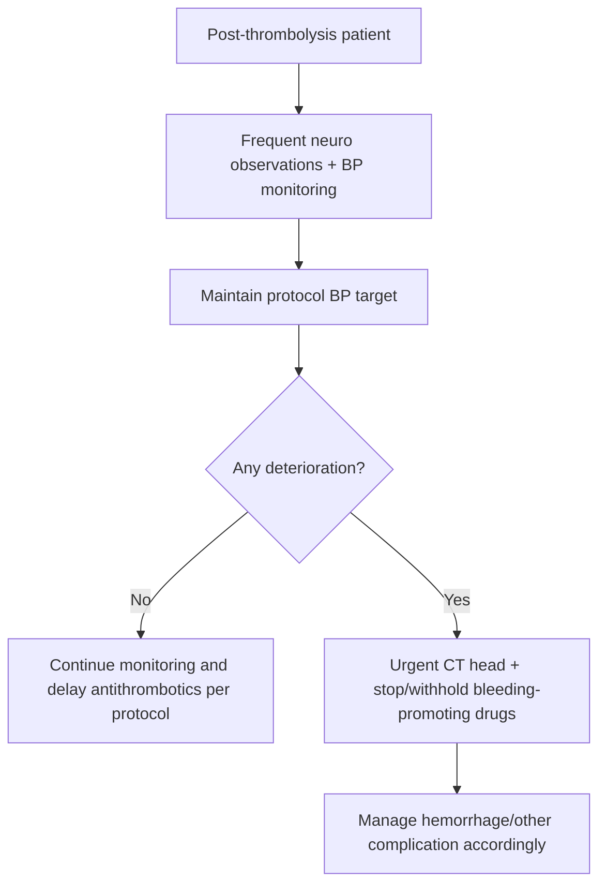
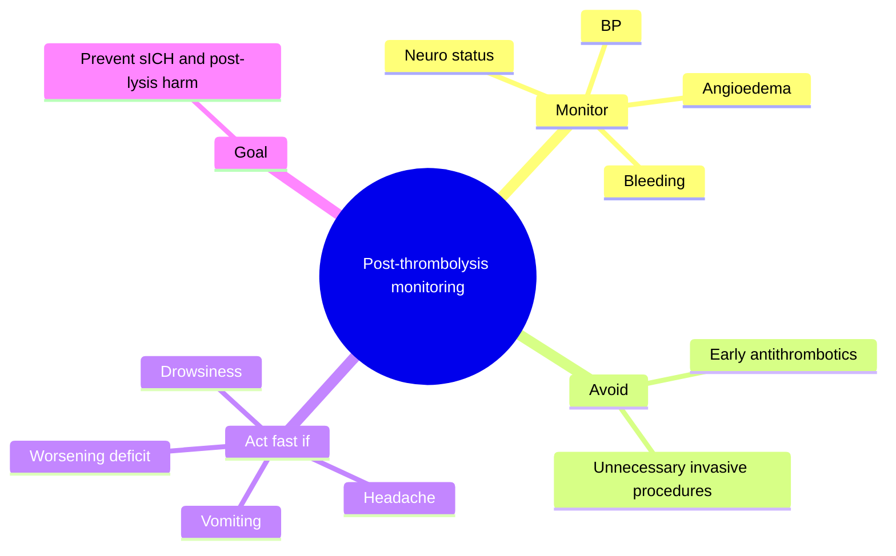
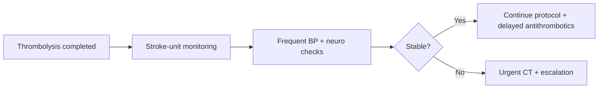

# Post-thrombolysis monitoring and BP targets

Related: [[../Stroke Medicine MOC|Stroke Medicine MOC]] · [[../Reperfusion Therapy|Reperfusion Therapy]] · [[Reperfusion complications|Reperfusion complications]] · [[Intravenous alteplase eligibility|Intravenous alteplase eligibility]] · [[Thrombolysis contraindications and bleeding-risk cautions|Thrombolysis contraindications and bleeding-risk cautions]] · [[Symptomatic intracranial haemorrhage after reperfusion|Symptomatic intracranial haemorrhage after reperfusion]]

> [!important]
> After thrombolysis, the patient enters a **high-risk observation phase**. The exam core is simple: close neurological monitoring, tight attention to **blood pressure**, avoidance of unnecessary invasive procedures, and rapid action if deterioration suggests hemorrhage.

## Learning Objectives
- State the goals of post-thrombolysis monitoring.
- Explain why BP control matters after thrombolysis.
- Recognize common monitoring priorities, red flags, and post-lysis precautions.

## Definition
**Post-thrombolysis monitoring and BP targets** refers to the structured observation and physiological control period after IV thrombolysis for acute ischaemic stroke, aimed at maximizing reperfusion benefit and preventing complications such as **symptomatic intracranial haemorrhage**.

## Core Anatomy
- Recently reperfused ischemic brain tissue is fragile and vulnerable to hemorrhagic transformation.
- Large cortical infarcts, deep infarcts, or tissue with marked ischemic injury are especially at risk.
- BP excess may stress damaged cerebral vessels and worsen post-lysis bleeding.

## Core Physiology
- Recanalization can improve perfusion but also exposes damaged microvasculature to renewed pressure and flow.
- BP management seeks to reduce hemorrhagic risk without causing hypoperfusion.
- Close monitoring detects deterioration from hemorrhage, edema, angioedema, or recurrent vascular events.

## Normal Values / Important Cut-offs
- After thrombolysis, **BP must remain within protocol-safe targets**; this is one of the highest-yield exam points.
- Frequent neurological observations are required during the early post-lysis period.
- Antiplatelet and anticoagulant therapy are usually delayed until protocol imaging confirms it is safe.
- Any sudden neuro worsening, severe headache, vomiting, or reduced consciousness should trigger urgent imaging.

## Classification
### Monitoring domains
- Neurological monitoring
- BP monitoring and control
- Bleeding surveillance
- Airway/swallow/aspiration precautions
- Post-reperfusion complication surveillance

## Etiology / Causes
This topic concerns **post-treatment care** rather than stroke etiology. Monitoring is necessary because thrombolysis creates risk of:
- Intracranial hemorrhage
- Systemic bleeding
- Angioedema
- Reperfusion-related deterioration
- BP-related bleeding complications

## Risk Factors
- Large infarct burden
- Severe pre-treatment hypertension
- Unstable post-thrombolysis BP
- Older frailty
- Anticoagulant/coagulopathy issues
- Hyperglycaemia and severe stroke

## Pathophysiology
After lytic therapy, vessel recanalization may be beneficial but fragile ischemic vascular beds remain prone to leakage. Excessive BP can promote extravasation and hematoma formation. Early clinical monitoring is therefore essential to identify bleeding or worsening before it becomes catastrophic.

## Clinical Features
### What to monitor actively
- Level of consciousness
- New or worsening focal deficits
- Headache
- Nausea/vomiting
- BP trend
- Signs of systemic bleeding
- Orolingual swelling/angioedema

### High-risk warning signs
- Sudden worsening NIHSS/neurological status
- Severe headache after thrombolysis
- Acute hypertension spike
- Drowsiness or coma
- Airway swelling/stridor in angioedema

## Approach / Algorithm

## Investigations
### Routine/expected monitoring
- Serial neurological assessment
- Repeated BP measurement
- Observation for bleeding and angioedema
- Follow-up CT/MRI per protocol before restarting some antithrombotics

### If deterioration occurs
- Urgent non-contrast CT head
- CBC/coagulation review if bleeding suspected
- Targeted reassessment of oxygenation, glucose, and airway status

## Interpretation Frameworks
### Post-thrombolysis monitoring priorities
| Priority | Why important |
|---|---|
| Neuro observations | Detect sICH or re-occlusion early |
| BP control | Reduces bleed risk |
| Delayed antithrombotics | Avoids provoking early bleeding |
| Swallow/airway attention | Prevents aspiration and missed angioedema |

### When to scan urgently
| Trigger | Action |
|---|---|
| New worsening deficit | CT urgently |
| Headache/vomiting | CT urgently |
| Reduced consciousness | CT urgently |
| Suspected bleed/angioedema/systemic instability | Escalate urgently |

## Diagnosis
This is a **post-treatment management topic**, not a separate disease diagnosis. It applies to the early observation period after thrombolysis.

## Differential Diagnosis
When a patient deteriorates after thrombolysis, think of:
- Symptomatic intracranial hemorrhage
- Cerebral edema
- Re-occlusion/failure of reperfusion
- Seizure
- Hypoxia/aspiration
- Angioedema

## Tables / Comparison Charts
### Post-thrombolysis do's and don'ts
| Do | Why |
|---|---|
| Monitor neuro status closely | Detect complications early |
| Control BP carefully | Reduce bleed risk |
| Delay antithrombotics per protocol | Avoid early hemorrhage |
| Scan urgently if worsening occurs | Time-critical diagnosis |

| Don’t | Why |
|---|---|
| Ignore headache or new decline | Could be sICH |
| Allow uncontrolled BP | Increases bleed risk |
| Restart antiplatelets/anticoagulants too early | May worsen bleeding |
| Perform unnecessary invasive procedures casually | Bleeding risk |

## Management
### Core post-thrombolysis care
- Admit to monitored stroke-unit/HDU setting.
- Perform frequent neurological assessments.
- Maintain BP within post-thrombolysis protocol target range.
- Observe for intracranial and systemic bleeding.
- Watch for angioedema, especially if ACE-inhibitor exposure/history is relevant.

### Medication/procedure caution
- Antiplatelet and anticoagulant therapy are usually withheld until follow-up imaging/protocol allows.
- Avoid unnecessary invasive procedures soon after thrombolysis when possible.
- If BP rises above target, treat promptly according to protocol.

### If deterioration occurs
- Urgent CT head
- Stop/withhold bleeding-promoting medications
- Escalate to neurocritical care as needed

## Drug Interactions / Contraindications / Comorbidity Cautions
- Post-thrombolysis antithrombotic timing must be cautious.
- ACE inhibitor use may be relevant to orolingual angioedema risk.
- Severe hypertension after lysis is dangerous and must not be ignored.
- Frail or elderly patients may deteriorate rapidly with even modest hemorrhage.

## Procedures / Indications / Contraindications
- **Routine repeated monitoring** is the key “procedure” here.
- **Urgent CT head** if deterioration occurs.
- Avoid unnecessary arterial punctures or invasive procedures early after lysis unless clearly necessary.

## Procedure Mini-Sections
- **Procedure concept:** Post-lysis observation protocol
- **Indications:** All thrombolysed stroke patients
- **Contraindications/cautions:** None to monitoring itself; rather, invasive interventions require extra bleeding caution
- **Viva pearl:** Successful thrombolysis is not the end of the emergency—monitoring is part of the treatment

## Complications
- Symptomatic intracranial hemorrhage
- Systemic bleeding
- Angioedema
- Reperfusion failure/re-occlusion
- Aspiration complications if swallow is missed

## Red Flags / Emergencies
- Acute severe headache after lysis
- New vomiting
- Worsening deficit
- Reduced consciousness
- Rising severe BP
- Orolingual swelling/airway compromise

## Prognosis
Good outcome depends not only on giving thrombolysis but also on safely navigating the high-risk post-treatment period. Missed BP surges or delayed recognition of hemorrhage worsen prognosis.

## Topic Correlation
- [[Symptomatic intracranial haemorrhage after reperfusion|Symptomatic intracranial haemorrhage after reperfusion]]
- [[Thrombolysis contraindications and bleeding-risk cautions|Thrombolysis contraindications and bleeding-risk cautions]]
- [[Intravenous alteplase eligibility|Intravenous alteplase eligibility]]
- [[Reperfusion failure and rescue planning concepts|Reperfusion failure and rescue planning concepts]]
- [[../Stroke Unit Care and Complications/Physiological optimization|Physiological optimization]]

## Special Situations
- **Large infarct:** monitor even more cautiously for bleed and edema.
- **LVO/thrombectomy candidate after lysis:** monitoring continues through transfer/procedure phases.
- **Angioedema:** airway attention may become more urgent than the neurological exam temporarily.

## FCPS/MRCP High-Yield Points
- Post-thrombolysis care is an extension of hyperacute stroke treatment.
- **BP control** is a classic exam priority.
- Any deterioration after lysis means **urgent CT**.
- Delay antithrombotics until protocol imaging says it is safe.
- Watch for **sICH** and **angioedema**.

## Common Viva Questions
1. Why is BP control important after thrombolysis?
2. What are the main things you monitor after alteplase?
3. When do you do urgent CT after lysis?
4. Why are antiplatelets/anticoagulants delayed?
5. What airway complication can follow thrombolysis?

## Common Confusions / Exam Traps
- Assuming thrombolysis success means the emergency is over.
- Restarting antithrombotics too early.
- Underestimating the importance of BP in the first post-lysis period.
- Missing angioedema because attention is focused only on limb power.

## Mnemonics
- **POST LYSIS**
  - **P**ressure control
  - **O**bserve neurology
  - **S**can if worsening
  - **T**hrombotics delayed
  - **L**ook for bleed
  - **Y**awn/drowsiness = red flag
  - **S**welling of tongue = angioedema
  - **I**nvasive procedures avoided if possible
  - **S**troke-unit monitoring

## Mind Map

## Flowchart

## Suggested Visuals / Image Notes
- Post-thrombolysis monitoring checklist card
- BP and neuro-observation workflow diagram
- Angioedema recognition visual prompt

## Suggested Video References
- Post-alteplase monitoring and complication response
- Hyperacute stroke-unit care after thrombolysis
- Angioedema after thrombolysis teaching video

## One-Page Revision Summary
### Post-Thrombolysis Monitoring and BP Targets at a Glance
- **Monitor:** neuro status, BP, bleeding, angioedema
- **BP control:** crucial to reduce hemorrhagic risk
- **Do urgent CT if:** worsening deficit, headache, vomiting, reduced consciousness
- **Delay:** antiplatelet/anticoagulant restart until protocol imaging allows
- **Avoid:** unnecessary invasive procedures when possible

## 24-Hour Recall Prompts
- Why is BP important after thrombolysis?
- Name four red flags after lysis.
- When do you scan urgently?
- Why are antithrombotics delayed?
- What airway complication must be remembered?

## 7-Day / 15-Day / 30-Day Revision Tracker
- **Day 1:** Recite the post-lysis monitoring steps.
- **Day 7:** Compare stable vs deteriorating post-lysis patient management.
- **Day 15:** Review sICH and angioedema links.
- **Day 30:** Redo MCQs/SBAs and identify missed monitoring points.

## Must Know / Should Know / Nice to Know
### Must Know
- Frequent neuro monitoring
- BP control
- Urgent CT for deterioration
- Delay antithrombotics
- Watch for sICH and angioedema

### Should Know
- Avoid unnecessary invasive procedures
- Swallow/airway surveillance
- Differential diagnoses of worsening

### Nice to Know
- Fine protocol timing nuances beyond core exam need

## My Weak Points
- Do I remember post-lysis care is still part of the emergency?
- Do I react quickly enough to BP rises and headache?
- Do I remember angioedema?

## Self-Test Scorecard
- Understanding /10
- Recall /10
- Monitoring logic /10
- MCQ performance /10
- Viva confidence /10

**Guide:**
- **<35/50** = weak topic
- **35–44/50** = acceptable but not secure
- **45+/50** = strong exam-ready topic

## Exam Answer Modes
### Long-answer skeleton
1. Definition
2. Monitoring aims
3. BP importance
4. Red flags and urgent CT indications
5. Drug/procedure cautions

### Short-note skeleton
- Observe neurology
- Control BP
- Delay antithrombotics
- Scan if worsening
- Watch for angioedema

### Viva skeleton
- “What do you monitor after alteplase?”
- “Why is BP important?”
- “When do you scan?”
- “Why delay aspirin?”

## Summary
Post-thrombolysis monitoring is a critical phase of hyperacute stroke care. The major responsibilities are **frequent neurological observation**, **strict BP control**, **detection of bleeding or angioedema**, and **delayed antithrombotic restart until safe imaging is obtained**. Any neurological deterioration after thrombolysis should trigger **urgent CT** and immediate escalation.

## MCQs (10)
1. The most important physiological variable to monitor tightly after thrombolysis is:
   A. Blood pressure  
   B. Shoe size  
   C. Visual acuity only  
   D. Hair growth

2. A patient develops severe headache and vomiting after alteplase. What is the best next step?
   A. Urgent CT head  
   B. Send home  
   C. Start aspirin  
   D. Wait 24 hours

3. Why are antiplatelet and anticoagulant drugs usually delayed after thrombolysis?
   A. To reduce early bleeding risk  
   B. They are never needed again  
   C. They cause vertigo only  
   D. They block CT scanning

4. Which airway-related complication should be remembered after thrombolysis?
   A. Orolingual angioedema  
   B. Cataract  
   C. Carpal tunnel syndrome  
   D. Otitis externa

5. Which monitoring domain is least appropriate to ignore after lysis?
   A. Neurological status  
   B. BP  
   C. Bleeding signs  
   D. All of these must be monitored

6. Which is a classic post-thrombolysis red flag?
   A. New deficit worsening  
   B. Stable appetite  
   C. Normal speech recovery  
   D. Quiet ward environment

7. Why does high BP after lysis matter?
   A. It increases hemorrhagic risk  
   B. It confirms TIA  
   C. It cures aphasia  
   D. It prevents imaging

8. Which statement is most accurate?
   A. The emergency ends once alteplase is infused  
   B. Monitoring after thrombolysis is part of treatment  
   C. CT is never needed afterward  
   D. BP no longer matters

9. Which of the following may need to be avoided soon after lysis if not necessary?
   A. Unnecessary invasive procedures  
   B. BP checks  
   C. Neuro observations  
   D. Stroke-unit admission

10. A patient remains stable after lysis. The best ongoing plan is:
    A. Continued protocol monitoring and delayed antithrombotics until safe  
    B. Immediate discharge  
    C. Immediate triple therapy  
    D. No BP checks

## SBA Questions (10)
1. A patient is 1 hour post-alteplase and becomes more aphasic. What is the best immediate response?  
   A. Urgent CT head  
   B. Wait for the next ward round  
   C. Start dual antiplatelet therapy  
   D. Reassure and discharge  
   E. Ignore because lysis has already finished

2. Why are frequent BP checks a standard part of post-thrombolysis care?  
   A. BP surges can increase intracranial bleeding risk  
   B. BP is irrelevant after reperfusion  
   C. They prevent all future strokes  
   D. They confirm etiology  
   E. They replace CT

3. A patient who received alteplase develops tongue swelling and mild stridor. What complication should be suspected?  
   A. Orolingual angioedema  
   B. Cataract  
   C. PE only  
   D. DKA  
   E. Meningitis

4. Which medication principle is most appropriate after thrombolysis in the absence of new imaging clearance?  
   A. Delay routine antithrombotics until protocol allows  
   B. Start anticoagulation immediately in everyone  
   C. Start DAPT immediately in everyone  
   D. Give all invasive procedures first  
   E. Stop BP treatment

5. What is the first investigation in a patient who becomes drowsy after thrombolysis?  
   A. Urgent CT head  
   B. Spirometry  
   C. Knee X-ray  
   D. Colonoscopy  
   E. DEXA scan

6. Why are unnecessary invasive procedures avoided soon after lysis?  
   A. Bleeding risk is increased  
   B. They improve reperfusion  
   C. They lower glucose  
   D. They cure angioedema  
   E. They reduce infarct size directly

7. Which statement best summarizes post-thrombolysis care?  
   A. It is a monitored high-risk observation phase  
   B. It requires no further stroke-specific attention  
   C. It is mainly a rehab issue  
   D. It means BP no longer matters  
   E. It is only about swallowing

8. What is the main reason to delay antiplatelets/anticoagulants after lysis?  
   A. Prevent early hemorrhagic complications  
   B. Improve appetite  
   C. Reverse aphasia  
   D. Lower BP  
   E. Prevent fever only

9. A patient remains stable after thrombolysis. Which is still necessary?  
   A. Continued neuro/BP monitoring  
   B. Immediate discharge  
   C. No further observation  
   D. Stop all supportive care  
   E. Stop documenting deficits

10. Which is the best overall exam pearl?  
    A. Post-thrombolysis monitoring is part of reperfusion treatment, not an afterthought  
    B. Alteplase ends the emergency  
    C. BP can be ignored after lysis  
    D. Angioedema is unrelated  
    E. CT has no role after treatment

## Flashcards
- Q: What must be closely monitored after thrombolysis?  
  A: Neurological status, BP, bleeding, and angioedema.
- Q: Why is BP control important after lysis?  
  A: High BP increases hemorrhagic risk.
- Q: What is the first investigation for worsening after thrombolysis?  
  A: Urgent CT head.
- Q: Why are antithrombotics usually delayed?  
  A: To avoid early bleeding complications.
- Q: What airway complication may occur after alteplase?  
  A: Orolingual angioedema.
- Q: What kind of unit is most appropriate for early post-thrombolysis care?  
  A: Monitored stroke unit/HDU.
- Q: What should be minimized soon after lysis if not necessary?  
  A: Invasive procedures.
- Q: Name three red flags after lysis.  
  A: Headache, vomiting, worsening deficit, reduced consciousness, BP surge.
- Q: Does the emergency end once alteplase is infused?  
  A: No.
- Q: What is the core management principle of this topic?  
  A: Safe monitored observation to detect complications early.

## Answer Key with Explanations
### MCQs
1. **A** — BP is the classic physiological target after lysis.  
2. **A** — This pattern suggests possible sICH and demands urgent CT.  
3. **A** — Early antithrombotics may worsen bleeding.  
4. **A** — Orolingual angioedema is a recognized post-lysis complication.  
5. **D** — All these areas require attention.  
6. **A** — New worsening deficit is a major red flag.  
7. **A** — High BP may drive hemorrhagic complications.  
8. **B** — Monitoring after lysis is part of treatment itself.  
9. **A** — Bleeding risk makes unnecessary procedures unwise.  
10. **A** — Stable patients still need protocol monitoring and delayed antithrombotic restart.

### SBAs
1. **A** — Acute post-lysis worsening requires urgent CT.  
2. **A** — BP surges increase bleeding risk.  
3. **A** — This is the classic airway complication.  
4. **A** — Antithrombotics are typically delayed until safety imaging/protocol clearance.  
5. **A** — Drowsiness after lysis demands immediate CT.  
6. **A** — Bleeding risk is the reason.  
7. **A** — This is a monitored high-risk phase, not routine recovery only.  
8. **A** — The purpose is to prevent early hemorrhagic complications.  
9. **A** — Continued observation remains necessary even if stable.  
10. **A** — Post-thrombolysis care is a core part of reperfusion management.