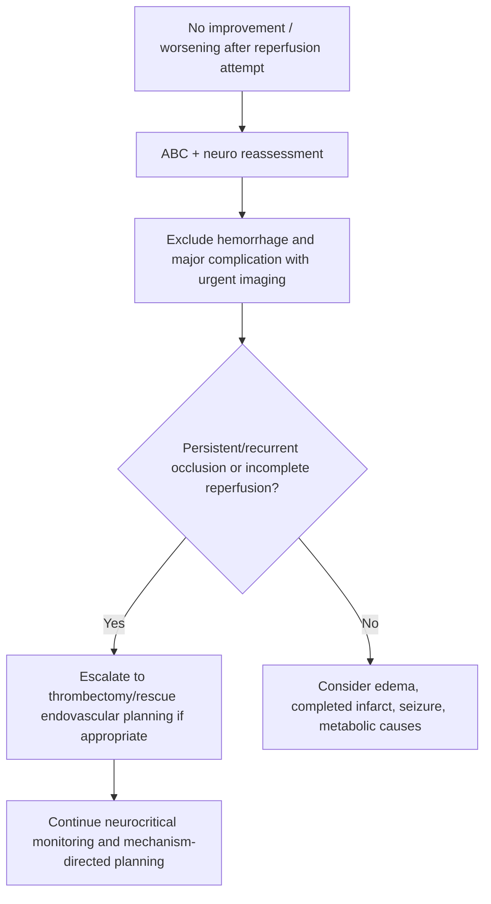
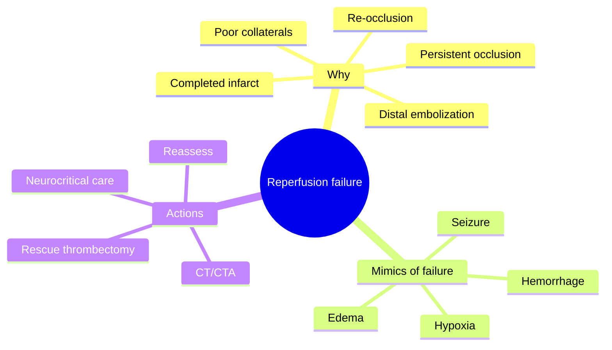
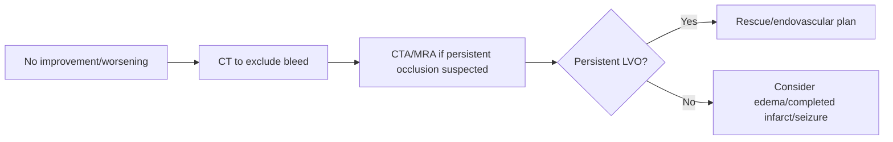

# Reperfusion failure and rescue planning concepts

Related: [[../Stroke Medicine MOC|Stroke Medicine MOC]] · [[../Reperfusion Therapy|Reperfusion Therapy]] · [[Reperfusion complications|Reperfusion complications]] · [[Mechanical thrombectomy eligibility|Mechanical thrombectomy eligibility]] · [[Bridging therapy concept|Bridging therapy concept]] · [[Large-vessel occlusion transfer pathway|Large-vessel occlusion transfer pathway]]

> [!important]
> Reperfusion failure means that the intended restoration of blood flow does **not** occur adequately or does not produce the hoped-for clinical recovery. The exam focus is not advanced intervention technique but the concept: recognize failure, reassess the cause, and escalate or redirect management without wasting time.

## Learning Objectives
- Define reperfusion failure in stroke care.
- Recognize why reperfusion may fail after thrombolysis or thrombectomy.
- Outline rescue-planning concepts in clear FCPS/MRCP-oriented language.

## Definition
**Reperfusion failure** is failure of IV thrombolysis and/or mechanical thrombectomy to achieve sufficient recanalization, tissue reperfusion, or clinical improvement in acute ischaemic stroke. **Rescue planning** means the structured reassessment and escalation strategy used when reperfusion is incomplete, delayed, or clinically disappointing.

## Core Anatomy
- Failure is especially important in **large-vessel occlusion** because major territories remain threatened if the artery stays blocked.
- Proximal anterior circulation LVO and **basilar artery occlusion** are classic high-stakes scenarios.
- Distal embolization or tandem lesions may complicate the anatomy and hinder full reperfusion.

## Core Physiology
- Restoring arterial patency does not always equal full tissue recovery.
- Failure may reflect persistent occlusion, incomplete recanalization, poor collateral circulation, distal embolization, no-reflow at tissue level, or already-completed infarct.
- Even technically successful reperfusion may not translate into improvement if the infarct core is already too large.

## Normal Values / Important Cut-offs
- The earlier the failure is recognized, the more useful rescue planning can be.
- Clinical non-improvement after lysis may reflect true failure, but also edema, hemorrhage, seizure, or metabolic causes.
- Persistent or recurrent LVO on vascular imaging is a major trigger for escalation.
- Rescue thinking is especially relevant when thrombectomy-capable systems are available.

## Classification
### By stage of failure
- **Pharmacologic failure**: thrombolysis does not achieve adequate recanalization
- **Mechanical failure/incomplete recanalization**: thrombectomy does not fully reopen the vessel
- **Clinical non-response despite reperfusion**: reperfusion achieved but recovery not seen because tissue injury is already advanced or other complications exist

### By mechanism
- Persistent occlusion
- Re-occlusion
- Distal embolization
- Poor collaterals / completed infarction
- Post-reperfusion complication masquerading as failure

## Etiology / Causes
- Large clot burden resistant to thrombolysis
- Delayed treatment with large established core
- Tandem lesions or difficult clot anatomy
- Distal embolization during treatment
- Poor collateral circulation
- Re-occlusion after initial opening
- Edema or hemorrhage confusing clinical interpretation

## Risk Factors
- Proximal LVO
- Large clot burden
- Delayed presentation
- Atherosclerotic/tandem lesions
- Basilar thrombosis
- Incomplete initial reperfusion
- Severe stroke with large core already present

## Pathophysiology
Reperfusion therapies are designed to reopen occluded arteries, but this may fail because the clot is not lysed, is only partially retrieved, re-forms, or the downstream circulation cannot recover adequately. Even when the main vessel is reopened, microvascular failure or irreversible tissue injury may prevent meaningful neurological recovery.

## Clinical Features
### Clinical clues to possible reperfusion failure
- Persistent severe deficit after thrombolysis when improvement was expected
- Ongoing or worsening cortical syndrome after attempted reperfusion
- Persistent coma/brainstem syndrome in basilar occlusion pathway
- Recurrent neurological worsening after transient improvement

### Important caution
- Not all lack of improvement means “failure”; hemorrhage, edema, seizure, aspiration/hypoxia, or metabolic issues may be the real cause.

## Approach / Algorithm

## Investigations
### Immediate reassessment
- Urgent neurological reassessment
- Non-contrast CT if deterioration occurs
- CTA/MRA if persistent or recurrent occlusion is suspected
- BP, glucose, oxygenation review

### Additional / selected
- Repeat vascular imaging after failed lysis
- Post-thrombectomy imaging when clinical course is unsatisfactory
- Perfusion imaging in selected systems when tissue-status uncertainty matters

## Interpretation Frameworks
### Reperfusion failure checklist
1. Was the vessel actually recanalized?
2. If yes, was the reperfusion complete enough to matter?
3. Could there be **re-occlusion** or **distal embolization**?
4. Is the patient worse because of **bleeding**, **edema**, or **metabolic complication** instead?
5. Is rescue thrombectomy/endovascular escalation still possible and worthwhile?

### Causes of “no improvement” after reperfusion attempt
| Cause | Key implication |
|---|---|
| Persistent LVO | Escalate reperfusion pathway |
| Hemorrhage | Stop/shift to bleed management |
| Large completed infarct | Limited reversibility |
| Edema | Neurocritical care focus |
| Seizure/metabolic issue | Treat alternative cause |

## Diagnosis
This is a **reperfusion-response assessment concept**, not a separate disease diagnosis. It is recognized when the intended reperfusion strategy fails to restore flow or fails to produce acceptable clinical/tissue outcome.

## Differential Diagnosis
- Symptomatic intracranial hemorrhage
- Cerebral edema
- Seizure/post-ictal deterioration
- Aspiration or hypoxia-related decline
- Persistent LVO / re-occlusion
- Completed infarct with no salvageable tissue remaining

## Tables / Comparison Charts
### Failure after lysis vs failure after thrombectomy
| Scenario | Main next thought |
|---|---|
| No response after thrombolysis in LVO | CTA and thrombectomy/rescue pathway |
| Poor result after thrombectomy | Check residual occlusion, distal emboli, edema, bleed |
| Initial improvement then deterioration | Re-occlusion, bleed, edema |

### Common exam mistakes
| Mistake | Why wrong |
|---|---|
| Assuming no improvement always means treatment was useless | Tissue may be unsalvageable or another complication may have occurred |
| Ignoring imaging reassessment | You may miss persistent occlusion or hemorrhage |
| Forgetting rescue thrombectomy after failed lysis | Missed reperfusion opportunity |
| Calling hemorrhage “failure of thrombolysis” rather than complication | Different management pathway |

## Management
### Core principles
- Reassess immediately if the patient fails to improve or worsens.
- Exclude hemorrhage and other complications first.
- If persistent/recurrent LVO is present, pursue **rescue thrombectomy/endovascular escalation** when appropriate.
- If no salvageable tissue remains, shift focus to neurocritical and supportive care.

### Rescue planning ideas
- Failed IV lysis in LVO → urgent thrombectomy pathway
- Incomplete thrombectomy result → further endovascular planning per specialist team
- Re-occlusion → urgent re-evaluation and targeted management
- Non-vascular cause of deterioration → treat underlying problem (e.g. edema, seizure, hypoxia)

## Drug Interactions / Contraindications / Comorbidity Cautions
- Anticoagulant/bleeding-risk issues may affect further rescue options.
- Poor physiological status, low oxygenation, or severe BP derangement may worsen clinical non-response.
- Not every disappointing outcome can be reversed; futility and completed infarct must be recognized honestly.

## Procedures / Indications / Contraindications
- **CTA/MRA reassessment**: indicated when persistent/recurrent occlusion is suspected.
- **Mechanical thrombectomy / further endovascular rescue**: indicated in selected persistent LVO or incomplete reperfusion settings.
- **Neurocritical care escalation**: needed when failure is due to edema, hemorrhage, or large completed infarct.

## Procedure Mini-Sections
- **Procedure concept:** Rescue reperfusion planning
- **Indications:** Persistent LVO, incomplete recanalization, recurrent occlusion, or poor reperfusion response with salvageable tissue potential
- **Contraindications/cautions:** Completed infarct/futility, severe instability, bleeding complications, absent meaningful salvageable tissue
- **Viva pearl:** The first step in rescue planning is to identify whether the problem is persistent occlusion or a complication of therapy

## Complications
- Persistent severe disability from non-recanalized LVO
- Re-occlusion
- Edema
- Symptomatic intracranial hemorrhage
- Failed endovascular attempts with ongoing infarct progression

## Red Flags / Emergencies
- Persistent LVO after lysis
- Sudden re-worsening after initial improvement
- Basilar occlusion with ongoing coma/brainstem deficit
- Imaging evidence of residual or recurrent occlusion
- Clinical deterioration without clear explanation

## Prognosis
Prognosis depends on why reperfusion failed, how quickly failure is recognized, collateral circulation, infarct-core size, and whether rescue options remain feasible. Persistent proximal occlusion or delayed recognition greatly worsens outcomes.

## Topic Correlation
- [[Mechanical thrombectomy eligibility|Mechanical thrombectomy eligibility]]
- [[Bridging therapy concept|Bridging therapy concept]]
- [[Large-vessel occlusion transfer pathway|Large-vessel occlusion transfer pathway]]
- [[Symptomatic intracranial haemorrhage after reperfusion|Symptomatic intracranial haemorrhage after reperfusion]]
- [[Post-thrombolysis monitoring and BP targets|Post-thrombolysis monitoring and BP targets]]

## Special Situations
- **Basilar artery occlusion:** failure can rapidly become catastrophic.
- **Drip-and-ship LVO:** rescue planning often means rapid transfer after failed lysis.
- **Large completed infarct:** recognize when reperfusion is no longer likely to change outcome meaningfully.
- **Transient early improvement then decline:** think re-occlusion or hemorrhage.

## FCPS/MRCP High-Yield Points
- No improvement after reperfusion is not automatically “just wait.”
- Reassess clinically and with imaging.
- Failed lysis in LVO should trigger **thrombectomy/rescue planning**.
- Distinguish **failure** from **complication** such as hemorrhage.
- Persistent/recurrent occlusion and large completed infarct have very different implications.

## Common Viva Questions
1. What do you mean by reperfusion failure?
2. What are the common causes?
3. What is the first step when a patient fails to improve?
4. How do you distinguish failure from hemorrhagic complication?
5. What is rescue planning after failed thrombolysis in LVO?

## Common Confusions / Exam Traps
- Assuming no neurological improvement means hemorrhage without imaging.
- Assuming all unsuccessful lysis patients are “untreatable” despite LVO rescue options.
- Forgetting that completed infarct may explain lack of clinical recovery even with opened artery.
- Using the term “failure” when the real issue is edema or bleed.

## Mnemonics
- **FAIL**
  - **F**ind the cause
  - **A**ssess with imaging
  - **I**dentify persistent occlusion vs complication
  - **L**aunch rescue plan if appropriate

## Mind Map

## Flowchart

## Suggested Visuals / Image Notes
- Rescue-planning decision tree after failed lysis
- Persistent LVO vs hemorrhage vs edema comparison chart
- Workflow from failed thrombolysis to thrombectomy transfer

## Suggested Video References
- Failed lysis / rescue thrombectomy concept review
- Post-reperfusion deterioration differential diagnosis
- Systems-of-care rescue planning in LVO stroke

## One-Page Revision Summary
### Reperfusion Failure and Rescue Planning at a Glance
- **Definition:** reperfusion does not adequately restore flow or clinical benefit
- **Common reasons:** persistent occlusion, re-occlusion, distal embolization, poor collaterals, completed infarct
- **First step:** reassess clinically and image again
- **Failed lysis in LVO:** think thrombectomy/rescue pathway
- **Differentiate from:** hemorrhage, edema, seizure, metabolic decline
- **Core rule:** find the reason before declaring “treatment failure”

## 24-Hour Recall Prompts
- Name four causes of reperfusion failure.
- What is the first step in rescue planning?
- Why is CTA important after failed lysis in LVO?
- How do you distinguish failure from hemorrhage?
- What does transient improvement then worsening suggest?

## 7-Day / 15-Day / 30-Day Revision Tracker
- **Day 1:** Reproduce the rescue-planning framework.
- **Day 7:** Compare persistent occlusion vs hemorrhage vs edema.
- **Day 15:** Practice 5 failed-reperfusion scenarios.
- **Day 30:** Redo MCQs/SBAs and identify reasoning gaps.

## Must Know / Should Know / Nice to Know
### Must Know
- Reassess with imaging
- Persistent LVO after lysis → thrombectomy thinking
- Distinguish failure from complication
- Re-occlusion can occur
- Completed infarct may limit benefit

### Should Know
- Distal embolization and tandem lesion concepts
- BAO rescue urgency
- Neurocritical shift when rescue is futile

### Nice to Know
- Advanced interventional technique details beyond exam core need

## My Weak Points
- Do I always re-image instead of guessing?
- Can I separate persistent occlusion from hemorrhage or edema?
- Do I remember rescue options after failed lysis?

## Self-Test Scorecard
- Understanding /10
- Recall /10
- Rescue-planning logic /10
- MCQ performance /10
- Viva confidence /10

**Guide:**
- **<35/50** = weak topic
- **35–44/50** = acceptable but not secure
- **45+/50** = strong exam-ready topic

## Exam Answer Modes
### Long-answer skeleton
1. Definition
2. Causes
3. Clinical recognition
4. Imaging reassessment
5. Rescue planning and prognosis

### Short-note skeleton
- Persistent occlusion / no response
- Reassess with CT/CTA
- Rescue thrombectomy if appropriate
- Differentiate from hemorrhage/edema

### Viva skeleton
- “What is reperfusion failure?”
- “Why does it happen?”
- “What do you do next?”
- “When do you think of rescue thrombectomy?”

## Summary
Reperfusion failure means that thrombolysis and/or thrombectomy does not achieve adequate flow restoration or clinical recovery. The essential response is to **reassess immediately**, **exclude hemorrhage**, **re-image for persistent or recurrent occlusion**, and pursue **rescue planning** when salvageable tissue and appropriate endovascular options remain. A major exam pearl is to distinguish true failure from complications such as hemorrhage or edema.

## MCQs (10)
1. Reperfusion failure after stroke treatment most commonly means:
   A. No adequate recanalization or meaningful reperfusion benefit  
   B. Cataract progression  
   C. Hypertension cure  
   D. Complete rehab recovery

2. Which of the following is a major cause of reperfusion failure?
   A. Persistent large-vessel occlusion  
   B. Improved speech  
   C. Normal glucose  
   D. Good collateral flow only

3. A patient fails to improve after lysis in proven LVO stroke. The next key thought should be:
   A. Rescue thrombectomy pathway  
   B. Nothing else can ever be done  
   C. Ignore imaging  
   D. Discharge home

4. Which is an important differential diagnosis of apparent reperfusion failure?
   A. Symptomatic intracranial hemorrhage  
   B. Cataract  
   C. Osteoarthritis  
   D. Dermatitis

5. Why might a technically opened artery still not produce good recovery?
   A. Infarct core may already be too large  
   B. BP was measured  
   C. Patient is right-handed  
   D. CT was performed

6. Which imaging is often crucial when persistent/recurrent occlusion is suspected?
   A. CTA/MRA  
   B. Bone scan  
   C. Audiogram  
   D. DEXA scan

7. Which statement is most accurate?
   A. No improvement always means hemorrhage  
   B. No improvement requires structured reassessment to find the cause  
   C. Persistent LVO never needs rescue planning  
   D. Re-occlusion does not occur

8. A patient improves briefly after reperfusion and then worsens again. What should be considered?  
   A. Re-occlusion or complication  
   B. Guaranteed recovery  
   C. Only migraine  
   D. No further action needed

9. Which stroke subtype is especially high stakes for rescue planning if reperfusion fails?  
   A. Basilar artery occlusion  
   B. Tension headache  
   C. Bell palsy  
   D. Chronic radiculopathy

10. The first principle in rescue planning is to:
    A. Identify the reason for failure  
    B. Start random treatment  
    C. Ignore CT findings  
    D. Assume thrombectomy always failed

## SBA Questions (10)
1. A patient with CTA-proven LVO receives alteplase but remains profoundly aphasic and hemiplegic. What is the best next concept?  
   A. Rescue thrombectomy should be considered urgently  
   B. No further reperfusion option exists  
   C. Discharge the patient  
   D. Ignore the persistent deficit  
   E. Start cataract treatment

2. A patient worsens after reperfusion attempt. What is the first broad step?  
   A. Reassess clinically and image urgently  
   B. Assume success and continue routine care  
   C. Start anticoagulation blindly  
   D. Send home if BP is normal  
   E. Skip neurological exam

3. Which factor may explain poor clinical improvement despite technically successful recanalization?  
   A. Large completed infarct core  
   B. Normal oxygenation  
   C. Controlled BP  
   D. Swallow screen  
   E. CT availability

4. A patient initially improves after reperfusion but becomes worse again 2 hours later. What possibility is especially important?  
   A. Re-occlusion  
   B. Guaranteed benign recovery  
   C. Cataract  
   D. Osteoarthritis  
   E. Sinusitis

5. Why is CT/CTA important when reperfusion seems to fail?  
   A. It distinguishes persistent occlusion from hemorrhage or other causes  
   B. It treats the clot directly  
   C. It replaces clinical assessment  
   D. It prevents all edema  
   E. It determines shoe size

6. A patient has persistent coma after attempted BAO reperfusion. Which principle is best?  
   A. Catastrophic posterior circulation failure requires urgent reassessment/rescue thinking  
   B. Posterior circulation never needs rescue planning  
   C. Wait several days before rethinking the case  
   D. Imaging is unnecessary  
   E. Only physiotherapy matters now

7. What is the best distinction between reperfusion failure and reperfusion complication?  
   A. Failure means insufficient restoration of flow/benefit; complication may be hemorrhage or edema  
   B. They are identical terms  
   C. Failure means headache only  
   D. Complication means guaranteed recovery  
   E. Neither needs CT

8. Which is a major cause of failed lysis in LVO?  
   A. Large clot burden resistant to thrombolysis  
   B. Good hydration  
   C. Controlled BP  
   D. Early arrival  
   E. Normal ECG

9. What is the central FCPS/MRCP message of this topic?  
   A. Do not guess—reassess the cause and plan rescue logically  
   B. All failed lysis cases are hopeless  
   C. No improvement means no need for imaging  
   D. Edema and hemorrhage are the same thing  
   E. CTA has no role after thrombolysis

10. Which scenario best fits rescue-planning thinking?  
    A. Persistent LVO with salvageable tissue potential  
    B. Chronic knee arthritis  
    C. Stable mild fatigue after discharge  
    D. Cataract surgery follow-up  
    E. Seasonal allergy review

## Flashcards
- Q: What is reperfusion failure?  
  A: Failure of lysis/thrombectomy to restore adequate flow or meaningful clinical benefit.
- Q: What is the first step when reperfusion seems to fail?  
  A: Reassess clinically and with imaging.
- Q: Name three causes of reperfusion failure.  
  A: Persistent occlusion, re-occlusion, distal embolization, poor collaterals, completed infarct.
- Q: What must be distinguished from reperfusion failure?  
  A: Complications such as hemorrhage or edema.
- Q: What often follows failed lysis in a patient with LVO?  
  A: Rescue thrombectomy planning.
- Q: Why might recanalization not improve the patient?  
  A: Tissue may already be irreversibly infarcted.
- Q: Which imaging helps assess persistent or recurrent occlusion?  
  A: CTA or MRA.
- Q: What does transient improvement then worsening suggest?  
  A: Re-occlusion or a complication.
- Q: Which posterior circulation event makes rescue planning urgent?  
  A: Basilar artery occlusion.
- Q: What is the main exam pearl?  
  A: Find the cause of failed response before deciding the next step.

## Answer Key with Explanations
### MCQs
1. **A** — This captures the basic definition.  
2. **A** — Persistent LVO is a classic cause.  
3. **A** — Failed lysis in LVO should prompt thrombectomy thinking.  
4. **A** — Hemorrhage may mimic “failure” but is actually a complication.  
5. **A** — Recanalization may be too late to save already-dead tissue.  
6. **A** — Vascular imaging is central to reassessment.  
7. **B** — Structured reassessment is essential; do not guess.  
8. **A** — Re-occlusion or another complication must be considered.  
9. **A** — BAO is a high-stakes rescue-planning scenario.  
10. **A** — Rescue planning starts by identifying why reperfusion failed.

### SBAs
1. **A** — Persistent severe deficit after failed lysis in LVO should trigger rescue thrombectomy thinking.  
2. **A** — Immediate clinical and imaging reassessment is the first step.  
3. **A** — Large completed infarct may explain poor recovery despite patency.  
4. **A** — Early re-worsening raises concern for re-occlusion or complication.  
5. **A** — Imaging distinguishes persistent occlusion from hemorrhage or other causes.  
6. **A** — Persistent coma in BAO is a high-emergency reassessment scenario.  
7. **A** — Failure and complication overlap clinically but are not the same concept.  
8. **A** — Large clot burden is a common reason lysis fails.  
9. **A** — The major teaching point is logical reassessment and rescue planning.  
10. **A** — Rescue planning is most relevant when salvageable tissue may still exist.