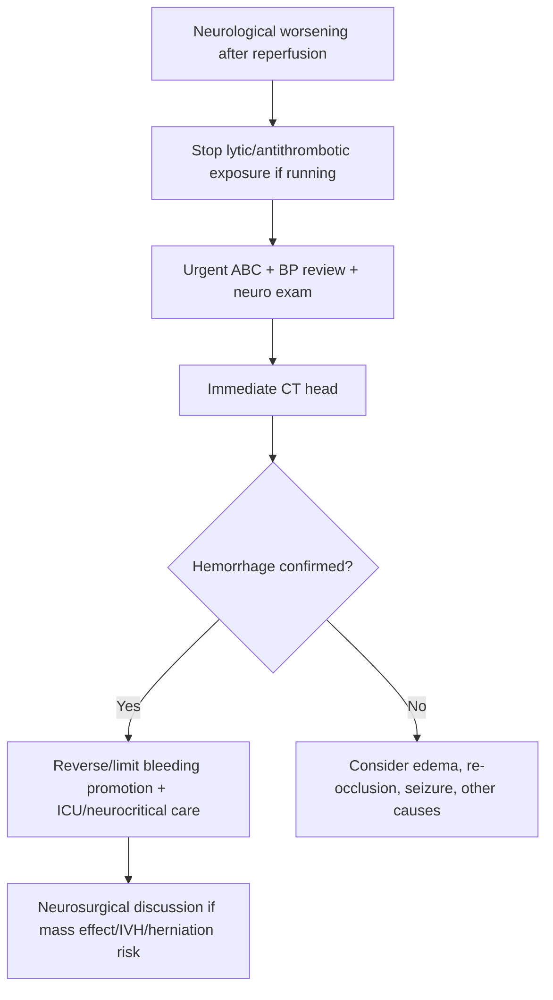
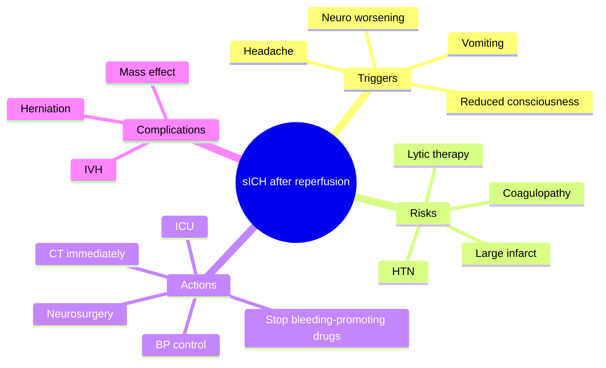
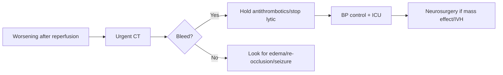

# Symptomatic intracranial haemorrhage after reperfusion

Related: [[../Stroke Medicine MOC|Stroke Medicine MOC]] · [[../Reperfusion Therapy|Reperfusion Therapy]] · [[Reperfusion complications|Reperfusion complications]] · [[Intravenous alteplase eligibility|Intravenous alteplase eligibility]] · [[Thrombolysis contraindications and bleeding-risk cautions|Thrombolysis contraindications and bleeding-risk cautions]] · [[Post-thrombolysis monitoring and BP targets|Post-thrombolysis monitoring and BP targets]]

> [!important]
> **Symptomatic intracranial haemorrhage (sICH)** is the most feared major complication after stroke reperfusion therapy. The key exam principle is: suspect it immediately when a patient worsens after thrombolysis or thrombectomy, confirm urgently with imaging, stop bleeding-promoting treatments, and escalate neurocritical care fast.

## Learning Objectives
- Define symptomatic intracranial haemorrhage after reperfusion.
- Recognize the common risk factors, clinical warning signs, and emergency response steps.
- Summarize initial treatment principles after thrombolysis- or thrombectomy-related hemorrhagic deterioration.

## Definition
**Symptomatic intracranial haemorrhage after reperfusion** is clinically significant intracranial bleeding occurring after reperfusion treatment for acute ischaemic stroke, associated with neurological worsening, reduced consciousness, new headache/vomiting, or other deterioration attributable to the hemorrhage.

## Core Anatomy
- Bleeding may occur within the infarcted territory as **haemorrhagic transformation** or as a more confluent parenchymal hematoma.
- Large cortical infarcts, deep large-vessel infarcts, and reperfused fragile tissue are especially vulnerable.
- Hemorrhage may produce **mass effect**, **midline shift**, or **intraventricular extension** in severe cases.

## Core Physiology
- Reperfusion restores blood flow to ischemic but damaged brain tissue.
- When vascular integrity is severely impaired, blood leaks into infarcted tissue.
- Thrombolytic-induced fibrinolysis and reperfusion injury can increase bleeding risk.
- The resulting hematoma may worsen edema, raise ICP, and rapidly reverse reperfusion benefit.

## Normal Values / Important Cut-offs
- The risk period is highest in the **early hours after reperfusion therapy**.
- Any new neurological decline after lytic therapy should be treated as hemorrhage until proven otherwise.
- BP control is crucial because severe hypertension may worsen bleeding.
- Antiplatelets/anticoagulants are usually withheld during emergency assessment of suspected sICH.

## Classification
### By mechanism/context
- Post-thrombolysis sICH
- Post-thrombectomy reperfusion hemorrhage
- Hemorrhagic transformation of infarct with clinical worsening

### By pattern on imaging
- Petechial hemorrhagic transformation
- Parenchymal hematoma
- Extra-axial or intraventricular extension in selected severe cases

## Etiology / Causes
- Reperfusion into severely ischemic damaged tissue
- Thrombolytic-associated bleeding
- Large infarct burden
- Uncontrolled hypertension
- Coagulopathy or anticoagulant exposure
- Vessel injury/procedural factors after thrombectomy in some cases

## Risk Factors
- Large completed infarct
- Severe stroke / large-vessel occlusion
- Uncontrolled severe hypertension
- Hyperglycaemia
- Delayed reperfusion with already-fragile tissue
- Anticoagulant or coagulopathy issues
- Older frailty and bleeding-prone comorbidity

## Pathophysiology
Ischemic brain loses endothelial integrity. When reperfusion occurs—whether pharmacologic or mechanical—blood may extravasate across damaged capillary beds. Thrombolysis amplifies bleeding potential by impairing clot stability. Once hemorrhage starts, it can expand, worsen edema, increase intracranial pressure, and cause abrupt neurological collapse.

## Clinical Features
### Typical warning features
- New or worsening neurological deficit
- Sudden headache
- Vomiting
- Reduced level of consciousness
- Acute BP elevation
- Seizure in some cases

### High-yield timing clue
- Deterioration in the first hours after thrombolysis or thrombectomy should trigger urgent hemorrhage assessment.

## Approach / Algorithm

## Investigations
### Immediate
- Urgent **non-contrast CT head**
- ABC assessment
- BP measurement and repeated monitoring
- CBC, coagulation profile
- Review of all recent antithrombotic/reperfusion drugs

### Additional / selective
- Repeat imaging for progression
- CTA if another vascular complication is suspected and clinically relevant
- Laboratory reassessment for fibrinogen/coagulation issues depending on local protocol

## Interpretation Frameworks
### When to suspect sICH
| Feature | Why important |
|---|---|
| New neuro worsening after reperfusion | Classic trigger |
| Severe headache/vomiting | Suggests acute bleed/ICP rise |
| Reduced consciousness | Can indicate mass effect or large bleed |
| Sudden post-procedural decline | Think hemorrhage until proven otherwise |

### CT interpretation priorities
1. Is there intracranial blood?
2. Is it within infarct territory or another pattern?
3. Is there **mass effect**, **midline shift**, or **IVH**?
4. Could neurosurgical intervention be needed?

## Diagnosis
Diagnosis is made by clinical deterioration after reperfusion therapy plus imaging confirmation of intracranial hemorrhage explaining the deterioration.

## Differential Diagnosis
- Cerebral edema after large infarct
- Re-occlusion or failed reperfusion
- Seizure/post-ictal worsening
- Aspiration/hypoxia-related decline
- Metabolic disturbance such as hypoglycaemia

## Tables / Comparison Charts
### Neurological worsening after reperfusion: major causes
| Cause | Key clue |
|---|---|
| Symptomatic intracranial hemorrhage | Headache/vomiting/CT bleed |
| Cerebral edema | Large infarct, swelling pattern |
| Re-occlusion | Recurrent focal deficit without bleed |
| Seizure | Witnessed seizure/post-ictal phase |

### Common exam mistakes
| Mistake | Why wrong |
|---|---|
| Waiting too long for CT after deterioration | Delays lifesaving action |
| Continuing antithrombotics blindly | May worsen bleeding |
| Attributing all worsening to edema without imaging | Misses hemorrhage |
| Forgetting neurosurgical escalation in mass-effect cases | Dangerous omission |

## Management
### Immediate priorities
- ABC stabilization
- Urgent CT head
- Stop ongoing thrombolytic infusion if still running
- Hold antiplatelet and anticoagulant therapy
- Control BP according to emergency neurocritical care protocol

### Hemostatic / reversal principles
- Use reperfusion-bleed reversal/supportive strategies according to local protocol and recent drug exposure.
- Correct coagulopathy if present.
- If thrombolysis-related bleeding is suspected, discuss emergent reversal/support measures promptly.

### Neurocritical care
- ICU/HDU monitoring
- Treat raised ICP risk
- Neurosurgical consultation for mass effect, large hematoma, IVH, or herniation risk
- Seizure treatment if needed

## Drug Interactions / Contraindications / Comorbidity Cautions
- Antiplatelets and anticoagulants are usually withheld during active hemorrhage assessment/management.
- Severe hypertension aggravates bleeding risk.
- Recent thrombolysis, concomitant anticoagulant exposure, and coagulopathy worsen prognosis and management complexity.
- Frail elderly patients may deteriorate quickly even with modest hemorrhage.

## Procedures / Indications / Contraindications
- **Urgent CT head**: mandatory diagnostic step.
- **Neurosurgical decompression / evacuation / ventricular drainage**: considered in selected severe cases with mass effect/hydrocephalus.

## Procedure Mini-Sections
- **Procedure:** Emergency CT-based reassessment after reperfusion worsening
- **Indications:** Any significant new deterioration after lytic or thrombectomy
- **Cautions:** Do not delay for routine ward steps; treat as stroke emergency again
- **Viva pearl:** The first response to worsening after reperfusion is not reassurance—it is urgent imaging

## Complications
- Herniation
- Increased intracranial pressure
- Intraventricular extension / hydrocephalus
- Seizure
- Death or severe disability

## Red Flags / Emergencies
- Sudden coma or major fall in GCS
- Severe headache with vomiting after thrombolysis
- New pupillary asymmetry
- CT showing large parenchymal hematoma or midline shift
- Suspected posterior fossa bleed with airway compromise

## Prognosis
Prognosis depends on bleed size, location, mass effect, age, baseline stroke severity, and speed of recognition/response. Large hematomas with depressed consciousness carry poor prognosis.

## Topic Correlation
- [[Post-thrombolysis monitoring and BP targets|Post-thrombolysis monitoring and BP targets]]
- [[Thrombolysis contraindications and bleeding-risk cautions|Thrombolysis contraindications and bleeding-risk cautions]]
- [[Reperfusion failure and rescue planning concepts|Reperfusion failure and rescue planning concepts]]
- [[../Stroke Unit Care and Complications/Cerebral oedema and raised intracranial pressure in stroke|Cerebral oedema and raised intracranial pressure in stroke]]
- [[../Intracerebral Haemorrhage/Intracerebral haemorrhage|Intracerebral haemorrhage]]

## Special Situations
- **Large MCA infarct:** both edema and hemorrhage may coexist.
- **After thrombectomy:** consider both procedural complications and reperfusion hemorrhage.
- **Posterior circulation stroke:** deterioration may also involve airway/brainstem compromise.

## FCPS/MRCP High-Yield Points
- Neurological worsening after reperfusion = **CT immediately**.
- sICH is the **feared major reperfusion complication**.
- Stop/withhold bleeding-promoting drugs.
- BP control and neurocritical escalation are key.
- Neurosurgical discussion is needed for mass effect, IVH, or herniation risk.

## Common Viva Questions
1. What is symptomatic intracranial hemorrhage after reperfusion?
2. When should you suspect it?
3. What is your first investigation?
4. What do you do immediately after suspicion?
5. How is it different from simple asymptomatic petechial transformation?

## Common Confusions / Exam Traps
- Confusing asymptomatic imaging hemorrhagic change with clinically significant sICH.
- Delaying CT while observing “for a bit longer.”
- Forgetting BP control as part of immediate treatment.
- Missing the need to stop antithrombotic exposure.

## Mnemonics
- **WORSE after reperfusion = WORSE means scan**
- **BLEED**
  - **B**P control
  - **L**ook with CT
  - **E**nd antithrombotics/lysis
  - **E**scalate ICU/neurosurgery
  - **D**eterioration is emergency

## Mind Map

## Flowchart

## Suggested Visuals / Image Notes
- CT examples of hemorrhagic transformation vs parenchymal hematoma
- Acute response checklist for post-reperfusion deterioration
- ICP/mass-effect warning signs diagram

## Suggested Video References
- Post-thrombolysis hemorrhage emergency management
- CT interpretation of hemorrhagic transformation
- Neurocritical care response to post-stroke deterioration

## One-Page Revision Summary
### Symptomatic Intracranial Haemorrhage After Reperfusion at a Glance
- **Definition:** clinically significant hemorrhage causing worsening after reperfusion
- **Key clue:** new deterioration after thrombolysis/thrombectomy
- **First step:** urgent **CT head**
- **Immediate actions:** stop/withhold bleeding-promoting drugs, control BP, ICU escalation
- **Danger signs:** reduced consciousness, mass effect, IVH, herniation

## 24-Hour Recall Prompts
- What is the first investigation in worsening after reperfusion?
- Name four risk factors for sICH.
- What treatments should be stopped/withheld?
- When should neurosurgery be involved?
- What differential diagnoses also cause post-reperfusion worsening?

## 7-Day / 15-Day / 30-Day Revision Tracker
- **Day 1:** Reproduce the emergency response steps from memory.
- **Day 7:** Compare sICH with edema and re-occlusion.
- **Day 15:** Review CT examples of hemorrhagic transformation.
- **Day 30:** Redo MCQs/SBAs and identify missed action steps.

## Must Know / Should Know / Nice to Know
### Must Know
- Worsening after reperfusion = immediate CT
- Stop/withhold antithrombotics
- BP control
- ICU/neurosurgical escalation
- Large infarct and lytic therapy as key risks

### Should Know
- Difference between petechial transformation and symptomatic hematoma
- Mass-effect warning signs
- Differential causes of deterioration

### Nice to Know
- Detailed reversal-protocol nuances beyond core exam need

## My Weak Points
- Do I react fast enough to post-reperfusion deterioration?
- Can I distinguish bleed from edema conceptually?
- Do I remember to stop lytic/antithrombotic exposure?

## Self-Test Scorecard
- Understanding /10
- Recall /10
- Emergency-response logic /10
- MCQ performance /10
- Viva confidence /10

**Guide:**
- **<35/50** = weak topic
- **35–44/50** = acceptable but not secure
- **45+/50** = strong exam-ready topic

## Exam Answer Modes
### Long-answer skeleton
1. Definition
2. Risk factors and pathophysiology
3. Clinical features
4. Emergency investigation
5. Immediate management and prognosis

### Short-note skeleton
- Definition
- Triggers
- CT diagnosis
- Management steps
- Major complications

### Viva skeleton
- “When do you suspect it?”
- “What do you do first?”
- “What do you stop?”
- “When do you call neurosurgery?”

## Summary
Symptomatic intracranial haemorrhage after reperfusion is the major feared bleeding complication after thrombolysis or thrombectomy. It should be suspected whenever a patient deteriorates after reperfusion therapy. The essential actions are **urgent CT**, **withholding bleeding-promoting drugs**, **blood pressure control**, and **rapid neurocritical/neurosurgical escalation** when mass effect or hydrocephalus is present.

## MCQs (10)
1. The most feared major complication after IV thrombolysis is:
   A. Symptomatic intracranial haemorrhage  
   B. Cataract  
   C. Osteoarthritis  
   D. Nephrolithiasis

2. A patient worsens neurologically 2 hours after reperfusion therapy. The first investigation should be:
   A. Urgent CT head  
   B. Spirometry  
   C. Colonoscopy  
   D. Bone scan

3. Which finding most strongly suggests sICH rather than simple stable recovery?
   A. New headache, vomiting, and reduced consciousness  
   B. Improved speech  
   C. Stable mild fatigue  
   D. Normal appetite

4. Which factor increases the risk of sICH after reperfusion?
   A. Large infarct burden  
   B. Controlled BP  
   C. Good swallow  
   D. Early rehab input

5. When sICH is suspected, which medication principle is correct?
   A. Hold bleeding-promoting antithrombotics  
   B. Start DAPT immediately  
   C. Continue lytic infusion regardless  
   D. Give anticoagulation automatically

6. Which is a dangerous consequence of large sICH?
   A. Mass effect and herniation  
   B. Cataract  
   C. Carpal tunnel syndrome  
   D. Hyperthyroidism

7. After thrombectomy, sudden deterioration should make you think of:
   A. Hemorrhage or other reperfusion complication  
   B. Only anxiety  
   C. Only chronic neuropathy  
   D. Only dehydration

8. Which statement is most accurate?
   A. All hemorrhagic transformation is clinically silent and irrelevant  
   B. Symptomatic hemorrhage causes clinical worsening and needs urgent action  
   C. CT is optional if vomiting is absent  
   D. BP is irrelevant once bleed occurs

9. A new pupillary asymmetry after reperfusion suggests:
   A. Mass effect / herniation risk  
   B. Stable improvement  
   C. Benign migraine only  
   D. Peripheral neuropathy

10. Which specialty input may be urgently needed in severe sICH?
    A. Neurosurgery  
    B. Dermatology  
    C. Rheumatology  
    D. Ophthalmology only

## SBA Questions (10)
1. A 71-year-old woman becomes drowsy and vomits 90 minutes after alteplase. What is the best immediate step?  
   A. Urgent CT head  
   B. Begin oral feeding  
   C. Wait until morning  
   D. Send home  
   E. Start aspirin

2. A patient deteriorates after thrombectomy. CT shows a new parenchymal hematoma with mass effect. What is the best general management principle?  
   A. ICU/neurosurgical escalation  
   B. Ignore it because thrombectomy was successful  
   C. Continue all antithrombotics  
   D. Discharge once vitals normalize  
   E. Start physiotherapy immediately only

3. Which clinical triad strongly suggests symptomatic post-reperfusion bleeding?  
   A. Worsening deficit, headache, reduced consciousness  
   B. Better speech, improved power, hunger  
   C. Chronic back pain, fatigue, insomnia  
   D. Rash, cough, diarrhea  
   E. Tinnitus, tinnitus, tinnitus

4. A patient has suspected sICH after lytic therapy. Which drug-related action is most appropriate?  
   A. Withhold further bleeding-promoting agents while assessing urgently  
   B. Start anticoagulation immediately  
   C. Give DAPT automatically  
   D. Continue lytic infusion without imaging  
   E. No treatment change is needed

5. What is the main reason large infarcts increase sICH risk after reperfusion?  
   A. Fragile infarcted tissue is prone to reperfusion bleeding  
   B. They always reduce BP  
   C. They cause cataracts  
   D. They prevent CT diagnosis  
   E. They improve glucose control

6. Which of the following is a key differential diagnosis for worsening after reperfusion if CT shows no bleed?  
   A. Re-occlusion or cerebral edema  
   B. Cataract  
   C. Psoriasis  
   D. Nephrotic syndrome  
   E. Osteomalacia

7. Why is BP control important in sICH?  
   A. Severe hypertension can worsen ongoing bleeding  
   B. It confirms TIA  
   C. It reverses aphasia instantly  
   D. It replaces CT  
   E. It dissolves clot

8. Which imaging feature most increases urgency for neurosurgical discussion?  
   A. Midline shift and mass effect  
   B. Small chronic sinusitis  
   C. Old lacune  
   D. Mild cerebral atrophy  
   E. Nasal septal deviation

9. A patient worsens after reperfusion but staff decide to observe for several hours before scanning. Why is this wrong?  
   A. Delayed CT may miss a treatable hemorrhagic emergency  
   B. sICH never occurs early  
   C. CT is only for chronic stroke  
   D. Vomiting rules out hemorrhage  
   E. Observation is always superior

10. Which statement best summarizes sICH after reperfusion?  
    A. It is a neurocritical emergency requiring rapid recognition and imaging  
    B. It is usually trivial and can be ignored  
    C. It only happens in posterior stroke  
    D. It has no relation to BP  
    E. It never follows thrombectomy

## Flashcards
- Q: What is the first investigation for neurological worsening after reperfusion?  
  A: Urgent CT head.
- Q: What is the major feared complication after thrombolysis?  
  A: Symptomatic intracranial haemorrhage.
- Q: Name three clinical warning signs of sICH.  
  A: Worsening deficit, headache, vomiting, reduced consciousness.
- Q: Name two major risk factors for sICH.  
  A: Large infarct burden and uncontrolled hypertension.
- Q: What medication principle applies immediately when sICH is suspected?  
  A: Stop/withhold bleeding-promoting agents.
- Q: Why might neurosurgery be needed?  
  A: Mass effect, IVH, hydrocephalus, or herniation risk.
- Q: What important differential remains if CT shows no hemorrhage?  
  A: Cerebral edema or re-occlusion.
- Q: Why is BP important?  
  A: High BP may worsen bleeding.
- Q: Can sICH occur after thrombectomy as well as thrombolysis?  
  A: Yes.
- Q: What is the core exam reflex here?  
  A: Worsening after reperfusion = urgent imaging.

## Answer Key with Explanations
### MCQs
1. **A** — sICH is the most feared serious post-thrombolysis complication.  
2. **A** — Urgent CT is the first investigation.  
3. **A** — This combination strongly suggests acute intracranial bleeding.  
4. **A** — Large infarcts are prone to reperfusion bleeding.  
5. **A** — Antithrombotics/lysis are generally held when active bleeding is suspected.  
6. **A** — Hemorrhage can cause mass effect and herniation.  
7. **A** — Deterioration after thrombectomy must trigger reperfusion-complication thinking.  
8. **B** — Symptomatic hemorrhage is clinically important and urgent.  
9. **A** — Pupillary asymmetry suggests raised ICP/herniation risk.  
10. **A** — Severe sICH may require neurosurgical escalation.

### SBAs
1. **A** — Post-lysis deterioration requires urgent CT.  
2. **A** — Mass effect after post-procedure bleeding requires ICU/neurosurgical management.  
3. **A** — This is the classic symptomatic bleeding picture.  
4. **A** — Further bleeding-promoting drugs should be withheld while urgent assessment proceeds.  
5. **A** — Fragile infarcted tissue bleeds when reperfused.  
6. **A** — If there is no bleed, edema or re-occlusion are key alternatives.  
7. **A** — High BP can aggravate ongoing hemorrhage.  
8. **A** — Midline shift/mass effect increases urgency and severity.  
9. **A** — Delay in imaging can delay lifesaving intervention.  
10. **A** — sICH is a neurocritical emergency.