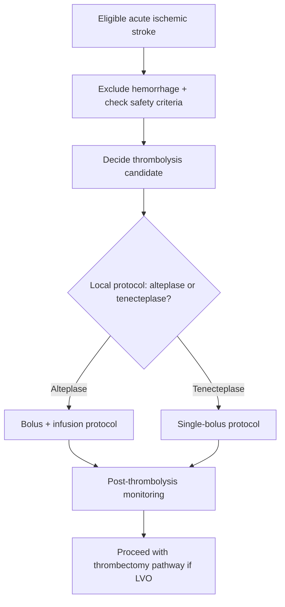
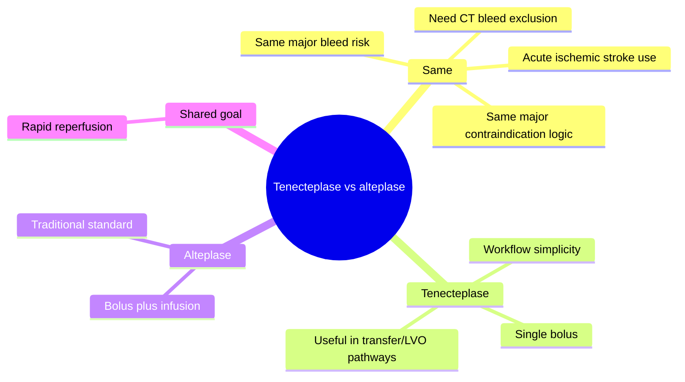
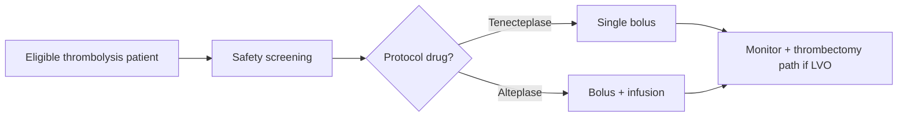

# Tenecteplase vs alteplase practical points

Related: [[../Stroke Medicine MOC|Stroke Medicine MOC]] · [[../Reperfusion Therapy|Reperfusion Therapy]] · [[Intravenous thrombolysis|Intravenous thrombolysis]] · [[Intravenous alteplase eligibility|Intravenous alteplase eligibility]] · [[Thrombolysis contraindications and bleeding-risk cautions|Thrombolysis contraindications and bleeding-risk cautions]] · [[Mechanical thrombectomy eligibility|Mechanical thrombectomy eligibility]]

> [!important]
> The exam question is usually not deep pharmacology but **practical stroke use**: which thrombolytic is being used, how it is given, why tenecteplase may be operationally simpler, and what cautions still remain identical for both drugs.

## Learning Objectives
- Compare tenecteplase and alteplase in acute ischaemic stroke practice.
- Recognize the main practical differences in administration, workflow, and LVO/reperfusion pathways.
- State the shared contraindications and major complications relevant to exams.

## Definition
**Tenecteplase** and **alteplase** are fibrinolytic agents used in acute ischaemic stroke reperfusion pathways. Alteplase is the traditional IV thrombolytic; tenecteplase is a modified fibrinolytic with practical workflow advantages, especially related to **single-bolus administration**.

## Core Anatomy
- Both agents are used for **acute ischaemic stroke**, especially when there is potentially salvageable tissue in anterior or posterior circulation.
- Both may be relevant in patients who are also being assessed for **mechanical thrombectomy**.
- LVO stroke is a key scenario where workflow simplicity may matter.

## Core Physiology
- Both drugs activate fibrinolysis and aim to dissolve the occluding thrombus.
- Reperfusion salvages penumbral tissue if given early enough.
- The major physiological risk with both is **haemorrhagic transformation** or symptomatic intracranial hemorrhage.
- Tenecteplase has pharmacologic features allowing **single-bolus use**, whereas alteplase is traditionally delivered as bolus plus infusion.

## Normal Values / Important Cut-offs
- Thrombolysis remains highly **time-dependent** for both drugs.
- Both require **hemorrhage exclusion** and standard thrombolysis safety screening.
- BP, glucose, anticoagulant history, and bleeding-risk review remain essential regardless of the thrombolytic chosen.
- Practical exam point: **tenecteplase = single bolus**, **alteplase = bolus + infusion**.

## Classification
### By thrombolytic type
- **Alteplase (rtPA)**
- **Tenecteplase (modified fibrinolytic with longer activity/practical bolus use)**

### By practical clinical context
- Standard IV thrombolysis candidate
- Bridging-to-thrombectomy candidate
- Transfer-sensitive workflow where a single-bolus agent may be attractive

## Etiology / Causes
This topic concerns **treatment choice** in acute ischaemic stroke rather than stroke causation. Both drugs are considered in eligible patients with acute thrombo-occlusive cerebral ischemia.

## Risk Factors
### For bleeding with either drug
- Uncontrolled severe hypertension
- Large infarct burden
- Anticoagulant exposure / coagulopathy
- Advanced frailty with bleeding-prone comorbidity
- Recent major surgery/trauma/bleeding

## Pathophysiology
Both agents lyse fibrin-rich thrombus and restore perfusion to ischemic brain tissue. The therapeutic benefit is reperfusion before infarct core expands. The harm comes when fragile ischemic tissue or abnormal coagulation allows bleeding after fibrinolysis. Tenecteplase and alteplase differ mainly in practical administration and operational workflow more than in the basic reperfusion goal.

## Clinical Features
### Situations where comparison matters clinically
- Hyperacute ischemic stroke where thrombolysis is being planned
- LVO stroke proceeding toward thrombectomy
- Transfer pathway where infusion logistics matter
- Settings where local stroke protocol specifies one drug over the other

### Bedside relevance
- The patient’s **eligibility criteria** do not fundamentally change just because the drug changes.
- The practical workflow and ease of administration may change significantly.

## Approach / Algorithm

## Investigations
### Required for either drug
- Non-contrast CT head
- Blood glucose
- BP assessment
- Medication history including anticoagulants
- CBC and coagulation profile where indicated
- CTA/MRA if thrombectomy pathway is relevant

## Interpretation Frameworks
### Practical comparison table
| Feature | Alteplase | Tenecteplase |
|---|---|---|
| Delivery | Bolus + infusion | Single bolus |
| Workflow simplicity | Less simple | More convenient operationally |
| Use in thrombectomy pathway | Yes | Yes |
| Contraindication screening | Same general principles | Same general principles |
| Major complication | Intracranial hemorrhage | Intracranial hemorrhage |

### Exam logic
1. Is the patient eligible for IV thrombolysis at all?
2. Which thrombolytic does the local stroke pathway use?
3. Is this an LVO or transfer-sensitive case where bolus simplicity may help?
4. Contraindications and bleeding risks remain the same core issue.

## Diagnosis
This is not a disease diagnosis but a **reperfusion-treatment comparison and selection topic** within acute ischaemic stroke management.

## Differential Diagnosis
- Acute ischemic stroke not eligible for thrombolysis
- LVO patient going directly/non-thrombolytically to thrombectomy depending on context
- Stroke mimic where no fibrinolytic should be given
- Intracerebral hemorrhage

## Tables / Comparison Charts
### High-yield differences
| Question | Tenecteplase | Alteplase |
|---|---|---|
| How given? | Single IV bolus | Initial bolus then infusion |
| Operational convenience | Higher | Lower |
| Transfer/thrombectomy workflow appeal | Often favorable | Established traditional route |
| Shared cautions | Same thrombolysis contraindications | Same thrombolysis contraindications |

### Common exam mistakes
| Mistake | Why wrong |
|---|---|
| Thinking tenecteplase removes the need for contraindication screening | Safety checks remain essential |
| Thinking alteplase and tenecteplase are used for different diseases | Both target eligible acute ischemic stroke |
| Forgetting the practical bolus-vs-infusion distinction | High-yield operational difference |
| Ignoring thrombectomy pathway | Reperfusion decisions often overlap |

## Management
### Core principles
- First decide if the patient is eligible for **any** IV thrombolysis.
- Then follow local protocol for alteplase or tenecteplase use.
- Continue LVO/thrombectomy evaluation in parallel when appropriate.

### Practical alteplase points
- Traditional and widely established stroke thrombolytic.
- Requires bolus plus infusion, so transfer/monitoring workflow is more complex.

### Practical tenecteplase points
- Single-bolus administration is operationally attractive.
- Particularly practical in transfer-sensitive or thrombectomy-bridging pathways.
- Still requires the same safety discipline regarding bleed risk.

## Drug Interactions / Contraindications / Comorbidity Cautions
- Contraindications for thrombolysis remain broadly the same for both drugs.
- Anticoagulant exposure, uncontrolled BP, recent surgery/trauma, active bleeding, and stroke mimic concerns apply equally as core principles.
- Do not treat tenecteplase as “safer by default” in the absence of proper screening.
- LVO patients may still need thrombectomy even if thrombolysis is given.

## Procedures / Indications / Contraindications
- **IV thrombolysis** is the relevant medical reperfusion procedure.
- **Mechanical thrombectomy** may follow or coexist in LVO stroke.

## Procedure Mini-Sections
- **Procedure:** IV thrombolysis with alteplase or tenecteplase
- **Indications:** Eligible acute ischemic stroke within reperfusion framework
- **Contraindications:** Same major thrombolysis safety exclusions for both drugs
- **Principle:** Recanalization before irreversible infarct expansion
- **Viva pearl:** Tenecteplase is remembered for practical **single-bolus simplicity**; alteplase for traditional **bolus plus infusion** delivery

## Complications
- Symptomatic intracranial hemorrhage
- Systemic bleeding
- Orolingual angioedema
- Failed recanalization / reperfusion failure

## Red Flags / Emergencies
- Neurological worsening after thrombolysis
- Severe headache, vomiting, reduced consciousness suggesting intracranial hemorrhage
- LVO patient losing time because of poor workflow coordination

## Prognosis
Outcome depends more on **correct patient selection**, **speed**, **recanalization**, and **bleeding avoidance** than on rote drug labeling alone. Workflow efficiency may improve reperfusion delivery, especially in LVO-transfer settings.

## Topic Correlation
- [[Intravenous alteplase eligibility|Intravenous alteplase eligibility]]
- [[Thrombolysis contraindications and bleeding-risk cautions|Thrombolysis contraindications and bleeding-risk cautions]]
- [[Mechanical thrombectomy eligibility|Mechanical thrombectomy eligibility]]
- [[Large-vessel occlusion transfer pathway|Large-vessel occlusion transfer pathway]]
- [[Bridging therapy concept|Bridging therapy concept]]

## Special Situations
- **LVO awaiting thrombectomy:** bolus-only workflow may be operationally attractive.
- **Transfer cases:** infusion logistics may be more cumbersome than a bolus strategy.
- **Posterior circulation stroke:** reperfusion thinking remains similar if thrombolysis is indicated.

## FCPS/MRCP High-Yield Points
- Both drugs are **thrombolytics for eligible acute ischemic stroke**.
- **Tenecteplase = single bolus**.
- **Alteplase = bolus + infusion**.
- Contraindication screening is essential for both.
- Thrombectomy assessment may proceed in parallel, especially in LVO stroke.

## Common Viva Questions
1. What is the main practical difference between tenecteplase and alteplase?
2. Do contraindications differ fundamentally between the two?
3. Why may tenecteplase be attractive in transfer pathways?
4. Can thrombectomy still be needed after either drug?
5. What is the most feared complication of both agents?

## Common Confusions / Exam Traps
- Equating convenience with automatic safety.
- Forgetting that both remain thrombolytic agents with intracranial hemorrhage risk.
- Missing the importance of parallel thrombectomy evaluation.
- Overcomplicating the comparison when the exam mainly wants practical differences.

## Mnemonics
- **TEN = one then done** (single bolus)
- **ALT = after bolus, longish infusion track**

## Mind Map

## Flowchart

## Suggested Visuals / Image Notes
- Side-by-side tenecteplase vs alteplase comparison card
- Reperfusion workflow diagram with bridging-to-thrombectomy pathway
- Bolus vs infusion schematic

## Suggested Video References
- Hyperacute stroke thrombolytic comparison review
- Practical reperfusion workflow in LVO stroke
- Thrombolysis and thrombectomy integration teaching session

## One-Page Revision Summary
### Tenecteplase vs Alteplase at a Glance
- Both are **thrombolytics** for eligible acute ischemic stroke
- **Tenecteplase:** single bolus, operationally simpler
- **Alteplase:** bolus + infusion, traditional standard pathway
- Both require **same core contraindication screening**
- Both can be used in patients also being evaluated for **thrombectomy**
- Main feared complication: **symptomatic intracranial hemorrhage**

## 24-Hour Recall Prompts
- What is the main practical difference between tenecteplase and alteplase?
- Do both require the same bleed-risk screening?
- Why might tenecteplase help in transfer-sensitive cases?
- What major complication do both share?
- Can thrombectomy still be needed after either drug?

## 7-Day / 15-Day / 30-Day Revision Tracker
- **Day 1:** Recite the practical comparison without notes.
- **Day 7:** Compare drug workflow in an LVO case.
- **Day 15:** Rehearse contraindication logic shared by both.
- **Day 30:** Redo MCQs/SBAs and identify confusion points.

## Must Know / Should Know / Nice to Know
### Must Know
- Tenecteplase single bolus
- Alteplase bolus + infusion
- Same thrombolysis contraindication logic
- Same major bleeding risk
- LVO/thrombectomy pathway may overlap

### Should Know
- Workflow advantage of tenecteplase in transfer pathways
- Operational implications for thrombectomy bridging

### Nice to Know
- Detailed pharmacologic trial nuances beyond exam core

## My Weak Points
- Do I remember bolus-only vs bolus-plus-infusion?
- Do I mistakenly assume tenecteplase removes safety concerns?
- Can I explain why thrombectomy evaluation still matters?

## Self-Test Scorecard
- Understanding /10
- Recall /10
- Workflow reasoning /10
- MCQ performance /10
- Viva confidence /10

**Guide:**
- **<35/50** = weak topic
- **35–44/50** = acceptable but not secure
- **45+/50** = strong exam-ready topic

## Exam Answer Modes
### Long-answer skeleton
1. Definition
2. Mechanism and similarities
3. Practical differences
4. Indications/contraindications
5. Role in reperfusion workflow

### Short-note skeleton
- Both are thrombolytics
- Tenecteplase = bolus
- Alteplase = bolus + infusion
- Same safety checks
- Thrombectomy may coexist

### Viva skeleton
- “Which is bolus only?”
- “What safety screening do both need?”
- “Why may tenecteplase be operationally easier?”

## Summary
Tenecteplase and alteplase are both thrombolytic agents used in eligible acute ischaemic stroke. The most important practical exam distinction is that **tenecteplase is given as a single bolus**, whereas **alteplase requires bolus plus infusion**. Both require the same core contraindication screening and carry the same major concern of symptomatic intracranial hemorrhage, and both may be used within broader LVO/thrombectomy reperfusion pathways.

## MCQs (10)
1. The most practical bedside difference between tenecteplase and alteplase in stroke care is:
   A. Tenecteplase is oral  
   B. Tenecteplase is single bolus whereas alteplase uses bolus plus infusion  
   C. Alteplase is used only in hemorrhage  
   D. Tenecteplase needs no CT

2. Both tenecteplase and alteplase share which key concern?
   A. Symptomatic intracranial hemorrhage  
   B. Cataract  
   C. Asthma cure  
   D. Nephrolithiasis

3. Before using either thrombolytic, the first key imaging requirement is:
   A. Exclude intracranial hemorrhage  
   B. Confirm osteoarthritis  
   C. CT chest  
   D. EEG

4. Tenecteplase may be operationally attractive in which scenario?
   A. Transfer-sensitive LVO pathway  
   B. Chronic low back pain  
   C. Cataract clinic  
   D. Stable epilepsy follow-up

5. Which statement is most accurate?
   A. Tenecteplase removes the need for contraindication screening  
   B. Alteplase and tenecteplase share core thrombolysis safety logic  
   C. Alteplase is not a thrombolytic  
   D. Tenecteplase is for TIA only

6. In an LVO patient, giving IV thrombolysis means:
   A. Thrombectomy is no longer relevant  
   B. Thrombectomy may still be needed  
   C. CT is unnecessary  
   D. All bleeding risk disappears

7. Alteplase is classically remembered as:
   A. Single intramuscular dose  
   B. Bolus plus infusion  
   C. Topical therapy  
   D. Antiplatelet drug

8. The main shared therapeutic goal of both drugs is:
   A. Reperfuse salvageable ischemic brain tissue  
   B. Lower ICP directly  
   C. Prevent cataract  
   D. Treat meningitis

9. Which is a common exam trap about tenecteplase?
   A. Assuming convenience means no bleed risk  
   B. Recognizing it is a thrombolytic  
   C. Knowing it is given as bolus  
   D. Asking about anticoagulants

10. Which statement about both agents is best?
    A. They are used in eligible acute ischemic stroke reperfusion pathways  
    B. They are chronic prevention drugs  
    C. They replace thrombectomy in all cases  
    D. They are used for intracerebral hemorrhage

## SBA Questions (10)
1. A 69-year-old man with acute ischemic stroke is eligible for thrombolysis and probable LVO transfer. Which drug property makes tenecteplase practically attractive in this scenario?  
   A. Single-bolus administration  
   B. It never causes bleeding  
   C. It removes the need for CTA  
   D. It is an anticoagulant  
   E. It treats ICH

2. A patient is eligible for alteplase. Which administration pattern is classically associated with alteplase?  
   A. Bolus plus infusion  
   B. Oral tablet only  
   C. Intrathecal dose  
   D. Nebulized therapy  
   E. Subcutaneous weekly dose

3. Which safety principle applies equally to tenecteplase and alteplase?  
   A. Both require hemorrhage exclusion and contraindication screening  
   B. Tenecteplase does not need BP assessment  
   C. Alteplase does not require glucose check  
   D. Neither needs anticoagulant history  
   E. CTA replaces CT bleed exclusion

4. A patient receives thrombolysis and then is found to have persistent LVO. What is the next key reperfusion thought?  
   A. Mechanical thrombectomy may still be indicated  
   B. No further reperfusion is ever useful  
   C. Stop all stroke care  
   D. CT was unnecessary  
   E. Start DAPT immediately instead

5. What is the most feared major complication of either drug?  
   A. Symptomatic intracranial hemorrhage  
   B. Osteoporosis  
   C. Gout  
   D. Psoriasis  
   E. Cataract

6. Why is tenecteplase often discussed in practical stroke workflow terms?  
   A. Its administration is simpler operationally  
   B. It is not a thrombolytic  
   C. It is used only after rehab  
   D. It treats stroke mimics  
   E. It has no contraindications

7. A doctor assumes tenecteplase is automatically safe because it is easier to give. What is the correct principle?  
   A. Ease of delivery does not remove thrombolysis bleeding risk  
   B. Tenecteplase has no need for stroke diagnosis  
   C. Alteplase is not used anymore anywhere  
   D. Bolus drugs cannot bleed  
   E. CTA is enough without history

8. What is the key practical difference the FCPS/MRCP examiner is most likely to want?  
   A. Bolus-only versus bolus-plus-infusion delivery  
   B. Hair color differences  
   C. Use in chronic back pain  
   D. ENT indications  
   E. Skin allergy testing

9. Which patient pathway best highlights the comparison topic?  
   A. Hyperacute ischemic stroke entering reperfusion workflow  
   B. Stable CKD clinic  
   C. Chronic epilepsy follow-up  
   D. Rheumatoid arthritis review  
   E. Dermatology referral

10. Which statement is most accurate about alteplase and tenecteplase?  
    A. Both are reperfusion drugs for eligible acute ischemic stroke  
    B. Both are long-term anticoagulants  
    C. Both are used for pontine hemorrhage  
    D. Both replace carotid surgery  
    E. Both are antiplatelets

## Flashcards
- Q: What is the key practical administration difference between tenecteplase and alteplase?  
  A: Tenecteplase is single bolus; alteplase is bolus plus infusion.
- Q: What major safety concern do both drugs share?  
  A: Symptomatic intracranial hemorrhage.
- Q: Must hemorrhage be excluded before either drug?  
  A: Yes.
- Q: Why may tenecteplase be attractive in transfer pathways?  
  A: Simpler bolus-only administration.
- Q: Does tenecteplase remove the need for anticoagulant/BP/glucose checks?  
  A: No.
- Q: Can thrombectomy still follow either drug?  
  A: Yes.
- Q: Which drug is classically associated with bolus plus infusion?  
  A: Alteplase.
- Q: Which drug is classically associated with single bolus?  
  A: Tenecteplase.
- Q: What is the shared therapeutic aim of both drugs?  
  A: Recanalization/reperfusion of ischemic brain.
- Q: What exam trap should you avoid?  
  A: Assuming easier administration means safer thrombolysis.

## Answer Key with Explanations
### MCQs
1. **B** — This is the classic practical distinction.  
2. **A** — Both thrombolytics can cause symptomatic intracranial hemorrhage.  
3. **A** — CT-based hemorrhage exclusion is mandatory.  
4. **A** — Bolus simplicity can help in transfer/LVO workflow.  
5. **B** — Core safety logic remains shared.  
6. **B** — Thrombectomy may still be required in LVO.  
7. **B** — Alteplase is classically bolus plus infusion.  
8. **A** — Both aim to reperfuse salvageable ischemic tissue.  
9. **A** — Operational simplicity does not equal automatic safety.  
10. **A** — Both are used in eligible acute ischemic stroke reperfusion pathways.

### SBAs
1. **A** — Single-bolus administration is the key operational attraction.  
2. **A** — Alteplase is classically delivered as bolus plus infusion.  
3. **A** — Core contraindication and bleed-risk screening apply equally.  
4. **A** — Persistent LVO still requires thrombectomy thinking.  
5. **A** — Symptomatic intracranial hemorrhage is the feared complication.  
6. **A** — The practical appeal is simpler workflow.  
7. **A** — Safety checks remain essential despite convenience.  
8. **A** — The high-yield difference is bolus-only versus bolus-plus-infusion delivery.  
9. **A** — This is a reperfusion-workflow topic in hyperacute stroke.  
10. **A** — Both are thrombolytic reperfusion drugs for eligible acute ischemic stroke.