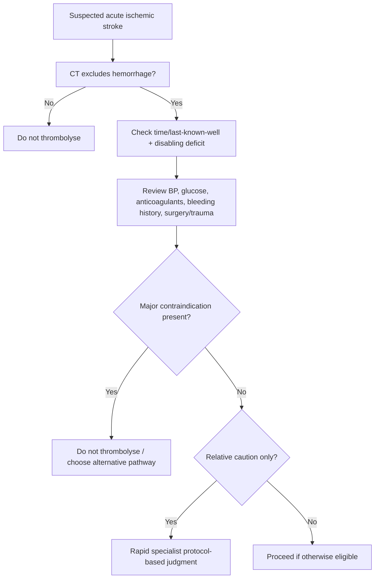
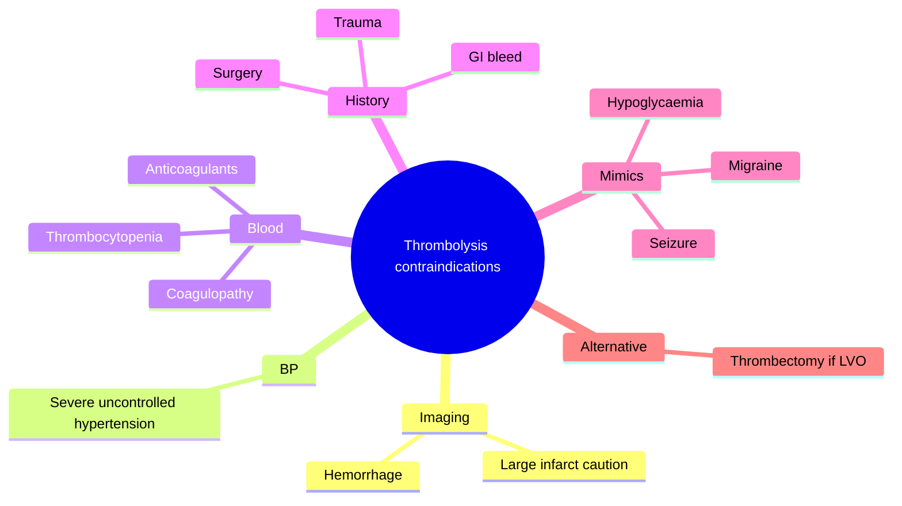
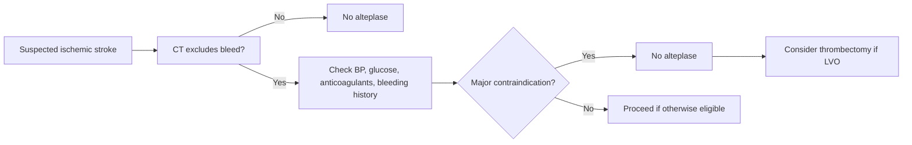

# Thrombolysis contraindications and bleeding-risk cautions

Related: [[../Stroke Medicine MOC|Stroke Medicine MOC]] · [[../Reperfusion Therapy|Reperfusion Therapy]] · [[Intravenous thrombolysis|Intravenous thrombolysis]] · [[Intravenous alteplase eligibility|Intravenous alteplase eligibility]] · [[Mechanical thrombectomy eligibility|Mechanical thrombectomy eligibility]] · [[Symptomatic intracranial haemorrhage after reperfusion|Symptomatic intracranial haemorrhage after reperfusion]]

> [!important]
> IV thrombolysis can be life-changing in acute ischaemic stroke, but the main exam danger is **giving it to the wrong patient**. The core question is whether any **bleeding-prone condition or protocol-level contraindication** makes thrombolysis more dangerous than beneficial.

## Learning Objectives
- List the major contraindication categories for IV thrombolysis.
- Explain how bleeding-risk cautions modify thrombolysis decisions.
- Distinguish absolute “stop” situations from cautionary cases needing rapid specialist judgment.

## Definition
**Thrombolysis contraindications and bleeding-risk cautions** are clinical, imaging, laboratory, and historical factors that make IV thrombolysis unsafe or less favorable because of increased risk of **intracranial or systemic bleeding**, incorrect diagnosis, or poor benefit-risk balance.

## Core Anatomy
- Thrombolysis risk is greatest when the **intracranial vasculature or infarcted tissue is already fragile**, such as in large infarcts or prior intracranial bleeding-prone states.
- Hemorrhagic transformation risk rises with extensive infarct burden, reperfusion into damaged tissue, or pre-existing bleeding lesions.
- Brain imaging is therefore central before treatment.

## Core Physiology
- Alteplase promotes fibrinolysis and may reopen an occluded artery.
- The same fibrinolysis can also disrupt hemostasis at vulnerable vascular sites.
- Bleeding risk increases when coagulation is abnormal, blood pressure is uncontrolled, recent tissue injury exists, or a hemorrhage-prone intracranial lesion is present.
- Some contraindications exist because the problem may be a **stroke mimic** or a condition where thrombolysis offers no benefit but major harm.

## Normal Values / Important Cut-offs
- Thrombolysis decision is highly time dependent, but **eligibility is never based on time alone**.
- **Blood pressure must be within treatment-safe protocol range** before treatment.
- Intracranial hemorrhage on CT is a contraindication.
- Significant coagulopathy, problematic anticoagulant exposure, or very high bleeding risk can preclude treatment.
- Very low glucose may mimic stroke and must be corrected/excluded.

## Classification
### Major contraindication categories
- **Hemorrhage / bleeding-prone intracranial state**
- **Uncontrolled severe hypertension**
- **Abnormal coagulation / anticoagulant effect**
- **Recent major bleeding, surgery, or trauma**
- **Stroke mimic / uncertain diagnosis**
- **Very large completed infarct or very high hemorrhagic-risk profile**

### Practical decision types
- **Absolute stop**: do not thrombolyse
- **Relative caution**: discuss and judge quickly using protocol and specialist context

## Etiology / Causes
This topic is about treatment exclusion rather than stroke cause, but contraindications arise from conditions such as:
- Active or recent bleeding
- Prior intracranial hemorrhage-prone conditions
- Recent surgery or trauma
- Anticoagulant effect
- Severe uncontrolled hypertension
- Large infarct or hemorrhagic transformation risk

## Risk Factors
### For bleeding after thrombolysis
- Severe uncontrolled hypertension
- Large infarct burden
- Anticoagulant use or coagulopathy
- Older frailty with bleeding-prone comorbidities
- Recent invasive procedure, trauma, or GI bleed
- Thrombocytopenia

## Pathophysiology
Thrombolysis dissolves fibrin clot to restore perfusion. If the patient has weakened vascular integrity, recent tissue injury, fragile infarcted brain, or defective coagulation, fibrinolysis can convert a therapeutic intervention into intracranial or systemic hemorrhage. In addition, when the diagnosis is not ischemic stroke, the patient may face bleeding risk with no reperfusion benefit.

## Clinical Features
### Situations that should trigger immediate caution
- Severe uncontrolled BP
- Recent major surgery or head trauma
- Known anticoagulant use
- Recent GI bleed
- Very severe stroke with large established infarct pattern
- Seizure at onset with unclear residual ischemic deficit
- Known previous intracranial bleed-prone lesion

### Stroke mimic caution clues
- Severe hypoglycaemia
- Clearly post-ictal deficit without convincing vascular syndrome
- Migraine aura with spreading positive symptoms
- Functional presentation inconsistent with vascular localization

## Approach / Algorithm

## Investigations
### Essential before decision
- Non-contrast CT head
- Blood glucose
- BP measurement and repeat checks
- Medication history, especially anticoagulants
- CBC including platelets
- Coagulation profile when anticoagulant/coagulopathy concern exists

### Additional / selected
- CTA/MRA if thrombectomy pathway may be relevant
- Renal function depending on drug history and overall planning
- MRI in selected uncertain cases if rapidly available and it will change decision without harmful delay

## Interpretation Frameworks
### Major contraindication checklist
1. **Is there any intracranial hemorrhage?**
2. **Is the blood pressure safely controllable?**
3. **Is there active anticoagulant effect/coagulopathy?**
4. **Any recent major surgery, trauma, or active bleeding?**
5. **Is this truly ischemic stroke rather than mimic?**
6. **Is the infarct already very large/completed?**

### Relative caution vs absolute stop
| Situation | General implication |
|---|---|
| Intracranial hemorrhage on CT | Absolute stop |
| Active major bleeding | Absolute stop |
| Severe uncontrolled BP not correctable | Usually stop |
| Recent surgery/trauma | Strong caution or stop depending on severity/timing |
| Uncertain stroke mimic | Do not treat blindly |
| Very large infarct | Bleeding-risk caution and protocol-based judgment |

## Diagnosis
This is a **treatment-exclusion and bleeding-risk assessment**, not a separate disease diagnosis. It is performed after suspected acute ischaemic stroke is identified and before IV thrombolysis is given.

## Differential Diagnosis
- Intracerebral hemorrhage
- Hemorrhagic transformation of infarct
- Stroke mimic: hypoglycaemia, seizure/post-ictal state, migraine aura, functional neurological disorder
- Acute ischaemic stroke still eligible for thrombectomy despite thrombolysis contraindication

## Tables / Comparison Charts
### Common contraindication categories
| Category | Example concern |
|---|---|
| Imaging | Intracranial hemorrhage |
| BP | Severe uncontrolled hypertension |
| Coagulation | Anticoagulant effect / thrombocytopenia / abnormal clotting |
| Recent events | Surgery, trauma, GI bleed |
| Diagnosis | Mimic rather than ischemic stroke |

### Common exam mistakes
| Mistake | Why wrong |
|---|---|
| Thrombolysing before hemorrhage exclusion | Catastrophic if bleed is present |
| Ignoring anticoagulant history | Major bleeding risk may be missed |
| Forgetting glucose check | Hypoglycaemia mimic may be treated unnecessarily |
| Believing thrombectomy is impossible if alteplase is contraindicated | LVO may still be treatable mechanically |
| Treating uncontrolled BP as a minor issue | Hemorrhagic risk increases sharply |

## Management
### Core principles
- Exclude intracranial hemorrhage first.
- Confirm a plausible disabling ischemic stroke syndrome.
- Review BP, glucose, anticoagulants, recent surgery/trauma, and bleeding history quickly but carefully.
- If a major contraindication exists, **do not thrombolyse**.
- Consider **mechanical thrombectomy** if large-vessel occlusion exists even when alteplase is contraindicated.

### Absolute “do not thrombolyse” style situations
- Intracranial hemorrhage on imaging
- Active major bleeding
- Dangerous uncontrolled BP not safely corrected
- Major anticoagulant/coagulation barrier according to protocol
- Strong evidence the presentation is not ischemic stroke

### Relative caution situations
- Very large completed infarct
- Recent but not necessarily absolute-prohibition surgery or trauma
- Borderline bleeding-risk comorbidities
- Rapidly improving symptoms with uncertain residual disability

## Drug Interactions / Contraindications / Comorbidity Cautions
- Recent or active **anticoagulant effect** is a major issue.
- Combining thrombolysis with bleeding-prone states dramatically raises risk.
- Severe liver disease, thrombocytopenia, recent GI bleed, or uncontrolled hypertension increase caution.
- Elderly frailty is not itself the sole issue; the actual bleeding-risk profile matters more.
- If thrombolysis is contraindicated, do not forget to evaluate **thrombectomy candidacy** in LVO stroke.

## Procedures / Indications / Contraindications
- **IV alteplase** is the procedure-like medical treatment being screened here.
- **Mechanical thrombectomy** remains relevant when alteplase cannot be given but LVO exists.

## Procedure Mini-Sections
- **Procedure:** IV thrombolysis safety screening
- **Indications:** Eligible disabling acute ischemic stroke within treatment framework
- **Contraindications:** Hemorrhage, major bleeding risk, problematic anticoagulant effect, uncontrolled severe BP, certain recent surgery/trauma contexts
- **Principle:** Prevent catastrophic bleeding while preserving access to reperfusion for the right patient
- **Viva pearl:** “Contraindicated for alteplase” does not automatically mean “no reperfusion option” if thrombectomy is possible

## Complications
- Symptomatic intracranial hemorrhage
- Systemic bleeding
- Orolingual angioedema
- Delay-related missed reperfusion if the decision process is poorly organized

## Red Flags / Emergencies
- Severe headache or neurological worsening after treatment
- Known anticoagulant exposure in a rushed hyperacute setting
- Uncontrolled very high BP at decision time
- Large completed infarct pattern on imaging
- Suspected LVO when alteplase is contraindicated but thrombectomy pathway must still be activated

## Prognosis
Correctly recognizing contraindications prevents catastrophic iatrogenic bleeding. Prognosis worsens when alteplase is given inappropriately, but also when an eligible patient is wrongly denied because a relative caution was mistaken for an absolute contraindication. The best outcomes come from accurate, rapid protocol-based judgment.

## Topic Correlation
- [[Intravenous alteplase eligibility|Intravenous alteplase eligibility]]
- [[Mechanical thrombectomy eligibility|Mechanical thrombectomy eligibility]]
- [[Symptomatic intracranial haemorrhage after reperfusion|Symptomatic intracranial haemorrhage after reperfusion]]
- [[Post-thrombolysis monitoring and BP targets|Post-thrombolysis monitoring and BP targets]]
- [[../Acute Ischaemic Stroke/Acute ischaemic stroke|Acute ischaemic stroke]]

## Special Situations
- **Low glucose:** correct before labeling as stroke.
- **Seizure at onset:** assess whether residual deficit is truly ischemic.
- **Known LVO but alteplase contraindicated:** thrombectomy pathway may still be lifesaving.
- **Large infarct / massive stroke:** bleeding risk is higher; decision becomes more cautious.

## FCPS/MRCP High-Yield Points
- The first absolute safety step is **exclude intracranial hemorrhage**.
- Always ask about **anticoagulants**, **recent surgery/trauma**, **bleeding history**, **BP**, and **glucose**.
- Not every caution is an absolute ban, but major bleeding-prone states must stop alteplase.
- A contraindication to alteplase does **not** automatically rule out thrombectomy.
- Symptomatic intracranial hemorrhage is the feared complication.

## Common Viva Questions
1. What are the main contraindication categories to thrombolysis?
2. Why is uncontrolled BP important before alteplase?
3. Why must glucose be checked?
4. Can thrombectomy still be used when alteplase is contraindicated?
5. What is the difference between an absolute stop and a relative caution?

## Common Confusions / Exam Traps
- Treating before CT excludes hemorrhage.
- Forgetting to ask about anticoagulant use.
- Calling a mimic a stroke and thrombolysing unnecessarily.
- Thinking every contraindication is permanent or every caution is absolute.
- Forgetting the thrombectomy option when alteplase cannot be given.

## Mnemonics
- **BLEED STOP**
  - **B**P uncontrolled
  - **L**esion/bleed on CT
  - **E**xisting anticoagulant/coagulopathy
  - **E**vent: recent surgery/trauma
  - **D**iagnosis uncertain / mimic
  - **S**evere large infarct caution
  - **T**hrombocytopenia/thrombotic risk context
  - **O**ngoing active bleed
  - **P**roceed only if safe

## Mind Map

## Flowchart

## Suggested Visuals / Image Notes
- Thrombolysis contraindication checklist card
- Absolute stop vs relative caution table
- Reperfusion decision tree: alteplase vs thrombectomy

## Suggested Video References
- Hyperacute stroke thrombolysis screening tutorial
- Bleeding-risk review before alteplase
- Reperfusion decisions when alteplase is contraindicated

## One-Page Revision Summary
### Thrombolysis Contraindications at a Glance
- **Must exclude first:** intracranial hemorrhage
- **Must ask/check:** BP, glucose, anticoagulants, recent surgery/trauma, active bleeding
- **Major danger:** symptomatic intracranial hemorrhage
- **Common mimic trap:** hypoglycaemia or post-ictal deficit
- **Key concept:** some situations are absolute stops, others are relative cautions
- **Do not forget:** thrombectomy may still be possible in LVO stroke

## 24-Hour Recall Prompts
- Name five contraindication categories to alteplase.
- Why is BP control important before thrombolysis?
- Why can anticoagulant history change the decision completely?
- What mimic must be checked quickly with a bedside test?
- Why does alteplase contraindication not always end reperfusion thinking?

## 7-Day / 15-Day / 30-Day Revision Tracker
- **Day 1:** Recite the contraindication checklist from memory.
- **Day 7:** Compare absolute stop vs relative caution cases.
- **Day 15:** Practice 5 thrombolysis decision scenarios.
- **Day 30:** Redo MCQs/SBAs and identify missed safety checks.

## Must Know / Should Know / Nice to Know
### Must Know
- CT bleed exclusion
- BP, glucose, anticoagulant checks
- Active bleeding and coagulopathy cautions
- Mimic recognition
- Thrombectomy alternative in LVO

### Should Know
- Large infarct bleeding-risk caution
- Recent surgery/trauma logic
- Relative vs absolute distinction

### Nice to Know
- Rare edge-case protocol details beyond core exam need
- Advanced lab thresholds per local protocol

## My Weak Points
- Do I always remember glucose and anticoagulant history?
- Can I separate an absolute stop from a relative caution?
- Do I remember thrombectomy may still be possible?

## Self-Test Scorecard
- Understanding /10
- Recall /10
- Safety triage /10
- MCQ performance /10
- Viva confidence /10

**Guide:**
- **<35/50** = weak topic
- **35–44/50** = acceptable but not secure
- **45+/50** = strong exam-ready topic

## Exam Answer Modes
### Long-answer skeleton
1. Rationale for contraindication screening
2. Major contraindication categories
3. Relative cautions
4. Common complications
5. Alternative reperfusion pathway when alteplase is unsuitable

### Short-note skeleton
- Definition
- Contraindication categories
- Bleeding-risk cautions
- Mimic checks
- Thrombectomy alternative

### Viva skeleton
- “What do you check before alteplase?”
- “What are the absolute stops?”
- “What are relative cautions?”
- “What if LVO exists but alteplase is contraindicated?”

## Summary
Thrombolysis contraindications and bleeding-risk cautions are central to safe hyperacute stroke care. The clinician must quickly exclude intracranial hemorrhage, identify major bleeding-prone conditions such as uncontrolled severe hypertension, anticoagulant/coagulation problems, active bleeding, recent major surgery/trauma, or stroke mimic, and then decide whether alteplase remains appropriate. A key exam pearl is that **alteplase contraindication does not automatically exclude mechanical thrombectomy** in large-vessel occlusion stroke.

## MCQs (10)
1. The first essential imaging-based exclusion before IV thrombolysis is:
   A. Intracranial hemorrhage  
   B. Carotid bruit  
   C. Cataract  
   D. Pleural effusion

2. Which bedside test is crucial because severe abnormality may mimic stroke?
   A. Blood glucose  
   B. Audiogram  
   C. Spirometry  
   D. Bone density

3. Which of the following is a major thrombolysis concern?
   A. Active anticoagulant effect  
   B. Controlled BP  
   C. Normal platelet count  
   D. Completed rehab

4. Uncontrolled severe hypertension matters because it:
   A. Raises hemorrhagic risk  
   B. Prevents ECG recording  
   C. Causes cataract  
   D. Confirms migraine

5. Which presentation should make you consider a stroke mimic before thrombolysis?
   A. Hypoglycaemia with resolving deficit  
   B. CT-proven LVO  
   C. Dense cortical syndrome with CTA occlusion  
   D. Definite ischemic stroke with no cautions

6. A patient may still be eligible for reperfusion even if alteplase is contraindicated because:
   A. Mechanical thrombectomy may still be possible  
   B. Thrombolysis is always unnecessary  
   C. BP no longer matters  
   D. CT is irrelevant

7. Which is a feared complication of thrombolysis?
   A. Symptomatic intracranial hemorrhage  
   B. Cataract  
   C. Osteomalacia  
   D. Hearing loss only

8. Which of the following best fits a major caution category?
   A. Recent major surgery  
   B. Good swallow  
   C. Controlled diabetes  
   D. Completed physiotherapy

9. The biggest logic error before alteplase is:
   A. Giving it before hemorrhage exclusion  
   B. Checking glucose  
   C. Asking about anticoagulants  
   D. Doing CTA in LVO suspicion

10. Which statement is most accurate?
    A. Every caution is an absolute contraindication  
    B. Absolute stops and relative cautions are not the same  
    C. Thrombolysis is safe in intracranial bleed  
    D. Mimics do not matter

## SBA Questions (10)
1. A 70-year-old man with acute focal deficit has CT showing intracerebral hemorrhage. What is the correct alteplase decision?  
   A. Do not thrombolyse  
   B. Give alteplase immediately  
   C. Delay 10 minutes and then give it  
   D. Use double-dose alteplase  
   E. Ignore CT and use clinical judgment only

2. A patient arrives with severe dysarthria and weakness. Glucose is 1.8 mmol/L and symptoms improve after correction. What is the most important principle?  
   A. Hypoglycaemia mimic must be considered  
   B. Alteplase should always be given anyway  
   C. CT is no longer required in stroke assessment  
   D. This proves basilar artery occlusion  
   E. Dual antiplatelet therapy must start immediately

3. A patient with acute ischemic stroke is found to be on a problematic anticoagulant exposure. What is the best general implication?  
   A. Thrombolysis safety becomes a major concern  
   B. It guarantees alteplase safety  
   C. BP no longer matters  
   D. Stroke mechanism no longer matters  
   E. All patients become thrombectomy-ineligible

4. A patient with suspected LVO cannot receive alteplase because of major recent surgery. What should you think next?  
   A. Mechanical thrombectomy may still be appropriate  
   B. Reperfusion options are finished  
   C. No imaging is needed  
   D. Give alteplase anyway  
   E. Start steroids instead

5. Why is severe uncontrolled BP a major issue before alteplase?  
   A. It increases hemorrhagic risk  
   B. It proves TIA  
   C. It cures clot lysis  
   D. It rules out stroke mimic  
   E. It replaces CT scanning

6. Which factor most strongly distinguishes a relative caution from an absolute stop?  
   A. Whether benefit-risk judgment may still allow treatment  
   B. Whether the patient is right-handed  
   C. Whether the patient has diabetes  
   D. Whether family arrives late  
   E. Whether physiotherapy is available

7. A post-ictal deficit after witnessed seizure is being mistaken for ischemic stroke. Why is this dangerous?  
   A. Alteplase may be given to a mimic with bleeding risk and no benefit  
   B. It prevents ECG recording  
   C. It causes carotid stenosis  
   D. It confirms hemorrhage  
   E. It rules out hypoglycaemia

8. Which is a core contraindication-screening question before alteplase?  
   A. Is there active bleeding or major recent trauma/surgery?  
   B. Does the patient prefer tea or coffee?  
   C. Is there chronic back pain?  
   D. Has the patient had physiotherapy?  
   E. Is there dermatitis?

9. The most feared CNS complication after inappropriate thrombolysis is:  
   A. Symptomatic intracranial hemorrhage  
   B. Cataract progression  
   C. Osteoporosis  
   D. Otitis externa  
   E. Hallux valgus

10. Which statement about thrombolysis contraindications is most accurate?  
    A. They require rapid but careful protocol-based screening  
    B. They are irrelevant if onset is early  
    C. Time window alone decides everything  
    D. Glucose never matters  
    E. Anticoagulant history is optional

## Flashcards
- Q: What is the first imaging exclusion before alteplase?  
  A: Intracranial hemorrhage.
- Q: Which bedside test is essential because it may reveal a mimic?  
  A: Blood glucose.
- Q: Name one major contraindication category to thrombolysis.  
  A: Uncontrolled severe hypertension, anticoagulant effect/coagulopathy, active bleeding, recent major surgery/trauma, or intracranial hemorrhage.
- Q: What is the most feared complication of thrombolysis?  
  A: Symptomatic intracranial hemorrhage.
- Q: If alteplase is contraindicated in a patient with LVO, what reperfusion option may still exist?  
  A: Mechanical thrombectomy.
- Q: Why does anticoagulant history matter before alteplase?  
  A: It may markedly increase bleeding risk.
- Q: What is a common mimic that must be excluded with a bedside test?  
  A: Hypoglycaemia.
- Q: Why is severe uncontrolled BP dangerous before alteplase?  
  A: It increases intracranial bleeding risk.
- Q: What is the difference between an absolute stop and a relative caution?  
  A: An absolute stop rules treatment out; a relative caution needs benefit-risk judgment.
- Q: Does early arrival override contraindications?  
  A: No.

## Answer Key with Explanations
### MCQs
1. **A** — Hemorrhage must be excluded before alteplase.  
2. **A** — Glucose is crucial because hypoglycaemia can mimic stroke.  
3. **A** — Anticoagulant exposure is a major bleeding-risk concern.  
4. **A** — Severe uncontrolled BP increases hemorrhagic risk.  
5. **A** — Hypoglycaemia may produce a stroke-like deficit.  
6. **A** — LVO may still be treated mechanically even when alteplase is unsuitable.  
7. **A** — Symptomatic intracranial hemorrhage is the feared complication.  
8. **A** — Recent major surgery is a key caution/possible contraindication.  
9. **A** — Giving alteplase before bleed exclusion is a catastrophic logic error.  
10. **B** — Some cautions are absolute stops, others require rapid judgment.

### SBAs
1. **A** — CT-proven intracranial hemorrhage is a clear no-thrombolysis situation.  
2. **A** — Improvement after glucose correction strongly suggests a metabolic mimic.  
3. **A** — Anticoagulant exposure makes alteplase safety a major concern.  
4. **A** — Thrombectomy may still offer reperfusion when alteplase is contraindicated.  
5. **A** — Severe uncontrolled BP raises the risk of intracranial bleeding.  
6. **A** — Relative cautions still allow benefit-risk assessment; absolute stops do not.  
7. **A** — Treating a mimic with alteplase exposes the patient to bleeding risk without ischemic-stroke benefit.  
8. **A** — Recent surgery/trauma/active bleeding is a core screening issue.  
9. **A** — Symptomatic intracranial hemorrhage is the feared CNS complication.  
10. **A** — Thrombolysis safety requires rapid but structured protocol-based screening.