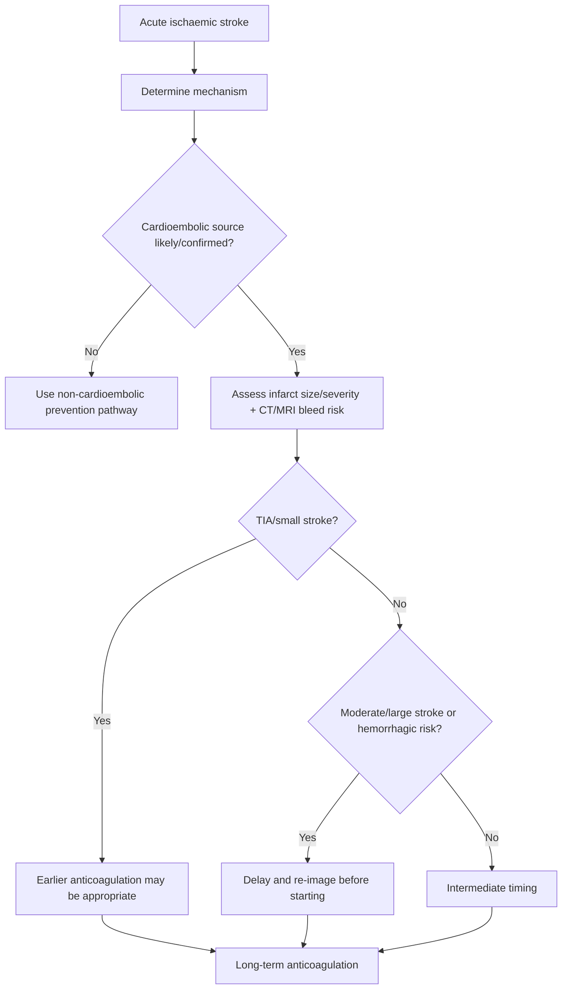
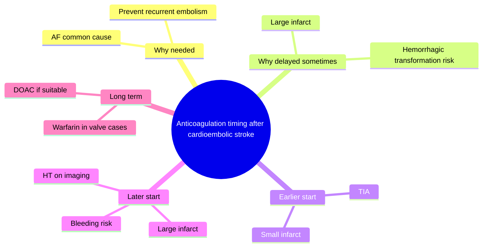
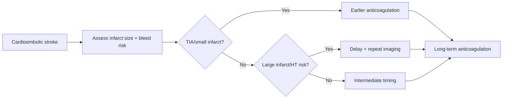

# Anticoagulation timing after cardioembolic stroke

Related: [[../Stroke Medicine MOC|Stroke Medicine MOC]] · [[../Secondary Prevention|Secondary Prevention]] · [[Antithrombotic strategies|Antithrombotic strategies]] · [[Antiplatelet therapy after ischaemic stroke|Antiplatelet therapy after ischaemic stroke]] · [[Dual antiplatelet therapy after minor stroke or TIA|Dual antiplatelet therapy after minor stroke or TIA]] · [[../Acute Ischaemic Stroke/Acute ischaemic stroke|Acute ischaemic stroke]]

> [!important]
> After **cardioembolic stroke**, anticoagulation prevents recurrent embolism, but starting it **too early** can increase the risk of **haemorrhagic transformation**. The exam problem is always a balance between **recurrent embolic risk** and **bleeding risk**.

## Learning Objectives
- Explain why anticoagulation is indicated after cardioembolic stroke.
- Apply a practical timing framework based on stroke severity, infarct size, and hemorrhagic risk.
- Distinguish when anticoagulation is preferred over antiplatelet therapy and when it must be delayed.

## Definition
**Anticoagulation timing after cardioembolic stroke** refers to the decision of when to start oral anticoagulant therapy after an acute ischaemic stroke caused by a cardioembolic source, usually **atrial fibrillation**, in order to reduce recurrent embolic stroke while minimizing intracranial bleeding risk.

## Core Anatomy
- Cardioembolic strokes often affect **cortical and large-vessel territories**, commonly the **MCA territory**, but may occur in any cerebral vascular bed.
- Large infarcts, especially cortical infarcts, have greater risk of **haemorrhagic transformation**.
- Multiple-territory infarcts may suggest embolic shower from the heart.

## Core Physiology
- Cardioembolic thrombi arise in the heart, commonly from **left atrial appendage thrombus** in atrial fibrillation.
- Anticoagulation reduces new clot formation and recurrent embolization.
- Immediately after stroke, infarcted tissue and damaged microvasculature are fragile, so very early anticoagulation may convert ischaemic infarct into hemorrhagic transformation.
- Thus, timing must consider both **embolism prevention** and **infarct-bed bleeding risk**.

## Normal Values / Important Cut-offs
- Timing is generally **earlier in smaller strokes** and **later in larger strokes**.
- Minor stroke/TIA may allow relatively early anticoagulation.
- Large infarcts, hemorrhagic transformation, uncontrolled hypertension, or major bleeding risk delay anticoagulation.
- Repeat brain imaging may be needed before starting in moderate/large infarcts.
- A common exam concept is a **severity-based staged approach** rather than one universal day for all patients.

## Classification
### By embolic source
- Atrial fibrillation-related stroke
- Left ventricular thrombus-related stroke
- Valvular cardioembolism
- Other structural cardiac embolic sources

### By timing logic
- Early start after TIA or very small infarct
- Intermediate start after mild to moderate infarct
- Delayed start after large infarct or hemorrhagic transformation risk

## Etiology / Causes
Common cardioembolic sources:
- **Atrial fibrillation**
- Recent MI with LV thrombus
- Dilated cardiomyopathy
- Rheumatic mitral stenosis with AF
- Mechanical valve / prosthetic valve-associated embolism
- Endocardial or valvular thrombotic source

## Risk Factors
### For recurrent embolism
- Atrial fibrillation
- Enlarged left atrium
- LV dysfunction
- Mechanical/valvular disease
- Previous embolic events

### For hemorrhagic transformation / bleeding
- Large infarct size
- Uncontrolled hypertension
- Older age/frailty
- Recent thrombolysis or thrombectomy-related reperfusion injury context
- Renal impairment
- Prior intracranial bleeding
- Coagulopathy

## Pathophysiology
The heart generates emboli that travel to cerebral arteries and cause infarction. The same embolic source can continue producing recurrent emboli soon after the initial stroke, particularly in AF. However, the infarcted brain is vulnerable to reperfusion injury and bleeding, especially if the infarct is large. Starting anticoagulation too soon may worsen hemorrhagic transformation; delaying too long leaves the patient exposed to another embolus.

## Clinical Features
### Clues to cardioembolic stroke mechanism
- Sudden maximal deficit at onset
- Cortical syndrome: aphasia, neglect, gaze deviation
- Multiple-territory infarcts
- Known AF or newly detected irregularly irregular pulse
- Large-vessel occlusion without major carotid culprit

### Features that influence timing caution
- Large disabling stroke
- Reduced consciousness
- Hemorrhagic transformation on imaging
- Extensive cortical infarction
- Uncontrolled BP or active bleeding tendency

## Approach / Algorithm

## Investigations
### Essential
- CT/MRI brain to define infarct size and exclude hemorrhage
- ECG
- Continuous telemetry or rhythm monitoring
- CBC, renal function, liver function if anticoagulant selection matters
- Coagulation profile

### Cardioembolic source workup
- Echocardiography in selected patients
- Holter/extended rhythm monitoring if AF not yet proven
- Vascular imaging to help distinguish carotid vs embolic mechanism where needed

### Follow-up imaging
- Repeat CT/MRI in moderate/large infarcts or if any clinical worsening before anticoagulation initiation

## Interpretation Frameworks
### Timing principle by stroke size/severity
| Scenario | Usual timing logic |
|---|---|
| TIA / very small infarct | Earlier anticoagulation |
| Mild to moderate infarct | Intermediate timing |
| Large infarct / hemorrhagic transformation risk | Later anticoagulation |

### Anticoagulation vs antiplatelet logic
| Mechanism | Preferred long-term antithrombotic |
|---|---|
| Non-cardioembolic stroke | Antiplatelet |
| AF/cardioembolic stroke | Anticoagulation usually preferred |
| Active bleeding/high hemorrhagic risk | Delay until safer |

## Diagnosis
This is a **treatment-timing decision** after diagnosis of **cardioembolic ischaemic stroke**, most commonly AF-related stroke, with imaging and clinical assessment guiding when anticoagulation can be started safely.

## Differential Diagnosis
- Non-cardioembolic ischaemic stroke better suited to antiplatelet pathway
- Hemorrhagic transformation delaying anticoagulation
- Intracerebral hemorrhage
- Stroke mimic
- Infective endocarditis-related stroke where anticoagulation may be more complex

## Tables / Comparison Charts
### Early vs delayed anticoagulation pressures
| Reason to start earlier | Reason to delay |
|---|---|
| High recurrent embolic risk | Large infarct |
| TIA/small infarct | Hemorrhagic transformation |
| Stable imaging | Uncontrolled hypertension |
| Clear AF source needing prevention | Recent major bleed/high bleeding risk |

### Common exam mistakes
| Mistake | Why wrong |
|---|---|
| Starting anticoagulation at the same time for every stroke | Timing depends on size/severity/bleeding risk |
| Leaving AF-related stroke on antiplatelet alone indefinitely | Anticoagulation is usually superior |
| Ignoring repeat imaging in a large infarct | Misses hemorrhagic transformation risk |
| Starting too early after large infarct | Increases intracranial bleeding risk |

## Management
### Core principles
- Confirm or strongly suspect a **cardioembolic mechanism**.
- Assess infarct size, stroke severity, and hemorrhagic transformation risk.
- Start anticoagulation **earlier in TIA/small stroke**, **later in larger stroke**.
- Use interim antiplatelet decisions only as appropriate while awaiting anticoagulation, according to local protocol and bleeding-risk context.

### Practical timing logic
- **TIA or tiny infarct:** anticoagulation may be started relatively early.
- **Mild to moderate stroke:** start after short delay when imaging and clinical status are stable.
- **Large infarct / hemorrhagic transformation risk:** delay further and consider repeat imaging first.

### Long-term treatment
- Direct oral anticoagulant (DOAC) is commonly used in non-valvular AF if suitable.
- Warfarin may still be required in mechanical valves or certain valvular settings.
- Continue broader secondary prevention: BP control, statin, diabetes care, smoking cessation.

## Drug Interactions / Contraindications / Comorbidity Cautions
- Combining anticoagulant with dual antiplatelet therapy greatly increases bleeding risk and should not be routine.
- Renal dysfunction affects DOAC choice and dose.
- Mechanical valve disease may require warfarin rather than DOAC.
- Recent GI bleed, thrombocytopenia, or intracranial bleeding history complicates timing.
- After thrombolysis or large reperfusion-treated stroke, timing needs extra caution.

## Procedures / Indications / Contraindications
- No primary procedure is central here, but **echocardiography**, prolonged rhythm monitoring, and occasionally valve-related decision-making are relevant.
- In selected AF patients unsuitable for anticoagulation, alternative strategies may later be considered, but this is beyond the core stroke timing exam focus.

## Procedure Mini-Sections
- **Procedure-related scenario:** Echocardiography after suspected cardioembolic stroke
- **Indications:** Identify embolic cardiac source when mechanism is uncertain or when management may change
- **Cautions:** Do not delay urgent stroke secondary-prevention planning waiting for non-essential tests
- **Viva pearl:** The timing decision depends more on infarct size/bleed risk than on the mere fact that AF exists

## Complications
- Recurrent embolic stroke if anticoagulation is delayed excessively
- Hemorrhagic transformation if started too early
- Systemic bleeding
- Medication non-adherence and recurrent embolic events

## Red Flags / Emergencies
- New neurological worsening before anticoagulation start
- Hemorrhagic transformation on repeat imaging
- Large infarct with swelling and mass effect
- Newly discovered mechanical valve or LV thrombus with high embolic risk
- Major bleeding after anticoagulation initiation

## Prognosis
Good outcomes depend on balancing recurrence prevention against bleeding risk. Prognosis worsens if the patient re-embolizes before anticoagulation or develops hemorrhagic transformation because therapy was started too early.

## Topic Correlation
- [[Antiplatelet therapy after ischaemic stroke|Antiplatelet therapy after ischaemic stroke]]
- [[Dual antiplatelet therapy after minor stroke or TIA|Dual antiplatelet therapy after minor stroke or TIA]]
- [[Atrial fibrillation-related stroke prevention|Atrial fibrillation-related stroke prevention]]
- [[../Acute Ischaemic Stroke/Acute ischaemic stroke|Acute ischaemic stroke]]
- [[../Reperfusion Therapy/Intravenous alteplase eligibility|Intravenous alteplase eligibility]]

## Special Situations
- **Mechanical valve:** warfarin usually required rather than DOAC.
- **Large cortical infarct:** later anticoagulation is safer than reflex early start.
- **Hemorrhagic transformation:** delay further and re-image.
- **TIA with AF:** often allows earlier anticoagulation than completed large infarct.
- **Elderly frail patient:** bleeding-risk review is especially important.

## FCPS/MRCP High-Yield Points
- AF-related stroke usually needs **anticoagulation**, not long-term antiplatelet alone.
- Timing depends on **stroke size/severity and bleeding risk**.
- **Earlier for TIA/small stroke, later for large stroke** is the key exam rule.
- Repeat imaging may be needed before starting in larger infarcts.
- DOACs are common in non-valvular AF; warfarin remains important in some valve-related cases.

## Common Viva Questions
1. Why is anticoagulation not started at the same time in every cardioembolic stroke?
2. Why is hemorrhagic transformation relevant to timing?
3. When is anticoagulation started earlier?
4. When would you delay it longer?
5. Why is antiplatelet therapy alone often inadequate in AF-related stroke?

## Common Confusions / Exam Traps
- Treating all AF-related strokes the same regardless of infarct size.
- Assuming anticoagulation should start immediately in every case.
- Forgetting that large infarcts bleed more easily.
- Forgetting valve-related situations where warfarin may still be preferred.
- Confusing DAPT with anticoagulation in cardioembolic prevention.

## Mnemonics
- **Small sooner, large later**
- **AF stroke = anticoagulate, but time it safely**

## Mind Map

## Flowchart

## Suggested Visuals / Image Notes
- Anticoagulation timing by stroke size chart
- AF-related stroke secondary-prevention decision map
- Hemorrhagic transformation risk concept diagram

## Suggested Video References
- AF-related stroke secondary prevention review
- DOAC vs warfarin after stroke summary
- Hemorrhagic transformation and anticoagulation timing teaching video

## One-Page Revision Summary
### Anticoagulation Timing After Cardioembolic Stroke at a Glance
- **Goal:** prevent recurrent embolic stroke
- **Main source:** AF is the commonest cause
- **Main danger of early start:** hemorrhagic transformation
- **Rule:** **small sooner, large later**
- **Need:** imaging-based size/bleeding-risk assessment
- **Long-term:** anticoagulation usually superior to antiplatelet for cardioembolic stroke
- **Valve caveat:** some patients need **warfarin** rather than DOAC

## 24-Hour Recall Prompts
- Why is anticoagulation delayed after some cardioembolic strokes?
- What is the basic timing rule by infarct size?
- Why is AF-related stroke different from non-cardioembolic stroke in prevention?
- When is repeat imaging important before starting?
- Name two situations where warfarin may still be preferred.

## 7-Day / 15-Day / 30-Day Revision Tracker
- **Day 1:** Recite the timing principle from memory.
- **Day 7:** Compare anticoagulation vs antiplatelet pathways.
- **Day 15:** Practice 5 AF-related stroke cases by size/severity.
- **Day 30:** Redo MCQs/SBAs and identify timing errors.

## Must Know / Should Know / Nice to Know
### Must Know
- AF-related stroke usually needs anticoagulation
- Small sooner, large later
- Hemorrhagic transformation risk
- Repeat imaging in larger infarcts
- DOAC vs warfarin basic distinction

### Should Know
- Mechanical-valve caveat
- Renal function/drug selection issues
- Interaction with recent reperfusion therapy

### Nice to Know
- Detailed trial-based day counts beyond core exam need
- Advanced rare cardioembolic source nuances

## My Weak Points
- Do I confuse DAPT with anticoagulation?
- Do I remember that timing depends on infarct size?
- Can I explain why repeat imaging matters in large infarcts?

## Self-Test Scorecard
- Understanding /10
- Recall /10
- Mechanism-based decision-making /10
- MCQ performance /10
- Viva confidence /10

**Guide:**
- **<35/50** = weak topic
- **35–44/50** = acceptable but not secure
- **45+/50** = strong exam-ready topic

## Exam Answer Modes
### Long-answer skeleton
1. Definition and rationale
2. Cardioembolic sources
3. Timing principles
4. Risks of early vs late start
5. Drug options and cautions

### Short-note skeleton
- AF-related stroke
- Why anticoagulation is needed
- Timing depends on infarct size
- Hemorrhagic transformation caution
- Long-term choice of agent

### Viva skeleton
- “Why not start immediately in every case?”
- “When do you start earlier?”
- “When do you delay?”
- “Why is AF different from non-cardioembolic stroke?”

## Summary
Anticoagulation after cardioembolic stroke is essential for preventing recurrent embolism, especially in AF-related stroke, but the start time must be individualized. The fundamental exam rule is **earlier for TIA/small infarct and later for large infarct or hemorrhagic-risk lesions**. Clinical severity, infarct size, repeat imaging, and bleeding risk determine when it is safe to begin long-term anticoagulation.

## MCQs (10)
1. The commonest cause of cardioembolic stroke requiring later anticoagulation is:
   A. Atrial fibrillation  
   B. Bell palsy  
   C. Migraine aura  
   D. Ménière disease

2. The main reason anticoagulation is sometimes delayed after stroke is:
   A. Cataract risk  
   B. Hemorrhagic transformation risk  
   C. It has no benefit  
   D. It treats only headache

3. Which rule best summarizes timing after cardioembolic stroke?
   A. Same day for all patients  
   B. Small sooner, large later  
   C. Never anticoagulate  
   D. Only use DAPT

4. Which patient is most likely to need earlier anticoagulation?
   A. TIA or tiny infarct with AF  
   B. Massive MCA infarct with edema  
   C. Large hemorrhagic transformation  
   D. Pontine hemorrhage

5. Which patient most strongly needs delayed anticoagulation?
   A. Tiny cortical infarct  
   B. Large infarct with hemorrhagic transformation risk  
   C. High-risk TIA  
   D. Minor lacunar symptoms only

6. In AF-related stroke, long-term antiplatelet therapy alone is usually:
   A. Sufficiently superior to anticoagulation  
   B. Inadequate compared with anticoagulation  
   C. Always mandatory with warfarin  
   D. Used to dissolve emboli acutely

7. Which investigation is especially important before starting anticoagulation in a larger infarct?
   A. Repeat brain imaging  
   B. Audiogram  
   C. Peak flow  
   D. Skin testing

8. Which long-term drug class is commonly used in non-valvular AF after stroke if suitable?
   A. DOAC  
   B. Proton-pump inhibitor only  
   C. Bronchodilator  
   D. Antihistamine

9. Which condition may still favor warfarin over DOAC?
   A. Mechanical valve  
   B. Seasonal rhinitis  
   C. Osteoarthritis  
   D. Cataract

10. The biggest prevention mistake after AF-related stroke is:
    A. Leaving the patient on antiplatelet alone indefinitely  
    B. Checking ECG  
    C. Controlling BP  
    D. Doing rehab

## SBA Questions (10)
1. A 76-year-old man with AF has a very small embolic infarct and is neurologically stable. What is the best general timing principle?  
   A. Anticoagulation may be started relatively earlier  
   B. It must always wait many weeks  
   C. Antiplatelet alone is always enough  
   D. No prevention is needed  
   E. Mechanical thrombectomy is the long-term solution

2. A 68-year-old woman has a large cortical AF-related stroke with mass effect risk. What is the most appropriate principle?  
   A. Delay anticoagulation longer because of bleeding risk  
   B. Start full anticoagulation immediately in all cases  
   C. Use DAPT instead forever  
   D. Hemorrhagic transformation is irrelevant  
   E. Imaging no longer matters

3. Which issue creates the main tension in anticoagulation timing after cardioembolic stroke?  
   A. Recurrent embolism versus hemorrhagic transformation  
   B. Cataract versus glaucoma  
   C. Tremor versus rigidity  
   D. Cough versus wheeze  
   E. Diarrhea versus constipation

4. A patient with AF-related stroke has new petechial hemorrhagic transformation on repeat imaging. What is the best general principle?  
   A. Anticoagulation timing should usually be delayed further  
   B. Start immediately regardless  
   C. Switch to lifelong DAPT  
   D. Stop all future stroke prevention permanently  
   E. Ignore the imaging change

5. What is the best long-term antithrombotic category for most AF-related strokes once safe?  
   A. Anticoagulation  
   B. Aspirin only in all patients  
   C. No therapy  
   D. Corticosteroids  
   E. Osmotherapy

6. A patient with mechanical valve-related stroke needs long-term embolic prevention. Which drug is classically important?  
   A. Warfarin  
   B. Topical NSAID  
   C. Antibiotic syrup  
   D. Lactulose  
   E. Inhaled saline

7. Why may repeat CT/MRI be needed before starting anticoagulation?  
   A. To reassess hemorrhagic transformation risk  
   B. To diagnose cataract  
   C. To confirm asthma  
   D. To measure HbA1c directly  
   E. To check hearing

8. Which patient is least likely to receive very early anticoagulation?  
   A. Large AF-related infarct with severe deficit  
   B. TIA with AF  
   C. Tiny infarct with stable imaging  
   D. Small stroke with good recovery  
   E. Mild event without hemorrhage

9. Which statement best distinguishes antiplatelet and anticoagulation pathways?  
   A. Cardioembolic stroke usually shifts long-term prevention toward anticoagulation  
   B. All strokes are treated with the same tablets  
   C. DAPT is always superior to anticoagulation in AF  
   D. Mechanism never matters  
   E. Bleeding risk is irrelevant

10. A patient re-embolicizes while anticoagulation was excessively delayed after AF-related stroke. This illustrates failure of balance between:  
    A. Embolic risk and bleeding risk  
    B. Sleep and appetite  
    C. Vision and hearing  
    D. Sodium and potassium  
    E. Cough and wheeze

## Flashcards
- Q: What is the commonest source of cardioembolic stroke?  
  A: Atrial fibrillation.
- Q: What is the main reason not to start anticoagulation immediately after every cardioembolic stroke?  
  A: Risk of hemorrhagic transformation.
- Q: What is the key timing rule after cardioembolic stroke?  
  A: Small sooner, large later.
- Q: Which patients allow earlier anticoagulation?  
  A: TIA or very small infarcts with low bleeding risk.
- Q: Which patients need later anticoagulation?  
  A: Large infarcts or those with hemorrhagic transformation risk.
- Q: What long-term strategy is usually preferred over antiplatelet alone in AF-related stroke?  
  A: Anticoagulation.
- Q: Which imaging may be repeated before starting in a large infarct?  
  A: CT or MRI brain.
- Q: Which long-term agent class is common in non-valvular AF?  
  A: DOAC.
- Q: Which condition often still favors warfarin?  
  A: Mechanical valve disease.
- Q: What is the core clinical balance in this topic?  
  A: Recurrent embolism versus bleeding risk.

## Answer Key with Explanations
### MCQs
1. **A** — AF is the commonest cardioembolic source.  
2. **B** — Hemorrhagic transformation is the main reason timing must be cautious.  
3. **B** — “Small sooner, large later” is the core exam rule.  
4. **A** — TIA or tiny infarct with AF usually allows earlier start.  
5. **B** — Large infarcts bleed more easily and require later initiation.  
6. **B** — Antiplatelet alone is usually inferior to anticoagulation for AF-related stroke prevention.  
7. **A** — Repeat imaging helps reassess hemorrhagic transformation risk.  
8. **A** — DOACs are common in non-valvular AF if appropriate.  
9. **A** — Mechanical valves commonly still require warfarin.  
10. **A** — Leaving AF-related stroke on antiplatelet alone is a major prevention error.

### SBAs
1. **A** — Stable very small infarct/TIA generally allows earlier anticoagulation.  
2. **A** — Large cortical stroke increases hemorrhagic transformation risk, so delay is safer.  
3. **A** — The whole topic is about balancing recurrent embolism against hemorrhagic conversion.  
4. **A** — Hemorrhagic transformation usually pushes timing later.  
5. **A** — Anticoagulation is the preferred long-term category in most AF-related strokes.  
6. **A** — Mechanical valves classically require warfarin.  
7. **A** — Repeat imaging reassesses whether anticoagulation is safe.  
8. **A** — Large severe infarct is least likely to receive very early anticoagulation.  
9. **A** — Cardioembolic mechanism changes the long-term prevention pathway.  
10. **A** — Excessive delay can expose the patient to recurrent embolism before protection begins.