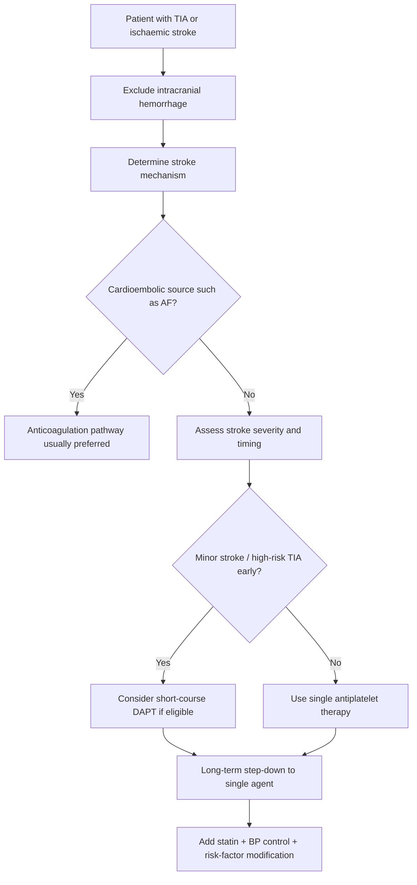
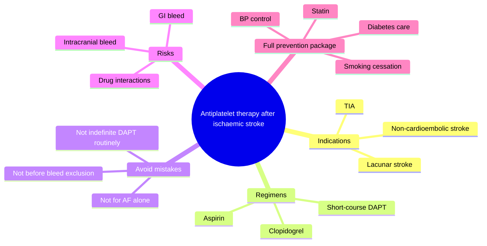
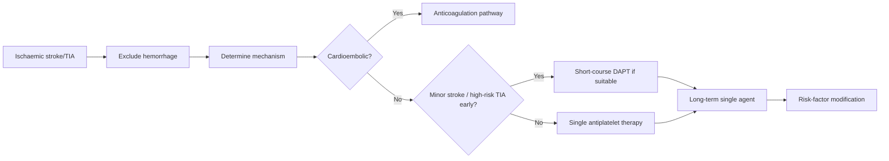

# Antiplatelet therapy after ischaemic stroke

Related: [[../Stroke Medicine MOC|Stroke Medicine MOC]] · [[../Secondary Prevention|Secondary Prevention]] · [[Antithrombotic strategies|Antithrombotic strategies]] · [[Dual antiplatelet therapy after minor stroke or TIA|Dual antiplatelet therapy after minor stroke or TIA]] · [[Anticoagulation timing after cardioembolic stroke|Anticoagulation timing after cardioembolic stroke]] · [[../Transient Ischaemic Attack/Transient ischaemic attack|Transient ischaemic attack]]

> [!important]
> Antiplatelet therapy is a core pillar of **secondary prevention after non-cardioembolic ischaemic stroke or TIA**, but it should be started only after **intracranial hemorrhage has been excluded** and should **not** replace anticoagulation when the true mechanism is cardioembolic.

## Learning Objectives
- State the role of antiplatelet therapy in secondary prevention after ischaemic stroke.
- Distinguish when to use **single antiplatelet therapy** versus **short-course dual antiplatelet therapy**.
- Recognize contraindications, bleeding cautions, drug interactions, and common FCPS/MRCP traps.

## Definition
**Antiplatelet therapy after ischaemic stroke** refers to pharmacologic inhibition of platelet activation and aggregation to reduce recurrent **non-cardioembolic** cerebral ischaemic events after TIA or ischaemic stroke.

## Core Anatomy
- Antiplatelet therapy is most relevant in **arterial thrombotic** disease involving carotid, intracranial, or small-vessel circulation.
- It reduces recurrence from platelet-rich thrombus formation over **atherosclerotic plaque**, endothelial injury, or small-vessel disease.
- It is not the definitive long-term strategy for **atrial fibrillation-related embolic stroke**, where anticoagulation is usually superior.

## Core Physiology
- Platelet activation is central to arterial thrombosis.
- **Aspirin** inhibits cyclooxygenase and thromboxane A2 production.
- **Clopidogrel** blocks the platelet P2Y12 receptor.
- Using two agents together increases platelet inhibition but also increases bleeding risk.
- Therefore, **dual antiplatelet therapy (DAPT)** is usually limited to selected early, high-risk situations rather than indefinite use.

## Normal Values / Important Cut-offs
- Hemorrhage must be excluded before initiating routine antiplatelet therapy in acute stroke/TIA pathways.
- Short-course DAPT is mainly considered after **minor ischaemic stroke** or **high-risk TIA** in the early period.
- Long-term therapy is usually **single antiplatelet**, not long-term DAPT.
- GI bleeding risk, platelet count problems, and recent major bleeding materially affect safety.

## Classification
### By regimen
- **Single antiplatelet therapy (SAPT)**
  - Aspirin
  - Clopidogrel
  - Less commonly other alternatives depending on tolerance/protocol
- **Dual antiplatelet therapy (DAPT)**
  - Usually aspirin + clopidogrel for a limited short-term course in selected patients

### By indication context
- TIA
- Minor non-cardioembolic ischaemic stroke
- Larger ischaemic stroke after hemorrhage exclusion and when thrombolysis constraints are respected

## Etiology / Causes
This topic concerns treatment after ischemic stroke mechanisms commonly driven by platelet-mediated arterial disease, including:
- Large-artery atherosclerosis
- Small-vessel disease
- Non-cardioembolic cryptogenic stroke in selected patients

## Risk Factors
### For recurrent stroke
- Hypertension
- Diabetes mellitus
- Smoking
- Dyslipidaemia
- Carotid atherosclerosis
- Prior TIA/stroke
- Sedentary lifestyle and obesity

### For bleeding on antiplatelets
- Previous GI bleed or peptic ulcer disease
- Concomitant NSAID use
- Advanced age/frailty
- Thrombocytopenia or coagulopathy
- Chronic kidney disease
- Dual therapy or combined antithrombotic use

## Pathophysiology
After an ischaemic stroke, ongoing platelet activation at sites of vascular injury or plaque instability can precipitate recurrent arterial thrombosis. Antiplatelet therapy reduces platelet aggregation and recurrent thrombotic events. However, over-inhibition increases mucosal and intracranial bleeding risk, so regimen choice must match stroke mechanism and timing.

## Clinical Features
### Clinical situations where antiplatelet therapy is central
- Non-cardioembolic ischaemic stroke after hemorrhage exclusion
- TIA requiring urgent recurrence prevention
- Small-vessel/lacunar stroke
- Atherosclerotic carotid or intracranial disease when anticoagulation is not indicated

### Situations where caution is needed
- Suspected or confirmed cardioembolic stroke requiring anticoagulation
- Recent thrombolysis before post-treatment imaging clearance
- Active bleeding or high bleeding risk
- Thrombocytopenia or severe peptic ulcer disease

## Approach / Algorithm

## Investigations
### Before/around starting therapy
- CT/MRI to exclude hemorrhage
- CBC including platelet count
- Renal function if broader antithrombotic planning is needed
- Medication history for NSAIDs, anticoagulants, prior bleeding-risk drugs
- Stool / GI bleeding history where relevant

### Mechanism-focused workup
- ECG / telemetry for atrial fibrillation
- Carotid imaging for large-artery disease
- Echocardiography in selected patients
- Vascular risk assessment: BP, HbA1c, lipid profile

## Interpretation Frameworks
### Antiplatelet vs anticoagulant logic
| Clinical situation | Preferred long-term strategy |
|---|---|
| Non-cardioembolic ischaemic stroke | Antiplatelet therapy |
| AF-related stroke/TIA | Anticoagulation usually preferred |
| Minor stroke / high-risk TIA early period | Short-course DAPT may be used |
| Large stroke with high hemorrhagic risk | Often single-agent strategy after safety review |

### SAPT vs DAPT bedside logic
| Question | Suggests SAPT | Suggests short-course DAPT |
|---|---|---|
| Stroke severity | Larger stroke / more bleeding concern | Minor stroke |
| TIA risk | Lower / routine secondary prevention | High-risk TIA |
| Long-term use | Standard | Not usually indefinite |
| Bleeding risk | Favors simpler regimen | Must be acceptable |

## Diagnosis
This is not a separate disease diagnosis; it is a **secondary prevention treatment decision** after determining that the patient has had **non-cardioembolic ischaemic stroke or TIA** and that bleeding has been excluded or judged acceptably low.

## Differential Diagnosis
- Cardioembolic stroke needing anticoagulation rather than antiplatelet monotherapy
- Intracerebral hemorrhage
- Hemorrhagic transformation of infarct
- Stroke mimic where antiplatelet therapy may be unnecessary or unsafe
- Vasculitic or unusual stroke syndromes requiring cause-specific treatment

## Tables / Comparison Charts
### Aspirin vs clopidogrel vs DAPT
| Strategy | Typical role | Main advantage | Main caution |
|---|---|---|---|
| Aspirin | Common first-line single agent | Widely available, familiar | GI irritation/bleeding |
| Clopidogrel | Alternative single agent | Useful if aspirin intolerance or selected preference | Bleeding, drug interaction considerations |
| Aspirin + clopidogrel | Short-term selected use after minor stroke/high-risk TIA | Better early recurrence reduction in selected patients | Higher bleeding risk if prolonged |

### Common exam mistakes
| Mistake | Why wrong |
|---|---|
| Using antiplatelet alone for AF-related stroke | Cardioembolic mechanism usually needs anticoagulation |
| Continuing DAPT indefinitely without indication | Bleeding risk rises without routine long-term benefit |
| Starting antiplatelet before excluding hemorrhage | May worsen bleeding |
| Forgetting GI bleed precautions | Preventable harm |

## Management
### Immediate principles
- Exclude intracranial hemorrhage first.
- Clarify whether patient had thrombolysis, because routine antiplatelet timing changes after reperfusion protocols.
- Identify mechanism: **non-cardioembolic** versus **cardioembolic**.

### Single antiplatelet therapy
- Common long-term approach for **non-cardioembolic** ischaemic stroke.
- Aspirin is widely used.
- Clopidogrel is a common alternative when aspirin is not suitable or based on protocol.

### Dual antiplatelet therapy
- Consider **short-course DAPT** after **minor ischaemic stroke** or **high-risk TIA** when bleeding risk is acceptable.
- Do **not** assume DAPT is automatically best for all stroke patients.
- Long-term DAPT is usually avoided unless there is a very specific reason.

### Broader secondary prevention package
- High-intensity statin unless contraindicated
- Strict BP control
- Diabetes optimization
- Smoking cessation
- Weight and exercise advice
- Carotid intervention or anticoagulation when appropriate to mechanism

## Drug Interactions / Contraindications / Comorbidity Cautions
- Combining antiplatelets with **anticoagulants** increases bleeding risk and must be justified carefully.
- NSAIDs and steroids can increase GI bleeding risk.
- Proton-pump protection may be considered in higher GI-risk patients.
- Prior intracranial hemorrhage, active ulcer disease, thrombocytopenia, or major bleeding history require caution.
- After alteplase, follow imaging/timing protocols before starting antiplatelets.

## Procedures / Indications / Contraindications
- **Carotid endarterectomy/stenting** may coexist with antiplatelet decisions in symptomatic carotid disease.
- **No invasive procedure** is central to antiplatelet therapy itself, but peri-procedural antithrombotic planning matters.

## Procedure Mini-Sections
- **Procedure-related scenario:** Carotid endarterectomy planning after ischaemic stroke/TIA
- **Indications:** Symptomatic carotid stenosis in appropriate patient
- **Antiplatelet relevance:** Helps prevent recurrent artery-to-artery events while definitive vascular planning proceeds
- **Cautions:** Coordinate peri-procedural bleeding risk and surgical timing
- **Viva pearl:** Antiplatelets reduce recurrence, but surgery may address the upstream culprit lesion in selected carotid disease

## Complications
- GI bleeding
- Dyspepsia
- Intracranial bleeding, less common but serious
- Recurrent stroke if wrong mechanism treated inadequately
- Drug intolerance or allergy

## Red Flags / Emergencies
- New neurological worsening suggesting hemorrhagic transformation or recurrent stroke
- Melena, hematemesis, major bruising, or other significant bleeding
- Combined antithrombotic exposure without clear indication
- Discovery of atrial fibrillation in a patient incorrectly left on antiplatelet alone

## Prognosis
Appropriate antiplatelet therapy significantly reduces recurrent non-cardioembolic stroke risk when combined with comprehensive vascular risk reduction. Prognosis is worse when stroke mechanism is misclassified or long-term prevention is incomplete.

## Topic Correlation
- [[../Transient Ischaemic Attack/Transient ischaemic attack|Transient ischaemic attack]]
- [[../Acute Ischaemic Stroke/Acute ischaemic stroke|Acute ischaemic stroke]]
- [[Dual antiplatelet therapy after minor stroke or TIA|Dual antiplatelet therapy after minor stroke or TIA]]
- [[Anticoagulation timing after cardioembolic stroke|Anticoagulation timing after cardioembolic stroke]]
- [[Carotid stenosis and carotid endarterectomy indications|Carotid stenosis and carotid endarterectomy indications]]

## Special Situations
- **Atrial fibrillation discovered later:** switch thinking toward anticoagulation pathway.
- **Elderly/frail patients:** higher bleeding risk and fall-risk considerations.
- **Peptic ulcer history:** GI protection and bleeding-risk review are important.
- **Lacunar stroke:** usually antiplatelet-based long-term prevention.
- **Recent thrombolysis:** timing of antiplatelet start must follow post-thrombolysis protocol.

## FCPS/MRCP High-Yield Points
- Antiplatelet therapy is for **non-cardioembolic** stroke prevention.
- **Do not use antiplatelet as a substitute for anticoagulation** in AF-related stroke.
- **Short-course DAPT** has a selected role in **minor stroke/high-risk TIA**.
- Long-term prevention is usually **single antiplatelet**, not indefinite DAPT.
- Always think of the full package: statin, BP control, diabetes and smoking management.

## Common Viva Questions
1. When do you choose antiplatelet therapy over anticoagulation after stroke?
2. Which patients may benefit from short-course dual antiplatelet therapy?
3. Why is long-term DAPT not routinely used after stroke?
4. What are the common complications of antiplatelet therapy?
5. Why must hemorrhage be excluded before starting therapy?

## Common Confusions / Exam Traps
- Using aspirin alone for AF-related cardioembolic stroke.
- Forgetting that DAPT is usually **short-term and selected**, not indefinite.
- Starting antiplatelets before CT excludes hemorrhage.
- Ignoring GI bleeding history or NSAID co-use.
- Failing to pair antiplatelet therapy with risk-factor control.

## Mnemonics
- **NON-CARD = platelets**
  - **Non-cardioembolic stroke → think antiplatelet**
- **DAPT = brief and selective**

## Mind Map

## Flowchart

## Suggested Visuals / Image Notes
- Secondary prevention antithrombotic decision chart
- SAPT vs DAPT comparison table card
- Mechanism-based stroke prevention algorithm

## Suggested Video References
- Secondary prevention after TIA and ischaemic stroke
- Antiplatelet vs anticoagulation in stroke prevention
- High-yield stroke antithrombotic pharmacology review

## One-Page Revision Summary
### Antiplatelet Therapy After Ischaemic Stroke at a Glance
- Use after **non-cardioembolic** ischaemic stroke/TIA
- **Exclude hemorrhage first**
- **Aspirin** is common first-line single agent
- **Clopidogrel** is a common alternative
- **Short-course DAPT** may be used in **minor stroke/high-risk TIA** if bleeding risk acceptable
- **Do not** use antiplatelet alone for AF-related cardioembolic stroke if anticoagulation is indicated
- Combine with statin, BP control, diabetes care, smoking cessation

## 24-Hour Recall Prompts
- When do you prefer antiplatelet over anticoagulation after stroke?
- Give one indication for short-course DAPT.
- Why is indefinite DAPT usually avoided?
- Name four bleeding-risk cautions for antiplatelet therapy.
- What is the biggest mechanism-based mistake in secondary prevention?

## 7-Day / 15-Day / 30-Day Revision Tracker
- **Day 1:** Explain SAPT vs DAPT vs anticoagulation from memory.
- **Day 7:** Solve 5 mechanism-based antithrombotic cases.
- **Day 15:** Rehearse bleeding cautions and GI protection logic.
- **Day 30:** Redo MCQs/SBAs and identify weak drug-choice areas.

## Must Know / Should Know / Nice to Know
### Must Know
- Non-cardioembolic stroke = antiplatelet pathway
- AF-related stroke = anticoagulation pathway
- DAPT is short-course and selected
- Hemorrhage exclusion first
- GI/intracranial bleeding risk

### Should Know
- Aspirin vs clopidogrel practical distinctions
- Post-thrombolysis timing caution
- Combined therapy bleeding-risk interactions

### Nice to Know
- Detailed peri-procedural nuances with carotid intervention
- Advanced pharmacogenetic issues beyond exam core

## My Weak Points
- Do I confuse cardioembolic with non-cardioembolic prevention?
- Do I remember that DAPT is usually temporary?
- Can I identify who should not simply remain on aspirin?

## Self-Test Scorecard
- Understanding /10
- Recall /10
- Mechanism-based decision-making /10
- MCQ performance /10
- Viva confidence /10

**Guide:**
- **<35/50** = weak topic
- **35–44/50** = acceptable but not secure
- **45+/50** = strong exam-ready topic

## Exam Answer Modes
### Long-answer skeleton
1. Role of antiplatelets in secondary prevention
2. Agents and mechanisms
3. SAPT vs DAPT indications
4. Contraindications and complications
5. Integration with overall stroke prevention

### Short-note skeleton
- Definition
- Indications
- Aspirin/clopidogrel
- DAPT short-course role
- Cautions and complications

### Viva skeleton
- “Who gets antiplatelet after stroke?”
- “Who needs anticoagulation instead?”
- “When do you use DAPT?”
- “Why not indefinitely?”

## Summary
Antiplatelet therapy is a central secondary prevention strategy after **non-cardioembolic ischaemic stroke or TIA**. The main exam logic is to **exclude hemorrhage**, classify the **stroke mechanism**, choose **single-agent** therapy for most long-term prevention, reserve **short-course DAPT** for selected early minor stroke/high-risk TIA patients, and avoid the common mistake of using antiplatelets instead of **anticoagulation** in AF-related cardioembolic stroke.

## MCQs (10)
1. The main long-term indication for antiplatelet therapy after stroke is:
   A. Cardioembolic stroke from atrial fibrillation  
   B. Non-cardioembolic ischaemic stroke  
   C. Intracerebral hemorrhage  
   D. Status epilepticus

2. Which statement about dual antiplatelet therapy after stroke is most accurate?
   A. It should be given indefinitely to all patients  
   B. It is usually reserved for selected patients and limited duration  
   C. It replaces blood pressure control  
   D. It is mandatory after every posterior stroke

3. Before starting routine antiplatelet therapy in acute stroke, you must first:
   A. Confirm hemorrhage  
   B. Exclude intracranial hemorrhage  
   C. Stop all statins  
   D. Perform lumbar puncture

4. Which agent class is usually preferred over antiplatelet therapy in atrial fibrillation-related stroke prevention?
   A. Anticoagulants  
   B. Antihistamines  
   C. Beta-blockers  
   D. Antiepileptics

5. A common long-term single antiplatelet agent after non-cardioembolic stroke is:
   A. Aspirin  
   B. Alteplase  
   C. Insulin  
   D. Mannitol

6. Which factor increases GI bleeding risk with antiplatelet therapy?
   A. NSAID co-use  
   B. Daily walking  
   C. Controlled BP  
   D. Speech therapy

7. Which patient is most likely to be considered for short-course DAPT?
   A. High-risk TIA with acceptable bleeding risk  
   B. Massive ICH  
   C. Chronic back pain  
   D. Bell palsy

8. The biggest mechanism-based mistake in secondary prevention is:
   A. Giving statin therapy  
   B. Using antiplatelet alone for AF-related stroke  
   C. Checking HbA1c  
   D. Treating hypertension

9. Which of the following is a serious complication of antiplatelet therapy?
   A. Intracranial bleeding  
   B. Cataract  
   C. Osteoarthritis  
   D. Hyperthyroidism

10. Long-term stroke prevention should combine antiplatelet therapy with:
    A. Risk-factor control only if symptoms recur  
    B. No other measures  
    C. Statin and vascular risk-factor modification  
    D. Routine antibiotics

## SBA Questions (10)
1. A 69-year-old man has a non-cardioembolic ischaemic stroke. CT excludes hemorrhage. ECG shows no AF. What is the most appropriate core long-term antithrombotic strategy?  
   A. Single antiplatelet therapy  
   B. Routine thrombolysis  
   C. Lifelong heparin infusion  
   D. No secondary prevention  
   E. Ventricular drainage

2. A 73-year-old woman has minor ischaemic stroke with low bleeding risk and presents early. Which approach may be considered for early recurrence reduction?  
   A. Short-course dual antiplatelet therapy  
   B. No therapy for 1 month  
   C. Long-term triple antithrombotic therapy  
   D. Corticosteroids  
   E. Only physiotherapy

3. A patient is found to have atrial fibrillation after an apparent ischaemic stroke. What is the key prevention principle?  
   A. Aspirin alone is always enough  
   B. Cardioembolic stroke usually shifts prevention toward anticoagulation  
   C. All antithrombotics should be permanently avoided  
   D. Antiplatelet therapy is superior to anticoagulation in AF  
   E. Use antibiotics first

4. A patient with stroke is taking frequent ibuprofen for arthritis and is started on aspirin. What is the most relevant caution?  
   A. GI bleeding risk may increase  
   B. Aspirin prevents all recurrence completely  
   C. BP becomes irrelevant  
   D. Statins must be stopped  
   E. Dysphagia disappears

5. Why is long-term DAPT not routinely used in all stroke patients?  
   A. It has no pharmacologic action  
   B. It increases bleeding risk without routine long-term benefit for everyone  
   C. It causes hydrocephalus  
   D. It treats only hemorrhage  
   E. It is only for children

6. A patient had alteplase for acute ischaemic stroke. What is the main principle before starting antiplatelet therapy?  
   A. Start immediately regardless of imaging  
   B. Follow post-thrombolysis timing/imaging safety protocol  
   C. Never use antiplatelets again  
   D. Use triple therapy automatically  
   E. Begin anticoagulation and aspirin together in everyone

7. Which patient most strongly fits the antiplatelet pathway rather than anticoagulation pathway?  
   A. Lacunar infarction without AF  
   B. AF-related embolic stroke  
   C. Mechanical heart valve embolism  
   D. Active GI bleed  
   E. Confirmed ICH

8. A 66-year-old patient with prior peptic ulcer disease needs antiplatelet therapy after non-cardioembolic stroke. What is the best general principle?  
   A. Bleeding-risk mitigation should be considered  
   B. All antiplatelets are absolutely banned forever  
   C. Ulcer history is irrelevant  
   D. Antiplatelet therapy should replace statin therapy  
   E. Stroke mechanism no longer matters

9. What is the most important first step before routine acute antiplatelet initiation after stroke symptoms?  
   A. Exclude hemorrhage  
   B. Give aspirin before brain imaging  
   C. Stop BP medications  
   D. Start dual therapy indefinitely  
   E. Perform EEG in all patients

10. Which combination best reflects comprehensive secondary prevention after non-cardioembolic stroke?  
    A. Antiplatelet + statin + BP control + smoking cessation  
    B. Antiplatelet alone only  
    C. Bed rest alone  
    D. Antibiotics + insulin only  
    E. Antiplatelet + no follow-up

## Flashcards
- Q: After what type of stroke is antiplatelet therapy classically indicated for long-term prevention?  
  A: Non-cardioembolic ischaemic stroke or TIA.
- Q: What is the major mechanism-based alternative to antiplatelet therapy in AF-related stroke?  
  A: Anticoagulation.
- Q: Is long-term dual antiplatelet therapy routine after stroke?  
  A: No, it is usually reserved for selected short-term situations.
- Q: Name two common single antiplatelet agents.  
  A: Aspirin and clopidogrel.
- Q: What must be excluded before starting routine antiplatelet therapy in acute stroke?  
  A: Intracranial hemorrhage.
- Q: Name one important GI bleeding-risk factor for antiplatelet therapy.  
  A: Previous peptic ulcer disease or NSAID co-use.
- Q: Which early clinical situations may prompt short-course DAPT?  
  A: Minor ischaemic stroke or high-risk TIA.
- Q: What is the major long-term antithrombotic mistake after AF-related stroke?  
  A: Using antiplatelet alone instead of anticoagulation when indicated.
- Q: What serious CNS complication can occur with antiplatelet therapy?  
  A: Intracranial bleeding.
- Q: Besides antiplatelets, what must accompany secondary prevention?  
  A: Statin therapy and vascular risk-factor control.

## Answer Key with Explanations
### MCQs
1. **B** — Antiplatelet therapy is mainly for non-cardioembolic ischaemic stroke prevention.  
2. **B** — DAPT is usually selective and short-term, not indefinite for all.  
3. **B** — Hemorrhage must be excluded before routine antiplatelet initiation.  
4. **A** — AF-related stroke usually needs anticoagulation rather than antiplatelet alone.  
5. **A** — Aspirin is a common long-term single antiplatelet agent.  
6. **A** — NSAIDs raise GI bleeding risk when combined with antiplatelet therapy.  
7. **A** — High-risk TIA/minor stroke may justify short-course DAPT when appropriate.  
8. **B** — Using aspirin alone for AF-related stroke is a classic prevention error.  
9. **A** — Intracranial bleeding is the key serious complication to remember.  
10. **C** — Antiplatelet therapy must be part of a wider prevention package.

### SBAs
1. **A** — In non-cardioembolic stroke without AF, single antiplatelet therapy is the core long-term antithrombotic strategy.  
2. **A** — Selected early minor stroke patients may benefit from short-course DAPT.  
3. **B** — AF changes the mechanism and usually shifts long-term prevention to anticoagulation.  
4. **A** — Ibuprofen/NSAID co-use raises GI bleeding risk with aspirin.  
5. **B** — Long-term DAPT raises bleeding risk and is not routinely beneficial for all stroke patients.  
6. **B** — After alteplase, antiplatelet start must follow imaging/timing safety protocols.  
7. **A** — Lacunar/non-cardioembolic stroke fits the antiplatelet pathway.  
8. **A** — Peptic ulcer history requires bleeding-risk mitigation and thoughtful use, not reflexive dismissal of all therapy.  
9. **A** — Excluding hemorrhage is the first safety step.  
10. **A** — Good secondary prevention combines antiplatelet therapy with lipid/BP/lifestyle management.
