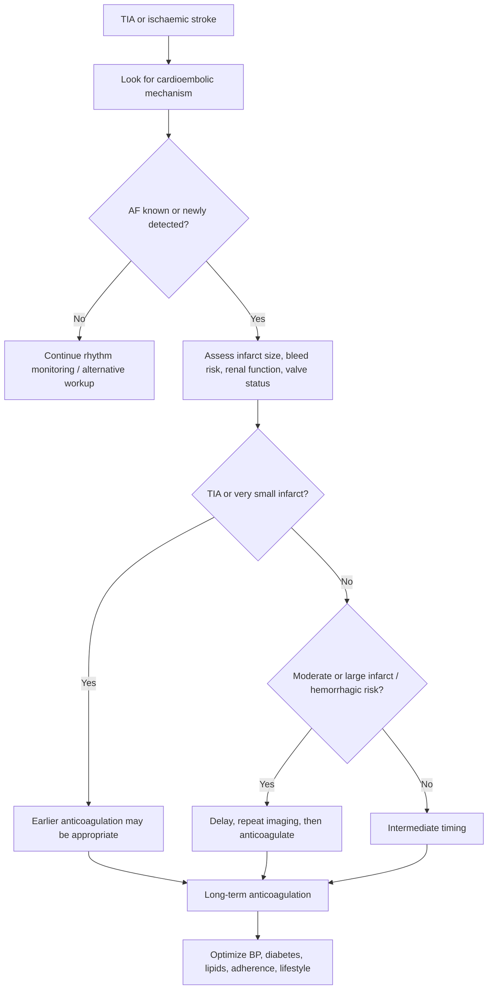
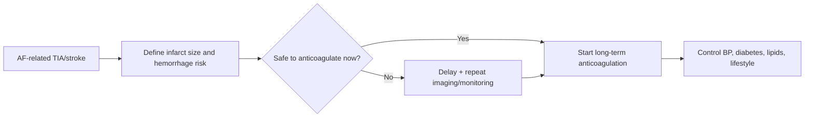

# Atrial fibrillation-related stroke prevention

Related: [[../Stroke Medicine MOC|Stroke Medicine MOC]] · [[../Secondary Prevention|Secondary Prevention]] · [[Vascular and cardiac source management|Vascular and cardiac source management]] · [[Anticoagulation timing after cardioembolic stroke|Anticoagulation timing after cardioembolic stroke]] · [[Antiplatelet therapy after ischaemic stroke|Antiplatelet therapy after ischaemic stroke]] · [[Carotid stenosis and carotid endarterectomy indications|Carotid stenosis and carotid endarterectomy indications]]

> [!important]
> **Atrial fibrillation (AF)** is one of the commonest and most exam-relevant causes of **cardioembolic stroke**. Secondary prevention depends mainly on **long-term anticoagulation**, not routine long-term antiplatelet therapy. The key exam question is: **Is the stroke/TIA likely AF-related, and when/how should anticoagulation be started safely?**

## Learning Objectives
- Explain why AF causes stroke and why recurrence risk is high without anticoagulation.
- Distinguish **AF-related stroke prevention** from prevention after non-cardioembolic stroke.
- Choose between antiplatelets and anticoagulants using mechanism-based logic.
- Recognize timing issues, bleeding cautions, and special situations.
- Recall high-yield FCPS/MRCP traps in AF-related secondary stroke prevention.

## Definition
**AF-related stroke prevention** refers to measures used to reduce recurrent cerebral embolism in patients whose TIA or ischaemic stroke is caused, or is strongly suspected to be caused, by **atrial fibrillation** or flutter. The cornerstone is **oral anticoagulation**, with risk-benefit adjustment according to infarct size, haemorrhagic risk, renal function, age, and comorbidity.

## Core Anatomy
- AF-related emboli usually arise from thrombus within the **left atrium**, especially the **left atrial appendage**.
- Emboli travel through the aorta to the carotid or vertebrobasilar circulation.
- Cardioembolic infarcts often involve:
  - **cortical territories**
  - **large-vessel territories** such as MCA territory
  - **multiple vascular territories** in embolic shower patterns
- Large cortical infarcts are more prone to **haemorrhagic transformation**, which affects anticoagulation timing.

## Core Physiology
- In AF, ineffective atrial contraction causes **blood stasis**, especially in the left atrial appendage.
- Stasis promotes thrombus formation.
- A fragment of thrombus may embolize to cerebral arteries and cause TIA or stroke.
- **Anticoagulants** reduce thrombin-mediated clot formation and recurrent embolism.
- **Antiplatelets** are much less effective for AF-related embolism because the mechanism is not primarily platelet-rich arterial thrombosis.

## Normal Values / Important Cut-offs
- AF-related stroke prevention usually requires **long-term anticoagulation** unless contraindicated.
- Timing is influenced by:
  - TIA or very small infarct → earlier anticoagulation may be possible
  - moderate stroke → intermediate timing
  - large infarct / haemorrhagic transformation risk → delay and reassess
- Severe renal impairment may change drug choice/dose.
- Very high bleeding risk does **not** automatically eliminate need for stroke prevention; it demands individualized planning.
- Long-term antiplatelet monotherapy is **not** equivalent to anticoagulation for AF-related stroke prevention.

## Classification
### By AF pattern
- Paroxysmal AF
- Persistent AF
- Permanent AF
- Atrial flutter / atrial tachyarrhythmia with embolic relevance

### By prevention strategy
- Oral anticoagulation
- Alternative strategy when anticoagulation is contraindicated or unsuitable
- Combined/bridging decisions in special situations only

### By stroke-phase decision
- Acute/post-acute timing decision
- Long-term secondary prevention decision

## Etiology / Causes
Causes of AF relevant to stroke prevention include:
- Hypertension-related atrial remodeling
- Ageing
- Ischaemic heart disease
- Heart failure
- Valvular heart disease, especially **mitral stenosis**
- Cardiomyopathy
- Hyperthyroidism
- Postoperative AF or intermittent arrhythmia discovered on monitoring

## Risk Factors
### For recurrent embolic stroke in AF
- Previous TIA/stroke
- Older age
- Hypertension
- Heart failure / LV dysfunction
- Diabetes mellitus
- Vascular disease
- Valvular AF / rheumatic disease
- Large left atrium / persistent AF burden

### For bleeding on anticoagulation
- Prior major bleed / intracranial hemorrhage
- Large recent infarct
- Uncontrolled hypertension
- Frailty / falls risk context
- Renal impairment
- Liver disease
- Concomitant NSAIDs / antiplatelets / alcohol excess
- Poor adherence or labile anticoagulation exposure

## Pathophysiology
AF abolishes effective atrial systole, producing blood stasis and thrombus formation. Thrombi, particularly from the left atrial appendage, may embolize abruptly to the cerebral circulation, causing large or multifocal cortical infarcts. Recurrence risk can remain high soon after the initial event because the arrhythmia persists and the thrombotic substrate remains active. Anticoagulation interrupts this pathophysiology, but very early anticoagulation after a large infarct can increase intracranial bleeding risk.

## Clinical Features
### Clues suggesting AF-related stroke mechanism
- Sudden onset maximal deficit
- Cortical syndrome: aphasia, neglect, visual field deficit, gaze deviation
- Multiple-territory infarcts on MRI
- Known AF history
- Irregularly irregular pulse
- No convincing symptomatic carotid culprit despite large cortical infarct

### Clinical contexts that influence prevention planning
- TIA vs completed infarct
- Minor vs large disabling stroke
- Recent thrombolysis/thrombectomy
- Hemorrhagic transformation on imaging
- Mechanical valve or rheumatic mitral stenosis
- Renal failure / frailty / recurrent falls / adherence concern

## Approach / Algorithm

## Investigations
### Rhythm confirmation and source evaluation
- **ECG**
- Continuous telemetry
- Holter / prolonged rhythm monitoring if AF not yet captured
- Echocardiography in selected patients

### Brain and vascular imaging
- CT / MRI brain to define infarct size and hemorrhagic risk
- Repeat brain imaging before anticoagulation in moderate/large infarcts if clinically indicated
- Carotid/vascular imaging when mechanism uncertainty exists

### Baseline treatment-safety workup
- CBC
- Renal function
- Liver function
- Coagulation profile if relevant
- Blood pressure assessment
- Medication review for bleeding interactions

## Interpretation Frameworks
### AF-related vs non-cardioembolic prevention
| Mechanism | Preferred long-term prevention |
|---|---|
| AF/cardioembolic stroke | Anticoagulation |
| Non-cardioembolic atherothrombotic stroke | Antiplatelet therapy |
| Uncertain mechanism | Continue workup before fixing long-term strategy |

### Timing logic after stroke
| Clinical scenario | Usual logic |
|---|---|
| TIA / very small infarct | Earlier anticoagulation |
| Mild–moderate infarct | Intermediate timing |
| Large infarct / hemorrhagic transformation risk | Later anticoagulation after reassessment |

### When antiplatelet-only strategy is insufficient
| Situation | Why antiplatelet alone is inadequate |
|---|---|
| Established AF-related stroke | Mechanism is cardioembolic, not mainly platelet-mediated |
| Recurrent embolic pattern with AF | Higher recurrence risk requires anticoagulant strategy |
| Valvular AF | Particularly high embolic risk |

## Diagnosis
Diagnosis of AF-related stroke prevention need depends on:
1. A clinical TIA or ischaemic stroke.
2. AF documented or strongly supported by monitoring.
3. A cardioembolic pattern and/or lack of a better competing cause.
4. Safety assessment for anticoagulation timing and drug choice.

## Differential Diagnosis
- Large-artery atherosclerotic stroke
- Carotid stenosis-related artery-to-artery embolism
- Lacunar/small-vessel stroke
- Patent foramen ovale-related embolism
- Left ventricular thrombus or other cardioembolic source
- Stroke mimic / seizure / migraine aura in TIA-like cases

## Tables / Comparison Charts
### Anticoagulants vs antiplatelets in AF-related stroke prevention
| Feature | Anticoagulants | Antiplatelets |
|---|---|---|
| Main role in AF-related stroke | Central | Secondary / limited |
| Mechanism match | Strong | Weak |
| Recurrent embolism prevention | Better | Inferior |
| Typical long-term strategy | Yes | No, unless anticoagulation unsuitable or another indication exists |

### AF-related stroke clues vs carotid stroke clues
| Feature | AF-related embolic stroke | Carotid stenosis-related stroke |
|---|---|---|
| Pulse | Irregularly irregular may be present | Often normal rhythm |
| Infarct pattern | Multiple / cortical / large | Ipsilateral carotid territory |
| Retinal TIAs | Less typical | More typical |
| Primary prevention strategy after event | Anticoagulation | Antiplatelet ± CEA/CAS |

## Management
### 1. Core principle
If stroke/TIA is **AF-related**, the main long-term prevention strategy is **oral anticoagulation**, not routine antiplatelet monotherapy.

### 2. Acute/post-acute decision-making
- Exclude intracranial hemorrhage.
- Determine infarct size and bleeding risk.
- Decide when anticoagulation can safely begin.
- If the infarct is large or there is hemorrhagic transformation risk, delay and re-image.

### 3. Long-term antithrombotic strategy
- Start or resume **oral anticoagulation** once safe.
- Choice depends on:
  - valvular vs non-valvular AF
  - renal function
  - bleeding risk
  - drug interactions
  - adherence feasibility
- In many exam settings, the high-yield point is simply:
  - **AF-related stroke → anticoagulation usually preferred**
  - **non-cardioembolic stroke → antiplatelet therapy usually preferred**

### 4. Antiplatelet use
- Antiplatelet therapy may be used transiently or for other vascular indications, but it is **not** the definitive long-term substitute for anticoagulation in true AF-related stroke.
- Combined antiplatelet + anticoagulant therapy increases bleeding risk and should only be used when there is another strong indication.

### 5. Risk-factor modification
- Control blood pressure
- Lipid lowering
- Diabetes management
- Smoking cessation
- Weight optimization, activity, alcohol moderation
- Treat sleep apnea and cardiac comorbidity where relevant

### 6. Adherence and monitoring issues
- Reinforce lifelong nature of prevention for many patients.
- Review missed doses, fall risk, bleeding symptoms, renal function, and drug interactions.
- Ensure patient understands why AF differs from non-cardioembolic stroke.

## Drug Interactions / Contraindications / Comorbidity Cautions
- Concurrent **NSAIDs**, dual antiplatelets, alcohol excess, or ulcer disease increase bleeding risk.
- Severe uncontrolled hypertension increases risk of intracranial hemorrhage.
- Renal failure may alter drug choice and dosing.
- Mechanical valves / rheumatic mitral stenosis require specific anticoagulation logic and are not interchangeable with all regimens.
- Large recent infarcts and hemorrhagic transformation caution against premature anticoagulation.
- Frailty/fall risk should trigger individualized review, not automatic denial of stroke prevention.

## Procedures / Indications / Contraindications
### Oral anticoagulation
**Indications**
- AF-related TIA or ischaemic stroke unless contraindicated

**Contraindications / major cautions**
- Active bleeding
- Severe uncontrolled bleeding risk state
- Very recent unsafe intracranial bleed context
- Some specific drug/pathology contraindications

### Left atrial appendage-focused alternative strategies
**Role**
- Considered in selected patients who cannot tolerate standard long-term anticoagulation

**Caution**
- Specialist decision only; not the routine first exam answer

## Procedure Mini-Sections
### Rhythm monitoring
- **Indication:** cryptogenic stroke/TIA when AF is suspected but not yet documented
- **Principle:** telemetry, Holter, or prolonged monitoring detects intermittent AF
- **Viva pearl:** paroxysmal AF still carries embolic significance and should not be dismissed as benign.

### Anticoagulation initiation after stroke
- **Preparation:** define infarct size, exclude hemorrhage, assess renal function and interactions
- **Key issue:** timing must balance recurrent embolism risk against hemorrhagic transformation
- **Viva pearl:** the question is not whether AF needs anticoagulation in principle, but **when it becomes safe to start** after the stroke.

## Complications
### Of untreated AF after stroke
- Recurrent embolic stroke
- Systemic embolism
- Major disability and recurrent hospitalization

### Of treatment
- Major bleeding
- Intracranial hemorrhage
- Drug interaction-related overanticoagulation / undertreatment
- Nonadherence with loss of protection

## Red Flags / Emergencies
- New neurological event in a known AF patient off anticoagulation
- Large recent infarct with worsening consciousness before anticoagulation decision
- Hemorrhagic transformation on repeat imaging
- Major gastrointestinal or intracranial bleeding symptoms while anticoagulated
- Mechanical valve / valvular AF with interrupted anticoagulation

## Prognosis
- AF-related stroke has high recurrence and disability potential without effective prevention.
- Appropriate anticoagulation substantially reduces recurrent embolic risk.
- Outcome depends on infarct severity, timing of anticoagulation, adherence, bleeding complications, comorbidity burden, and overall vascular risk-factor control.

## Topic Correlation
- [[Anticoagulation timing after cardioembolic stroke]] — timing framework after the index event
- [[Antiplatelet therapy after ischaemic stroke]] — important contrast with non-cardioembolic prevention
- [[Carotid stenosis and carotid endarterectomy indications]] — competing large-artery mechanism
- [[Patent foramen ovale and selected young-stroke prevention issues]] — selected embolic mechanism in younger patients
- [[Hypertension management for secondary stroke prevention]] — bleeding and recurrence risk modifier

## Special Situations
### TIA vs large completed infarct
- TIA/small infarct generally allows earlier anticoagulation than large cortical infarct.

### Elderly patient
- Age increases both stroke and bleeding risk, but elderly patients often still derive major benefit from prevention.

### Renal impairment
- Drug selection and dosing require care.

### Valvular AF / mechanical valve
- Prevention logic differs from simple non-valvular AF and is particularly high risk.

### Coexistent coronary disease
- Combined antiplatelet and anticoagulant use may occasionally be required but increases bleeding risk and needs specialist balancing.

## FCPS/MRCP High-Yield Points
- AF is a classic cause of **cardioembolic stroke**.
- **Long-term anticoagulation** is usually preferred over antiplatelet therapy for AF-related stroke prevention.
- The main post-stroke decision is **when to anticoagulate safely**.
- Large infarcts and hemorrhagic transformation risk delay anticoagulation.
- Paroxysmal AF is still clinically important.
- Mechanism matters: do not treat AF-related stroke as if it were simple carotid atherothrombotic disease.
- Anticoagulation choice depends on renal function, bleeding risk, and valve status.

## Common Viva Questions
- Why is AF such an important cause of stroke?
- Why is anticoagulation better than antiplatelet therapy in AF-related stroke prevention?
- What determines timing of anticoagulation after stroke?
- What clues suggest a stroke is cardioembolic?
- What are the major cautions before starting anticoagulation?

## Common Confusions / Exam Traps
- Giving long-term aspirin alone for definite AF-related stroke prevention.
- Starting anticoagulation too early after a large infarct.
- Ignoring intermittent/paroxysmal AF.
- Forgetting to look for a competing carotid or other embolic mechanism.
- Assuming bleeding risk always outweighs stroke-prevention benefit in older patients.

## Mnemonics
### AF stroke prevention: **A-FIB**
- **A**nticoagulation is central
- **F**ind infarct size and bleed risk
- **I**dentify rhythm and interactions
- **B**alance timing and bleeding

## Mind Map
- AF-related stroke prevention
  - mechanism
    - left atrial appendage thrombus
    - embolism
  - diagnosis
    - ECG
    - telemetry
    - Holter
  - decisions
    - anticoagulation timing
    - renal function
    - bleed risk
    - valve status
  - alternatives
    - antiplatelet only if different mechanism/other indication
  - complications
    - recurrent embolism
    - intracranial bleed

## Flowchart

## Suggested Visuals / Image Notes
- Diagram of **left atrial appendage thrombus → cerebral embolism**
- MRI examples of **multiple-territory embolic infarcts**
- Comparison chart: **AF-related stroke prevention vs carotid stenosis-related prevention**
- Timing graphic for **small vs moderate vs large infarct anticoagulation decisions**

## Suggested Video References
- Review video on **AF-related stroke prevention and anticoagulation principles**
- Short explainer on **cardioembolic stroke patterns on imaging**
- Teaching video comparing **antiplatelets vs anticoagulants** in stroke medicine

## One-Page Revision Summary
### AF-related stroke prevention: last-minute exam sheet
- AF causes stroke by **left atrial thrombus formation** and embolization.
- AF-related stroke is usually **cardioembolic**, often cortical and large-vessel.
- Long-term prevention usually requires **oral anticoagulation**.
- **Antiplatelet therapy is not equivalent** to anticoagulation in AF-related stroke.
- First exclude hemorrhage and assess infarct size before starting anticoagulation.
- Small infarcts/TIA → earlier treatment may be possible.
- Large infarcts / hemorrhagic transformation risk → delay and reassess.
- Check renal function, bleeding risk, valve status, drug interactions, adherence.
- Distinguish AF-related stroke from carotid stenosis and other non-cardioembolic causes.
- Control BP, diabetes, lipids, smoking, and lifestyle in parallel.

## 24-Hour Recall Prompts
- Why is anticoagulation preferred over aspirin in AF-related stroke?
- Name 4 clues suggesting cardioembolic stroke.
- What factors delay anticoagulation after a stroke?
- How does AF-related stroke prevention differ from carotid stenosis-related prevention?
- What special issue does renal impairment create?

## 7-Day / 15-Day / 30-Day Revision Tracker
- **Day 1:** explain the AF embolic mechanism without notes.
- **Day 7:** redraw the timing algorithm for anticoagulation.
- **Day 15:** answer the MCQs/SBAs from memory.
- **Day 30:** give a 2-minute viva comparing AF-related and non-cardioembolic stroke prevention.

## Must Know / Should Know / Nice to Know
### Must Know
- AF-related stroke → anticoagulation usually preferred
- Timing depends on infarct size and bleed risk
- Antiplatelets are inferior for true AF-related embolic prevention

### Should Know
- Multiple-territory cortical infarcts suggest cardioembolism
- Renal function, valve status, and interactions influence regimen choice

### Nice to Know
- Selected device-based alternatives when anticoagulation is impossible

## My Weak Points
- Do I confuse antiplatelet and anticoagulant indications?
- Do I remember that paroxysmal AF still matters?
- Can I explain why a large infarct delays anticoagulation?
- Do I check whether AF is really the most likely mechanism?

## Self-Test Scorecard
- Mechanism understanding: /10
- Timing confidence: /10
- Drug-strategy recall: /10
- Safety awareness: /10
- Viva readiness: /10

**Interpretation**
- **<35/50** = weak topic
- **35–44/50** = acceptable but not secure
- **45+/50** = exam ready

## Exam Answer Modes
### Long-answer mode
Define AF-related stroke, explain embolic mechanism, describe how AF-related prevention differs from non-cardioembolic prevention, discuss anticoagulation timing, cautions, and long-term secondary prevention.

### Short-note mode
AF-related stroke prevention is based mainly on long-term anticoagulation, because the mechanism is cardioembolic rather than platelet-mediated arterial thrombosis. Timing depends on infarct size and bleeding risk, especially risk of hemorrhagic transformation after large infarcts.

### Viva mode
“In AF-related TIA or ischaemic stroke, the key long-term preventive treatment is **oral anticoagulation**, not antiplatelet therapy alone. The practical decision after the acute event is when it is safe to start anticoagulation, based mainly on infarct size and bleeding risk.”

## Summary
Atrial fibrillation is a major cause of cardioembolic stroke and recurrent embolism. Secondary prevention must be mechanism-based: **AF-related stroke generally requires anticoagulation rather than long-term antiplatelet monotherapy**. The critical clinical judgment after the index event is the timing of anticoagulation, balancing recurrent embolic risk against hemorrhagic transformation, while also optimizing blood pressure, diabetes, lipids, lifestyle, renal safety, and adherence.

## MCQs (10)
1. The cornerstone of long-term prevention after AF-related ischaemic stroke is:
   - A. Antiplatelet monotherapy
   - B. Oral anticoagulation
   - C. Antibiotics
   - D. Mannitol
   - E. Carotid massage

2. AF causes stroke mainly because of:
   - A. Vertebral artery vasospasm
   - B. Left atrial thrombus formation and embolism
   - C. Meningeal inflammation
   - D. Cerebral aneurysm rupture
   - E. Hypernatremia

3. Which infarct pattern most strongly suggests cardioembolism?
   - A. Isolated pure motor lacunar stroke only
   - B. Multiple-territory cortical infarcts
   - C. Isolated peripheral neuropathy
   - D. Isolated truncal ataxia from B12 deficiency
   - E. Chronic subdural hematoma

4. Which factor most commonly delays anticoagulation after stroke?
   - A. Mild headache alone
   - B. Large infarct with hemorrhagic transformation risk
   - C. Controlled blood pressure
   - D. Normal renal function
   - E. Sinus rhythm on ECG

5. In definite AF-related stroke, antiplatelet therapy alone is:
   - A. Usually superior to anticoagulation
   - B. Equivalent to anticoagulation
   - C. Usually inferior for long-term prevention
   - D. Mandatory lifelong first-line therapy
   - E. Curative

6. Paroxysmal AF is:
   - A. Not relevant to stroke prevention
   - B. Benign and ignored after TIA
   - C. Still important and potentially embolic
   - D. Always treated with carotid surgery
   - E. A posterior circulation syndrome

7. Which investigation helps detect intermittent AF after cryptogenic stroke?
   - A. Spirometry
   - B. Holter/prolonged rhythm monitoring
   - C. Colonoscopy
   - D. Bone scan
   - E. EEG only

8. Which condition is a classic competing non-cardioembolic mechanism?
   - A. Carotid stenosis
   - B. Atrial standstill only
   - C. Left atrial appendage thrombus
   - D. Dilated left atrium
   - E. Mitral stenosis with AF

9. Which parameter is especially important for anticoagulant drug choice/dosing?
   - A. Hair color
   - B. Renal function
   - C. Shoe size
   - D. Height alone
   - E. Handedness

10. The main post-stroke decision in AF prevention is:
   - A. Whether AF ever causes stroke
   - B. Whether to use antibiotics
   - C. When anticoagulation can be started safely
   - D. Whether MRI is forbidden
   - E. Whether all carotid plaques need surgery

## SBA Questions (10)
1. A 74-year-old man with known AF presents with an acute left MCA infarct. CT excludes hemorrhage. Why is long-term anticoagulation usually preferred over aspirin alone?
   - A. Because AF-related embolism is best prevented with anticoagulation
   - B. Because aspirin causes more emboli
   - C. Because antiplatelets are never used in stroke medicine
   - D. Because AF only affects the carotid artery
   - E. Because anticoagulation is unrelated to bleeding risk

2. A 68-year-old woman has a recent cortical stroke and AF on telemetry. MRI shows a large infarct. What is the key caution?
   - A. Start all antithrombotics immediately regardless of imaging
   - B. Delay anticoagulation if hemorrhagic transformation risk is high
   - C. Use carotid endarterectomy first
   - D. Stop all vascular risk-factor treatment
   - E. Assume the stroke is lacunar

3. A 62-year-old patient has TIA symptoms, normal initial ECG, but AF is still suspected. What is the most useful next test?
   - A. Skin biopsy
   - B. Prolonged rhythm monitoring
   - C. Audiometry
   - D. Serum amylase
   - E. Peak flow

4. A 77-year-old man with AF and prior stroke asks why treatment is lifelong. The best answer is:
   - A. Because the embolic source may persist and recurrence risk remains high
   - B. Because all patients with stroke need indefinite antibiotics
   - C. Because AF never recurs
   - D. Because antiplatelets are illegal
   - E. Because MRI dictates lifelong mannitol

5. A patient with AF-related stroke is elderly and has fall risk. What is the best exam principle?
   - A. Age automatically rules out anticoagulation
   - B. Fall risk means no prevention is needed
   - C. Stroke and bleeding risks must be balanced individually
   - D. Antiplatelet therapy is always superior
   - E. CEA is first-line

6. A patient has AF, but carotid imaging also shows mild plaque. What is the key principle?
   - A. Every plaque proves carotid mechanism
   - B. Mechanism concordance must be assessed before choosing long-term prevention
   - C. All patients need both CEA and anticoagulation immediately
   - D. AF cannot coexist with carotid disease
   - E. Mild plaque excludes AF-related stroke

7. A patient with AF-related TIA has normal renal function and no bleed contraindication. What is the central long-term treatment class?
   - A. Anticoagulant
   - B. Antibiotic
   - C. Antihistamine
   - D. Osmotic diuretic
   - E. Antiepileptic only

8. A 70-year-old with AF-related stroke also takes NSAIDs for arthritis. Why is medication review important?
   - A. NSAIDs reduce all stroke risk
   - B. NSAIDs may increase bleeding risk with anticoagulation
   - C. NSAIDs cure AF
   - D. NSAIDs are mandatory before anticoagulation
   - E. They make carotid stenosis disappear

9. Which feature most strongly supports a cardioembolic mechanism?
   - A. Pure posterior neck pain only
   - B. Multiple cortical infarcts in different territories
   - C. Isolated ankle jerk loss
   - D. Normal pulse with amaurosis fugax only
   - E. Chronic lumbar radiculopathy

10. Which statement is most accurate?
   - A. Antiplatelet therapy alone is usually the best long-term strategy for AF-related stroke
   - B. Timing of anticoagulation is irrelevant after a large infarct
   - C. AF-related stroke prevention must balance recurrent embolism against bleeding risk
   - D. AF never causes severe stroke
   - E. Stroke mechanism does not matter

## Flashcards
- Q: What is the cornerstone of long-term prevention after AF-related stroke?
  A: Oral anticoagulation.

- Q: Why is antiplatelet therapy usually inferior in AF-related stroke?
  A: Because AF causes cardioembolic thrombosis, not mainly platelet-rich arterial thrombosis.

- Q: Where do many AF emboli originate?
  A: The left atrial appendage.

- Q: What imaging/clinical factor often delays anticoagulation?
  A: Large infarct size or hemorrhagic transformation risk.

- Q: Does paroxysmal AF matter for stroke prevention?
  A: Yes, it is still embolically important.

- Q: What test helps detect intermittent AF?
  A: Holter or prolonged rhythm monitoring.

- Q: What common competing mechanism must be distinguished from AF-related stroke?
  A: Carotid stenosis-related artery-to-artery embolism.

- Q: What organ function especially affects anticoagulant dosing/choice?
  A: Renal function.

- Q: What are the two key risks balanced when starting anticoagulation after stroke?
  A: Recurrent embolic stroke and intracranial bleeding/hemorrhagic transformation.

- Q: What is the simple exam rule?
  A: AF-related stroke usually needs anticoagulation; non-cardioembolic stroke usually needs antiplatelet therapy.

## Answer Key with Explanations
### MCQs
1. **B** — Long-term anticoagulation is the mainstay of AF-related stroke prevention.
2. **B** — AF leads to left atrial thrombus formation and embolization.
3. **B** — Multifocal cortical infarcts strongly suggest cardioembolism.
4. **B** — Large infarcts increase bleeding/hemorrhagic transformation risk.
5. **C** — Antiplatelet therapy alone is generally inferior for definite AF-related embolic prevention.
6. **C** — Paroxysmal AF still matters clinically.
7. **B** — Prolonged rhythm monitoring helps detect intermittent AF.
8. **A** — Carotid stenosis is a major competing non-cardioembolic mechanism.
9. **B** — Renal function is crucial for drug choice and dose safety.
10. **C** — The practical issue is when it is safe to start anticoagulation after stroke.

### SBAs
1. **A** — AF-related embolism is better prevented with anticoagulation than aspirin alone.
2. **B** — Large infarcts require caution because of hemorrhagic transformation risk.
3. **B** — Prolonged rhythm monitoring is the correct next step when AF is suspected but not yet documented.
4. **A** — Ongoing AF creates persistent embolic risk, so long-term prevention is often needed.
5. **C** — Elderly/fall-risk patients need individualized balancing, not reflex denial of treatment.
6. **B** — The visible carotid plaque may be incidental; mechanism matching is essential.
7. **A** — Anticoagulation is the central long-term treatment class.
8. **B** — NSAIDs increase bleeding risk when anticoagulation is used.
9. **B** — Multiple cortical infarcts in different territories are classic for embolic stroke.
10. **C** — AF-related prevention is fundamentally a balance between recurrent embolism and bleeding risk.

## PasTest Scenario SBAs (Clinical Vignettes)

> **Auto-generated PasTest/Mediscope-style scenario SBAs** grounded in the authored source. Each scenario tests a real clinical fact (triad, specific sign, contraindication, trial, first-line Rx) extracted from the topic. *Source: Ch 27: Neurology & Stroke — Atrial fibrillation-related stroke prevention*

**Q1.** What is the most appropriate first-line therapy for Atrial fibrillation-related stroke prevention?

  - **A.** oral anticoagulation
  - **B.** An advanced/surgical therapy reserved for refractory disease
  - **C.** Symptomatic treatment only, no disease-modifying therapy
  - **D.** Empiric broad-spectrum therapy without specific indication

  > **Answer: A** — oral anticoagulation
  >
  > *Source:* Start or resume **oral anticoagulation** once safe.

