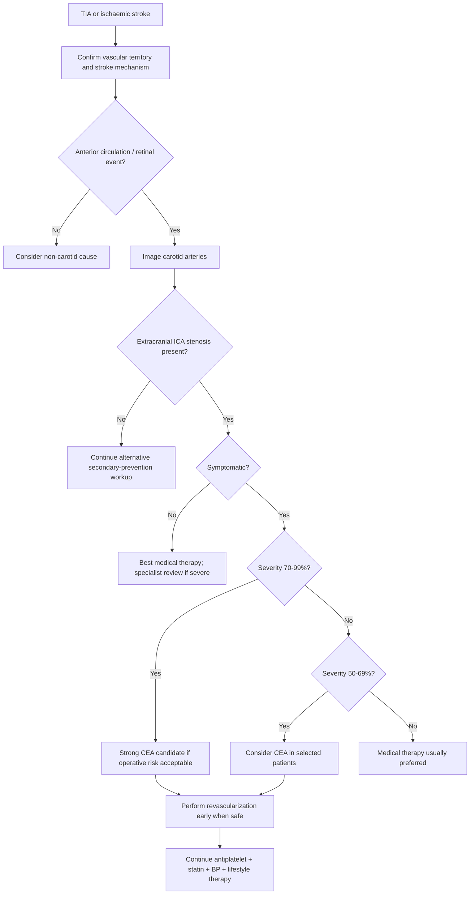
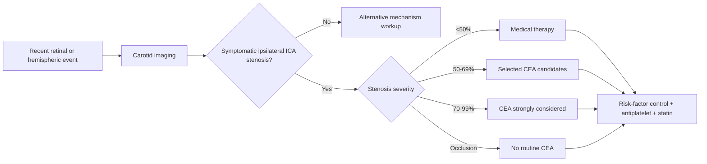

# Carotid stenosis and carotid endarterectomy indications

Related: [[../Stroke Medicine MOC|Stroke Medicine MOC]] · [[../Secondary Prevention|Secondary Prevention]] · [[Vascular and cardiac source management|Vascular and cardiac source management]] · [[Antiplatelet therapy after ischaemic stroke|Antiplatelet therapy after ischaemic stroke]] · [[Lipid lowering after stroke|Lipid lowering after stroke]] · [[Hypertension management for secondary stroke prevention|Hypertension management for secondary stroke prevention]] · [[../Transient Ischaemic Attack/Transient ischaemic attack|Transient ischaemic attack]]

> [!important]
> **Carotid endarterectomy (CEA)** is an important secondary-prevention intervention for **selected patients with symptomatic extracranial internal carotid artery stenosis**. The exam theme is: **Is the stenosis symptomatic? How severe is it? Is the lesion surgically accessible? Is operative risk acceptable? Can revascularization be performed early enough to preserve benefit?**

## Learning Objectives
- Define carotid stenosis in the context of TIA and ischaemic stroke.
- Recognize which patients benefit most from **carotid endarterectomy**.
- Distinguish **symptomatic** from **asymptomatic** carotid disease.
- Apply a practical framework to choose **medical therapy alone**, **CEA**, or occasionally **carotid artery stenting (CAS)**.
- Recall the high-yield cut-offs, timing principles, and contraindications relevant to FCPS/MRCP.

## Definition
**Carotid stenosis** is narrowing of the extracranial carotid artery, usually at the **carotid bifurcation** or proximal **internal carotid artery (ICA)**, most commonly due to atherosclerotic plaque. It may cause cerebral ischaemia by:
- **artery-to-artery embolism** from unstable plaque,
- **flow limitation** in severe disease,
- or a combination of both.

**Carotid endarterectomy (CEA)** is a surgical procedure in which the atheromatous plaque is removed from the carotid artery to reduce recurrent stroke risk in appropriately selected patients.

## Core Anatomy
- The **common carotid artery** divides into:
  - **External carotid artery (ECA)**
  - **Internal carotid artery (ICA)**
- The **ICA** supplies the **anterior circulation**, including much of the **MCA** and **ACA** territories.
- Atherosclerotic plaque commonly forms at the **carotid bifurcation** because of turbulent flow and endothelial stress.
- The carotid circulation is especially relevant for:
  - **retinal TIAs / amaurosis fugax**
  - **hemispheric TIAs**
  - **anterior circulation ischaemic stroke**
- Severe bilateral disease can impair collateral circulation, especially when the **circle of Willis** is incomplete.

## Core Physiology
- Cerebral perfusion depends on cardiac output, vascular patency, autoregulation, and collateral flow.
- Carotid plaque becomes dangerous mainly when it is **unstable and emboligenic**, not only when it is tight.
- Plaque rupture or ulceration exposes thrombogenic material, leading to thrombus formation and distal embolization.
- CEA reduces recurrent stroke risk by removing the plaque source and restoring lumen caliber.
- The benefit of CEA is greatest when the risk of recurrent ipsilateral stroke on medical therapy exceeds the procedural stroke/death risk.

## Normal Values / Important Cut-offs
- Mild stenosis: **<50%**
- Moderate stenosis: **50–69%**
- Severe stenosis: **70–99%**
- Near occlusion: very severe stenosis with distal vessel collapse; requires specialist interpretation.
- Complete occlusion: **CEA is generally not beneficial** because there is no patent lumen to clear.
- Greatest proven benefit of CEA is in **recently symptomatic severe (70–99%) extracranial ICA stenosis**.
- CEA may still benefit selected patients with **symptomatic 50–69% stenosis**, especially if overall operative risk is low and clinical/imaging features suggest substantial recurrence risk.
- Benefit is **time-sensitive**: earlier revascularization after the qualifying TIA/minor stroke is usually better once the patient is neurologically and medically suitable.

## Classification
### By symptom status
- **Symptomatic carotid stenosis**
  - Ipsilateral TIA
  - Amaurosis fugax
  - Non-disabling anterior circulation stroke
- **Asymptomatic carotid stenosis**
  - No recent ipsilateral retinal or hemispheric event attributable to that artery

### By severity
- <50%
- 50–69%
- 70–99%
- Near occlusion
- Complete occlusion

### By management pathway
- Medical therapy alone
- Medical therapy + CEA
- Medical therapy + CAS in selected situations

## Etiology / Causes
### Common causes
- **Atherosclerosis** — by far the commonest

### Less common causes / differentials
- Carotid dissection
- Fibromuscular dysplasia
- Radiation-induced vasculopathy
- Vasculitis
- Rare congenital or structural vascular disorders

## Risk Factors
### For carotid atherosclerosis
- Ageing
- Hypertension
- Diabetes mellitus
- Smoking
- Dyslipidaemia
- Established vascular disease elsewhere
- Chronic kidney disease
- Male sex
- Sedentary lifestyle / obesity

### For higher stroke risk from a carotid plaque
- Recent symptoms
- Higher degree of stenosis
- Plaque ulceration / instability
- Recurrent TIAs
- Contralateral occlusion
- Poor collateral flow

### For higher procedural risk
- Severe comorbidity
- Major cardiac disease
- Difficult neck anatomy / previous neck surgery / prior radiation
- High carotid bifurcation or technically difficult lesion
- Major disabling stroke or unstable neurological status

## Pathophysiology
Atherosclerotic plaque develops at the carotid bifurcation because local shear stress and turbulence injure endothelium. Lipid deposition, inflammation, fibrous cap formation, calcification, and plaque ulceration follow. Cerebral ischemia usually results from **embolization of platelet-fibrin material** from the plaque into the retinal or cerebral circulation rather than pure fixed flow reduction alone. In severe stenosis, reduced perfusion can also contribute, particularly when collateral pathways are inadequate. CEA works by physically removing the culprit plaque and restoring smoother laminar flow.

## Clinical Features
### Symptoms suggesting symptomatic carotid stenosis
- **Amaurosis fugax**: transient monocular visual loss
- Contralateral face/arm/leg weakness or numbness
- Dysphasia or aphasia
- Transient cortical symptoms such as neglect or higher cortical dysfunction
- Non-disabling anterior circulation stroke

### Clinical clues supporting carotid territory disease
- Recurrent stereotyped TIAs in the same vascular territory
- Retinal ischemic events on one side
- Carotid bruit (supportive, not diagnostic)
- Vascular risk factors and diffuse atherosclerotic burden

### Features arguing against carotid stenosis as the main cause
- Posterior circulation symptoms only
- Lacunar syndrome without cortical/retinal features
- Clear cardioembolic source more likely than carotid culprit
- Complete carotid occlusion where surgery is not helpful

## Approach / Algorithm

## Investigations
### Initial brain and vascular workup
- **CT / MRI brain** to define stroke type and infarct burden
- **Carotid duplex ultrasound** as first-line screening/quantification in many settings
- **CT angiography (CTA)** or **MR angiography (MRA)** to confirm severity, anatomy, and surgical suitability
- **ECG** to search for atrial fibrillation or competing cardioembolic source
- Blood tests: CBC, renal function, glucose/HbA1c, lipid profile

### Imaging points to interpret
- Degree of **extracranial ICA stenosis**
- Laterality relative to symptoms
- Plaque morphology: ulceration, irregularity, thrombus
- Near occlusion vs complete occlusion
- Intracranial tandem disease
- Contralateral carotid disease

### Cardiac and competing-cause workup
- Cardiac rhythm monitoring when AF is suspected
- Echocardiography in selected patients
- Consider alternate cause if the clinical syndrome and carotid lesion do not match

## Interpretation Frameworks
### Symptom-status logic
| Question | Meaning |
|---|---|
| Recent ipsilateral TIA, retinal ischemia, or non-disabling stroke? | Symptomatic carotid stenosis |
| No recent ipsilateral event attributable to that artery? | Asymptomatic carotid stenosis |

### Degree of stenosis and likely management direction
| Stenosis | General implication |
|---|---|
| <50% | Usually medical therapy rather than CEA |
| 50–69% symptomatic | CEA may benefit selected patients |
| 70–99% symptomatic | Strongest evidence for CEA benefit |
| Near occlusion | Specialist individualized decision |
| Complete occlusion | CEA generally not indicated |

### CEA vs CAS bedside logic
| Situation | Favours CEA | Favours CAS / alternative |
|---|---|---|
| Standard symptomatic extracranial ICA stenosis | Yes | Usually no |
| Hostile neck / prior radiation / difficult surgical access | Less favourable | CAS may be considered |
| Very high surgical risk but anatomy suitable for endovascular approach | Less favourable | CAS may be considered |
| Major disabling stroke / complete occlusion | Not useful | Usually neither revascularization strategy helps acutely |

## Diagnosis
Diagnosis requires all of the following to be integrated:
1. **A compatible clinical event**: retinal TIA, hemispheric TIA, or anterior circulation ischaemic stroke.
2. **An ipsilateral extracranial ICA lesion** of sufficient severity.
3. **Mechanism concordance**: carotid stenosis must plausibly explain the event better than competing mechanisms.
4. **Anatomical suitability** and risk assessment before offering CEA.

## Differential Diagnosis
- Cardioembolic stroke from **atrial fibrillation**
- Lacunar stroke from small-vessel disease
- Intracranial atherosclerotic disease
- Carotid dissection
- Vasculitis
- Migraine aura / stroke mimic
- Posterior circulation TIA or stroke
- Functional neurological disorder in mimic scenarios

## Tables / Comparison Charts
### Symptomatic vs asymptomatic carotid stenosis
| Feature | Symptomatic | Asymptomatic |
|---|---|---|
| Recent related retinal/hemispheric event | Present | Absent |
| Urgency of revascularization consideration | Higher | Lower |
| Expected benefit from CEA | Greater | Much more selective |
| Stroke recurrence risk without intervention | Higher | Lower than symptomatic disease |

### Carotid territory vs lacunar pattern
| Feature | Carotid territory event | Lacunar event |
|---|---|---|
| Cortical signs | Common | Usually absent |
| Amaurosis fugax | May occur | No |
| Aphasia/neglect | May occur | No |
| Main mechanism | Large-artery atherosclerosis / embolism | Small-vessel lipohyalinosis |

## Management
### 1. Immediate principles
- Treat as a **TIA/stroke secondary-prevention emergency**.
- Confirm ischemic event and carotid territory.
- Start **best medical therapy** promptly unless contraindicated.
- Refer urgently for **vascular/stroke specialist** assessment if symptomatic carotid stenosis is suspected.

### 2. Best medical therapy for all suitable patients
- **Antiplatelet therapy** for non-cardioembolic ischemic mechanism unless another strategy is indicated
- **High-intensity lipid lowering**
- **Blood pressure optimization**
- Diabetes control
- Smoking cessation
- Lifestyle risk reduction
- Weight management and exercise where appropriate
- Control of other vascular risk factors

### 3. Carotid endarterectomy indications: exam-focused framework
CEA is most strongly indicated when all or most of the following apply:
- **Symptomatic extracranial ICA stenosis**
- **Severe stenosis (70–99%)**
- Recent TIA, amaurosis fugax, or **non-disabling** stroke in the ipsilateral territory
- Reasonable life expectancy / functional baseline
- Acceptable perioperative stroke/death risk
- Anatomy suitable for surgery
- Ability to perform surgery **early enough** after the event to preserve benefit

CEA may also be considered in selected:
- **Symptomatic 50–69% stenosis**, especially when:
  - symptoms are clearly attributable to the lesion,
  - the patient is otherwise fit,
  - recurrence risk is substantial,
  - and local procedural risk is low.

CEA is generally **not indicated** when:
- stenosis is **<50%**
- artery is **completely occluded**
- neurological deficit is major and devastating with poor functional prognosis
- lesion is not the likely cause of symptoms
- medical or operative risk is prohibitive

### 4. Timing principles
- In symptomatic disease, the benefit of CEA is **front-loaded**.
- Revascularization should usually be performed **as early as safely possible** after TIA or minor/non-disabling stroke.
- Do not rush surgery in unstable patients with large infarcts, mass effect, or uncontrolled medical issues.
- Balance the risk of recurrent embolism against perioperative hemorrhagic or neurological worsening.

### 5. Carotid artery stenting (CAS)
CAS is not the default for most standard exam scenarios but may be considered when:
- surgical access is difficult,
- neck anatomy is hostile,
- prior neck radiation/surgery makes CEA less suitable,
- or surgical risk is unusually high and endovascular anatomy is favourable.

### 6. Perioperative stroke-unit points
- Continue coordinated stroke care.
- Optimize blood pressure without provoking hypoperfusion.
- Avoid delay in specialist decision-making.
- Review antithrombotic plan before and after procedure.
- Monitor for new neurological deficit after revascularization.

## Drug Interactions / Contraindications / Comorbidity Cautions
- Antiplatelet therapy increases bleeding risk, especially with **NSAIDs**, steroids, or prior GI bleeding.
- Severe coronary disease, heart failure, or arrhythmia increases operative risk and may need preoperative optimization.
- Very recent large infarction may increase risk of hemorrhagic transformation or cerebral edema after intervention.
- Distinguish non-cardioembolic carotid disease from **AF-related stroke**, where anticoagulation often matters more than carotid intervention.
- Chronic kidney disease may affect contrast use for CTA and overall vascular risk.

## Procedures / Indications / Contraindications
### Carotid endarterectomy
**Indications**
- Selected symptomatic extracranial ICA stenosis, especially **70–99%**
- Some selected symptomatic **50–69%** lesions

**Contraindications / poor-candidate situations**
- Complete occlusion
- Non-causative stenosis
- Severe disabling stroke with poor functional prognosis
- Prohibitive operative risk
- Patient not fit for surgery or declines intervention

### Carotid artery stenting
**Indications**
- Selected patients unsuitable for standard CEA but still needing revascularization

**Cautions**
- Embolic risk during procedure
- Need for appropriate expertise and anatomical suitability

## Procedure Mini-Sections
### Carotid endarterectomy
- **Principle:** open surgical removal of plaque from carotid bifurcation / proximal ICA
- **Preparation:** confirm symptomatic side, quantify stenosis, optimize antithrombotic and cardiovascular status
- **Key complications:** perioperative stroke, MI, cranial nerve injury, neck hematoma, hyperperfusion complications
- **Viva pearl:** the patient who benefits most is the one with **recent symptomatic severe extracranial ICA stenosis**, not an incidental bruit with mild narrowing.

### Carotid artery stenting
- **Principle:** endovascular revascularization with stent placement
- **Use case:** alternative when CEA is technically less suitable
- **Key complications:** embolic stroke, access complications, restenosis
- **Viva pearl:** CAS is an option for selected anatomy/risk profiles, but **CEA remains the classic exam answer** for standard symptomatic extracranial carotid stenosis.

## Complications
### Of carotid stenosis itself
- Recurrent TIA
- Ischaemic stroke
- Retinal ischemia / permanent visual loss
- Hemodynamic compromise in severe bilateral disease

### Of CEA / revascularization
- Periprocedural stroke or death
- Myocardial infarction
- Cranial nerve injury
- Neck hematoma and airway compromise
- Restenosis
- Cerebral hyperperfusion syndrome

## Red Flags / Emergencies
- Recurrent crescendo TIAs
- New focal neurological deficit after a recent carotid event
- Amaurosis fugax with high-grade ipsilateral stenosis
- Symptomatic severe carotid stenosis awaiting specialist review
- Large infarct with neurological deterioration: reassess whether immediate surgery is unsafe
- Suspected complete occlusion or tandem intracranial disease requiring more advanced vascular planning

## Prognosis
- Untreated symptomatic high-grade carotid stenosis carries significant recurrent stroke risk.
- Properly selected patients gain meaningful stroke-risk reduction from CEA.
- Prognosis depends on:
  - speed of recognition,
  - mechanism matching,
  - degree of stenosis,
  - baseline vascular burden,
  - procedural safety,
  - and quality of long-term risk-factor control.

## Topic Correlation
- [[Antiplatelet therapy after ischaemic stroke]] — background medical therapy after non-cardioembolic events
- [[Lipid lowering after stroke]] — plaque stabilization and vascular risk reduction
- [[Hypertension management for secondary stroke prevention]] — long-term vascular protection
- [[Atrial fibrillation-related stroke prevention]] — competing cardioembolic mechanism that changes antithrombotic strategy
- [[Patent foramen ovale and selected young-stroke prevention issues]] — selected cause-focused prevention in younger stroke patients

## Special Situations
### After TIA vs after completed stroke
- Benefit is often clearest after **recent TIA or minor/non-disabling stroke**.
- Large completed infarcts require more caution before surgery.

### Elderly / comorbid patients
- Age alone does not decide management.
- Functional status, cardiac risk, anatomy, and life expectancy matter.

### Bilateral disease
- Requires nuanced planning and specialist sequencing.
- Contralateral occlusion may increase both recurrence and procedural complexity.

### Young patient with carotid lesion
- Consider non-atherosclerotic causes such as **dissection** before assuming routine atherosclerotic stenosis.

## FCPS/MRCP High-Yield Points
- **Symptomatic** carotid stenosis matters far more than an incidental asymptomatic bruit.
- Best-proven benefit of CEA is in **recent symptomatic 70–99% extracranial ICA stenosis**.
- Selected **50–69% symptomatic** stenosis may still benefit.
- **<50% stenosis** usually does **not** justify CEA.
- **Complete occlusion** is generally **not** treated by CEA.
- The lesion must be **ipsilateral and causative**, not just present.
- Retinal TIA / **amaurosis fugax** counts as symptomatic carotid disease.
- CEA complements, but does not replace, **best medical therapy**.

## Common Viva Questions
- What is meant by symptomatic carotid stenosis?
- Which patient benefits most from carotid endarterectomy?
- Why is timing important after a TIA or minor stroke?
- Why is CEA not useful in complete carotid occlusion?
- When might carotid artery stenting be considered instead of CEA?

## Common Confusions / Exam Traps
- Confusing **carotid stenosis** with **cardioembolic stroke** from AF.
- Offering CEA for a **posterior circulation** event.
- Overcalling benefit in **mild (<50%)** stenosis.
- Forgetting that **amaurosis fugax** is a symptomatic carotid event.
- Recommending surgery for **complete occlusion**.
- Ignoring whether the plaque is on the **correct side** for the symptoms.

## Mnemonics
### When to think strongly about CEA: **SSTI**
- **S**ymptomatic
- **S**evere stenosis
- **T**imely intervention
- **I**psilateral culprit lesion

## Mind Map
- Carotid stenosis
  - anatomy
    - bifurcation
    - ICA
    - anterior circulation
  - mechanism
    - plaque ulceration
    - artery-to-artery embolism
    - flow limitation
  - symptom status
    - amaurosis fugax
    - TIA
    - minor stroke
  - severity
    - <50%
    - 50–69%
    - 70–99%
    - occlusion
  - treatment
    - medical therapy
    - CEA
    - CAS selected cases
  - risks
    - recurrent stroke
    - perioperative stroke
    - cranial nerve injury
    - hyperperfusion

## Flowchart

## Suggested Visuals / Image Notes
- Diagram of **carotid bifurcation** and **ICA vs ECA**
- Duplex ultrasound image showing **ICA plaque and velocity criteria**
- CTA example of **high-grade extracranial ICA stenosis**
- Timeline diagram: **TIA/minor stroke → urgent carotid imaging → early CEA decision**

## Suggested Video References
- Short review on **symptomatic carotid stenosis and CEA indications**
- Duplex ultrasound interpretation for **carotid stenosis**
- Surgical overview of **carotid endarterectomy steps and complications**

## One-Page Revision Summary
### Carotid stenosis and CEA: last-minute exam sheet
- Carotid stenosis usually arises at the **bifurcation / proximal ICA** due to atherosclerosis.
- It causes stroke mainly by **plaque embolization**.
- Symptoms: **amaurosis fugax**, ipsilateral retinal TIA, contralateral weakness/numbness, aphasia.
- Determine whether stenosis is **symptomatic** and **ipsilateral**.
- **Best medical therapy** is mandatory for all: antiplatelet, statin, BP control, diabetes/smoking/lifestyle management.
- **CEA gives greatest benefit in recent symptomatic 70–99% extracranial ICA stenosis**.
- Selected **50–69% symptomatic** lesions may benefit.
- **<50% stenosis**: usually medical therapy.
- **Complete occlusion**: CEA generally not useful.
- **CAS** is reserved for selected patients less suitable for surgery.
- Timing matters: intervention should be **early when safe** after TIA/minor stroke.
- Always correlate symptoms, side, imaging, and competing stroke mechanisms.

## 24-Hour Recall Prompts
- Define symptomatic carotid stenosis without looking.
- State the stenosis categories and which one benefits most from CEA.
- Why is CEA not advised in complete occlusion?
- List 4 clinical events that count as symptomatic carotid disease.
- Compare CEA with CAS in one minute.

## 7-Day / 15-Day / 30-Day Revision Tracker
- **Day 1:** recall the symptomatic vs asymptomatic framework.
- **Day 7:** redraw the management flowchart from memory.
- **Day 15:** answer all MCQs/SBAs again without notes.
- **Day 30:** explain CEA indications aloud in a 2-minute viva answer.

## Must Know / Should Know / Nice to Know
### Must Know
- Symptomatic vs asymptomatic distinction
- 50–69% vs 70–99% significance
- CEA strongest indication: recent symptomatic severe extracranial ICA stenosis
- Complete occlusion is not a routine CEA indication

### Should Know
- Why carotid plaque embolizes
- Why timing matters after TIA/minor stroke
- CAS as an alternative in selected anatomy/risk settings

### Nice to Know
- Detailed perioperative technical nuances
- Subtle imaging distinctions in near occlusion

## My Weak Points
- Do I mix up carotid territory stroke with AF-related cardioembolic stroke?
- Do I forget that **amaurosis fugax** is a carotid symptom?
- Do I wrongly recommend surgery for complete occlusion?
- Can I state exactly who benefits most from CEA?

## Self-Test Scorecard
- Understanding of mechanism: /10
- Recall of indications: /10
- Imaging interpretation logic: /10
- Management confidence: /10
- Viva readiness: /10

**Interpretation**
- **<35/50** = weak topic
- **35–44/50** = acceptable but needs reinforcement
- **45+/50** = exam ready

## Exam Answer Modes
### Long-answer mode
Discuss definition, mechanism, symptom status, imaging confirmation, CEA indications, contraindications, CAS alternatives, and secondary-prevention medical therapy.

### Short-note mode
Symptomatic extracranial ICA stenosis, especially severe (70–99%), benefits most from early CEA if operative risk is acceptable. Selected 50–69% lesions may benefit. Mild stenosis and complete occlusion are not routine surgical indications.

### Viva mode
“Carotid endarterectomy is mainly indicated for selected patients with **recent symptomatic extracranial internal carotid artery stenosis**, particularly **70–99% stenosis**. The lesion must match the symptoms, the patient must be fit enough for surgery, and medical therapy must continue regardless.”

## Summary
Carotid stenosis is a major cause of anterior-circulation TIA and ischaemic stroke, mainly through artery-to-artery embolism from unstable plaque at the carotid bifurcation. Management begins with urgent confirmation that the lesion is symptomatic, ipsilateral, and of clinically important severity. All patients need aggressive medical secondary prevention, but **CEA provides the clearest stroke-risk reduction in recent symptomatic severe extracranial ICA stenosis**, with selective benefit in moderate symptomatic disease. Mild stenosis and complete occlusion are generally managed without CEA.

## MCQs (10)
1. The group with the greatest proven benefit from carotid endarterectomy is:
   - A. Asymptomatic 20% carotid stenosis
   - B. Symptomatic 70–99% extracranial ICA stenosis
   - C. Complete ICA occlusion
   - D. Pure posterior circulation TIA
   - E. Small-vessel lacunar stroke without carotid disease

2. A classic symptom of symptomatic carotid stenosis is:
   - A. Binocular diplopia only
   - B. Isolated vertigo
   - C. Amaurosis fugax
   - D. Pure truncal ataxia
   - E. Bilateral hearing loss

3. The usual pathological site of atherosclerotic carotid stenosis is:
   - A. Vertebral artery origin only
   - B. Basilar tip
   - C. Carotid bifurcation / proximal ICA
   - D. Distal MCA branch only
   - E. Superior sagittal sinus

4. Which statement about complete carotid occlusion is most accurate?
   - A. It is the strongest indication for CEA
   - B. It is usually treated by routine CEA
   - C. CEA is generally not beneficial
   - D. It always causes subarachnoid hemorrhage
   - E. It is managed with thrombolysis alone regardless of timing

5. In symptomatic carotid disease, the main mechanism of cerebral ischemia is usually:
   - A. Hypercalcemia
   - B. Artery-to-artery embolism from plaque
   - C. Venous thrombosis
   - D. Meningitis
   - E. Brain tumor compression

6. Which stenosis range may still benefit from CEA in selected symptomatic patients?
   - A. 0–10%
   - B. 10–20%
   - C. 20–30%
   - D. 50–69%
   - E. 100%

7. Carotid endarterectomy should be considered only after:
   - A. Ignoring symptom side
   - B. Confirming lesion severity and clinical concordance
   - C. Assuming all strokes are carotid in origin
   - D. Excluding antiplatelets forever
   - E. Waiting years after symptoms

8. Which scenario argues against carotid stenosis as the main culprit?
   - A. Amaurosis fugax
   - B. Aphasia with ipsilateral ICA plaque
   - C. Posterior circulation syndrome only
   - D. Recurrent hemispheric TIAs
   - E. Ipsilateral retinal ischemia

9. Carotid artery stenting is mainly considered when:
   - A. CEA is always forbidden
   - B. Surgical anatomy/risk makes CEA less suitable
   - C. There is no carotid lesion
   - D. The patient has complete carotid occlusion and no symptoms
   - E. The stroke was definitely due to AF only

10. All suitable patients with carotid stenosis also require:
   - A. No vascular risk-factor treatment
   - B. Best medical secondary prevention
   - C. Routine neurosurgery for everyone
   - D. Long-term antibiotics
   - E. Mandatory lifelong dual antiplatelet therapy in all cases

## SBA Questions (10)
1. A 66-year-old man has transient right arm weakness and expressive dysphasia lasting 20 minutes. Duplex shows 80% left extracranial ICA stenosis. ECG is sinus rhythm. What is the best next prevention strategy?
   - A. No treatment until symptoms recur
   - B. Long-term anticoagulation only
   - C. Best medical therapy plus urgent evaluation for carotid endarterectomy
   - D. Posterior fossa decompression
   - E. Treat as migraine and reassure

2. A 72-year-old woman has amaurosis fugax of the right eye. CTA shows 75% right extracranial ICA stenosis. Which statement is most correct?
   - A. This is asymptomatic carotid disease
   - B. This is symptomatic carotid disease and CEA may be beneficial
   - C. CEA is contraindicated because the event was ocular
   - D. Only diabetes control matters
   - E. The lesion is irrelevant because symptoms were transient

3. A 69-year-old man has a small anterior circulation stroke. Imaging shows complete occlusion of the ipsilateral ICA. What is the usual role of CEA?
   - A. Strong indication
   - B. Mandatory within 24 hours
   - C. Generally not beneficial
   - D. First-line therapy before any medical treatment
   - E. Required only if bruit is absent

4. A 63-year-old woman has a TIA and 55% ipsilateral extracranial ICA stenosis. Which is the best statement?
   - A. CEA is never considered below 100%
   - B. Selected symptomatic 50–69% lesions may still benefit
   - C. Symptom status does not matter
   - D. Surgery is always superior regardless of risk
   - E. Only vertebral imaging is relevant

5. A patient with severe symptomatic carotid stenosis also has poorly controlled hypertension, smoking, and high LDL. Which is true?
   - A. CEA removes the need for medical therapy
   - B. Only lifestyle changes matter
   - C. Secondary-prevention medical therapy remains essential
   - D. Antiplatelets are always contraindicated
   - E. Lipid lowering is unrelated

6. Which patient is LEAST likely to benefit from CEA?
   - A. Recent amaurosis fugax with 80% ipsilateral stenosis
   - B. Minor hemispheric TIA with 75% ipsilateral stenosis
   - C. Posterior circulation symptoms with incidental 40% ICA stenosis
   - D. Recurrent ipsilateral TIAs with high-grade stenosis
   - E. Non-disabling anterior circulation stroke with severe stenosis

7. A 58-year-old patient has a recent TIA and 78% symptomatic carotid stenosis. Why should the specialist pathway not be unnecessarily delayed?
   - A. Because benefit from CEA is greatest when performed early enough after the event
   - B. Because all patients need immediate craniotomy
   - C. Because carotid disease never recurs
   - D. Because statins stop working after one week
   - E. Because retinal events do not count

8. A 70-year-old patient has an ipsilateral carotid plaque but ECG shows persistent AF and MRI pattern is strongly cardioembolic. What is the key exam principle?
   - A. Every carotid plaque needs CEA
   - B. Mechanism concordance matters before attributing stroke to carotid stenosis
   - C. AF and carotid disease can never coexist
   - D. Anticoagulation is always forbidden after stroke
   - E. Carotid severity is irrelevant in all cases

9. Which complication is important after CEA?
   - A. Acute appendicitis
   - B. Cranial nerve injury
   - C. Pancreatitis
   - D. Nephrotic syndrome
   - E. Otitis media

10. Which factor most strongly supports labeling a carotid stenosis as symptomatic?
   - A. Remote leg fracture
   - B. Ipsilateral retinal or hemispheric ischemic event
   - C. Isolated fever
   - D. Raised amylase
   - E. Generalized pruritus

## Flashcards
- Q: What is the strongest classic indication for carotid endarterectomy?
  A: Recent symptomatic 70–99% extracranial internal carotid artery stenosis in a suitable surgical candidate.

- Q: What ocular symptom can make carotid stenosis “symptomatic”?
  A: Amaurosis fugax.

- Q: Which artery is most relevant in standard CEA indications?
  A: The extracranial internal carotid artery.

- Q: Is CEA usually indicated for <50% stenosis?
  A: No, usually medical therapy is preferred.

- Q: Is CEA generally useful in complete carotid occlusion?
  A: No.

- Q: What is the commonest mechanism of stroke from carotid plaque?
  A: Artery-to-artery embolism.

- Q: What 3 major treatment pillars continue even if CEA is planned?
  A: Antiplatelet therapy, statin/lipid lowering, and vascular risk-factor control.

- Q: When may CAS be considered?
  A: When CEA is less suitable because of anatomy, prior neck surgery/radiation, or high surgical risk.

- Q: What matters more than the mere presence of a plaque?
  A: Whether it is symptomatic, ipsilateral, and of significant severity.

- Q: What type of stroke syndrome should make you doubt carotid stenosis as the main cause?
  A: Posterior circulation syndrome only.

## Answer Key with Explanations
### MCQs
1. **B** — Severe recent symptomatic extracranial ICA stenosis has the clearest evidence-based benefit from CEA.
2. **C** — Amaurosis fugax is a classic symptomatic carotid event.
3. **C** — Plaque usually forms at the carotid bifurcation / proximal ICA.
4. **C** — Complete occlusion is generally not helped by CEA.
5. **B** — Embolization from unstable plaque is the main mechanism.
6. **D** — Selected symptomatic moderate stenosis (50–69%) may still benefit.
7. **B** — Imaging severity and symptom concordance must be confirmed.
8. **C** — Posterior circulation symptoms suggest another mechanism.
9. **B** — CAS is mainly reserved for selected patients less suitable for CEA.
10. **B** — Best medical therapy remains essential for all suitable patients.

### SBAs
1. **C** — This is classic symptomatic severe carotid stenosis needing urgent best medical therapy plus CEA evaluation.
2. **B** — Ocular ischemia counts as symptomatic carotid disease.
3. **C** — Complete ICA occlusion is generally not a routine CEA indication.
4. **B** — Selected symptomatic 50–69% lesions may benefit from CEA.
5. **C** — Revascularization never replaces comprehensive secondary prevention.
6. **C** — Posterior circulation symptoms with mild incidental carotid narrowing are least supportive of CEA benefit.
7. **A** — Benefit declines if symptomatic disease is left untreated for too long.
8. **B** — A carotid plaque may coexist with AF; mechanism matching is essential.
9. **B** — Cranial nerve injury is a recognized complication of CEA.
10. **B** — The definition of symptomatic disease depends on recent ipsilateral retinal or hemispheric ischemia.