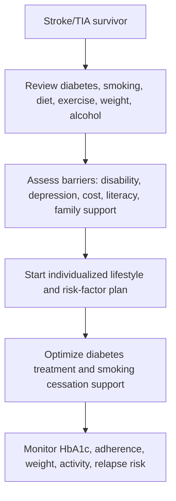
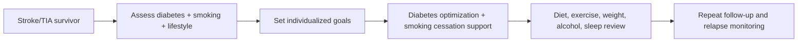

# Diabetes, smoking, and lifestyle modification in stroke prevention

Related: [[../Stroke Medicine MOC|Stroke Medicine MOC]] · [[../Secondary Prevention|Secondary Prevention]] · [[Risk-factor modification|Risk-factor modification]] · [[Hypertension management for secondary stroke prevention]] · [[Lipid lowering after stroke]] · [[Atrial fibrillation-related stroke prevention]]

> [!important]
> Secondary stroke prevention is not just about antiplatelets and statins. **Diabetes control, smoking cessation, diet, exercise, weight management, alcohol moderation, and sleep-related risk reduction** are all major recurrence-prevention interventions.

## Learning Objectives
- Explain how diabetes, smoking, and adverse lifestyle factors increase recurrent stroke risk.
- Outline practical secondary prevention counseling and treatment strategies.
- Recognize lifestyle measures with the strongest FCPS/MRCP relevance.
- Integrate behavioral, metabolic, and vascular risk reduction into long-term stroke care.

## Definition
**Diabetes, smoking, and lifestyle modification in stroke prevention** refers to the long-term optimization of metabolic health and behavior after stroke/TIA to reduce recurrent cerebrovascular and cardiovascular events.

## Core Anatomy
- Diabetes and smoking accelerate atherosclerosis in carotid, intracranial, coronary, renal, and peripheral arteries.
- Smoking also promotes endothelial injury and thrombosis.
- Obesity, inactivity, and sleep apnea contribute to vascular and cardiac remodeling that increases stroke risk.

## Core Physiology
- Diabetes promotes endothelial dysfunction, inflammation, oxidative stress, and atherothrombosis.
- Smoking increases platelet activation, vasoconstriction, oxidative injury, and plaque instability.
- Regular exercise improves BP, insulin sensitivity, lipid profile, weight, and endothelial health.
- Weight reduction and diet quality improve multiple risk-factor pathways simultaneously.

## Normal Values / Important Cut-offs
- There is no single universal “lifestyle number,” but secondary prevention should aim for:
  - good glycaemic control without frequent hypoglycaemia
  - complete smoking cessation, not partial reduction only
  - healthy diet and regular physical activity within rehab ability
  - weight optimization where overweight/obesity is present
- HbA1c targets should be individualized by age, frailty, hypoglycaemia risk, and comorbidity.

## Classification
### Main domains
1. Diabetes and glycaemic control
2. Smoking/tobacco exposure
3. Exercise and physical activity
4. Diet and weight management
5. Alcohol and substance risk reduction
6. Sleep apnea and broader vascular lifestyle contributors

## Etiology / Causes
This is a prevention domain focused on modifiable contributors to recurrent stroke risk:
- Diabetes mellitus / insulin resistance
- Smoking or tobacco/nicotine exposure
- Sedentary lifestyle
- Obesity and poor diet
- Excess alcohol
- Untreated sleep apnea
- Poor medication adherence linked to low health literacy or depression

## Risk Factors
- Prior stroke/TIA
- Diabetes mellitus
- Ongoing smoking
- Hypertension and dyslipidaemia
- Obesity / metabolic syndrome
- Physical inactivity
- Excess alcohol use
- Sleep apnea

## Pathophysiology
Diabetes causes chronic vascular injury through hyperglycaemia, glycation end-products, inflammation, and dyslipidaemia. Smoking adds thrombogenicity, endothelial damage, vasoconstriction, and plaque instability. Sedentary behavior and obesity worsen BP, insulin resistance, inflammation, and lipid abnormalities. Together, these create a high-recurrence vascular environment. Lifestyle improvement works because it reduces multiple pathways simultaneously rather than modifying only one lab value.

## Clinical Features
### What to assess in follow-up
- Diabetes history, HbA1c trend, hypoglycaemia history
- Smoking status and readiness to quit
- Weight/BMI/waist trend where relevant
- Exercise tolerance and post-stroke disability limits
- Diet pattern, salt intake, processed food burden
- Alcohol intake and sleep quality/snoring/daytime somnolence

### Clues to poor secondary prevention control
- Persistent smoking
- Poor glycaemic control
- Continued inactivity after recovery window
- Progressive weight gain
- Recurrent vascular symptoms or poor adherence

## Approach / Algorithm

## Investigations
- HbA1c and fasting/serial glucose as appropriate
- Weight/BMI and waist review where relevant
- Lipid profile, BP, renal function
- Screening for depression if adherence/behavioral change is difficult
- Sleep apnea assessment when clinically suspected

## Interpretation Frameworks
### Diabetes in stroke prevention
| Issue | Why important |
|---|---|
| Poor HbA1c control | Higher vascular recurrence risk |
| Frequent hypoglycaemia | Dangerous and may impair adherence / cause harm |
| Coexisting CKD | Alters drug choice and targets |
| Obesity/metabolic syndrome | Multiplies vascular risk |

### Smoking and lifestyle review
| Factor | Prevention principle |
|---|---|
| Smoking | Aim for full cessation |
| Sedentary behavior | Introduce graded safe activity |
| Unhealthy diet | Improve overall dietary pattern and salt/fat quality |
| Excess alcohol | Reduce/avoid depending on pattern and comorbidity |
| Sleep apnea | Evaluate and treat where relevant |

## Diagnosis
This is a **secondary prevention risk-factor management topic**, not a single discrete disease. The clinician identifies which modifiable behavioral/metabolic risks remain active after stroke/TIA.

## Differential Diagnosis
- Apparent “non-adherence” caused by depression, aphasia, cognitive impairment, or cost barriers
- Weight gain related to immobility/disability rather than simple diet excess alone
- Poor glycaemic control from steroid use or intercurrent illness rather than chronic baseline alone

## Tables / Comparison Charts
### Key modifiable factors and effects
| Factor | How it increases stroke risk | Main intervention |
|---|---|---|
| Diabetes | Atherosclerosis, endothelial injury | Glycaemic control + vascular risk treatment |
| Smoking | Thrombosis, vasoconstriction, plaque instability | Complete cessation support |
| Obesity | BP, insulin resistance, dyslipidaemia | Weight and diet improvement |
| Inactivity | Poor vascular fitness and metabolic control | Graded regular exercise |
| Excess alcohol | BP rise, arrhythmia, poor adherence | Reduction / moderation |

### Smoking cessation tools
| Tool | Role | Caution |
|---|---|---|
| Counseling / quit plan | Foundation | Needs reinforcement |
| Nicotine replacement | Helps withdrawal | Tailor to patient context |
| Pharmacotherapy support | May improve quit success | Review contraindications/interactions |

## Management
### Diabetes control
- Optimize glycaemic management with individualized HbA1c targets.
- Avoid both chronic hyperglycaemia and recurrent hypoglycaemia.
- Integrate diabetes treatment with BP, lipid, kidney, and foot/cardiovascular care.
- Coordinate with diabetes services when control is poor or complex.

### Smoking cessation
- Advise **complete cessation**.
- Offer structured counseling, family support, nicotine replacement, and pharmacologic assistance where appropriate.
- Document smoking status at every review.

### Diet and weight
- Encourage a heart-healthy dietary pattern with lower salt, less ultra-processed food, better fat quality, and calorie balance.
- Support weight reduction when overweight/obesity is present.
- Tailor advice to local diet, affordability, and post-stroke swallowing issues.

### Exercise and rehabilitation-compatible activity
- Encourage regular activity within safety limits.
- Use physiotherapy/rehab planning when deficits remain.
- Sedentary recovery should not become permanent if mobility can be regained.

### Alcohol / sleep / adherence
- Moderate or avoid alcohol depending on patient risk profile.
- Screen for sleep apnea when suggested by snoring, obesity, or daytime somnolence.
- Address depression, cognition, affordability, and caregiver support because behavior change often fails for social reasons, not lack of knowledge alone.

## Drug Interactions / Contraindications / Comorbidity Cautions
- Intensive diabetes treatment that causes frequent hypoglycaemia may be harmful.
- Smoking-cessation pharmacotherapy may need psychiatric/cardiovascular review depending on the agent.
- Frail patients and those with dysphagia need realistic dietary plans.
- Severe disability requires adapted exercise goals rather than generic advice.

## Procedures / Indications / Contraindications
### No invasive procedure is central
- This topic is counseling- and chronic-care-focused.

## Procedure Mini-Sections
### Smoking-cessation plan concept
- **Indication:** any current smoker after stroke/TIA.
- **Preparation:** quantify tobacco use, motivation, prior quit attempts.
- **Principle:** combine advice, support, and relapse planning.
- **Viva pearl:** “Cutting down” is weaker than complete cessation.

### Diabetes follow-up review concept
- **Indication:** stroke survivor with known or newly recognized diabetes.
- **Preparation:** HbA1c, medication list, hypoglycaemia review.
- **Principle:** balance control with safety and adherence.
- **Viva pearl:** preventing hypoglycaemia is part of good stroke aftercare.

## Complications
- Recurrent ischemic stroke
- MI and systemic vascular events
- CKD progression and diabetic complications
- Persistent poor quality of life from uncontrolled risk factors
- Smoking relapse and poor adherence cycles

## Red Flags / Emergencies
> [!warning]
> Escalate or intervene quickly if there is:
> - severe hypoglycaemia
> - uncontrolled diabetes with intercurrent illness/dehydration
> - ongoing heavy smoking despite recent vascular event and poor insight
> - alcohol misuse or depression undermining adherence and safety

## Prognosis
Good lifestyle and metabolic control significantly reduce recurrent stroke risk, improve functional recovery, and enhance long-term cardiovascular outcome. Poor control compounds recurrence across multiple pathways.

## Topic Correlation
- [[Hypertension management for secondary stroke prevention]]
- [[Lipid lowering after stroke]]
- [[Antiplatelet therapy after ischaemic stroke]]
- [[Atrial fibrillation-related stroke prevention]]
- [[../Recovery, Rehabilitation, and Prognosis/Early mobilization and multidisciplinary recovery planning|Early mobilization and multidisciplinary recovery planning]]

## Special Situations
### Frail elderly patient
- Avoid over-stringent glycaemic targets that produce hypoglycaemia or falls.

### Significant disability after stroke
- Exercise and weight strategies must be rehab-adapted, not generic.

### Depression/cognitive impairment
- Lifestyle failure may reflect neuropsychological barriers and require caregiver-based planning.

## FCPS/MRCP High-Yield Points
- Smoking cessation is a **major recurrent-stroke intervention**.
- Diabetes control should be **safe and individualized**, not simply “as low as possible.”
- Lifestyle modification works because it improves **multiple vascular risks simultaneously**.
- Always think beyond prescriptions: diet, activity, weight, alcohol, sleep apnea, and adherence barriers matter.

## Common Viva Questions
- Why is smoking so dangerous after stroke?
- How should diabetes control be approached after stroke?
- Why is complete smoking cessation preferred to reduction only?
- What lifestyle measures reduce recurrence risk?
- Why do some patients fail lifestyle change despite counseling?

## Common Confusions / Exam Traps
- Thinking stroke secondary prevention is only about antithrombotics.
- Chasing very tight glycaemic control and causing hypoglycaemia.
- Accepting “reduced smoking” as fully adequate prevention.
- Giving exercise advice that ignores disability or dysphagia context.
- Missing depression or cognition as adherence barriers.

## Mnemonics
### Lifestyle stroke prevention mnemonic: **SMART**
- **S**top smoking
- **M**etabolic control (diabetes/weight)
- **A**ctivity
- **R**educe risk diet/alcohol
- **T**reat barriers and relapse risk

## Mind Map
- Secondary prevention
  - diabetes
    - HbA1c
    - hypoglycaemia caution
  - smoking
    - quit plan
    - relapse prevention
  - lifestyle
    - diet
    - exercise
    - weight
    - alcohol
    - sleep apnea

## Flowchart

## Suggested Visuals / Image Notes
- Secondary prevention lifestyle wheel.
- Table linking diabetes/smoking/obesity to recurrent stroke.
- Smoking cessation intervention ladder.

## Suggested Video References
- Lifestyle modification after stroke/TIA
- Smoking cessation in vascular disease
- Diabetes control and cardiovascular/stroke prevention

## One-Page Revision Summary
### Diabetes, smoking, and lifestyle modification in stroke prevention
- These are core long-term recurrence-prevention strategies.
- **Diabetes:** control safely; avoid hypoglycaemia.
- **Smoking:** aim for complete cessation, not just reduction.
- **Lifestyle:** improve diet, activity, weight, alcohol use, and sleep apnea recognition.
- Benefits: lower recurrent stroke, MI, vascular death, and better overall recovery.
- Barriers: depression, disability, cost, cognition, poor family support.

## 24-Hour Recall Prompts
- Why does diabetes increase stroke recurrence risk?
- Why is complete smoking cessation better than just reduction?
- Name 5 lifestyle targets in stroke prevention.
- Why must glycaemic targets be individualized?
- What social/psychological barriers commonly undermine lifestyle change?

## 7-Day / 15-Day / 30-Day Revision Tracker
- **Day 7:** recall SMART mnemonic.
- **Day 15:** compare lifestyle modification with pharmacologic secondary prevention.
- **Day 30:** give a 2-minute viva on non-drug stroke prevention.

## Must Know / Should Know / Nice to Know
### Must Know
- Diabetes and smoking strongly raise recurrent-stroke risk
- Smoking cessation should be complete
- Lifestyle change is core secondary prevention, not optional advice

### Should Know
- Individualized HbA1c thinking
- Sleep apnea and alcohol relevance
- Depression/cognition as barriers

### Nice to Know
- Detailed structured cessation pharmacotherapy nuances
- Advanced obesity-metabolic program pathways

## My Weak Points
- Do I remember that secondary prevention is broader than tablets?
- Can I explain why hypoglycaemia is dangerous in overtreated diabetes?
- Do I automatically ask about smoking, alcohol, and exercise at follow-up?

## Self-Test Scorecard
- Risk-factor recall: /10
- Counseling confidence: /10
- Diabetes nuance: /10
- Lifestyle-integration confidence: /10
- Viva confidence: /10

## Exam Answer Modes
### Short note frame
- Definition
- Why each factor matters
- Management of diabetes
- Smoking cessation
- Lifestyle measures
- Barriers and cautions

### Viva frame
- “After stroke, diabetes control, smoking cessation, and lifestyle modification are major secondary prevention tools. I would aim for safe glycaemic control, complete smoking cessation, better diet, weight management, regular activity, and alcohol/sleep-risk review, while addressing adherence barriers such as depression or disability.”

## Summary
Diabetes, smoking, and lifestyle modification are essential pillars of secondary stroke prevention. The high-yield exam message is that **behavioral and metabolic risk control can be as important as prescription therapy in preventing the next stroke**.

## MCQs (10)
1. Which behavior is a major modifiable risk factor for recurrent stroke?
   A. Smoking
   B. Hair style
   C. Eye color
   D. Handedness

2. The best smoking-prevention goal after stroke is:
   A. Reduce a little only
   B. Complete cessation
   C. Smoke only on weekends
   D. No need to address smoking if on aspirin

3. Diabetes increases recurrent stroke risk mainly through:
   A. Endothelial injury and accelerated atherosclerosis
   B. Improved plaque stability
   C. Reduced BP always
   D. Increased oxygen saturation

4. Which statement about glycaemic control after stroke is true?
   A. Lower is always better regardless of hypoglycaemia
   B. Targets should be individualized and safe
   C. HbA1c is irrelevant
   D. Diabetes has no role in stroke prevention

5. Which lifestyle factor can improve BP, insulin sensitivity, and weight together?
   A. Regular physical activity
   B. Smoking continuation
   C. Bed rest forever
   D. Salt excess

6. Which comorbidity should be considered in obese, sleepy stroke survivors?
   A. Sleep apnea
   B. Tendinitis
   C. Otitis externa
   D. Vitiligo

7. Which statement is true?
   A. Secondary stroke prevention is only about tablets
   B. Lifestyle modification is a core part of recurrent stroke prevention
   C. Smoking reduction is always enough
   D. Alcohol never matters

8. Which is a barrier to successful lifestyle change after stroke?
   A. Depression or cognitive impairment
   B. Clear understanding only
   C. Good family support only
   D. Stable rehab participation only

9. Which severe complication can occur with overaggressive diabetes treatment?
   A. Hypoglycaemia
   B. Hyperopia
   C. Fracture healing
   D. Sinusitis

10. Best summary?
   A. Smoking cessation, safe diabetes control, and lifestyle change are key secondary prevention measures
   B. Lifestyle does not affect recurrent stroke risk
   C. Diabetes control is unrelated to vascular recurrence
   D. Smoking is less important than all medications combined

## SBA Questions (10)
1. A 59-year-old man continues to smoke after TIA and says he has just reduced from 20 to 10 cigarettes/day. Best response principle?
   A. This is fully sufficient
   B. Complete cessation should still be the goal
   C. Smoking no longer matters after TIA
   D. Stop discussing it

2. A stroke survivor with diabetes has recurrent symptomatic hypoglycaemia on very intensive treatment. Best principle?
   A. Continue unchanged because lower glucose is always better
   B. Individualize glycaemic targets and reduce hypoglycaemia risk
   C. Stop all follow-up
   D. Replace all diabetes medication with vitamins

3. Which patient is most likely to need structured exercise advice rather than generic “walk more” counseling?
   A. Patient with residual hemiparesis after stroke
   B. Healthy athlete
   C. Patient with no deficits and no risk factors
   D. Patient with isolated rash

4. Why is smoking especially dangerous after stroke?
   A. It promotes thrombosis and plaque instability
   B. It improves endothelial function
   C. It reduces vascular events
   D. It lowers recurrence risk

5. Which intervention addresses several vascular risk factors at once?
   A. Weight reduction plus regular activity
   B. Smoking continuation
   C. Excess alcohol intake
   D. Skipping rehab

6. A patient’s lifestyle plan keeps failing despite repeated explanation. Best next thinking?
   A. The patient is simply lazy
   B. Look for barriers such as depression, cognition, disability, cost, or poor support
   C. End all counseling
   D. Ignore adherence issues

7. Which test helps assess medium-term diabetes control?
   A. HbA1c
   B. EEG
   C. Bone scan
   D. Spirometry

8. Which lifestyle factor should be reviewed if a patient is obese, snores, and is sleepy by day?
   A. Sleep apnea risk
   B. Ear wax only
   C. Contact lens use
   D. Nail growth

9. Which statement best fits secondary stroke prevention?
   A. Pharmacology alone is enough
   B. Behavioral and metabolic risk modification are major recurrence-prevention tools
   C. Smoking status should not be revisited
   D. Exercise has no vascular effect

10. Best overall summary?
   A. Diabetes, smoking, and lifestyle modification are essential long-term pillars of stroke prevention
   B. These issues are optional compared with antiplatelets
   C. Lifestyle counseling ends at discharge
   D. Glycaemic safety does not matter

## Flashcards
- Q: Why does smoking increase stroke recurrence risk?
  A: It increases thrombosis, vasoconstriction, endothelial damage, and plaque instability.
- Q: What is the smoking goal after stroke/TIA?
  A: Complete cessation.
- Q: Why is diabetes important in recurrent stroke risk?
  A: It accelerates atherosclerosis and vascular injury.
- Q: What must be avoided in diabetes treatment after stroke?
  A: Frequent hypoglycaemia.
- Q: Name 4 lifestyle targets in stroke prevention.
  A: Exercise, diet, weight control, alcohol moderation, smoking cessation, sleep apnea review.
- Q: What lab reflects medium-term glycaemic control?
  A: HbA1c.
- Q: Why is lifestyle change powerful in stroke prevention?
  A: It improves multiple vascular risk pathways at once.
- Q: What neuropsychological factors can block lifestyle change?
  A: Depression, cognitive impairment, poor insight.
- Q: Does cutting down smoking equal ideal prevention?
  A: No, complete cessation is preferred.
- Q: Why must exercise advice be individualized after stroke?
  A: Because disability and rehab limitations affect what is safe and feasible.

## Answer Key with Explanations
### MCQs
1. **A** — Smoking is a major recurrent-stroke risk factor.
2. **B** — Full cessation is the preferred goal.
3. **A** — Diabetes promotes vascular injury and atherothrombosis.
4. **B** — Targets should be individualized to avoid harm.
5. **A** — Exercise benefits multiple risk domains simultaneously.
6. **A** — Sleep apnea is a relevant vascular/lifestyle issue in this setting.
7. **B** — Lifestyle modification is central, not optional.
8. **A** — These are common hidden barriers to prevention success.
9. **A** — Hypoglycaemia is a real harm of overaggressive control.
10. **A** — This is the core message.

### SBAs
1. **B** — Partial reduction is better than none, but complete cessation remains the goal.
2. **B** — Safe individualized control is better than dangerous over-treatment.
3. **A** — Residual deficits require rehab-adapted exercise advice.
4. **A** — These mechanisms explain smoking’s vascular harm.
5. **A** — These changes improve several vascular risks at once.
6. **B** — Behavior-change failure often reflects real barriers that must be addressed.
7. **A** — HbA1c is the classic medium-term marker.
8. **A** — Sleep apnea is a major overlooked vascular contributor.
9. **B** — Secondary prevention extends well beyond tablets alone.
10. **A** — This best summarizes the whole topic.
