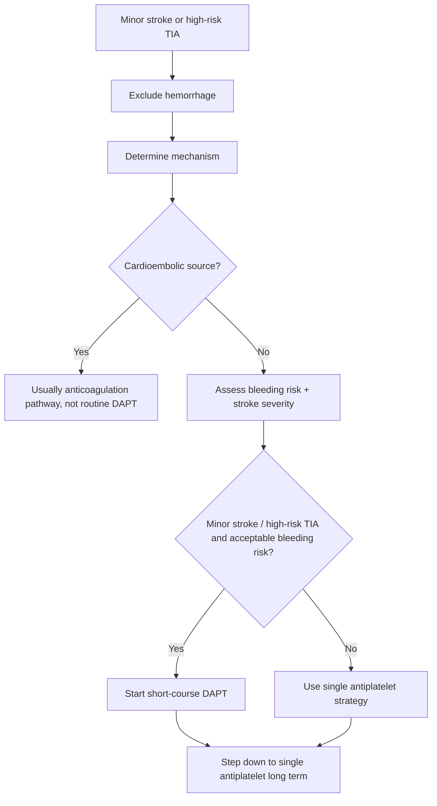
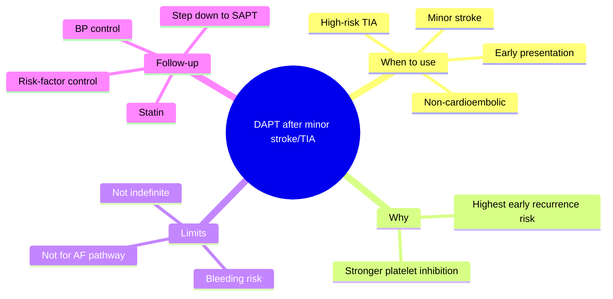
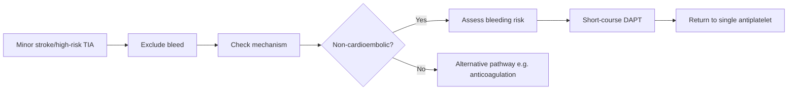

# Dual antiplatelet therapy after minor stroke or TIA

Related: [[../Stroke Medicine MOC|Stroke Medicine MOC]] · [[../Secondary Prevention|Secondary Prevention]] · [[Antithrombotic strategies|Antithrombotic strategies]] · [[Antiplatelet therapy after ischaemic stroke|Antiplatelet therapy after ischaemic stroke]] · [[Anticoagulation timing after cardioembolic stroke|Anticoagulation timing after cardioembolic stroke]] · [[../Transient Ischaemic Attack/Transient ischaemic attack|Transient ischaemic attack]]

> [!important]
> **Dual antiplatelet therapy (DAPT)** has a **selected early short-term role** after **minor ischaemic stroke** or **high-risk TIA**. It is useful because early recurrence risk is highest in the first hours to days, but prolonged DAPT increases bleeding risk and is **not routine long-term therapy**.

## Learning Objectives
- Define DAPT and explain its role after minor stroke or high-risk TIA.
- Identify which patients are appropriate candidates and when DAPT should be avoided.
- Summarize timing, bleeding cautions, and the transition back to single-agent therapy.

## Definition
**Dual antiplatelet therapy** means using two platelet-inhibiting drugs together, usually **aspirin + clopidogrel**, for a limited period to reduce early recurrent non-cardioembolic cerebral ischaemic events after **minor ischaemic stroke** or **high-risk TIA**.

## Core Anatomy
- DAPT is aimed at preventing recurrent **arterial platelet-rich thrombosis** in cerebral and carotid circulation.
- It is most relevant in **non-cardioembolic** mechanisms such as large-artery atherosclerosis and some small-vessel/minor stroke syndromes.
- It is not the preferred long-term strategy for **atrial fibrillation-related embolic events**.

## Core Physiology
- **Aspirin** inhibits thromboxane-mediated platelet activation.
- **Clopidogrel** inhibits ADP-mediated platelet activation via the P2Y12 receptor.
- Combining both produces stronger early inhibition of platelet aggregation than either alone.
- The clinical benefit is greatest in the **very early recurrence-risk window**, while the bleeding cost rises if therapy is prolonged unnecessarily.

## Normal Values / Important Cut-offs
- DAPT is most relevant in the **early period** after **minor stroke** or **high-risk TIA**.
- It should begin only after **intracranial hemorrhage is excluded**.
- Long-term routine DAPT is generally avoided because bleeding risk rises over time.
- Major bleeding history, severe thrombocytopenia, or active ulcer disease materially affect safety.

## Classification
### By indication
- Minor non-cardioembolic ischaemic stroke
- High-risk TIA

### By intended duration concept
- **Short-course DAPT** for selected early recurrence prevention
- **Long-term single antiplatelet therapy** afterward

## Etiology / Causes
This topic concerns treatment after events typically caused by platelet-mediated non-cardioembolic mechanisms such as:
- Large-artery atherosclerotic embolism
- Small-vessel disease causing minor stroke
- High-risk TIA from unstable arterial disease

## Risk Factors
### For recurrent early stroke
- Hypertension
- Diabetes mellitus
- Smoking
- Dyslipidaemia
- Symptomatic carotid disease
- Prior TIA/stroke

### For bleeding on DAPT
- Previous GI bleed or peptic ulcer disease
- Advanced age/frailty
- Concomitant anticoagulants or NSAIDs
- Thrombocytopenia/coagulopathy
- Renal impairment
- Uncontrolled hypertension

## Pathophysiology
After minor stroke or high-risk TIA, the culprit lesion may remain unstable and prone to recurrent platelet-rich thrombosis. In the first few days, recurrence risk is highest. DAPT suppresses platelet activation more effectively than single-agent therapy during this critical interval, reducing recurrent events, but the price is increased bleeding risk if continued too long or used in the wrong patient.

## Clinical Features
### Clinical situations supporting DAPT consideration
- Minor non-cardioembolic ischaemic stroke with persistent but limited deficit
- High-risk TIA with concerning recurrence potential
- Early presentation after symptom onset
- Acceptable bleeding risk

### Situations arguing against routine DAPT
- Major disabling stroke with high hemorrhagic risk
- Suspected or proven cardioembolic source needing anticoagulation pathway
- Intracerebral hemorrhage or hemorrhagic transformation
- Active major bleeding or severe ulcer disease

## Approach / Algorithm

## Investigations
### Before/around decision
- Brain imaging to exclude hemorrhage
- CBC including platelet count
- Medication history including anticoagulants and NSAIDs
- BP assessment
- Renal function when broader antithrombotic planning matters

### Mechanism workup
- ECG / telemetry for AF
- Carotid imaging if large-artery disease suspected
- Echocardiography in selected cases
- Lipids and HbA1c for overall secondary prevention

## Interpretation Frameworks
### When DAPT is more appropriate than SAPT
| Situation | Suggestion |
|---|---|
| Minor non-cardioembolic stroke presenting early | DAPT may be useful |
| High-risk TIA presenting early | DAPT may be useful |
| Major stroke with higher bleed risk | Usually avoid routine DAPT |
| AF-related event | Anticoagulation pathway generally more important |

### Key bedside questions
1. Is this definitely **non-cardioembolic**?
2. Has **hemorrhage** been excluded?
3. Is this a **minor stroke or high-risk TIA** rather than a large stroke?
4. Is the **bleeding risk acceptable**?
5. Is there a clear plan to return to **single-agent therapy**?

## Diagnosis
This is a **treatment-selection decision**, not a separate disease diagnosis. It applies to selected patients with **minor non-cardioembolic ischaemic stroke** or **high-risk TIA** after hemorrhage exclusion and bleeding-risk review.

## Differential Diagnosis
- Larger ischaemic stroke better managed with single-agent strategy initially
- Cardioembolic stroke requiring anticoagulation
- Intracerebral hemorrhage
- Stroke mimic where antiplatelet escalation is unnecessary
- Hemorrhagic transformation of infarct

## Tables / Comparison Charts
### SAPT vs DAPT after minor stroke/TIA
| Feature | Single antiplatelet | Dual antiplatelet |
|---|---|---|
| Typical use | Standard long-term prevention | Selected short-term early prevention |
| Bleeding risk | Lower | Higher |
| Best niche | Broader long-term use | Early minor stroke/high-risk TIA |
| Duration | Long term | Limited course |

### Common exam mistakes
| Mistake | Why wrong |
|---|---|
| Using DAPT indefinitely | Bleeding risk rises without routine long-term benefit |
| Using DAPT for AF-related stroke instead of anticoagulation | Wrong mechanism-based strategy |
| Starting before bleed exclusion | Unsafe |
| Assuming every stroke patient needs DAPT | Overtreatment |

## Management
### Core principles
- Exclude hemorrhage first.
- Confirm a **minor non-cardioembolic stroke** or **high-risk TIA** scenario.
- Start DAPT early if appropriate and bleeding risk is acceptable.
- Plan a **time-limited course** followed by **single antiplatelet therapy**.

### Drug strategy
- Common regimen: **aspirin + clopidogrel**.
- Avoid casual prolongation beyond the intended short course.
- If patient is not an appropriate DAPT candidate, use single-agent therapy instead.

### Broader secondary prevention
- Statin therapy
- BP control
- Diabetes management
- Smoking cessation
- Carotid evaluation/intervention if indicated
- AF search so that cardioembolic cases are not left on the wrong pathway

## Drug Interactions / Contraindications / Comorbidity Cautions
- Combining DAPT with **anticoagulation** markedly increases bleeding risk unless there is a compelling specialist reason.
- NSAIDs and steroids increase GI bleeding risk.
- Recent major GI bleed, severe thrombocytopenia, or active hemorrhage are major cautions.
- Uncontrolled hypertension increases intracranial bleeding risk.
- After thrombolysis, antiplatelet timing must follow post-thrombolysis imaging/safety protocol.

## Procedures / Indications / Contraindications
- DAPT itself is medical therapy, but it interacts with procedural planning such as **carotid endarterectomy/stenting** and other invasive procedures because of bleeding risk.

## Procedure Mini-Sections
- **Procedure-related scenario:** Carotid intervention after minor stroke/TIA
- **Indications:** Symptomatic carotid stenosis with suitable anatomy
- **DAPT relevance:** May reduce early artery-to-artery recurrence while definitive vascular planning proceeds in selected cases
- **Cautions:** Coordinate with surgical/endovascular bleeding-risk planning
- **Viva pearl:** DAPT is a bridge for selected early recurrence prevention, not a substitute for mechanism-directed definitive care

## Complications
- GI bleeding
- Bruising
- Intracranial bleeding
- Drug intolerance/allergy
- Recurrent stroke if wrong mechanism selected or therapy delayed

## Red Flags / Emergencies
- New severe headache or neurological worsening after starting therapy
- GI bleed symptoms: melena, hematemesis, syncope
- Discovery of AF or another cardioembolic source while on DAPT alone
- Major fall in hemoglobin or platelet complications

## Prognosis
In the right selected patient, early short-course DAPT lowers recurrent stroke risk during the highest-risk early window. Prognosis is worse when therapy is delayed, prolonged inappropriately, or used in patients who actually need another pathway such as anticoagulation or urgent carotid intervention.

## Topic Correlation
- [[Antiplatelet therapy after ischaemic stroke|Antiplatelet therapy after ischaemic stroke]]
- [[Anticoagulation timing after cardioembolic stroke|Anticoagulation timing after cardioembolic stroke]]
- [[Carotid stenosis and carotid endarterectomy indications|Carotid stenosis and carotid endarterectomy indications]]
- [[../Transient Ischaemic Attack/Transient ischaemic attack|Transient ischaemic attack]]
- [[../Acute Ischaemic Stroke/Acute ischaemic stroke|Acute ischaemic stroke]]

## Special Situations
- **High-risk TIA with carotid disease:** DAPT may be used while urgent carotid evaluation proceeds.
- **Elderly frail patient:** benefit-risk discussion must be stricter.
- **Peptic ulcer history:** GI protection and bleeding-risk mitigation matter.
- **AF later detected:** switch away from a pure antiplatelet logic if anticoagulation is indicated.

## FCPS/MRCP High-Yield Points
- DAPT is **not for every stroke**.
- Its classic exam role is **early short-course use after minor stroke or high-risk TIA**.
- Long-term prevention usually returns to **single antiplatelet therapy**.
- Exclude hemorrhage and check for **AF/cardioembolic source** first.
- Bleeding risk is the main limitation.

## Common Viva Questions
1. What is the role of DAPT after minor stroke or TIA?
2. Why is DAPT not continued indefinitely in most patients?
3. Which patients should be considered for anticoagulation instead?
4. What are the main complications of DAPT?
5. Why must hemorrhage be excluded before starting therapy?

## Common Confusions / Exam Traps
- Using DAPT long term without indication.
- Using DAPT in AF-related stroke instead of anticoagulation.
- Treating a major stroke exactly like a minor stroke in antiplatelet planning.
- Forgetting GI bleeding risk and NSAID co-use.
- Starting DAPT before brain imaging excludes bleed.

## Mnemonics
- **DAPT = Double early, then step down**
- **MINOR/HIGH-RISK = think short-course DAPT**

## Mind Map

## Flowchart

## Suggested Visuals / Image Notes
- SAPT vs DAPT stroke prevention decision card
- Mechanism-based antithrombotic pathway diagram
- Early recurrence-risk timeline after TIA/minor stroke

## Suggested Video References
- TIA/minor stroke early secondary prevention review
- Antiplatelet vs anticoagulation stroke prevention teaching
- High-yield stroke antithrombotics pharmacology summary

## One-Page Revision Summary
### Dual Antiplatelet Therapy After Minor Stroke or TIA at a Glance
- **Use:** selected early short-course therapy after **minor non-cardioembolic stroke** or **high-risk TIA**
- **Common drugs:** aspirin + clopidogrel
- **Why:** recurrence risk is highest in the first hours to days
- **Must exclude:** intracranial hemorrhage
- **Must avoid common mistake:** using DAPT indefinitely or for AF-related stroke instead of anticoagulation
- **End point:** step down to **single antiplatelet therapy**

## 24-Hour Recall Prompts
- Who are the classic candidates for DAPT after stroke/TIA?
- Why is DAPT not indefinite?
- Name three bleeding-risk cautions.
- When should anticoagulation be considered instead?
- What is the long-term plan after short-course DAPT?

## 7-Day / 15-Day / 30-Day Revision Tracker
- **Day 1:** Recite the indication for DAPT from memory.
- **Day 7:** Compare SAPT, DAPT, and anticoagulation pathways.
- **Day 15:** Practice 5 short clinical scenarios.
- **Day 30:** Redo MCQs/SBAs and identify bleeding-risk knowledge gaps.

## Must Know / Should Know / Nice to Know
### Must Know
- Minor non-cardioembolic stroke/high-risk TIA = classic DAPT niche
- Short-term only
- Exclude hemorrhage first
- Not a substitute for anticoagulation in AF
- Bleeding risk is the major caution

### Should Know
- Step-down to SAPT concept
- Carotid-disease context
- NSAID/GI bleed interaction risk

### Nice to Know
- Trial-level nuances beyond core exam need
- Detailed peri-procedural considerations

## My Weak Points
- Do I remember DAPT is short-term, not indefinite?
- Do I correctly separate AF-related from non-cardioembolic prevention?
- Can I identify who is “minor stroke/high-risk TIA” clinically?

## Self-Test Scorecard
- Understanding /10
- Recall /10
- Mechanism-based triage /10
- MCQ performance /10
- Viva confidence /10

**Guide:**
- **<35/50** = weak topic
- **35–44/50** = acceptable but not secure
- **45+/50** = strong exam-ready topic

## Exam Answer Modes
### Long-answer skeleton
1. Definition
2. Indications
3. Mechanism and rationale
4. Contraindications/bleeding risks
5. Transition back to SAPT

### Short-note skeleton
- What DAPT is
- Who gets it
- Why only short term
- Major cautions
- Long-term follow-up plan

### Viva skeleton
- “Who should receive DAPT after stroke?”
- “Why only short-term?”
- “What if AF is discovered?”
- “What are the main complications?”

## Summary
DAPT after minor stroke or high-risk TIA is a **selected early secondary-prevention strategy** for **non-cardioembolic** events. It works best during the high-risk early recurrence period, but because bleeding risk rises with prolonged use, it should generally be used as a **short-course intervention** followed by **single antiplatelet therapy**. The main exam principles are hemorrhage exclusion, mechanism-based selection, and avoidance of the common error of using DAPT instead of anticoagulation in AF-related stroke.

## MCQs (10)
1. Dual antiplatelet therapy after stroke is classically most appropriate for:
   A. Major intracerebral hemorrhage  
   B. Minor non-cardioembolic ischaemic stroke  
   C. Status epilepticus  
   D. Chronic migraine

2. Which combination is most commonly meant by DAPT in this context?
   A. Aspirin + clopidogrel  
   B. Warfarin + heparin  
   C. Aspirin + alteplase  
   D. Insulin + statin

3. The main reason DAPT is not usually continued long term after minor stroke/TIA is:
   A. It loses all pharmacologic effect after 24 hours  
   B. Bleeding risk increases with prolonged use  
   C. It causes hydrocephalus  
   D. It is useful only in children

4. Before starting DAPT, the most important imaging-related safety step is to:
   A. Prove hemorrhage  
   B. Exclude intracranial hemorrhage  
   C. Perform spinal MRI  
   D. Order skull X-ray

5. Which mechanism usually argues against routine DAPT and toward another long-term strategy?
   A. AF-related cardioembolism  
   B. Small-vessel disease  
   C. Carotid plaque instability  
   D. Non-cardioembolic TIA

6. Which is a major complication of DAPT?
   A. GI bleeding  
   B. Cataract  
   C. Osteoarthritis  
   D. Hypothyroidism

7. Long-term prevention after a short DAPT course usually transitions to:
   A. No therapy at all  
   B. Single antiplatelet therapy  
   C. Routine triple therapy  
   D. Permanent alteplase infusion

8. Which clinical scenario best fits DAPT consideration?
   A. High-risk TIA presenting early with acceptable bleeding risk  
   B. Pontine hemorrhage  
   C. Chronic neuropathic pain  
   D. Bell palsy

9. Which medication history increases bleeding concern with DAPT?
   A. NSAID use  
   B. Vitamin D use  
   C. Inhaled bronchodilator use  
   D. Topical emollient use

10. The main pathophysiologic rationale for DAPT is:
    A. Stronger early suppression of platelet-rich arterial thrombosis  
    B. Lowering intracranial pressure  
    C. Treating cerebral edema  
    D. Dissolving chronic hematoma

## SBA Questions (10)
1. A 66-year-old man presents early after a minor non-cardioembolic ischaemic stroke. CT excludes bleed and bleeding risk is acceptable. What is the best antithrombotic concept?  
   A. Short-course dual antiplatelet therapy may be appropriate  
   B. No treatment is needed  
   C. Long-term triple therapy is standard  
   D. Warfarin is always mandatory  
   E. Thrombolysis is the only prevention strategy

2. A 72-year-old woman has a high-risk TIA and no AF. What is the key reason DAPT may be useful early?  
   A. Early recurrence risk is high  
   B. It cures carotid stenosis permanently  
   C. It replaces all statin therapy  
   D. It lowers ICP  
   E. It treats hemorrhage

3. A patient on DAPT after minor stroke is found to have new-onset AF. What principle becomes most important?  
   A. Mechanism-based strategy may need to change toward anticoagulation  
   B. DAPT should automatically be lifelong  
   C. All antithrombotics must stop forever  
   D. Brain imaging is no longer useful  
   E. GI risk becomes impossible

4. A patient with minor stroke has active upper GI bleeding. What is the most appropriate principle?  
   A. DAPT may be unsafe because bleeding risk is high  
   B. DAPT should always be started regardless  
   C. All stroke mechanisms are treated identically  
   D. GI bleeding is irrelevant to antiplatelet decisions  
   E. Use triple therapy instead

5. Why must DAPT usually be time-limited?  
   A. Platelets disappear after 1 week  
   B. Bleeding risk rises if it is prolonged unnecessarily  
   C. It always causes kidney failure  
   D. It converts stroke into hemorrhage in every patient  
   E. It cannot be combined with statins

6. What is the usual long-term follow-up strategy after a short DAPT course?  
   A. Transition to single antiplatelet therapy  
   B. Stop all prevention  
   C. Continue DAPT forever  
   D. Switch everyone to thrombolysis  
   E. Use corticosteroids

7. Which patient best fits the classic DAPT niche?  
   A. Early high-risk TIA without major bleeding risk  
   B. Major lobar ICH  
   C. Hemorrhagic transformation  
   D. Chronic tension headache  
   E. Advanced Parkinson disease

8. Which co-medication is a classic bleeding-risk concern with DAPT?  
   A. Ibuprofen  
   B. Topical moisturizer  
   C. Inhaled saline  
   D. Artificial tears  
   E. Vitamin C only

9. The biggest prevention mistake after AF-related stroke would be to:  
   A. Leave the patient on DAPT alone without addressing anticoagulation  
   B. Check an ECG  
   C. Control blood pressure  
   D. Give a statin  
   E. Counsel smoking cessation

10. Which statement about DAPT after minor stroke/TIA is most accurate?  
    A. It is selective, early, and short term  
    B. It is mandatory lifelong for all strokes  
    C. It replaces mechanism workup  
    D. It is for hemorrhagic stroke  
    E. It removes the need for risk-factor control

## Flashcards
- Q: What does DAPT usually mean after minor stroke/TIA?  
  A: Aspirin plus clopidogrel.
- Q: What is the classic use of DAPT in stroke medicine?  
  A: Early short-course therapy after minor non-cardioembolic stroke or high-risk TIA.
- Q: Why is DAPT not continued indefinitely in most patients?  
  A: Bleeding risk rises with prolonged use.
- Q: What must be excluded before starting DAPT?  
  A: Intracranial hemorrhage.
- Q: What major mechanism makes DAPT alone the wrong long-term strategy?  
  A: AF-related cardioembolic stroke.
- Q: Name one important GI bleeding-risk factor for DAPT.  
  A: Previous peptic ulcer disease or NSAID use.
- Q: What is the usual next step after short-course DAPT?  
  A: Transition to single antiplatelet therapy.
- Q: What is the early clinical rationale for DAPT?  
  A: Highest recurrence risk is in the first hours to days.
- Q: What serious complication besides GI bleeding should be remembered?  
  A: Intracranial bleeding.
- Q: Does DAPT replace statins and BP control?  
  A: No, it is only one part of secondary prevention.

## Answer Key with Explanations
### MCQs
1. **B** — DAPT has a selected role after minor non-cardioembolic stroke.  
2. **A** — Aspirin plus clopidogrel is the common exam combination.  
3. **B** — Bleeding risk is the main reason long-term DAPT is avoided.  
4. **B** — Hemorrhage must be excluded before DAPT is started.  
5. **A** — AF-related stroke usually requires anticoagulation pathway thinking.  
6. **A** — GI bleeding is a major complication.  
7. **B** — Long-term therapy usually returns to single antiplatelet treatment.  
8. **A** — High-risk TIA presenting early with acceptable bleed risk fits the classic niche.  
9. **A** — NSAIDs add important bleeding risk.  
10. **A** — DAPT works by stronger early inhibition of platelet-rich thrombosis.

### SBAs
1. **A** — This is the classic selected scenario for short-course DAPT.  
2. **A** — Early recurrence risk is highest soon after TIA/minor stroke.  
3. **A** — Detection of AF changes the long-term mechanism-based strategy.  
4. **A** — Active GI bleeding is a major caution against DAPT.  
5. **B** — The main reason DAPT is limited is bleeding risk with prolonged use.  
6. **A** — The usual follow-up is step-down to single antiplatelet therapy.  
7. **A** — Early high-risk TIA without major bleeding risk fits the standard indication.  
8. **A** — Ibuprofen/NSAID co-use is a classic bleeding concern.  
9. **A** — DAPT alone is the wrong long-term strategy for AF-related cardioembolic stroke if anticoagulation is indicated.  
10. **A** — DAPT is a selective early short-term strategy, not a universal lifelong one.

## PasTest Scenario SBAs (Clinical Vignettes)

> **Auto-generated PasTest/Mediscope-style scenario SBAs** grounded in the authored source. Each scenario tests a real clinical fact (triad, specific sign, contraindication, trial, first-line Rx) extracted from the topic. *Source: Ch 27: Neurology & Stroke — Dual antiplatelet therapy after minor stroke or TIA*

**Q1.** What is the most appropriate first-line therapy for Dual antiplatelet therapy after minor stroke or TIA?

  - **A.** Start DAPT early if appropriate and bleeding risk is acceptable
  - **B.** An advanced/surgical therapy reserved for refractory disease
  - **C.** Symptomatic treatment only, no disease-modifying therapy
  - **D.** Empiric broad-spectrum therapy without specific indication

  > **Answer: A** — Start DAPT early if appropriate and bleeding risk is acceptable
  >
  > *Source:* Start DAPT early if appropriate and bleeding risk is acceptable.

